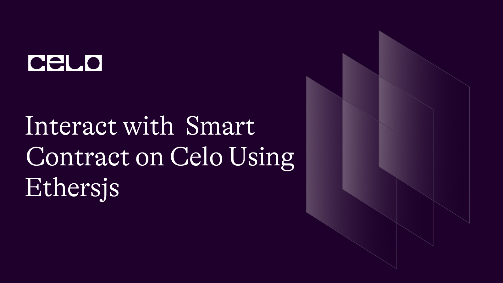
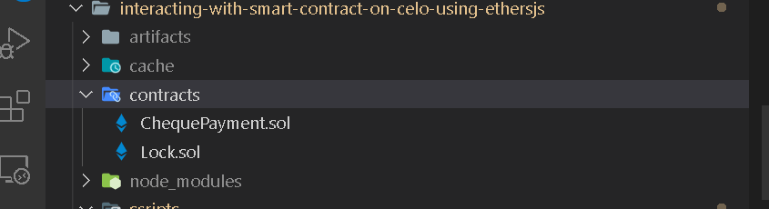

## Introduction

Ethers.js is a library for interacting with Ethereum-compatible blockchain protocols. Often, it is preferred due to its lightweight capability as it is only a library, unlike web3js which is a framework. Celo operates Ethereum-like APIs fully compatible with Ethereum-style JSON RPC invocations. Developers can leverage this compatibility and use the Ethers.js library to interact with a Celo mainnet or Alfajores as if it was on Ethereum.

## Prerequisites​

- You must be at least an intermediate in Smart contract development using Solidity.

- We will make use of Typescript, so it is expected that you have experience working with Typescript and Javascript.

- You should be familiar with using hardhat for developing smart contracts. Refer to **[example tutorial](https://docs.celo.org/blog/tutorials/getting-started-on-celo-with-hardhat)** to get started.

- An account was created on Celo's Alfajores. You don't have to run a node for yourself as Alfajores provides us with a public node.

## Requirements​

- An editor or IDE. I recommend VSCode.
- Install NodeJs version >=14.0.0.

**Setting up development environment**
To get started, we'll need a directory to store all the files we'll be creating in this guide. Create the directory and navigate into it.

```bash
mkdir interact-with-smart-contract-on-celo-using-web3js
cd interact-with-smart-contract-on-celo-using-web3js
```

We are using hardhat, but you should not be limited to it. If you can work with others tools, go ahead to complete the setup before continuing with this tutorial otherwise follow these steps.

- Creating a hardhat project

```bash Yarn
yarn add hardhat
```

```bash npm
npm install hardhat
```

Install the `openzeppelin` library.

```bash yarn
yarn add '@openzeppelin/contracts'
```

```bash npm
npm install '@openzeppelin/contracts'
```

Now that hardhat is installed in your project, let's set up a hardhat project. Run:

```bash
npx hardhat
```

Choose the `typescript` option, then install the required dependencies provided in the terminal.

- Proceed into the `contracts` folder from the current project directory, and create a new solidity file. Name it `ChequePayment.sol`.

```bash
cd contracts
```

Now, you should have two files under the contracts folder.

- interact-with-smart-contract-on-celo-using-web3js
  - contracts
    - ChequePayment.sol
    - Lock.sol



Open the `ChequePayment.sol` file and paste the following code

```js
  // SPDX-License-Identifier: MIT
  pragma solidity 0.8.18;

  import "@openzeppelin/contracts/access/Ownable.sol";
  import "@openzeppelin/contracts/utils/math/SafeMath.sol";
  import "@openzeppelin/contracts/utils/Address.sol";

  contract ChequePayment is Ownable {
    using SafeMath for uint256;

    error InsufficientBalance(uint actualBalance, uint intendedCheque);
    error InsufficientCreditToPayCheque(uint balance, uint actualValue);
    error ChequeExpired(uint validTill, uint currentTimestamp);
    error InsufficientValueToCoverCheque(uint incomingValue);
    error ValueExceedReducer(uint value, uint reducer);
    error PeriodOutOfBound(uint);
    error CancellationGraceElapsed();
    error NoChequeForCaller(address);
    error PayeeIsZeroAddress(address);

    event ChequeDrawn (address indexed payee, uint value);
    event ChequeWithdrawn (uint dateWithdrawn, address beneficiary, uint amount);

    uint private nonce;
    uint public openCheques;
    uint public immutable trGas;

    struct ChequeInfo {
      uint dateDrawn;
      uint validTill;
      uint value;
    }

    mapping (address => ChequeInfo) public payees;

    constructor() {
      trGas = 22000 * 21;
    }

    receive() payable external {}

    /**@dev Draws a new cheque in favor of beneficiary - payee
     * @param validityWindowInHrs - Period within which cheque is valid
     *
     */
    function drawCheque(address payee, uint amount, uint8 validityWindowInHrs) public payable onlyOwner {
      _safeGuardCheques(amount, msg.value);
      if(validityWindowInHrs >= type(uint8).max) revert PeriodOutOfBound(validityWindowInHrs);
      if(payee == address(0)) revert PayeeIsZeroAddress(payee);
      uint vwIh = _now().add(validityWindowInHrs * 1 hours);
      payees[payee] = ChequeInfo(
        _now(),
        vwIh,
        amount
      );

      emit ChequeDrawn(payee, amount);
    }

    function cancelDrawnCheque(address payee) public onlyOwner {
      ChequeInfo memory cInfo = payees[payee];
      if(_now() >= cInfo.dateDrawn.add(6 hours)) revert CancellationGraceElapsed();
      if(openCheques >= cInfo.value) openCheques = openCheques.sub(cInfo.value);
      payees[payee] = ChequeInfo(0, 0, 0);
    }

    function reduceChequeValue(address payee, uint reducer) public onlyOwner {
      openCheques = openCheques.sub(reducer);
      ChequeInfo memory ci = payees[payee];
      if(ci.value < reducer) revert ValueExceedReducer(ci.value, reducer);
      unchecked {
        payees[payee].value = ci.value - reducer;
      }
    }

    function _safeGuardCheques (uint amount, uint incomingValue) internal {
      uint balance = address(this).balance;
      uint _supposetotalCheques = openCheques.add(amount).add(trGas);
      if(_supposetotalCheques > balance) {
        if(incomingValue < _supposetotalCheques.sub(balance)) revert InsufficientValueToCoverCheque(incomingValue);
      }
      unchecked {
        openCheques += amount;
      }
    }

    function increaseChequeValue(address payee, uint amount) public payable onlyOwner {
      _safeGuardCheques(amount, msg.value);
      ChequeInfo memory ci = payees[payee];
      require(ci.value > 0, "Payee not found");
      payees[payee].value = ci.value + amount;
    }

    function cashout() public {
      ChequeInfo memory cInfo = payees[_msgSender()];
      if(cInfo.value == 0) revert NoChequeForCaller(_msgSender());
      if(_now() > cInfo.validTill) revert ChequeExpired(cInfo.validTill, _now());
      payees[_msgSender()] = ChequeInfo(0, 0, 0);
      uint balance = address(this).balance;
      uint transferAmt = cInfo.value;
      if(balance < cInfo.value.add(trGas)) revert InsufficientCreditToPayCheque(balance, cInfo.value.add(trGas));
      require(openCheques >= transferAmt, "Cheque anomally");
      openCheques = openCheques.sub(transferAmt);
      Address.sendValue(payable(_msgSender()), cInfo.value);
    }

    function _now() internal view returns(uint) {
      return block.timestamp;
    }
  }

```

**Explaining what the code does**

This is a simple cheque payment contract that enables the owner - _drawer_ to issue a cheque in favor of another party - _payee_. The party on whom the cheque will be drawn is the smart contract acting as the bank called the _drawee_. The cheque can be valid over a stipulated period of time specified by the drawer at the time the cheque was drawn. If the time elapsed, the payee will be denied to the withdrawal of the cheque.

In the contract, only account with `onlyOwner` access can perform the following functions except for `cashout`:

- `drawCheque`: A payable function that accepts three arguments:

1. _payee_ : Account address of the beneficiary.
2. _amount_: Cheque value.
3. _validityWindowInHrs_: Period through which the cheque is valid.

In the `drawCheque()`, we called the `_safeGuardCheques`, an internal function that ensures the Celo balance in the contract always corresponds to the opened cheques. That way the drawer cannot issue a bounced cheque. In this context, a bounced cheque is a situation where the payee wants to cash out but the balance in the contract cannot cover the cheque value. If we do not provide a guard, the owner could trick the payee to have written a valid cheque if the payee does not have a way to confirm the contract balances. Even though the owner wedge more power to do an undo, the concept of decentralization demands that the payees need not trust the owner to cash out cheques that were written for them.

- `cancelDrawnCheque`
  It accepts the address of the payee as an argument. The successful invocation cancels all cheques drawn in favor of the `payee`.

- `increaseChequeValue`
  The account owner may wish to increase the cheque value for any valid addresses. The 'increaseChequeValue()' adds up to the value on the cheque for the target address. This is different from the `drawCheque()` that overrides the value in storage rather than increments it.

- `reduceChequeValue` performs similar functionality as `increaseChequeValue` except the value reduces instead of increasing.

- `cashout`
  This function is callable by anyone for whom a cheque was drawn.

**Compile**
Compile the contract by running the following command.

```bash
npx hardhat compile
```

If you follow the steps accordingly, your contract should compile successfully.

**Deploy, Interact with the contract**

To interact with the contract, firstly, we will need to deploy it to the Celo test network.

**Installation**

No need to install the `ethers` library again. It was already included in the dependencies during the hardhat setup.

Now that we have all the dependencies installed, we'll write a script for the purpose of deploying and interacting with the contract. Firstly, create a `accountUtils.ts` file that exports an object containing the utilities we need for the program. This is to reduce the amount of code we'll keep in the main script.

Inside the `script` folder, make a new file.

```bash
touch accountsUtils.ts
```

- Import the `ethers` package.

```ts accountsUtils.ts
import { ethers } from "ethers";
```

Declare a few constant variables with values assigned to them.

- export types and interfaces. We'll need it later in our program to avoid Typescript errors.

```ts accountsUtils.ts
export type CNumber = BigNumberish;
export interface TrxProps {
  data?: string;
  to?: string;
  value?: string;
  functionName: string;
  signer: Wallet;
}

export interface TrxProps {
  data?: string;
  to?: string;
  privateKey?: string;
  gas?: string | number;
  gasPrice?: CNumber;
  value?: CNumber;
  functionName: string;
}
```

- Declare and set the validity window variable to 1. You can use any number not greater than 255. For testing purposes, it makes sense to set it to a lower boundary. This is the period during which cheques are valid. We'll need it as an argument for the `DrawCheque` function.

```ts accountsUtils.ts
const VALIDITY_WINDOW_IN_HRS = 1;
```

- Set the gas limit and gasPrice. The utility function that requires these variables as arguments expect them to be parsed as `string`. It should be hexadecimal. Use the `hexlify` function from the `ethers.utils` module to convert them to `hex`.

  - First, let's create a reusable function for this purpose.

  ```ts accountsUtils.ts
  const hexlify = (x: number) => {
    return ethers.utils.hexlify(x);
  };

  const GAS = hexlify(1500000);

  const GASPRICE = hexlify(3000000000);
  ```

  - Set the socket url. We are going to send transactions to Celo's test network using the WebSocket provider.

  ```ts accountsUtils.ts
  const SOCKET_URL = "wss://alfajores-forno.celo-testnet.org/ws";
  ```

- Create the RPC configuration to set up the WebSocket provider.

```ts accountUtils.ts
const rpcInfo = Object.assign(
  {},
  {
    CELOALFAJORES: {
      name: "Alfajores",
      rpc: SOCKET_URL,
      chainId: 44787,
    },
  }
);

const webSocketProvider = new ethers.providers.WebSocketProvider(
  rpcInfo.CELOALFAJORES.rpc,
  {
    chainId: rpcInfo.CELOALFAJORES.chainId,
    name: rpcInfo.CELOALFAJORES.name,
  }
);
```

- To send transactions, we need a wallet. The `ethers` library provides a module for generating a wallet instance.

Using `ethers.Wallet`, we can construct a new wallet instance from the private key.

> Warning: It is unsafe to store private keys in javascript files. This is only for tutorial purposes. You should use a more secure way of handling private keys.

`ethers.Wallet` expects two arguments. The first is the private key of an externally owned account while the other is a provider instance if you have created one, so it is optional. You should have already created an account as a prerequisite for this course.

```ts accountsUtils.ts
  // Replace the first argument with your private keys
  const owner = new ethers.Wallet(<Paste your private key here>, webSocketProvider);
  const payee = new ethers.Wallet(<Paste your private key here>, webSocketProvider);
```

- Create an asynchronous function that scrutinizes the balances to ensure the accounts are properly set up. Inside the function, log the balances to the console.

```ts accountsUtils.ts
async function getBalances() {
  // Fetching balances using the provider
  const payee_balance_using_provider = ethers.utils.parseUnits(
    (await webSocketProvider.getBalance(payee.address)).toString(),
    "wei"
  );
  const owner_balance_using_provider = ethers.utils.parseUnits(
    (await webSocketProvider.getBalance(owner.address)).toString(),
    "wei"
  );

  // Fetching balances from the signer object
  const payee_wallet_balance = ethers.utils.parseUnits(
    (await payee.getBalance()).toString(),
    "wei"
  );
  const owner_wallet_balance = ethers.utils.parseUnits(
    (await owner.getBalance()).toString(),
    "wei"
  );

  console.log(`
    payee_balance_using_provider: ${payee_balance_using_provider}\n
    owner_balance_using_provider: ${owner_balance_using_provider}\n
    payee_wallet_balance: ${payee_wallet_balance}\n
    owner_wallet_balance: ${owner_wallet_balance}\n
    
  `);

  return {
    payee_balance_using_provider,
    owner_balance_using_provider,
    payee_wallet_balance,
    owner_wallet_balance,
  };
}
```

- Export the utilities to use anywhere in your program.

```ts accountsUtils.ts
export const utils = () => {
  return {
    ethers,
    GAS,
    GASPRICE,
    PAYEE: payee,
    OWNER: owner,
    VALIDITY_WINDOW_IN_HRS,
    webSocketProvider,
    getBalances: getBalances,
    waitForTrannsaction: async function (trx: any) {
      console.log("Waiting for confirmation ...");
      return await trx.wait(2);
    },
  };
};
```

`/scripts/deploy.ts`

In this file, we will write a script to deploy the contract, and at the same time interact with it.

- Import the `abi` and `bytecode` from the artifacts generated when the contract was compiled.

- Import the utilities from the `accountUtils` file. All imports should be outside the `main` function.

```ts
import {
  abi,
  bytecode,
} from "../artifacts/contracts/ChequePayment.sol/ChequePayment.json";

import { utils } from "./accountsUtils";
```

- Every code we'll write in this section should be inside the main function.

- Through destructuring, we'll access the utilities we exported from the `utils()`.

```ts
const {
  ethers,
  PAYEE,
  OWNER,
  getBalances,
  webSocketProvider,
  waitForTrannsaction,
  VALIDITY_WINDOW_IN_HRS,
} = utils();
```

- Invoke the `getBalance()` to confirm that we have enough Celo in the accounts.

```ts
await getBalances();
```

- The `logData` is a boolean flag that determines whether to log data to the console or not. You can always toggle it.

```ts
let logData = false;
```

- Create an instance of the Chequepayment contract. Give the `abi` as the first argument, bytecode as the second, and a signer or wallet as the last argument.

```ts
var chequePayment = new ethers.ContractFactory(abi, bytecode, OWNER);
```

- Run the deployment and wait for the transaction to be confirmed.

```ts
const chequePaymentTrx = await chequePayment.deploy();

await chequePaymentTrx.deployed();
```

- After the contract is deployed, we will instantiate deployed contract using `ethers.Contract`. This must be used with the `new` keyword since we are constructing a new contract object. It expects the `abi` as the first argument and a signer or provider are optional as the second argument.

```ts
const contractInstance = new ethers.Contract(
  chequePaymentTrx.address,
  abi,
  webSocketProvider
);
```

- First, we will create a function that fetches all opened cheques from the contract state. It returns a promise hence it should be asynchronous.

```ts
async function getOpenCheques(funcName: string) {
  await contractInstance
    .openCheques()
    .then((openCheques: { toString: () => any }) => {
      console.log(
        `\nOpenCheques balance after ${funcName} was called : ${openCheques.toString()}`
      );
    });
}
```

For every public function declared in the contract, we will create a corresponding Javascript function.

- The asynchronous function - `drawCheque()` enables only the owner account to write cheques in favor of any valid addresses regarded as the `payee`.

The method is available to us from the `contractInstance`. In ethers.js, an instance of a contract is an object with several utility members. The `connect` method is used for connecting the specific account to sign the current transaction. We must parse a signer or wallet object so it can read the encoded keys to generate a signature.

> Note: There are multiple signing methods in ethers. I mentioned Signer and Wallet, classes. VoidSigner is also a type of signer not eligible to sign a transaction.

```ts
async function drawCheque(amount: string, value: string) {
  const trx = await contractInstance
    .connect(OWNER)
    .drawCheque(PAYEE.address, amount, VALIDITY_WINDOW_IN_HRS, {
      value: value,
    });
  await waitForTrannsaction(trx).then(async function (receipt: any) {
    logData && console.log("\nDrawCheque Trx hash", receipt.transactionHash);
    await getOpenCheques("DrawCheque");
  });
}
```

- With `increaseCheque()`, the owner can increase the value of a drawn cheque with `amount` parsed as an argument.

```ts
async function increaseCheque(amount: string, msgValue: string) {
  const trx = await contractInstance
    .connect(OWNER)
    .increaseChequeValue(PAYEE.address, amount, { value: msgValue });
  await waitForTrannsaction(trx).then(async function (receipt: any) {
    logData && console.log("\nTrx receipt: ", receipt.transactionHash);
    await getOpenCheques("IncreaseCheque");
  });
}
```

- The value on an already drawn cheque will reduce when the `reduceCheque()` is invoked. This method changes the state of the blockchain so it requires transaction signing.

```ts
async function reduceCheque(amount: string) {
  const trx = await contractInstance
    .connect(OWNER)
    .reduceChequeValue(PAYEE.address, amount);
  await waitForTrannsaction(trx).then(async function (receipt: any) {
    logData && console.log("\nTrx receipt: ", receipt);
    await getOpenCheques("ReduceCheque");
  });
}
```

- The owner may wish to can cancel a cheque provided they're within the cancellation window. The owner must sign this transaction.

```ts
async function cancelCheque() {
  const trx = await contractInstance
    .connect(OWNER)
    .cancelDrawnCheque(PAYEE.address);
  await waitForTrannsaction(trx).then(async function (receipt: any) {
    logData && console.log("\nTrx receipt: ", receipt.transactionHash);
    await getOpenCheques("CancelCheque");
  });
}
```

- Lastly, An account - `payee` will cash out if they have cheques drawn in their favor. The transaction should be signed from the `PAYEE`'s wallet.

```ts
async function cashout() {
  const trx = await contractInstance.connect(PAYEE).cashout();
  await waitForTrannsaction(trx).then(async function (receipt: any) {
    logData && console.log("\nTrx receipt: ", receipt);
    await getOpenCheques("Cashout");
  });
}
```

- At this point, we can run the script. The functions will be invoked one after the other as they ought to have been called from the contract.

  - First, the owner writes a cheque in favor of the account - `PAYEE`. The `INIT_CHEQUE_AMOUNT` value was sent in the call.

  - `OWNER` then canceled the cheque previously drawn.

  - Again, a new cheque was drawn in favor of the same beneficiary.

  - This time, the `OWNER` increment the cheque by the `increment` value.

  - The remainder cheque balance was then reduced by `decrement` value.

  - Lastly, the `PAYEE` cashed out the cheque.

```ts
const INIT_CHEQUE_AMOUNT = "10000000000000000";

const SUB_CHEQUE_AMOUNT = "20000000000000000";

let increment = "50000000000000000";

let decrement = "40000000000000000";

const MSG_VALUE = "100000000000000000";

await drawCheque(INIT_CHEQUE_AMOUNT, MSG_VALUE);
await cancelCheque();
await drawCheque(SUB_CHEQUE_AMOUNT, MSG_VALUE);
await increaseCheque(increment, MSG_VALUE);
await reduceCheque(decrement);
await cashout();
```

From the project directory, run the command below:

```bash
npx hardhat run scripts/deploy.ts
```

Th code will be deployed to t he Celo Alfajores.

Inspect the logs in the terminal. The balance on the `opened cheques` should read `0`.

The complete code for this guide can be found **[on the github](https://github.com/bobeu/interact-with-smart-contract-on-celo-using-ethersjs)**.

## Conclusion​

From the log, we can see everything runs smoothly. We deployed and interacted with the contracts using ethers.js.

You're exposed to `ethers` library usage which is fundamental for this course.

Other things you learn are:

- Writing and compiling smart contracts using hardhat.
- How to quickly set up a hardhat development environment.

## What next?

​Although, you have learned how to use the ethersjs library. You should endeavor to practice to get acquainted with it. Create a project from the scratch without using this example, and see how well you have improved.

**[Read more aout Celo](https://docs.celo.org/tutorials)**

## About the Author​

**Isaac Jesse** , aka _Bobelr_ is a smart contract/Web3 developer. He has been in the field since 2018, worked as an ambassador with several projects like Algorand and so on as a content producer. He has also contributed to Web3 projects as a developer.

## References​

- [Celo developers resources](https://docs.celo.org/developer/)
- [Source code](https://github.com/bobeu/interact-with-smart-contract-on-celo-using-web3js)
- [Ethersjs doc](https://docs.ethers.org/v5/getting-started/)
