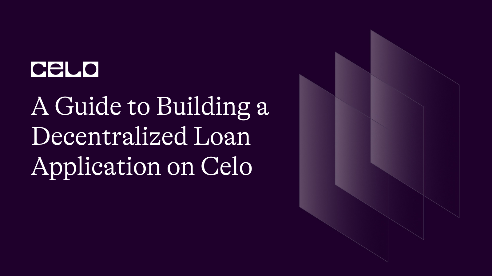

## Introduction

Welcome! Welcome!! to another tutorial written by yours truly. If you have followed my tutorial previously, you would have figured that I love building mock dapps because I find them a more straight-forward method to learning about anything.
However, in this tutorial, you would be building a decentralized loan dapp where a user would input his/her amount, it would get verified and then the user can then redeem the loan but with a fixed interest of 10%.

As always, for the new birds here, we would always start out by understanding what is celo and what the ecosystem is trying to achieve

## What is Celo

Celo is a blockchain platform that focuses on enabling mobile-first financial services. It is built using the Ethereum codebase and employs a proof-of-stake consensus mechanism for transaction validation. One unique aspect of Celo is its focus on usability and accessibility, aiming to create a more inclusive and decentralized financial system.

## Prerequisites

- Prior knowledge of javascript
- Familiarity with the command line
- Basic understanding of blockchain concepts
- Have some knowledge of solidity and its concepts

## Requirements

- **[NodeJS](https://nodejs.org/en/download)** from V12.or higher
- A code editor or text editor. **[VSCode](https://code.visualstudio.com/download)** is recommended
- A terminal. **[Git Bash](https://git-scm.com/downloads)** is recommended
- An Internet Browser and a good internet connection
- **[Remix](https://remix.ethereum.org)**
- **[Celo Extension Wallet](https://chrome.google.com/webstore/detail/celoextensionwallet/kkilomkmpmkbdnfelcpgckmpcaemjcdh?hl=en)**.

## Development of the smart contract

I dont want to bore you with my love for the remix IDE but I do love remix for writing my smart contracts and that is what we would be using in this tutorial.

Here is a preview of the Remix IDE:


On Remix, We would create a new workspace and then a new file which we would name `loan.sol`

Starting in the first line, you include a statement that specifies the license under which the code is being released.

```solidity
// SPDX-License-Identifier: MIT
pragma solidity >=0.7.0 <0.9.0;
```

The first line is a SPDX license identifier and a Solidity version pragma.

SPDX (Software Package Data Exchange) is a specification that provides a standard way to declare the license of open source software packages. The SPDX-License-Identifier is a header that specifies the license of a given source code file.
The Solidity version pragma specifies the version of the Solidity programming language used to write the smart contract code. The version range specified is greater than or equal to 0.7.0 and less than 0.9.0, meaning that the code should be compiled with a Solidity compiler version between 0.7.0 and 0.8.x.

Following that, we define an `IERC20Token` interface which enables us to interact with the celo stablecoin (cUSD).

```solidity
// SPDX-License-Identifier: MIT

pragma solidity >=0.7.0 <0.9.0;

interface IERC20Token {
  function transfer(address, uint256) external returns (bool);
  function approve(address, uint256) external returns (bool);
  function transferFrom(address, address, uint256) external returns (bool);
  function totalSupply() external view returns (uint256);
  function balanceOf(address) external view returns (uint256);
  function allowance(address, address) external view returns (uint256);

  event Transfer(address indexed from, address indexed to, uint256 value);
  event Approval(address indexed owner, address indexed spender, uint256 value);
}
```

ERC-20 tokens are a widely-used standard for creating digital assets on the Ethereum blockchain, and cUSD is one of them.

These tokens have pre-defined functions and events that can be easily used in contracts and do not require any additional implementation. For example, you will be using the ERC-20 token's interface to interact with it, so that your contract can communicate with the token.

You can find more information on how to use these functions and events in the Celo **[documentation](https://docs.celo.org/developer-guide/celo-for-eth-devs)**. The documentation also provides more details on how to interact with ERC-20 tokens and how to use them with the Celo network.

Next up, you would need to create a contract(in this case you name the contract `Loan`). You then define a `struct` called `LoanDetails` which holds information about a loan, such as the borrower's address, name, occupation, loan amount, loan tenure, and repayment status. This struct is intended to be used within the `Loan` contract to keep track of loans.

```solidity
contract Loan {
    struct LoanDetails {
        address payable borrowerAddress;
        string name;
        string borrowerHomeAddress;
        string occupation;
        string purpose;
        string nationalId;
        string verification;
        uint256 amount;
        uint256 loanTenure;
        bool isPaid;
        uint256 timestamp;
    }
...
```

Let's go over each of these fields:

- `borrowerAddress`: A payable Ethereum address representing the borrower's address.
- `name`: A string representing the name of the borrower.
- `borrowerHomeAddress`: A string representing the borrower's home address.
- `occupation`: A string representing the borrower's occupation.
- `purpose`: A string representing the purpose for which the loan is being taken.
- `nationalId`: A string representing the borrower's national identification number.
- `verification`: A string representing any verification information related to the borrower's identity or creditworthiness.
- `amount`: A uint256 value representing the amount of the loan.
- `loanTenure`: A uint256 value representing the duration of the loan in days.
- `isPaid`: A boolean flag indicating whether the loan has been paid back or not.
- `timestamp`: A uint256 value representing the time at which the loan was issued.

After this, we would declare some variables with various data types. If you would like to learn more about this dat-types, I gave a simple explanation to some data types in my previous tutorial. View it [here](https://docs.celo.org/blog/tutorials/how-to-build-car-marketplace-dapp-with-react)

```solidity
    uint256 loanLength = 0;
    uint256 loanRegistrationAmount = 1;
    mapping(uint256 => LoanDetails) internal loan;
    address internal cUsdTokenAddress =
        0x874069Fa1Eb16D44d622F2e0Ca25eeA172369bC1;
    address internal bankAddress = 0xb7BF999D966F287Cd6A1541045999aD5f538D3c6;
```

First, you declare a variable called `loanLength` and sets its value to 0. This variable is used to keep track of the number of loans registered on the contract.
Then you declare a variable called `loanRegistrationAmount` and sets its value to 1. This variable is used to indicate the amount required to register a new loan.
You then have a mapping of unsigned integers to `LoanDetails` structs. This mapping is marked as `internal`, which means it can only be accessed from within the contract. It is intended to be used to keep track of details of each loan.
Following that is a variable called `cUsdTokenAddress` and sets its value to the address of cUSD. This address is used to interact with the cUSD token contract within the Loan contract.
You then have a variable called `bankAddress` and sets its value to the Celo address of a bank. This address would act as the admin and would be used to send and receive funds from the bank within the Loan contract.

Next, you will define the modifiers in the Solidity contract. Modifiers are similar to functions, but they are used to modify the behavior of other functions or methods to which they are applied.

```solidity
    modifier isAdmin(uint256 _id) {
        require(msg.sender == bankAddress, "Accessible only to the admin");
        _;
    }

    modifier isOwner(uint256 _index) {
        require(
            msg.sender == loan[_index].borrowerAddress,
            "Accessible only to the owner"
        );
        _;
    }
```

The `isAdmin` modifier is used to restrict access to certain functions within the smart contract to only the contract itself.

The modifier takes an input parameter called `id` of type uint. It checks whether the sender of the current message, i.e. the user who is interacting with the contract, is the same as the contract itself. If the sender is not the contract, an error message "Accessible only to the admin" will be displayed and the function call will fail. If the sender is the contract, the function call will proceed and the code of the function being modified will be executed in place of the `_` placeholder.

The `isOwner` modifier takes an input parameter called `_index` of type uint. This modifier checks whether the sender of the current message is the same as the address stored in the `loan` property of the `LoanDetail` struct associated with the given `index` in the `loans` mapping.

If the sender is not the owner of that loan, then the function call will fail, and an error message "Accessible only to the owner" will be displayed. However, if the sender is the owner, then the function call will proceed, and the code of the function being modified will be executed in place of the "\_" placeholder.

_Please note that the isAdmin variable can take any address as this address would be in charge of receiving the funds and also making other changes in the smart contract_

Moving on, you would start writing the dapp functions. We would start by writing the `submitLoan` function which allows a borrower to submit a loan request to the bank. The function takes in several input parameters such as the borrower's name, address, occupation, purpose of the loan, national ID, loan amount, and tenure.

```solidity
 function submitLoan(
        string memory _name,
        string memory _borrowerHomeAddress,
        string memory _occupation,
        string memory _purpose,
        string memory _nationalId,
        uint256 _amount,
        uint256 _loanTenure
    ) public {
        require(
            IERC20Token(cUsdTokenAddress).transferFrom(
                msg.sender,
                bankAddress,
                loanRegistrationAmount
            ),
            "Error during Loan Registration"
        );

        loan[loanLength] = LoanDetails(
            payable(msg.sender),
            _name,
            _borrowerHomeAddress,
            _occupation,
            _purpose,
            _nationalId,
            "review",
            _amount,
            _loanTenure,
            false,
            block.timestamp
        );
        loanLength++;
    }

```

The function first checks if the cUSD token is transferred from the sender to the bank's address. If this transfer fails, an error message "Error during Loan Registration" will be displayed.

If the transfer is successful, the function will create a new `LoanDetails` struct instance with the borrower's details, status set to "review," and other loan-related information, such as the loan amount, tenure, and timestamp.

After that, the new `LoanDetails` instance is stored in the `loan` mapping with a new unique identifier assigned to it, and the loan length counter is incremented by one. This indicates that a new loan has been successfully registered.

The next function on the list is the `getLoans` function that allows the admin to view the loan details associated with a given index. The function takes in an index as input and checks if the caller is an admin.

```solidity
function getLoans(uint256 _index)
        public
        view
        isAdmin(_index)
        returns (
            address payable,
            string memory,
            string memory,
            string memory,
            string memory,
            string memory,
            string memory,
            uint256,
            uint256,
            bool,
            uint256
        )
    {
        LoanDetails storage loans = loan[_index];
        return (
            loans.borrowerAddress,
            loans.name,
            loans.borrowerHomeAddress,
            loans.occupation,
            loans.purpose,
            loans.nationalId,
            loans.verification,
            loans.amount,
            loans.loanTenure,
            loans.isPaid,
            loans.timestamp
        );
    }
```

If the caller is an admin, the function retrieves the `LoanDetails` struct instance from the `loan` mapping associated with the given index. The function then returns the borrower's address, name, home address, occupation, purpose of the loan, national ID, verification status, loan amount, loan tenure, repayment status, and timestamp of the loan request.

After the above function, You then write two functions in the `Loan` contract.
The first function is called `verifyApplicant` and takes an input parameter `_index` of type `uint256`.

```solidity
    function verifyApplicant(uint256 _index) public payable isAdmin(_index) {
        LoanDetails storage singleLoan = loan[_index];
        require(
            IERC20Token(cUsdTokenAddress).transferFrom(
                bankAddress,
                singleLoan.borrowerAddress,
                singleLoan.amount
            ),
            "Could not disburse funds"
        );
        singleLoan.verification = "verified";
    }

    function unVerifyApplicant(uint256 _index) public isAdmin(_index) {
        loan[_index].verification = "unverified";
    }
```

The function is restricted to be executed only by the contract owner (i.e., the `isAdmin` modifier). The function first retrieves the `LoanDetails` struct for the given `_index` from the loan mapping. Then, it transfers the loan amount from the bank account to the borrower's address by calling the `transferFrom` function of the `IERC20Token` interface. If the transfer is successful, the function will then transfer the loan amount from the bank account to the borrower's account and update the verification status of the loan to "verified".

The second function is called `unVerifyApplicant` and takes an input parameter \_index of type uint256. It reverses the verification status of a loan application. This function is also restricted to be executed only by the contract owner (i.e., the isAdmin modifier). The function simply sets the verification field of the LoanDetails structure for the given \_index to "unverified".

Following this, you would write the `redeemLoan` function to which a user can use to return the loan they borrowed with interest.

```solidity
    function reedem(uint256 _index) public payable isOwner(_index) {
        LoanDetails storage singleLoan = loan[_index];
        require(
            IERC20Token(cUsdTokenAddress).transferFrom(
                msg.sender,
                bankAddress,
                (singleLoan.amount + singleLoan.amount * 1 / 10)
            ),
            "Did not reedem loan"
        );
        singleLoan.isPaid = true;
    }
```

This function can only be called by the owner of the loan associated with the given `_index` because of the `isOwner` modifier.

Inside the function, the code retrieves the `LoanDetails` struct associated with the given `_index` from the loan mapping and stores it in a variable called `singleLoan`. The function then attempts to transfer the loan amount plus 10% interest from the investor's wallet to the `bankAddress` using the IERC20Token interface. If the transfer is successful, the `isPaid` property of `singleLoan` is set to `true` to indicate that the loan has been redeemed. If the transfer fails, an error message "Did not reedem loan" will be displayed.

Almost going to the end, you would need a way to check if a user is the admin so it can be easily implemented in whatever frontend you choose.

```solidity
    function isUserAdmin(address _address) public view returns (bool) {
        if (_address == bankAddress) {
            return true;
        }
        return false;
    }

    function getLoanLength() public view returns (uint256) {
        return loanLength;
    }
```

The `isUserAdmin` function checks if the input address \_address is equal to the bankAddress. If they are equal, it returns `true`, which means that the input address is an admin. If they are not equal, it returns `false`, which means that the input address is not an admin.

The `getLoanLength` function simply returns the length of the loan array, which represents the number of loans that have been registered in the smart contract.

Simple right?😅

Here is the full code:

```solidity
// SPDX-License-Identifier: MIT

pragma solidity >=0.7.0 <0.9.0;

interface IERC20Token {
    function transfer(address, uint256) external returns (bool);

    function approve(address, uint256) external returns (bool);

    function transferFrom(
        address,
        address,
        uint256
    ) external returns (bool);

    function totalSupply() external view returns (uint256);

    function balanceOf(address) external view returns (uint256);

    function allowance(address, address) external view returns (uint256);

    event Transfer(address indexed from, address indexed to, uint256 value);
    event Approval(
        address indexed owner,
        address indexed spender,
        uint256 value
    );
}

contract Loan {
    struct LoanDetails {
        address payable borrowerAddress;
        string name;
        string borrowerHomeAddress;
        string occupation;
        string purpose;
        string nationalId;
        string verification;
        uint256 amount;
        uint256 loanTenure;
        bool isPaid;
        uint256 timestamp;
    }

    uint256 loanLength = 0;
    uint256 loanRegistrationAmount = 1;
    mapping(uint256 => LoanDetails) internal loan;
    address internal cUsdTokenAddress =
        0x874069Fa1Eb16D44d622F2e0Ca25eeA172369bC1;
    address internal bankAddress = 0xb7BF999D966F287Cd6A1541045999aD5f538D3c6;

    modifier isAdmin(uint256 _id) {
        require(msg.sender == bankAddress, "Accessible only to the admin");
        _;
    }

    modifier isOwner(uint256 _index) {
        require(
            msg.sender == loan[_index].borrowerAddress,
            "Accessible only to the owner"
        );
        _;
    }

// submit Loans pay a fee and increase loan length
    function submitLoan(
        string memory _name,
        string memory _borrowerHomeAddress,
        string memory _occupation,
        string memory _purpose,
        string memory _nationalId,
        uint256 _amount,
        uint256 _loanTenure
    ) public {
        require(
            IERC20Token(cUsdTokenAddress).transferFrom(
                msg.sender,
                bankAddress,
                loanRegistrationAmount
            ),
            "Error during Loan Registration"
        );

        loan[loanLength] = LoanDetails(
            payable(msg.sender),
            _name,
            _borrowerHomeAddress,
            _occupation,
            _purpose,
            _nationalId,
            "review",
            _amount,
            _loanTenure,
            false,
            block.timestamp
        );
        loanLength++;
    }

    function getLoans(uint256 _index)
        public
        view
        isAdmin(_index)
        returns (
            address payable,
            string memory,
            string memory,
            string memory,
            string memory,
            string memory,
            string memory,
            uint256,
            uint256,
            bool,
            uint256
        )
    {
        LoanDetails storage loans = loan[_index];
        return (
            loans.borrowerAddress,
            loans.name,
            loans.borrowerHomeAddress,
            loans.occupation,
            loans.purpose,
            loans.nationalId,
            loans.verification,
            loans.amount,
            loans.loanTenure,
            loans.isPaid,
            loans.timestamp
        );
    }

    function verifyApplicant(uint256 _index) public payable isAdmin(_index) {
        LoanDetails storage singleLoan = loan[_index];
        require(
            IERC20Token(cUsdTokenAddress).transferFrom(
                bankAddress,
                singleLoan.borrowerAddress,
                singleLoan.amount
            ),
            "Could not disburse funds"
        );
        singleLoan.verification = "verified";
    }

    function unVerifyApplicant(uint256 _index) public isAdmin(_index) {
        loan[_index].verification = "unverified";
    }

    // function to redeem loans with a fixed interest
    function reedem(uint256 _index) public payable isOwner(_index) {
        LoanDetails storage singleLoan = loan[_index];
        require(
            IERC20Token(cUsdTokenAddress).transferFrom(
                msg.sender,
                bankAddress,
                (singleLoan.amount + singleLoan.amount * 1 / 10)
            ),
            "Did not reedem loan"
        );
        singleLoan.isPaid = true;
    }

    function isUserAdmin(address _address) public view returns (bool) {
        if (_address == bankAddress) {
            return true;
        }
        return false;
    }

    function getLoanLength() public view returns (uint256) {
        return loanLength;
    }
}
```

I am going to do something different in this tutorial by leaving the implementation of the frontend as a challenge. You can use whatever framework of your choice, you can also check out my previous tutorial to get some ideas. [Check It Out](https://docs.celo.org/blog/tutorials/how-to-build-car-marketplace-dapp-with-react).

You could also use this link to check out a sample implementation. Check [here](https://github.com/dahnny/monyara-1)

## Conclusion

In conclusion, the smart contract presented is a loan management system that allows users to submit a loan application, verify the application, and redeem the loan if approved.

## Next steps

From here, you could look into designing the frontend and challenge yourself by adding extra features to your smart contract like time stamps e.t.c.

## About the Author

Daniel Ogbuti is a web3 developer with a passion for teaching as well as learning. I would love to connect on Twitter @daniel_ogbuti

See you soon!😉
