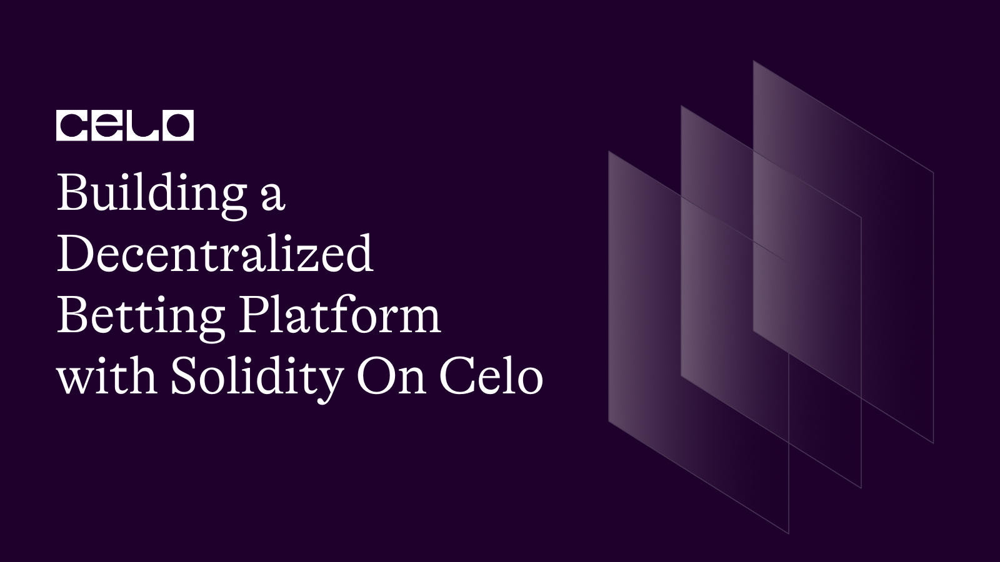

## Introduction

In this tutorial, we'll create a decentralized betting platform using Solidity. Users can place bets on the outcome of future events, and the contract owner can resolve the bets after the event has occurred. The platform ensures fair distribution of winnings and handles cases where the contract has insufficient balance to pay out all winnings.

## Prerequisites

To follow this tutorial, you will need the following:

- Basic knowledge of Solidity programming language.
- A Development Environment Like Remix.
- The celo Extension Wallet.

## SmartContract

The completed smart contract should look like this.

```solidity
// SPDX-License-Identifier: MIT
pragma solidity ^0.8.0;

contract DecentralizedBetting {
    struct Bet {
        uint256 amount;
        bool prediction;
    }

    struct Event {
        uint256 id;
        uint256 timestamp;
        bool outcome;
        bool resolved;
        uint256 totalPot;
        uint256 winningPot;
        bool emergencyStop;
    }

    address public owner;
    uint256 private nextEventId;

    mapping(uint256 => Event) public events;
    mapping(uint256 => mapping(address => Bet)) public bets;

    constructor() {
        owner = msg.sender;
        nextEventId = 1;
    }

    modifier onlyOwner() {
        require(msg.sender == owner, "Only owner can call this function.");
        _;
    }

    modifier eventNotResolved(uint256 eventId) {
        require(!events[eventId].resolved, "Event has been resolved.");
        _;
    }

    function createEvent(uint256 timestamp) external onlyOwner {
        uint256 eventId = nextEventId++;
        events[eventId].id = eventId;
        events[eventId].timestamp = timestamp;
    }

    function placeBet(uint256 eventId, bool prediction) external payable eventNotResolved(eventId) {
        require(!events[eventId].emergencyStop, "Betting is temporarily suspended.");
        require(msg.value > 0, "Bet amount must be greater than 0.");
        require(bets[eventId][msg.sender].amount == 0, "User has already placed a bet.");
        require(events[eventId].id != 0, "Invalid event ID.");

        bets[eventId][msg.sender] = Bet({
            amount: msg.value,
            prediction: prediction
        });

        events[eventId].totalPot += msg.value;
        if (prediction) {
            events[eventId].winningPot += msg.value;
        }
    }

    function resolveEvent(uint256 eventId, bool outcome) external onlyOwner eventNotResolved(eventId) {
        require(events[eventId].id != 0, "Invalid event ID.");
        require(block.timestamp >= events[eventId].timestamp, "Event has not occurred yet.");

        events[eventId].outcome = outcome;
        events[eventId].resolved = true;
    }

    function claimWinnings(uint256 eventId) external eventNotResolved(eventId) {
        require(events[eventId].resolved, "Event has not been resolved.");
        Bet storage bet = bets[eventId][msg.sender];
        require(bet.amount > 0, "User has no bet to claim.");

        if (bet.prediction == events[eventId].outcome) {
            uint256 totalPot = events[eventId].totalPot;
            uint256 winningPot = events[eventId].winningPot;
            uint256 winnings = (bet.amount * totalPot) / winningPot;

            bet.amount = 0;
            require(address(this).balance >= winnings, "Insufficient contract balance to pay out winnings.");
            payable(msg.sender).transfer(winnings);
        } else {
            bet.amount = 0;
        }
    }

    function toggleEmergencyStop(uint256 eventId) external onlyOwner {
        events[eventId].emergencyStop = !events[eventId].emergencyStop;
    }

    function withdraw() external onlyOwner {
        uint256 amount = address(this).balance;
        payable(owner).transfer(amount);
}
}
```

**Smart Contract Structure**

The `DecentralizedBetting` contract has the following main components:

1. State Variables
2. Structs
3. Modifiers
4. Functions

Let's go through each component in detail.

**1. State Variables**

```solidity
address public owner;
uint256 private nextEventId;

mapping(uint256 => Event) public events;
mapping(uint256 => mapping(address => Bet)) public bets;
```

The contract is called DecentralizedBetting and it contains the following state variables:

- owner: an address representing the owner of the contract.
- nextEventId: a uint256 representing the ID of the next event to be created.
- events: a mapping of uint256 to Event struct, where each event is identified by its ID.
- bets: a mapping of uint256 to another mapping of address to Bet struct, where each bet is identified by the ID of the event and the address of the user who placed the bet.

**2. Struct Types**

There are two struct types defined in the contract:

```solidity
   struct Bet {
        uint256 amount;
        bool prediction;
    }

    struct Event {
        uint256 id;
        uint256 timestamp;
        bool outcome;
        bool resolved;
        uint256 totalPot;
        uint256 winningPot;
        bool emergencyStop;
    }

```

- `Bet`: a struct that contains the amount of the bet and the user's prediction (true or false) for a given event.
- `Event`: a struct that contains the ID of the event, the timestamp of the event, the outcome (true or false), whether the event has been resolved, the total amount of the pot, the amount of the winning pot, and a flag to indicate whether betting is temporarily suspended.

**3. Modifiers**

There are two modifiers defined in the contract:

```solidity
modifier onlyOwner() {
        require(msg.sender == owner, "Only owner can call this function.");
        _;
    }

    modifier eventNotResolved(uint256 eventId) {
        require(!events[eventId].resolved, "Event has been resolved.");
        _;
    }

```

- `onlyOwner`: a modifier that restricts access to a function to the contract owner.
- `eventNotResolved`: a modifier that restricts access to a function to events that have not yet been resolved.

**4. Functions**

The contract contains the following functions:

```solidity
constructor() {
        owner = msg.sender;
        nextEventId = 1;
    }
```

constructor: a constructor function that sets the owner and initializes the `nextEventId` to 1.

```solidity
function createEvent(uint256 timestamp) external onlyOwner {
        uint256 eventId = nextEventId++;
        events[eventId].id = eventId;
        events[eventId].timestamp = timestamp;
    }
```

`createEvent`: a function that allows the contract owner to create a new event by specifying a timestamp. This function generates a new event ID and sets the timestamp of the event.

```solidity
 function placeBet(uint256 eventId, bool prediction) external payable eventNotResolved(eventId) {
        require(!events[eventId].emergencyStop, "Betting is temporarily suspended.");
        require(msg.value > 0, "Bet amount must be greater than 0.");
        require(bets[eventId][msg.sender].amount == 0, "User has already placed a bet.");
        require(events[eventId].id != 0, "Invalid event ID.");

        bets[eventId][msg.sender] = Bet({
            amount: msg.value,
            prediction: prediction
        });

        events[eventId].totalPot += msg.value;
        if (prediction) {
            events[eventId].winningPot += msg.value;
        }
    }
```

`placeBet`: a function that allows users to place a bet on a given event by specifying the event ID and their prediction. This function checks that the event is valid, that the user has not already placed a bet, and that the bet amount is greater than 0. It then records the bet in the bets mapping and updates the total pot and the winning pot accordingly.

```solidity
function resolveEvent(uint256 eventId, bool outcome) external onlyOwner eventNotResolved(eventId) {
        require(events[eventId].id != 0, "Invalid event ID.");
        require(block.timestamp >= events[eventId].timestamp, "Event has not occurred yet.");

        events[eventId].outcome = outcome;
        events[eventId].resolved = true;
    }
```

`resolveEvent`: a function that allows the contract owner to resolve an event by specifying the event ID and the outcome of the event. This function checks that the event is valid and that the event has occurred. It then records the outcome of the event and marks the event as resolved.

```solidity
function claimWinnings(uint256 eventId) external eventNotResolved(eventId) {
        require(events[eventId].resolved, "Event has not been resolved.");
        Bet storage bet = bets[eventId][msg.sender];
        require(bet.amount > 0, "User has no bet to claim.");

        if (bet.prediction == events[eventId].outcome) {
            uint256 totalPot = events[eventId].totalPot;
            uint256 winningPot = events[eventId].winningPot;
            uint256 winnings = (bet.amount * totalPot) / winningPot;

            bet.amount = 0;
            require(address(this).balance >= winnings, "Insufficient contract balance to pay out winnings.");
            payable(msg.sender).transfer(winnings);
        } else {
            bet.amount = 0;
        }
    }
```

`claimWinnings`: a function that allows users to claim their winnings for a given event. This function checks that the event has been resolved and that the user has placed a bet. If the user's prediction was correct, the function calculates the winnings based on the total pot and the winning pot and transfers the winnings to the user. If the user's prediction was incorrect, the function simply sets the user's bet amount to 0.

```solidity
function toggleEmergencyStop(uint256 eventId) external onlyOwner {
        events[eventId].emergencyStop = !events[eventId].emergencyStop;
    }
```

`toggleEmergencyStop`: a function that allows the contract owner to toggle the emergency stop flag for a given event. This flag is used to temporarily suspend betting on an event.

```solidity
 function withdraw() external onlyOwner {
        uint256 amount = address(this).balance;
        payable(owner).transfer(amount);
}
```

`withdraw`: a function that allows the contract owner to withdraw the contract's balance.

## Deployment

To deploy our smart contract successfully, we need the celo extention wallet which can be downloaded from [here](https://chrome.google.com/webstore/detail/celoextensionwallet/kkilomkmpmkbdnfelcpgckmpcaemjcdh?hl=en)

Next, we need to fund our newly created wallet which can done using the celo alfojares faucet [Here](https://celo.org/developers/faucet)

You can now fund your wallet and deploy your contract using the celo plugin in remix.

## Conclusion

In this tutorial, we built a `DecentralizedBetting` contract. It allows users to create events, place bets, resolve events, claim winnings, and withdraw funds in a decentralized and trustless manner. While this contract can be improved upon, it provides a solid foundation for building more complex betting systems.

To further expand your knowledge, consider exploring the following resources:

[Solidity documentation](https://solidity.readthedocs.io/)
[Celo documentation](https://docs.celo.org/)

Source code of the article-> [Source code](https://github.com/richiemikke/celo-decentralized-betting-contract)
