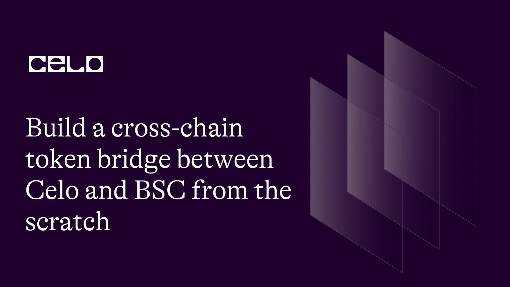

## Introduction

Blockchains are isolated from one another even though some are forks of one another. This greatly hinders communication among them. The $Celo coin in your wallet is not available to use on the Binance Smart Chain network and vice versa. One solution to achieving interoperability today is bridging assets from one network to another.
In this guide, you will learn how to bridge assets between the Celo blockchain and Binance Smart Chain.

## Prerequisites​

- At least an intermediate in smart contract development using Solidity language.
- Experience working with Typescript and Javascript.
- Using hardhat for smart contract development.

## Requirements​

- You need a development environment - IDE. I recommend VSCode.
- Install Node version >=14.0.0.

**Concept of bridging/cross-chain bridging**

Bridging is a system of creating utility for DApps or assets across different compatible or incompatible blockchain networks. Creating utilities between unrelated chains such as Celo -> Solana involves extra tasks compared to compatible networks like Celo -> Binance Smart Chain.

- One of the goals of going cross-chain is to achieve interoperability among desired networks i.e making blockchains communicate with one another. With this solution, we can expand the network of users for DApps deployed on the Celo blockchain through the deployment of utilities that enable the Binance Smart Chain users to interact with the same DApp on the BSC blockchain.

- At the time of creating this post, the cost of interacting with the Celo blockchain is relatively lower than that of the Binance network. This might be a good reason for bridging from the latter to the former.

There are two popular kinds of cross-chain bridging.

1. Centralized bridge

This is a kind of bridging system often used by centralized exchanges. Using APIs, users mostly deposit assets to a large pool, and the corresponding assets on the destination chain are sent out from another pool. One major disadvantage of this type is that it is controlled by a central body which is not really what most people want.

2. Decentralized bridge

This is a method of using smart contracts and a relayer to bridge utilities between or among blockchains. You don't have to call any external API. Smart contracts are deployed on both the source and destination blockchains and a relayer facilitates timely communication between the networks by listening to events and triggering actions on both chains.
To better explain the concept, in the next section, we will programmatically explore how to build a cross-chain bridge.

**Steps to building a cross-chain bridge**

In this section, we will explore the smart contract and the backend part but exclude the front-end. We will create a CLI DApp. Everything runs in the terminal. I will make it comprehensive enough so that when you need to build a front, it will be a lot easier since you'd already understand what to do.

Before we proceed to the coding aspect, let's quickly set up a hardhat environment. Please refer to [this article](https://docs.celo.org/blog/tutorials/getting-started-on-celo-with-hardhat) and [this](https://docs.celo.org/blog/tutorials/advance-hardhat-configuration-on-celo-using-plugins) for comprehensive tutorials on how to set up and use hardhat.

- Create a project

```bash
mkdir build-a-cross-chain-token-bridge-between-celo-and-bsc
cd build-a-cross-chain-token-bridge-between-celo-and-bsc
```

- Initialized the project using NPM

```bash
npm init --yes
```

- Initialized a git repository

```bash
git init
```

- Add hardhat using `Yarn`

```bash
yarn add hardhat
```

```bash
npx hardhat
```

Follow the instructions in the terminal, select the option to create a `Typescript` project, then install the required dependencies. This should include the `web3` package.

Next, install the openzeppelin library.

```bash
yarn add '@openzeppelin/contracts'
```

If all steps is done correctly, installation should be successful.

**Smart contract**

Beforehand, let's examine how the token bridge will work. You want to have a clear picture of what to do before proceeding to write the code. As a practice, I will be using the testnets: Celo Alfajores and Binance smart chain testnet for deployments.

- Deploy a token on the Celo testnet - `cBGT`. It is the token source chain. You may set the total supply if you wish but it will be irrelevant in this guide.

- Deploy a copy of the token on the BSC testnet - `bBGT`. It will be the token destination chain as we will only be performing a one-way bridging.

- Deploy a bridge contract on Alfajores. this contract receives the bridge request, then it locks or simply burns the token it has access to from the caller's account. It is a clear indication that the bridge contract should have admin access or control over the source token. When the bridge request is made, it should call the `lock` or `burn` method in the token contract whichever is available based on how you configure the token.

- Deploy a copy of the bridge contract onto the Binance smart chain. This time, it should contain an additional `mint` method that mints the exact amount of token that was burnt or locked on the source chain. It is worthy of note there is a relayer that alerts the bridge contract on the destination chain which will come on the backend side.

Now that the steps are known ahead of time. Follow the instructions and steps below to copy/paste the code into their respective files.

- In the `contracts` folder, make a new folder names `tokens`. Create three `.sol` files:

  - `build-a-cross-chain-token-bridge-between-celo-and-bsc/contracts/tokens/BaseToken.sol`. In this file, paste the code below.

  ```solidity
   // SPDX-License-Identifier: MIT
    pragma solidity 0.8.18;

    import '@openzeppelin/contracts/token/ERC20/ERC20.sol';
    import '@openzeppelin/contracts/utils/math/SafeMath.sol';

    contract BaseToken is ERC20 {
      using SafeMath for uint;
      error Requested();

      struct TokenRequest {
        uint reqAmount;
        uint cooldown;
      }

      struct BridgeRequest {
        address requester;
        uint amount;
        uint nonce;
      }

      address public bridgeAddress;
      address public admin;

      uint public cooldownInterval;

      uint private nonces;

      uint public immutable maxRequest;

      address public currentRequester;

      mapping (address => TokenRequest) public tokenRequests;

      mapping (address => BridgeRequest) public bridgeRequests;

      mapping (address => uint) public cooldown;

      mapping (uint => bool) private processedNonces;

      constructor(
        string memory name,
        string memory symbol,
        uint _maxRequest,
        uint8 _coolDownInterval,
        address _admin,
        address _bridgeAddress
      ) ERC20(name, symbol) {
        require(_admin != address(0) && _bridgeAddress != address(0), "Address is zero");
        admin = _admin;
        cooldownInterval = _coolDownInterval;
        bridgeAddress = _bridgeAddress;
        maxRequest = _maxRequest * (10 ** uint(18));
      }

      modifier onlyBridgeAddress() {
        require(msg.sender == bridgeAddress, "Only bridgeAddress is allowed");
        _;
      }

      modifier onlyAdmin() {
        require(msg.sender == admin, "Only Admin is allowed");
        _;
      }

      function _transfer(
        address from,
        address to,
        uint256 amount
      ) internal override {
        if(to == bridgeAddress) {
          nonces ++;
          uint nonce = nonces;
          bridgeRequests[from] = BridgeRequest(from, amount, nonce);
          currentRequester = from;
          _burn(from, amount);
        } else _transfer(from, to, amount);
      }

      function updatebridgeAddress(address newbridgeAddress) external onlyAdmin {
        bridgeAddress = newbridgeAddress;
      }

      function mint(address to, uint amount, uint nonce) external onlyBridgeAddress {
        require(!processedNonces[nonce], "Request replay attempt");
        processedNonces[nonce] = true;
        _mint(to, amount);
      }

      function fulfillRequests(address who) public onlyAdmin {
        TokenRequest memory _requesters = tokenRequests[who];
        require(_requesters.reqAmount > 0, "No requests");
        tokenRequests[who] = TokenRequest(0, _now().add(cooldownInterval.mul(1 hours)));
        _mint(who, _requesters.reqAmount);
      }

      function requestFreeToken() public {
        uint amount = maxRequest;
        require(_now() >= tokenRequests[msg.sender].cooldown, "User in cooldown mode");
        tokenRequests[msg.sender] = (TokenRequest(amount, 0));
      }

      function _now() internal view returns(uint) {
        return block.timestamp;
      }
    }
  ```

  - `build-a-cross-chain-token-bridge-between-celo-and-bsc/contracts/tokens/BSCbBGT.sol`

    ```solidity
      // SPDX-License-Identifier: MIT
      pragma solidity 0.8.18;

      import "./BaseToken.sol";

      contract BSCbBGT is BaseToken {
        constructor(
          uint16 _maxRequest,
          uint8 _coolDownInterval,
          address _bridgeAddress
        ) BaseToken(
          'Binance BGToken',
          'bBGT',
          _maxRequest,
          _coolDownInterval,
          msg.sender,
          _bridgeAddress
        ) {}
      }
    ```

  - `build-a-cross-chain-token-bridge-between-celo-and-bsc/contracts/tokens/CelocBGT.sol`

    ```solidity
      // SPDX-License-Identifier: MIT
      pragma solidity 0.8.18;

      import "./BaseToken.sol";

      contract CelocBGT is BaseToken {
        constructor(
          uint16 _maxRequest,
          uint8 _coolDownInterval,
          address _bridgeAddress
        ) BaseToken(
          'Celo BGToken',
          'cBGT',
          _maxRequest,
          _coolDownInterval,
          msg.sender,
          _bridgeAddress
        ) {}
      }
    ```

  The two token files should inherit from the `BaseToken` contract, and the constructors should be set appropriately.

_Bridge contracts_

- `build-a-cross-chain-token-bridge-between-celo-and-bsc/contracts/BaseBridge.sol`

  ```solidity
    // SPDX-License-Identifier: MIT
    pragma solidity 0.8.18;

    import "./tokens/BaseToken.sol";

    contract BaseBridge {
      event Burn(address from, uint amount, uint nonce);

      BaseToken private token;

      uint private genNonce;

      address public admin;

      modifier onlyAdmin() {
        require(msg.sender == admin,"Not an admin");
        _;
      }

      constructor() {
        admin = msg.sender;
      }

      function setToken(address baseToken) public onlyAdmin {
        require(address(baseToken) != address(0), "BaseToken is zero address");
        token = BaseToken(baseToken);
      }

      function bridgeToken(address to, uint amount, uint nonce) external onlyAdmin {
        token.mint(to, amount, nonce);
      }

    }
  ```

- `build-a-cross-chain-token-bridge-between-celo-and-bsc/contracts/CeloBridge.sol`

  ```solidity
    // SPDX-License-Identifier: MIT

    pragma solidity 0.8.18;

    import './BaseBridge.sol';

    contract CeloBridge is BaseBridge {
      constructor() BaseBridge() {}
    }
  ```

- `build-a-cross-chain-token-bridge-between-celo-and-bsc/contracts/BSCBridge.sol`

  ```solidity
    // SPDX-License-Identifier: MIT

    pragma solidity 0.8.18;
    import './BaseBridge.sol';

    contract BSCBridge is BaseBridge {
      constructor() BaseBridge() {}
    }
  ```

  **Compile**

```bash
npx hardhat compile
```

We have completed the contract code. Next, we will write scripts that deploy and execute the above code. The scripts will run as CLI DApp with logs that show how each step run.

**Setting up the utilities**

This part uses the combination of `web3.js` and `ethers.js`. We'd already installed `web3.js` in the previous chapter while `ethers` was installed alongside `hardhat`.

Create a new file under the `scripts` folder named `network.ts`.

- `build-a-cross-chain-token-bridge-between-celo-and-bsc/scripts/network.ts`

  - Import `ethers`and `web`.

  ```ts
  import { ethers } from "hardhat";
  import Web3 from "web3";

  // const str = (x:string|undefined) => String(x);
  ```

  - Set up a connection to a node using the `web3` wrapped version. In return, we get the provider object. Thereafter, generate web3 instances using the providers.

- `build-a-cross-chain-token-bridge-between-celo-and-bsc/scripts/network.ts`

  ```ts
  const ALFAJORES_SOCKET_URL = "wss://alfajores-forno.celo-testnet.org/ws";
  const BINANCE_HTTP_URL = "https://data-seed-prebsc-2-s1.binance.org:8545";

  // Construct a new instance of the providers for both chains.
  const CELO_PROVIDER = new Web3.providers.WebsocketProvider(
    ALFAJORES_SOCKET_URL
  );
  const BSC_PROVIDER = new Web3.providers.HttpProvider(BINANCE_HTTP_URL);

  // We create a new web3 instance parsing the provider as an argument.
  const getWeb3Instance = function () {
    const web3_celo = new Web3(CELO_PROVIDER);
    const web3_bsc = new Web3(BSC_PROVIDER);

    return { web3_celo, web3_bsc };
  };
  ```

  - This time, we are setting up a provider using `ethers` wrapped version. I love working with ethers.js, but sometimes, web3 can be very helpful. So I decided to blend them so you can refresh on their usage. Create the RPC object.

- `build-a-cross-chain-token-bridge-between-celo-and-bsc/scripts/network.ts`

  ```ts
  // RPC information
  const rpcInfo = Object.assign(
    {},
    {
      CELOALFAJORES: {
        name: "Alfajores",
        rpc: ALFAJORES_SOCKET_URL,
        chainId: 44787,
      },
      BSC_TESTNET: {
        name: "BSC Testnet",
        rpc: BINANCE_HTTP_URL,
        chainId: 97,
      },
    }
  );
  ```

  - Export the provider function.

- `build-a-cross-chain-token-bridge-between-celo-and-bsc/scripts/network.ts`

  ```ts
  export function getProviders() {
    const celoProvider = new ethers.providers.WebSocketProvider(
      rpcInfo.CELOALFAJORES.rpc,
      {
        chainId: rpcInfo.CELOALFAJORES.chainId,
        name: rpcInfo.CELOALFAJORES.name,
      }
    );

    const bscProvider = new ethers.providers.JsonRpcProvider(
      rpcInfo.BSC_TESTNET.rpc,
      {
        chainId: rpcInfo.BSC_TESTNET.chainId,
        name: rpcInfo.BSC_TESTNET.name,
      }
    );

    return { celoProvider, bscProvider };
  }
  ```

  - The function waits until the transaction is confirmed within 2 blocks.

- `build-a-cross-chain-token-bridge-between-celo-and-bsc/scripts/network.ts`

  ```ts
  const waitForConfirmation = async function (trx: any) {
    console.log("Waiting for confirmation ...");
    return await trx.wait(2);
  };
  ```

  - Lastly, in this file, export the utilities.

- `build-a-cross-chain-token-bridge-between-celo-and-bsc/scripts/network.ts`

  ```ts
  export function getUtils() {
    return {
      str,
      Web3,
      ethers,
      waitForTransaction,
      getWeb3Instance,
    };
  }
  ```

- `build-a-cross-chain-token-bridge-between-celo-and-bsc/scripts/deploy.ts`

  - Import the utilities and the contract artifacts.

- `build-a-cross-chain-token-bridge-between-celo-and-bsc/scripts/deploy.ts`

  ```ts
  import { getProviders, getUtils } from "./network";
  import celoBridge from "../artifacts/contracts/CeloBridge.sol/CeloBridge.json";
  import bscBridge from "../artifacts/contracts/BSCBridge.sol/BSCBridge.json";
  import cBGT from "../artifacts/contracts/tokens/BSCbBGT.sol/BSCbBGT.json";
  import bBGT from "../artifacts/contracts/tokens/CelocBGT.sol/CelocBGT.json";
  ```

  - Every other code comes in the `main` function.

- `build-a-cross-chain-token-bridge-between-celo-and-bsc/scripts/deploy.ts`

  ```ts
  const { str, Web3, ethers, getWeb3Instance, waitForTransaction } = getUtils();

  const { bscProvider, celoProvider } = getProviders();
  ```

  - Get the private keys ready.

    > Note: It can be dangerous to expose your private keys.

    I used the `.env` file to store the private keys. Be very cautious in handling sensitive information such as private keys.

- `build-a-cross-chain-token-bridge-between-celo-and-bsc/scripts/deploy.ts`

  ```ts
  const P_KEY_DEPLOYER = str(process.env.PRIVATE_KEY);
  const P_KEY_USER = str(process.env.PRIVATE_KEY_USER);

  const { web3_celo } = getWeb3Instance();
  ```

  - Let's set the contract parameters.

- `build-a-cross-chain-token-bridge-between-celo-and-bsc/scripts/deploy.ts`

  ```ts
  // Set the max request to any amount not greater than type(uint16).max i.e 65536 - 1
  const MAX_REQUEST = 1000;

  // Set cooldown period
  const COOLDOWN = 0;

  const ZERO_ADDRESS = `0x${"0".repeat(40)}`;

  // Amount to bridge
  const BRIDGE_AMOUNT = "500000000000000000000";
  ```

  - We will create a wallet for a deployer to act as the admin. The deployer will also pay for deployment fees.

    - Another wallet instance as the user to make bridging requests.
    - There are two wallets to create for each of the networks.
    - You should already create these accounts before now.
    - Fund the wallet on each of the chains using the following links:

      1. **[Celo testnet token faucet](https://faucet.celo.org/)**

      2. **[Binance Smart Chain testnet faucet](https://testnet.bnbchain.org/faucet-smart)**

    - Log the balances to the console to confirm there is enough balance in the wallets.

- `build-a-cross-chain-token-bridge-between-celo-and-bsc/scripts/deploy.ts`

  ```ts
  /**Generate wallet instance from private keys on both chains
   * Note: You can always use the same account on both chains.
   * To fund with testnet tokens, visit:
   *  https://faucet.celo.org/
   *  https://testnet.bnbchain.org/faucet-smart
   */
  const deployer_celo = new ethers.Wallet(P_KEY_DEPLOYER, celoProvider);
  const deployer_bsc = new ethers.Wallet(P_KEY_DEPLOYER, bscProvider);
  const userWalletOnBSC = new ethers.Wallet(P_KEY_USER, bscProvider);
  const userWalletOnCelo = new ethers.Wallet(P_KEY_USER, celoProvider);

  console.log(`
      USER Account: ${userWalletOnCelo.address}
      USER Balances on Celo : ${ethers.utils.parseUnits(
        (await userWalletOnCelo.getBalance()).toString(),
        "wei"
      )}}\n
      USER Balances on BSC : ${ethers.utils.parseUnits(
        (await userWalletOnBSC.getBalance()).toString(),
        "wei"
      )}}\n
    `);
  ```

  - Deploy the contracts on both chains. We are simply replicating the contracts deployed on Celo to Binance Smart Chain.
    - Load the contract artifacts, give the `abi`, `bytecode`, and a `signer`.

- `build-a-cross-chain-token-bridge-between-celo-and-bsc/scripts/deploy.ts`

  ```ts
  console.log(`
      Deploying and signing CeloBridge contract from : ${
        deployer_celo.address
      }\n
      $CELO Balances: ${ethers.utils.parseUnits(
        (await deployer_celo.getBalance()).toString(),
        "wei"
      )}} 
    `);

  // Deploy and Create an instance of the bridge contract on Celo
  var C_bridge = new ethers.ContractFactory(
    celoBridge.abi,
    celoBridge.bytecode,
    deployer_celo
  );

  // Broadcast trxn to Alfajores, and wait until deployment is completed.
  const c_bridge = await C_bridge.deploy();
  await c_bridge.deployed();

  console.log(`Celo_Bridge contract deployed to : ${c_bridge.address}`);

  console.log(`
      Deploying and signing BSCBridge contract from : ${deployer_bsc.address}\n
      $BNB Balances: ${ethers.utils.parseUnits(
        (await deployer_bsc.getBalance()).toString(),
        "wei"
      )}} 
    `);

  // Deploy and Create an instance of the bridge contract on BSC
  var B_bridge = new ethers.ContractFactory(
    bscBridge.abi,
    bscBridge.bytecode,
    deployer_bsc
  );

  // Broadcast to network and wait until deployment is completed.
  const b_bridge = await B_bridge.deploy();
  await b_bridge.deployed();

  console.log(`Binance_Bridge contract deployed to : ${c_bridge.address}`);
  console.log(
    `Starting to deploy CelocBGT from : ${deployer_celo.address} ...\n`
  );

  // Deploy and Create an instance of the token contract on Celo
  var CToken = new ethers.ContractFactory(
    cBGT.abi,
    cBGT.bytecode,
    deployer_celo
  );
  const cToken = await CToken.deploy(MAX_REQUEST, COOLDOWN, c_bridge.address);
  await cToken.deployed();
  console.log("cBGT deployed to :", cToken.address);

  console.log(
    `Starting to deploy BSCbBGT from : ${deployer_bsc.address} ...\n`
  );

  var BToken = new ethers.ContractFactory(
    bBGT.abi,
    bBGT.bytecode,
    deployer_bsc
  );
  const bToken = await BToken.deploy(MAX_REQUEST, COOLDOWN, b_bridge.address);
  await bToken.deployed();
  console.log(`bBGT deployed to : ${bToken.address}`);
  ```

  - After the contracts are deployed, update the token addresses on the different bridge contracts. We would have set them in the constructor but because the tokens contracts require the bridge addresses hence the bridge contracts were first to deployed.

- `build-a-cross-chain-token-bridge-between-celo-and-bsc/scripts/deploy.ts`

  ```ts
  // Update token addresses on both chains
  await c_bridge.connect(deployer_celo).setToken(cToken.address);
  await b_bridge.connect(deployer_bsc).setToken(bToken.address);
  ```

  - Create a function that lets the user request for `cBGT` token i.e Token deployed on Alfajores. Invocation of this function should precede others as users must have the Celo-based token in their wallet before they can think of bridging to BSC.

- `build-a-cross-chain-token-bridge-between-celo-and-bsc/scripts/deploy.ts`

  ```ts
  // User claims cBGT on source chain - Celo
  async function requestForcBGT() {
    try {
      await waitForTransaction(
        await cToken.connect(userWalletOnCelo).requestFreeToken()
      ).then(async () => {
        const request = await cToken.tokenRequests(userWalletOnCelo.address);
        const balance = await cToken.balanceOf(userWalletOnCelo.address);
        console.log("Requesters: ", request);
        console.log(
          "User balances before request was fulfilled:",
          Web3.utils.fromWei(balance.toString())
        );
      });
    } catch (error) {
      console.log("Request Error :", error);
    }
  }
  ```

  - Approving requests to get a free token is done by the admin. You do not have to do it this way. But for tutoring purposes, anyone can show interest in testing the DApp. They must request to test by explicitly requesting the test token.

- `build-a-cross-chain-token-bridge-between-celo-and-bsc/scripts/deploy.ts`

  ```ts
  async function approveFundingRequest() {
    try {
      await waitForTransaction(
        await cToken
          .connect(deployer_celo)
          .fulfillRequests(userWalletOnCelo.address)
      ).then(async () => {
        const request = await cToken.tokenRequests(userWalletOnCelo.address);
        const balance = await cToken.balanceOf(userWalletOnCelo.address);
        console.log("Approved Requesters: ", request);
        console.log(
          "User balances after request is fulfilled:",
          Web3.utils.fromWei(balance.toString())
        );
      });
    } catch (error) {
      console.log("ApproveRequest Error :", error);
    }
  }
  ```

  - After the request is approved, the user account will now hold some `cBGT` token on the Celo blockchain, testnet precisely. To bridge to BSC, the user must transfer the desired amount from their wallet to the bridge address on Celo Alfajores. This is how I decided to configure it so you can understand the concept as fast as possible. You can think of a better way to do this.

    - I have configured the `BaseToken` contract by overriding the `_transfer` function so that when an account initiates a transfer on the token contract, and the receiver is the bridge contract, the token contract is smart enough to know it is a bridging request. It then records the necessary information to effect the cross-chain transfer in the `bridgeRequest` variable for future access.

- `build-a-cross-chain-token-bridge-between-celo-and-bsc/scripts/deploy.ts`

  ```ts
  async function transferToBridge() {
    try {
      await waitForTransaction(
        await cToken
          .connect(userWalletOnCelo)
          .transfer(c_bridge.address, BRIDGE_AMOUNT)
      ).then(async () => {
        const balance = await cToken.balanceOf(userWalletOnCelo.address);
        console.log(
          "User balances after transfered to bridge:",
          Web3.utils.fromWei(balance.toString())
        );
      });
    } catch (error) {
      console.log("Transfer to bridge error: ", error);
    }
  }
  ```

  - The standard ERC20 procedure emits a `Transfer` event when a transfer method of the token contract is successfully invoked. This is the event we will listen for so we can trigger the cross-chain transfer. This part acts as the relayer between the two contracts on two different blockchains.

  - Using the web3 framework, we will subscribe to the `Transfer` event, and execute the bridging if certain conditions are met.

  - You can either listen to a specific topic or all of the events emitted by the contract. But for clarity, we only listen for the `Transfer` event. The topic is the hash of the event's name followed by parentheses that enclose the parameters emitted by the event. In this case, our transfer event signature will be the `keccak256` of the `Transfer(address,address,uint256)` handle. Paste this code anywhere in the current program but within the `main`.

- `build-a-cross-chain-token-bridge-between-celo-and-bsc/scripts/deploy.ts`

  ```ts
  /** Event signature : hash of 'Transfer(address,address,uint256)' i.e Web3.utils.keccak256('Transfer(address,address,uint256)') or
   * ethers.utils.id('Transfer(address,address,uint256)');
   */
  const TRANSFER_EVENT_SIG =
    "0xddf252ad1be2c89b69c2b068fc378daa952ba7f163c4a11628f55a4df523b3ef";
  ```

- `build-a-cross-chain-token-bridge-between-celo-and-bsc/scripts/deploy.ts`

  ```ts
  // Subscribe to 'Transfer' event using web3 lib
  var eventLogs = web3_celo.eth
    .subscribe(
      "logs",
      {
        address: cToken.address,
        topics: [TRANSFER_EVENT_SIG],
      },
      async function (error, result) {
        if (!error) {
          console.log("Event Result: ", result);
          if (result.topics.length) {
            const requester = cToken.currentRequester();
            if (requester !== ZERO_ADDRESS) {
              await cToken
                .bridgeRequests(requester)
                .then(async (request: any) => {
                  console.log("Event - requester: ", requester);
                  console.log("Event requests: ", request);
                  if (request.amount.toString() !== "0") {
                    await waitForTransaction(
                      await b_bridge
                        .connect(deployer_bsc)
                        .bridgeToken(
                          request.requester,
                          request.amount,
                          request.nonce
                        )
                    ).then(async () => {
                      const balance_bsc = (
                        await bToken.balanceOf(userWalletOnBSC.address)
                      ).toString();
                      console.log(
                        `User's balance on BSC Network after bridge: ${Web3.utils.fromWei(
                          balance_bsc
                        )}`
                      );
                    });
                  }
                });
            }
          }
        } else console.log("Error: ", error);
      }
    )
    .on("connected", (subId) => {
      console.log(`Sub_Id: ${subId}`);
    })
    .on("data", (log) => {
      console.log("Data log:", log);
      if (log.data.length) {
        console.log("Data 0:", log.data[0]);
      }
    })
    .on("changed", (log) => {
      console.log("ChangeLog: ", log);
    });
  ```

  - Now, invoke the functions in the order they appear below. Lastly, unsubscribe from the event.

- `build-a-cross-chain-token-bridge-between-celo-and-bsc/scripts/deploy.ts`

  ```ts
  await requestForcBGT();
  await approveFundingRequest();
  await transferToBridge();

  await eventLogs.unsubscribe(function (error, result) {
    if (!error) console.log("Error", error);
    else console.log("Result:", result);
  });
  ```

  Run the main script file, and watch for the logs in the terminal.

  ```bash
    npx hardhat run scripts/deploy.ts
  ```

If all said are done properly, the user wallet on BSC should receive the equivalent amount bridged from the Celo blockchain.

The complete code for this tutorial can be found **[on the github](https://github.com/bobeu/Build-a-cross-chain-token-bridge-between-Celo-and-BSC-from-the-scratch)**.

## Conclusion​

In the terminal, steps were logged to show how we achieved each stage. We have only run a one-way bridge i.e bridging tokens from the Celo blockchain to the Binance Smart Chain only which explains vividly how cross-chain transfer works.

## What next?

I challenge you to modify the code to build a two-way cross-chain transfer. It's not really difficult as you may perceive it. Everything is already done for you. This will help you master the logic and you can be creative about it too. Share what you have built with us on the **[discord](https://chat.celo.org/)**. There are other Celo developers who will also attend to your questions.

For more about Celo blockchain, visit the **[Celo documentation](https://docs.celo.org/tutorials)**

## About the Author​

**Isaac Jesse** , aka _Bobelr_ is a smart contract/Web3 developer. He has been in the field since 2018, worked as an ambassador with several projects like Algorand and so on as a content producer. He has also contributed to Web3 projects as a developer.

## References​

- [Celo developers resources](https://docs.celo.org/developer/)
- [Source code](https://github.com/bobeu/interact-with-smart-contract-on-celo-using-web3js)
- [Web3js doc](https://web3js.readthedocs.io/)
- [Ethersjs doc](https://docs.ethers.org/)
