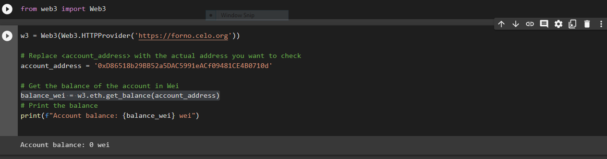

## Introduction!

Are you interested in learning how to delve into the features of the celo-sdk, a Python library which provides a wrapper around the web3py library and enables you to interact with the celo network and smart contracts? The tutorial below is a quick and easy guide that will help you get started right away!
Here are the steps we’ll follow

1. Step 1: Installation
1. Step 2: Connecting to the Celo network
1. Step 3: Interacting with the celo blockchain

By the end of this post, you’ll be able to use celo-sdk to build decentralised applications on the Celo blockchain.

## Prerequisites

1. Basic programming knowledge
2. Familiarity with blockchain technology
3. Access to a development environment

## Step 1: Installation

To interact with Celo blockchain using Python, you can use the web3.py library. To install web3, you can use pip, the
Python package manager. Open your terminal or command prompt and type: pip install web3
This will install the library and its dependencies.

### Step 2: Connecting to the Celo network

Connecting to web3.py involves creating an instance of the Web3 class and specifying the RPC (Remote Procedure Call) URL of the Ethereum or Celo node you want to connect to. Here's an example:
Firstly, import the web3.py library

```python
from web3 import web3
```

Create a Web3 instance connected to the Celo network

```python
w3 = Web3(Web3.HTTPProvider('https://forno.celo.org'))
```

## Step 3: Interacting with celo blockchain

Once we have connected to the Celo network, we can start interacting with the Celo blockchain using the web3 object.

### Getting account balance

To get the balance of a Celo account, we can use the .get_balance method of the web3 object. The method takes an Ethereum address as its argument and returns the balance of the account in wei.

```python
account_address = '0x123...'
balance = w3.eth.get_balance(account_address)
```

The following pictures show what the output looks like with a Jupyter notebook



### Sending transactions

Import the required libraries: Web3.py, Account and HTTPProvider.

```python
from web3 import Web3, HTTPProvider
from web3.auto import w3
from web3.middleware import geth_poa_middleware
from web3.gas_strategies.time_based import fast_gas_price_strategy
from web3.middleware import gas_price_strategy
from web3.middleware import time_based_cache_middleware
from web3.middleware import simple_cache_middleware
from web3.middleware import retry_request_middleware
from web3.exceptions import TransactionNotFound
from eth_account import Account
```

Connect to the Celo network using an HTTPProvider.

```python
celo = Web3(HTTPProvider('https://forno.celo.org')) # Or use a local node
```

Load your account using your private key.

```python
private_key = "YOUR_PRIVATE_KEY"
account = Account.from_key(private_key)
```

Set the gas price and gas limit for your transaction.

```python
gas_price = celo.eth.gas_price
gas_limit = 500000
```

Create a transaction dictionary containing the necessary information for your transaction, such as the recipient address, amount of cUSD to send, and gas price and limit.

```python
transaction = {
    'to': 'RECIPIENT_ADDRESS',
    'value': celo.toWei(AMOUNT_IN_CUSD, 'ether'),
    'gas': gas_limit,
    'gasPrice': gas_price,
    'nonce': celo.eth.getTransactionCount(account.address),
}
```

Sign the transaction using your account and private key.

```python
tx_hash = celo.eth.sendRawTransaction(signed_txn.rawTransaction)
```

Wait for the transaction to be mined and confirmed on the network. You can check the status of your transaction using the tx_hash

```python
receipt = celo.eth.waitForTransactionReceipt(tx_hash)
```

That's it! Your transaction has been sent on the Celo network. Note that there are additional steps you can take to optimize your transaction and ensure it gets confirmed quickly, such as adjusting the gas price or using a different gas strategy.

### Reading data from contracts

To read data from contracts using web3.py, you can follow these steps:
Create a web3.py instance by connecting to an Ethereum node:
from web3 import Web3

connect to an Ethereum node

```python
w3 = Web3(Web3.HTTPProvider('https://mainnet.infura.io/v3/YOUR-PROJECT-ID'))
```

Replace YOUR-PROJECT-ID with your Infura project ID. Define the contract ABI (Application Binary Interface) and address:

```python
contract_address = '0x1234567890123456789012345678901234567890'
contract_abi = [{"inputs":[],"stateMutability":"nonpayable","type":"constructor"},{"inputs":[],"name":"getSomeData","outputs":[{"internalType":"uint256","name":"","type":"uint256"}],"stateMutability":"view","type":"function"}]
```

Replace contract_address with the address of your contract, and contract_abi with the ABI of your contract.
Create a Contract instance by passing in the ABI and address:

```python
from web3 import Contract

my_contract = w3.eth.contract(address=contract_address, abi=contract_abi)
```

Call a function on the contract to read data:

```python
result = my_contract.functions.getSomeData().call()
```

The call() method returns the result of the function call. In this example, we're calling the getSomeData() function, which returns a uint256 value.
You can then use the result value as needed in your Python code.

Here is the [link](https://github.com/yusuf1990/CeloDapp/tree/main) to the repository

## Here is the full code and yours should look like this

```python
#checking account balance
from web3 import Web3
w3 = Web3(Web3.HTTPProvider('https://forno.celo.org'))
# Replace <account_address> with the actual address you want to check
account_address = '0xD86518b29BB52a5DAC5991eACf09481CE4B0710d'
# Get the balance of the account in Wei
balance_wei = w3.eth.get_balance(account_address)
# Print the balance
print(f"Account balance: {balance_wei} wei")
#Sending Transactions
from web3 import Web3, HTTPProvider
from web3.auto import w3
from web3.middleware import geth_poa_middleware
from web3.gas_strategies.time_based import fast_gas_price_strategy
from web3.middleware import gas_price_strategy
from web3.middleware import time_based_cache_middleware
from web3.middleware import simple_cache_middleware
#from web3.middleware import retry_request_middleware
from web3.exceptions import TransactionNotFound
from eth_account import Account
celo = Web3(HTTPProvider('https://forno.celo.org')) # Or use a local node
private_key = "0x86c9b52ec8d62aa033e7c892f67e1f6322aa8ce685e9d9d8e0c0e09f5c69b2d7"
account = Account.from_key(private_key)

gas_price = celo.eth.gas_price
gas_limit = 500000

#account = '0x1234567890123456789012345678901234567890'
transaction = {
    'to': 'RECIPIENT_ADDRESS',
    'value': (450, 'ether'),
    'gas': gas_limit,
    'gasPrice': gas_price,
    'nonce': celo.eth.getTransactionCount(account.address),
}

#Sign the transaction using your account and private key
signed_txn = account.sign_transaction(transaction)

#Send the transaction to the network using the sendRawTransaction method.
tx_hash = celo.eth.sendRawTransaction(signed_txn.rawTransaction)

#Wait for the transaction to be mined and confirmed on the network. You can check the status of your transaction using the tx_hash.
receipt = celo.eth.waitForTransactionReceipt(tx_hash)
#Reading Contracts

#Create a web3.py instance by connecting to an Ethereum node:
from web3 import Web3

# connect to an Ethereum node
w3 = Web3(Web3.HTTPProvider('https://mainnet.infura.io/v3/YOUR-PROJECT-ID'))

#Define the contract ABI (Application Binary Interface) and address:
contract_address = '0x1234567890123456789012345678901234567890'
contract_abi = [{"inputs":[],"stateMutability":"nonpayable","type":"constructor"},{"inputs":[],"name":"getSomeData","outputs":[{"internalType":"uint256","name":"","type":"uint256"}],"stateMutability":"view","type":"function"}]

#Create a Contract instance by passing in the ABI and address:
from web3 import Contract

my_contract = w3.eth.contract(address=contract_address, abi=contract_abi)

#Call a function on the contract to read data:
result = my_contract.functions.getSomeData().call()
```

## Check Balance Output Sample

Note that if you run the code, you will be able to check balance as shown below.


Conclusion
In this guide, we have explored the web3.py library and demonstrated how to use it to interact with the Celo blockchain. By following the examples provided, you should now have a good understanding of how to connect to the Celo network, send transactions, read data from contracts, and use the data in your Python application.

## About the Author

Jimoh Yusuf is a web3 developer and a data scientist with a passion of learning. I will be glad to connect with people who share have same ambition as me on Twitter handle @YusufJi30148537
