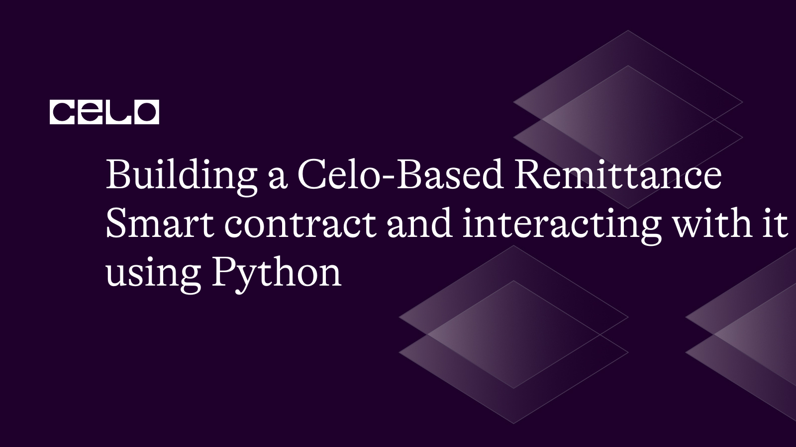

## Introduction

Specifically made for remittances, Celo is an open-source blockchain platform that enables quick and secure payments. Users can transact with confidence thanks to its stablecoin, cUSD, which tracks the value of the US dollar. In this tutorial, we'll go into detail about creating a remittance smart contract on the Celo platform and utilizing Python and the web3.py module to communicate with it. You will have a thorough understanding of Celo's features at the end of this lesson and practical experience creating a real-world application on its blockchain.

## Prerequisites

You should have the following information and resources available before we start:

- Familiarity with smart contracts and blockchain technology
- Basic familiarity with the blockchain network used by Celo Programming experience in Python
- Knowledge of the programming language Solidity, which is used to create smart contracts
- cUSD or CELO test funds in a Celo wallet

## Requirements

- Your machine must have Python 3.7 or greater installed.
- A code editor or IDE (such as PyCharm or Visual Studio Code)
- A wallet that works with Celo, such as MetaMask or Valora
- A test account on the Celo network with some test cash (available through the Celo Faucet)

### Step 1: Setting up a development environment

First, we need to set up a development environment for our Celo-based remittance system.

On your terminal, use the following commands to create a new folder for your project:

```bash
mkdir Celo-Based-Remittance
cd Celo-Based-Remittance
```

In your new directory, Let's now establish and activate a virtual Python environment.

```bash
python3 -m venv venv
source venv/bin/activate
```

Next, Install the following libraries using pip, the Python package manager:

```bash
pip install python-dotenv web3 py-solc-x
```

### Step 2: Write a Solidity smart contract for remittances

Next, let’s write the smart contract for our remittance system. Create a new file called `Remittance.sol` in the root directory of our project, and paste the following code: 

Remittance.sol

```solidity
// SPDX-License-Identifier: MIT

pragma solidity ^0.8.0;

import "node_modules/@openzeppelin/contracts/token/ERC20/IERC20.sol";

contract Remittance {
    address public owner;
    IERC20 public cUSD;

    struct Transaction {
        uint256 amount;
        uint256 fee;
        bool isProcessed;
    }

    mapping(bytes32 => Transaction) public transactions;

    event TransferRequested(address indexed sender, bytes32 indexed transactionId, uint256 amount);
    event TransferProcessed(address indexed recipient, bytes32 indexed transactionId, uint256 amount);

    constructor(address _cUSDAddress) {
        owner = msg.sender;
        cUSD = IERC20(_cUSDAddress);
    }

    modifier onlyOwner() {
        require(msg.sender == owner, "Only the owner can call this function.");
        _;
    }

    function requestTransfer(address _recipient, uint256 _amount, uint256 _fee) external {
        require(_amount > 0, "Amount must be greater than zero.");
        require(_fee >= 0, "Fee must be non-negative.");

        bytes32 transactionId = keccak256(abi.encodePacked(msg.sender, _recipient, _amount, _fee));
        require(!transactions[transactionId].isProcessed, "Transaction already processed.");

        transactions[transactionId] = Transaction(_amount, _fee, false);
        cUSD.transferFrom(msg.sender, address(this), _amount + _fee);

        emit TransferRequested(msg.sender, transactionId, _amount);
    }

    function processTransfer(address _recipient, bytes32 _transactionId) external onlyOwner {
        require(!transactions[_transactionId].isProcessed, "Transaction already processed.");

        Transaction storage transaction = transactions[_transactionId];
        cUSD.transfer(_recipient, transaction.amount);
        cUSD.transfer(owner, transaction.fee);

        transaction.isProcessed = true;

        emit TransferProcessed(_recipient, _transactionId, transaction.amount);
    }
}
```

This contract communicates with Celo's cUSD stablecoin over the OpenZeppelin IERC20 interface. Users can request transfers under the Remittance contract, and the contract owner will carry them out. The contract provides a unique transaction ID that is produced using a hash function and keeps transactions in a mapping. 

**Note**: For the import statement to work, we have to install the `@openzeppelin/contracts` via npm. Run the following command on your terminal:

```bash
npm i @openzeppelin/contracts
```

### Step 3: Build and Deploy the smart contract on the Celo testnet

Next, in the root directory of your project, create a new file called `deploy.py` which would contain the code that would deploy our smart contract:

deploy.py

```python
import json
import os
from solcx import compile_standard, install_solc
from dotenv import load_dotenv
from web3.middleware import geth_poa_middleware
from web3 import Web3

load_dotenv()

# Install specific Solidity compiler version
install_solc("0.8.0")

# Set up web3 connection
provider_url = os.environ.get("CELO_PROVIDER_URL")
w3 = Web3(Web3.HTTPProvider(provider_url))
assert w3.is_connected(), "Not connected to a Celo node"

# Set deployer account and private key
deployer = os.environ.get("CELO_DEPLOYER_ADDRESS")
private_key = os.environ.get("CELO_DEPLOYER_PRIVATE_KEY")

with open("Remittance.sol", "r") as file:
    solidity_code = file.read()

# Add Geth POA middleware to handle extraData field in Celo transactions
w3.middleware_onion.inject(geth_poa_middleware, layer=0)

# Compile the Solidity smart contract
compiled_sol = compile_standard({
    "language": "Solidity",
    "sources": {
        "Remittance.sol": {
            "content": solidity_code
        }
    },
    "settings": {
        "outputSelection": {
            "*": {
                "*": ["metadata", "evm.bytecode", "evm.deployedBytecode", "abi"]
            }
        },
        "optimizer": {
            "enabled": True,
            "runs": 200
        }
    }
})

# Get the bytecode, contract data, and ABI
contract_data = compiled_sol['contracts']['Remittance.sol']['Remittance']
bytecode = contract_data['evm']['bytecode']['object']
abi = json.loads(contract_data['metadata'])['output']['abi']

# Deploy the contract
nonce = w3.eth.get_transaction_count(deployer)
transaction = {
    'nonce': nonce,
    'gas': 2000000,
    'gasPrice': w3.eth.gas_price,
    'data': bytecode,
}
signed_txn = w3.eth.account.sign_transaction(transaction, private_key)
transaction_hash = w3.eth.send_raw_transaction(signed_txn.rawTransaction)
transaction_receipt = w3.eth.wait_for_transaction_receipt(transaction_hash)

# Get the contract address
contract_address = transaction_receipt['contractAddress']
print(f"Contract deployed at address: {contract_address}")
```

**Note**: Just in case you encountered an import error while compiling with `solcx`, please follow these steps to resolve it:

1. Install `truffle` and `truffle-flattener` globally:
    
```bash
npm install -g truffle
npm install -g truffle-flattener
```
    

1. Create a `truffle-config.js` file in the root of your project directory with the following content:
    
```jsx
module.exports = {
  networks: {
    development: {
      host: "127.0.0.1",
      port: 7545,
      network_id: "*",
    },
  },
  compilers: {
    solc: {
      version: "0.8.0",
    },
  },
};
```
    
This is a basic Truffle configuration file that lists the version of the Solidity compiler and the development network.
    
2. Run the following command to create a flattened version of your `Remittance.sol` file in your project directory:
    
```bash
   truffle-flattener Remittance.sol > FlattenedRemittance.sol
```
    
Your `Remittance.sol` file should be flattened and located in `FlattenedRemittance.sol`.
    
Your deployment script should also be updated to this:
    
deploy.py
    
```jsx
import json
import os
from solcx import compile_standard, install_solc
from dotenv import load_dotenv
from web3.middleware import geth_poa_middleware
from web3 import Web3

load_dotenv()

# Install specific Solidity compiler version
install_solc("0.8.0")

# Set up web3 connection
provider_url = os.environ.get("CELO_PROVIDER_URL")
w3 = Web3(Web3.HTTPProvider(provider_url))
assert w3.is_connected(), "Not connected to a Celo node"

# Set deployer account and private key
deployer = os.environ.get("CELO_DEPLOYER_ADDRESS")
private_key = os.environ.get("CELO_DEPLOYER_PRIVATE_KEY")

with open("FlattenedRemittance.sol", "r") as file:
    solidity_code = file.read()

# Add Geth POA middleware to handle extraData field in Celo transactions
w3.middleware_onion.inject(geth_poa_middleware, layer=0)

# Compile the Solidity smart contract
compiled_sol = compile_standard({
    "language": "Solidity",
    "sources": {
        "FlattenedRemittance.sol": {
            "content": solidity_code
        }
    },
    "settings": {
        "outputSelection": {
            "*": {
                "*": ["metadata", "evm.bytecode", "evm.deployedBytecode", "abi"]
            }
        },
        "optimizer": {
            "enabled": True,
            "runs": 200
        }
    }
})

# Get the bytecode, contract data, and ABI
contract_data = compiled_sol['contracts']['FlattenedRemittance.sol']['Remittance']
bytecode = contract_data['evm']['bytecode']['object']
abi = json.loads(contract_data['metadata'])['output']['abi']

# Deploy the contract
nonce = w3.eth.get_transaction_count(deployer)
transaction = {
    'nonce': nonce,
    'gas': 2000000,
    'gasPrice': w3.eth.gas_price,
    'data': bytecode,
}
signed_txn = w3.eth.account.sign_transaction(transaction, private_key)
transaction_hash = w3.eth.send_raw_transaction(signed_txn.rawTransaction)
transaction_receipt = w3.eth.wait_for_transaction_receipt(transaction_hash)

# Get the contract address
contract_address = transaction_receipt['contractAddress']
print(f"Contract deployed at address: {contract_address}")
```
    

On your terminal, run the following command to deploy your smart contract:

```bash
python deploy.py
```


### Step 4: In
teracting with the deployed smart contract

Finally, let’s write a script that interacts with the remittance smart contract. Create a new file called `client.py` and paste the following code:

client.py

```python
import os
from web3 import Web3
from web3.middleware import geth_poa_middleware

import deploy

# Set up web3 connection
provider_url = os.environ.get("CELO_PROVIDER_URL")
w3 = Web3(Web3.HTTPProvider(provider_url))
assert w3.is_connected(), "Not connected to a Celo node"

# Add PoA middleware to web3.py instance
w3.middleware_onion.inject(geth_poa_middleware, layer=0)

abi = deploy.abi
contract_address = deploy.contract_address
private_key = deploy.private_key
deployer = deploy.deployer

contract = w3.eth.contract(address=contract_address, abi=abi)

def request_transfer(recipient, amount, fee):
    transaction_id = w3.solidity_keccak(
        ['address', 'address', 'uint256', 'uint256'], [deployer, recipient, amount, fee])
    transaction_id_hex = transaction_id.hex()

    nonce = w3.eth.get_transaction_count(deployer)
    txn = contract.functions.requestTransfer(recipient, amount, fee).build_transaction({
        'from': deployer,
        'gas': 2000000,
        'gasPrice': w3.eth.gas_price,
        'nonce': nonce,
    })

    signed_txn = w3.eth.account.sign_transaction(txn, private_key)
    txn_hash = w3.eth.send_raw_transaction(signed_txn.rawTransaction)
    txn_receipt = w3.eth.wait_for_transaction_receipt(txn_hash)

    return transaction_id_hex, txn_receipt

def process_transfer(deployer, transaction_id_hex):

    owner = deployer

    nonce = w3.eth.get_transaction_count(owner)
    gas_estimate = contract.functions.processTransfer(
        recipient, transaction_id_hex).estimate_gas({"from": owner})

    txn = contract.functions.processTransfer(recipient, transaction_id_hex).build_transaction({
        'from': owner,
        'gas': gas_estimate,
        'gasPrice': w3.eth.gas_price,
        'nonce': nonce,
    })

    owner_private_key = private_key
    signed_txn = w3.eth.account.sign_transaction(txn, owner_private_key)
    txn_hash = w3.eth.send_raw_transaction(signed_txn.rawTransaction)
    txn_receipt = w3.eth.wait_for_transaction_receipt(txn_hash)

    return txn_receipt

if __name__ == "__main__":
    # Test the request_transfer function
    # Replace with the actual recipient address
    recipient = deployer
    amount = 1000  # Replace with the desired amount
    fee = 10  # Replace with the desired fee

    transaction_id_hex, txn_receipt = request_transfer(recipient, amount, fee)
    print(f"Transfer requested. Transaction ID: {transaction_id_hex}")
    print(f"Transaction receipt: {txn_receipt}")

    # Test the process_transfer function
    process_receipt = process_transfer(recipient, transaction_id_hex)
    print(f"Transfer processed. Transaction receipt: {process_receipt}")
```

This script shows how to use the Web3.py library to communicate with a Celo-based remittance smart contract. It contains the'request_transfer' and 'process_transfer' functions.

1. The script imports the required libraries and uses the Web3.py library to establish a connection to the Celo network. It guarantees that the node connection is made.
2. The script gets the `deploy` module's contract ABI, contract address, private key, and deployer address.
3. The Web3.py library is used to initialize the `contract` variable as a smart contract instance.
4. The `request_transfer` function is designed to ask for a transfer with a given amount and charge from the deployer address to a recipient address. Using the deployer's private key, it generates and signs the transaction before sending it to the Celo network. The transaction ID and transaction receipt are returned by the function.
5. To process the requested transfer using the owner's account, the `process_transfer` function is defined. The function creates and signs the transaction, calculates the amount of gas needed for it, and transmits it to the Celo network. The transaction receipt is returned by the function.
6. The `if **name** == "**main**"` statement: The script's entry point is blocked.  The `request_transfer` and `process_transfer` functions are put to the test using a few sample values. The transaction ID and the date are printed.

Now, let’s run the code to see how well we interacted with the smart contract functions. Run the following command on your terminal:

```bash
python client.py
```


## Conclusion

In this tutorial, we've developed a working Celo-based remittance smart contract and used Python and the web3.py module to interface with it. Now that you've learned more about Celo's special qualities, you should be able to create a useful application on its blockchain. The knowledge you have gained can be applied to a variety of use cases, including crowdfunding websites, applications for decentralized finance, and more.

## Next Steps

Consider doing the following actions to broaden your understanding of Celo and smart contract development:

1. Examine more sophisticated capabilities and [applications for Celo-based smart contracts.](https://docs.celo.org/tutorials)
2. Recognize [the native resources and token economy of Celo.](https://docs.celo.org/blog/tutorials/introduction-to-token-economics-on-celo)
3. Research [security best practices for developing smart contracts](https://www.leewayhertz.com/best-practices-for-ethereum-smart-contract/).
4. Participate in open-source initiatives and groups inside the Celo ecosystem.

## About the Author

I am a Software engineer with an interest in Blockchain technology. I love picking up new technologies and sharing my knowledge as I learn as a way of giving back to the tech community. You can find one on [GitHub](https://github.com/Divine572) and [Twitter](https://twitter.com/divine_finix).

## References

1. Celo Developers Documentation: **[https://docs.celo.org/](https://docs.celo.org/)**
2. Solidity Documentation: **[https://solidity.readthedocs.io/](https://solidity.readthedocs.io/)**
3. web3.py Documentation: **[https://web3py.readthedocs.io/](https://web3py.readthedocs.io/)**
4. Celo Faucet: **[https://celo.org/developers/faucet](https://celo.org/developers/faucet)**
5. [Github repo](https://github.com/Divine572/Celo-Based-Remittance)
