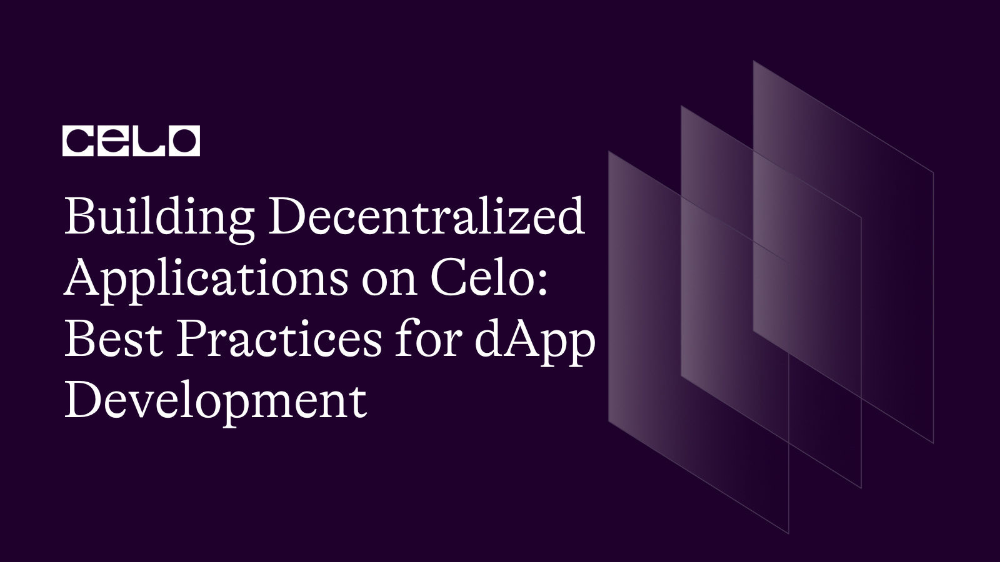

## 🌱 Introduction

Celo is an open-source blockchain platform focused on making decentralized financial tools accessible to anyone with a mobile phone. It offers a unique opportunity for developers to build and deploy decentralized applications (DApps) that have the potential to reach a wide audience.

This tutorial will focus on writing, deploying, testing, and debugging smart contracts using Remix IDE and unit testing to provide an in-depth, hands-on learning experience.

## Prerequisites

Before diving into building DApps on Celo, it's essential to have a solid [understanding of Web3](https://docs.celo.org/blog/tutorials/how-to-become-a-web3-developer) concepts, including blockchain, smart contracts, and decentralized finance (DeFi). It's also crucial to be familiar with the Solidity programming language, which is used to write smart contracts on the Ethereum and Celo platforms.

## Requirements

To build DApps on Celo, you'll need a few tools:

- Celo Wallet: This is the official wallet for the Celo platform, which you'll need to test your DApps on the Celo testnet.

- Remix IDE: This is a web-based Integrated Development Environment (IDE) for writing, testing, and debugging smart contracts.

- Truffle Suite: This is a popular development framework for Ethereum and Celo that provides a suite of tools for building and deploying smart contracts.

## Setting up the Development Environment

### Introduction to Remix IDE

Remix IDE is a powerful, open-source development environment for Solidity, the programming language used to write smart contracts for Ethereum and Celo. It offers various features such as a built-in compiler, debugger, and testing suite to streamline the development process.

To get started with Remix IDE, visit the official website at https://remix.ethereum.org.
In the upper right corner, click on the "Connect to a Local Host" button and choose "Celo" from the list of networks.

## Connecting Remix IDE to the Celo Network

### Configuring network settings

To connect Remix IDE to the Celo network, you'll need to configure the network settings. Click on the "Settings" tab in Remix IDE and scroll down to the "Network" section. Enter the following information:

Network Name: Celo Testnet (Alfajores)
New RPC URL: https://alfajores-forno.celo-testnet.org
Chain ID: 44787

### Setting up Celo wallet and obtaining testnet funds

To interact with the Celo network, you'll need a Celo wallet. For this tutorial, we'll use the MetaMask browser extension. Install MetaMask and set up your Celo wallet by following the instructions here: https://docs.celo.org/getting-started/wallets/using-metamask-with-celo/manual-setup.

Once your wallet is set up, you can obtain testnet funds by visiting the Celo Alfajores Faucet: https://celo.org/developers/faucet.

## Writing a Smart Contract for Celo DApp

### Introduction to Solidity

Solidity is a high-level, statically-typed programming language designed for writing smart contracts on blockchain platforms like Ethereum and Celo. It is influenced by C++, Python, and JavaScript and designed to target the Ethereum Virtual Machine (EVM).

### Developing a Sample Celo DApp Smart Contract

We will create a simple voting smart contract to demonstrate the process of writing, deploying, and testing a Celo DApp.

Defining the contract structure and functions

Create a new file in Remix IDE called "Voting.sol" and add the following code:
Here's a sample voting smart contract that allows users to propose candidates, vote for candidates, and retrieve the winner. The contract makes use of mappings to store candidate data and vote counts.

```solidity
// SPDX-License-Identifier: MIT

pragma solidity ^0.8.0;

contract SimpleVoting {
    struct Candidate {
        uint256 id;
        string name;
        uint256 voteCount;
    }

    mapping(uint256 => Candidate) public candidates;
    mapping(address => bool) public voters;
    uint256 public candidatesCount;

    event CandidateAdded(uint256 indexed candidateId, string name);
    event Voted(address indexed voter, uint256 indexed candidateId);

    function addCandidate(string memory name) public {
        candidatesCount++;
        candidates[candidatesCount] = Candidate(candidatesCount, name, 0);
        emit CandidateAdded(candidatesCount, name);
    }

    function vote(uint256 candidateId) public {
        require(!voters[msg.sender], "You have already voted.");
        require(candidateId > 0 && candidateId <= candidatesCount, "Invalid candidate ID.");

        voters[msg.sender] = true;
        candidates[candidateId].voteCount++;
        emit Voted(msg.sender, candidateId);
    }

    function getWinner() public view returns (uint256 winnerId, string memory winnerName) {
        uint256 highestVoteCount = 0;

        for (uint256 i = 1; i <= candidatesCount; i++) {
            if (candidates[i].voteCount > highestVoteCount) {
                highestVoteCount = candidates[i].voteCount;
                winnerId = candidates[i].id;
                winnerName = candidates[i].name;
            }
        }
    }
}
```

In this contract, we define a struct called `Candidate` to store candidate information. We use two mappings, `candidates` and `voters`, to store candidate data and track whether an address has already voted, respectively. We also define an event for candidate addition and voting.

The contract contains three functions:

1. `addCandidate`: Adds a new candidate with a given name.
2. `vote`: Allows an address to vote for a candidate with a given ID, provided they haven't already voted.
3. `getWinner`: Returns the winner based on the highest vote count.

Remember that this is a simple implementation and does not include advanced features like access control, deadlines, or vote delegation. For a real-world voting system, additional considerations and security measures must be implemented.

## Compiling and Deploying the Smart Contract

### Compiling the smart contract

In Remix IDE, click on the "Solidity Compiler" tab.
Select the appropriate compiler version (e.g., 0.8.0 or later) and click the "Compile Voting.sol" button.
Fix any compilation errors that appear by modifying the code as needed.

### Deploying the smart contract to Celo network

In Remix IDE, click on the "Deploy & Run Transactions" tab.
Make sure the "Injected Web3" environment is selected and the correct Celo network is displayed (e.g., Celo Testnet (Alfajores)).

Enter the CELO token address for the \_celoToken parameter in the constructor (e.g., 0xF194afDf50B03e69Bd7D057c1Aa9e10c9954E4C9 for Alfajores testnet).
Click the "Deploy" button to deploy the smart contract.

## Executing tests in Remix IDE

In Remix IDE, click on the "Solidity Unit Testing" tab.
Click the "Run" button to execute the tests.
Examine the test results and fix any issues that arise.

## Debugging the smart contract

If any tests fail or throw errors, use Remix IDE's debugger to identify the source of the problem.
To open the debugger, click on the "Debugger" tab in Remix IDE.
Set breakpoints in the smart contract code where you suspect issues may be occurring.
Step through the code execution and monitor the values of variables and state changes.
Make any necessary changes to the smart contract code to fix the issues, then re-run the tests to confirm that the issues are resolved.

## Interacting with the Deployed Smart Contract

### Using Remix IDE to interact with the smart contract

Click the "Deploy & Run Transactions" tab in Remix IDE.
Under "Deployed Contracts," locate your deployed Voting contract.
Click on the buttons corresponding to the contract's functions (e.g., castVote() and getTotalVotes()) to interact with the deployed contract.

### Integrating the smart contract into a DApp frontend

To create a simple DApp frontend that interacts with the deployed Voting smart contract, use web3.js and Celo SDK to create a web-based user interface.
Follow the instructions in the Celo SDK documentation to set up a web3.js project and connect it to the Celo network: https://docs.celo.org/developer-guide/start.
Design and implement a user interface that allows users to cast votes and view the total number of votes cast using your deployed Voting smart contract.

## Conclusion

To conclude, this tutorial demonstrated the process of setting up the development environment, writing smart contracts, compiling and deploying them, and testing and debugging using Remix IDE for Celo. We also provided an example of a simple voting smart contract, which can be extended and improved upon for real-world use cases.

Happy coding!

## What's Next

Congratulations on completing this tutorial on building decentralized applications on Celo using best practices for DApp development! Now that you have a solid foundation in DApp development on Celo, here are some suggested next steps:

1. **Join the Celo community:** Join the [Celo Discord community](https://discord.gg/6yWMkgM) to connect with other developers and get involved in the Celo ecosystem.

2. **Build and deploy your own DApp:** Use what you've learned in this tutorial to build and deploy your own DApp on Celo. Test your DApp on a testnet and deploy it to the mainnet.

3. **Learn more about Celo:** Check out the [Celo documentation](https://docs.celo.org/) and explore other Celo resources to continue learning about the platform and its features.

4. **Keep up to date with the latest developments:** Subscribe to the [Celo newsletter](https://celo.org/newsletter) and follow Celo on social media to stay up to date with the latest news and updates.

Thanks for reading! We hope this tutorial has been helpful and we look forward to seeing what you build on Celo.

## About the Author

Elijah Sorinola

Web3 technical writer with a passion for communicating complex technical concepts in a clear and concise manner. [Let's connect](https://www.linkedin.com/in/sorinola/) on LinkedIn to discuss your content needs.

## Reference

1. [Celo Developer Documentation](https://docs.celo.org/developer-guide/overview/introduction)
2. [Celo Github Repository](https://github.com/celo-org)
3. [Solidity Programming Language Documentation](https://docs.soliditylang.org/en/v0.8.9/)
4. [Web3.js Documentation](https://web3js.readthedocs.io/en/v1.4.0/)
5. [Truffle Suite Documentation](https://www.trufflesuite.com/docs)
6. [OpenZeppelin Contracts Documentation](https://docs.openzeppelin.com/contracts/4.x/)
7. [Celo Contract Kit Documentation](https://docs.celo.org/celo-sdk/getting-started/contractkit)
8. [Celo Smart Contract Best Practices](https://docs.celo.org/developer-guide/best-practices/smart-contracts)
9. [Celo DApp Development Tutorial](https://docs.celo.org/developer-guide/building-dapps)
10. [Celo DApp Development Tools](https://docs.celo.org/developer-guide/tools)
