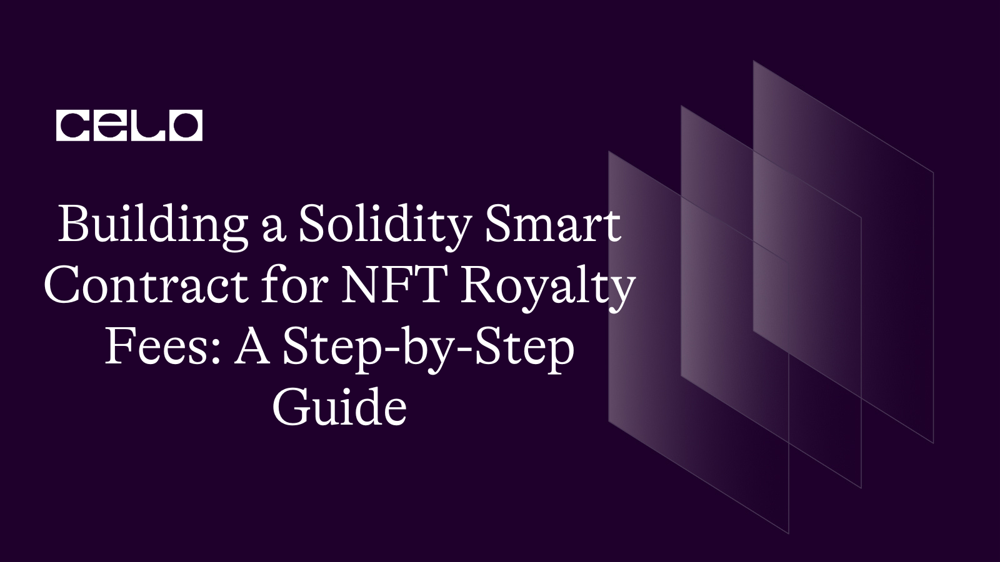

## 🌱 Introduction

As the world of digital assets continues to expand, Non-Fungible Tokens (NFTs) have emerged as a popular form of crypto collectibles. NFTs allow creators to showcase their unique digital creations and monetize them through royalties on subsequent sales. Building a Solidity Smart Contract for NFT Royalty Fees can be a lucrative way for creators to ensure they are paid fairly for their work. In this guide, we will walk you through the process of creating a Solidity Smart Contract step-by-step, allowing you to establish a royalty fee structure for your NFTs on the Ethereum blockchain.

## What are Nft Royalies

NFT royalties are a percentage of the sale price that creators of Non-Fungible Tokens (NFTs) receive each time their NFT is resold on a secondary market. This is made possible through the use of smart contracts, which are self-executing contracts with the terms of the agreement directly written into code. By incorporating royalty fees into their smart contract, NFT creators can ensure they receive a portion of the profits from subsequent sales, creating a new source of income and enabling ongoing support for their work.

### Benefits of Nft Royalies

There are several benefits to incorporating NFT royalties into a smart contract:

- Continuous revenue stream: NFT creators can earn a percentage of the sale price each time their NFT is resold, creating a new source of ongoing income.

- Fair compensation for creators: Royalties ensure that creators are compensated for their work, even after the initial sale, which can help support the creation of new work.

- Transparency and accountability: Smart contracts are transparent and can be audited, ensuring that royalties are distributed fairly and accurately.

- Community engagement: NFT royalties can help build a community around a creator's work, incentivizing collectors to invest in their NFTs and promoting ongoing support for the creator's future projects.

- Increased value of NFTs: By ensuring that creators are fairly compensated for their work, NFTs can increase in value over time, benefiting both the creator and the collector.

## 🗈 Prerequisites

- A computer with an internet connection. You will need a computer with a stable internet connection to follow along with this guide.

- Basic knowledge of programming. While we will provide step-by-step instructions, it will be helpful to have some basic knowledge of programming languages such as JavaScript and Solidity.

- Node.js and npm installed. You will need to have Node.js and npm (the package manager for Node.js) installed on your computer. You can check if you have them installed by running the following commands in your terminal:

```bash
node -v
npm -v
```

- A code editor. You will need a code editor to write and edit your code. Some popular options include Visual Studio Code and Atom.
- A Metamask account. You will need a Metamask account to interact with the Celo blockchain from your web browser. If you don't already have one, you can create one by installing the Metamask extension for Chrome or Firefox.

## ⚠️ Requirements

- Truffle: a development environment, testing framework, and asset pipeline for Ethereum
- Node.js: a JavaScript runtime that allows you to run JavaScript on the command line
- Yarn: a package manager for JavaScript
- next: Next.js is a framework for building server-rendered or statically-exported React applications.
- CeloCli - The celocli lets you interact with the Celo Protocol smart contracts.

**_ Let's start building the future together! _**

:::tip
To learn more about setting up the environment to create Lazy Mint NFTs , check out the **[step-by-step guide to deploying your first full-stack dApp on Celo](https://docs.celo.org/blog/tutorials/step-by-step-guide-to-deploying-your-first-full-stack-dapp-on-celo#steps-to-set-up-the-truffle-project-and-its-configs)**, which provides detailed instructions on getting started.
:::

## How to Create NFT Royalties Smart Contract

Creating a smart contract for NFT royalties requires some technical knowledge of smart contracts and blockchain technology. Here are the steps to create an NFT royalties smart contract:

- Step - 1 : Create a Smart Contract

The first step in creating an NFT royalties smart contract is to choose a blockchain platform. The most popular platform for creating NFTs with royalty features is Celo Blockchain.

```solidity
// SPDX-License-Identifier: MIT

import "@openzeppelin/contracts/token/ERC721/ERC721.sol";
import "@openzeppelin/contracts/token/ERC721/extensions/ERC721Enumerable.sol";
import "@openzeppelin/contracts/access/Ownable.sol";

pragma solidity >=0.7.0 <0.9.0;

contract NFT is ERC721Enumerable, Ownable {
    using Strings for uint256;

    uint256 public cost = 0.5 ether;
    uint256 public maxSupply = 100;

    string baseURI;
    string public baseExtension = ".json";

    address public artist;
    uint256 public royalityFee;

    event Sale(address from, address to, uint256 value);

    constructor(
        string memory _name,
        string memory _symbol,
        string memory _initBaseURI,
        uint256 _royalityFee,
        address _artist
    ) ERC721(_name, _symbol) {
        setBaseURI(_initBaseURI);
        royalityFee = _royalityFee;
        artist = _artist;
    }

    // Public functions
    function mint() public payable {
        uint256 supply = totalSupply();
        require(supply <= maxSupply);

        if (msg.sender != owner()) {
            require(msg.value >= cost);

            // Pay royality to artist, and remaining to deployer of contract

            uint256 royality = (msg.value * royalityFee) / 100;
            _payRoyality(royality);

            (bool success2, ) = payable(owner()).call{
                value: (msg.value - royality)
            }("");
            require(success2);
        }

        _safeMint(msg.sender, supply + 1);
    }

    function tokenURI(uint256 tokenId)
        public
        view
        virtual
        override
        returns (string memory)
    {
        require(
            _exists(tokenId),
            "ERC721Metadata: URI query for nonexistent token"
        );

        string memory currentBaseURI = _baseURI();
        return
            bytes(currentBaseURI).length > 0
                ? string(
                    abi.encodePacked(
                        currentBaseURI,
                        tokenId.toString(),
                        baseExtension
                    )
                )
                : "";
    }

    // Internal functions
    function _baseURI() internal view virtual override returns (string memory) {
        return baseURI;
    }

    function _payRoyality(uint256 _royalityFee) internal {
        (bool success1, ) = payable(artist).call{value: _royalityFee}("");
        require(success1);
    }

    // Owner functions
    function setBaseURI(string memory _newBaseURI) public onlyOwner {
        baseURI = _newBaseURI;
    }

    function setRoyalityFee(uint256 _royalityFee) public onlyOwner {
        royalityFee = _royalityFee;
    }
}
```

This is a Solidity smart contract for an NFT with royalty fees. It extends the ERC721 and ERC721Enumerable contracts, allowing for unique tokens and enumeration. It also includes an Ownable contract for ownership control.

The contract has a cost of 0.5 ether and a maximum supply of 100 tokens.

The artist address is stored and given a royalty fee, and the contract owner also receives a percentage of the sale. The contract includes a mint function for creating new tokens and a tokenURI function for metadata.

- using Strings for uint256;: This line imports the Strings library and applies it to the uint256 type. This allows the contract to use string conversion functions on uint256 values.

- uint256 public cost = 0.5 ether;: This line declares a public uint256 variable named cost and initializes it with a value of 0.5 ether. This variable represents the cost in wei to mint a new NFT.

- uint256 public maxSupply = 100;: This line declares a public uint256 variable named maxSupply and initializes it with a value of 100. This variable represents the maximum number of NFTs that can be minted in the contract.

- string baseURI;: This line declares a string variable named baseURI that will be used as the base URI for the NFTs.

- string public baseExtension = ".json";: This line declares a public string variable named baseExtension and initializes it with a value of ".json". This variable represents the file extension for the metadata files of the NFTs.

- address public artist;: This line declares a public address variable named artist. This variable represents the address of the artist who created the NFTs.

- uint256 public royalityFee;: This line declares a public uint256 variable named royalityFee. This variable represents the percentage of the cost that will be paid as royalty to the artist.

- event Sale(address from, address to, uint256 value);: This line declares an event named Sale that will be emitted whenever an NFT is minted.

- constructor(...): This is the constructor function that is called when the contract is deployed. It takes five parameters: \_name, \_symbol, \_initBaseURI, \_royalityFee, and \_artist. It calls the constructor of the ERC721 contract with \_name and \_symbol as arguments, and sets the initial base URI to \_initBaseURI. It also sets the royalityFee and artist variables.

- function mint() public payable {...}: This is the function that is called when a user wants to mint an NFT. It is a public function that is payable, which means that the user must send enough Ether to cover the cost of the NFT. If the user is not the owner of the contract, a royalty fee is deducted from the cost and sent to the artist. The remaining amount is sent to the contract owner. The \_safeMint function is then called to mint a new NFT and assign it to the sender.

- function tokenURI(uint256 tokenId) public view virtual override returns (string memory) {...}: This function is used to get the URI for a specific NFT. It takes the tokenId as an argument and returns a string that represents the metadata URI for the NFT.

- function \_baseURI() internal view virtual override returns (string memory) {...}: This is an internal function that returns the current baseURI of the contract. It is used by the tokenURI function to construct the complete URI for the NFT.

- function \_payRoyality(uint256 \_royalityFee) internal {...}: This is an internal function that is used to pay the royalty fee to the artist. It takes the royalty fee amount as an argument and sends it to the artist address.

- function setBaseURI(string memory \_newBaseURI) public onlyOwner {...}: This function can be called by the owner of the contract to set a new baseURI.

- function setRoyalityFee(uint256 \_royalityFee) public onlyOwner {...}: This function can only be called by owner to set update royalityfee.

- Step 2: Deploy the Smart Contract
  Once the smart contract is created, it needs to be deployed on a blockchain network. There are several blockchain networks that support NFT creation, including Ethereum, Binance Smart Chain, and Solana.

Deploying a smart contract requires the use of a blockchain wallet and a smart contract deployment tool. Some popular tools include Remix, Truffle, and Hardhat. These tools allow you to deploy your smart contract to the blockchain network of your choice.

:::tip
To learn more about setting up the environment to create Lazy Mint NFTs , check out the **[step-by-step guide to deploying your first full-stack dApp on Celo](https://docs.celo.org/blog/tutorials/step-by-step-guide-to-deploying-your-first-full-stack-dapp-on-celo#steps-to-set-up-the-truffle-project-and-its-configs)**, which provides detailed instructions on getting started.
:::

## Conclusion

In conclusion, building a Solidity smart contract for NFT royalty fees is an important step for creators to protect their intellectual property and ensure they receive the appropriate compensation for their work. This step-by-step guide provides a comprehensive overview of the necessary code and functions required to create such a contract. By leveraging the OpenZeppelin library, creators can easily incorporate royalty fees into their NFTs, ensuring that they receive a percentage of any sales in perpetuity. The guide also includes tips for testing and deploying the contract, as well as best practices for setting royalty fees and creating an effective contract structure. By following this guide, creators can have confidence that their NFTs are protected and that they are receiving the compensation they deserve for their work.

## About Author

Hi! My name is Kunal Dawar and I am a Full Stack web2/web3 Developer. I have participated in numerous hackathons and have been fortunate enough to win many of them.

One thing that I am truly passionate about is creating things that are reliable and don't break easily. I believe that creating high-quality products is important not only for the users but also for the overall growth and success of a business.

In my free time, I enjoy learning about new technologies and staying up-to-date with the latest trends in the field. I also love to share my knowledge with others and mentor those who are interested in pursuing a career in web development.

## References

- [Source code](https://github.com/developerkunal/nft-royalty-smart-contract)
