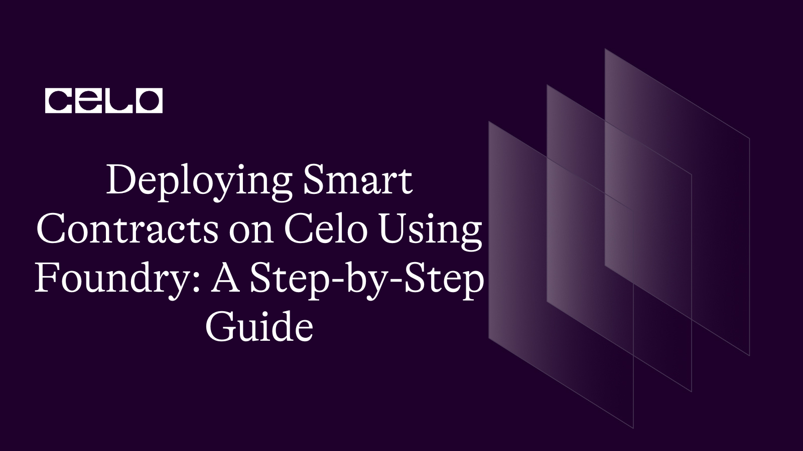
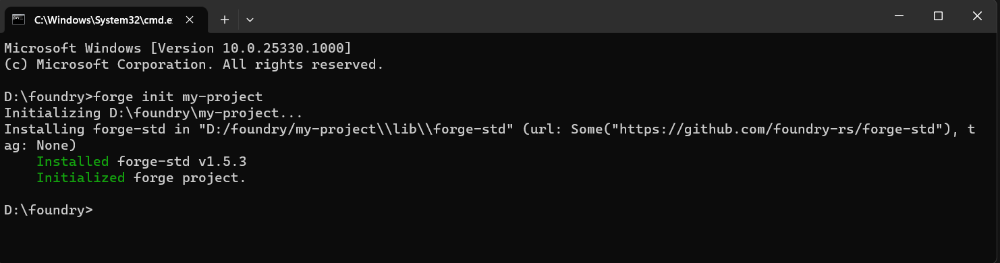
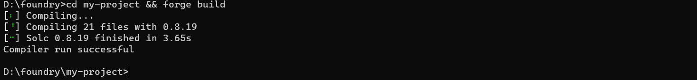
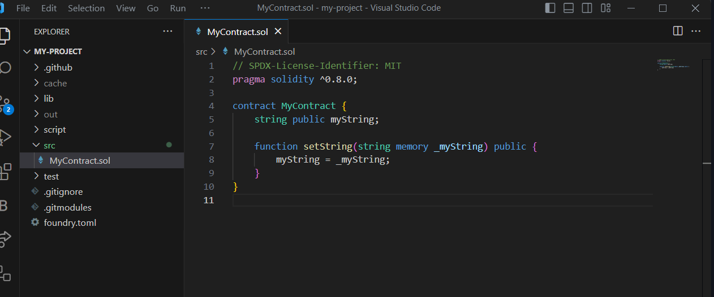
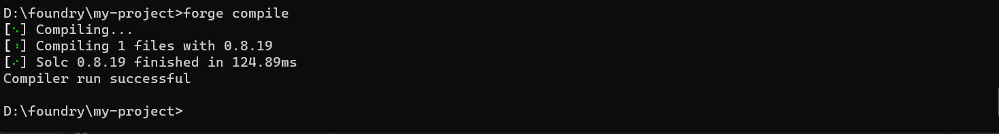
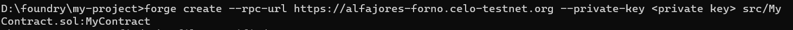
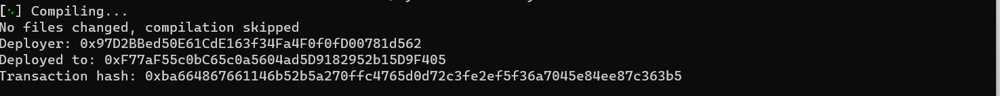

## 🌱 Introduction

Celo is an open-source blockchain platform that aims to make financial systems more accessible to people worldwide. Smart contracts are a key feature of Celo, as they allow for the creation of decentralized applications and the execution of complex financial transactions. Foundry is a development tool that simplifies the process of building and deploying smart contracts on the Celo blockchain. In this guide, we will walk you through the process of deploying smart contracts on Celo using Foundry.

## 🗈 Prerequisites

Before you can deploy smart contracts on Celo using Foundry, you need to have the following prerequisites:

- A basic understanding of smart contracts and their deployment process
- Node.js and npm installed on your computer
- A Celo wallet with testnet CELO tokens
- Foundry CLI installed on your computer
- Step 1: Create a new project
- To create a new project using Foundry, you need to run the following

## Installing foundry on system

### On Linux and macOS

If you use Linux or macOS, there are two different ways to install Foundry.

#### Install the latest release by using foundryup

- This is the easiest option for Linux and macOS users.

Open your terminal and type in the following command:

```bash
curl -L https://foundry.paradigm.xyz | bash
```

This will download `foundryup`. Then install Foundry by running:

```bash
foundryup
```

If everything goes well, you will now have four binaries at your disposal: `forge`, `cast`, `anvil`, and `chisel`.

- If you use macOS and face the error below, you need to type brew install libusb to install the Library

```bash
dyld[32719]: Library not loaded: /usr/local/opt/libusb/lib/libusb-1.0.0.dylib
```

:::tip
To update foundryup after installation, simply run `foundryup` again, and it will update to the latest Foundry release. You can also revert to a specific version of Foundry with `foundryup -v $VERSION`.
:::

#### Building from source

To build from source, you need to get Rust and Cargo. The easiest way to get both is by using rustup.

- On Linux and macOS, this is done as follows:

```bash
curl https://sh.rustup.rs -sSf | sh
```

It will download a script and start the installation.

#### On Windows, build from the source

If you use Windows, you need to build from the source to get Foundry.

Download and run rustup-init from [rustup.rs](https://win.rustup.rs/x86_64). It will start the installation in a console.

If you encounter an error, it is most likely the case that you do not have the VS Code Installer which you can [download here](https://visualstudio.microsoft.com/downloads/) and install.

After this, run the following to build Foundry from the source:

```bash
cargo install --git https://github.com/foundry-rs/foundry foundry-cli anvil chisel --bins --locked
```

To update from the source, run the same command again.

## Deploying smart contract using foundry

- Step 1 : Create Project using `forge` command.



```bash
forge init my-project
```

once the project is created, use commands to check if everything is working correctly

This will create a new project folder named "my-project" in your current directory. You can replace "my-project" with any name you prefer.



```bash
cd my-project && forge build
```

- Step 2: Write your smart contract

Inside your project folder, you will find a folder named "src". This is where you will write your smart contract code. For example, let's create a simple smart contract that stores a string:



```solidity
// SPDX-License-Identifier: MIT
pragma solidity ^0.8.0;

contract MyContract {
    string public myString;

    function setString(string memory _myString) public {
        myString = _myString;
    }
}
```

Save this code in a new file named "MyContract.sol" inside the "contracts" folder.

- Step 3: Compile your smart contract

To compile your smart contract, you need to run the following command in your terminal:



```bash
forge compile
```

**_if you found any error you need to delete `counter.sol` in `test` folder._**

This will compile your smart contract code and generate the necessary artifacts in a folder named "out" inside your project folder.

- Step 4: Deploy your smart contract
  To deploy your smart contract on the Celo blockchain, you need to run the following command in your terminal:





```bash
forge create --rpc-url https://alfajores-forno.celo-testnet.org --private-key <privatekey> src/MyContract.sol:MyContract
```

Forge can deploy smart contracts to a given network with the [forge create](https://book.getfoundry.sh/reference/forge/forge-create.html) command.

Some options we can use with forge create while deploying the contract

- —rpc-url : Rpc URL of the network on which we want to deploy our contract (in our case we will be using the RPC URL of polygon mumbai testnet)
- -constructor-args : Pass arguments to the constructor
- -private-key : Private key of deployers wallet

We can optionally pass --verify && --etherscan-api-key if we want to verify our contract

## Conclusion

Deploying smart contracts on Celo using Foundry is a simple and straightforward process that requires only a few steps. By following this step-by-step guide, you can create, compile, deploy, and interact with your own smart contracts on the Celo blockchain.

## About Author

Hi! My name is Kunal Dawar and I am a Full Stack web2/web3 Developer. I have participated in numerous hackathons and have been fortunate enough to win many of them.

One thing that I am truly passionate about is creating things that are reliable and don't break easily. I believe that creating high-quality products is important not only for the users but also for the overall growth and success of a business.

In my free time, I enjoy learning about new technologies and staying up-to-date with the latest trends in the field. I also love to share my knowledge with others and mentor those who are interested in pursuing a career in web development.

## References

- [Source Code](https://github.com/developerkunal/foundry-smart-contract-deployment/)
