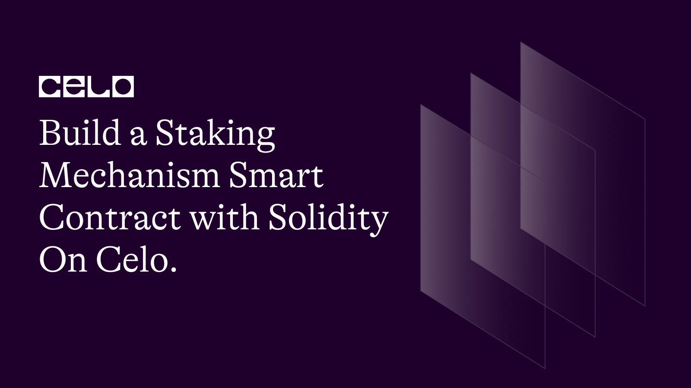

## Introduction

Staking mechanisms are a popular way to incentivize users to hold their cryptocurrency for a certain period of time. They involve locking up funds in a smart contract for a predetermined duration, during which time the user earns rewards. These rewards can be in the form of additional cryptocurrency, tokens, or other assets.

In this tutorial, we will build a staking mechanism using solidity and deploy on the celo blockchain.

Here's the github repo of our code. [source code](https://github.com/richiemikke/staking-smart-contract)

## Prerequisites

To follow this tutorial, you will need the following:

- Basic knowledge of Solidity programming language.
- A Development Environment Like Remix.
- The celo Extension Wallet.

## SmartContract

Let's begin writing our smart contract in Remix IDE

The completed code Should look like this.

```solidity
// SPDX-License-Identifier: MIT
pragma solidity ^0.8.0;

contract StakingMechanism {

    mapping(address => uint256) public balances;
    mapping(address => uint256) public timeStaked;

    uint256 public minimumStake = 100 ether;
    uint256 public rewardRate = 1 ether;
    uint256 public minimumStakeTime = 7 days;
    uint256 public constant maximumStakeDuration = 30 days;

    address public owner;

    event Staked(address indexed user, uint256 amount);
    event Unstaked(address indexed user, uint256 amount, uint256 reward);

    modifier onlyOwner {
        require(msg.sender == owner, "Only the contract owner can call this function");
        _;
    }

    constructor() {
        owner = msg.sender;
    }

    function setMinimumStake(uint256 newMinimumStake) public onlyOwner {
        minimumStake = newMinimumStake;
    }

    function setRewardRate(uint256 newRewardRate) public onlyOwner {
        rewardRate = newRewardRate;
    }

    function stake() public payable {
        require(msg.value >= minimumStake, "Staking amount must be at least 100 ether");
        balances[msg.sender] += msg.value;
        timeStaked[msg.sender] = block.timestamp;
        emit Staked(msg.sender, msg.value);
    }

    function balanceOf(address user) public view returns (uint256) {
        return balances[user];
    }

    function unstake() public {
        uint256 balance = balances[msg.sender];
        require(balance > 0, "No balance to unstake");
        uint256 _timeStaked = timeStaked[msg.sender];
        uint256 timeElapsed = block.timestamp - _timeStaked;
        require(timeElapsed >= minimumStakeTime, "You must wait at least 7 days before unstaking");
        uint256 reward = rewardRate * timeElapsed;
        balances[msg.sender] = 0;
        timeStaked[msg.sender] = 0;
        emit Unstaked(msg.sender, balance, reward);
        payable(msg.sender).transfer(balance + reward);
    }

    function withdraw() public onlyOwner {
        payable(owner).transfer(address(this).balance);
    }

    function withdrawReward() public {
        uint256 balance = balances[msg.sender];
        uint256 _timeStaked = timeStaked[msg.sender];
        uint256 timeElapsed = block.timestamp - _timeStaked;
        uint256 reward = rewardRate * timeElapsed;
        require(reward > 0, "No rewards to withdraw");
        balances[msg.sender] = balance;
        timeStaked[msg.sender] = block.timestamp;
        payable(msg.sender).transfer(reward);
    }

    function transferOwnership(address newOwner) public onlyOwner {
        require(newOwner != address(0), "New owner address is invalid");
        owner = newOwner;
    }

    function extendStakeDuration() public {
        uint256 _timeStaked = timeStaked[msg.sender];
        uint256 timeElapsed = block.timestamp - _timeStaked;
        require(timeElapsed < maximumStakeDuration, "You cannot extend your stake duration any further");
        uint256 remainingTime = maximumStakeDuration - timeElapsed;
        require(remainingTime >= minimumStakeTime, "You must wait at least 7 days before extending your stake duration again");
        uint256 extensionReward = rewardRate * remainingTime;
        balances[msg.sender] += extensionReward;
        timeStaked[msg.sender] = block.timestamp;
    }

    function splitStake(uint256[] memory amounts) public {
        uint256 totalAmount = 0;
    for (uint256 i = 0; i < amounts.length; i++) {
        require(amounts[i] >= minimumStake, "Staking amount must be at least 100 ether");
        totalAmount += amounts[i];
    }
    require(totalAmount == balances[msg.sender], "Invalid stake amounts");
    balances[msg.sender] = 0;
    timeStaked[msg.sender] = 0;
    for (uint256 i = 0; i < amounts.length; i++) {
        balances[msg.sender] += amounts[i];
        timeStaked[msg.sender] = block.timestamp;
        emit Staked(msg.sender, amounts[i]);
    }
}
}
```

## Code Breakdown

First, we declared our license and the solidity version.

```solidity
// SPDX-License-Identifier: MIT
  pragma solidity ^0.8.0;
```

Detailed Explanation of the code:

**Contract Variables**

The first part of the contract defines several variables that will be used throughout the code. These include:

```solidity
    mapping(address => uint256) public balances;
    mapping(address => uint256) public timeStaked;

    uint256 public minimumStake = 100 ether;
    uint256 public rewardRate = 1 ether;
    uint256 public minimumStakeTime = 7 days;
    uint256 public constant maximumStakeDuration = 30 days;

    address public owner;
```

- A mapping called `balances` that maps user addresses to their staked Ether balances.
- A mapping called `timeStaked` that maps user addresses to the time they staked their Ether.
- A uint256 called `minimumStake` that defines the minimum amount of Ether that can be staked.
- A uint256 called `rewardRate` that defines the rate at which rewards will be earned.
- A uint256 called `minimumStakeTime` that defines the minimum amount of time that must pass before a user can unstake their Ether.
- A constant uint256 called `maximumStakeDuration` that defines the maximum amount of time a user can stake their Ether for.
- An address called `owner` that will be set to the address of the contract deployer and will have certain permissions.

**Contract Events**

The next part of the contract defines two events that will be used to log stake and unstake transactions.

```solidity
event Staked(address indexed user, uint256 amount);
event Unstaked(address indexed user, uint256 amount, uint256 reward);
```

- An event called `Staked` that logs the user address and staked amount when a user stakes Ether.
- An event called `Unstaked` that logs the user address, unstaked amount, and reward earned when a user unstakes their Ether.

**Modifier**

```solidity
modifier onlyOwner {
        require(msg.sender == owner, "Only the contract owner can call this function");
        _;
    }
```

The `onlyOwner` modifier restricts certain functions to the contract owner only. This modifier is used to protect sensitive functions that should only be accessed by the contract owner.

**Constructor**

```solidity
 constructor() {
        owner = msg.sender;
    }
```

The constructor function sets the `owner` variable to the address of the contract deployer. This function is called only once when the contract is deployed.

**Functions**

```solidity
 function setMinimumStake(uint256 newMinimumStake) public onlyOwner {
        minimumStake = newMinimumStake;
    }

    function setRewardRate(uint256 newRewardRate) public onlyOwner {
        rewardRate = newRewardRate;
    }
```

The `setMinimumStake` and `setRewardRate` functions allow the contract owner to modify the `minimumStake` and `rewardRate` variables, respectively. These functions are restricted to the contract owner only.

```solidity
function stake() public payable {
        require(msg.value >= minimumStake, "Staking amount must be at least 100 ether");
        balances[msg.sender] += msg.value;
        timeStaked[msg.sender] = block.timestamp;
        emit Staked(msg.sender, msg.value);
    }
```

The `stake` function allows a user to stake Ether by sending it to the contract. The function checks that the amount being staked is at least the minimum stake requirement, updates the user's balance and stake time in the `balances` and `timeStaked` mappings, respectively, and logs the transaction with the `Staked` event.

```solidity
 function balanceOf(address user) public view returns (uint256) {
        return balances[user];
    }
```

The `balanceOf` function allows a user to query their staked Ether balance by returning the value stored in the `balances` mapping for their address.

```solidity
 function unstake() public {
        uint256 balance = balances[msg.sender];
        require(balance > 0, "No balance to unstake");
        uint256 _timeStaked = timeStaked[msg.sender];
        uint256 timeElapsed = block.timestamp - _timeStaked;
        require(timeElapsed >= minimumStakeTime, "You must wait at least 7 days before unstaking");
        uint256 reward = rewardRate * timeElapsed;
        balances[msg.sender] = 0;
        timeStaked[msg.sender] = 0;
        emit Unstaked(msg.sender, balance, reward);
        payable(msg.sender).transfer(balance + reward);
    }
```

The `unstake` function allows a user to unstake their Ether after a minimum amount of time has passed. The function checks that the user has a non-zero balance, that the minimum stake time has passed, calculates the reward earned based on the time staked and reward rate, updates the user's balance and stake time to zero in the `balances` and `timeStaked` mappings, respectively, logs the transaction with the `Unstaked` event, and transfers the unstaked amount plus reward to the user's address.

```solidity
function withdraw() public onlyOwner {
        payable(owner).transfer(address(this).balance);
    }
```

The `withdraw` function allows the contract owner to withdraw any Ether balance held by the contract. This function is restricted to the contract owner only.

```solidity
    function withdrawReward() public {
        uint256 balance = balances[msg.sender];
        uint256 _timeStaked = timeStaked[msg.sender];
        uint256 timeElapsed = block.timestamp - _timeStaked;
        uint256 reward = rewardRate * timeElapsed;
        require(reward > 0, "No rewards to withdraw");
        balances[msg.sender] = balance;
        timeStaked[msg.sender] = block.timestamp;
        payable(msg.sender).transfer(reward);
    }
```

The `withdrawReward` function allows a user to withdraw any earned rewards without unstaking their Ether. The function checks that the user has earned rewards, calculates the reward based on the time elapsed since staking, updates the user's stake time to the current time, logs the transaction with the `Staked` event, and transfers the reward to the user's address.

```solidity
function transferOwnership(address newOwner) public onlyOwner {
        require(newOwner != address(0), "New owner address is invalid");
        owner = newOwner;
    }
```

The `transferOwnership` function allows the contract owner to transfer ownership of the contract to another address. The function checks that the new owner address is valid and updates the `owner` variable to the new owner address. This function is restricted to the contract owner only.

```solidity
  function extendStakeDuration() public {
        uint256 _timeStaked = timeStaked[msg.sender];
        uint256 timeElapsed = block.timestamp - _timeStaked;
        require(timeElapsed < maximumStakeDuration, "You cannot extend your stake duration any further");
        uint256 remainingTime = maximumStakeDuration - timeElapsed;
        require(remainingTime >= minimumStakeTime, "You must wait at least 7 days before extending your stake duration again");
        uint256 extensionReward = rewardRate * remainingTime;
        balances[msg.sender] += extensionReward;
        timeStaked[msg.sender] = block.timestamp;
    }
```

The `extendStakeDuration` function allows a user to extend their stake duration by earning additional rewards. The function checks that the maximum stake duration has not been reached, that the minimum stake time has passed, calculates the remaining time and reward based on the maximum stake duration and time elapsed since staking, updates the user's balance and stake time in the `balances` and `timeStaked` mappings, respectively, and transfers the reward to the user's address.

```solidity
 function splitStake(uint256[] memory amounts) public {
        uint256 totalAmount = 0;
    for (uint256 i = 0; i < amounts.length; i++) {
        require(amounts[i] >= minimumStake, "Staking amount must be at least 100 ether");
        totalAmount += amounts[i];
    }
    require(totalAmount == balances[msg.sender], "Invalid stake amounts");
    balances[msg.sender] = 0;
    timeStaked[msg.sender] = 0;
    for (uint256 i = 0; i < amounts.length; i++) {
        balances[msg.sender] += amounts[i];
        timeStaked[msg.sender] = block.timestamp;
        emit Staked(msg.sender, amounts[i]);
    }
}
```

The `splitStake` function allows a user to split their staked amount into multiple amounts. The function checks that each amount is at least the minimum stake requirement, that the total amount equals the user's current balance, updates the user's balance and stake time for each amount in the `balances` and `timeStaked` mappings, respectively, and logs each transaction with the `Staked` event.

## Deployment

**Install the Celo Plugin**

First, you'll need to install the Celo Plugin for Remix. To do this, open Remix and click on the `Plugin Manager` icon on the left-hand side. Search for `Celo` and click the `Install` button next to the Celo Plugin. Once the installation is complete, you'll see a new `Celo` tab appear in the sidebar.

**Connect to the Celo Alfajores Testnet**

To deploy our smart contract successfully, we need the celo extention wallet which can be downloaded from [here](https://chrome.google.com/webstore/detail/celoextensionwallet/kkilomkmpmkbdnfelcpgckmpcaemjcdh?hl=en)

Next, we need to fund our newly created wallet which can done using the celo alfojares faucet [Here](https://celo.org/developers/faucet)

Next, you'll need to connect Remix to the Celo Testnet. Click on the `Celo` tab in the sidebar and then click on the `Connect to Network` button.

**Compile Contract**

Open the `StakingMechanism.sol` file in Remix and click on the `Solidity Compiler` tab in the sidebar. Click the `Compile StakingMechanism.sol` button to compile the contract.

**Deploy the Contract**

Click on the `Deploy & Run Transactions` tab in the sidebar. In the `Contract` dropdown menu, select `StakingMechanism`.

**Interact with the Contract**

Once the contract is deployed, you can interact with it using the functions in the `Deployed Contracts` section of the `Deploy & Run Transactions` tab. You'll need to connect to the contract using the `At Address` button and entering the contract address. From there, you can call the various functions of the contract, such as staking, unstaking, withdrawing rewards, and transferring ownership.

That's it! With these steps, you should be able to deploy the `StakingMechanism` smart contract to the Celo Testnet using Remix and the Celo Plugin.

## Conclusion

In this tutorial, we built a Staking Mechanism smart contract that allows users to stake Celo and earn rewards. We reviewed each function and feature of the contract and provided a detailed explanation of how they work. This smart contract can be used to create a staking platform for various cryptocurrencies or assets.

## Learn More

I hope you learned a lot from this tutorial. Here are some relevant links that would aid your learning further.

- [Celo Docs](https://docs.celo.org/)
- [Solidity Docs](https://docs.soliditylang.org/en/v0.8.17/)

## About the author

Hello, I'am Richard Michael, a fullstack web3 developer.
