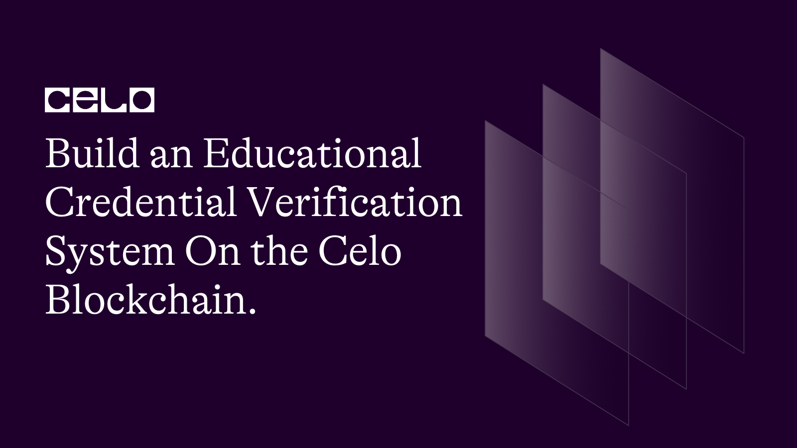

## Introduction

In this tutorial, you will learn how to create an educational credential verification system on the Celo Blockchain. We will explore how to leverage blockchain technology for securely storing, validating, and verifying educational credentials such as degrees, diplomas, and certificates. By the end of this tutorial, you will be able to create and deploy your own educational credential verification system and understand the benefits of using blockchain technology for this purpose.

[Full source code](https://github.com/4undRaiser/edu-verification-smart-contract)

## Prerequisites

To follow this tutorial, you will need the following:

- Basic knowledge of Solidity programming language.
- A Development Environment Like Remix.
- The celo Extension Wallet.

## SmartContract

Let's begin writing our smart contract in Remix IDE

The completed code Should look like this.

```solidity
 // SPDX-License-Identifier: MIT
pragma solidity ^0.8.0;

import "@openzeppelin/contracts/token/ERC721/ERC721.sol";
import "@openzeppelin/contracts/access/AccessControl.sol";
import "@openzeppelin/contracts/utils/Counters.sol";

contract EducationCredentialVerification is ERC721, AccessControl {
    using Counters for Counters.Counter;

    bytes32 public constant ISSUER_ROLE = keccak256("ISSUER_ROLE");

    struct Credential {
        uint256 tokenId;
        string institution;
        string degree;
        string major;
        string studentName;
        uint256 dateIssued;
        bool isRevoked;
    }

    mapping(uint256 => Credential) public credentials;
    Counters.Counter private _tokenIds;

    event CredentialIssued(uint256 indexed tokenId, string studentName, string degree, string major, string institution, uint256 dateIssued);
    event CredentialRevoked(uint256 indexed tokenId);

    constructor() ERC721("EducationCredential", "EDUC") {
        _setupRole(DEFAULT_ADMIN_ROLE, _msgSender());
    }

    function issueCredential(
        string memory institution,
        string memory degree,
        string memory major,
        string memory studentName,
        uint256 dateIssued,
        address recipient
    ) public onlyRole(ISSUER_ROLE) {
        _tokenIds.increment();
        uint256 tokenId = _tokenIds.current();
        _safeMint(recipient, tokenId);

        Credential memory newCredential = Credential(
            tokenId,
            institution,
            degree,
            major,
            studentName,
            dateIssued,
            false
        );

        credentials[tokenId] = newCredential;

        emit CredentialIssued(tokenId, studentName, degree, major, institution, dateIssued);
    }

    function revokeCredential(uint256 tokenId) public onlyRole(ISSUER_ROLE) {
        require(_exists(tokenId), "Credential not found");

        credentials[tokenId].isRevoked = true;

        emit CredentialRevoked(tokenId);
    }

    function isCredentialValid(uint256 tokenId) public view returns (bool) {
        return _exists(tokenId) && !credentials[tokenId].isRevoked;
    }

    function getCredential(uint256 tokenId) public view returns (Credential memory) {
        require(_exists(tokenId), "Credential not found");

        return credentials[tokenId];
    }

    function grantIssuerRole(address account) public onlyRole(DEFAULT_ADMIN_ROLE) {
        grantRole(ISSUER_ROLE, account);
    }

    function revokeIssuerRole(address account) public onlyRole(DEFAULT_ADMIN_ROLE) {
        revokeRole(ISSUER_ROLE, account);
    }

    function supportsInterface(bytes4 interfaceId) public view virtual override(ERC721, AccessControl) returns (bool) {
        return super.supportsInterface(interfaceId);
    }
}

```

### Breakdown

First, we declared our license and the solidity version. then we import all the neccessary openzeppelin contracts

```solidity
// SPDX-License-Identifier: MIT
pragma solidity ^0.8.0;

import "@openzeppelin/contracts/token/ERC721/ERC721.sol";
import "@openzeppelin/contracts/access/AccessControl.sol";
import "@openzeppelin/contracts/utils/Counters.sol";
```

The `EducationCredentialVerification` contract extends the `ERC-721` token standard. `ERC-721` is a standard for creating unique, non-fungible tokens on the Celo blockchain. In this contract, we will use `ERC-721` to create unique educational credentials for students.

The `AccessControl` library is also imported and utilized in the `EducationCredentialVerification` contract. `AccessControl` allows us to define roles for various participants in the system. In this contract, we define the `ISSUER_ROLE` which is granted to educational institutions that are authorized to issue credentials.

```solidity
contract EducationCredentialVerification is ERC721, AccessControl {
    using Counters for Counters.Counter;

    bytes32 public constant ISSUER_ROLE = keccak256("ISSUER_ROLE");

    struct Credential {
        uint256 tokenId;
        string institution;
        string degree;
        string major;
        string studentName;
        uint256 dateIssued;
        bool isRevoked;
    }

    mapping(uint256 => Credential) public credentials;
    Counters.Counter private _tokenIds;
}
```

`ISSUER_ROLE`: This is a bytes32 constant variable that defines the name of the role granted to educational institutions that are authorized to issue credentials.

We created a struct `Credential`, which is used to store the details of each educational credential. The Credential struct has the following attributes:

- `tokenId`: A unique identifier for the educational credential.
  institution: The name of the educational institution that issued the credential.
- `degree`: The degree earned by the student.
  major: The student's area of study.
- `studentName`: The name of the student who earned the credential.
  dateIssued: The date the credential was issued.
- `isRevoked`: A boolean value indicating whether the credential has been revoked.

A mapping `credentials` is used to store the credentials issued by educational institutions. The keys in the mapping are the `tokenIds` of the educational credentials, and the values are instances of the Credential struct.

We then use the Counters library to manage the unique `tokenId` assigned to each educational credential.

```solidity
event CredentialIssued(uint256 indexed tokenId, string studentName, string degree, string major, string institution, uint256 dateIssued);
event CredentialRevoked(uint256 indexed tokenId);
```

The contract emits two events:

- `CredentialIssued`: This event is emitted when an educational credential is issued.
- `CredentialRevoked`: This event is emitted when an educational credential is revoked.

```solidity
constructor() ERC721("EducationCredential", "EDUC") {
        _setupRole(DEFAULT_ADMIN_ROLE, _msgSender());
    }
```

The constructor sets up the default admin role and initializes the `ERC-721` token by setting its name to `EducationCredential` and its symbol to `EDUC`.

```solidity
function issueCredential(
        string memory institution,
        string memory degree,
        string memory major,
        string memory studentName,
        uint256 dateIssued,
        address recipient
    ) public onlyRole(ISSUER_ROLE) {
        _tokenIds.increment();
        uint256 tokenId = _tokenIds.current();
        _safeMint(recipient, tokenId);

        Credential memory newCredential = Credential(
            tokenId,
            institution,
            degree,
            major,
            studentName,
            dateIssued,
            false
        );

        credentials[tokenId] = newCredential;

        emit CredentialIssued(tokenId, studentName, degree, major, institution, dateIssued);
    }
```

The `issueCredential` function is used by educational institutions to issue educational credentials. The function takes in several arguments, including the name of the institution, the degree earned by the student, the major of the student, the name of the student, the date the credential was issued, and the recipient address.

The function then creates a new unique `tokenId` using the Counters library, mints a new `ERC-721` token using the `_safeMint` function, and assigns the token to the recipient address. Finally, the function creates a new instance of the Credential struct, stores it in the credentials mapping, and emits the `CredentialIssued` event.

```solidity
  function revokeCredential(uint256 tokenId) public onlyRole(ISSUER_ROLE) {
        require(_exists(tokenId), "Credential not found");

        credentials[tokenId].isRevoked = true;

        emit CredentialRevoked(tokenId);
    }
```

The `revokeCredential` function is used by educational institutions to revoke previously issued educational credentials. The function takes in a `tokenId` as an argument, checks if the credential exists, and sets the `isRevoked` attribute of the corresponding `Credential` struct to true. Finally, the function emits the `CredentialRevoked` event.

```solidity
function isCredentialValid(uint256 tokenId) public view returns (bool) {
        return _exists(tokenId) && !credentials[tokenId].isRevoked;
    }
```

The `isCredentialValid` function is used to verify if a given educational credential is valid. The function takes in a `tokenId` and checks if the corresponding credential exists and if it has been revoked. If the credential is valid, the function returns true, otherwise, it returns false.

```solidity
function getCredential(uint256 tokenId) public view returns (Credential memory) {
        require(_exists(tokenId), "Credential not found");

        return credentials[tokenId];
    }
```

The `getCredential` function is used to retrieve the details of a given educational credential. The function takes in a `tokenId` and checks if the corresponding credential exists. If it does, the function returns the corresponding `Credential` struct.

```solidity
function grantIssuerRole(address account) public onlyRole(DEFAULT_ADMIN_ROLE) {
    grantRole(ISSUER_ROLE, account);
    }

function revokeIssuerRole(address account) public onlyRole(DEFAULT_ADMIN_ROLE) {
    revokeRole(ISSUER_ROLE, account);
    }
```

The `grantIssuerRole` and `revokeIssuerRole` functions are used to grant or revoke the `ISSUER_ROLE` to an educational institution. These functions can only be called by the contract's `DEFAULT_ADMIN_ROLE`, which is set to the address that deployed the contract.

```solidity
function supportsInterface(bytes4 interfaceId) public view virtual override(ERC721, AccessControl) returns (bool) {
        return super.supportsInterface(interfaceId);
    }
```

The `supportsInterface` function is used to check if the `EducationCredentialVerification` contract supports the `ERC-721` and `AccessControl` interfaces.

## Deployment

To deploy our smart contract successfully, we need the celo extention wallet which can be downloaded from [here](https://chrome.google.com/webstore/detail/celoextensionwallet/kkilomkmpmkbdnfelcpgckmpcaemjcdh?hl=en)

Next, we need to fund our newly created wallet which can done using the celo alfojares faucet [Here](https://celo.org/developers/faucet)

You can now fund your wallet and deploy your contract using the celo plugin in remix.

## Conclusion

The `EducationCredentialVerification` contract provides a way for educational institutions to issue and verify educational credentials on the blockchain. By using the `ERC-721` token standard and the `AccessControl` library, the contract allows for the creation of unique and verifiable educational credentials. The contract also allows for the granting and revoking of roles to educational institutions.

## Next Steps

I hope you learned a lot from this tutorial. Here are some relevant links that would aid your learning further.

- [Celo Docs](https://docs.celo.org/)
- [Solidity Docs](https://docs.soliditylang.org/en/v0.8.17/)

## About the author

I'm Jonathan Iheme, A full stack block-chain Developer from Nigeria.

Thank You!!
