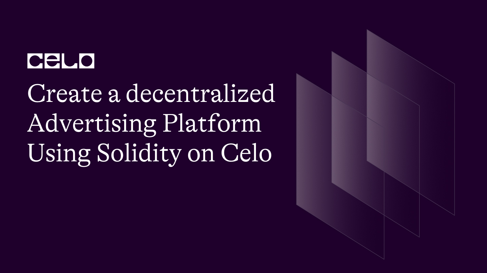

## Introduction

Decentralized advertising is a new advertising model that leverages blockchain technology to eliminate the need for middlemen in advertising transactions. This is made possible by smart contracts that automate the advertising process, from ad creation to ad display and click tracking. In this tutorial, we will build a Decentralized Advertising Solidity code that implements this advertising model.

Here's the github repo of our code. [source code](https://github.com/richiemikke/advert-platform-smart-contract)

## Prerequisites

To follow this tutorial, you will need the following:

- Basic knowledge of Solidity programming language.
- A Development Environment Like Remix.
- The celo Extension Wallet.

## SmartContract

Let's begin writing our smart contract in Remix IDE

The completed code Should look like this.

```solidity
// SPDX-License-Identifier: MIT
pragma solidity ^0.8.0;

contract DecentralizedAdvertising {
    struct Ad {
        uint256 id;
        address payable advertiser;
        string content;
        uint256 pricePerClick;
        uint256 budget;
        bool paused;
    }

    uint256 public adCounter;
    mapping(uint256 => Ad) public ads;

    function createAd(string memory _content, uint256 _pricePerClick, uint256 _budget) public payable {
        require(msg.value == _budget, "Budget must match the value sent.");

        adCounter++;
        ads[adCounter] = Ad({
            id: adCounter,
            advertiser: payable(msg.sender),
            content: _content,
            pricePerClick: _pricePerClick,
            budget: _budget,
            paused: false
        });
    }

    function getAvailableAds() public view returns (Ad[] memory) {
        uint256 availableAdCount = 0;

        for (uint256 i = 1; i <= adCounter; i++) {
            if (ads[i].budget >= ads[i].pricePerClick && !ads[i].paused) {
                availableAdCount++;
            }
        }

        Ad[] memory availableAds = new Ad[](availableAdCount);
        uint256 index = 0;

        for (uint256 i = 1; i <= adCounter; i++) {
            if (ads[i].budget >= ads[i].pricePerClick && !ads[i].paused) {
                availableAds[index] = ads[i];
                index++;
            }
        }

        return availableAds;
    }

    function handleClick(uint256 _adId, address payable _publisher) public {
        require(_adId <= adCounter, "Invalid Ad ID.");
        require(ads[_adId].budget >= ads[_adId].pricePerClick, "Insufficient budget.");

        ads[_adId].budget -= ads[_adId].pricePerClick;
        _publisher.transfer(ads[_adId].pricePerClick);
    }

    function updateAdContent(uint256 _adId, string memory _newContent) public {
        require(_adId <= adCounter, "Invalid Ad ID.");
        require(msg.sender == ads[_adId].advertiser, "Only the advertiser can update the ad content.");

        ads[_adId].content = _newContent;
    }

    function pauseAd(uint256 _adId) public {
        require(_adId <= adCounter, "Invalid Ad ID.");
        require(msg.sender == ads[_adId].advertiser, "Only the advertiser can pause the ad.");

        ads[_adId].paused = true;
    }

    function resumeAd(uint256 _adId) public {
        require(_adId <= adCounter, "Invalid Ad ID.");
        require(msg.sender == ads[_adId].advertiser, "Only the advertiser can resume the ad.");

        ads[_adId].paused = false;
    }

    function withdrawRemainingBudget(uint256 _adId) public {
        require(_adId <= adCounter, "Invalid Ad ID.");
        require(msg.sender == ads[_adId].advertiser, "Only the advertiser can withdraw the remaining budget.");

        uint256 remainingBudget = ads[_adId].budget;
        require(remainingBudget > 0, "No budget remaining to withdraw.");

        ads[_adId].budget = 0;
        ads[_adId].advertiser.transfer(remainingBudget);
    }
}
```

## Code Breakdown

First, we declared our license and the solidity version.

```solidity
// SPDX-License-Identifier: MIT
  pragma solidity ^0.8.0;
```

Next, we define a struct called `Ad` that represents an ad. An ad has an id, advertiser, address, content, price per click, budget, and paused status. The id is a unique identifier that is incremented for each new ad created. The advertiser address is the address of the account that created the ad. The content is the ad message that will be displayed to users. The price per click is the cost of a user clicking on the ad. The budget is the total amount of funds allocated to the ad, and the paused status indicates whether the ad is currently paused or active.

```solidity
struct Ad {
    uint256 id;
    address payable advertiser;
    string content;
    uint256 pricePerClick;
    uint256 budget;
    bool paused;
}

```

The contract also defines a mapping called `ads` that maps an ad id to an `Ad` struct. This mapping is used to store and retrieve ads created by advertisers.

```solidity
 mapping(uint256 => Ad) public ads;
```

The `createAd` function is used to create a new ad. This function takes three parameters: the ad content, the price per click, and the budget. It requires that the amount of Celo sent with the transaction matches the budget specified. If this condition is met, a new ad is created with a unique id, the address of the advertiser, the ad content, the price per click, the budget, and a false value for the paused status. The new ad is then stored in the `ads` mapping.

```solidity
function createAd(string memory _content, uint256 _pricePerClick, uint256 _budget) public payable {
    require(msg.value == _budget, "Budget must match the value sent.");

    adCounter++;
    ads[adCounter] = Ad({
        id: adCounter,
        advertiser: payable(msg.sender),
        content: _content,
        pricePerClick: _pricePerClick,
        budget: _budget,
        paused: false
    });
}
```

The `getAvailableAds` function returns an array of all available ads. An available ad is an ad that has a budget greater than or equal to its price per click and is not paused. The function first counts the number of available ads and then creates an array of that size. The available ads are then copied to the array, which is returned to the caller.

```solidity
function getAvailableAds() public view returns (Ad[] memory) {
    uint256 availableAdCount = 0;

    for (uint256 i = 1; i <= adCounter; i++) {
        if (ads[i].budget >= ads[i].pricePerClick && !ads[i].paused) {
            availableAdCount++;
        }
    }

    Ad[] memory availableAds = new Ad[](availableAdCount);
    uint256 index = 0;

    for (uint256 i = 1; i <= adCounter; i++) {
        if (ads[i].budget >= ads[i].pricePerClick && !ads[i].paused) {
            availableAds[index] = ads[i];
            index++;
        }
    }

    return availableAds;
}
```

The `handleClick` function is called when a user clicks on an ad. This function takes two parameters: the ad id and the publisher address.

The function first checks that the ad id is valid and that the ad has a budget greater than or equal to its price per click. If these conditions are met, the ad's budget is decreased by the price per click, and the publisher is credited with the price per click.

```solidity
function handleClick(uint256 _adId, address payable _publisher) public {
    require(_adId <= adCounter, "Invalid Ad ID.");
    require(ads[_adId].budget >= ads[_adId].pricePerClick, "Insufficient budget.");

    ads[_adId].budget -= ads[_adId].pricePerClick;
    _publisher.transfer(ads[_adId].pricePerClick);
}
```

The `updateAdContent` function is used to update the content of an existing ad. This function takes two parameters: the ad id and the new ad content. It requires that the caller is the advertiser who created the ad. If these conditions are met, the ad content is updated with the new content.

```solidity
function updateAdContent(uint256 _adId, string memory _newContent) public {
    require(_adId <= adCounter, "Invalid Ad ID.");
    require(msg.sender == ads[_adId].advertiser, "Only the advertiser can update the ad content.");

    ads[_adId].content = _newContent;
}
```

The `pauseAd` and `resumeAd` functions are used to pause and resume an existing ad, respectively. Both functions take one parameter: the ad id. They require that the caller is the advertiser who created the ad. If these conditions are met, the ad's paused status is updated to true or false, respectively.

The constructor function sets the `owner` variable to the address of the contract deployer. This function is called only once when the contract is deployed.

```solidity
function pauseAd(uint256 _adId) public {
    require(_adId <= adCounter, "Invalid Ad ID.");
    require(msg.sender == ads[_adId].advertiser, "Only the advertiser can pause the ad.");

    ads[_adId].paused = true;
}

function resumeAd(uint256 _adId) public {
    require(_adId <= adCounter, "Invalid Ad ID.");
    require(msg.sender == ads[_adId].advertiser, "Only the advertiser can resume the ad.");

    ads[_adId].paused = false;
}

```

The `withdrawRemainingBudget` function is used to withdraw any remaining budget from an existing ad. This function takes one parameter: the ad id. It requires that the caller is the advertiser who created the ad and that there is remaining budget to withdraw. If these conditions are met, the remaining budget is transferred to the advertiser's account, and the ad's budget is set to zero.

```solidity
function withdrawRemainingBudget(uint256 _adId) public {
    require(_adId <= adCounter, "Invalid Ad ID.");
    require(msg.sender == ads[_adId].advertiser, "Only the advertiser can withdraw the remaining budget.");

    uint256 remainingBudget = ads[_adId].budget;
    require(remainingBudget > 0, "No budget remaining to withdraw.");

    ads[_adId].budget = 0;
    ads[_adId].advertiser.transfer(remainingBudget);
}
```

## Deployment

**Install the Celo Plugin**

First, you'll need to install the Celo Plugin for Remix. To do this, open Remix and click on the `Plugin Manager` icon on the left-hand side. Search for `Celo` and click the `Install` button next to the Celo Plugin. Once the installation is complete, you'll see a new `Celo` tab appear in the sidebar.

**Connect to the Celo Alfajores Testnet**

To deploy our smart contract successfully, we need the celo extention wallet which can be downloaded from [here](https://chrome.google.com/webstore/detail/celoextensionwallet/kkilomkmpmkbdnfelcpgckmpcaemjcdh?hl=en)

Next, we need to fund our newly created wallet which can done using the celo alfojares faucet [Here](https://celo.org/developers/faucet)

Next, you'll need to connect Remix to the Celo Testnet. Click on the `Celo` tab in the sidebar and then click on the `Connect to Network` button.

**Compile Contract**

Open the `DecentralizedAdvertising.sol` file in Remix and click on the `Solidity Compiler` tab in the sidebar. Click the `Compile DecentralizedAdvertising.sol` button to compile the contract.

**Deploy the Contract**

Click on the `Deploy & Run Transactions` tab in the sidebar. In the `Contract` dropdown menu, select `DecentralizedAdvertising`.

**Interact with the Contract**

Once the contract is deployed, you can interact with it using the functions in the `Deployed Contracts` section of the `Deploy & Run Transactions` tab. You'll need to connect to the contract using the `At Address` button and entering the contract address. From there, you can call the various functions of the contract, such as staking, unstaking, withdrawing rewards, and transferring ownership.

That's it! With these steps, you should be able to deploy the `DecentralizedAdvertising` smart contract to the Celo Testnet using Remix and the Celo Plugin.

## Conclusion

In conclusion, The Decentralized Advertising Solidity code defines a smart contract that implements a decentralized advertising model.
Advertisers can create ads with a budget, and publishers can display the available ads to users. Users can click on the ads, and publishers will be credited with the ad's price per click. The contract also allows advertisers to update, pause, resume, and withdraw remaining budget from their ads. This code is an excellent example of how smart contracts can automate and simplify complex processes while increasing transparency and security.

## Further Learning

Here are some relevant links that would aid your learning further.

- [Celo Docs](https://docs.celo.org/)
- [Solidity Docs](https://docs.soliditylang.org/en/v0.8.17/)

## About the author

Hello, I'am Richard Michael, a fullstack web3 developer.
