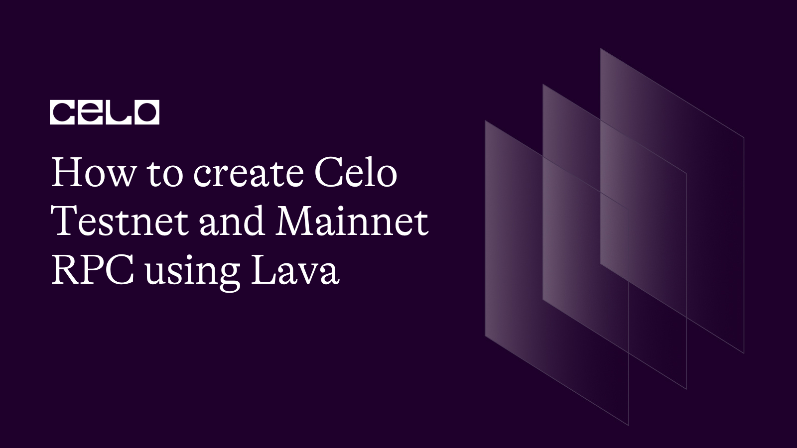
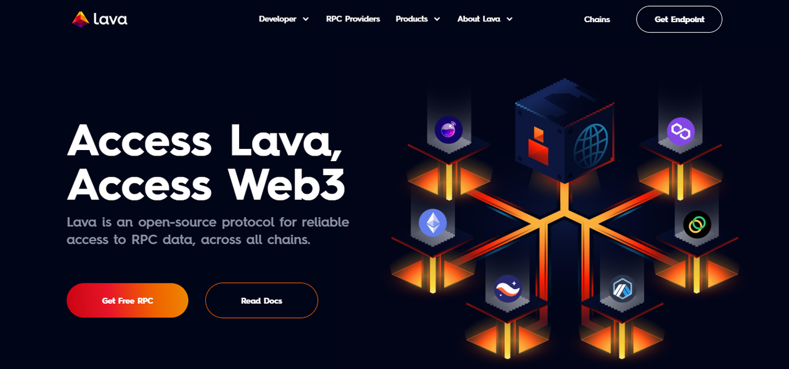
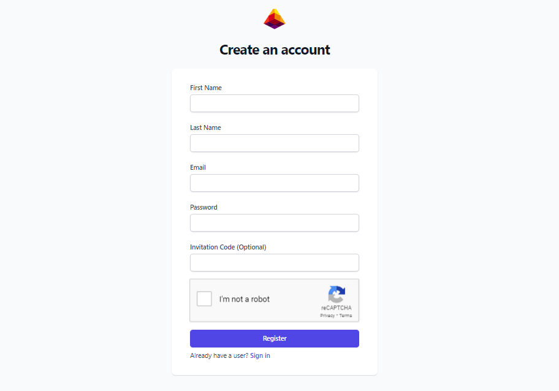
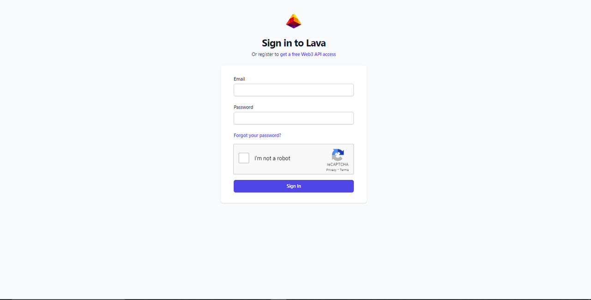
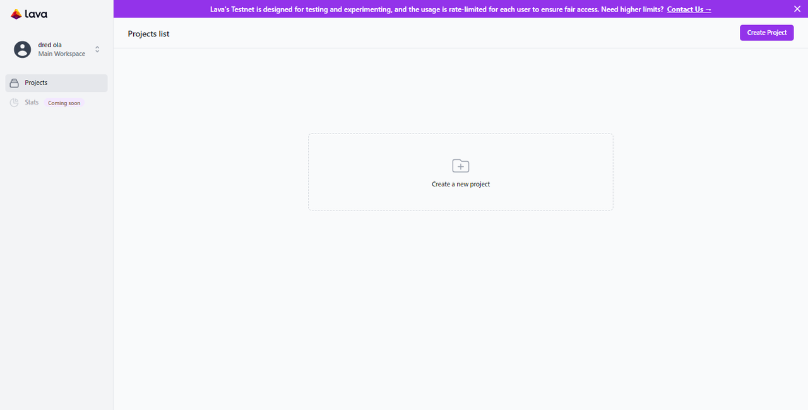
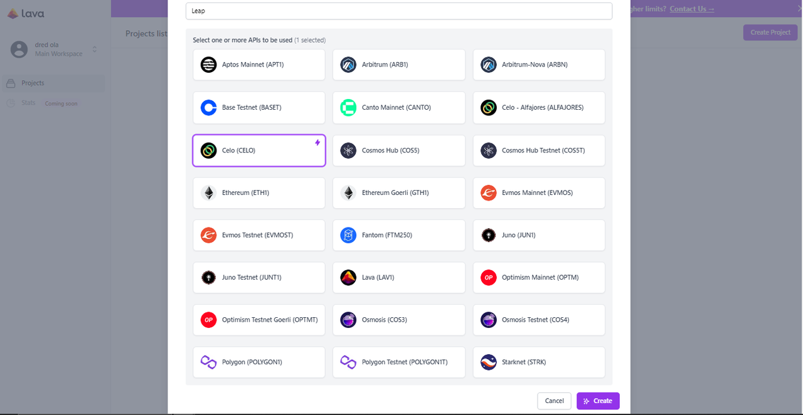
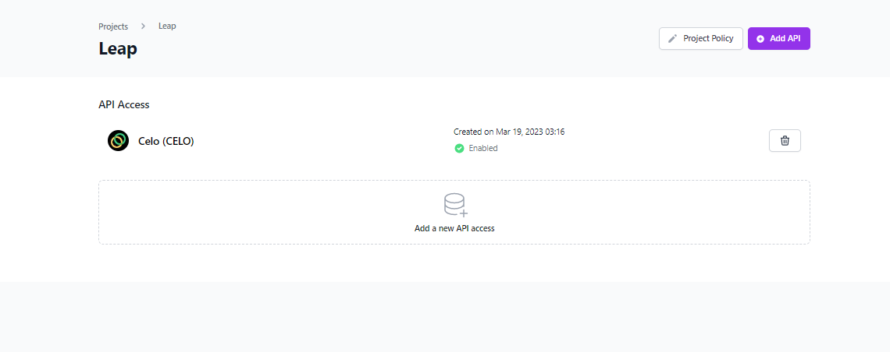
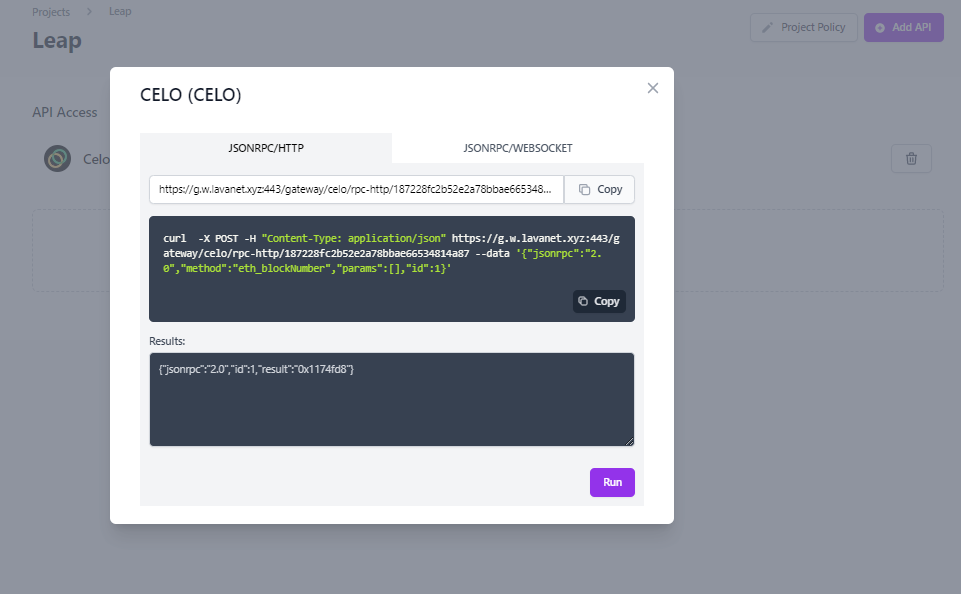

## Introduction

Communication is essential between decentralized applications (dApps) and their underlying blockchains for various purposes, which include data access and performing transaction. RPC nodes for this purpose are utilized to facilitate the connection and communication between dApps and the blockchains upon which they were built. This article briefly examines RPCs while guiding readers on the steps required to create a Celo Testnet RPC using Lava.

## Prerequisites

For a clear understanding and completion of article objectives, it is necessary to understand how blockchain works.

## What is an RPC?

A Remote Procedure Call (RPC) is a protocol, a form of Inter-Process communication (IPC), that allows access to a server node on a specified network. It also enables the communication between dapps and the underlying blockchain. Lava provides access to these RPC data across different chains; however, this article will focus on the Celo blockchain.

## Creating Celo Testnet RPC Using Lava

The following are the steps to creating Celo Testnet RPC using Lava:

1. Visit the Lava homepage [here](https://www.lavanet.xyz/) to get a free RPC access.

2. Before granting API access, Lava rediects you to a signup page. You would need to create an account with your email address here.

3. You will be redirected to the sign-in page after verifying your e-mail address.

4. Once you are on the dashboad, click on the `Create a project` button to create an RPC.

5. Enter your project name e.g. "My Sample Project", select `Celo Blockchain` and `Celo - Alfajores`, and click the "Create" tab.

6. To retreive the RPC endpoints and retrieve information, click on any of the network listed in the `API access` section.

7. You should see the HTTP and WebSocket endpoint on your screen. You can click on the "run" button to the execute code to test the endpoint. The code should return the block height in hexadecimal format.

If you reached this stage, you have successfully created an RPC Testnet on the Celo blockchain. You can include the endpoint in your project.

## Conclusion

This article looked briefly into RPCs and the steps involved in creating an RPC on the Celo Blockchain using Lava.
