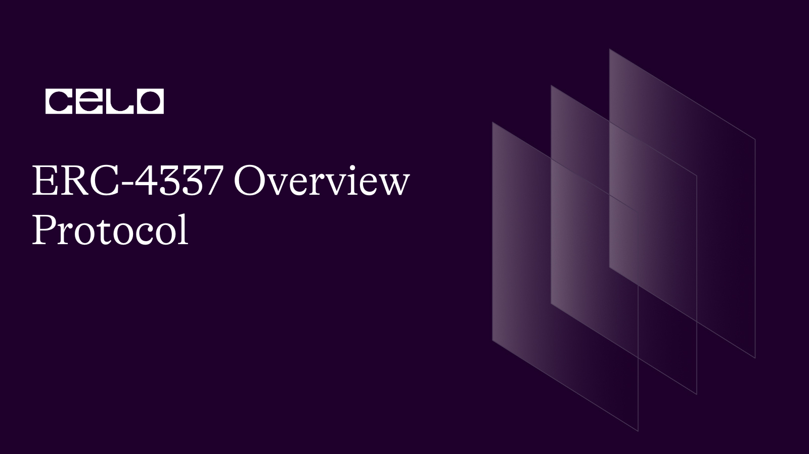

### Introduction

ERC-4337, the latest Ethereum standard deployed on the Ethereum mainnet in March 2023, represents a significant milestone in achieving account abstraction without any consensus-layer changes. It allows for transacting and creating contracts in a single contract account, opening the door to user-friendly crypto wallet designs that could potentially drive broader adoption.

As part of the Ethereum Improvement Proposals (EIPs), which describe standards for the Ethereum platform, ERC standards, including ERC-4337, set application-level standards for contracts and tokens. ERC-4337 was initially proposed as EIP-4337 in 2021 and has now been authorized to become an official ERC standard.

Account abstraction in Ethereum aims to combine the features of Externally Owned Accounts (EOA) and smart contract accounts into a single contract account, enabling it to transact with tokens and create contracts simultaneously. This change allows for creative wallet designs such as social recovery, customization, and upgradeability.

In essence, ERC-4337 brings smart contract functionality to wallets in a single account, making services like multi-factor authentication and automatic payments easier to set up. It introduces enhanced crypto transaction options called UserOperations, which differentiate them from standard crypto transactions.

ERC-4337 is compatible with networks that support the Ethereum Virtual Machine (EVM), such as the Celo blockchain.

### Importance of ERC-4337

Understanding the need for ERC-4337 requires a closer look at why it was proposed and implemented in the first place. Unlike the Bitcoin network's Unspent Transaction Output module, Ethereum's account-based model keeps track of and updates account balances as transactions are confirmed.

In Ethereum, there are two types of accounts with their own functionalities - Externally Owned Accounts (EOAs) owned and controlled by users, and smart contract accounts that are deployed on the network. However, existing crypto wallets on Ethereum, like MetaMask, are limited by the rules set around EOAs. These limitations include relying solely on private keys for account access and requiring all transactions to be signed, resulting in complex and user-unfriendly wallet setup procedures and private key security measures. Losing the seed phrase often means losing access to the wallet.

ERC-4337 addresses these limitations by removing the need for separate smart contract wallets managed by smart contract accounts and EOAs. It combines the functionalities of both account types into one, making it easier to deploy desired wallet features without relying on seed phrases and minimizing the chances of human errors. This makes user onboarding via mobile devices more standard and enhances network security with features like Quantum resistance and BLS, making networks less prone to threats and attacks. Furthermore, implementing changes on other EVM-compatible chains becomes easier with ERC-4337, providing greater interoperability across different blockchain networks.

### Introduction to ERC-4337: Account Abstraction for Ethereum

ERC-4337 is a recently deployed Ethereum standard that aims to achieve account abstraction on the protocol level, without requiring any changes to the consensus layer. Proposed by Ethereum co-founder Vitalik Buterin and other developers in 2021, ERC-4337 was authorized to become an Ethereum Request for Comment (ERC) standard in March 2023. The goal of ERC-4337 is to enable transacting and contract creation in a single contract account, which has the potential to revolutionize the design of user-friendly crypto wallets and promote wider adoption of cryptocurrencies.

### Account Abstraction in Ethereum

Account abstraction in Ethereum refers to the merging of functionalities of the two existing types of accounts in the Ethereum protocol: Externally owned accounts (EOA) and smart contract accounts. EOAs are accounts owned and controlled by users, while smart contract accounts are deployed on the network as smart contracts. Currently, most existing crypto wallets on Ethereum are EOAs, which are limited by certain rules and requirements, such as reliance on private keys for access and transaction signing. This often results in complex and cumbersome wallet setup procedures and private key security measures.

ERC-4337 removes these limitations by allowing wallets to be managed by smart contract accounts, which can achieve the same functionalities as EOAs. This is accomplished by combining the functionalities of EOAs and smart contract accounts into a single contract account, eliminating the need for users to manage their ether in two separate accounts or rely on a centralized relay system.

### How ERC-4337 Works

ERC-4337 achieves account abstraction by introducing a higher-layer pseudo-transaction object called a UserOperation, which is similar to rollups in terms of bundling concepts. Users send UserOperation objects into a separate mempool, and bundlers package these objects into a transaction that is included in a block. The bundlers pay gas for the bundled transactions and receive fees for the individual UserOperation executions. Bundlers operate similar to validators, choosing which objects to include based on fee-prioritization logic.

In addition, new functions, including validateUserOp, are being added to enable a wallet to be a smart contract at the same time. A new contract called the EntryPoint is also being introduced to serve as a security gate for the execution of these new functions.

### Goals and Benefits of ERC-4337

ERC-4337 aims to achieve several goals, including account abstraction, decentralization, avoidance of consensus changes, and enablement of innovative use cases. Account abstraction allows users to enjoy the functionalities of both smart contracts and EOAs in a single account, simplifying the wallet user experience. Decentralization allows any bundlers to participate in the process, promoting a more inclusive and distributed ecosystem. Avoidance of consensus changes allows for faster adoption as the focus remains on scalability-oriented upgrades at the consensus layer. Lastly, ERC-4337 enables innovative use cases such as aggregated signatures, daily transaction limits, emergency account freezing, whitelisting, and privacy-preserving applications.

For users, ERC-4337 could significantly improve the wallet setup process by eliminating the need to write down seed phrases and making setup quick and easy with just a few clicks. Account recovery becomes worry-free with the possibility of multi-factor authentication and account recovery options. Overall, ERC-4337 has the potential to simplify and enhance the user experience of crypto wallets, leading to increased adoption of cryptocurrencies.

### SimpleAccount Explained

```solidity
// SPDX-License-Identifier: GPL-3.0
pragma solidity ^0.8.12;

/* solhint-disable avoid-low-level-calls */
/* solhint-disable no-inline-assembly */
/* solhint-disable reason-string */

import "@openzeppelin/contracts/utils/cryptography/ECDSA.sol";
import "@openzeppelin/contracts/proxy/utils/Initializable.sol";
import "@openzeppelin/contracts/proxy/utils/UUPSUpgradeable.sol";

import "./BaseAccount.sol";
import "./TokenCallbackHandler.sol";

/**
  * minimal account.
  *  this is sample minimal account.
  *  has execute, eth handling methods
  *  has a single signer that can send requests through the entryPoint.
  */
contract SimpleAccount is BaseAccount, TokenCallbackHandler, UUPSUpgradeable, Initializable {
    using ECDSA for bytes32;

    address public owner; // Public variable to store the owner's address

    IEntryPoint private immutable _entryPoint; // Private immutable variable to store the entry point contract address

    event SimpleAccountInitialized(IEntryPoint indexed entryPoint, address indexed owner); // Event to indicate when the SimpleAccount contract has been initialized

    modifier onlyOwner() {
        _onlyOwner(); // Modifier to restrict access to functions to only the owner of the contract
        _;
    }

    /// @inheritdoc BaseAccount
    function entryPoint() public view virtual override returns (IEntryPoint) { // Function to get the entry point contract address
        return _entryPoint;
    }

    // solhint-disable-next-line no-empty-blocks
    receive() external payable {} // Fallback function to receive Ether

    constructor(IEntryPoint anEntryPoint) {
        _entryPoint = anEntryPoint; // Constructor to set the entry point contract address during deployment
        _disableInitializers();
    }

    function _onlyOwner() internal view {
        //directly from EOA owner, or through the account itself (which gets redirected through execute())
        require(msg.sender == owner || msg.sender == address(this), "only owner"); // Internal function to check if the caller is the owner of the contract or the contract itself
    }

    /**
     * execute a transaction (called directly from owner, or by entryPoint)
     */
    function execute(address dest, uint256 value, bytes calldata func) external {
        _requireFromEntryPointOrOwner(); // Function modifier to check if the caller is the entry point contract or the owner
        _call(dest, value, func); // Internal function to call another contract with specified address, value, and function data
    }

    /**
     * execute a sequence of transactions
     */
    function executeBatch(address[] calldata dest, bytes[] calldata func) external {
        _requireFromEntryPointOrOwner(); // Function modifier to check if the caller is the entry point contract or the owner
        require(dest.length == func.length, "wrong array lengths"); // Check if the lengths of destination and function data arrays are the same
        for (uint256 i = 0; i < dest.length; i++) {
            _call(dest[i], 0, func[i]); // Internal function to call multiple contracts in a batch with specified addresses and function data
        }
    }

    /**
     * @dev The _entryPoint member is immutable, to reduce gas consumption.  To upgrade EntryPoint,
     * a new implementation of SimpleAccount must be deployed with the new EntryPoint address, then upgrading
      * the implementation by calling `upgradeTo()`
     */

    // Initialize the contract with an owner address
    function initialize(address anOwner) public virtual initializer {
        _initialize(anOwner); // Call the internal _initialize function with the provided input parameter
    }

    // Internal function to initialize the contract with an owner address
    function _initialize(address anOwner) internal virtual {
        owner = anOwner; // Set the owner address with the provided input parameter
        emit SimpleAccountInitialized(_entryPoint, owner); // Emit an event to indicate that the SimpleAccount contract has been initialized with the entry point contract address and the owner address
    }

    // Modifier to require the function call to be made from the entry point contract or the owner
    function _requireFromEntryPointOrOwner() internal view {
        require(msg.sender == address(entryPoint()) || msg.sender == owner, "account: not Owner or EntryPoint"); // Check if the caller is the entry point contract or the owner
    }

    // Override the template method from BaseAccount to validate the signature of a user operation
    function _validateSignature(UserOperation calldata userOp, bytes32 userOpHash) internal override virtual returns (uint256 validationData) {
        bytes32 hash = userOpHash.toEthSignedMessageHash(); // Convert the user operation hash to an Ethereum signed message hash
        if (owner != hash.recover(userOp.signature)) // Check if the owner address matches the recovered address from the signature
            return SIG_VALIDATION_FAILED; // Return an error code if the signature validation fails
        return 0; // Return success code if the signature validation is successful
    }

    // Internal function to call another contract
    function _call(address target, uint256 value, bytes memory data) internal {
        (bool success, bytes memory result) = target.call{value : value}(data); // Call the contract with the provided address, value, and function data
        if (!success) { // Check if the call was unsuccessful
            assembly { // Use assembly to revert with the error message from the failed call
                revert(add(result, 32), mload(result))
            }
        }
    }

    // Get the current deposit balance in the entry point contract
    function getDeposit() public view returns (uint256) {
        return entryPoint().balanceOf(address(this)); // Call the entry point contract's balanceOf function to get the balance of this contract's address
    }

    // Deposit more funds into the entry point contract for this account
    function addDeposit() public payable {
        entryPoint().depositTo{value : msg.value}(address(this)); // Call the entry point contract's depositTo function with the provided value and this contract's address as the target
    }

    // Withdraw funds from the account's deposit in the entry point contract
    function withdrawDepositTo(address payable withdrawAddress, uint256 amount) public onlyOwner {
        entryPoint().withdrawTo(withdrawAddress, amount); // Call the entry point contract's withdrawTo function with the provided withdrawal address and amount
    }

    // Authorize an upgrade to a new implementation by requiring only the owner to authorize
    function _authorizeUpgrade(address newImplementation) internal view override {
        (newImplementation); // Placeholder for additional authorization logic if needed
        _onlyOwner(); // Call the internal _onlyOwner function to check if the caller is the owner
    }
}
```

You can see the full code [here](https://github.com/guizostudios/ERC-4337)

### Additional readings

[Eip-4337-ethereum-account-abstraction-incremental-audit/](https://blog.openzeppelin.com/eip-4337-ethereum-account-abstraction-incremental-audit/)

[Eip-4337](https://eips.ethereum.org/EIPS/eip-4337)

## About Author

I am a serial entrepreneur, founder of Guizo Studios and always available to help the Celo ecosystem.

[LinkedIn](https://www.linkedin.com/in/ewertonlopes/)
