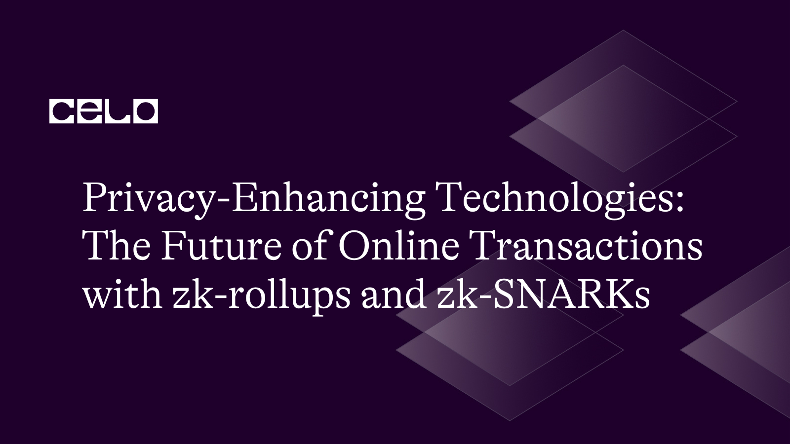
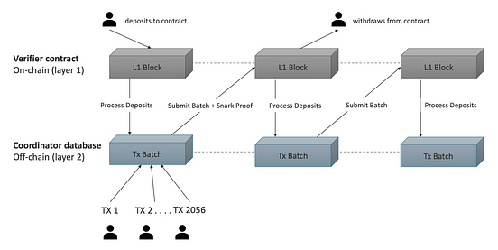
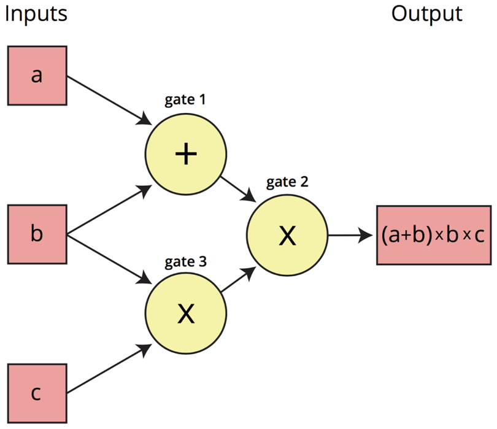

## Introduction

Online transactions have become an integral part of our daily lives in the current digital age. However, with the widespread use of online platforms and services, privacy concerns have arisen. As a result, privacy-enhancing technologies (PETs) have become increasingly important for ensuring the privacy and security of online transactions. In this article, we explore the two major PETs that revolutionize the way we conduct online transactions: zk-rollups and zk-SNARKs.

## What are zk-Rollups?

Zk rollup is a layer-two scaling solution for blockchains that allows for increased transaction throughput and lower fees. It is based on the idea of bundling multiple transactions into a single transaction, which is then validated off-chain using [zero knowledge proofs](https://ethereum.org/en/zero-knowledge-proofs/).

Zk rollups greatly increase transaction throughput and help reduce transaction costs while inheriting the security of the base-layer (layer-1) network they are connected with for settlement. Instead of posting every single transaction on-chain, zk-rollups only have to periodically post valid batches of transactions from the layer-2 network bundled up to layer 1, effectively leveraging only the censorship resistance and security of the base layer for transaction settlement.

ZK rollups tap into their zero-proof technology to submit regular validity proofs to associated smart contracts on the parent network, confirming the accuracy of the transactions on the layer-2 network. The reliance on zero-proofs also reduces the volume of shared transaction data, thus making ZK rollups privately focused by default.



## How do zk-Rollups work?

In a traditional blockchain, every transaction is broadcast to the network and processed by each node. This can result in a bottleneck because the network has limited capacity for processing transactions. This leads to high fees and slow confirmation times, particularly during periods of high network congestion.

With zk-rollup, multiple transactions are bundled together and processed offline. This means that the only transaction that needs to be broadcast to the network is the zk-rollup transaction, which proves that all individual transactions in the rollup have been executed correctly.

Zk-proof is a cryptographic method that allows the verification of the correctness of bundled transactions without revealing any sensitive information. Zk-proof allows the network to validate the zk-rollup transaction without having to process all individual transactions in the rollup.

## What are zk-SNARKs?

zk-SNARK stands for Zero-Knowledge Succinct Non-Interactive Argument of Knowledge. It is a type of zero-knowledge proof that allows the verification of the correctness of a statement without revealing any additional information.

In blockchain technology, zk-SNARKs are used to enable privacy and scalability. Using zk-SNARKs, it is possible to prove that a particular computation has been performed correctly without revealing any of the inputs or intermediate steps of the computation. This can be useful for verifying transactions on a blockchain, without revealing the transaction details of the entire network.

zk-SNARKs work by creating a proof that a computation has been carried out correctly. This proof is generated by a prover who has access to the inputs and computation itself. The proof is then verified by a verifier who has access to the proof itself. If the proof is valid, the verifier can be sure that the computation has been carried out correctly without knowing anything about the inputs or the intermediate steps of the computation.

One of the main benefits of the zk-SNARKs is their succinctness. They enable the verification of complex computations using a proof that is only a few hundred bytes. This makes them ideal for use in blockchain technology, where space is at a premium and every byte is counted.



## How do zk-SNARKs work?

With most types of cryptocurrency, a transaction is validated by network checking that certain conditions have been met. Specifically, the conditions are that the sender has funds available and that they have provided the correct private key to show that the funds are theirs.

zk-SNARKs allow the sender of a transaction to prove all that without revealing any of the addresses or amounts involved. To achieve this, the blockchain network encodes some of its consensus rules in zk-SNARKs.

During the transaction process, zk-SNARKs turn the information that needs to be proven in the equations. These equations can be evaluated and solved without disclosing any information.

## How do zk-Rollups and zk-SNARKs improve privacy and security?

Both zk-rollups and zk-SNARKs are designed to enhance privacy and security in online transactions. With zk-rollups, the amount of data that needs to be stored on the blockchain is significantly reduced, making it harder for attackers to access sensitive information and the use of smart contracts ensures that transactions are executed automatically and transparently, reducing the risk of fraud.

Transactions can be carried out quietly and securely using zk-SNARKs without disclosing sensitive data. By making it far more difficult for attackers to link transactions to specific users, this enhances the blockchain's overall privacy and security.

## Why are zk-Rollups and zk-SNARKs the future of online transactions?

Zk-rollups and zk-SNARKs are being used in the blockchain industry. These technologies have a number of benefits over traditional transaction processing methods, including faster transaction times, fewer fees, and improved privacy and security.

Privacy issues will become increasingly more important as the use of online transactions increases. These issues are addressed by using zk-Rollups and zk-SNARKs, which guarantees that online transactions are secure and confidential. Therefore, in order to guarantee that their online transactions stay private and safe, businesses and organizations must begin thinking about implementing these technologies.

Here is an example of a contract contract implementing a rollup solution for managing user balances.

```solidity
pragma solidity 0.5.11;

// Rollup solidity implementation

import "@openzeppelin/contracts/math/SafeMath.sol";

import "./Hasher.sol";
import "./Whitelist.sol";
import "./MerkleTree.sol";
import {WithdrawVerifier as WithdrawVerifier} from "./WithdrawVerifier.sol";
import {TxVerifier as TxVerifier} from "./TxVerifier.sol";

contract RollUp {
  using SafeMath for uint256;

  // Contract owner
  address owner;

  // Hasher function
  Hasher hasher;

  // Merkle Tree that represents all users's
  // deposits
  MerkleTree balanceTree;

  // ZK Proofs
  WithdrawVerifier withdrawVerifier;
  TxVerifier txVerifier;

  // Deposit event
  event Deposit(
    uint256 balanceTreeIndex,
    uint256 publicKeyX,
    uint256 publicKeyY,
    uint256 balance,
    uint256 nonce
  );

  // Withdraw
  event Withdraw(
    uint256 balanceTreeIndex,
    uint256 publicKeyX,
    uint256 publicKeyY,
    uint256 balance,
    uint256 nonce
  );

  event RollUpProcessed(uint256 newBalanceTreeRoot);

  // Registered users
  struct User {
    uint256 balanceTreeLeafIndex;
    uint256 publicKeyX;
    uint256 publicKeyY;
    uint256 balance;
    uint256 nonce;
  }
  mapping(uint256 => User) balanceTreeUsers;
  mapping(uint256 => bool) isPublicKeysRegistered;
  mapping(uint256 => bool) usedNullifiers;

  // index => hash(public key)
  mapping(uint256 => uint256) balanceTreeKeys;

  uint256 accuredFees;

  constructor(
    address hasherAddress,
    address balanceTreeAddress,
    address withdrawVerifierAddress,
    address txVerifierAddress
  ) public {
    owner = msg.sender;

    hasher = Hasher(hasherAddress);
    balanceTree = MerkleTree(balanceTreeAddress);
    withdrawVerifier = WithdrawVerifier(withdrawVerifierAddress);
    txVerifier = TxVerifier(txVerifierAddress);

    accuredFees = 0;
  }

  function rollUp(
    uint256[2] memory a,
    uint256[2][2] memory b,
    uint256[2] memory c,
    uint256[73] memory input
  ) public {
    // TODO: Check if current merkle tree is
    // equal to supplied merkle tree
    uint256 balanceTreeRoot = input[1];
    // uint256 newBalanceTreeRoot = input[1];

    if (balanceTree.getRoot() != balanceTreeRoot) {
      revert("Proof not valid for current tree");
    }

    if (!txVerifier.verifyProof(a, b, c, input)) {
      revert("Invalid roll up proofs");
    }

    // Transaction one
    uint256 from;
    uint256 to;
    uint256 amount;
    uint256 fee;
    uint256 nonce;
    uint256 curOffset;

    uint256 senderLeaf;
    uint256 recipientLeaf;

    uint256 senderPublicKeyHash;
    uint256 recipientPublicKeyHash;

    uint256 txDataOffset = 3;
    uint256 txDataLength = 8;
    uint256 batchSize = 2;

    for (uint256 i = 0; i < batchSize; i++) {
      curOffset = txDataOffset + (txDataLength * i);

      from = input[curOffset];
      to = input[curOffset + 1];
      amount = input[curOffset + 2];
      fee = input[curOffset + 3];
      nonce = input[curOffset + 4];

      // Update user data
      senderPublicKeyHash = balanceTreeKeys[from];
      recipientPublicKeyHash = balanceTreeKeys[to];

      User storage sender = balanceTreeUsers[senderPublicKeyHash];
      sender.balance -= amount;
      sender.balance -= fee;
      sender.nonce = nonce;

      User storage recipient = balanceTreeUsers[recipientPublicKeyHash];
      recipient.balance += amount;

      accuredFees += fee;

      // Update merkle tree leaf
      senderLeaf = hasher.hashBalanceTreeLeaf(
        sender.publicKeyX,
        sender.publicKeyY,
        sender.balance,
        sender.nonce
      );

      recipientLeaf = hasher.hashBalanceTreeLeaf(
        recipient.publicKeyX,
        recipient.publicKeyY,
        recipient.balance,
        recipient.nonce
      );

      balanceTree.update(sender.balanceTreeLeafIndex, senderLeaf);
      balanceTree.update(recipient.balanceTreeLeafIndex, recipientLeaf);
    }

    emit RollUpProcessed(balanceTree.getRoot());
  }

  // Checks if public key is registered
  function isPublicKeyRegistered(uint256 publicKeyX, uint256 publicKeyY)
    public
    view
    returns (bool)
  {
    uint256 publicKeyHash = hasher.hashPair(publicKeyX, publicKeyY);
    return isPublicKeysRegistered[publicKeyHash];
  }

  function getUserKey(uint256 index) public view returns (uint256) {
    return balanceTreeKeys[index];
  }

  function getUserData(uint256 publicKeyHash)
    public
    view
    returns (uint256, uint256, uint256, uint256, uint256)
  {
    User memory user = balanceTreeUsers[publicKeyHash];

    return (
      user.balanceTreeLeafIndex,
      user.publicKeyX,
      user.publicKeyY,
      user.balance,
      user.nonce
    );
  }

  function withdrawAll(
    uint256[2] memory a,
    uint256[2][2] memory b,
    uint256[2] memory c,
    uint256[3] memory input
  ) public {
    // Inputs are the public signal
    uint256 publicKeyX = input[0];
    uint256 publicKeyY = input[1];

    uint256 publicKeyHash = hasher.hashPair(publicKeyX, publicKeyY);
    User memory user = balanceTreeUsers[publicKeyHash];
    if (user.balance <= 0) {
      revert("Cannot withdraw with 0 balance");
    }

    withdraw(user.balance, a, b, c, input);
  }

  function withdraw(
    uint256 amount,
    uint256[2] memory a,
    uint256[2][2] memory b,
    uint256[2] memory c,
    uint256[3] memory input
  ) public {
    // Inputs are the public signal
    uint256 publicKeyX = input[0];
    uint256 publicKeyY = input[1];
    uint256 nullifier = input[2];

    if (usedNullifiers[nullifier]) {
      revert("Nullifier has been used");
    }

    // Check if proof is valid
    bool validProof = withdrawVerifier.verifyProof(a, b, c, input);
    if (!validProof) {
      revert("Unauthorized to withdraw funds");
    }

    // CHeck user balance
    uint256 publicKeyHash = hasher.hashPair(publicKeyX, publicKeyY);
    User storage user = balanceTreeUsers[publicKeyHash];
    if (amount > user.balance) {
      revert("Withdraw amount is more than remaining balance");
    }

    // Register nullifier as used
    usedNullifiers[nullifier] = true;
    user.balance -= amount;
    msg.sender.transfer(amount);

    emit Withdraw(
      user.balanceTreeLeafIndex,
      publicKeyX,
      publicKeyY,
      user.balance,
      user.nonce
    );
  }

  function deposit(uint256 publicKeyX, uint256 publicKeyY) public payable {
    uint256 publicKeyHash = hasher.hashPair(publicKeyX, publicKeyY);

    User storage user = balanceTreeUsers[publicKeyHash];
    user.balance += msg.value;

    // Insert user into balance tree
    uint256 leaf = hasher.hashBalanceTreeLeaf(
      publicKeyX,
      publicKeyY,
      user.balance,
      user.nonce
    );

    // If its a new user, mark them as registered,
    // and insert them into the merkleTree
    if (!isPublicKeysRegistered[publicKeyHash]) {
      isPublicKeysRegistered[publicKeyHash] = true;

      // Saves user's public key
      user.publicKeyX = publicKeyX;
      user.publicKeyY = publicKeyY;

      // Saves user's index in balance tree
      user.balanceTreeLeafIndex = balanceTree.getInsertedLeavesNo();
      balanceTree.insert(leaf);

      // Saves user's index in balanceTreeKeys
      balanceTreeKeys[user.balanceTreeLeafIndex] = publicKeyHash;

    } else {
      // Updates balance and data in balance tree
      balanceTree.update(user.balanceTreeLeafIndex, leaf);
    }

    emit Deposit(
      user.balanceTreeLeafIndex,
      publicKeyX,
      publicKeyY,
      user.balance,
      user.nonce
    );
  }

  function getAccuredFees() public view returns (uint256) {
    return accuredFees;
  }

  function withdrawAccuredFees() public {
    if (msg.sender != owner) {
      revert("Only owner can call this function");
    }
    msg.sender.transfer(accuredFees);
    accuredFees = 0;
  }
}
```

In the contract above, the `Hasher` contract defines the hash functions used to calculate the Merkle tree leaf nodes for user balances and to hash public keys.

The `Whitelist` contract maintains a list of public keys that are allowed to participate in the Rollup.

The `MerkleTree` contract implements the Merkle tree data structure used to store user balances.

The `WithdrawVerifier` and `TxVerifier` contracts verify the validity of ZK proofs for withdrawals and transactions.

The contract maintains several mappings to store user data, including `balanceTreeUsers`, `isPublicKeysRegistered`, `usedNullifiers`, and `balanceTreeKeys`. The User struct stores information about each user, including their public key, balance, and nonce. The `isPublicKeysRegistered` mapping is used to check if a public key is registered, and the `balanceTreeKeys` mapping is used to associate a user's public key with their Merkle tree leaf index.

The `rollUp` function is the main entry point for submitting transactions to the Rollup. It takes in a ZK proof that validates a batch of transactions, updates the user balances and Merkle tree accordingly, and emits a `RollUpProcessed` event with the new Merkle tree root.

The `withdrawAll` function is used to withdraw funds from the Rollup. It takes in a ZK proof that validates the withdrawal and transfers the funds to the specified public key.

## Conclusion

For online transactions to remain secure and private, businesses should start thinking about using privacy-enhancing technologies like zk-rollups and zk-SNARKs. These technologies have the potential to revolutionize how individuals do business online by significantly enhancing privacy and security. By using privacy-enhancing technologies, businesses and organizations may safeguard sensitive consumer data and avoid data breaches.

## Next Steps

You can check for the source code on [Github](https://github.com/Kyrian212/zk-rollups) and also [Celo Documentation](docs.celo.org) to learn further.

## Author

Kyrian Chigozie is a Technical Writer with a passion for web3 technology. Connect with me on [Twitter](https://twitter.com/Kyrian_M) or [Github](https://github.com/Kyrian212/zk-rollups).

## Reference

- [zk-SNARKs and ZoKrates Toolbox on Ethereum](https://medium.com/cornellblockchain/a-brief-dive-into-zk-snarks-and-the-zokrates-toolbox-on-the-ethereum-blockchain-cb7bd7f00fdc)
- [Zero Knowledge Proofs](https://ethereum.org/en/zero-knowledge-proofs/)
- [Source Code](https://github.com/Kyrian212/zk-rollups)
- [Celo Documentation](https://docs.celo.org/)
