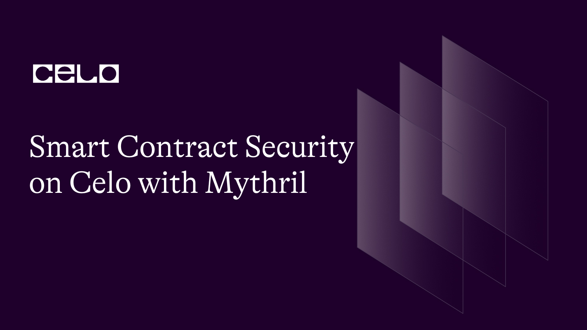
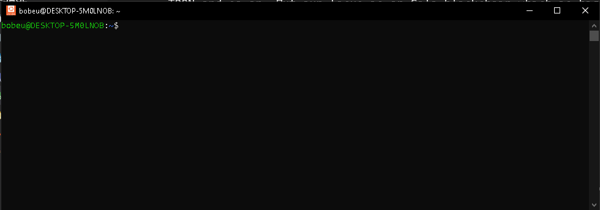

## Introduction

Smart contracts are a self-executing piece of code deployed on Ethereum-compatible blockchains like Celo free of censorship, downtime, and third-party interference, and have since birthed changed the way software is perceived. However, as exciting as smart contracts are, they introduce security risks ranging from low to critical ones. It then becomes crucial for developers to thoroughly scrutinize contract code before deployment.

## Prerequisites​

To get the best from this guide, you need to have some knowledge about smart contracts. If you're new to the field, I recommend going through **[this](https://docs.celo.org/blog/tutorials/building-a-solidity-smart-contract-for-nft-royalty-fees-a-step-by-step-guide)** and **[this](https://docs.celo.org/blog/tutorials/best-practices-for-writing-smart-contracts-with-real-world-examples)** to get started.

## Requirements​

For the purpose of this tutorial, the following are needed.

- [Ubuntu 22.04.02 LTS](https://ubuntu.com/tutorials/install-ubuntu-on-wsl2-on-windows-10)
- Install an editor/IDE. VSCode recommended.
- Install NodeJs version >=16.15.1.

**What is Mythril?**

Mythril is a security tool for analyzing smart Ethereum contracts. Note the emphasis - `Ethereum`. There are other smart contract platforms such as TRON and so on. But our focus is on the Celo blockchain which is highly compatible with Ethereum Virtual Machine. So if you write contracts that target the Celo platform, it is very important and helpful to imbibe the act of scrutinizing your code using security tools such as Mythril. This helps to detect and avoid a range of smart contract issues such as integer overflow/underflow, owner-overwrite-to-Ether-withdrawal, and many others.

**Installation**

To use this tool, you will need to perform the following setups. These steps are for those using windows operating system. If you already use Ubuntu, you may skip the steps that require its installation.

- [Set up the Linux distribution system](https://ubuntu.com/tutorials/install-ubuntu-on-wsl2-on-windows-10)

- After step 1 is completed, you should have Ubuntu running on Windows OS. Launch the Ubuntu terminal. To get the best result, right-click on the icon to run as an administrator. Follow the instructions to set up a user account.



- We need to install `pip`

```bash
  sudo apt install python3-pip
```

or

```bash
  sudo apt install pip
```

- Run this command.

```bash
  sudo apt-get update
```

- Check the version of pip3 installed

```bash
  pip3 --version
```

- Install Mythril

```bash
  pip install mythril
```

- Check if Mythril is installed

```bash
  myth version
```

If you have trouble viewing the version of Mythril, take the following steps.

- Update Ubuntu

```bash
  sudo apt update
```

```bash
  sudo apt install software-properties-common
```

```bash
  sudo add-apt-repository ppa:ethereum/ethereum
```

```bash
  sudo apt install solc
```

```bash
  sudo apt install libssl-dev python3-dev python3-pip
```

```bash
  pip install mythril
```

- Then, check the mythril version

```bash
  myth version
```

This should work fine. If you're still having trouble setting up, please go over the steps again.

- Next step, since you newly installed Ubuntu, you're probably not going to have VSCode installed. In the Ubuntu terminal, run `code .`. This command triggers VSCode if already installed, otherwise, it will attempt to download the extension, so you should be connected to the internet.

**Creating the project**

- Create root and project folders.

```bash
  mkdir myTutorial && cd myTutorial
```

```bash
  mkdir smart-contract-security-on-celo-with-mythril && cd smart-contract-security-on-celo-with-mythril
```

- Create a hardhat project using yarn.

```bash
  yarn hardhat
```

If the command failed, you obviously do not have `yarn` installed. Follow the steps below to install yarn or skip if you already installed it.

- Add yarn key

```bash
  curl -sS https://dl.yarnpkg.com/debian/pubkey.gpg | sudo apt-key add -
```

```bash
  echo "deb https://dl.yarnpkg.com/debian/ stable main" | sudo tee /etc/apt/sources.list.d/yarn.list
```

```bash
  sudo apt update && sudo apt install yarn
```

Then, check the version of the yarn.

```bash
  yarn --version
```

Alternatively, if the command failed, install yarn using npm otherwise skip this part. I recommend installing npm using nvm.

- Install nvm

```bash
  curl https://raw.githubusercontent.com/creationix/nvm/master/install.sh | bash && source ~/.profile
```

- Now, use NVM to install the desired version of npm

```bash
  nvm install 14.19.1
```

- Check which current version of npm you're using.

```bash
  nvm current
```

- List all versions of npm installed.

```bash
  nvm list
```

**Install Yarn using NPM globally**

```bash
  npm install --global yarn
```

- Check the version of the yarn. It should work fine.

```bash
  yarn --version
```

**Invoke Hardhat**

We can now use yarn to install hardhat. If everything is done correctly, running the next operations on Ubuntu is significantly faster than on Windows.

```bash
  yarn add hardhat
```

```bash
  npx hardhat
```

Follow the instructions to complete the project setup.

- Navigate to the contracts folder. Create a new `.sol` file. I named mine `VulnerableToken.sol`. Then paste the code below.

```solidity
// SPDX-License-Identifier: MIT
  pragma solidity 0.8.18;

  interface IERC20 {
    function transfer(address to, uint256 amount) external returns(bool);
    function allowance(address owner, address to) external returns(uint256);
    function transferFrom(address from, address to, uint amount) external returns(bool);
  }

  contract VulnerableToken {

    mapping (address => uint256) public tokenBalances;
    mapping (address => uint256) public balances;

    function withdraw() public {
      uint _balance = balances[msg.sender];
      (bool done,) = address(msg.sender).call{value: _balance}("");
      require(done);
      balances[msg.sender] -= _balance;
    }

    function depositToken(IERC20 token) public {
      uint allowance = IERC20(token).allowance(msg.sender, address(this));
      IERC20(token).transferFrom(msg.sender, address(this), allowance);
      tokenBalances[msg.sender] += allowance;
    }

    function depositCelo() payable public {
      balances[msg.sender] += msg.value;
    }

    function withdrawToken(address _token) public {
      require(_token != address(0), "Token is zero address");
      uint tBalance = tokenBalances[msg.sender];
      if(tBalance > 0) {
        IERC20(_token).transfer(msg.sender, tBalance);
        tokenBalances[msg.sender] -= tBalance;
      }
    }
  }

```

The above code is a simple contract that allows any account to deposit and withdraw $Celo and ERC20 tokens. I have written the contract for the purpose of this tutorial.

> Warning: Do not use the above code in production. It contains intended bugs meant for this guide.

**Using Mythril**

Let's first analyze the `Lock` contract

- Navigate to the project directory, and run the command

```bash
  myth analyze contracts/Lock.sol
```

```bash output
  ==== Dependence on predictable environment variable ====
  SWC ID: 116
  Severity: Low
  Contract: Lock
  Function name: constructor
  PC address: 44
  Estimated Gas Usage: 369 - 3049
  A control flow decision is made based on The block. timestamp environment variable.
  The block.timestamp environment variable is used to determine a control flow decision. Note that the values of variables like coinbase, gaslimit, block number and timestamp are predictable and can be manipulated by a malicious miner. Also keep in mind that attackers know hashes of earlier blocks. Don't use any of those environment variables as sources of randomness and be aware that use of these variables introduces a certain level of trust into miners
```

From the description, Mythril alerted us of the possible dangers of using block timestamps. We are aware that miners can influence timestamps to an extent, even, if the hashes of the earlier blocks are known. The extent of the dangers this type of vulnerability can cause to the `Lock` contract is low, so it is a mild warning.

To solve this problem, you only have to ensure the level of dependency of your code on the on-chain timestamp is extremely low.

I have prepared another example contract in the second file `Withdrawal.sol`.

```bash
  myth analyze contracts/Withdrawal.sol
```

Running the command will invoke Mythril on the target contract. There can be many issues generated from a single function or variable, while Mythril has a default configuration of 3 transactions that can be returned, you can change the setting by using the `-t` flag followed by the number of transactions you want it to display.

> Note: Pay attention that Mythril runs the contracts step by step taking one function at a time. This is what I've noticed over time. You might have to comment out the function that was already analyzed so Mythril can move to the next. This assertion may not be true if the issue has been fixed before you're reading this.

```bash output
  ==== External Call To User-Supplied Address ====
  SWC ID: 107
  Severity: Low
  Contract: Withdrawal
  Function name: withdrawToken(address)
  PC address: 940
  Estimated Gas Usage: 8957 - 64184
  A call to a user-supplied address is executed.
  An external message call to an address specified by the caller is executed. Note that the callee account might contain arbitrary code and could re-enter any function within this contract. Reentering the contract in an intermediate state may lead to unexpected behavior. Make sure that no state modifications are executed after this call and/or reentrancy guards are in place.
  --------------------
  In file: contracts/Withdrawal.sol:36

  IERC20(_token).transfer(msg.sender, tBalance)

  --------------------
  Initial State:

  Account: [CREATOR], balance: 0x0, nonce:0, storage:{}
  Account: [ATTACKER], balance: 0x0, nonce:0, storage:{}

  Transaction Sequence:

  Caller: [CREATOR], calldata: , decoded_data: , value: 0x0
  Caller: [ATTACKER], function: withdrawToken(address), txdata: 0x89476069000000000000000000000000deadbeefdeadbeefdeadbeefdeadbeefdeadbeef, decoded_data: ('0xdeadbeefdeadbeefdeadbeefdeadbeefdeadbeef',), value: 0x0

  ==== State access after external call ====
  SWC ID: 107
  Severity: Medium
  Contract: Withdrawal
  Function name: withdrawToken(address)
  PC address: 1062
  Estimated Gas Usage: 8957 - 64184
  Read of persistent state following external call
  The contract account state is accessed after an external call to a user defined address. To prevent reentrancy issues, consider accessing the state only before the call, especially if the callee is untrusted. Alternatively, a reentrancy lock can be used to prevent untrusted callees from re-entering the contract in an intermediate state.
  --------------------
  In file: contracts/Withdrawal.sol:37

  tokenBalances[msg.sender] -= tBalance

  --------------------
  Initial State:

  Account: [CREATOR], balance: 0x0, nonce:0, storage:{}
  Account: [ATTACKER], balance: 0x0, nonce:0, storage:{}

  Transaction Sequence:

  Caller: [CREATOR], calldata: , decoded_data: , value: 0x0
  Caller: [ATTACKER], function: withdrawToken(address), txdata: 0x89476069000000000000000000000000deadbeefdeadbeefdeadbeefdeadbeefdeadbeef, decoded_data: ('0xdeadbeefdeadbeefdeadbeefdeadbeefdeadbeef',), value: 0x0

  ==== State access after external call ====
  SWC ID: 107
  Severity: Medium
  Contract: Withdrawal
  Function name: withdrawToken(address)
  PC address: 1078
  Estimated Gas Usage: 8957 - 64184
  Write to persistent state following external call
  The contract account state is accessed after an external call to a user-defined address. To prevent reentrancy issues, consider accessing the state only before the call, especially if the callee is untrusted. Alternatively, a reentrancy lock can be used to prevent untrusted callees from re-entering the contract in an intermediate state.
  --------------------
  In file: contracts/Withdrawal.sol:37

  tokenBalances[msg.sender] -= tBalance

  --------------------
  Initial State:

  Account: [CREATOR], balance: 0x0, nonce:0, storage:{}
  Account: [ATTACKER], balance: 0x0, nonce:0, storage:{}

  Transaction Sequence:

  Caller: [CREATOR], calldata: , decoded_data: , value: 0x0
  Caller: [ATTACKER], function: withdrawToken(address), txdata: 0x89476069000000000000000000000000deadbeefdeadbeefdeadbeefdeadbeefdeadbeef, decoded_data: ('0xdeadbeefdeadbeefdeadbeefdeadbeefdeadbeef',), value: 0x0
```

From the output, Mythril has found vulnerabilities and analyzed each of them as follows:

- Type of Vulnerability.
- Smart Contract Weakness ID - SWC ID.
- Severity i.e extent of damage it can cause.
- Contract Name.
- The name of the function that was run.
- PC address
- Estimated Gas Usage: 8256.
- Description.

- The first issue is an `External Call To User-Supplied Address` vulnerability. It warns us specifically about the `withdrawToken(address)` that allows users to explicitly supply an address to which the contract makes a call. Such type of invocation is external in context and can leave room for exploitation since we are making a call to an untrusted contract.

A good solution is to disallow an explicit supply of token addresses as input. We can set the token either from the constructor or through a custom function meant for the purpose. If we allow the user to input a token address to withdraw from, users with bad motives may supply an address containing code that may create an unpleasant story. This can cause unexpected behavior.

- The second issue was tagged `State access after the external call` for the same function - `WithdrawToken`. The severity is 'medium'.

```solidity
  function withdrawToken(address _token) public {
    require(_token != address(0), "Token is zero address");
    uint tBalance = tokenBalances[msg.sender];
    IERC20(_token).transfer(msg.sender, tBalance);
    tokenBalances[msg.sender] -= tBalance;
  }
```

In the above code, we modify the state after making an external call. This is not a good practice as it can cause a reentrancy attack if not checkmated.

**Fix the issues**

Let's fix the issues and rerun the command. Create a new file `WidthrawalFixed.sol`, and paste the following code:

```solidity WithdrawalFixed.sol
 // SPDX-License-Identifier: MIT

  pragma solidity 0.8.18;

  interface IERC20 {
    function transfer(address to, uint256 amount) external returns(bool);
    function allowance(address owner, address to) external returns(uint256);
    function transferFrom(address from, address to, uint amount) external returns(bool);
  }

  contract WithdrawalFixed {
    address public supportedToken;

    mapping (address => uint256) public tokenBalances;
    mapping (address => uint256) public balances;

    constructor (address _supportedToken) {
      supportedToken = _supportedToken;
    }

    function withdrawCelo() public {
      uint _balance = balances[msg.sender];
      if(_balance > 0) {
        balances[msg.sender] -= _balance;
        (bool done,) = address(msg.sender).call{value: _balance}("");
      require(done);
      }
    }

    function depositToken() public {
      uint allowance = IERC20(supportedToken).allowance(msg.sender, address(this));
      require(allowance > 0);
      tokenBalances[msg.sender] += allowance;
      bool done = IERC20(supportedToken).transferFrom(msg.sender, address(this), allowance);
      require(done);
    }

    function depositCelo() payable public {
      balances[msg.sender] += msg.value;
    }

    function withdrawToken() public {
      require(supportedToken != address(0), "Token is zero address");
      uint tBalance = tokenBalances[msg.sender];
      require(tBalance > 0, "No balance to withdraw");
      tokenBalances[msg.sender] -= tBalance;
      bool done = IERC20(supportedToken).transfer(msg.sender, tBalance);
      require(done);
    }
  }
```

```bash
  myth analyze contracts/WithdrawalFixed.sol
```

```bash output
  ==== External Call To User-Supplied Address ====
  SWC ID: 107
  Severity: Low
  Contract: Withdrawal
  Function name: withdrawCelo()
  PC address: 659
  Estimated Gas Usage: 8260 - 63204
  A call to a user-supplied address is executed.
  An external message call to an address specified by the caller is executed. Note that the callee account might contain arbitrary code and could re-enter any function within this contract. Reentering the contract in an intermediate state may lead to unexpected behavior. Make sure that no state modifications are executed after this call and/or reentrancy guards are in place.
```

We only got a warning for making a low-level call to the unknown account which might contain arbitrary code. Every other issue is resolved.

> Note: Mythil does not guarantee that your contracts are completely free of issues. It may not detect issues relating to business and other logic. If you take a close look at the `WithdrawalFixed.sol`, you may find out there are logical or known issues not detected. But to a good amount, we are able to avoid common errors that might have gone oversight.

**Deployment**

If you wish to refresh your memory about deploying to testnet, then this part is for you, else, congratulations on completing the tutorial.

If everything is resolved, we can deploy the contract on the testnet.

- Override the handhat config file with the code below

```js
import { config as CONFIG } from "dotenv";
import { HardhatUserConfig } from "hardhat/config";
import "@nomicfoundation/hardhat-toolbox";
import "hardhat-deploy";

CONFIG();

const config: HardhatUserConfig = {
  networks: {
    alfajores: {
      url: process.env.DESTINATION_CHAIN_URI,
      accounts: [`${process.env.PRIVATE_KEY}`],
      chainId: 44787,
    },
  },

  solidity: {
    version: "0.8.18",
    settings: {
      optimizer: {
        enabled: true,
        runs: 200,
      },
      evmVersion: "byzantium",
    },
  },
};

export default config;
```

- Install `dotenv` and `hardhat-deploy`.

```bash
  yarn add --dev dotenv
```

```bash
  yarn add 'hardhat-deploy'
```

- Compile the code.

```bash
  npx hardhat compile
```

- Deploy to Alfajores.

```bash
  npx hardhat run scripts/deploy.ts
```

The complete code for this tutorial can be found **[on the github](https://github.com/bobeu/smart-contract-security-on-celo-with-mythril)**.

## Conclusion​

In this guide, you learned how to :

- Install and set up Mythril on window OS.
- Write simple smart contracts.
- Analyze smart contracts using Mythril.
- I explained the analysis report, and we fixed the reported issues.

## What next?

To learn how to deploy your dream project on the Celo blockchain, visit the **[Celo documentation](https://docs.celo.org/tutorials)**

## About the Author​

**Isaac Jesse** , aka _Bobelr_ is a smart contract/Web3 developer. He has been in the field since 2018, worked as an ambassador with several projects like Algorand and so on as a content producer. He has also contributed to Web3 projects as a developer.

## References​

- [Celo developers resources](https://docs.celo.org/developer/)
- [Source code](https://github.com/bobeu/interact-with-smart-contract-on-celo-using-web3js)
- [Mythril doc](https://mythril-classic.readthedocs.io/)
