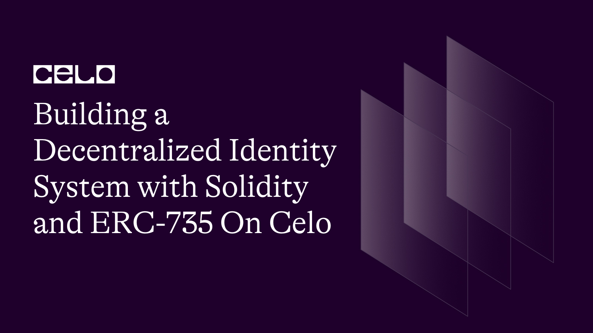

## Introduction

The `ERC735` standard is a set of rules and requirements for managing identity and claims on the Celo blockchain. The Identity contract you provided implements this standard, allowing users to manage their identity by adding and removing claims.

Claims are assertions about a user's identity that can be verified by anyone with access to the blockchain. The Identity contract uses OpenZeppelin's AccessControl library to manage roles and permissions for adding and removing claims.

By implementing the `ERC735` standard, the Identity contract can be used in conjunction with other identity management systems that also adhere to this standard. This allows for interoperability between different identity management systems, creating a more seamless and secure user experience.

Here's the github repo of our code. [source code](https://github.com/richiemikke/erc735-identity-contract)

## Prerequisites

To follow this tutorial, you will need the following:

- Basic knowledge of Solidity programming language.
- A Development Environment Like Remix.
- The celo Extension Wallet.

## SmartContract

Let's begin writing our smart contract in Remix IDE

The completed code Should look like this.

```solidity
// SPDX-License-Identifier: MIT
pragma solidity ^0.8.0;

import "https://github.com/OpenZeppelin/openzeppelin-contracts/blob/master/contracts/access/AccessControl.sol";

contract Identity is AccessControl {
    bytes32 public constant CLAIM_ISSUER_ROLE = keccak256("CLAIM_ISSUER_ROLE");
    bytes32 public constant CLAIM_DELEGATE_ROLE = keccak256("CLAIM_DELEGATE_ROLE");

    struct Claim {
        uint256 topic;
        uint256 scheme;
        address issuer;
        bytes signature;
        bytes data;
        string uri;
    }

    mapping(bytes32 => Claim) public claims;
    mapping(uint256 => bytes32[]) public claimsByTopic;

    event ClaimAdded(bytes32 indexed claimId, uint256 indexed topic, address indexed issuer);
    event ClaimRemoved(bytes32 indexed claimId, uint256 indexed topic, address indexed issuer);
    event ClaimRequested(bytes32 indexed claimId, uint256 indexed topic, address indexed issuer);

    constructor() {
        _setupRole(DEFAULT_ADMIN_ROLE, msg.sender);
    }

    function getClaim(bytes32 _claimId) external view returns (uint256 topic, uint256 scheme, address issuer, bytes memory signature, bytes memory data, string memory uri) {
        Claim memory claim = claims[_claimId];
        return (claim.topic, claim.scheme, claim.issuer, claim.signature, claim.data, claim.uri);
    }

    function addClaim(uint256 _topic, uint256 _scheme, address _issuer, bytes calldata _signature, bytes calldata _data, string calldata _uri) external onlyRole(CLAIM_ISSUER_ROLE) returns (bytes32 claimRequestId) {
        bytes32 claimId = keccak256(abi.encodePacked(_issuer, _topic));

        claims[claimId] = Claim(_topic, _scheme, _issuer, _signature, _data, _uri);
        claimsByTopic[_topic].push(claimId);

        emit ClaimAdded(claimId, _topic, _issuer);
        return claimId;
    }

    function removeClaim(bytes32 _claimId) external onlyRole(CLAIM_ISSUER_ROLE) {
        uint256 topic = claims[_claimId].topic;
        address issuer = claims[_claimId].issuer;

        delete claims[_claimId];

        bytes32[] storage claimIds = claimsByTopic[topic];
        for (uint256 i = 0; i < claimIds.length; i++) {
            if (claimIds[i] == _claimId) {
                claimIds[i] = claimIds[claimIds.length - 1];
                claimIds.pop();
                break;
            }
        }

        emit ClaimRemoved(_claimId, topic, issuer);
    }

    function requestClaim(bytes32 _claimId) external onlyRole(CLAIM_DELEGATE_ROLE) {
        emit ClaimRequested(_claimId, claims[_claimId].topic, claims[_claimId].issuer);
    }

    function setClaimIssuer(address _account) external onlyRole(DEFAULT_ADMIN_ROLE) {
        grantRole(CLAIM_ISSUER_ROLE, _account);
    }

    function setClaimDelegate(address _account) external onlyRole(DEFAULT_ADMIN_ROLE) {
        grantRole(CLAIM_DELEGATE_ROLE, _account);
    }

    function removeClaimIssuer(address _account) external onlyRole(DEFAULT_ADMIN_ROLE) {
        revokeRole(CLAIM_ISSUER_ROLE, _account);
    }

    function removeClaimDelegate(address _account) external onlyRole(DEFAULT_ADMIN_ROLE) {
        revokeRole(CLAIM_DELEGATE_ROLE, _account);
    }
}

```

## Contract Structure

The contract is named Identity and it inherits from the `AccessControl` contract. The AccessControl contract is imported from OpenZeppelin's GitHub repository.

**Roles and Variables**

Two roles are defined in the contract.

```solidity
// SPDX-License-Identifier: MIT
pragma solidity ^0.8.0;

import "https://github.com/OpenZeppelin/openzeppelin-contracts/blob/master/contracts/access/AccessControl.sol";

contract Identity is AccessControl {
    bytes32 public constant CLAIM_ISSUER_ROLE = keccak256("CLAIM_ISSUER_ROLE");
    bytes32 public constant CLAIM_DELEGATE_ROLE = keccak256("CLAIM_DELEGATE_ROLE");

    mapping(bytes32 => Claim) public claims;
    mapping(uint256 => bytes32[]) public claimsByTopic;
}
```

`CLAIM_ISSUER_ROLE`: A bytes32 variable that holds the role name for adding and removing claims.
`CLAIM_DELEGATE_ROLE`: A bytes32 variable that holds the role name for requesting claims.
`claims`: A mapping that stores the claims made by issuers.
`claimsByTopic`: A mapping that stores an array of claim IDs for each topic.

**Struct, Events and Constructor**

```solidity
   struct Claim {
        uint256 topic;
        uint256 scheme;
        address issuer;
        bytes signature;
        bytes data;
        string uri;
    }

    event ClaimAdded(bytes32 indexed claimId, uint256 indexed topic, address indexed issuer);
    event ClaimRemoved(bytes32 indexed claimId, uint256 indexed topic, address indexed issuer);
    event ClaimRequested(bytes32 indexed claimId, uint256 indexed topic, address indexed issuer);

      constructor() {
        _setupRole(DEFAULT_ADMIN_ROLE, msg.sender);
    }
```

- `Claim`: A struct that defines a claim and its properties.
- `ClaimAdded` Event: Triggered when a new claim is added to the contract.
- `ClaimRemoved` Event: Triggered when a claim is removed from the contract.
- `ClaimRequested` Event: Triggered when a claim is requested by a delegate.
- `Constructor`: The constructor sets the contract deployer as the default admin role.

**Functions**

```solidity
function getClaim(bytes32 _claimId) external view returns (uint256 topic, uint256 scheme, address issuer, bytes memory signature, bytes memory data, string memory uri) {
        Claim memory claim = claims[_claimId];
        return (claim.topic, claim.scheme, claim.issuer, claim.signature, claim.data, claim.uri);
    }
```

The `getClaim` function returns a claim's properties based on its ID.

It is used to retrieve data from the contract. In the Identity contract, the `getClaim()` function allows users to retrieve a claim's properties based on its ID.

```solidity
function addClaim(uint256 _topic, uint256 _scheme, address _issuer, bytes calldata _signature, bytes calldata _data, string calldata _uri) external onlyRole(CLAIM_ISSUER_ROLE) returns (bytes32 claimRequestId) {
        bytes32 claimId = keccak256(abi.encodePacked(_issuer, _topic));

        claims[claimId] = Claim(_topic, _scheme, _issuer, _signature, _data, _uri);
        claimsByTopic[_topic].push(claimId);

        emit ClaimAdded(claimId, _topic, _issuer);
        return claimId;
    }
```

`addClaim()` function is an external function, which means it can be called from outside the contract. This function allows `CLAIM_ISSUER_ROLE` users to add a new claim to the contract. The claim is stored in the claims mapping, with the claim ID being a hash of the issuer's address and the claim topic. The claim ID is used to access the claim's properties in other parts of the contract. The claim is also added to the `claimsByTopic` mapping, which is used to retrieve all claims associated with a specific topic.

```solidity
  function removeClaim(bytes32 _claimId) external onlyRole(CLAIM_ISSUER_ROLE) {
        uint256 topic = claims[_claimId].topic;
        address issuer = claims[_claimId].issuer;

        delete claims[_claimId];

        bytes32[] storage claimIds = claimsByTopic[topic];
        for (uint256 i = 0; i < claimIds.length; i++) {
            if (claimIds[i] == _claimId) {
                claimIds[i] = claimIds[claimIds.length - 1];
                claimIds.pop();
                break;
            }
        }

        emit ClaimRemoved(_claimId, topic, issuer);
    }
```

The `removeClaim()` function removes a claim from the contract. The function takes in the claim ID as an argument.
This function can only be called by users with the `CLAIM_ISSUER_ROLE`.

The `removeClaim()` function allows `CLAIM_ISSUER_ROLE` users to remove a claim from the contract. The claim's data is deleted from the claims mapping, and the claim ID is removed from the `claimsByTopic` mapping.

```solidity
  function requestClaim(bytes32 _claimId) external onlyRole(CLAIM_DELEGATE_ROLE) {
        emit ClaimRequested(_claimId, claims[_claimId].topic, claims[_claimId].issuer);
    }
```

This function can only be called by users with the `CLAIM_DELEGATE_ROLE`.

The `requestClaim()` function allows `CLAIM_DELEGATE_ROLE` users to request a claim from the contract. This function does not change the state of the contract, but instead triggers the ClaimRequested event. This event can be monitored by external systems, allowing them to react to claim requests.

This function can only be called by users with the `CLAIM_DELEGATE_ROLE`.

```solidity
function setClaimIssuer(address _account) external onlyRole(DEFAULT_ADMIN_ROLE) {
        grantRole(CLAIM_ISSUER_ROLE, _account);
    }
```

The `setClaimIssuer()` function allows `DEFAULT_ADMIN_ROLE` users to grant the `CLAIM_ISSUER_ROLE` to a user. This function changes the state of the contract, adding the user to the `CLAIM_ISSUER_ROLE`.

This function can only be called by users with the `DEFAULT_ADMIN_ROLE`.

```solidity
 function setClaimDelegate(address _account) external onlyRole(DEFAULT_ADMIN_ROLE) {
        grantRole(CLAIM_DELEGATE_ROLE, _account);
    }
```

The `setClaimDelegate()` function allows `DEFAULT_ADMIN_ROLE` users to grant the `CLAIM_DELEGATE_ROLE` to a user. This function changes the state of the contract, adding the user to the `CLAIM_DELEGATE_ROLE`.

This function can only be called by users with the `DEFAULT_ADMIN_ROLE`.

```solidity
 function removeClaimIssuer(address _account) external onlyRole(DEFAULT_ADMIN_ROLE) {
        revokeRole(CLAIM_ISSUER_ROLE, _account);
    }
```

The `removeClaimIssuer()` function allows `DEFAULT_ADMIN_ROLE` users to revoke the `CLAIM_ISSUER_ROLE` from a user. This function changes the state of the contract, removing the user from the `CLAIM_ISSUER_ROLE`.

This function can only be called by users with the `DEFAULT_ADMIN_ROLE`.

```solidity
 function removeClaimDelegate(address _account) external onlyRole(DEFAULT_ADMIN_ROLE) {
        revokeRole(CLAIM_DELEGATE_ROLE, _account);
    }
```

The `removeClaimDelegate()` function allows `DEFAULT_ADMIN_ROLE` users to revoke the `CLAIM_DELEGATE_ROLE` from a user. This function changes the state of the contract, removing the user from the `CLAIM_DELEGATE_ROLE`.

This function can only be called by users with the `DEFAULT_ADMIN_ROLE`.

## Deployment

**Install the Celo Plugin**

First, you'll need to install the Celo Plugin for Remix. To do this, open Remix and click on the `Plugin Manager` icon on the left-hand side. Search for `Celo` and click the `Install` button next to the Celo Plugin. Once the installation is complete, you'll see a new `Celo` tab appear in the sidebar.

**Connect to the Celo Alfajores Testnet**

To deploy our smart contract successfully, we need the celo extention wallet which can be downloaded from [here](https://chrome.google.com/webstore/detail/celoextensionwallet/kkilomkmpmkbdnfelcpgckmpcaemjcdh?hl=en)

Next, we need to fund our newly created wallet which can done using the celo alfojares faucet [Here](https://celo.org/developers/faucet)

Next, you'll need to connect Remix to the Celo Testnet. Click on the `Celo` tab in the sidebar and then click on the `Connect to Network` button.

**Compile Contract**

Open the `Identity.sol` file in Remix and click on the `Solidity Compiler` tab in the sidebar. Click the `Compile Identity.sol` button to compile the contract.

**Deploy the Contract**

Click on the `Deploy & Run Transactions` tab in the sidebar. In the `Contract` dropdown menu, select `Identity`.

**Interact with the Contract**

Once the contract is deployed, you can interact with it using the functions in the `Deployed Contracts` section of the `Deploy & Run Transactions` tab. You'll need to connect to the contract using the `At Address` button and entering the contract address. From there, you can call the various functions of the contract, such as staking, unstaking, withdrawing rewards, and transferring ownership.

That's it! With these steps, you should be able to deploy the `Identity` smart contract to the Celo Testnet using Remix and the Celo Plugin.

## Conclusion

In conclusion, the Identity contract provides a way for users to manage their identity by adding and removing claims. The contract uses roles to manage permissions and OpenZeppelin's `AccessControl` library for added security. The functions in the contract allow users to add and remove claims, request claims, and manage role assignments. The contract can be extended to include more functionality as needed.

## Learn More

I hope you learned a lot from this tutorial. Here are some relevant links that would aid your learning further.

- [Celo Docs](https://docs.celo.org/)
- [Solidity Docs](https://docs.soliditylang.org/en/v0.8.17/)

## About the author

Hello, I'am Richard Michael, a fullstack web3 developer.
