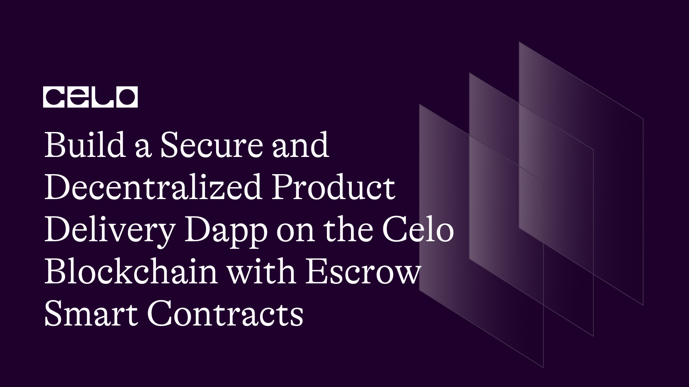

## Introduction

In this tutorial, we will guide you through the process of building a full-stack decentralized application that enables secure product delivery on the Celo blockchain. We will use Solidity to write a smart contract and React to build the front end of the application.

Our focus will be on creating an escrow smart contract, which acts as a trusted intermediary between buyers and sellers, ensuring that both parties fulfill their obligations before the transaction is complete. This will allow us to create a secure and decentralized system that ensures the safe and timely delivery of products.

## Prerequisites

1. Solidity: You should have a basic understanding of Solidity, the programming language used for writing smart contracts on the Celo blockchain.

2. React: You should have a basic understanding of React, a popular JavaScript library for building user interfaces. You should be familiar with components, state, props, and lifecycle methods.

3. Hardhat: You should have a basic understanding of Hardhat, a development environment for building, testing, and deploying smart contracts on the Celo blockchain. You should be familiar with Hardhat's project structure, configuration, and testing features.

## Requirements

1. Node.js: You will need Node.js to install on your machine to run the necessary tools and libraries for our application. You can download the latest version of Node.js from the official website [here](https://nodejs.org/en/download/)
2. Hardhat: We will be using Hardhat as our development environment for building, testing, and deploying smart contracts on the Celo blockchain.
3. React: We will be using React to build the front end of our application. You can create a new React project using the following command: `npx create-react-app my-app`
4. MetaMask Wallet Extension: You will need to install the MetaMask Wallet Extension for your browser to interact with the Celo blockchain. You can find the extension for Chrome, Firefox, and Brave browsers [here](https://metamask.io/)

## Setting up the project

We will set up our project by cloning a starter code template from GitHub and installing the necessary dependencies.

To get started, open your terminal and run the following command to clone the starter code template for our project from GitHub.

```bash
git clone https://github.com/JovanMwesigwa/escrow-dapp.git
```

This will create a new folder called `escrow-dapp` in your current directory, which contains the starter code template for our project.

Once you've cloned the repository, navigate to the `escrow-dapp` folder in your terminal and install the necessary dependencies for our project by running the following command:

```bash
npm install
```

Or

```bash
yarn
```

This command will install all the required dependencies specified in the package.json file.

After the dependencies have been installed successfully, you're all set to start building the project.

The smart contract code will be written inside the `/Contracts/Escrow.sol` that comes with the starter template.

Inside the Contract, we start by defining some custom error messages that will be used in the revert functions of the contract as shown below:

```solidity
error Escrow__NotAdminRequestDenied();
error Escrow__OnyBuyerDepositAllowed();
error Escrow__OnlyBuyerDepositAllowed();
error Escrow__InsufficientAmountDeposited();
error Escrow__OnlyBuyerConfirmDeposit();
error Escrow__ContractAlreadyInProgress();
error Escrow__BothPartiesMustConfirmFirst();
```

By doing it this way, we save some gas fees, because this is a little cheaper than the inbuilt `require()` method that comes with Solidity.

The Escrow contract is defined using the contract keyword. It has several state variables defined, which are used to keep track of the buyer, seller, balance, and confirmation status. The `buyerConfirmation` and `sellerConfirmation` variables are used to track whether the buyer and seller have confirmed the transaction.

```solidity
contract Escrow {
    address private i_admin;
    address payable private s_buyer;
    address payable private s_seller;

    uint256 private s_balance;

    bool private buyerConfirmation;
    bool private sellerConfirmation;

    // Events
    event Deposit(address indexed buyerAddress, uint256 indexed amount);
    event DeliveryConfirmed(address indexed buyerAddress);
    event ReceiptDone(address indexed sellerAddress);
    event PaymentReleased(
        address indexed buyerAddress,
        address indexed sellerAddress,
        uint256 amount
    );
```

To keep track of the changes happening in the contract, we'll emit some events in the contract by emitting deposit, delivery confirmation, receipt, and payment events

The `Deposit` event is emitted when the buyer makes a deposit, the `DeliveryConfirmed` event is emitted when the buyer confirms the delivery, the `ReceiptDone` event is emitted when the seller confirms receipt, and the `PaymentReleased` event is emitted when the payment is released.

```solidity
    constructor() {
        i_admin = payable(msg.sender);
        s_balance = 0;
    }
```

The `constructor` function is used to initialize the state variables when the contract is deployed. It sets the `i_admin` variable to the address of the deployer and sets the `s_balance` variable to 0.

A `confirmSellerDelivery` function is called by the buyer to confirm the delivery. It verifies that only the buyer can call this function, sets the `buyerConfirmation` variable to true, emits a `DeliveryConfirmed` event, and if both the buyer and seller have confirmed the transaction, it releases the payment to the seller, as shown below:

```solidity
    function confirmSellerDelivery() public payable {
        // Verify that only the buyer confirms the delivery
        if (msg.sender != s_buyer) {
            revert Escrow__OnlyBuyerConfirmDeposit();
        }

        buyerConfirmation = true;

        // Emit a delivery confirmation event
        emit DeliveryConfirmed(msg.sender);

        // Call the release payment here...
        if (buyerConfirmation && sellerConfirmation) {
            s_seller.transfer(address(this).balance);
            buyerConfirmation = false;
            sellerConfirmation = false;
            s_balance = 0;
        }
    }
```

A `confirmBuyerReceipt` function is used by the seller to confirm that the buyer has received the product and issued a receipt. It first checks that only the seller can call this function by verifying that `msg.sender` is equal to the `s_seller address`. If not, it reverts the transaction and throws an error.

```solidity
function confirmBuyerReceipt() public payable {
        // Verify that only the seller confirms the issuing of the receipt
        if (msg.sender != s_seller) {
            revert Escrow__OnlyBuyerConfirmDeposit();
        }

        sellerConfirmation = true;

        // Emit a receipt done event
        emit ReceiptDone(msg.sender);

        // Call the release payment here...
        if (buyerConfirmation && sellerConfirmation) {
            s_seller.transfer(address(this).balance);
            sellerConfirmation = true;
            s_balance = 0;
        }
}
```

If the seller is the one who called the function, `sellerConfirmation` is set to true, indicating that the seller has confirmed the receipt. An event, `ReceiptDone`, is then emitted to notify any external applications of the event.

Finally, if both the buyer and the seller have confirmed their parts, the `s_seller` address is sent the entire balance of the contract, and the `sellerConfirmation` and `s_balance` variables are reset to their initial values.

Finally, we define the rest of the `pure` / `view` to retrieve private variables in the contract.

Here's the full smart contract code below:

```solidity
// SPDX-License-Identifier: UNLICENSED
pragma solidity ^0.8.9;


error Escrow__NotAdminRequestDenied();
error Escrow__OnyBuyerDepositAllowed();
error Escrow__OnlyBuyerDepositAllowed();
error Escrow__InsufficientAmountDeposited();
error Escrow__OnlyBuyerConfirmDeposit();
error Escrow__ContractAlreadyInProgress();
error Escrow__BothPartiesMustConfirmFirst();

contract Escrow {
    address private i_admin;
    address payable private s_buyer;
    address payable private s_seller;

    uint256 private s_balance;

    bool private buyerConfirmation;
    bool private sellerConfirmation;

    // Events
    event Deposit(address indexed buyerAddress, uint256 indexed amount);
    event DeliveryConfirmed(address indexed buyerAddress);
    event ReceiptDone(address indexed sellerAddress);
    event PaymentReleased(
        address indexed buyerAddress,
        address indexed sellerAddress,
        uint256 amount
    );

    constructor() {
        i_admin = payable(msg.sender);
        s_balance = 0;
    }

    function confirmSellerDelivery() public payable {
        // Verify that only the buyer confirms the delivery
        if (msg.sender != s_buyer) {
            revert Escrow__OnlyBuyerConfirmDeposit();
        }

        buyerConfirmation = true;

        // Emit a delivery confirmation event
        emit DeliveryConfirmed(msg.sender);

        // Call the release payment here...
        if (buyerConfirmation && sellerConfirmation) {
            s_seller.transfer(address(this).balance);
            buyerConfirmation = false;
            sellerConfirmation = false;
            s_balance = 0;
        }
    }

    function confirmBuyerReceipt() public payable {
        // Verify that only the seller confirms the issuing of the receipt
        if (msg.sender != s_seller) {
            revert Escrow__OnlyBuyerConfirmDeposit();
        }

        sellerConfirmation = true;

        // Emit a receipt done event
        emit ReceiptDone(msg.sender);

        // Call the release payment here...
        if (buyerConfirmation && sellerConfirmation) {
            s_seller.transfer(address(this).balance);
            sellerConfirmation = true;
            s_balance = 0;
        }
    }

    function deposit() public payable {
        // Verify that the buyer is only depositing
        if (msg.sender != s_buyer) {
            revert Escrow__OnlyBuyerDepositAllowed();
        }

        // Verify that the amount of money deposited is not 0
        if (msg.value <= 0) {
            revert Escrow__InsufficientAmountDeposited();
        }

        // Update the contract's balance
        s_balance += msg.value;

        // Emit a deposit event
        emit Deposit(msg.sender, msg.value);
    }

    function addParties(address payable buyer, address payable seller) public {
        if (msg.sender != i_admin) {
            revert Escrow__NotAdminRequestDenied();
        }

        s_buyer = buyer;
        s_seller = seller;
    }

    function getBalance() public view returns (uint256) {
        return s_balance;
    }

    function getAdmin() public view returns (address) {
        return i_admin;
    }

    function getBuyer() public view returns (address) {
        return s_buyer;
    }

    function getSeller() public view returns (address) {
        return s_seller;
    }

    function getBuyerConfirmation() public view returns (bool) {
        return buyerConfirmation;
    }

    function getSellerConfirmation() public view returns (bool) {
        return sellerConfirmation;
    }
}
```

### Configuring the hardhat script file

The hardhat script file is used to deploy and interact with the smart contract.

In this script, we define three networks: `hardhat`, `localhost`, and `alfajores`.

Both the hardhat and local networks are the default used for local testing.

Finally, the alfajores network is used to deploy the smart contract on the Alfajores testnet. This is where we'll deploy our contract. Each network configuration includes a chainId, which is a unique identifier for each blockchain network.

Next, we define the Solidity compiler versions that we want to use. In this script, we specify four different versions of the Solidity compiler, ranging from version `0.6.6` to version `0.8.18`. By including multiple compiler versions, we can compile our smart contracts with different versions of Solidity and ensure that our contracts will work on different networks.

The `paths` section specifies the directory where Hardhat stores the compiled contracts, artifacts, and other data. These will be very important to use when interacting with the front end later. By setting this path, hardhat will automatically look for the artifacts in this route.

We also define a named account in this script, `deployer`, which is used to deploy the smart contract. By defining a named account, we can easily refer to it in our deployment scripts.

Finally, the `etherscan` section is used to configure Etherscan API keys for different networks. We provide an API key for the `alfajores` network, which allows us to verify our deployed contract on the Etherscan block explorer.

### Obtaining env keys

To configure and get the environment variables for the `hardhat.config.js` file, you need to create a `.env` file in the root directory of the project. The `.env` file should contain the required environment variables.

As shown below:

```js
ALFAJORES_API_KEY=<ALAFAJORES API KEY>
ALFAJORES_URL=https://celo-alfajores.infura.io/v3/<INFURA RPC KEY>
PRIVATE_KEY=<WALLET PRIVATE KEY FROM METAMASK>
```

1. `ALFAJORES_API_KEY`: This is the API key for the Alfajores network provided by Celscan. You can get an API key by creating an account on Celoscan [here](https://celoscan.io/login) and going to the API section of your account.
2. `ALFAJORES_URL`: This is the URL for the Aljajores network. To get this URL, create an account with Infura [here](https://app.infura.io)
3. `PRIVATE_KEY`: This is the private key for the account that will be used to deploy the contract. This can be found in your MetaMask wallet.

Overall, this script file is used to configure the various settings of the Hardhat framework and is crucial for developing, testing, and deploying smart contracts using Hardhat.

### Deploy script

Now that our hardhat configuration is complete, we can now write a deploy script for the contract.

Inside `/deploy` create a file called `01-deploy-escrow.js`. This will define the main deploy script for the contract with the code below:

```js
const { network } = require("hardhat");
const { verifyContract } = require("../utils/verifyContract");

module.exports = async ({ getNamedAccounts, deployments }) => {
  const { deployer } = await getNamedAccounts();

  const chainId = network.config.chainId;

  const { deploy, log } = deployments;

  const args = [];
  const waitConfirmations = 1;

  // Only verify the contract when we are deploying on the celo test net
  const tx = await deploy("Escrow", {
    from: deployer,
    args: args,
    waitConfirmations: waitConfirmations,
    log: true,
  });
  log("Product Escrow contract deployed --------------");

  if (chainId != 31337) {
    log("Verifying the contract on celoscan...");
    await verifyContract(tx.address);
  }
};

module.exports.tags = ["all", "deploy"];
```

The asynchronous function takes in two parameters: `getNamedAccounts` and `deployments`. `getNamedAccounts` is a function that retrieves the addresses of pre-configured accounts in the Hardhat config file.

In this script, we are only interested in the `deployer` account, which is the account that will deploy the contract. We retrieve it by calling `await getNamedAccounts()`.

We then retrieve the `chainId` from the `network.config` object, which tells us which network we are deploying to.

We use the `deploy` function provided by the `deployments` plugin to deploy the contract. We pass in the name of the contract, `Escrow`, and an empty array for the constructor arguments, as our `Escrow` contract does not require any constructor arguments. We also specify the `from` parameter as the `deployer` account retrieved earlier. We set `waitConfirmations` to 1 so that we only proceed with the deployment once the transaction has been confirmed by at least one node on the network. We also set `log` to `true` so that deployment progress is displayed in the console.

Finally, we check if the `chainId` is not equal to `31337` (i.e. we are deploying on a Celo network, not the local Hardhat network), and if so, we call the `verifyContract` function to verify the contract on the Celo blockchain.

Lastly, we define a line exports an array of tags for this script, which can be used to run this script and any others with a particular tag by using the `--tags` flag in the command line. In this case, we have tagged this script with `all` and `deploy`, so running `npx hardhat deploy --tags deploy` will execute this script.

### Deploying the contract

Using the defined deploy script, we can now deploy the contract from the terminal.

In your terminal type:

```bash
npx hardhat deploy --network alfajores
```

This will automatically push the contract to Celo Alfajore's network using all the predefined environment variables in the `hardhat.config.js` file.

Output:


The contract was successfully deployed and verified on the alfajores network.

### Setting up the front end

Now that the contract is successfully deployed, we can set up the front end to interact with the deployed contract.

Navigate to the `/client` folder in your project and install all the necessary dependencies for the frontend using by typing:

```bash
npm install
```

OR

```bash
yarn
```

We need to notify the front where to find the contract's address and the admin's address.
This can be found in the `/constants` folder.

```js
import abi from "../backend/contracts/Escrow.sol/Escrow.json";

export const CONTRACT_ADDRESS = "";
export const ADMIN_ADDRESS = "";
export const ABI = abi.abi;
```

Replace `CONTRACT_ADDRESS` with your deployed contract address and `ADMIN_ADDRESS` with your deployer's address.

Now that the basic configuration is done, we can now run the front end.

In your terminal type:

```bash
yarn run dev
```

Output:


The UI consists of the following:

1. A web3 connect button, deposit payment button, escrow balance, and the admin, buyer, and seller addresses.

2. A confirm delivery and confirm Recept button that will specifically be shown to a seller or buyer.

3. Finally and progress bar to keep track of the necessary steps taken to complete the escrow lifetime.

### Building the frontend

The main logic of the front end happens in the `Home.jsx` file. Inside, we declared various state variables to keep track of what's happening in the UI. As shown below:

```js
const { isWeb3Enabled, account } = useMoralis();

//   Buyer state
const [buyer, setBuyer] = useState("");

//   Contract balance
const [balance, setBalance] = useState(null);

//   Seller State
const [seller, setSeller] = useState("");

//   buyer confirmation status
const [buyerConfirmed, setBuyerConfirmed] = useState(false);

//Seller confirmed the status
const [sellerConfirmed, setSellerConfirmed] = useState(false);

const [adminAddress, setAdminAddress] = useState(
  "0x5cbdf5f9e468df3888e04155668ccafc6f6c4dcf"
);
```

Using the `useMoralis()` hook to retrieve two variables, `isWeb3Enabled` and `account`, from the Moralis Web3 API. `isWeb3Enabled` is a boolean variable that indicates whether the user's browser has Web3 enabled or not. `account` is a string variable that contains the user's Celo account address.

Next, we have several state variables declared using the `useState` hook. These variables are used to keep track of the buyer's address, contract balance, seller's address, and whether the buyer and seller have confirmed the transaction or not.

We have another state variable called `adminAddress`, which is initialized to a default Celo address. This variable is used to store the Celo address of the contract administrator. This happens to be the deployer of the contract too.

To interact easily with the smart contract, we use the contract function calls in this function and throughout the code with the `useWeb3Contract` hook provided by Moralis, which provides a way to interact with the contract's functions by specifying its ABI, contract address, function name, and any necessary parameters.

For example, to fetch the contract's balance, we define it as below:

```js
//   Get balance
const { runContractFunction: getBalance } = useWeb3Contract({
  abi: ABI,
  contractAddress: CONTRACT_ADDRESS,
  functionName: "getBalance",
  params: {},
});
```

This directly calls the contract function name `getBalance` by passing in the contract address and AB directly.

If the function needs any type of parameters, we pass them inside the `params: {}` object.

To call the `deposit` function, we use

```js
//   CONTRACT MUTATION FUNCTIONS
//   Deposit money
const {
  isLoading,
  runContractFunction: deposit,
  isFetching,
  error,
} = useWeb3Contract({
  abi: ABI,
  contractAddress: CONTRACT_ADDRESS,
  functionName: "deposit",
  params: {},
  msgValue: 1,
});
```

The `deposit()` function calls the contract's `deposit` function which allows the buyer to deposit funds into the smart contract. It also uses the `useWeb3Contract` hook to specify the ABI, contract address, function name, and a `msgValue` of 1, which specifies the amount of Celo being sent with the transaction.

Using the same logic above, we'll use for interacting with all the contract's functions like `confirmSellerDelivery()` and `confirmBuyerReceipt()`

All the contract interaction functions are defined as shown below:

```js
const { runContractFunction: getBuyer } = useWeb3Contract({
  abi: ABI,
  contractAddress: CONTRACT_ADDRESS,
  functionName: "getBuyer",
  params: {},
});

//   Get balance
const { runContractFunction: getBalance } = useWeb3Contract({
  abi: ABI,
  contractAddress: CONTRACT_ADDRESS,
  functionName: "getBalance",
  params: {},
});

const { runContractFunction: getSeller } = useWeb3Contract({
  abi: ABI,
  contractAddress: CONTRACT_ADDRESS,
  functionName: "getSeller",
  params: {},
});

//   Get buyer Confirmation status
const { runContractFunction: getBuyerConfirmation } = useWeb3Contract({
  abi: ABI,
  contractAddress: CONTRACT_ADDRESS,
  functionName: "getBuyerConfirmation",
  params: {},
});

//   Get seller Confirmation status
const { runContractFunction: getSellerConfirmation } = useWeb3Contract({
  abi: ABI,
  contractAddress: CONTRACT_ADDRESS,
  functionName: "getSellerConfirmation",
  params: {},
});

//   CONTRACT MUTATION FUNCTIONS
//   Deposit money
const {
  isLoading,
  runContractFunction: deposit,
  isFetching,
  error,
} = useWeb3Contract({
  abi: ABI,
  contractAddress: CONTRACT_ADDRESS,
  functionName: "deposit",
  params: {},
  msgValue: 1,
});

//   Buyer Confirms delivery
const {
  // isLoading,
  runContractFunction: confirmSellerDelivery,
  // isFetching,
  // error,
} = useWeb3Contract({
  abi: ABI,
  contractAddress: CONTRACT_ADDRESS,
  functionName: "confirmSellerDelivery",
  params: {},
});

//   Seller Confirms receipt
const {
  // isLoading,
  runContractFunction: confirmBuyerReceipt,
  // isFetching,
  // error,
} = useWeb3Contract({
  abi: ABI,
  contractAddress: CONTRACT_ADDRESS,
  functionName: "confirmBuyerReceipt",
  params: {},
});
```

We may want to render all the fetched data on the initial page load of the UI.

The `populateData()` function is an asynchronous function that calls several other functions to populate the state variables defined earlier. It first calls `getBuyer()` to get the buyer's address and sets the buyer state variable to this value. Similarly, it calls `getSeller()` to get the seller's address and sets the seller state variable to this value. It also calls `getBuyerConfirmation()` and `getSellerConfirmation()` to get the confirmation status of the buyer and the seller respectively, and sets the corresponding `buyerConfirmed` and `sellerConfirmed` state variables to these values. Finally, it calls `getBalance()` to get the contract's balance and sets the balance state variable to this value.

As shown below:

```js
const populateData = async () => {
  try {
    const returnedBuyer = await getBuyer();
    setBuyer(returnedBuyer);

    const returnedSeller = await getSeller();
    setSeller(returnedSeller);

    const buyerStatus = await getBuyerConfirmation();
    setBuyerConfirmed(buyerStatus);

    const sellerStatus = await getSellerConfirmation();
    setSellerConfirmed(sellerStatus);

    const balanceResult = await getBalance();
    setBalance(balanceResult.toString());
  } catch (error) {
    console.log(error.response);
  }
};
```

The `useEffect` hook is being used to make sure that the `populateData` function is called whenever any of the dependencies listed in the second argument of the `useEffect` hook changes. The dependencies include `isWeb3Enabled`, `account`, `buyerConfirmed`, `balance`, `buyerConfirmed`, and `sellerConfirmed`.

```js
useEffect(() => {
  if (isWeb3Enabled) {
    populateData();
  }
}, [
  isWeb3Enabled,
  account,
  buyerConfirmed,
  balance,
  buyerConfirmed,
  sellerConfirmed,
]);
```

If any of these values change, the `populateData` function will be called, which will update the state with the latest buyer, seller, balance, and confirmation statuses.

We have a `Deposit Payment` button that, when clicked, triggers the depositFunds function. This function is responsible for sending celo to the contract.

```js
<button
  onClick={depositFunds}
  className="p-3 px-5 my-12 text-white bg-green-500 rounded-full"
>
  Deposit Payment
</button>
```

We are also displaying the contract balance using the balance state variable.

```js
{
  balance && <h1 className="text-xl font-bold">Escrow bal: {balance}</h1>;
}
```

We also have some conditional rendering for the buttons to confirm delivery and receipt. If the user is the buyer and the buyer has not yet confirmed, we render the confirm delivery button. If the user is the seller and the seller has not yet confirmed, we render the confirm receipt button.

```js
<div className="flex items-center flex-1">
  {account &&
    buyer.toLocaleLowerCase() === account.toLocaleLowerCase() &&
    !buyerConfirmed && (
      <button
        onClick={confirmDelivery}
        className="h-10 px-4 text-blue-600 bg-blue-300 border-2 border-blue-600 rounded-full"
      >
        Confirm Delivery
      </button>
    )}
  {account &&
    seller.toLocaleLowerCase() === account.toLocaleLowerCase() &&
    !sellerConfirmed && (
      <button
        onClick={confirmReceipt}
        className="h-10 px-4 text-orange-600 bg-orange-300 border-2 border-orange-600 rounded-full"
      >
        Confirm Recipt
      </button>
    )}
</div>
```

When either button is clicked, it will trigger the corresponding function, confirmDelivery or confirmReceipt, respectively.

Full UI code:

```js
import { useEffect, useState } from "react";
import Layout from "../components/Layout";
import TimeLine from "../components/TimeLine";
import { useMoralis, useWeb3Contract } from "react-moralis";
import { ABI, ADMIN_ADDRESS, CONTRACT_ADDRESS } from "../../constants";

function Home() {
  const { isWeb3Enabled, account } = useMoralis();

  //   Buyer state
  const [buyer, setBuyer] = useState("");

  //   Contract balance
  const [balance, setBalance] = useState(null);

  //   Seller State
  const [seller, setSeller] = useState("");

  //   buyer confirmation status
  const [buyerConfirmed, setBuyerConfirmed] = useState(false);

  //Seller confirmed the status
  const [sellerConfirmed, setSellerConfirmed] = useState(false);

  const [adminAddress, setAdminAddress] = useState(
    "0x5cbdf5f9e468df3888e04155668ccafc6f6c4dcf"
  );

  useEffect(() => {
    if (isWeb3Enabled) {
      populateData();
    }
  }, [
    isWeb3Enabled,
    account,
    buyerConfirmed,
    balance,
    buyerConfirmed,
    sellerConfirmed,
  ]);

  // Fetch the buyer and seller address
  const populateData = async () => {
    try {
      const returnedBuyer = await getBuyer();
      setBuyer(returnedBuyer);

      const returnedSeller = await getSeller();
      setSeller(returnedSeller);

      const buyerStatus = await getBuyerConfirmation();
      setBuyerConfirmed(buyerStatus);

      const sellerStatus = await getSellerConfirmation();
      setSellerConfirmed(sellerStatus);

      const balanceResult = await getBalance();
      setBalance(balanceResult.toString());
    } catch (error) {
      console.log(error.response);
    }
  };

  const { runContractFunction: getBuyer } = useWeb3Contract({
    abi: ABI,
    contractAddress: CONTRACT_ADDRESS,
    functionName: "getBuyer",
    params: {},
  });

  //   Get balance
  const { runContractFunction: getBalance } = useWeb3Contract({
    abi: ABI,
    contractAddress: CONTRACT_ADDRESS,
    functionName: "getBalance",
    params: {},
  });

  const { runContractFunction: getSeller } = useWeb3Contract({
    abi: ABI,
    contractAddress: CONTRACT_ADDRESS,
    functionName: "getSeller",
    params: {},
  });

  //   Get buyer Confirmation status
  const { runContractFunction: getBuyerConfirmation } = useWeb3Contract({
    abi: ABI,
    contractAddress: CONTRACT_ADDRESS,
    functionName: "getBuyerConfirmation",
    params: {},
  });

  //   Get seller Confirmation status
  const { runContractFunction: getSellerConfirmation } = useWeb3Contract({
    abi: ABI,
    contractAddress: CONTRACT_ADDRESS,
    functionName: "getSellerConfirmation",
    params: {},
  });

  //   CONTRACT MUTATION FUNCTIONS
  //   Deposit money
  const {
    isLoading,
    runContractFunction: deposit,
    isFetching,
    error,
  } = useWeb3Contract({
    abi: ABI,
    contractAddress: CONTRACT_ADDRESS,
    functionName: "deposit",
    params: {},
    msgValue: 1,
  });

  //   Buyer Confirms delivery
  const {
    // isLoading,
    runContractFunction: confirmSellerDelivery,
    // isFetching,
    // error,
  } = useWeb3Contract({
    abi: ABI,
    contractAddress: CONTRACT_ADDRESS,
    functionName: "confirmSellerDelivery",
    params: {},
  });

  //   Seller Confirms receipt
  const {
    // isLoading,
    runContractFunction: confirmBuyerReceipt,
    // isFetching,
    // error,
  } = useWeb3Contract({
    abi: ABI,
    contractAddress: CONTRACT_ADDRESS,
    functionName: "confirmBuyerReceipt",
    params: {},
  });

  const depositFunds = async () => {
    try {
      await deposit();
    } catch (err) {
      console.log(error);
    }
  };

  const confirmDelivery = async () => {
    try {
      await confirmSellerDelivery();
    } catch (err) {
      console.log(error);
    }
  };

  const confirmReceipt = async () => {
    try {
      await confirmBuyerReceipt();
    } catch (err) {
      console.log(error);
    }
  };

  return (
    <Layout>
      <button
        onClick={depositFunds}
        className="p-3 px-5 my-12 text-white bg-green-500 rounded-full"
      >
        Deposit Payment
      </button>

      {balance && <h1 className="text-xl font-bold">Escrow bal: {balance}</h1>}

      <h2>
        Admin:{" "}
        <span className="ml-2 text-blue-600 cursor-pointer">
          {`${adminAddress.substring(0, 4)}....${adminAddress.substring(
            adminAddress.length - 4
          )}`}
        </span>
      </h2>
      <h2>
        Buyer:
        {buyer && (
          <span className="ml-2 text-blue-600 cursor-pointer">
            {`${buyer.substring(0, 4)}....${buyer.substring(
              adminAddress.length - 4
            )}`}
          </span>
        )}
      </h2>
      <h2>
        Seller:
        {seller && (
          <span className="ml-2 text-blue-600 cursor-pointer">
            {`${seller.substring(0, 4)}....${seller.substring(
              adminAddress.length - 4
            )}`}
          </span>
        )}
      </h2>

      {/* Timeline */}
      <div className="flex items-center flex-1">
        {account &&
          buyer.toLocaleLowerCase() === account.toLocaleLowerCase() &&
          !buyerConfirmed && (
            <button
              onClick={confirmDelivery}
              className="h-10 px-4 text-blue-600 bg-blue-300 border-2 border-blue-600 rounded-full"
            >
              Confirm Delivery
            </button>
          )}
        {account &&
          seller.toLocaleLowerCase() === account.toLocaleLowerCase() &&
          !sellerConfirmed && (
            <button
              onClick={confirmReceipt}
              className="h-10 px-4 text-orange-600 bg-orange-300 border-2 border-orange-600 rounded-full"
            >
              Confirm Recipt
            </button>
          )}
      </div>

      <TimeLine
        buyerConfirmed={buyerConfirmed}
        sellerConfirmed={sellerConfirmed}
      />
    </Layout>
  );
}

export default Home;
```

### Testing the UI

Now that the UI logic is fully done, we can test its functionality.

To keep this simple, I have already added the seller and buyer accounts to the contract beforehand so that we can focus on testing out the functionality.

Make sure you add a seller and buyer address to the contract before you proceed with testing the functionality.

Let's start by depositing some CELO into the contract. To do this, we need to connect the buyer's wallet account to MetaMask.

Switch the MetaMask account to the buyer's account and press the connect button.

Output:


As soon as you connect, we can see that the contract info is directly prefilled using the `populatedData()` function that is called from the `useEffect()` function that we defined earlier on.

Let's try to deposit some CELO into the contract, by pressing the `Deposit Payment` function button above.

Output:


This initiates a transaction that deposits some money into the contract.

Once the contract has money, we can now confirm the delivery to simulate that the buyer has received the product.

When the `Confirm Delivery` button is pressed, this initiates a new transaction that confirms delivery as shown below:

Output:


After the buyer confirms package delivery, the progress is shown on the dApp with the green bar as shown below:


Now that the buyer has confirmed the package, all that is left, is for the seller to confirm on their side too.

To do this, switch your MetaMask current account to the seller's account.

Output:


On the seller's side, the dApp displays the `Confirm Receipt` button instead of the `Confirm Delivery` for the buyer.

To go ahead and confirm the seller's side too, press on the `Confirm Recipt`

This initiates a new seller transaction to confirm the receipt payment.

As shown below:


Once the transaction is confirmed, the progress is complete as shown in the UI with all the money transferred to the seller's wallet.

Output:


## Conclusion

Building a secure and decentralized product delivery dapp on the Celo blockchain with escrow smart contracts is a powerful way to create a trusted, transparent, and efficient system for online commerce. By using Solidity and React, we have demonstrated how to build a full-stack application that leverages the benefits of blockchain technology to enable safe and reliable product delivery. We hope this tutorial has helped understand the potential of decentralized applications and inspires you to build your dapps using smart contracts on the Celo blockchain.

## Next steps

Now that you're done with the tutorial, here are some next steps you could take:

1. Test and deploy your dapp on a test network, such as the Celo Alfajores testnet, to ensure it is functioning correctly and to gather feedback from potential users.

2. Consider adding additional features to your dapp, such as dispute resolution mechanisms, ratings, and reviews, or integration with other decentralized finance protocols.

3. Continue learning and experimenting with the Celo blockchain to expand your skills and knowledge.

## About the Author

Created by Jovan Mwesigwa B, Blockchain, Solidity developer

Reach out:

- Twitter: [@unreal_joova](http://twitter.com/unreal_joova)
- Github: [JovanMwesigwa](https://github.com/JovanMwesigwa)
- Linkedin: [JovanMwesigwa](https://www.linkedin.com/in/jovan-mwesigwa/)

## References

- [Hardhat](https://hardhat.org/hardhat-runner/docs/getting-started) | Hardhat Docs
- [Project code](https://github.com/JovanMwesigwa/escrow-dapp) | Github
- [Starter Code](https://github.com/JovanMwesigwa/escrow-dapp/tree/starter-template) | Starter template
- [Infura](https://app.infura.io/login) | Infura RPC Provider
- [Celo faucet](https://faucet.celo.org/alfajores) | Celo test funds
