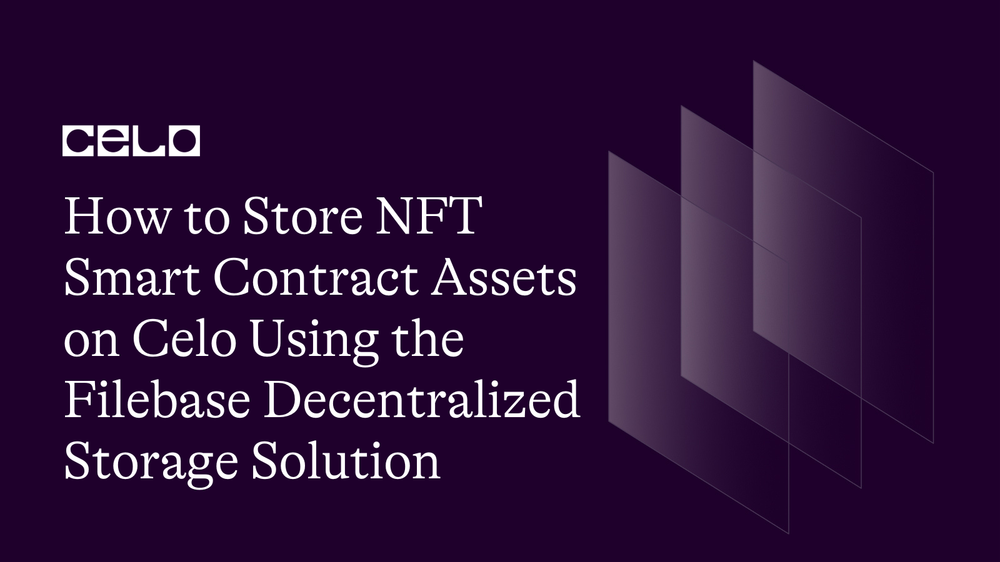

## Introduction

One of the objectives of web3 is complete decentralization. Users of different web3 products often think this only applies to the financial and economic aspects of human lives. Interestingly, web3 is beyond that. Complete decentralization refers to the collective ownership of all resources, including information.

The centralization of information is generally associated with the loss or compromise of information. If Google data stations were to be experiencing downtime, causing Google Drive and other products to be unavailable, users would be unable to access their data temporarily or permanently.

Decentralized storage is no longer a concept but a reality. It guarantees the safety and security of the information stored. The possibilities of this kind of technological advancement are endless. Decentralized storage is especially useful for Non-Fungible Tokens (NFTs), which is the focus of this guide.

We will build and deploy an NFT smart contract and safeguard its assets with FileBase, a decentralized storage provider.

## Decentralized Storage in Web3

Decentralized storage is a peer-to-peer network of operators for storing and sharing files. With storage nodes spread across different geographical zones, the information stored is guaranteed to be safe, secure, and available.

A smart contract is a type of decentralized storage system. As part of the Ethereum network, smart contracts are built only to store essential information with value like token balances and transactional logic. In short, smart contracts do not handle aren’t enormous data.

## InterPlanetary File System (IPFS)

The way IPFS works is similar to how the blockchain works. The blockchain is a collection of blockchain nodes, and so also is IPFS. It is a collection of storage nodes that enable the storage and safekeeping of information. It is a key element of decentralized storage.

IPFS is a better option than traditional file storage systems because the files are stored on multiple computers on the network. Another benefit of using IPFS is how it prevents undue file duplication when a file is uploaded, a hash of the content is used to generate a content ID (CID). Hence, a file with the same content will produce the same hash.

## FileBase, A Reliable Web3 Storage System

FileBase is an IPFS pinning service. It allows you to pin files to IPFS in a secure, redundant, and performant manner across diverse geographic locations. IPFS works by breaking down information into small pieces spread across different geographical locations such that if a piece of the information is lost, it can be reconstructed. This process is called data sharding.

One of the benefits of FileBase is that it provides you with 3x redundancy, which isn’t provided by many decentralized storage systems. Your information is safe, secure, and globally available.

## Storing the NFTs on FileBase

[FileBase](http://filebase.com) has different use cases for NFTs. You can use FileBase to store the NFTs bought on a marketplace to prevent any mishaps arising from a hack or downtime, causing users to lose their NFT.
This guide explains how to build and deploy your NFTs and safeguard them with FileBase.

## Building the NFT Smart Contract

We will be building a simple NFT contract using the ERC-721 standard. This contract enables the owner to mint a proof of participation NFT to participants of a web3 hackathon. After completing the competition, an expensive NFT is sent to the participants’ addresses.

This contract also allows the contract owner to pass in the URI of the special NFT, which would be the URL to the NFT image saved on FileBase.

This section explains the workings of the contract, while the next section explains how to store the image of the NFT and how to mint the NFTs using the URL generated on FileBase.

```solidity
//SPDX-License-Identifier:UNLICENSED
pragma solidity ^0.8.0;

import "https://github.com/OpenZeppelin/openzeppelin-contracts/blob/master/contracts/token/ERC721/extensions/ERC721URIStorage.sol";
import "https://github.com/OpenZeppelin/openzeppelin-contracts/blob/master/contracts/utils/Counters.sol";

contract POAPContract is ERC721URIStorage{
    using Counters for Counters.Counter;
    Counters.Counter private _tokenIds;

    address public owner;

    constructor(string memory name, string memory symbol) ERC721(name, symbol){
        owner = msg.sender;
    }

    modifier onlyOwner() {
        require(owner == msg.sender);
        _;
    }

    function awardAttendee(address to, string memory tokenURI) public onlyOwner{
        uint newItemId = _tokenIds.current();
        _mint(to, newItemId);
        _setTokenURI(newItemId, tokenURI);
        _tokenIds.increment();
    }

}
```

It is assumed that the developer is an intermediate-level developer and is familiar with fundamental concepts of smart contract development.

## Steps for Building the NFT Smart Contract

Specify the licensing style as well as the version of the compiler. In this case, the contract is unlicensed, and any solidity compiler version above 0.8.0 is fine.

Import Openzeppelin’s ERC721URIStorage and Counters contract. These contracts allow us to create a Non-Fungible Token contract, pass in the URI of the NFT, and keep count of how many NFTs have been minted.

Declare the constructor with a name and a symbol. Since we inherited ERC721URIStorage, the constructor for the ERC721 contract must also be initialized with the name and symbol.
Create a modifier, onlyOwner, which allows only the owner/deployer of the contract to mint the NFT.

Finally, create the awardAttendee function, which takes in the address of the attendee and the URI as parameters. This function mints the NFT, attach the URI and increments the token counter.
We will hold off on deploying this contract till we completely figure out how to work with FileBase.

## Storing the NFT on FileBase

To store any NFT on FileBase, you must register either a free or a paid account on the platform. A free FileBase account will do just fine for this tutorial. Visit their [sign-up page](http://filebase.com/signup) to register. Fill in the information required, including your first and last name, email address, and password.


If your verification was successful, you will be prompted to login and your dashboard will appear.


Go to buckets on the left side of the screen. There are 0 buckets since it is a new account. Click on Create Bucket.

A modal should pop up asking for the bucket name and the storage network. Since the Smart contract is named POAP, I have decided to use poap-guide as the bucket name and IPFS as the storage network. We should now have a new bucket in the dashboard.

Click on the bucket name, and begin uploading the files using the upload button provided on the interface. Once uploaded, click on one of the objects/images, and you should be taken to the object overview, where you will see a couple of links, including the IPFS gateway URL, which can be used to access the NFT image.


The following images are the NFT images used for this project. [Rare-NFT1](https://ipfs.filebase.io/ipfs/QmPZmVVcANANaV5mt88iiTPFFpwnN5hcwtEHhT4JKtPZ8s), [Rare-NFT2](https://ipfs.filebase.io/ipfs/QmVjz5WCvaJMMxvtzLgWSCRb8TGaTx4cvMe4cUmGihcBKb), and [Rare-NFT3](https://ipfs.filebase.io/ipfs/QmSy2NUWTJFgFkctMBCBNpnLzVJPWUiViDbBzVkBTJTYVA).


We will use these URLs as the URI while minting the POAP NFTs. This is examined in the next chapter.

## Minting the NFT Using the Smart Contract and FileBase

To mint the NFTs, you need to deploy the NFT contract. Once deployed, the contract owner can call the awardAttendee function passing in the receiver's address and the link to one of the NFTs stored on FileBase using the IPFS gateway URL.

The recipient can verify that he owns an NFT on the blockchain and check for the image.

## Conclusion

FileBase is a web3 Storage-As-A-Service provider which provides a safer and more secure way to store information. It is an aggregation service that gives users access to multiple IPFS services, a feature that makes it the favorite. FileBase is one of the best options to safeguard your NFT asset for the contract you deployed or from different NFT marketplaces. You can find the codebase for this article [here](https://github.com/johnfawole/Proof-of-Attendance-NFT-Smart-Contract).

## NEXT STEP

Filebase is not the only decentralized storage solution in Web3. Having gone through this tutorial, you can also check out [Arweave](https://docs.celo.org/blog/tutorials/how-to-build-and-deploy-flashloan-contracts-on-celo-with-aave) and Filecooin. Have fun building.

## About the Autor

John Fawole is a blockchain technical writer and Solidity developer; connect with him on [LinkedIn](https://www.linkedin.com/in/johnfawole/).
