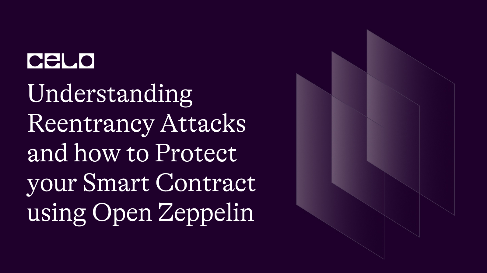

## Introduction

Reentrancy attacks are a common security vulnerability in smart contracts, particularly those that handle Ether transactions on the Ethereum blockchain. This tutorial will provide a detailed explanation of reentrancy attacks, demonstrate a vulnerable smart contract, and show you how to use the OpenZeppelin library to protect your smart contract from such attacks.

In this tutorial, we will explain reentrancy attacks, and provide a step-by-step guide for implementing OpenZeppelin safeguards.

[Full source code](https://github.com/4undRaiser/reentrancy-repo)

## Prerequisites

To follow this tutorial, you will need the following:

- Basic understanding of Solidity and smart contracts
- A Development Environment Like Remix.
- Access to the OpenZeppelin library
- The celo Extension Wallet.

## A Simple Vulnerable Contract

Let's take a look at a simple vulnerable smart contract.

```solidity
 // SPDX-License-Identifier: MIT
pragma solidity ^0.8.0;

contract VulnerableContract {
    mapping(address => uint256) public balances;

    function deposit() public payable {
        balances[msg.sender] += msg.value;
    }

    function withdraw(uint256 amount) public {
        require(balances[msg.sender] >= amount, "Insufficient balance");
        (bool success, ) = msg.sender.call{value: amount}("");
        require(success, "Withdrawal failed");
        balances[msg.sender] -= amount;
    }
}
```

The contract above allows users to deposit and withdraw Ether. However, it is vulnerable to reentrancy attacks. The `withdraw()` function sends Celo before updating the user's balance, which allows an attacker to call the function repeatedly and drain the contract's funds.

### Attack Simulation

Now, let's create a malicious contract to simulate a reentrancy attack:

```solidity
// SPDX-License-Identifier: MIT
pragma solidity ^0.8.0;

import "./VulnerableContract.sol";

contract MaliciousContract {
    VulnerableContract public vulnerableContract;

    constructor(address _vulnerableContractAddress) {
        vulnerableContract = VulnerableContract(_vulnerableContractAddress);
    }

    function attack() public payable {
        require(msg.value > 0, "No funds sent");
        vulnerableContract.deposit{value: msg.value}();
        vulnerableContract.withdraw(msg.value);
    }

    function drain() public {
        payable(msg.sender).transfer(address(this).balance);
    }

    receive() external payable {
        if (address(vulnerableContract).balance > 0) {
            vulnerableContract.withdraw(msg.value);
        }
    }
}
```

In the malicious contract, we create a fallback function (receive) that is executed whenever the contract receives Celo. When the `withdraw()` function is called from the vulnerable contract, it triggers the fallback function, which then calls `withdraw()` again, leading to a reentrancy attack.

## Protecting Your Smart Contract With OpenZeppelin

OpenZeppelin provides a library of reusable and secure smart contract components, including the `ReentrancyGuard` contract that protects against reentrancy attacks.

To use OpenZeppelin, you have to import the library into your contract:

```solidity
pragma solidity ^0.8.0;

import "https://github.com/OpenZeppelin/openzeppelin-contracts/blob/v4.3.0/contracts/security/ReentrancyGuard.sol";

contract SecureContract is ReentrancyGuard {
    mapping(address => uint256) public balances;

    function deposit() public payable {
        balances[msg.sender] += msg.value;
    }

    function withdraw(uint256 amount) public nonReentrant {
        require(balances[msg.sender] >= amount, "Insufficient balance");
        (bool success, ) = msg.sender.call{value: amount}("");
        require(success, "Withdrawal failed");
        balances[msg.sender] -= amount;
    }
}
```

In the `SecureContract`, we inherit from `ReentrancyGuard`, provided by OpenZeppelin. Then, we add the `nonReentrant` modifier to the `withdraw()` function. This modifier ensures that the function cannot be re-entered while it is still being executed. This effectively prevents reentrancy attacks.

## Deployment

To deploy our smart contract successfully, we need the celo extention wallet which can be downloaded from [here](https://chrome.google.com/webstore/detail/celoextensionwallet/kkilomkmpmkbdnfelcpgckmpcaemjcdh?hl=en)

Next, we need to fund our newly created wallet which can done using the celo alfojares faucet [Here](https://celo.org/developers/faucet)

You can now fund your wallet and deploy your contract using the celo plugin in remix.

## Testing The Secure Contract

Now let's test the `SecureContract` against reentrancy attacks:

1. Deploy the `SecureContract`.
2. Deploy the `MaliciousContract` with the address of the `SecureContract`.
3. Call the `attack()` function on the `MaliciousContract` with some Celo.

You should notice that the reentrancy attack is no longer successful. The `nonReentrant` modifier in the `SecureContract` prevents the `MaliciousContract` from calling the `withdraw()` function repeatedly.

## Conclusion

In this tutorial, we have explored reentrancy attacks and their implications for smart contracts. We have also demonstrated how to protect your smart contract from such attacks using the OpenZeppelin library.

In the import statement, we are using the URL of the OpenZeppelin ReentrancyGuard contract hosted on GitHub. Note that the URL contains a specific version (v4.3.0) of the contract to ensure compatibility. Make sure to check the latest version of OpenZeppelin contracts on GitHub and update the URL accordingly.

By using OpenZeppelin's ReentrancyGuard, you can effectively secure your smart contracts and ensure they are not vulnerable to reentrancy attacks.

## Next Steps

I hope you learned a lot from this tutorial. Here are some relevant links that would aid your learning further.

- [Celo Docs](https://docs.celo.org/)
- [Solidity Docs](https://docs.soliditylang.org/en/v0.8.17/)

## About the author

I'm Jonathan Iheme, A full stack block-chain Developer from Nigeria.

Thank You!!
