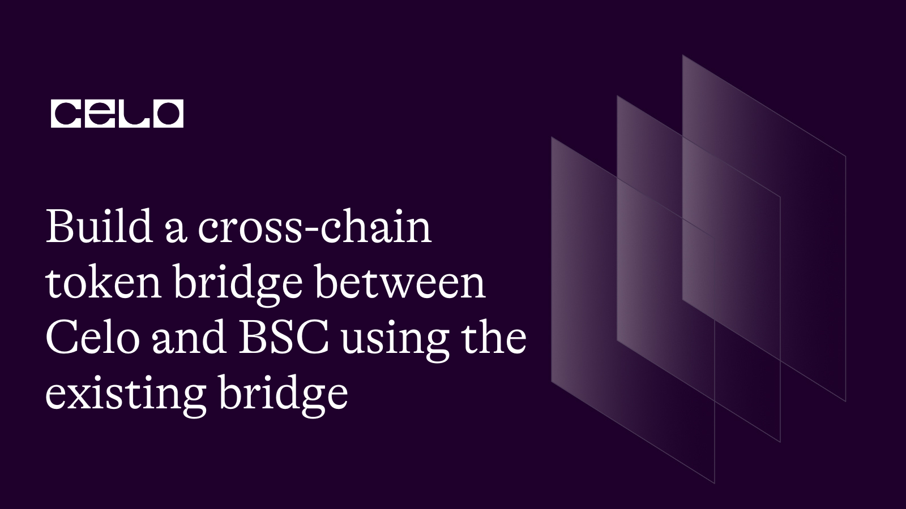
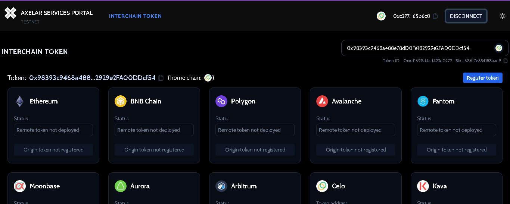
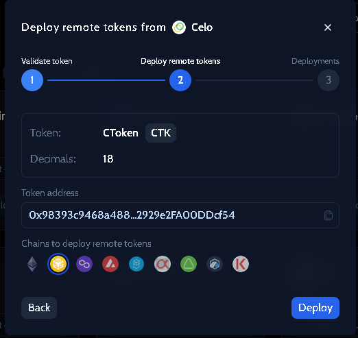
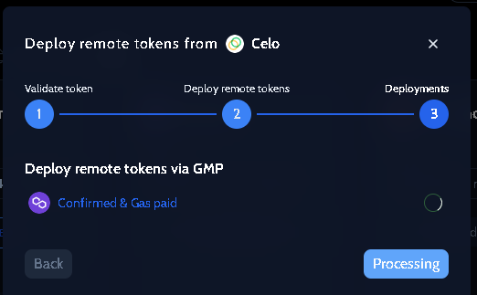

## Introduction

Like separate containers, blockchains are isolated from one another even though some are forks of another. The seclusion greatly hinders communication among them. For example, the $Celo coin in your wallet is not compatible with the $BNB coin on the Binance Smart Chain and vice versa. A well-experimented solution to achieving interoperability today is bridging assets from one network to another by creating a copy of an asset of a blockchain on other networks.
In this guide, I will show you how to replicate utilities from the Celo blockchain on Binance Smart Chain.

## Prerequisites​

- You must be at least an intermediate in smart contract development using Solidity language.
- Experience working with Javascript.
- Experience working with Typescript will be needed.
- Using hardhat for smart contract development.

## Requirements​

- You need a development environment - IDE. I recommend VSCode.
- Install Node version >=14.0.0.

**Concept of bridging/cross-chain bridging**

Bridging tokens across chains is a system of replicating existing and creating new tokens or asset utilities across different compatible or incompatible blockchain networks. Bridging utilities between unrelated chains such as Celo -> Solana involves extra tasks compared to networks with similar architectures such as Celo -> Binance Smart Chain.

- Achieving interoperability is a common goal of cross-chain dApps. That is, making blockchains communicate with one another. With this solution, we can expand the network of users for dApps deployed on the Celo blockchain through the deployment of utilities that enable the Binance Smart Chain users to interact with the same DApp on the BSC blockchain.

- At the time of creating this post, the cost of interacting with the Celo blockchain is relatively lower than that of the BNB Chain. This might be a good reason for bridging from the latter to the former.

There are two popular kinds of cross-chain bridging.

1. Centralized bridge

This is a kind of bridging system often used by centralized exchanges. Using APIs, users mostly deposit assets to a large pool, and the corresponding assets on the destination chain are sent out from another pool. One major disadvantage of this type is that it is controlled by a central body which is not really what most people want.

2. Decentralized bridge

This is a method of using smart contracts and a relayer to bridge utilities between or among blockchains. You don't have to call any external API. Smart contracts are deployed on both the source and destination blockchains and a relayer facilitates timely communication between the networks by listening to events and triggering actions on both chains.
To better explain the concept, in the next section, we will programmatically explore how to build a cross-chain bridge.

**Steps to building a cross-chain bridge**

In this section, we will explore the smart contract and the backend part excluding the front-end. We will create a CLI DApp. Everything will run in the terminal. I previously made a tutorial that will help you create a cross-chain dApp from the scratch **[here](https://docs.celo.org/blog/tutorials/build-a-crosschain-token-bridge-between-Celo-and-BSC-from-the-scratch)**. In this guide, we will leverage existing bridge protocol - **[axelar](https://docs.axelar.dev/)** to integrate compatibility feature with BNB Chain

Before we proceed to the coding aspect, let's set up a hardhat environment. Please refer to **[this article](https://docs.celo.org/blog/tutorials/getting-started-on-celo-with-hardhat)** and **[this](https://docs.celo.org/blog/tutorials/advance-hardhat-configuration-on-celo-using-plugins)** for comprehensive tutorials on how to use hardhat.

- Create a project.

We are using a template **[here](https://github.com/bobeu/Build-a-cross-chain-token-bridge-between-Celo-and-BSC-from-the-scratch)**.

Clone the project, and install the dependencies.

```bash
  git clone https://github.com/bobeu/Build-a-cross-chain-token-bridge-between-Celo-and-BSC-from-the-scratch.git
```

```bash
  cd Build-a-cross-chain-token-bridge-between-Celo-and-BSC-from-the-scratch/backend
```

```bash
  yarn
```

If all steps is done correctly, installation should be successful.

**Smart contract**

Beforehand, let's examine how the token bridge will work. You want to have a clear picture of what to do before proceeding to write the code. As a practice, I will be using the testnets: Celo Alfajores and Binance smart chain testnet for deployments.
I have selected to integrate the **[satelite bridge](https://satellite.money/)** on Axelar network mentioned **[here](https://docs.celo.org/protocol/bridge#token-bridges)**. The satellite bridge has a [GUI](https://testnet.services.axelar.dev/) that facilitates fast cross-chain token movement. There are options to use existing tokens or create new ones. I have selected the interchain GUI that allows us to create custom assets, and run the transfer against testnets.

**Steps**

- Deploy a token contract on the Celo testnet - `CKT`. This will be the token origin chain. You may set the total supply or mint the token later.

- Get the contract address, and register the asset using the [interchain GUI](https://testnet.services.axelar.dev/). Select to deploy on BNB Chain.

- Retrieve the token ID.

- Update the token ID on the origin chain.

- Approve the [linker](https://docs.axelar.dev/dev/send-tokens/overview) contract to spend from the wallet.

- Run the `sendToken` function to complete the bridge process.

1. Deploy the token contract

- The Axelar bridge contract implements `IInterchainTokenLinker.sendToken` which we will call in our contracts.

- In the constructor, we set the admin and the linker contract.

> Note: Axelar linker contract on all VMs is set to "0x7cD2E96f5258BB825ad6FC0D200EDf8C99590d30"

- The `executeBridge` function does two things when invoked:
  - Approves the amount to spend in the callers' s balances.
  - Invokes the `sendToken` function on the linker contract.

```ts
  // SPDX-License-Identifier: MIT
  pragma solidity 0.8.18;

  import '@openzeppelin/contracts/token/ERC20/ERC20.sol';

  interface IInterchainTokenLinker {
    function sendToken(
      bytes32 tokenId,
      string calldata destinationChain,
      bytes calldata to,
      uint256 amount
    ) external payable;
  }

  contract CTokenDApp is ERC20 {
    IInterchainTokenLinker public immutable linker;
    bytes32 public tokenId;
    address public admin;

    constructor() ERC20('CToken', 'CTK') {
      admin = msg.sender;
      // token linker on all VMs 0x7cD2E96f5258BB825ad6FC0D200EDf8C99590d30
      linker = IInterchainTokenLinker(0x7cD2E96f5258BB825ad6FC0D200EDf8C99590d30);
    }

    function setTokenId(bytes32 _tokenId) public {
      require(msg.sender == admin, "Not an admin");
      tokenId = _tokenId;
    }

    function requestFreeToken() public {
      uint amount = 1000 * (10 ** 18);
      _mint(msg.sender, amount);
    }

    function executeBridge(string calldata destinationChain, uint256 amountToBridge) payable external {
      require(amountToBridge > 0, "No request");
      if(tokenId == 0) {
        revert("Invalid tokenID! please configure and set interchain token and Id first.");
      }
      require(msg.value > 0, "Sending interchain requires a native gas payment.");
      uint bal = balanceOf(msg.sender);
      require(bal > 0 && bal >= amountToBridge, "CTK: Insufficient balance");

      address linkerAddress = address(linker);
      _approve(msg.sender, linkerAddress, amountToBridge);
      linker.sendToken{value: msg.value}(
        tokenId,
        destinationChain,
        abi.encode(msg.sender),
        amountToBridge
      );
    }
  }

```

2. Get the contract address.

- Compile the contract.

```bash
  npx hardhat compile
```

- Deploy to the origin chain i.e Alfajores.

Create the file - `scripts/deployToken.ts` and populate the code that deploys the contract.

```ts scripts/deployToken.ts
import { ethers } from "hardhat";

async function main() {
  const CTokenDApp = await ethers.getContractFactory("CTokenDApp");
  const cToken = await CTokenDApp.deploy();
  await cToken.deployed();

  console.log(`CTokenDApp deployed to ${cToken.address}`);
}
main().catch((error) => {
  console.error(error);
  process.exitCode = 1;
});
```

Deploy and copy the contract address.

```bash
  npx hardhat run scripts/deployToken.ts --network Alfajores
```

3. Register the token on [Axelar](https://testnet.services.axelar.dev/).

- Visit the [Axelar interface](https://testnet.services.axelar.dev/).
- Connect your wallet. A section will pop up asking to verify the already deployed token or create a new one. Paste the contract address in the first column, and the page will transit to a new one. Be sure to switch to Alfajores if you're on a different network.



- A token ID will be generated for you. Copy it to the clipboard. Click the `Register token` button at the top right side. The image below shows the token is validated.


- Select the destination chain you want to simultaneously deploy to. In this case, BNB Chain. You need to have at least 10 test \$Celo for this transaction. Visit the [faucet](https://faucet.celo.org), and log in using your GitHub account to get more tokens.



- The confirmation page will pop up. Wait for the process to complete.



4. Update the token Id on the origin chain. Copy the token Id if you forget.

- Create a new script `scripts/setTokenId.ts`. Paste the following code.

```ts scripts/setTokenId.ts
import { ethers } from "hardhat";
import { providers } from "./network";
import { assert } from "chai";

async function main() {
  const { celoProvider, bscProvider, mumbaiProvider } = providers();

  // Set the token Id here
  const tokenId =
    "0xe4e3dcf5cf24b55fb6ed24d67d7e21a7d520de10199e324c3a9dccce600817e8";

  const signer = new ethers.Wallet(
    String(process.env.PRIVATE_KEY),
    celoProvider
  );

  const contractAddress = "0xD79903f0b5A351F31adFc2B3FFF41CeAdA3fa0a0";

  console.log(
    `Retreiving CTokenDApp deployed to ${contractAddress} on Alfajores`
  );

  const CTokenDApp = await ethers.getContractAt(
    "CTokenDApp",
    contractAddress,
    signer
  );
  const cToken = await CTokenDApp.deployed();

  try {
    const tx = await cToken.setTokenId(tokenId);
    await tx.wait(2).then(async (receipt: { transactionHash: any }) => {
      console.log(`Hash: ${receipt.transactionHash}`);
      const newTokenId = await cToken.tokenId();
      console.log(`New Token Id  ${newTokenId}`);
      assert.equal(newTokenId, tokenId, "Token Id not set");
    });
  } catch (error) {
    console.log("SetTpkenID error: ", error);
  }
}
main().catch((error) => {
  console.error(error);
  process.exitCode = 1;
});
```

- Run the script. This will update the token Id on the origin chain.

> Note: The destination chain will have a different token Id generated on the origin chain.

```bash
  npx hardhat run scripts/setTokenId.ts
```

5. Approve the linker contract, and invoke the `sendToken()`.

The last two steps will be performed in one call. Create a new script `scripts/runBridge.ts`. Paste the code below.

> Note: You need to have enough test BNB to be able to run this successfully. Depending on the contract size, 1 test $Celo can run as many transactions but you are likely to run out of gas running 1-tenth of the same transactions using test $BNB. It is advisable to get as much BNB as you can. Alternatively, I exported the Polygon Mumbai chain provider in the `network.ts` file. You can switch to using Mumbai if you have trouble with BNB Chain. Although Polygon is cheaper than Binance Chain but more expensive when compared to Celo.

```ts scripts/runBridge.ts
import { ethers } from "hardhat";
import { providers } from "./network";
import { Transaction } from "ethers";
import Web3 from "web3";

async function main() {
  const mode = false;
  const { celoProvider, bscProvider } = providers();

  const signer_celo = new ethers.Wallet(
    String(process.env.PRIVATE_KEY),
    celoProvider
  );
  const signer_bsc = new ethers.Wallet(
    String(process.env.PRIVATE_KEY),
    bscProvider
  );

  // Replace the contract address with yours
  const contractAddress = "0xD79903f0b5A351F31adFc2B3FFF41CeAdA3fa0a0";

  // Replace the contract address with yours
  const bscToken_address = "0x020d860D9028a6024e143ab920b3b0642E079F04";

  console.log(
    `Retreiving CTokenDApp deployed to ${contractAddress} on Alfajores`
  );

  const CTokenDApp = await ethers.getContractAt(
    "CTokenDApp",
    contractAddress,
    signer_celo
  );
  const cToken = await CTokenDApp.deployed();

  console.log(
    `Retreiving CTokenDApp deployed to ${bscToken_address} on Mumbai`
  );
  const CTokenDApp_bsc = await ethers.getContractAt(
    "CTokenDApp",
    bscToken_address,
    signer_bsc
  );
  const cToken_bsc = await CTokenDApp_bsc.deployed();

  if (mode) {
    const tx = await cToken.requestFreeToken();
    await tx.wait(2).then(async (receipt: { transactionHash: any }) => {
      console.log(`Hash: ${receipt.transactionHash}`);
      const balance = cToken.balanceOf(signer_celo.address);
      console.log(
        `Balance of  ${signer_celo.address} : ${Web3.utils.fromWei(
          (await balance).toString()
        )}`
      );
    });
  } else {
    const code1 = await celoProvider.getCode(contractAddress);
    const code = await mumbaiProvider.getCode(bscToken_address);
    const isCodeThesame = code === code1;
    console.log(`isCodeThesame: ${isCodeThesame}`);
    // console.log(`code1: ${code1}`);
    // console.log(`code: ${code}`);

    const bal = await signer_bsc.getBalance();
    const bal_celo = await signer_celo.getBalance();

    console.log(
      `Balance of ${signer_bsc.address} on BSC : ${Web3.utils.fromWei(
        bal.toString()
      )}`
    );
    console.log(
      `Balance of ${signer_celo.address} on Celo : ${Web3.utils.fromWei(
        bal_celo.toString()
      )}`
    );

    const amount = "1000000000000000000000";
    const value = "300000000000000000";
    try {
      const tx = await cToken.executeBridge("MUMBAI", amount, { value: value });
      console.log("TX: ", tx);

      await tx.wait(1).then(async (rec: any) => {
        console.log("Hash:", rec.transactionHash);
        const balance = await cToken_bsc.balanceOf(signer_bsc.address);
        console.log(
          `Balance of  ${signer_bsc.address} : ${Web3.utils.fromWei(
            (await balance).toString()
          )}`
        );
      });
    } catch (error) {
      console.log("Trx Errored: ", error);
    }
  }
}
main().catch((error) => {
  console.error(error);
  process.exitCode = 1;
});
```

- First, toggle the `mode` variable to `true` to request for test token.

- Toggle back to `false`, then run the `executeBridge` function. You should now see the `CTK` amount you bridged reflected on the destination chain.
- Run the script

```bash
  npx hardhat run scripts/runBridge.ts
```

- Inspect the log in the terminal

The complete code for this tutorial can be found **[on the github](https://github.com/bobeu/build-a-cross-chain-token-bridge-between-Celo-and-BSC-using-the-existing-bridge)**.

## Conclusion​

We have learned:

- What bridges are.
- How it works using one of the existing bridges.
- Code example backing up the theory.

## What next?

Learn to build your own dream Dapp by visiting **[Celo tutorials website](https://docs.celo.org/tutorials)**.

Should you have questions, join us on **[discord](https://chat.celo.org/)**.

## About the Author​

**[Isaac Jesse](mailto:dev.qcontrib@gmail.com)**, discord - [Bobelr#8524](https://discord.gg/Bobelr#8524) is a blockchain developer, content creator, an ambassador, developer ambassador, and a blockchain enthusiast since 2016. He has worked and contributed to several blockchain projects such as Dxchain, AtomicWallet, Soullib, EOSCafe, Appics, Algorand, etc.

## References​

- [Celo developers resources](https://docs.celo.org/developer/)
- [Source code](https://github.com/bobeu/build-a-cross-chain-token-bridge-between-Celo-and-BSC-using-the-existing-bridge)
- [Axelar](https://docs.axelar.dev/)
