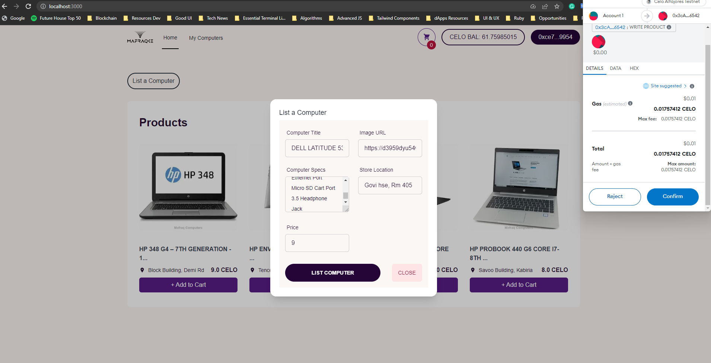

## Introduction

In this tutorial, you will learn how to how to build a computer retail store using celo composer.

## Prerequisites​

To start building, you’ll need a basic understanding of web development, Node (v16), yarn, and Git.

- [Node (v16)](https://nodejs.org/en/), [NVM](https://github.com/nvm-sh/nvm)
- [Yarn](https://classic.yarnpkg.com/en/)
- [Git](https://git-scm.com/)

## Celo Composer

The easiest way to get started with Celo Composer is using `@celo/celo-composer`
. This CLI tool enables you to quickly start building dApps on Celo for multiple frameworks including React, React Native (w/o Expo), Flutter, and Angular. You can create the dApp using the default Composer templates provided by Celo. In our case, we will work with react, specifically NextJS. The stack included in celo composer:

- [NextJS](https://nextjs.org/) - React framework
- [Typescript](https://www.typescriptlang.org/)
- [React Celo](https://github.com/celo-org/react-celo)
- [TailwindCSS](https://tailwindcss.com/) for styling
- [Hardhat](https://hardhat.org/) Smart contract development environment
- [Solidity](https://docs.soliditylang.org/en/v0.8.17/structure-of-a-contract.html#enum-types) Smart Contract Language

## Getting Started

1. Bootstrap the application using this Celo Composer command.

```bash
npx @celo/celo-composer create
```

2. Select **React** framework(NextJS)


3. Select **react-celo** as the web3 library


4. Select **hardhat** for the smart contract framework.


5. Select **No** for subgraph


6. Give a name to your project and you are done.


cd into your app then install the dependencies required in the project. In the root directory, run

```bash
yarn

//or

npm install
```

---

## Creating our Smart Contract

First, we are going to build our smart contract and with this, you will be required to have a bit of knowledge of Solidity. To learn more about solidity contracts and the structures of a contract you can check out [this link](https://docs.soliditylang.org/en/v0.8.17/structure-of-a-contract.html).

In the hardhat directory, navigate to contracts and create a new file then name it `computerMarketplace.sol`. Delete the other boilerplate files.

The completed code Should look like this.

```solidity
// SPDX-License-Identifier: MIT

pragma solidity >=0.7.0 <0.9.0;

/*

Interface that allows contract to transfer and recieve ERC20 tokens

*/
interface IERC20Token {
    function transfer(address, uint256) external returns (bool);

    function approve(address, uint256) external returns (bool);

    function transferFrom(address, address, uint256) external returns (bool);

    function totalSupply() external view returns (uint256);

    function balanceOf(address) external view returns (uint256);

    function allowance(address, address) external view returns (uint256);

    event Transfer(address indexed from, address indexed to, uint256 value);
    event Approval(
        address indexed owner,
        address indexed spender,
        uint256 value
    );
}

/*
Beginning of contract
*/
contract ComputerMarketplace {
    uint internal productsLength = 0;
    // address internal cUsdTokenAddress = 0x874069Fa1Eb16D44d622F2e0Ca25eeA172369bC1;
    address internal celoTokenAddress =
        0xF194afDf50B03e69Bd7D057c1Aa9e10c9954E4C9;

    address owner = msg.sender;

    /*
    Product template struct
    */

    struct Product {
        address payable owner;
        string computer_title;
        string image_url;
        string computer_specs;
        string store_location;
        uint price;
        uint sold;
    }

    // Boolean for non reentrant function

    bool private locked = false;

    /*
       Modifier making functions non reentrant by changing locked boolean for duration of transaction so that on reentry it does not pass the "not locked requirement"
    */
    modifier nonReentrant() {
        require(!locked, "Reentrant call.");
        locked = true;
        _;
        locked = false;
    }
    modifier Onlyowner() {
        require(msg.sender == owner);
        _;
    }

    //Setting Price limit for listings
    uint256 constant MAX_PRICE = 100000000000000000000;

    //Mapping for prodict indices to product struct
    mapping(uint => Product) internal products;

    //mapping users addresses to the indices for the product listings
    mapping(address => uint) internal productsByUser;

    //Max products for a seller can list
    uint internal maxProductsPerUser = 10;

    //Events for product Listing and delisting
    event ProductCreated(
        address indexed owner,
        string computer_title,
        string image_url,
        string computer_specs,
        string store_location,
        uint price
    );
    event ProductDeleted(
        address indexed owner,
        string computer_title,
        string image_url
    );
    event ProductSold(
        address indexed owner,
        string computer_title,
        string image_url
    );

    /*
    Function to change max products per user

    ->Requirement: Only the owner can set this limit
    */
    function setMaxProductsPerUser(uint _maxProductsPerUser) public Onlyowner {
        require(
            _maxProductsPerUser > 0,
            "Maximum products per user must be greater than 0"
        );
        maxProductsPerUser = _maxProductsPerUser;
    }

    function getProductsLength() public view returns (uint) {
        return (productsLength);
    }

    /*
    Function to add product listing, Emits listing event "Product Created"

    ->Requirements
    *Non of the fields of data entered should be a zero
    *Price field data should also be below max price
    *Seller should no have exceeded platform limit
    */

    function writeProduct(
        string memory _computer_title,
        string memory _image_url,
        string memory _computer_specs,
        string memory _store_location,
        uint _price
    ) public {
        require(
            bytes(_computer_title).length > 0,
            "Computer title cannot be empty"
        );
        require(bytes(_image_url).length > 0, "Image URL cannot be empty");
        require(
            bytes(_computer_specs).length > 0,
            "Computer specs cannot be empty"
        );
        require(
            bytes(_store_location).length > 0,
            "Store location cannot be empty"
        );
        require(_price > 0 && _price <= MAX_PRICE, "Invalid product price");

        require(
            productsByUser[msg.sender] < maxProductsPerUser,
            "Maximum products per user reached"
        );

        uint _sold = 0;
        products[productsLength] = Product(
            payable(msg.sender),
            _computer_title,
            _image_url,
            _computer_specs,
            _store_location,
            _price,
            _sold
        );

        productsLength++;
        productsByUser[msg.sender]++;

        emit ProductCreated(
            msg.sender,
            _computer_title,
            _image_url,
            _computer_specs,
            _store_location,
            _price
        );
    }

    /*
     Function allowing buyers to access data on a given product
     */
    function readProduct(
        uint _index
    )
        public
        view
        returns (
            address payable,
            string memory,
            string memory,
            string memory,
            string memory,
            uint,
            uint
        )
    {
        return (
            products[_index].owner,
            products[_index].computer_title,
            products[_index].image_url,
            products[_index].computer_specs,
            products[_index].store_location,
            products[_index].price,
            products[_index].sold
        );
    }

    /*
       Function allowing buyers to buy a product on the platform
       Increments the product sold counter for the number of total units sold
    */


    function buyProduct(uint _index) public payable nonReentrant {
        require(msg.value == products[_index].price);

        uint allowance = IERC20Token(celoTokenAddress).allowance(
            msg.sender,
            address(this)
        );
        require(
            allowance >= products[_index].price,
            "Celo token allowance not enough"
        );

        require(
            IERC20Token(celoTokenAddress).transferFrom(
                msg.sender,
                products[_index].owner,
                products[_index].price
            ),
            "Celo token transfer failed"
        );


        products[_index].sold++;

        emit ProductSold(
            products[_index].owner,
            products[_index].computer_title,
            products[_index].image_url
        );
    }

    function getProductsByUser(
        address _user
    ) public view returns (Product[] memory) {
        uint count = 0;
        for (uint i = 0; i < productsLength; i++) {
            if (products[i].owner == _user) {
                count++;
            }
        }

        Product[] memory ownedProducts = new Product[](count);
        uint j = 0;
        for (uint i = 0; i < productsLength; i++) {
            if (products[i].owner == _user) {
                ownedProducts[j] = products[i];
                j++;
            }
        }

        return ownedProducts;
    }

    /*
      Function a seller uses to delete a product

      ->Requirements
      *index of product must be valid ie; within the number of products listed
      * Sender of the call must be the owner of the product
    */
    function deleteProduct(uint _index) public {
        require(_index < productsLength, "Product index out of range");

        // Make sure that the caller is the owner of the product
        require(
            products[_index].owner == msg.sender,
            "Only the owner can delete their products"
        );

        // Delete the product at the specified index
        for (uint i = _index; i < productsLength - 1; i++) {
            products[i] = products[i + 1];
        }
        delete products[productsLength - 1];
        productsLength--;

        // Update the product count for the owner
        productsByUser[msg.sender]--;
    }
}

```

---

## Smart Contract breakdown

First, we declared our license and the solidity version.

```solidity
// SPDX-License-Identifier: MIT
pragma solidity ^0.8.0;
```

## Define an ERC20 Token Contract

The ERC-20 introduces a standard for Fungible Tokens, in other words, they have a property that makes each Token be exactly the same (in type and value) as another Token. For example, an ERC-20 Token acts just like the ETH, meaning that 1 Token is and will always be equal to all the other Tokens.

```solidity
interface IERC20Token {
    function transfer(address, uint256) external returns (bool);

    function approve(address, uint256) external returns (bool);

    function transferFrom(address, address, uint256) external returns (bool);

    function totalSupply() external view returns (uint256);

    function balanceOf(address) external view returns (uint256);

    function allowance(address, address) external view returns (uint256);

    event Transfer(address indexed from, address indexed to, uint256 value);
    event Approval(
        address indexed owner,
        address indexed spender,
        uint256 value
    );
}
```

The code represents an [interface](https://www.alchemy.com/overviews/solidity-interface) which is used to interact with other contracts. They define a set of functions and events that a contract must implement to be considered compatible with other contracts that use the interface.

The interface defines six functions that ERC-20 tokens must have:

- **transfer:** allows the owner of the token to send a specified amount of tokens to another address.

- **approve:** allows the owner of the token to give permission to another address to transfer a specified amount of tokens on their behalf.

- **transferFrom:** allows an address that has been approved to transfer a specified amount of tokens on behalf of the owner of the token.

- **totalSupply:** returns the total number of tokens in circulation.

- **balanceOf:** returns the balance of tokens owned by a specific address.

- **allowance:** returns the amount of tokens that an address has been approved to spend on behalf of another address.

The interface also defines two events:

- **Transfer:** emitted when tokens are transferred from one address to another.

- **Approval:** emitted when an address is approved to spend a certain amount of tokens on behalf of another address.

And then we define our smart contract `ComputerMarketplace`.

```solidity
contract ComputerMarketplace {
    // Contract code goes here
}
```

Contracts in Solidity are similar to classes in object-oriented languages.

## Variables, Structs, Mappings, Modifiers and Events

We will now define some variables, structs and mappings that will be used by our contract.

```solidity
    uint internal productsLength = 0;

    address internal celoTokenAddress =
        0xF194afDf50B03e69Bd7D057c1Aa9e10c9954E4C9;

    struct Product {
        address payable owner;
        string computer_title;
        string image_url;
        string computer_specs;
        string store_location;
        uint price;
        uint sold;
    }

    bool private locked = false;

    modifier nonReentrant() {
        require(!locked, "Reentrant call.");
        locked = true;
        _;
        locked = false;
    }

    uint256 constant MAX_PRICE = 100000000000000000000;

    mapping(uint => Product) internal products;

    mapping(address => uint) internal productsByUser;

    event ProductCreated(address indexed owner, string computer_title, string image_url, string computer_specs, string store_location, uint price);
    event ProductDeleted(address indexed owner, string computer_title, string image_url);


```

- **uint internal productsLength**: declares a variable productsLength with an initial value of 0. It is marked as internal, which means that it can only be accessed from within the contract or contracts that inherit from it.

- **address internal celoTokenAddress**: declares a variable for the celo network native currency which is used to pay for products in our marketplace.

- **Product**: a struct that defines properties of the marketplace. The fields are:

  - `owner`: address of the user who owns the product. It is declared as address payable to allow it to receive payments from the buyer.
  - `computer_title`: name of the product.
  - `image_url`: URL of the product's image.
  - `computer_specs`: specifications of the product.
  - `store_location`: physical location of the store selling the product.
  - `price`: price of the product in CELO tokens.
  - `sold`: number of units of the product that have been sold so far.

- **MAX_PRICE**: defines the maximum allowed values for prices. The requirement statement checks whether the product price is within the valid range.

- **products**: mapping that stores each product by its index
- **productsByUser**: mapping that keeps track of how many products each user has added.
- **maxProductsPerUser**: determines the maximum number of products that a user can write in the ComputerMarketplace contract. By default, it is set to 10 to prevents a user from spamming the platform.

- **nonReentrant**: modifier to the buyProduct function to lock the function while it is being executed to prevent a user to call it at the same time and revert it if so.

- **ProductCreated**: event is emitted when a new product is created in the smart contract. The event has five parameters: the `address of the product owner`, `computer title`, `image URL`, `computer specifications`, `store location`, and `price` of the product. The `indexed` keyword is used to allow for efficient filtering and searching of the event based on its parameters.

- **ProductDeleted**: event is emitted when an existing product is deleted from the smart contract. The event has three parameters: the `address of the product owner`, `computer title`, and the `image URL`.
  Both events allow external parties, such as a user interface or another smart contract, to receive notifications when certain actions occur in the smart contract.

## Functions

```solidity

   function setMaxProductsPerUser(uint _maxProductsPerUser) public {
        require(
            _maxProductsPerUser > 0,
            "Maximum products per user must be greater than 0"
        );
        maxProductsPerUser = _maxProductsPerUser;
    }

```

`setMaxProductsPerUser` function allows the contract owner to change the maximum number of products a user can create. It takes an unsigned integer \_maxProductsPerUser as an argument and sets the maxProductsPerUser variable to the value of the argument. However, the \_maxProductsPerUser argument must be greater than 0, and if it is not, the function will fail and return an error message.

```solidity

 function writeProduct(
        string memory _computer_title,
        string memory _image_url,
        string memory _computer_specs,
        string memory _store_location,
        uint _price
    ) public {
        require(
            productsByUser[msg.sender] < maxProductsPerUser,
            "Maximum products per user reached"
        );

        uint _sold = 0;
        products[productsLength] = Product(
            payable(msg.sender),
            _computer_title,
            _image_url,
            _computer_specs,
            _store_location,
            _price,
            _sold
        );

        productsLength++;
        productsByUser[msg.sender]++;
    }
```

`writeProduct` function allows a user to add a new product to the marketplace. The function first checks whether the user has already added the maximum number of products allowed per user (which is set to 10 by default). If the user has not reached the maximum, a new Product struct is created with the provided parameters, and `_sold` is set to 0 since the product has not yet been sold.

The new product is then added to the products mapping at the `productsLength index`, where `productsLength` is the current number of products in the marketplace. The `owner` of the product is set to the address of the user who called the function, and `productsLength` is incremented. Finally, the `productsByUser` mapping for the user who called the function is incremented, to keep track of the number of products that user has added to the marketplace.

```solidity

  function readProduct(
        uint _index
    )
        public
        view
        returns (
            address payable,
            string memory,
            string memory,
            string memory,
            string memory,
            uint,
            uint
        )
    {
        return (
            products[_index].owner,
            products[_index].computer_title,
            products[_index].image_url,
            products[_index].computer_specs,
            products[_index].store_location,
            products[_index].price,
            products[_index].sold
        );
    }

```

`readProduct` function that takes an index as an argument and returns a tuple of data about the product at that index in the products array.

```solidity
   function buyProduct(uint _index) public payable nonReentrant {
        require(
            IERC20Token(celoTokenAddress).transferFrom(
                msg.sender,
                products[_index].owner,
                products[_index].price
            ),
            "Transfer failed."
        );
        products[_index].sold++;
    }

```

`buyProduct` function is used to buy a product from the marketplace. It takes an argument `_index` which is the `index` of the product in the products array that the buyer wants to purchase. The function requires that the buyer sends an amount of CELO tokens that is equal to the price of the product.

The function then uses the `transferFrom` function of the `IERC20Token` interface to transfer the specified amount of CELO tokens from the `buyer's address` to the `owner's address`. If the transfer is successful, the function updates the `sold` variable of the product by incrementing it by 1.

```solidity

   function deleteProduct(uint _index) public {
        require(_index < productsLength, "Product index out of range");

        // Make sure that the caller is the owner of the product
        require(
            products[_index].owner == msg.sender,
            "Only the owner can delete their products"
        );

        // Delete the product at the specified index
        for (uint i = _index; i < productsLength - 1; i++) {
            products[i] = products[i + 1];
        }
        delete products[productsLength - 1];
        productsLength--;

        // Update the product count for the owner
        productsByUser[msg.sender]--;

         emit ProductDeleted(products[_index].owner, products[_index].computer_title, products[_index].image_url);

    }
```

`deleteProduct` function allows a product owner to delete one of their products from the marketplace. The function takes an input parameter `_index` which represents the `index` of the product in the products array that the owner wants to delete.

The function first checks that the input `index` is within the range of valid indexes for the products array. It then checks that the caller of the function is the `owner` of the product they want to delete.

If both conditions are satisfied, the function proceeds to delete the product at the specified index. To do this, it shifts all products after the specified index one position to the left, effectively overwriting the product at the index being deleted. Finally, it deletes the last element of the array (which is now a duplicate of the product at the second-to-last index) and decrements the `productsLength` variable to reflect the new length of the products array.

The function also decrements the `productsByUser` mapping for the product `owner` to ensure that their product count is up to date.

```solidity
  function getProductsByUser(
        address _user
    ) public view returns (Product[] memory) {
        uint count = 0;
        for (uint i = 0; i < productsLength; i++) {
            if (products[i].owner == _user) {
                count++;
            }
        }

        Product[] memory ownedProducts = new Product[](count);
        uint j = 0;
        for (uint i = 0; i < productsLength; i++) {
            if (products[i].owner == _user) {
                ownedProducts[j] = products[i];
                j++;
            }
        }

        return ownedProducts;
    }
```

`getProductsByUser` takes an address `_user` as input and returns an array of products that belong to the given user. It loops through all the products and counts the number of products owned by the user. Then it creates a new array `ownedProducts` with the same length as the number of products owned by the user. Finally, it loops through all the products again and adds each product owned by the user to the `ownedProducts` array. It then returns the `ownedProducts` array.

## Deploying the smart contract

We will be deploying our smart contract on alfajores testnet.

Inside hardhat folder, create a .env file to store the required private keys from your wallet to deploy the contract.

```
MNEMONIC=""
PRIVATE_KEY=""


```

To deploy our smart contract successfully, navigate to the scripts directory, delete the boilerplate files and create a new file named deploy.js.

```javascript
const { ethers } = require("hardhat");

async function main() {
  // Load the marketplace contract artifacts
  const computerMarketplaceFactory = await ethers.getContractFactory(
    "ComputerMarketplace"
  );

  // Deploy the contract
  const computerMarketplaceContract = await computerMarketplaceFactory.deploy();

  // Wait for deployment to finish
  await computerMarketplaceContract.deployed();

  // Log the address of the new contract
  console.log(
    "Computer Marketplace deployed to:",
    computerMarketplaceContract.address
  );
}

main()
  .then(() => process.exit(0))
  .catch((error) => {
    console.error(error);
    process.exit(1);
  });
```

The code deploys the smart contract called `ComputerMarketplace` using the Hardhat framework.
First, import the ethers object from the Hardhat library. Define `main()` function that loads the contract factory using the `getContractFactory()` method provided by the ethers object.
After that, it deploys the contract using the `deploy()` method of the contract factory. It assigns the deployed contract instance to the `computerMarketplaceContract` constant.

Finally, the `main()` function is executed and if it runs successfully, the script exits with a code of 0. If an error is encountered, it logs the error to the console and exits with a code of 1

Open up your terminal. Ensure you are in the hardhat folder then run this script:

```
npx hardhat run scripts/deploy.js --network alfajores
```

Here's our deployed contract `0x3cA9A6BdF4754146347f2726042e5341327b6542`.

Your solidity code will successfully be compiled and the contract address is generated after deployment. Save the address in a different file since we will be using the same address to interact with the contract in our frontend.

An artifacts folder is created which contains important files related to the contract, including the ABI files. ABI stands for Application Binary Interface, and it specifies the methods and properties that can be accessed externally by other contracts or applications. The ABI file is essentially a JSON representation of the contract's interface, including the function signatures and input/output parameters. Other applications or contracts can use the ABI file to interact with the deployed contract and execute its functions. Therefore, the ABI file serves as a crucial component in enabling interoperability between different smart contracts and decentralized applications with EVM compatible blockchains.

## Building the UI and React Logic

Open up your terminal. Ensure you are in the root directory then run this script to start the development server:

```
yarn react-app:dev
```

Your development server is launched on `http://localhost:3000/`.

## Build the Layout Component

Navigate into react-app and create a components directory then create a **Layout** component and paste the following code:

```tsx
//components/Layout

import { FC, ReactNode } from "react";
import ComputerModal from "./ComputerModal";
import Header from "./Header";

interface Props {
  children: ReactNode;
}
const Layout: FC<Props> = ({ children }) => {
  return (
    <>
      <div
        data-theme="cupcake"
        className="bg-gypsum overflow-hidden flex flex-col min-h-screen"
      >
        <Header />
        <div className="py-16 max-w-7xl mx-auto space-y-8 sm:px-6 lg:px-8">
          <ComputerModal />
          {children}
        </div>
      </div>
    </>
  );
};

export default Layout;
```

The layout component creates a layout with a header and a modal component, and allows other components to be added as children to the layout.

A [layout](https://beta.nextjs.org/docs/routing/pages-and-layouts) is UI that is shared between multiple pages. On navigation, layouts preserve state, remain interactive, and do not re-render.

## Build the Header Component

In the **Header** component, we will display the logo, navigation links, connect wallet button and wallet balance.

```jsx
//components/Header.tsx

...

//Wallet balance logic
 const {
   kit,
   address,
   disconnect,
   connect

 } = useCelo();


 const [summary, setSummary] = useState(defaultSummary);


 const fetchSummary = useCallback(async () => {
   if (!address) {
     setSummary(defaultSummary);
     return;
   }

   const [accounts, goldToken, stableTokens] = await Promise.all([
     kit.contracts.getAccounts(),
     kit.contracts.getGoldToken(),
     Promise.all(
       Object.values(StableToken).map(async (stable) => {
         let contract;
         try {
           contract = await kit.contracts.getStableToken(stable);
         } catch (e) {
           contract = null;
           console.error(e);
         }
         return {
           symbol: stable,
           contract: contract,
         };
       })
     ),
   ]);

    async function getBalances(
      stableTokens: {
        symbol: StableToken;
        contract: StableTokenWrapper | null;
      }[],
      address: string
    ) {
      return Promise.all(
        stableTokens.map(async (stable) => {
          let value, error;
          if (stable.contract) {
            value = await stable.contract.balanceOf(address);
          } else {
            error = "not deployed in network";
          }
          return {
            symbol: stable.symbol,
            value: value,
            error: error,
          };
        })
      );
    }


   const [accountSummary, celo, balances] = await Promise.all([
     accounts.getAccountSummary(address).catch((e) => {
       console.error(e);
       return defaultSummary;
     }),
     goldToken.balanceOf(address),
     getBalances(stableTokens, address),
   ]);

   setSummary({
     ...accountSummary,
     celo,
     balances,
   });
 }, [address, kit]);

  useEffect(() => {
    void fetchSummary();
  }, [fetchSummary]);


...

//return JSX

<Disclosure as="nav" className="">
      {({ open }) => (
        <>
          <div className="mx-auto max-w-7xl px-2 sm:px-6 lg:px-8">
            <div className="relative flex h-16 justify-between">
              <div className="absolute inset-y-0 left-0 flex items-center sm:hidden">
                {/* Mobile menu button */}
                <Disclosure.Button className="inline-flex items-center justify-center rounded-md p-2 text-black focus:outline-none focus:ring-1 focus:ring-inset focus:rounded-none focus:ring-black">
                  <span className="sr-only">Open main menu</span>
                  {open ? (
                    <XMarkIcon className="block h-6 w-6" aria-hidden="true" />
                  ) : (
                    <Bars3Icon className="block h-6 w-6" aria-hidden="true" />
                  )}
                </Disclosure.Button>
              </div>
              <div className="flex flex-1 items-center justify-center sm:items-stretch sm:justify-start">
                <div className="flex flex-shrink-0 items-center">
                  <Image
                    className="block h-8 w-auto lg:block"
                    src="/mafraq.svg"
                    width="24"
                    height="24"
                    alt="Logo"
                  />
                </div>
                <div className="hidden sm:ml-6 md:flex sm:space-x-8">
                  <Link
                    href="/"
                    className="inline-flex items-center border-b-2 border-black px-1 pt-1 text-sm font-medium text-gray-900"
                  >
                    Home
                  </Link>
                </div>
                <div className="hidden sm:ml-6 md:flex sm:space-x-8">
                  <Link
                    href="/mycomputers"
                    className="inline-flex items-center px-1 pt-1 text-sm font-medium text-gray-900"
                  >
                    My Computers
                  </Link>
                </div>
              </div>
              <div className="absolute inset-y-0 right-0 hidden sm:flex items-center pr-2 sm:static sm:inset-auto sm:ml-6 sm:pr-0">
                {address ? (
                  <div className="flex gap-4 items-center">
                    <div>
                      <CheckoutModal />
                    </div>

                    <p className="inline-flex content-center place-items-center rounded-full py-2 px-5 text-md font-medium border-2 border-[#250438] text-[#250438]">
                      CELO BAL: {Web3.utils.fromWei(summary.celo.toFixed())}
                    </p>

                    <button
                      type="button"
                      className="inline-flex content-center place-items-center rounded-full border-[#250438]  bg-[#250438] py-2 px-5 text-md font-medium text-snow hover:bg-[#8e24cc] "
                      onClick={disconnect}
                    >
                      {shortenAddress(address)}
                    </button>
                  </div>
                ) : (
                  <button
                    type="button"
                    className="inline-flex content-center place-items-center rounded-full border border-[#250438] bg-[#250438] py-2 px-5 text-md font-medium text-snow hover:bg-[#8e24cc]"
                    onClick={() =>
                      connect().catch((e) => console.log((e as Error).message))
                    }
                  >
                    Connect
                  </button>
                )}
              </div>
            </div>
          </div>

          <Disclosure.Panel className="flex sm:hidden">
            <div className="space-y-1 pt-2 pb-4">
              <Disclosure.Button
                as="a"
                href="#"
                className="block border-l-4 border-black py-2 pl-3 pr-4 text-base font-medium text-black"
              >
                Home
              </Disclosure.Button>
              {/* Add here your custom menu elements */}
              <div className=" ">
                {address ? (
                  <div className="flex flex-col items-start space-y-4 ml-4">
                    <div>
                      <CheckoutModal />
                    </div>

                    <p className=" text-white inline-flex content-center place-items-center rounded-full py-2 px-5 text-md font-medium bg-gray-500/30">
                      CELO BAL: {Web3.utils.fromWei(summary.celo.toFixed())}
                    </p>
                    <button
                      type="button"
                      className="inline-flex content-center place-items-center rounded-full border-[#250438]  bg-[#250438] py-2 px-5 text-md font-medium text-snow hover:bg-[#8e24cc]"
                      onClick={disconnect}
                    >
                      {shortenAddress(address)}
                    </button>
                  </div>
                ) : (
                  <button
                    type="button"
                    className="inline-flex content-center place-items-center rounded-full border border-[#250438] bg-[#250438] py-2 px-5 text-md font-medium text-snow hover:bg-[#8e24cc]"
                    onClick={() =>
                      connect().catch((e) => console.log((e as Error).message))
                    }
                  >
                    Connect
                  </button>
                )}
              </div>
            </div>
          </Disclosure.Panel>
        </>
      )}
    </Disclosure>

...
```

The `useCelo` hook is a convenient way to integrate Celo blockchain functionality into React applications. By using this hook, developers can easily interact with the blockchain network, retrieve data, and trigger transactions from within their React components.

When used in a function component, the `useCelo` hook returns an object with the following properties:

- `kit`: an instance of the `ContractKit` class from the Celo SDK that provides a simple interface to interact with the Celo network. This object includes methods for interacting with smart contracts and accounts, as well as other blockchain-related functionality.
- `address`: the Ethereum address of the currently selected account.

The `fetchSummary` function uses a `useCallback` hook that retrieves the user's account summary, including their CELO balance and stable token balances. The `useEffect` hook is used to trigger the `fetchSummary` function when the component mounts or when its dependencies change.

## App Page

The `_app.tsx` is the Next.js application's entry point, which is the file that is responsible for rendering the app on the client side. It imports several modules and components and exports a single functional component called App.

```tsx
//pages/Layout

import "../styles/globals.css";
import type { AppProps } from "next/app";
import { CeloProvider, Alfajores } from "@celo/react-celo";
import "@celo/react-celo/lib/styles.css";

import Layout from "../components/Layout";
import { ShoppingCartProvider } from "@/context/ShoppingCartContext";
import MarketPlaceProvider from "@/context/MarketPlaceContext";

function App({ Component, pageProps }: AppProps) {
  return (
    <CeloProvider
      dapp={{
        name: "celo-composer dapp",
        description: "My awesome celo-composer description",
        url: "https://example.com",
        icon: "https://example.com/favicon.ico",
      }}
      defaultNetwork={Alfajores.name}
      connectModal={{
        providersOptions: { searchable: true },
      }}
    >
      <ShoppingCartProvider>
        <MarketPlaceProvider>
          <Layout>
            <Component {...pageProps} />
          </Layout>
        </MarketPlaceProvider>
      </ShoppingCartProvider>
    </CeloProvider>
  );
}

export default App;
```

The application uses `react context` to provide global state or configuration options to a component or a set of components that need the same data. This helps to avoid prop drilling, which is when you have to pass data through multiple levels of components that do not use the data themselves but simply pass it down to lower-level components.

The `CeloProvider` provides the necessary context for interacting with the Celo blockchain, along with some configuration options such as the name of the DApp, default network, and connect modal options.

`ShoppingCartProvider` and `MarketPlaceProvider` are two context providers that are used to provide data to child components. They provide a way to share data about the user's shopping cart and the state of the marketplace, respectively.

## MarketPlace Context

In the react-app directory, Create an new directory and name it `context` then create a new file `MarketPlaceContext.tsx`.

Create another file and name it `constants.ts`. This file will be used to import and export our marketplace and erc20 token ABI JSON.

In the react-app directory, create a new folder and name it `abi`. From our artifacts folder in hardhat directory, copy the `ComputerMarketplace.json` and `IERC20Token.json` files and paste them in our abi folder.

```typescript
//context/constants.ts

import computerAbi from "../abi/ComputerMarketplace.json";
import erc20Token from "../abi/IERC20Token.json";

export const ComputerMarketplaceContract =
  "0x3cA9A6BdF4754146347f2726042e5341327b6542";
export const ComputerMarketplaceAbi = computerAbi.abi;
export const erc20Abi = erc20Token.abi;
```

- **ComputerMarketplaceContract**: This constant is assigned the value `0x3cA9A6BdF4754146347f2726042e5341327b6542`. This represents the celo address of the Computer Marketplace contract.

```typescript
import { Computer } from "@/typings";
import { useCelo } from "@celo/react-celo";
import { ethers } from "ethers";
import { useRouter } from "next/navigation";
import {
  createContext,
  MouseEvent,
  useCallback,
  useContext,
  useEffect,
  useState,
} from "react";
import {
  ComputerMarketplaceAbi,
  ComputerMarketplaceContract,
  erc20Abi,
} from "./constants";
import { useShoppingCart } from "./ShoppingCartContext";

type MarketPlaceProviderProps = {
  children: React.ReactNode;
};

type MarketPlaceContextType = {
  getProducts: () => Promise<Computer[]>;
  computers: Computer[];
  myProducts: Computer[];
  handleClick: (e: MouseEvent<HTMLButtonElement>) => void;
  deleteProduct: (index: number) => void;
};

export const MarketPlaceContext = createContext({} as MarketPlaceContextType);

export function useMarketPlace() {
  return useContext(MarketPlaceContext);
}

// var window: Window & typeof globalThis & CustomWindow;
const celoContractAddress: string =
  "0xF194afDf50B03e69Bd7D057c1Aa9e10c9954E4C9";

export default function MarketPlaceProvider({
  children,
}: MarketPlaceProviderProps) {
  const { kit, address } = useCelo();
  const [computers, setComputers] = useState<Computer[]>([]);
  const [myProducts, setMyProducts] = useState<Computer[]>([]);
  const { cartQuantity, cartItems, removeFromCart } = useShoppingCart();

  const router = useRouter();

  const getProducts = useCallback(
    async function (): Promise<Computer[]> {
      const contract = new kit.connection.web3.eth.Contract(
        ComputerMarketplaceAbi as any,
        ComputerMarketplaceContract
      );

      const _productsLength = await contract.methods.getProductsLength().call();
      const _products = [];

      for (let i = 0; i < _productsLength; i++) {
        let _product = new Promise(async (resolve, reject) => {
          let p = await contract.methods.readProduct(i).call();
          resolve({
            index: i,
            owner: p[0],
            computer_title: p[1],
            image_url: p[2],
            computer_specs: p[3],
            store_location: p[4],
            price: p[5],
            sold: p[6],
          });
        });
        _products.push(_product);
      }
      const products = await Promise.all(_products);
      return products as Computer[];
    },
    [kit]
  );

  useEffect(() => {
    const fetchProducts = async () => {
      const data = await getProducts();
      setComputers(data);
      console.log(data);
    };
    fetchProducts();
  }, [getProducts]);

  //get my products
  useEffect(() => {
    const fetchMyProducts = async function () {
      try {
        const contract = new kit.connection.web3.eth.Contract(
          ComputerMarketplaceAbi as any,
          ComputerMarketplaceContract
        );
        const products = await contract.methods
          .getProductsByUser(address)
          .call();
        return products;
      } catch (err) {
        console.error(err);
      }
    };

    fetchMyProducts().then((data) => {
      setMyProducts(data);
      console.log(data);
    });
  }, [kit, address]);

  // define functions
  async function approvePrice(price: string) {
    if (!address) {
      alert("Please install the Celo Wallet to use this feature.");
      return;
    }
    const celoContract = new kit.connection.web3.eth.Contract(
      erc20Abi as any,
      celoContractAddress
    );

    const txObject = celoContract.methods
      .approve(ComputerMarketplaceContract, price)
      .send({ from: address });
    return txObject;
  }

  // define event handler
  async function handleClick(e: MouseEvent<HTMLButtonElement>) {
    const target = e.target as HTMLDivElement;
    if (!target.classList.contains("buyBtn")) return;

    const index: number = parseInt(target.getAttribute("data-index")!);
    const product: Computer = computers[index];

    const cartItemsPrice = cartItems.reduce((total, cartItem) => {
      const item = computers.find((i: any) => i.index === cartItem.id);
      const itemPrice = item ? ethers.utils.formatEther(item.price) : "0";
      return total + parseFloat(itemPrice) * cartItem.quantity;
    }, 0);

    //console.log("cartItemsPrice", cartItemsPrice);

    const price = ethers.utils.parseEther(cartItemsPrice.toString());
    const itemPrice = String(price);

    try {
      await approvePrice(itemPrice);
    } catch (error) {
      alert(`⚠️ ${error.message}`);
      return;
    }

    // prompt user to confirm purchase
    const confirmMsg: string = `Are you sure you want to buy "${product.computer_title}" for ${itemPrice} CELO?`;
    if (!confirm(confirmMsg)) return;

    // process purchase
    alert(`⌛ Processing purchase for "${product.computer_title}"...`);
    try {
      const contract = new kit.connection.web3.eth.Contract(
        ComputerMarketplaceAbi as any,
        ComputerMarketplaceContract
      );

      const tx = await contract.methods
        .buyProduct(product.index)
        .send({ from: address, value: itemPrice });

      alert(`🎉 You successfully bought "${product.computer_title}".`);

      removeFromCart(product.index);
      getProducts();
    } catch (error) {
      alert(`⚠️ ${error.message}`);
    }
  }

  async function deleteProduct(index: number) {
    try {
      const contract = new kit.connection.web3.eth.Contract(
        ComputerMarketplaceAbi as any,
        ComputerMarketplaceContract
      );
      const tx = await contract.methods
        .deleteProduct(index)
        .send({ from: address });
      alert("Product deleted successfully");

      // Refresh the list of my products
      const products = await contract.methods.getProductsByUser(address);
      setMyProducts(products);
      router.refresh();
    } catch (err) {
      console.error(err);
      alert("Failed to delete product");
    }
  }

  return (
    <MarketPlaceContext.Provider
      value={{
        getProducts,
        handleClick,
        computers,
        myProducts,
        deleteProduct,
      }}
    >
      {children}
    </MarketPlaceContext.Provider>
  );
}
```

- **useMarketPlace** hook is used to enable access to the context within the application.

- **getProducts** function uses the `ethers library` to fetch products from the blockchain and return them as an array of Computer objects. It uses the fetchContract function to create a new contract instance with the provider passed as an argument, reads the number of products from the contract, and iteratively calls the `readProduct` function to retrieve each product from the blockchain. It returns the products as an array of `Computer` objects.

- **fetchMyProducts** function fetches the products added by the currently authenticated user by calling the `getProductsByUser` function of the smart contract. It returns the user's products as an array of Computer objects.

- **approvePrice** function is called when a user approves a transaction by entering their password. It is used to approve the price of the product in the ERC20 contract.

- **handleClick** function is an event handler that is triggered when a user clicks the "buy" button on a product card. It gets the product index from the clicked button, calls the `buyProduct` function, and triggers a state update to reflect the new product status. `buyProduct` function is called to execute the transaction on the blockchain to buy a product. It receives the product index and the price as arguments, and executes the transaction `kit` which is used to send transactions to the Celo network, by calling the appropriate methods on the smart contract instances. It then returns a boolean value indicating the success of the transaction.

* **deleteProduct** function is called to delete a product from the marketplace. It receives the product index as an argument, and updates the state variables accordingly to remove the product from the marketplace.

## Shoppingcart Context

```typescript
import { useLocalStorage } from "@/hooks/useLocalStorage";
import { createContext, useContext, useState } from "react";

type ShoppingCartProviderProps = {
  children: React.ReactNode;
};

type ShoppingCartContextType = {
  getItemQuantity: (id: number) => number;
  increaseCartQuantity: (id: number) => void;
  decreaseCartQuantity: (id: number) => void;
  removeFromCart: (id: number) => void;
  cartQuantity: number;
  cartItems: cartItem[];
};

type cartItem = {
  id: number;
  quantity: number;
};

const ShoppingCartContext = createContext({} as ShoppingCartContextType);

export function useShoppingCart() {
  return useContext(ShoppingCartContext);
}

export function ShoppingCartProvider({ children }: ShoppingCartProviderProps) {
  const [cartItems, setCartItems] = useLocalStorage<cartItem[]>(
    "shopping-cart",
    []
  );

  const cartQuantity = cartItems.reduce(
    (quantity, item) => quantity + item.quantity,
    0
  );

  function getItemQuantity(id: number) {
    return cartItems.find((item) => item.id === id)?.quantity || 0;
  }

  function increaseCartQuantity(id: number) {
    setCartItems((currItems) => {
      if (currItems.find((item) => item.id === id) == null) {
        return [...currItems, { id, quantity: 1 }];
      } else {
        return currItems.map((item) => {
          if (item.id === id) {
            return { ...item, quantity: item.quantity + 1 };
          } else {
            return item;
          }
        });
      }
    });
  }

  function decreaseCartQuantity(id: number) {
    setCartItems((currItems) => {
      if (currItems.find((item) => item.id === id)?.quantity === 1) {
        return currItems.filter((item) => item.id !== id);
      } else {
        return currItems.map((item) => {
          if (item.id === id) {
            return { ...item, quantity: item.quantity - 1 };
          } else {
            return item;
          }
        });
      }
    });
  }

  function removeFromCart(id: number) {
    setCartItems((currItems) => {
      return currItems.filter((item) => item.id !== id);
    });
  }

  return (
    <ShoppingCartContext.Provider
      value={{
        getItemQuantity,
        increaseCartQuantity,
        decreaseCartQuantity,
        removeFromCart,
        cartItems,
        cartQuantity,
      }}
    >
      {children}
    </ShoppingCartContext.Provider>
  );
}
```

- **useShoppingCart** hook is used to enable access to the context within the application.

- **ShoppingCartProvider** component takes in a children prop and wraps it in the ShoppingCartContext.Provider. It also initializes the cartItems state using the `useLocalStorage` hook from another custom hook, which retrieves data from localStorage, or initializes an empty array if no data is found.

- **getItemQuantity** method returns the quantity of a specific item in the cart, based on the item's ID.
- **increaseCartQuantity** method increases the quantity of an item in the cart by 1, or adds a new item with a quantity of 1 if the item is not already in the cart.
- **decreaseCartQuantity** method decreases the quantity of an item in the cart by 1, or removes the item entirely if the quantity becomes 0.
- **removeFromCart** method removes an item from the cart entirely.

Finally, the `ShoppingCartContext.Provider` wraps the children prop and provides the `cartItems`, `cartQuantity`, and all the methods defined in the ShoppingCartContextType as values to the context, so that they can be accessed by any child components that consume the `ShoppingCartContext`.

## Building the Home page

The `index.tsx` file is our root page.

```typescript
import ComputerCard from "@/components/ComputerCard";
import { useMarketPlace } from "@/context/MarketPlaceContext";
import { Computer } from "@/typings";

export default function Home() {
  const { computers } = useMarketPlace();

  return (
    <div className="bg-white rounded-lg">
      <div className="mx-auto max-w-2xl py-16 px-4 sm:py-10 sm:px-6 lg:max-w-7xl lg:px-8">
        <h2 className="text-3xl font-bold pb-10">Products</h2>

        <div className="grid grid-cols-1 gap-y-10 gap-x-6 sm:grid-cols-2 lg:grid-cols-3 xl:grid-cols-4 xl:gap-x-8">
          {computers.map((computer: Computer) => (
            <ComputerCard computer={computer} key={computer.index} />
          ))}
        </div>
      </div>
    </div>
  );
}
```

The page that renders a product listing for the computers marketplace. It imports the `ComputerCard` component and the `useMarketPlace` hook, and then retrieves the `computers` data using the hook. Each product is displayed using the `ComputerCard` component, which receives the computer object as a prop.

## Computer card component

In the components folder, create `ComputerCard.tsx` file.

```tsx
import { useShoppingCart } from "@/context/ShoppingCartContext";
import { Computer } from "@/typings";
import { ethers } from "ethers";
import Image from "next/image";
import { IoIosPin } from "react-icons/io";

const ComputerCard = ({ computer }: { computer: Computer }) => {
  const {
    getItemQuantity,
    increaseCartQuantity,
    decreaseCartQuantity,
    removeFromCart,
  } = useShoppingCart();
  const quantity = getItemQuantity(computer.index);

  return (
    <div className="group flex flex-col space-y-6">
      <div className="aspect-w-1 aspect-h-1 w-full overflow-hidden rounded-lg bg-gray-200 xl:aspect-w-7 xl:aspect-h-8">
        <Image
          width={300}
          height={300}
          src={computer.image_url}
          alt="computer"
          className="object-center group-hover:opacity-75 object-cover transform transition-all h-full w-full hover:scale-110 "
        />
      </div>
      <div className="tooltip " data-tip={computer.computer_title}>
        {" "}
        <h3 className="mt-4 text-md text-start font-semibold text-gray-700">
          {computer.computer_title.substring(0, 30)}...
        </h3>
        <div className="pt-2 flex justify-between items-center">
          <div className="flex items-center">
            <div className="pr-2">
              <IoIosPin />
            </div>
            <p className="text-sm"> {computer.store_location}</p>
          </div>
          <div className="font-bold">
            {ethers.utils.formatEther(computer.price)} CELO
          </div>
        </div>
        <div className="mt-2">
          {quantity === 0 ? (
            <button
              onClick={() => increaseCartQuantity(computer.index)}
              className="w-full rounded-md py-2 px-4 text-white bg-purple-900"
            >
              {" "}
              + Add to Cart
            </button>
          ) : (
            <div className="flex flex-col items-center  gap-2">
              <div className="flex items-center  gap-2">
                <button
                  onClick={() => decreaseCartQuantity(computer.index)}
                  className="rounded-md py-2 px-4 text-white bg-purple-900"
                >
                  -
                </button>
                <div>
                  <span className="text-gray-700 font-bold">{quantity} </span>in
                  cart
                </div>
                <button
                  onClick={() => increaseCartQuantity(computer.index)}
                  className="rounded-md py-2 px-4 text-white bg-purple-900"
                >
                  +
                </button>
              </div>

              <div className="">
                <button
                  onClick={() => removeFromCart(computer.index)}
                  className="rounded-md mt-2 py-2 px-4 text-white bg-rose-500"
                >
                  Remove
                </button>
              </div>
            </div>
          )}
        </div>
      </div>
    </div>
  );
};

export default ComputerCard;
```

The functional component s responsible for rendering a single computer product card on a product listing page. It renders an `image` of the computer, its `name`, `store location`, `price`, and a button to `add the product to the shopping cart`.

If the product is already in the cart, the component renders the quantity of the product in the cart, a button to increase or decrease the quantity, and a button to remove the product from the cart. The `quantity` and `cart functions` are obtained from the `useShoppingCart` hook. The component also includes a tooltip that displays the full name of the computer when hovered over.


## Building buy computer functionality

When an item is added to cart, click on the cart icon on the header section. A modal pops up with the cart item.

```tsx
import { useMarketPlace } from "@/context/MarketPlaceContext";
import { useShoppingCart } from "@/context/ShoppingCartContext";
import { Dialog, Transition } from "@headlessui/react";
import { ethers } from "ethers";
import { Fragment, useState } from "react";
import { HiShoppingCart } from "react-icons/hi";
import { CartItem } from "./CartItem";

export default function CheckoutModal() {
  const { cartItems, cartQuantity } = useShoppingCart();

  const { computers } = useMarketPlace();

  let [isOpen, setIsOpen] = useState(false);

  function closeModal() {
    setIsOpen(false);
  }

  function openModal() {
    setIsOpen(true);
  }

  return (
    <>
      <div className=" inset-0 flex items-center justify-center">
        <button
          onClick={openModal}
          className="relative flex justify-center items-center text-xl text-purple-900 rounded-full  h-12 w-12 border border-purple-900"
        >
          <HiShoppingCart />
          <div className="absolute  h-6 w-6 top-8 left-6 rounded-full bg-rose-700 flex justify-center items-center text-white text-sm">
            {cartQuantity}
          </div>
        </button>
      </div>

      <Transition appear show={isOpen} as={Fragment}>
        <Dialog as="div" className="relative z-10" onClose={closeModal}>
          <Transition.Child
            as={Fragment}
            enter="ease-out duration-300"
            enterFrom="opacity-0"
            enterTo="opacity-100"
            leave="ease-in duration-200"
            leaveFrom="opacity-100"
            leaveTo="opacity-0"
          >
            <div className="fixed inset-0 bg-black bg-opacity-25" />
          </Transition.Child>

          <div className="fixed inset-0 overflow-y-auto">
            <div className="flex min-h-full items-center justify-center p-4 text-center">
              <Transition.Child
                as={Fragment}
                enter="ease-out duration-300"
                enterFrom="opacity-0 scale-95"
                enterTo="opacity-100 scale-100"
                leave="ease-in duration-200"
                leaveFrom="opacity-100 scale-100"
                leaveTo="opacity-0 scale-95"
              >
                <Dialog.Panel className="w-full max-w-md transform overflow-hidden rounded-2xl bg-white p-6 text-left align-middle shadow-xl transition-all">
                  <Dialog.Title
                    as="h3"
                    className="text-lg font-medium leading-6 text-gray-900"
                  >
                    Cart
                  </Dialog.Title>
                  <div className="mt-2">
                    {cartItems.map((item) => (
                      <CartItem key={item.id} {...item} />
                    ))}
                    <div className="ml-auto font-bold text-black text-md mt-4 ">
                      Total{" "}
                      {cartItems.reduce((total, cartItem) => {
                        const item = computers.find(
                          (i: any) => i.index === cartItem.id
                        );
                        const itemPrice = item
                          ? ethers.utils.formatEther(item.price)
                          : "0";
                        return (
                          total + parseFloat(itemPrice) * cartItem.quantity
                        );
                      }, 0)}
                      <span className="pl-2">CELO</span>
                    </div>
                  </div>

                  <div className="mt-4">
                    <button
                      type="button"
                      className="btn inline-flex justify-end rounded-md border border-transparent bg-rose-100 px-4 py-2 text-sm font-medium text-rose-900 hover:bg-rose-200"
                      onClick={closeModal}
                    >
                      Close
                    </button>
                  </div>
                </Dialog.Panel>
              </Transition.Child>
            </div>
          </div>
        </Dialog>
      </Transition>
    </>
  );
}
```

The React component that displays a shopping cart icon with a badge showing the number of items in the cart. When the user clicks on the icon, a `modal` window appears showing the items in the cart and their prices.

The `useState hook` is used to create a state variable called `isOpen` that controls whether the modal window is visible or hidden. When the user clicks on the shopping cart icon, the `openModa`l function is called to set `isOpen` to `true`, and when the user clicks on the `Close` button in the modal window, the `closeModal` function is called to set `isOpen` to `false`.

The `useShoppingCart hook` is used to get the items and quantity in the shopping cart, which are then displayed in the modal window using the `CartItem` component. The `useMarketPlace hook` is used to get the prices of the items in the shopping cart.

The total price of the items in the cart is calculated using the `reduce` method on the `cartItems` array. For each item in the cart, the corresponding price from the computers array (using the index property) is retrieved using the `find` method. The price is converted from `wei` to a whole number using the `ethers.utils.formatEther` function, and then multiplied by the quantity of the item in the cart. The total price for all items in the cart is then displayed at the bottom of the modal window.

## Cart Items Components

```tsx
import Image from "next/image";
import { useShoppingCart } from "../context/ShoppingCartContext";
import { ethers } from "ethers";
import { useMarketPlace } from "@/context/MarketPlaceContext";

type CartItemProps = {
  id: number;
  quantity: number;
};

export function CartItem({ id, quantity }: CartItemProps) {
  const { removeFromCart, cartQuantity } = useShoppingCart();
  const { computers, handleClick } = useMarketPlace();

  console.log(cartQuantity);

  const item = computers.find((i) => {
    //console.log("computers", i.index);
    return i.index === id;
  });

  // check if item is undefined or falsy
  if (!item) return null;

  return (
    <div className="flex flex-col items-start gap-2">
      <div className="flex space-y-4 text-black">
        <Image alt="cart item" src={item.image_url} width="125" height="75" />
        <div className="m-3">
          <div>
            {item.computer_title.substring(0, 30)}
            {quantity > 1 && <span className="text-sm">x{quantity}</span>}
          </div>
          <div className="flex items-center">
            <p className="pr-2">Price: </p>
            <div className="text-md">
              {" "}
              {Number(ethers.utils.formatEther(item.price.toString())) *
                quantity}{" "}
              CELO
            </div>
          </div>
        </div>
        <div>
          <button
            className="border border-gray-900 rounded-full h-4 w-4 flex justify-center items-center font-medium cursor-pointer text-gray-900"
            onClick={() => removeFromCart(item.index)}
          >
            &times;
          </button>
        </div>
      </div>

      {cartQuantity > 0 ? (
        <button
          className="inline-flex content-center place-items-center rounded-full border border-[#250438] bg-[#250438] py-2 px-5 text-md font-medium text-snow hover:bg-[#8e24cc] buyBtn"
          onClick={handleClick}
          data-index={item.index}
        >
          Buy {cartQuantity} Computer{cartQuantity > 1 && "s"}
        </button>
      ) : (
        <p>
          Your cart is empty. <br /> Add some computers to your cart.
        </p>
      )}
    </div>
  );
}
```

The `CartItem` component displays information about a computer item in a shopping cart.

The component receives two props, `id` and `quantity`, which represent the computer item's id and quantity in the cart.

Within the component, it uses the `useShoppingCart` and `useMarketPlace` hooks to get data and methods related to shopping cart and marketplace contexts.

It then searches for the computer item within the computers array using the find method and assigns the result to the item variable. If the item is undefined or falsy, the component returns null and does not render anything.

If item is defined, the component renders a div that contains an `image` of the computer, the `title` of the computer with its `quantity`, the `price` of the computer and a remove button. It also conditionally renders a button to buy the computer if there is at least one item in the cart.

Finally, when the Buy Computer button is clicked, it triggers the `handleClick` function provided by the `useMarketPlace` hook with the `item.index` data as an argument. The button triggers a metamask window to approve the transaction.


## Build my computers page

Inside the pages directory, create `mycomputers.tsx` page.

```tsx
import MyComputersCard from "@/components/MyComputersCard";
import { useMarketPlace } from "@/context/MarketPlaceContext";
import { Computer } from "@/typings";

const Mycomputers = () => {
  const { myProducts } = useMarketPlace();

  return (
    <div className="bg-white rounded-lg">
      <div className="mx-auto max-w-2xl py-16 px-4 sm:py-10 sm:px-6 lg:max-w-7xl lg:px-8">
        <h2 className="text-3xl font-bold pb-10">My Computers</h2>

        <div className="grid grid-cols-1 gap-y-10 gap-x-6 sm:grid-cols-2 lg:grid-cols-3 xl:grid-cols-4 xl:gap-x-8">
          {myProducts.map((computer: Computer, index: number) => (
            <MyComputersCard computer={computer} key={index} index={index} />
          ))}
        </div>
      </div>
    </div>
  );
};

export default Mycomputers;
```

The component calls the `useMarketPlace hook` to get the `myProducts` state from the `MarketPlaceContext`. It then renders the `MyComputersCard` component for each computer in `myProducts` array using `.map()` function and passes the computer object and an index as props to the `MyComputersCard` component.

## My Computers Card Component

```tsx
import { Computer } from "@/typings";
import Image from "next/image";
import { ethers } from "ethers";
import { IoIosPin } from "react-icons/io";
import { useContext } from "react";
import { useMarketPlace } from "@/context/MarketPlaceContext";

const MyComputersCard = ({
  computer,
  index,
}: {
  computer: Computer;
  index: number;
}) => {
  const { deleteProduct } = useMarketPlace();

  return (
    <div className="group flex flex-col space-y-6">
      <div className="aspect-w-1 aspect-h-1 w-full overflow-hidden rounded-lg bg-gray-200 xl:aspect-w-7 xl:aspect-h-8">
        <Image
          width={300}
          height={300}
          src={computer.image_url}
          alt="computer"
          className="object-center group-hover:opacity-75 object-cover transform transition-all h-full w-full hover:scale-110 "
        />
      </div>
      <div className="tooltip " data-tip={computer.computer_title}>
        {" "}
        <h3 className="mt-4 text-md text-start font-semibold text-gray-700">
          {computer.computer_title.substring(0, 30)}...
        </h3>
        <div className="pt-2 flex justify-between items-center">
          <div className="flex items-center">
            <div className="pr-2">
              <IoIosPin />
            </div>
            <p className="text-sm"> {computer.store_location}</p>
          </div>
          <div className="font-bold">
            {ethers.utils.formatEther(computer.price)} CELO
          </div>
        </div>
      </div>
      <div className="">
        <button
          onClick={() => deleteProduct(index)}
          className="rounded-md mt-2 py-2 px-4 text-white bg-rose-500"
        >
          Remove
        </button>
      </div>
    </div>
  );
};

export default MyComputersCard;
```

The component also imports the `useMarketPlace` hook from the MarketPlaceContext, which is used to call the `deleteProduct()` function to remove a product from the marketplace. The `deleteProduct()` function is called when the "Remove" button is clicked, and it passes the index of the product to be removed.


## Create a computer listing

Inside the components directory, create `ComputerModal.tsx` file.

```tsx
import { Dialog, Transition } from "@headlessui/react";
import { useCelo } from "@celo/react-celo";
import { useState, FormEvent, Fragment } from "react";
import { ethers } from "ethers";
import { useRouter } from "next/navigation";
import {
  ComputerMarketplaceAbi,
  ComputerMarketplaceContract,
} from "@/context/constants";

export default function ComputerModal() {
  const { kit, address } = useCelo();

  let [isOpen, setIsOpen] = useState(false);

  const [title, setTitle] = useState<string>("");
  const [imageUrl, setImageUrl] = useState<string>("");
  const [location, setLocation] = useState<string>("");
  const [specs, setSpecs] = useState<string>("");
  const [price, setPrice] = useState<string>("0");

  const router = useRouter();

  function closeModal() {
    setIsOpen(false);
  }

  function openModal() {
    setIsOpen(true);
  }

  const handleSubmit = async (event: FormEvent<HTMLFormElement>) => {
    event.preventDefault();

    const contract = new kit.connection.web3.eth.Contract(
      ComputerMarketplaceAbi as any,
      ComputerMarketplaceContract
    );

    //Define the transaction parameters
    const params = [
      title,
      imageUrl,
      specs,
      location,
      ethers.utils.parseEther(price),
    ];

    try {
      const tx = await contract.methods
        .writeProduct(...params)
        .send({ from: address });
      setTitle("");
      setImageUrl("");
      setLocation("");
      setSpecs("");
      setPrice("");
      alert(`🎉 You successfully added "${params[0]}".`);
      router.refresh();
    } catch (error) {
      alert(`⚠️ ${error}.`);
    }
  };

  return (
    <>
      <div className=" inset-0 flex items-center justify-start">
        <button
          type="button"
          onClick={openModal}
          className="cursor-pointer rounded-full border-2 border-gray-800 text-gray-800 px-3 py-2"
        >
          List a Computer
        </button>
      </div>

      <Transition appear show={isOpen} as={Fragment}>
        <Dialog as="div" className="relative z-10" onClose={closeModal}>
          <Transition.Child
            as={Fragment}
            enter="ease-out duration-300"
            enterFrom="opacity-0"
            enterTo="opacity-100"
            leave="ease-in duration-200"
            leaveFrom="opacity-100"
            leaveTo="opacity-0"
          >
            <div className="fixed inset-0 bg-black bg-opacity-25" />
          </Transition.Child>

          <div className="fixed inset-0 overflow-y-auto">
            <div className="flex min-h-full items-center justify-center p-4 text-center">
              <Transition.Child
                as={Fragment}
                enter="ease-out duration-300"
                enterFrom="opacity-0 scale-95"
                enterTo="opacity-100 scale-100"
                leave="ease-in duration-200"
                leaveFrom="opacity-100 scale-100"
                leaveTo="opacity-0 scale-95"
              >
                <Dialog.Panel className="w-full max-w-md transform overflow-hidden rounded-2xl bg-white p-6 text-left align-middle shadow-xl transition-all">
                  <Dialog.Title
                    as="h3"
                    className="text-lg font-medium leading-6 text-gray-900"
                  >
                    List a Computer
                  </Dialog.Title>
                  <div className="mt-2">
                    <form
                      className="p-4"
                      data-theme="cupcake"
                      onSubmit={handleSubmit}
                    >
                      <div className="space-y-4">
                        <div className="grid grid-cols-1 gap-6 sm:grid-cols-2  ">
                          <div>
                            <label className="label">
                              <span className="label-text">Computer Title</span>
                            </label>
                            <input
                              type="text"
                              placeholder="Computer Title"
                              name="title"
                              value={title}
                              onChange={(e) => setTitle(e.target.value)}
                              className="input-bordered input rounded-md w-full max-w-xs"
                            />
                          </div>
                          <div>
                            <label className="label">
                              <span className="label-text">Image URL</span>
                            </label>
                            <input
                              type="text"
                              placeholder="Image Url"
                              name="imageUrl"
                              value={imageUrl}
                              onChange={(e) => setImageUrl(e.target.value)}
                              className="input-bordered input rounded-md w-full max-w-xs"
                            />
                          </div>
                        </div>
                        <div className="grid grid-cols-1 gap-6 sm:grid-cols-2  ">
                          <div className="">
                            <label className="label">
                              <span className="label-text">Computer Specs</span>
                            </label>
                            <textarea
                              className="textarea-bordered rounded-md textarea h-24 w-full"
                              placeholder="Computer Specs"
                              name="specs"
                              value={specs}
                              onChange={(e) => setSpecs(e.target.value)}
                            />
                          </div>
                          <div>
                            <label className="label">
                              <span className="label-text">Store Location</span>
                            </label>
                            <input
                              type="text"
                              placeholder="Store Location"
                              name="location"
                              value={location}
                              onChange={(e) => setLocation(e.target.value)}
                              className="input-bordered input rounded-md w-full max-w-xs"
                            />
                          </div>
                        </div>
                        <div className="grid grid-cols-1 gap-6 sm:grid-cols-2 ">
                          <div>
                            <label className="label">
                              <span className="label-text">Price</span>
                            </label>
                            <input
                              type="text"
                              placeholder="Price"
                              name="price"
                              value={price}
                              onChange={(e) => setPrice(e.target.value)}
                              className="input-bordered input rounded-md w-full max-w-xs"
                            />
                          </div>
                        </div>
                        <div className="flex justify-between items-end   ">
                          <div>
                            <button
                              type="submit"
                              className="btn-wide btn border-none bg-[#250438] text-white"
                            >
                              List Computer
                            </button>
                          </div>

                          <div className="mt-4">
                            <button
                              type="button"
                              className="btn inline-flex justify-center rounded-md border border-transparent bg-rose-100 px-4 py-2 text-sm font-medium text-rose-900 hover:bg-rose-200"
                              onClick={closeModal}
                            >
                              Close
                            </button>
                          </div>
                        </div>
                      </div>
                    </form>
                  </div>
                </Dialog.Panel>
              </Transition.Child>
            </div>
          </div>
        </Dialog>
      </Transition>
    </>
  );
}
```

The component allows users to add a computer product to a marketplace using the Celo blockchain network. The component contains a form that captures the details of the product, such as `title`, `image URL`, `computer specs`, `location`, and `price`, and sends them to a smart contract on the Celo network.

The component defines a state using the `useState hook` to manage the form input fields values and `isOpen` to handle the modal window's visibility. The component also uses the `useRouter`hook from Next.js to refresh the page when the user successfully adds a new product to the marketplace.

The `handleSubmit` function is called when the user submits the form. It constructs a new instance of the `ComputerMarketplace` contract using the `kit.connection.web3.eth.Contract` method, and then calls the `writeProduct` method of the contract, passing in the values of the form fields as parameters. If the transaction is successful, the form fields are cleared and the user is alerted to the success of the transaction. If the transaction fails, an error message is displayed.



## Types

Its important to setup some types used in the app. Create a `typing.d.ts` file in react-app directory.

```ts
import { BigNumber } from "ethers";

export interface computerAbi {
  inputs: {
    internalType: string;
    name: string;
    type: string;
  }[];
  name: string;
  outputs: {
    internalType: string;
    name: string;
    type: string;
  }[];
  stateMutability: string;
  type: string;
  [];
}

export interface Computer {
  owner: string;
  index: number;
  computer_title: string;
  image_url: string;
  computer_specs: string;
  store_location: string;
  price: string;
  sold: string;
}

export interface CustomWindow extends Window {
  ethereum?: any;
}
```

## Helper functions

In the reat-app directory, create a `utils` folder then create `shortenAddress.ts` file.

```ts
//utils
export const shortenAddress = (address: string) =>
  `${address.slice(0, 5)}...${address.slice(address.length - 4)}`;
```

The function takes a string address as input and returns a modified string that represents a shortened version of the input address.

## Hooks

In the reat-app directory, create a `hooks` folder then create `useLocalStorage.ts` file.

```ts
import { useEffect, useState } from "react";

export function useLocalStorage<T>(key: string, initialValue: T | (() => T)) {
  const [value, setValue] = useState<T>(() => {
    if (typeof window !== "undefined") {
      const jsonValue = localStorage.getItem(key);
      if (jsonValue != null) return JSON.parse(jsonValue);
    }

    if (typeof initialValue === "function") {
      return (initialValue as () => T)();
    } else {
      return initialValue;
    }
  });

  useEffect(() => {
    if (typeof window !== "undefined") {
      localStorage.setItem(key, JSON.stringify(value));
    }
  }, [key, value]);

  return [value, setValue] as [typeof value, typeof setValue];
}
```

The custom React hook `useLocalStorage` is used to store data in local storage and retrieve it later.

## Push your project on Github

Here are the steps:

1. Create a new repository on GitHub. You can do this by logging in to your account and clicking on the "New" button on the repository page.

2. Initialize Git in your project folder. Open your terminal, navigate to your project folder, and run the command `git init`.

3. Add your files to the staging area. Run the command `git add .` to add all files in your project folder to the staging area. You can also specify individual files to add.

4. Commit your changes. Run the command `git commit -m 'Initial commit` to commit your changes with a message explaining the changes you made.

5. Link your local repository to the remote repository. Run the command `git remote add origin https://github.com/your-username/your-repository.git` to link your local repository to the remote repository on GitHub.

6. Push your changes to GitHub. Run the command `git push -u origin main` to push your changes to the main branch of your remote repository.

7. Verify that your changes have been pushed to GitHub. Visit your repository page on GitHub to confirm that your files have been uploaded successfully.

- Find the [project Code](https://github.com/DennohKim/dapp-compstore) here.

## Deploy your application

We will be deploying our application on vercel.com.

Here are the steps:

1. Create an account on vercel.com if you haven't already.

2. Create a new project by clicking on the "New Project" button on the dashboard.

3. Choose Github and select the repository that contains the project you want to deploy.

4. Navigate to `packages/react-app` folder

5. Click on the "Deploy" button to initiate the deployment process.

6. Wait for Vercel to build and deploy your project.

Once the deployment is complete, you can access your project by clicking on the provided URL.

Here's our deployed site: [dapp-compstore](https://dapp-compstore-react-app.vercel.app/)

## Conclusion​

Congrats 🎉, you were able to build and deploy a computer store built using celo-composer.

## Next Steps

I hope you learned a lot from this tutorial. Here are some relevant links that would aid your learning further.

- [Celo Docs](https://docs.celo.org/)
- [Solidity Docs](https://docs.soliditylang.org/en/v0.8.17/)
- [React Celo](https://github.com/celo-org/react-celo)
- [NextJS](https://nextjs.org/)

## About the Author

I am Dennis Kimathi, a UI/UX designer, full-stack developer, and blockchain enthusiast. I have a strong passion for creating user-centered designs that are not only aesthetically pleasing but also efficient and intuitive to use. Over the years, I have honed my skills in developing web applications that are robust, scalable, and secure, thanks to my experience in full-stack development.

As a blockchain enthusiast, I am constantly exploring and learning about the potential of this technology and how it can be applied in various industries. I believe that blockchain has the potential to revolutionize the way we do things, from finance to healthcare and beyond. Its ability to provide decentralized, secure, and transparent systems has the potential to bring about significant changes that will benefit society.

Fun fact about me, i am into archeoastronomy.

Catch me on twitter [@mbiebuz](https://twitter.com/mbiebuz).
Checkout my [Github profile](https://github.com/dennohkim).
