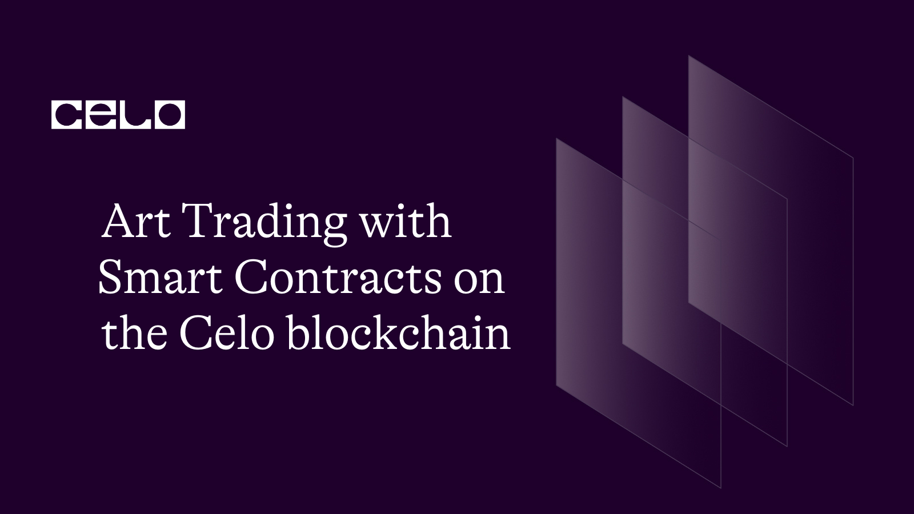

## INTRODUCTION

The contract `ArtifactHouse` manages a marketplace for artifacts. It has a struct Artifact which contains information about each artifact, such as owner address, image URL, name, description, price, etc. The contract has mappings to keep track of the artifacts and the visits booked for each artifact. It also defines several modifiers, which are used to check conditions before executing specific functions.

The contract allows adding artifacts to the marketplace, buying artifacts, toggling an artifact's onDisplay and onSale properties, and booking visits for artifacts. It requires payment in cUSD token for buying an artifact and visiting an artifact.

## REQUIREMENT

In order to complete this tutorial, you will require:

- A code editor or text editor such as Remix that you can access.

- A dependable internet connection and web browser.

## PREREQUISITE

- A fundamental understanding of Javascript.

- Familiarity with the workings of Blockchain.

- Basic knowledge of the Solidity programming language.

Let's start creating our smart contract.

Here is the full code:

```solidity
// SPDX-License-Identifier: MIT

pragma solidity >=0.7.0 <0.9.0;

interface IERC20Token {
    function transfer(address, uint256) external returns (bool);

    function approve(address, uint256) external returns (bool);

    function transferFrom(
        address,
        address,
        uint256
    ) external returns (bool);

    function totalSupply() external view returns (uint256);

    function balanceOf(address) external view returns (uint256);

    function allowance(address, address) external view returns (uint256);

    event Transfer(address indexed from, address indexed to, uint256 value);
    event Approval(
        address indexed owner,
        address indexed spender,
        uint256 value
    );
}

contract ArtifactHouse {
    uint256 private artifactsLength = 0;
    address private cUsdTokenAddress =
        0x874069Fa1Eb16D44d622F2e0Ca25eeA172369bC1;

    // fee to pay for visiting an artifact
    uint256 public visitFee = 1 ether;

    struct Artifact {
        address payable owner;
        string image;
        string name;
        string description;
        uint256 price;
        uint256 visitors;
        bool isOnSale;
        bool isOnDisplay;
    }

    mapping(uint256 => Artifact) private artifacts;
    // keeps of addresses that have booked a visit for an artifact
    mapping(uint256 => mapping(address => bool)) bookedVisit;
    // keeps track of artifact's id that exist
    mapping(uint256 => bool) exists;

    /// @dev modifier to check if artifact exist
    modifier exist(uint256 _index) {
        require(exists[_index], "Query of non existent artifact");
        _;
    }

modifier notOnDisplayOrOnSale(uint256 _index) {
    require(!artifacts[_index].isOnDisplay, "Artifact is currently on display");
    require(!artifacts[_index].isOnSale, "Artifact is currently on sale");
    _;
}

    /// @dev modifier to check if caller is artifact owner
    modifier onlyArtifactOwner(uint256 _index) {
        require(
            msg.sender == artifacts[_index].owner,
            "Only owner can perform this operation"
        );
        _;
    }

    /// @dev modifier to check if caller is a valid customer
    modifier onlyValidCustomer(uint256 _index) {
        require(
            artifacts[_index].owner != msg.sender,
            "You can't buy your own artifact"
        );
        _;
    }

    /// @dev modifer to check if _price is valid
    modifier checkPrice(uint256 _price) {
        require(_price > 0, "Price needs to be at least one wei");
        _;
    }

    /// @dev modifier to check if image url is not an empty string
    modifier checkImageUrl(string calldata _image) {
        require(bytes(_image).length > 0, "Empty image url");
        _;
    }

    /// @dev adds an artifact on the platform
    function addArtifact(
        string calldata _image,
        string calldata _name,
        string calldata _description,
        uint256 _price
    ) external checkPrice(_price) checkImageUrl(_image) {
        require(bytes(_name).length > 0, "Empty name");
        require(bytes(_description).length > 0, "Empty description");
        artifacts[artifactsLength] = Artifact(
            payable(msg.sender),
            _image,
            _name,
            _description,
            _price,
            0, // number of visits
            true, // onSale initialised as true
            false // onDisplay initialised as false
        );
        exists[artifactsLength] = true;
        artifactsLength++;
    }

    /// @dev buys an artifact with _index
    function buyArtifact(uint256 _index)
        external
        payable
        exist(_index)
        onlyValidCustomer(_index)
    {
        address owner = artifacts[_index].owner;
        artifacts[_index].owner = payable(msg.sender);
        artifacts[_index].isOnSale = false;
        require(
            IERC20Token(cUsdTokenAddress).transferFrom(
                msg.sender,
                owner,
                artifacts[_index].price
            ),
            "Transfer failed."
        );
    }

    /// @dev toggles the onDisplay property for whether visits for artifact is allowed
    function toggleOnDisplay(uint256 _index)
        public
        exist(_index)
        onlyArtifactOwner(_index)
    {
        require(
            !artifacts[_index].isOnSale,
            "Artifacts on sale can't be displayed"
        );
        artifacts[_index].isOnDisplay = !artifacts[_index].isOnDisplay;
    }

    /// @dev toggles the onSale property of an artifact
    function toggleOnSale(uint256 _index)
        public
        exist(_index)
        onlyArtifactOwner(_index)
    {
        require(
            !artifacts[_index].isOnDisplay,
            "Artifacts on sale can't be displayed"
        );
        artifacts[_index].isOnSale = !artifacts[_index].isOnSale;
    }

    /// @dev books a visit for an artifact
    function bookVisit(uint256 _index)
        public
        exist(_index)
        onlyValidCustomer(_index)
    {
        require(artifacts[_index].isOnDisplay, "Artifact isn't on display");
        require(!bookedVisit[_index][msg.sender], "Already booked");
        artifacts[_index].visitors += 1;
        bookedVisit[_index][msg.sender] = true;
        require(
            IERC20Token(cUsdTokenAddress).transferFrom(
                msg.sender,
                artifacts[_index].owner,
                visitFee
            ),
            "Transfer failed."
        );
    }

    function getArtifact(uint256 _index)
        public
        view
        exist(_index)
        returns (Artifact memory)
    {
        return (artifacts[_index]);
    }

    function getartifactsLength() public view returns (uint256) {
        return (artifactsLength);
    }

}
```

Click this link to access the full code [Github repo](https://github.com/Ogoyi/artifacts)

To commence, we'll generate a new file on Remix named `Artifact.sol`. Here's a link that will show you how to create a new file on Remix. [here](https://remix-ide.readthedocs.io/en/latest/file_explorer.html#:~:text=Creating%20new%20files,-There%20are%202&text=The%20first%20is%20to%20click,will%20open%20in%20the%20Editor.).

Once you have created a new file on Remix, we will start by declaring some statements in our smart contract.

```solidity
// SPDX-License-Identifier: MIT

pragma solidity >=0.7.0 <0.9.0;
```

The line `SPDX-License-Identifier: MIT` is an identifier for the license of the code, in this case, the `MIT License`. [The SPDX (Software Package Data Exchange)](https://spdx.dev/) identifier is a standardized way to identify open-source licenses.

In the next line, we declare the version of the Solidity programming language used in the smart contract, indicating that the code is written in Solidity version `0.7.0` or newer, up to but not including `0.9.0`.

After declaring the version of Solidity, the next step is to add the ERC20 token interface to our smart contract.

```solidity
interface IERC20Token {
    function transfer(address, uint256) external returns (bool);

    function approve(address, uint256) external returns (bool);

    function transferFrom(
        address,
        address,
        uint256
    ) external returns (bool);

    function totalSupply() external view returns (uint256);

    function balanceOf(address) external view returns (uint256);

    function allowance(address, address) external view returns (uint256);

    event Transfer(address indexed from, address indexed to, uint256 value);
    event Approval(
        address indexed owner,
        address indexed spender,
        uint256 value
    );
}
```

This code block is declaring an interface for the ERC20 token standard in Solidity. The ERC20 token standard is a widely used standard for creating tokens on the Celo blockchain.

The interface declares several functions that are commonly used with ERC20 tokens, such as transferring tokens between addresses, approving transfers, checking balances and allowances.

The events declared in this interface are used to emit notifications of when a transfer or approval happens on the blockchain.

By declaring this interface, we can interact with any ERC20 token that implements these functions in our smart contract without needing to know the implementation details.

Moving on, we will give a name to our smart contract and create a struct.

````solidity
contract ArtifactHouse {
    uint256 private artifactsLength = 0;
    address private cUsdTokenAddress =
        0x874069Fa1Eb16D44d622F2e0Ca25eeA172369bC1;

    // fee to pay for visiting an artifact
    uint256 public visitFee = 1 ether;

    struct Artifact {
        address payable owner;
        string image;
        string name;
        string description;
        uint256 price;
        uint256 visitors;
        bool isOnSale;
        bool isOnDisplay;
    }
``

We have named our contract `ArtifactHouse` and declared two private variables: `artifactsLength` and `cUsdTokenAddress`.

We have also defined a struct named `Artifact` with various attributes such as `owner`, `image`, `name`, `description`, `price`, `visitors`, `isOnSale`, and `isOnDisplay`. This struct will be used to store information about each artifact in our auction system.

We have set the initial value of `artifactsLength` to `0` and assigned the address of the cUSD token contract to cUsdTokenAddress. Additionally, we have set the `visitFee` to 1 ether, which is the fee visitors must pay to view an artifact in our system.

Additionally, we add our various mapping and modifiers.

```solidity
 mapping(uint256 => Artifact) private artifacts;
    // keeps of addresses that have booked a visit for an artifact
    mapping(uint256 => mapping(address => bool)) bookedVisit;
    // keeps track of artifact's id that exist
    mapping(uint256 => bool) exists;

    /// @dev modifier to check if artifact exist
    modifier exist(uint256 _index) {
        require(exists[_index], "Query of non existent artifact");
        _;
    }

modifier notOnDisplayOrOnSale(uint256 _index) {
    require(!artifacts[_index].isOnDisplay, "Artifact is currently on display");
    require(!artifacts[_index].isOnSale, "Artifact is currently on sale");
    _;
}

    /// @dev modifier to check if caller is artifact owner
    modifier onlyArtifactOwner(uint256 _index) {
        require(
            msg.sender == artifacts[_index].owner,
            "Only owner can perform this operation"
        );
        _;
    }

    /// @dev modifier to check if caller is a valid customer
    modifier onlyValidCustomer(uint256 _index) {
        require(
            artifacts[_index].owner != msg.sender,
            "You can't buy your own artifact"
        );
        _;
    }

    /// @dev modifer to check if _price is valid
    modifier checkPrice(uint256 _price) {
        require(_price > 0, "Price needs to be at least one wei");
        _;
    }

    /// @dev modifier to check if image url is not an empty string
    modifier checkImageUrl(string calldata _image) {
        require(bytes(_image).length > 0, "Empty image url");
        _;
    }
````

In the code, we define three mapping variables to store the artifacts and their information. The first mapping variable named `artifacts` is used to keep track of artifacts using their `ID`. The second mapping variable named `bookedVisit` is used to store the addresses that have booked a visit for a particular artifact. The third mapping variable named exists is used to track the existence of artifacts based on their ID.

We also define some modifiers to check various conditions before executing specific functions. The first modifier named `exist` is used to check whether an artifact exists or not. The second modifier named `notOnDisplayOrOnSale` is used to check whether the artifact is on display or on sale. The third modifier named `onlyArtifactOwner` is used to check whether the caller is the owner of the artifact. The fourth modifier named `onlyValidCustomer` is used to check whether the caller is a valid customer. The fifth modifier named `checkPrice` is used to check if the price of the artifact is valid. The last modifier named `checkImageUrl` is used to check if the image URL of the artifact is not empty.

To enhance the functionality of our smart contract, we will now start adding functions. The first function we are going to add is called `addArtifact`.

```solidity
function addArtifact(
        string calldata _image,
        string calldata _name,
        string calldata _description,
        uint256 _price
    ) external checkPrice(_price) checkImageUrl(_image) {
        require(bytes(_name).length > 0, "Empty name");
        require(bytes(_description).length > 0, "Empty description");
        artifacts[artifactsLength] = Artifact(
            payable(msg.sender),
            _image,
            _name,
            _description,
            _price,
            0, // number of visits
            true, // onSale initialised as true
            false // onDisplay initialised as false
        );
        exists[artifactsLength] = true;
        artifactsLength++;
    }
```

In order to add more functionality to our smart contract, we are going to define a new function called `addArtifact`. This function takes in several input parameters such as the `image`, `name`, `description` and `price` of the artifact, and then creates a new instance of the Artifact struct.

We begin by using the `require` function to check that the price of the artifact is valid, that the image url is not an empty string and that the name and description of the artifact are not empty strings.

We then proceed to create a new Artifact struct using the input parameters provided by the user, and set the onSale property to true while setting the onDisplay property to false.

Finally, we use the exists mapping to keep track of the newly created artifact's ID by setting its value to true and then increment the artifactsLength variable to indicate that we have added a new artifact to our smart contract.

The next function we will create is the `buyArtifact` function.

```solidity
function buyArtifact(uint256 _index)
        external
        payable
        exist(_index)
        onlyValidCustomer(_index)
    {
        address owner = artifacts[_index].owner;
        artifacts[_index].owner = payable(msg.sender);
        artifacts[_index].isOnSale = false;
        require(
            IERC20Token(cUsdTokenAddress).transferFrom(
                msg.sender,
                owner,
                artifacts[_index].price
            ),
            "Transfer failed."
        );
    }

```

In this section, we define the `buyArtifact` function, which allows a customer to buy an artifact. We first check if the artifact exists and if the customer is valid. Then, we get the current owner of the artifact and transfer ownership to the buyer. We also set the `isOnSale` flag to false, indicating that the artifact is no longer for sale. Finally, we transfer the payment from the buyer to the seller using the transferFrom function of the ERC20 token interface. This function requires approval from the buyer beforehand. If the transfer is successful, the transaction is complete. We use the require statement to ensure that the transfer is successful; otherwise, the transaction fails.

We will now introduce the `toggleOnDisplay` function.

```solidity
 function toggleOnDisplay(uint256 _index)
        public
        exist(_index)
        onlyArtifactOwner(_index)
    {
        require(
            !artifacts[_index].isOnSale,
            "Artifacts on sale can't be displayed"
        );
        artifacts[_index].isOnDisplay = !artifacts[_index].isOnDisplay;
    }
```

Now, let's add a function to toggle an artifact's `on-display status`. We call it toggleOnDisplay. This function takes in the index of the artifact as a parameter and ensures that it exists and that the caller is the owner of the artifact.

Before toggling the on-display status, we check if the artifact is `on sale`. If it is, we throw an error because an artifact on sale can't be displayed.

Then we toggle the artifact's on-display status using the `isOnDisplay` boolean in the artifact struct. If it was previously false, it will become true, and if it was previously true, it will become false.

This function will allow the owner of an artifact to display or hide it from the public on the platform.

Next we add the `toggleOnSale` and the book visit function.

```solidity
  function toggleOnSale(uint256 _index)
        public
        exist(_index)
        onlyArtifactOwner(_index)
    {
        require(
            !artifacts[_index].isOnDisplay,
            "Artifacts on sale can't be displayed"
        );
        artifacts[_index].isOnSale = !artifacts[_index].isOnSale;
    }

    /// @dev books a visit for an artifact
    function bookVisit(uint256 _index)
        public
        exist(_index)
        onlyValidCustomer(_index)
    {
        require(artifacts[_index].isOnDisplay, "Artifact isn't on display");
        require(!bookedVisit[_index][msg.sender], "Already booked");
        artifacts[_index].visitors += 1;
        bookedVisit[_index][msg.sender] = true;
        require(
            IERC20Token(cUsdTokenAddress).transferFrom(
                msg.sender,
                artifacts[_index].owner,
                visitFee
            ),
            "Transfer failed."
        );
    }
```

In these two functions, we add more functionality to our smart contract.

The `toggleOnSale` function allows the owner of an artifact to toggle its "on sale" status. If the artifact is currently on display, it cannot be put on sale.

On the other hand, the `bookVisit` function allows a user to book a visit to an artifact that is currently on display. The function checks if the user has already booked a visit and increases the visitor count of the artifact. Additionally, the function transfers a visit fee from the user to the owner of the artifact using the cUSD token.

Finally, we add the `getArtifact` function and the `getArtifactslength` function

```solidity
function getArtifact(uint256 _index)
        public
        view
        exist(_index)
        returns (Artifact memory)
    {
        return (artifacts[_index]);
    }
```

These are two getter functions that we added to our smart contract. The `getArtifact` function takes an index as input, checks if the artifact with that index exists, and then returns the artifact at that index. The `getartifactsLength` function returns the total number of artifacts stored in our artifacts mapping.

By adding these functions, we can now easily retrieve information about the artifacts stored in our smart contract from outside the blockchain. This allows us to build applications and user interfaces on top of our smart contract, without having to interact with it directly.

## CONTRACT DEPLOYMENT

To deploy the artifact smart contract on the Celo blockchain, a few things are required:

To deploy the Artifact smart contract on the Celo blockchain, you will need to first download and install the Celo Extension Wallet from the Google Chrome store. After installation, create a wallet and make sure to securely store your key phrase. [Click here to intall the celo extension wallet](https://chrome.google.com/webstore/detail/celoextensionwallet/kkilomkmpmkbdnfelcpgckmpcaemjcdh?hl=en)

To fund your wallet, you can use the Celo Faucet. Simply copy the address of your wallet and paste it into the faucet. Then confirm your request, and your wallet will be funded. [Click here to access celo faucet](https://faucet.celo.org/)

Celo Remix Plugin: Open Remix and create a new Solidity file, paste the FloraNft contract code into the file, and ensure the Solidity compiler is set to version 0.8.7 or later. [Click here to access to access the remix ide](https://remix.ethereum.org/)

Compile the contract by clicking the "Compile artifact.sol" button in the Solidity Compiler tab in Remix.

In the "Deploy & Run Transactions" tab, select the Celo network from the dropdown menu, connect your wallet to Remix by clicking "Connect to wallet", and select "Artifact" from the "Contract" dropdown menu.

Click the "Deploy" button, confirm the transaction in your wallet, and wait for the transaction to be confirmed on the Celo blockchain.

Once the transaction is confirmed, the FloralNft contract will be deployed on the Celo blockchain and you can interact with it using Remix.

## CONCLUSION

In conclusion, we have learned how to create a smart contract for buying and selling `artifacts` on the Celo blockchain. We started by defining the data structures we will be using for our smart contract, including the Artifact struct, and then implemented various functions for adding artifacts, buying artifacts, booking visits, and more. We also discussed the importance of using modifiers for security purposes, and how to deploy our smart contract on the Celo blockchain using the Celo Extension Wallet and Celo Faucet. By following this tutorial, you can now create your own smart contracts for buying and selling different types of assets on the Celo blockchain.

## NEXT STEPS

Great job! It's always helpful to provide additional resources for further learning. Don't hesitate to reach out if you have any more questions or if you need further assistance, you can reach out to me on twitter by clicking [this link](https://twitter.com/thompsonogoyi). Happy learning!

## About the author

My name is Ogoyi Thompson, and I'm a web3 developer based in Nigeria. I am enthusiastic about working with blockchain technology.
