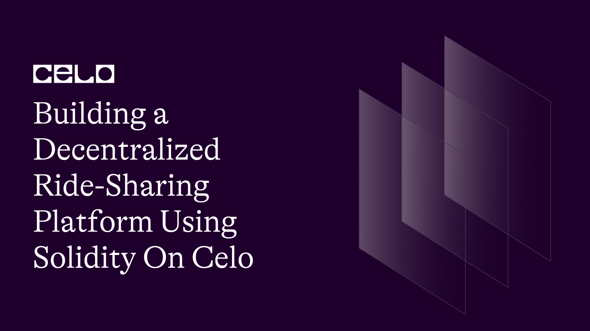

## Introduction

Ride-sharing has become an increasingly popular mode of transportation in recent years, thanks to its convenience and affordability. However, traditional ride-sharing platforms like Uber and Lyft have been criticized for their centralized business models, which can lead to issues with pricing, data privacy, and driver and rider safety.

To address these issues, a new generation of decentralized ride-sharing platforms is emerging, powered by blockchain technology. These platforms aim to create a more transparent, efficient, and equitable ride-sharing ecosystem by eliminating the need for a centralized authority to manage transactions and data.

In this tutorial, we'll learn how to build a decentralized ride-sharing platform using Solidity, the programming language of the Celo blockchain.

Here's the github repo of our code. [source code](https://github.com/richiemikke/ride-sharing-smartcontract)

## Prerequisites

To follow this tutorial, you will need the following:

- Basic knowledge of Solidity programming language.
- A Development Environment Like Remix.
- The celo Extension Wallet.

## SmartContract

Let's begin writing our smart contract in Remix IDE

The completed code Should look like this.

```solidity
// SPDX-License-Identifier: MIT

pragma solidity ^0.8.0;

contract RideSharing {

    struct Ride {
        uint256 rideId;
        address payable driver;
        uint256 fare;
        uint256 timestamp;
        bool isActive;
    }

    struct Rider {
        address payable riderAddress;
        uint256[] rides;
        mapping (uint256 => bool) hasRide;
    }

    mapping (uint256 => Ride) public rides;
    mapping (address => Rider) public riders;
    uint256 public totalRides;

    event RideCreated(uint256 rideId, address driver, uint256 fare);
    event RideCompleted(uint256 rideId, address driver, address rider, uint256 fare);
    event RiderBlacklisted(address rider);

    function createRide(uint256 _fare) external {
        require(_fare > 0, "Invalid fare amount");
        Ride storage newRide = rides[totalRides];
        newRide.rideId = totalRides;
        newRide.driver = payable(msg.sender);
        newRide.fare = _fare;
        newRide.timestamp = block.timestamp;
        newRide.isActive = true;
        totalRides++;

        emit RideCreated(newRide.rideId, newRide.driver, newRide.fare);
    }

    function completeRide(uint256 _rideId) external payable {
        require(msg.value > 0, "Invalid fare amount");
        Ride storage completedRide = rides[_rideId];
        require(completedRide.driver == msg.sender, "Only the driver can complete the ride");
        require(completedRide.isActive == true, "Ride is already completed or does not exist");
        require(msg.value == completedRide.fare, "Incorrect fare amount");

        Rider storage currentRider = riders[msg.sender];
        currentRider.rides.push(_rideId);
        currentRider.hasRide[_rideId] = true;

        completedRide.isActive = false;
        emit RideCompleted(completedRide.rideId, completedRide.driver, msg.sender, completedRide.fare);
        completedRide.driver.transfer(msg.value);
    }

    function getRiderRides(address _riderAddress) external view returns (uint256[] memory) {
        Rider storage currentRider = riders[_riderAddress];
        return currentRider.rides;
    }

    function getRideDetails(uint256 _rideId) external view returns (address, uint256, uint256) {
        Ride storage currentRide = rides[_rideId];
        require(currentRide.isActive == false, "Ride is still active");
        return (currentRide.driver, currentRide.fare, currentRide.timestamp);
    }

    function blacklistRider(address _riderAddress) external {
        require(_riderAddress != address(0), "Invalid rider address");
        Rider storage currentRider = riders[_riderAddress];
        currentRider.riderAddress = payable(address(0));
        emit RiderBlacklisted(_riderAddress);
    }

    function getRiderAddress(uint256 _rideId) external view returns (address) {
        Ride storage currentRide = rides[_rideId];
        require(currentRide.isActive == false, "Ride is still active");
        return riders[currentRide.driver].riderAddress;
    }

    function getRiderRideCount(address _riderAddress) external view returns (uint256) {
        Rider storage currentRider = riders[_riderAddress];
        return currentRider.rides.length;
}

function setRiderAddress(address _riderAddress) external {
    require(_riderAddress != address(0), "Invalid rider address");
    Rider storage currentRider = riders[msg.sender];
    currentRider.riderAddress = payable(_riderAddress);
}

function getRideCount() external view returns (uint256) {
    return totalRides;
}

function getActiveRides() external view returns (uint256[] memory) {
    uint256[] memory activeRides = new uint256[](totalRides);
    uint256 index = 0;
    for (uint256 i = 0; i < totalRides; i++) {
        Ride storage currentRide = rides[i];
        if (currentRide.isActive) {
            activeRides[index] = currentRide.rideId;
            index++;
        }
    }
    return activeRides;
}
}
```

**Structs**

Two structs are defined in the contract.

```solidity
    struct Ride {
        uint256 rideId;
        address payable driver;
        uint256 fare;
        uint256 timestamp;
        bool isActive;
    }
```

`Ride` - This structure defines the properties of a ride, including its ID, the driver's address, the fare, the timestamp, and whether the ride is currently active

```solidity
    struct Rider {
        address payable riderAddress;
        uint256[] rides;
        mapping (uint256 => bool) hasRide;
    }
```

`Rider` - This structure defines a rider, including their address, a list of their ride IDs, and a mapping that keeps track of whether the rider has taken a particular ride.

**Mappings and Variables**

The contract uses two mappings to keep track of rides and riders.

```solidity
    mapping (uint256 => Ride) public rides;

    mapping (address => Rider) public riders;

    uint256 public totalRides;
```

`rides` - This mapping maps a ride ID to its corresponding Ride struct.

`riders` - This mapping maps a rider's address to their corresponding Rider struct.

The `totalRides` variable keeps track of the total number of rides that have been created.

**Events**

The contract defines three events

```solidity
event RideCreated(uint256 rideId, address driver, uint256 fare);
event RideCompleted(uint256 rideId, address driver, address rider, uint256 fare);
event RiderBlacklisted(address rider);

```

`RideCreated` - This event is emitted when a new ride is created.

`RideCompleted` - This event is emitted when a ride is completed.

`RiderBlacklisted` - This event is emitted when a rider is blacklisted.

**Functions**

The contract defines several functions that enable riders and drivers to interact with the platform.

```solidity
    function createRide(uint256 _fare) external {
        require(_fare > 0, "Invalid fare amount");
        Ride storage newRide = rides[totalRides];
        newRide.rideId = totalRides;
        newRide.driver = payable(msg.sender);
        newRide.fare = _fare;
        newRide.timestamp = block.timestamp;
        newRide.isActive = true;
        totalRides++;

        emit RideCreated(newRide.rideId, newRide.driver, newRide.fare);
    }
```

Let's start with the `createRide` function, which allows a driver to create a new ride by specifying the fare amount. The function first checks that the fare amount is valid, then creates a new Ride struct and stores it in the rides mapping. The function also emits a `RideCreated` event.

```solidity
 function completeRide(uint256 _rideId) external payable {
        require(msg.value > 0, "Invalid fare amount");
        Ride storage completedRide = rides[_rideId];
        require(completedRide.driver == msg.sender, "Only the driver can complete the ride");
        require(completedRide.isActive == true, "Ride is already completed or does not exist");
        require(msg.value == completedRide.fare, "Incorrect fare amount");

        Rider storage currentRider = riders[msg.sender];
        currentRider.rides.push(_rideId);
        currentRider.hasRide[_rideId] = true;

        completedRide.isActive = false;
        emit RideCompleted(completedRide.rideId, completedRide.driver, msg.sender, completedRide.fare);
        completedRide.driver.transfer(msg.value);
    }
```

The `completeRide` function is used by riders to complete a ride by paying the fare amount. The function checks that the fare amount is valid, the rider is the one who took the ride, and that the ride is still active. If all checks pass, the function updates the `Rider` struct to reflect that the rider has taken the ride and emits a `RideCompleted` event.

```solidity
 function getRiderRides(address _riderAddress) external view returns (uint256[] memory) {
        Rider storage currentRider = riders[_riderAddress];
        return currentRider.rides;
    }
```

The `getRiderRides` function allows external applications to retrieve information about the rides taken by a particular rider. The function takes the rider's address as input and returns an array of ride IDs.

```solidity
 function getRideDetails(uint256 _rideId) external view returns (address, uint256, uint256) {
        Ride storage currentRide = rides[_rideId];
        require(currentRide.isActive == false, "Ride is still active");
        return (currentRide.driver, currentRide.fare, currentRide.timestamp);
    }
```

The `getRideDetails` function allows external applications to retrieve information about a particular ride. The function takes the ride ID as input and returns the driver's address, the fare amount, and the timestamp of the ride.

```solidity
 function blacklistRider(address _riderAddress) external {
        require(_riderAddress != address(0), "Invalid rider address");
        Rider storage currentRider = riders[_riderAddress];
        currentRider.riderAddress = payable(address(0));
        emit RiderBlacklisted(_riderAddress);
    }
```

The `blacklistRider` function allows the contract owner to blacklist a particular rider by setting their riderAddress to zero. This prevents the rider from creating new rides or completing existing rides.

```solidity
function getRiderAddress(uint256 _rideId) external view returns (address) {
        Ride storage currentRide = rides[_rideId];
        require(currentRide.isActive == false, "Ride is still active");
        return riders[currentRide.driver].riderAddress;
    }
```

The `getRiderAddress` function allows external applications to retrieve the address of the rider who took a particular ride. The function takes the ride ID as input and returns the rider's address.

```solidity
 function getRiderRideCount(address _riderAddress) external view returns (uint256) {
        Rider storage currentRider = riders[_riderAddress];
        return currentRider.rides.length;
}
```

The `getRiderRideCount` function allows external applications to retrieve the total number of rides created.

```solidity
function setRiderAddress(address _riderAddress) external {
    require(_riderAddress != address(0), "Invalid rider address");
    Rider storage currentRider = riders[msg.sender];
    currentRider.riderAddress = payable(_riderAddress);
}
```

The `setRiderAddress` function allows a rider to set their `riderAddress`, which is used to track which rider took which ride. The function takes the new rider address as input and updates the `Rider` struct accordingly.

```solidity
function getRideCount() external view returns (uint256) {
    return totalRides;
}
```

The `getRideCount` function allows external applications to retrieve the total number of rides created.

```solidity
function getActiveRides() external view returns (uint256[] memory) {
    uint256[] memory activeRides = new uint256[](totalRides);
    uint256 index = 0;
    for (uint256 i = 0; i < totalRides; i++) {
        Ride storage currentRide = rides[i];
        if (currentRide.isActive) {
            activeRides[index] = currentRide.rideId;
            index++;
        }
    }
    return activeRides;
}
```

The `getActiveRides` function allows external applications to retrieve an array of all active ride IDs. The function iterates over all rides and adds the IDs of active rides to the array.

## Deployment

**Install the Celo Plugin**

First, you'll need to install the Celo Plugin for Remix. To do this, open Remix and click on the `Plugin Manager` icon on the left-hand side. Search for `Celo` and click the `Install` button next to the Celo Plugin. Once the installation is complete, you'll see a new `Celo` tab appear in the sidebar.

**Connect to the Celo Alfajores Testnet**

To deploy our smart contract successfully, we need the celo extention wallet which can be downloaded from [here](https://chrome.google.com/webstore/detail/celoextensionwallet/kkilomkmpmkbdnfelcpgckmpcaemjcdh?hl=en)

Next, we need to fund our newly created wallet which can done using the celo alfojares faucet [Here](https://celo.org/developers/faucet)

Next, you'll need to connect Remix to the Celo Testnet. Click on the `Celo` tab in the sidebar and then click on the `Connect to Network` button.

**Compile Contract**

Open the `RideSharing.sol` file in Remix and click on the `Solidity Compiler` tab in the sidebar. Click the `Compile RideSharing.sol` button to compile the contract.

**Deploy the Contract**

Click on the `Deploy & Run Transactions` tab in the sidebar. In the `Contract` dropdown menu, select `RideSharing`.

**Interact with the Contract**

Once the contract is deployed, you can interact with it using the functions in the `Deployed Contracts` section of the `Deploy & Run Transactions` tab. You'll need to connect to the contract using the `At Address` button and entering the contract address. From there, you can call the various functions of the contract, such as staking, unstaking, withdrawing rewards, and transferring ownership.

That's it! With these steps, you should be able to deploy the `RideSharing` smart contract to the Celo Testnet using Remix and the Celo Plugin.

## Conclusion

The `RideSharing` contract is a simple but powerful smart contract that allows drivers and riders to share rides on the blockchain. The contract makes use of `structs`, `mappings`, `events`, `modifiers`, and several functions to implement the ride-sharing logic. Riders can complete rides and pay fares, drivers can create rides, and external applications can retrieve information about past rides. The contract also includes some security measures, such as blacklisting riders and preventing unauthorized access to rides.

## Learn More

I hope you learned a lot from this tutorial. Here are some relevant links that would aid your learning further.

- [Celo Docs](https://docs.celo.org/)
- [Solidity Docs](https://docs.soliditylang.org/en/v0.8.17/)

## About the author

Hello, I'am Richard Michael, a fullstack web3 developer.
