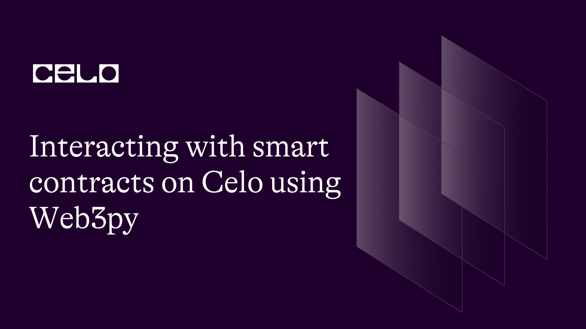

## Introduction

Interacting with the Ethereum protocol has been made easy with the advent of frameworks and libraries such as Web3py. Celo blockchain is compatible with the Ethereum Virtual Machine hence most tools for developing applications on the EVM are a good-to-go on Celo. For developers, it is important to be exposed to most of these tools if not all.

## Prerequisites​

I have designed this tutorial to help you Celo-target developer to have good insights using the web3py library to interact with smart contracts. Meanwhile, it is a necessity to have experience working with the following programming languages.

- At least intermediate in Solidity.
- You must have been exposed to the Python environment, and should understand its syntax and concepts such as `class` `functions`, `variables`, and `Object Oriented Programming`. 

## Requirements​
We are going to use the following tools. Please install them before proceeding.

- Code editor or an IDE preferably. I recommend [VSCode]().
- [Python](https://python.org/downloads)
- [Pip](https://pypi.org/project/pip/) (No need to install separately if you installed Python3 or later)
- [Git bash](https://git-scm.com/downloads)
- [Ganache](https://trufflesuite.com/ganache/)

**What is Web3Py?**

Web3Py is a collection of APIs and utilities for interacting with the Ethereum-based platforms or nodes using IPC, HTTP, or WebSocket. It is the Python version of Web3js.

- Web3 : The umbrella class for the web3py package. It is a class object through which you can access or construct the Ethereum-related modules, versions, utils, providers, and givenProvider.

- web3.eth: This is used for interacting with the Ethereum blockchain including smart contracts.

**Setting up development environment**

- Install [Python](https://python.org) if you don't have it.

- Install Python's package manager - pip. Before you do that, you'd want to check if pip is already installed by typing the following command in the command line.

```bash
pip --version
```
or

```bash
pip3 --version
```

If the command fails, **[this short video](https://youtu.be/Ko9b_vC6XY0)** will guide you through the installation.

- Install `web3py` using the package manager - pip.

```bash
pip install web3
```

- Create a project folder.
  - Launch Git bash.

  Be sure to replace `projectName` with the name you choose.

  ```bash
  mkdir <projectName> && cd <projectName>
  ```
- Create a virtual environment.

```bash
python3 -m venv <virtualEnvironmentName>
```

- Activate the environment

```bash window OS
source <environmentName>/Scripts/activate
```

```bash MAC/Linux
source <environmentName>/bin/activate
```

- Open in VSCode

```bash
code .
```

Now that we have everything set up, let's write the contract. Navigate to the root directory, create a `.sol` file, name it `ChequePayment.sol`, and paste the code below.

```bash
cd <root folder> && touch ChequePayment.sol
```

```js
  // SPDX-License-Identifier: MIT
  pragma solidity 0.8.18;

  /**
  * @dev Collection of functions related to the address type
  */
  library Address {
      /**
      * @dev Returns true if `account` is a contract.
      *
      * [IMPORTANT]
      * ====
      * It is unsafe to assume that an address for which this function returns
      * false is an externally-owned account (EOA) and not a contract.
      *
      * Among others, `isContract` will return false for the following
      * types of addresses:
      *
      *  - an externally-owned account
      *  - a contract in construction
      *  - an address where a contract will be created
      *  - an address where a contract lived, but was destroyed
      * ====
      *
      * [IMPORTANT]
      * ====
      * You shouldn't rely on `isContract` to protect against flash loan attacks!
      *
      * Preventing calls from contracts is highly discouraged. It breaks composability, breaks support for smart wallets
      * like Gnosis Safe, and does not provide security since it can be circumvented by calling from a contract
      * constructor.
      * ====
      */
      function isContract(address account) internal view returns (bool) {
          // This method relies on extcodesize/address.code.length, which returns 0
          // for contracts in construction, since the code is only stored at the end
          // of the constructor execution.

          return account.code.length > 0;
      }

      /**
      * @dev Replacement for Solidity's `transfer`: sends `amount` wei to
      * `recipient`, forwarding all available gas and reverting on errors.
      *
      * https://eips.ethereum.org/EIPS/eip-1884[EIP1884] increases the gas cost
      * of certain opcodes, possibly making contracts go over the 2300 gas limit
      * imposed by `transfer`, making them unable to receive funds via
      * `transfer`. {sendValue} removes this limitation.
      *
      * https://diligence.consensys.net/posts/2019/09/stop-using-soliditys-transfer-now/[Learn more].
      *
      * IMPORTANT: because control is transferred to `recipient`, care must be
      * taken to not create reentrancy vulnerabilities. Consider using
      * {ReentrancyGuard} or the
      * https://solidity.readthedocs.io/en/v0.5.11/security-considerations.html#use-the-checks-effects-interactions-pattern[checks-effects-interactions pattern].
      */
      function sendValue(address payable recipient, uint256 amount) internal {
          require(address(this).balance >= amount, "Address: insufficient balance");

          (bool success, ) = recipient.call{value: amount}("");
          require(success, "Address: unable to send value, recipient may have reverted");
      }

      /**
      * @dev Performs a Solidity function call using a low level `call`. A
      * plain `call` is an unsafe replacement for a function call: use this
      * function instead.
      *
      * If `target` reverts with a revert reason, it is bubbled up by this
      * function (like regular Solidity function calls).
      *
      * Returns the raw returned data. To convert to the expected return value,
      * use https://solidity.readthedocs.io/en/latest/units-and-global-variables.html?highlight=abi.decode#abi-encoding-and-decoding-functions[`abi.decode`].
      *
      * Requirements:
      *
      * - `target` must be a contract.
      * - calling `target` with `data` must not revert.
      *
      * _Available since v3.1._
      */
      function functionCall(address target, bytes memory data) internal returns (bytes memory) {
          return functionCallWithValue(target, data, 0, "Address: low-level call failed");
      }

      /**
      * @dev Same as {xref-Address-functionCall-address-bytes-}[`functionCall`], but with
      * `errorMessage` as a fallback revert reason when `target` reverts.
      *
      * _Available since v3.1._
      */
      function functionCall(
          address target,
          bytes memory data,
          string memory errorMessage
      ) internal returns (bytes memory) {
          return functionCallWithValue(target, data, 0, errorMessage);
      }

      /**
      * @dev Same as {xref-Address-functionCall-address-bytes-}[`functionCall`],
      * but also transferring `value` wei to `target`.
      *
      * Requirements:
      *
      * - the calling contract must have an ETH balance of at least `value`.
      * - the called Solidity function must be `payable`.
      *
      * _Available since v3.1._
      */
      function functionCallWithValue(
          address target,
          bytes memory data,
          uint256 value
      ) internal returns (bytes memory) {
          return functionCallWithValue(target, data, value, "Address: low-level call with value failed");
      }

      /**
      * @dev Same as {xref-Address-functionCallWithValue-address-bytes-uint256-}[`functionCallWithValue`], but
      * with `errorMessage` as a fallback revert reason when `target` reverts.
      *
      * _Available since v3.1._
      */
      function functionCallWithValue(
          address target,
          bytes memory data,
          uint256 value,
          string memory errorMessage
      ) internal returns (bytes memory) {
          require(address(this).balance >= value, "Address: insufficient balance for call");
          (bool success, bytes memory returndata) = target.call{value: value}(data);
          return verifyCallResultFromTarget(target, success, returndata, errorMessage);
      }

      /**
      * @dev Same as {xref-Address-functionCall-address-bytes-}[`functionCall`],
      * but performing a static call.
      *
      * _Available since v3.3._
      */
      function functionStaticCall(address target, bytes memory data) internal view returns (bytes memory) {
          return functionStaticCall(target, data, "Address: low-level static call failed");
      }

      /**
      * @dev Same as {xref-Address-functionCall-address-bytes-string-}[`functionCall`],
      * but performing a static call.
      *
      * _Available since v3.3._
      */
      function functionStaticCall(
          address target,
          bytes memory data,
          string memory errorMessage
      ) internal view returns (bytes memory) {
          (bool success, bytes memory returndata) = target.staticcall(data);
          return verifyCallResultFromTarget(target, success, returndata, errorMessage);
      }

      /**
      * @dev Same as {xref-Address-functionCall-address-bytes-}[`functionCall`],
      * but performing a delegate call.
      *
      * _Available since v3.4._
      */
      function functionDelegateCall(address target, bytes memory data) internal returns (bytes memory) {
          return functionDelegateCall(target, data, "Address: low-level delegate call failed");
      }

      /**
      * @dev Same as {xref-Address-functionCall-address-bytes-string-}[`functionCall`],
      * but performing a delegate call.
      *
      * _Available since v3.4._
      */
      function functionDelegateCall(
          address target,
          bytes memory data,
          string memory errorMessage
      ) internal returns (bytes memory) {
          (bool success, bytes memory returndata) = target.delegatecall(data);
          return verifyCallResultFromTarget(target, success, returndata, errorMessage);
      }

      /**
      * @dev Tool to verify that a low level call to smart-contract was successful, and revert (either by bubbling
      * the revert reason or using the provided one) in case of unsuccessful call or if target was not a contract.
      *
      * _Available since v4.8._
      */
      function verifyCallResultFromTarget(
          address target,
          bool success,
          bytes memory returndata,
          string memory errorMessage
      ) internal view returns (bytes memory) {
          if (success) {
              if (returndata.length == 0) {
                  // only check isContract if the call was successful and the return data is empty
                  // otherwise we already know that it was a contract
                  require(isContract(target), "Address: call to non-contract");
              }
              return returndata;
          } else {
              _revert(returndata, errorMessage);
          }
      }

      /**
      * @dev Tool to verify that a low level call was successful, and revert if it wasn't, either by bubbling the
      * revert reason or using the provided one.
      *
      * _Available since v4.3._
      */
      function verifyCallResult(
          bool success,
          bytes memory returndata,
          string memory errorMessage
      ) internal pure returns (bytes memory) {
          if (success) {
              return returndata;
          } else {
              _revert(returndata, errorMessage);
          }
      }

      function _revert(bytes memory returndata, string memory errorMessage) private pure {
          // Look for revert reason and bubble it up if present
          if (returndata.length > 0) {
              // The easiest way to bubble the revert reason is using memory via assembly
              /// @solidity memory-safe-assembly
              assembly {
                  let returndata_size := mload(returndata)
                  revert(add(32, returndata), returndata_size)
              }
          } else {
              revert(errorMessage);
          }
      }
  }


  // CAUTION
  // This version of SafeMath should only be used with Solidity 0.8 or later,
  // because it relies on the compiler's built in overflow checks.

  /**
  * @dev Wrappers over Solidity's arithmetic operations.
  *
  * NOTE: `SafeMath` is generally not needed starting with Solidity 0.8, since the compiler
  * now has built in overflow checking.
  */
  library SafeMath {
      /**
      * @dev Returns the addition of two unsigned integers, with an overflow flag.
      *
      * _Available since v3.4._
      */
      function tryAdd(uint256 a, uint256 b) internal pure returns (bool, uint256) {
          unchecked {
              uint256 c = a + b;
              if (c < a) return (false, 0);
              return (true, c);
          }
      }

      /**
      * @dev Returns the subtraction of two unsigned integers, with an overflow flag.
      *
      * _Available since v3.4._
      */
      function trySub(uint256 a, uint256 b) internal pure returns (bool, uint256) {
          unchecked {
              if (b > a) return (false, 0);
              return (true, a - b);
          }
      }

      /**
      * @dev Returns the multiplication of two unsigned integers, with an overflow flag.
      *
      * _Available since v3.4._
      */
      function tryMul(uint256 a, uint256 b) internal pure returns (bool, uint256) {
          unchecked {
              // Gas optimization: this is cheaper than requiring 'a' not being zero, but the
              // benefit is lost if 'b' is also tested.
              // See: https://github.com/OpenZeppelin/openzeppelin-contracts/pull/522
              if (a == 0) return (true, 0);
              uint256 c = a * b;
              if (c / a != b) return (false, 0);
              return (true, c);
          }
      }

      /**
      * @dev Returns the division of two unsigned integers, with a division by zero flag.
      *
      * _Available since v3.4._
      */
      function tryDiv(uint256 a, uint256 b) internal pure returns (bool, uint256) {
          unchecked {
              if (b == 0) return (false, 0);
              return (true, a / b);
          }
      }

      /**
      * @dev Returns the remainder of dividing two unsigned integers, with a division by zero flag.
      *
      * _Available since v3.4._
      */
      function tryMod(uint256 a, uint256 b) internal pure returns (bool, uint256) {
          unchecked {
              if (b == 0) return (false, 0);
              return (true, a % b);
          }
      }

      /**
      * @dev Returns the addition of two unsigned integers, reverting on
      * overflow.
      *
      * Counterpart to Solidity's `+` operator.
      *
      * Requirements:
      *
      * - Addition cannot overflow.
      */
      function add(uint256 a, uint256 b) internal pure returns (uint256) {
          return a + b;
      }

      /**
      * @dev Returns the subtraction of two unsigned integers, reverting on
      * overflow (when the result is negative).
      *
      * Counterpart to Solidity's `-` operator.
      *
      * Requirements:
      *
      * - Subtraction cannot overflow.
      */
      function sub(uint256 a, uint256 b) internal pure returns (uint256) {
          return a - b;
      }

      /**
      * @dev Returns the multiplication of two unsigned integers, reverting on
      * overflow.
      *
      * Counterpart to Solidity's `*` operator.
      *
      * Requirements:
      *
      * - Multiplication cannot overflow.
      */
      function mul(uint256 a, uint256 b) internal pure returns (uint256) {
          return a * b;
      }

      /**
      * @dev Returns the integer division of two unsigned integers, reverting on
      * division by zero. The result is rounded towards zero.
      *
      * Counterpart to Solidity's `/` operator.
      *
      * Requirements:
      *
      * - The divisor cannot be zero.
      */
      function div(uint256 a, uint256 b) internal pure returns (uint256) {
          return a / b;
      }

      /**
      * @dev Returns the remainder of dividing two unsigned integers. (unsigned integer modulo),
      * reverting when dividing by zero.
      *
      * Counterpart to Solidity's `%` operator. This function uses a `revert`
      * opcode (which leaves remaining gas untouched) while Solidity uses an
      * invalid opcode to revert (consuming all remaining gas).
      *
      * Requirements:
      *
      * - The divisor cannot be zero.
      */
      function mod(uint256 a, uint256 b) internal pure returns (uint256) {
          return a % b;
      }

      /**
      * @dev Returns the subtraction of two unsigned integers, reverting with custom message on
      * overflow (when the result is negative).
      *
      * CAUTION: This function is deprecated because it requires allocating memory for the error
      * message unnecessarily. For custom revert reasons use {trySub}.
      *
      * Counterpart to Solidity's `-` operator.
      *
      * Requirements:
      *
      * - Subtraction cannot overflow.
      */
      function sub(
          uint256 a,
          uint256 b,
          string memory errorMessage
      ) internal pure returns (uint256) {
          unchecked {
              require(b <= a, errorMessage);
              return a - b;
          }
      }

      /**
      * @dev Returns the integer division of two unsigned integers, reverting with a custom message on
      * division by zero. The result is rounded toward zero.
      *
      * Counterpart to Solidity's `/` operator. Note: this function uses a
      * `revert` opcode (which leaves remaining gas untouched) while Solidity
      * uses an invalid opcode to revert (consuming all remaining gas).
      *
      * Requirements:
      *
      * - The divisor cannot be zero.
      */
      function div(
          uint256 a,
          uint256 b,
          string memory errorMessage
      ) internal pure returns (uint256) {
          unchecked {
              require(b > 0, errorMessage);
              return a / b;
          }
      }

      /**
      * @dev Returns the remainder of dividing two unsigned integers. (unsigned integer modulo),
      * reverting with custom message when dividing by zero.
      *
      * CAUTION: This function is deprecated because it requires allocating memory for the error
      * message unnecessarily. For custom revert reasons use {tryMod}.
      *
      * Counterpart to Solidity's `%` operator. This function uses a `revert`
      * opcode (which leaves remaining gas untouched) while Solidity uses an
      * invalid opcode to revert (consuming all remaining gas).
      *
      * Requirements:
      *
      * - The divisor cannot be zero.
      */
      function mod(
          uint256 a,
          uint256 b,
          string memory errorMessage
      ) internal pure returns (uint256) {
          unchecked {
              require(b > 0, errorMessage);
              return a % b;
          }
      }
  }


  /**
  * @dev Provides information about the current execution context, including the
  * sender of the transaction and its data. While these are generally available
  * via msg.sender and msg.data, they should not be accessed in such a direct
  * manner, since when dealing with meta-transactions the account sending and
  * paying for execution may not be the actual sender (as far as an application
  * is concerned).
  *
  * This contract is only required for intermediate, library-like contracts.
  */
  abstract contract Context {
      function _msgSender() internal view virtual returns (address) {
          return msg.sender;
      }

      function _msgData() internal view virtual returns (bytes calldata) {
          return msg.data;
      }
  }


  /**
  * @dev Contract module which provides a basic access control mechanism, where
  * there is an account (an owner) that can be granted exclusive access to
  * specific functions.
  *
  * By default, the owner account will be the one that deploys the contract. This
  * can later be changed with {transferOwnership}.
  *
  * This module is used through inheritance. It will make available the modifier
  * `onlyOwner`, which can be applied to your functions to restrict their use to
  * the owner.
  */
  abstract contract Ownable is Context {
      address private _owner;

      event OwnershipTransferred(address indexed previousOwner, address indexed newOwner);

      /**
      * @dev Initializes the contract setting the deployer as the initial owner.
      */
      constructor() {
          _transferOwnership(_msgSender());
      }

      /**
      * @dev Throws if called by any account other than the owner.
      */
      modifier onlyOwner() {
          _checkOwner();
          _;
      }

      /**
      * @dev Returns the address of the current owner.
      */
      function owner() public view virtual returns (address) {
          return _owner;
      }

      /**
      * @dev Throws if the sender is not the owner.
      */
      function _checkOwner() internal view virtual {
          require(owner() == _msgSender(), "Ownable: caller is not the owner");
      }

      /**
      * @dev Leaves the contract without owner. It will not be possible to call
      * `onlyOwner` functions anymore. Can only be called by the current owner.
      *
      * NOTE: Renouncing ownership will leave the contract without an owner,
      * thereby removing any functionality that is only available to the owner.
      */
      function renounceOwnership() public virtual onlyOwner {
          _transferOwnership(address(0));
      }

      /**
      * @dev Transfers ownership of the contract to a new account (`newOwner`).
      * Can only be called by the current owner.
      */
      function transferOwnership(address newOwner) public virtual onlyOwner {
          require(newOwner != address(0), "Ownable: new owner is the zero address");
          _transferOwnership(newOwner);
      }

      /**
      * @dev Transfers ownership of the contract to a new account (`newOwner`).
      * Internal function without access restriction.
      */
      function _transferOwnership(address newOwner) internal virtual {
          address oldOwner = _owner;
          _owner = newOwner;
          emit OwnershipTransferred(oldOwner, newOwner);
      }
  }

  contract ChequePayment is Ownable {
    using SafeMath for uint256;

    error InsufficientBalance(uint actualBalance, uint intendedCheque);
    error InsufficientCreditToPayCheque(uint balance, uint actualValue);
    error ChequeExpired(uint validTill, uint currentTimestamp);
    error InsufficientValueToCoverCheque(uint incomingValue);
    error ValueExceedReducer(uint value, uint reducer);
    error PeriodOutOfBound(uint);
    error CancellationGraceElapsed();
    error NoChequeForCaller(address);
    error PayeeIsZeroAddress(address);

    event ChequeDrawn (address indexed payee, uint value);
    event ChequeWithdrawn (uint dateWithdrawn, address beneficiary, uint amount);

    uint private nonce;
    uint public openCheques;
    uint public immutable trGas;

    struct ChequeInfo {
      uint dateDrawn;
      uint validTill;
      uint value;
    }

    mapping (address => ChequeInfo) public payees;

    constructor() {
      trGas = 22000 * 21;
    }

    receive() payable external {}
    
    /**@dev Draws a new cheque in favor of beneficiary - payee
    * @param validityWindowInHrs - Period within which cheque is valid
    * 
    */
    function drawCheque(address payee, uint amount, uint8 validityWindowInHrs) public payable onlyOwner {
      _safeGuardCheques(amount, msg.value);
      if(validityWindowInHrs >= type(uint8).max) revert PeriodOutOfBound(validityWindowInHrs);
      if(payee == address(0)) revert PayeeIsZeroAddress(payee);
      uint vwIh = _now().add(validityWindowInHrs * 1 hours);
      payees[payee] = ChequeInfo(
        _now(),
        vwIh,
        amount
      );
      
      emit ChequeDrawn(payee, amount);
    }

    function cancelDrawnCheque(address payee) public onlyOwner {
      ChequeInfo memory cInfo = payees[payee];
      if(_now() >= cInfo.dateDrawn.add(6 hours)) revert CancellationGraceElapsed();
      if(openCheques >= cInfo.value) openCheques = openCheques.sub(cInfo.value);
      payees[payee] = ChequeInfo(0, 0, 0);
    }

    function reduceChequeValue(address payee, uint reducer) public onlyOwner {
      openCheques = openCheques.sub(reducer);
      ChequeInfo memory ci = payees[payee];
      if(ci.value < reducer) revert ValueExceedReducer(ci.value, reducer);
      unchecked {
        payees[payee].value = ci.value - reducer;
      }
    }

    function _safeGuardCheques (uint amount, uint incomingValue) internal {
      uint balance = address(this).balance;
      uint _supposetotalCheques = openCheques.add(amount).add(trGas);
      if(_supposetotalCheques > balance) {
        if(incomingValue < _supposetotalCheques.sub(balance)) revert InsufficientValueToCoverCheque(incomingValue);
      }
      unchecked {
        openCheques += amount;
      }
    }

    function increaseChequeValue(address payee, uint amount) public payable onlyOwner {
      _safeGuardCheques(amount, msg.value);
      ChequeInfo memory ci = payees[payee];
      require(ci.value > 0, "Payee not found");
      payees[payee].value = ci.value + amount;
    }

    function cashout() public {
      ChequeInfo memory cInfo = payees[_msgSender()];
      if(cInfo.value == 0) revert NoChequeForCaller(_msgSender());
      if(_now() > cInfo.validTill) revert ChequeExpired(cInfo.validTill, _now());
      payees[_msgSender()] = ChequeInfo(0, 0, 0);
      uint balance = address(this).balance;
      uint transferAmt = cInfo.value;
      if(balance < cInfo.value.add(trGas)) revert InsufficientCreditToPayCheque(balance, cInfo.value.add(trGas));
      require(openCheques >= transferAmt, "Cheque anomally");
      openCheques = openCheques.sub(transferAmt);
      Address.sendValue(payable(_msgSender()), cInfo.value);
    }

    function _now() internal view returns(uint) {
      return block.timestamp;
    }
  }

```

The above code is a simple cheque payment where an owner - _drawer_ can issue a cheque in favor of another party - _payee_. The party on whom the cheque is drawn is the smart contract acting as the bank called the _drawee_. The cheque can be valid over a stipulated period of time specified by the drawer at the time the cheque was drawn. If the time has elapsed, the payee will be denied the withdrawal of the cheque.

In the contract, the owner account is able to perform the following functions except for `cashout`:

- `drawCheque`: This is an `onlyOwner` payable function that accepts three arguments:

1. `payee`: address of the beneficiary.
2. `amount`: Value of the cheque.
3. `validityWindowInHrs`: The period through which the cheque remains valid.

In the `drawCheque` function, we called the `_safeGuardCheques` function which ensures the balances in the contract always tally with opened cheques. That way the `drawer` cannot issue a bounced cheque - a situation where the balances in the contract cannot cover the withdrawal at any time.

- `cancelDrawnCheque`
  An 'only owner' function that accepts the address of the payee as an argument. The successful invocation cancels all cheques drawn in favor of the `payee`.

- `increaseChequeValue`
  The account owner may wish to increase the cheque value for any valid addresses. The 'increaseChequeValue()' adds up to the value on the cheque for the target address. This is different from the `drawCheque()` that overrides the value in storage rather than increments it.

- `reduceChequeValue` performs a similar function as its counterpart - `increaseChequeValue` except that it reduces the value instead.

- `cashout`
  This function is callable by anyone for whom a cheque was drawn.

**Compile**
Compiling solidity files in Python is a little different compared to Javascript.

I have written a short script for this task. Make a new file in the project directory. Name it `contractInfo.py`. Then, paste the code below.

- To compile the contract, we will use a library called `solcx`.

```bash
pip install py-solc-x
```
- import `compile_standard` and `install_solc` from the `solcx` library.

- We use the `install_solc` function to install a specific version of the compiler ahead of compilation, read the solidity file, and compile using `compile_standard` based on the parameters we set. It then outputs a dictionary containing the compiled information. Thereafter, we create a file named `compiled_contract.json` where the result will be stored. We can then read the `abi` and `bytecode` from `compiled_contract.json`

```py contractInfo.py
  from solcx import compile_standard, install_solc
  import json

  with open("./ChequePayment.sol", "r") as file:
      chequepayment_file = file.read()

  install_solc(version="0.8.18")

  compiled_file = compile_standard(
      {
          "language": "Solidity",
          "sources": {"ChequePayment.sol": {"content": chequepayment_file}},
          "settings": {
              "outputSelection": {
                  "*": {"*": ["abi", "metadata", "evm.bytecode", "evm.sourceMap"]}
              }
          },
      },
      solc_version="0.8.18",
  )

  # print(compiled_file)

  with open("compiled_contract.json", "w") as file:
      json.dump(compiled_file, file)

  # Retrieve the bytecode
  bytecode = compiled_file["contracts"]["ChequePayment.sol"]["ChequePayment"]["evm"]["bytecode"]["object"]

  # Retrieve the abi
  abi = compiled_file["contracts"]["ChequePayment.sol"]["ChequePayment"]["abi"]

  # print(bytecode)
  # print(abi)

  GANACHE_CHAIN_ID = 1337
  ALFAJORES_CHAIN_ID = 44787
```

**Deployment**

Before deploying the contract, it is vital that we setup the network and provider. Paste the following code in `network.py`.

- `setUpProvider` returns a dictionary of providers locally and testnet.

- `selectNetwork` is a fancy way of choosing to interact locally via `Ganache` or a test network.

```py
  from web3 import Web3

  LOCAL_HTTPPROVIDER_URL = "http://127.0.0.1:8545"

  # Celo URI
  ALFAJORES_URL = "https://alfajores-forno.celo-testnet.org"


  def setUpProvider():
      # To connncet to Ganache, we will set the HttpsProvider url to http://127.0.0.1 which run on port 8545
      local_provider = Web3.HTTPProvider(LOCAL_HTTPPROVIDER_URL);
      testNet_provider = Web3.HTTPProvider(ALFAJORES_URL)
      result = {"testNet_provider": testNet_provider, "local_provider": local_provider}

      return result

  def selectNetwork():
      isTestnet_provider = False
      try:
          selected = int(input("Enter: \n 0 to run in Ganache ... \n 1 on Alfajores ... "))
          if selected == 0:
              isTestnet_provider = isTestnet_provider
          else:
              isTestnet_provider = True
      except ValueError:
          print("ERROR: You need to enter an integer 0 or 1")
      return isTestnet_provider

```

`app.py`

- import utilities from other files.
- To send transactions, we will need the private keys. In Python, there are different ways of handling sensitive information. For us, we'll load the private keys from the environment using `dotenv`. If you don't already have it, install using the following command.

```bash
pip install python-dotenv
```

- Invoking `load_dotenv()` exposes the environment variables, and we can access them through `os.getenv`. Create a `.env` file in the root of the project, and paste your private keys. 

>Warning! You're responsible for securing your private keys. Ensure that you include a `gitignore` file in the same path, and add the `.env` file to the `gitignore` to avoid accidentally committing sensitive information to Github. 

- The `provider`, `web3`, and `chainId` default to local instance. `isTestnetProvider` allows us to select between interacting locally or on testnet.  

- Sometimes, an address could be in mixed case and you may experience an `invalid address` error, `checksum` converts such to a valid checksum address.

- Sending a transaction that modifies the blockchain requires that we supply the transaction count of the calling address. This is to avoid replay attacks. We can access the number of transactions an address has done via `getNonce`.

- `convertToWei` accepts an integer and returns the formatted version in the smallest unit of Celo's currency.

- To broadcast transactions to the network, we need to pay some gas, and this requires the transaction sender to append their signature.  In this case, we need a wallet instance with private keys. `Account.create("ENTROPY")` returns a randomly generated account instance. It accepts a random string called `entropy`. By default, the wallet instances are set to a locally generated wallet.

>Note: The wallet instance by default contains the associated private key in raw bytes format. This is also the case with transaction hash returned in a transaction. You can convert to readable format using the `web3.to_hex` utils.

- The next code says if we are connected locally, we transfer funds from `ganache` to the locally generated accounts. Alternatively, you could simply import accounts from Ganache GUI.

- If the mode is `testnet`, we revert to using the live accounts from the keys stored in `.env` file.

- Next, create a class representation of the `ChequePayment` contract. At the constructor, we deploy the contract. Here are the stages involved in sending transactions which are common to all functions in the class.

  - Build the transaction.
  - Sign the transaction, and
  - Send the transaction to the network.

We have followed these steps in calling each of the functions in the contract except for `getOpenedCheques` which is readOnly and does not require a signature.

- The `build_transaction` function accepts a dictionary with transaction parameters. In our case, three of them are important to us. You could choose to manually set the `gas`, `gasPrice` etc. 

  - `chainId`
  - `from`
  - `nonce`

- To sign a transaction, we use `web3.eth.account.sign_transaction`, and parse the result from the previous step returned by `build_transaction`. This method is also good for offline transactions. It returned a dictionary containing detail of the transaction that was signed.

- The next step is to send the signed transaction to the network for approval. Call `web3.eth.send_raw_transaction(signed_trx.rawTransaction)`, and give the raw data in bytes format as a parameter. Access the data from the result obtained in the previous step.

- Lastly, we use `web3.eth.wait_for_transaction_receipt` to ensure that a transaction is confirmed and added to a block.

```py
  import os
  from web3 import Web3
  from dotenv import load_dotenv
  from eth_account import Account
  from network import *
  from contractInfo import *

  load_dotenv()

  KEY_OWNER = os.getenv("PRIVATE_KEY_DEPLOYER")
  KEY_PAYEE = os.getenv("PRIVATE_KEY_PAYEE")

  isTestnet_provider = selectNetwork()
  print(isTestnet_provider)

  # Gas cost
  GAS = 1500000

  # Gas price
  GASPRICE = 3000000000

  # Cheque validity window
  VALIDITY_WINDOW_IN_HRS = 1

  providers = setUpProvider()
  web3 = Web3(providers["local_provider"])
  chainId = GANACHE_CHAIN_ID

  def checksum(x=str):
      return web3.to_checksum_address(x)

  def getNonce(x=str):
      return web3.eth.get_transaction_count(checksum(x))

  def convertToWei(x:int):
      return web3.to_wei(x, "gwei")

  wallet_owner = Account.create("ENTROPY")
  wallet_payee = Account.create("ENTROPY")

  # If we're not on testnet, move funds from ganache to local account
  if not isTestnet_provider:
      print("Using the local blockchain - Ganache ...")
      accounts = [wallet_owner, wallet_payee]
      for account in accounts:
          hash = web3.eth.send_transaction(
              transaction={
                  "from": checksum(web3.eth.accounts[0]),
                  "to": account.address,
                  "gas": GAS,
                  "gasPrice": GASPRICE,
                  "nonce": getNonce(web3.eth.accounts[0]),
                  "value": web3.to_wei(10000000000, "gwei"),
              }
          )
          receipt = web3.eth.wait_for_transaction_receipt(hash)
          balance = web3.eth.get_balance(account.address)
          print("Balance of account {} :".format(account.address))

  # If network is testnet, swap accounts
  if isTestnet_provider:
      print("Switching to Celo testnet : (Alfajores) ...")
      chainId = ALFAJORES_CHAIN_ID
      new_wallet_owner = Account.from_key(KEY_OWNER)
      new_wallet_payee = Account.from_key(KEY_PAYEE)
      web3 = Web3(providers["testNet_provider"])

  def printLog(x:str):
      print("Invoking {} ...".format(x))

  class ChequePayent:
      printLog("ChequePayment constructor")
      print(chainId)

      def __init__(self) -> None:
          self.ChequePayent_contract = web3.eth.contract(abi=abi, bytecode=bytecode)
          deploy_transaction = self.ChequePayent_contract.constructor().build_transaction(
              {
                  "chainId": chainId,
                  "from": wallet_owner.address,
                  "nonce": getNonce(wallet_owner.address),
              }
          )

          signed_trxn = web3.eth.account.sign_transaction(
              deploy_transaction, private_key=wallet_owner.key
          )

          hash = web3.eth.send_raw_transaction(signed_trxn.rawTransaction)
          receipt = web3.eth.wait_for_transaction_receipt(transaction_hash=hash)

          self.contract_address = receipt.contractAddress

          print("ChequePayment deployed to {}\n".format(self.contract_address))
          print("Transaction hash: {}\n".format(web3.to_hex(receipt.transactionHash)))

          self.instance = web3.eth.contract(address=checksum(self.contract_address), abi=abi)
      
      def getOpenCheques(self, funcName:str):
          print("Fetching current opened cheques ...")
          openCheques = self.instance.functions.openCheques().call({'from': wallet_payee.address})
          print("Opened Cheque balance after {0} was called : {1}\n".format(funcName, openCheques));
      
      def drawCheque(self, amount: int, value: int):
          printLog("DrawCheque")
          trxn = self.instance.functions.drawCheque(
              checksum(wallet_payee.address), 
              amount, 
              VALIDITY_WINDOW_IN_HRS
          ).build_transaction(
              {
                  'chainId': chainId,
                  'from': wallet_owner.address,
                  'nonce': getNonce(wallet_owner.address),
                  'value': value
              }
          )

          signed_trx = web3.eth.account.sign_transaction(trxn, private_key=wallet_owner.key)
          recpt = web3.eth.wait_for_transaction_receipt(
              web3.eth.send_raw_transaction(signed_trx.rawTransaction)
          )
          print("Transaction hash: {}\n".format(web3.to_hex(recpt.transactionHash)))
          self.getOpenCheques("DrawCheque")

      def increaseCheque(self, amount: int, msgValue: int):
          printLog("Increase")
          trxn = self.instance.functions.increaseChequeValue(
              wallet_payee.address, 
              amount, 
          ).build_transaction(
              {
                  'chainId': chainId,
                  'from': wallet_owner.address,
                  'nonce': getNonce(wallet_owner.address),
                  'value': msgValue
              }
          )

          signed_trx = web3.eth.account.sign_transaction(trxn, private_key=wallet_owner.key)
          recpt = web3.eth.wait_for_transaction_receipt(
              web3.eth.send_raw_transaction(signed_trx.rawTransaction)
          )
          print("Transaction hash: {}\n".format(web3.to_hex(recpt.transactionHash)))
          self.getOpenCheques("IncreaseCheque")

      def reduceCheque(self, amount: int):
          printLog("ReduceCheque")
          trxn = self.instance.functions.reduceChequeValue(
              wallet_payee.address, 
              amount
          ).build_transaction(
              {
                  'chainId': chainId,
                  'from': wallet_owner.address,
                  'nonce': getNonce(wallet_owner.address),
              }
          )

          signed_trx = web3.eth.account.sign_transaction(trxn, private_key=wallet_owner.key)
          recpt = web3.eth.wait_for_transaction_receipt(
              web3.eth.send_raw_transaction(signed_trx.rawTransaction)
          )
          print("Transaction hash: {}\n".format(web3.to_hex(recpt.transactionHash)))
          self.getOpenCheques("ReduceCheque")
      
      def cancelCheque(self):
          printLog("CancelCheque")
          trxn = self.instance.functions.cancelDrawnCheque(
              wallet_payee.address
          ).build_transaction(
              {
                  'chainId': chainId,
                  'from': wallet_owner.address,
                  'nonce': getNonce(wallet_owner.address),
              }
          )

          signed_trx = web3.eth.account.sign_transaction(trxn, private_key=wallet_owner.key)
          recpt = web3.eth.wait_for_transaction_receipt(
              web3.eth.send_raw_transaction(signed_trx.rawTransaction)
          )
          print("Transaction hash: {}\n".format(web3.to_hex(recpt.transactionHash)))
          self.getOpenCheques("CancelCheque")

      def cashout(self):
          printLog("Cashout")
          trxn = self.instance.functions.cashout().build_transaction(
              {
                  'chainId': chainId,
                  'from': wallet_payee.address,
                  'nonce': getNonce(wallet_payee.address),
              }
          )

          signed_trx = web3.eth.account.sign_transaction(trxn, private_key=wallet_payee.key)
          recpt = web3.eth.wait_for_transaction_receipt(
              web3.eth.send_raw_transaction(signed_trx.rawTransaction)
          )
          print("Transaction hash: {}\n".format(web3.to_hex(recpt.transactionHash)))
          self.getOpenCheques("Cashout")

  # Function values
  init_cheque_amount = convertToWei(10000000)
  new_cheque_amount = convertToWei(20000000);
  msg_value = convertToWei(100000000)
  increment = convertToWei(50000000);
  decrement = convertToWei(40000000);

  # Create an instance of ChequePayment contract
  cheque_instance = ChequePayent()

  # Invoke the contract functions in order
  cheque_instance.drawCheque(init_cheque_amount, msg_value)
  cheque_instance.cancelCheque();
  cheque_instance.drawCheque(new_cheque_amount, msg_value);
  cheque_instance.increaseCheque(increment, msg_value);
  cheque_instance.reduceCheque(decrement);
  cheque_instance.cashout();

```

Open a new terminal or split the current one into two if you're using a VSCode terminal. On one side, start the local blockchain by typing `ganache` in the terminal. This will start ganache.
In the second terminal, navigate to the project directory. On the VSCode GUI, be sure to be in `app.py` file, and click the triangular icon at the top right-hand corner to run the script.

[!image](images/3.png)

Watch out for a popup in the terminal asking you to select 0 or 1. Selecting `0` will run the script on Ganache while `1` on Alfajores testnet. To run on testnet, be sure to connect to the internet.

[!image](images/2.png)

Inspect the logs in the terminal. The balance on the opened cheques should read `0`.

[!image](images/4.png)

The complete code for this tutorial can be found **[on the github](https://github.com/bobeu/interacting-with-smart-contracts-on-celo-using-web3py)**.

## Conclusion​

From the log, you can see everything runs smoothly.

You have learned:

- How to set up a web3 environment in Python.
- How to use web3 for deploying and interacting with smart contracts locally and on Celo.

## What next?
If you are a Python developer, you can build your dream project using web3py. To get started, visit the **[Celo documentation](https://docs.celo.org/tutorials)**

Should you have questions, join us on **[discord](https://chat.celo.org/)**.

## About the Author​

**[Isaac Jesse](mailto:dev.qcontrib@gmail.com)**, discord - [Bobelr#8524](https://discord.gg/Bobelr#8524) is a blockchain developer, content creator, an ambassador, developer ambassador, and a blockchain enthusiast since 2016. He has worked and contributed to several blockchain projects such as Dxchain, AtomicWallet, Soullib, EOSCafe, Appics, Algorand, etc.

## References​

- [Celo developers resources](https://docs.celo.org/developer/)
- [Source code](https://github.com/bobeu/interacting-with-smart-contracts-on-celo-using-web3py)
- [Web3py doc](https://web3py.readthedocs.io/)
