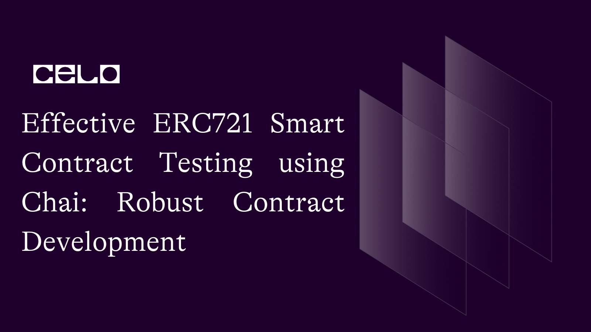

## Introduction

Welcome! Welcome!! Welcome!!! to another tutorial, This tutorial is part of a bigger NFT series and the aim of this is to help one become an expert in building NFT marketplaces as we know, NFTs are the future.

## Prerequisites

Building this dapp, you would need:

- Solid understanding of Javascript
- Basic grasp of solidity
- Basic Understanding of the Chai framework

## Requirements

- VSCode or any other editor
- A terminal
- React
- Chai
- Hardhat

## Installing Chai

Chai is a popular assertion library used for testing JavaScript code, including smart contracts on blockchain platforms like Ethereum and Celo. The process of installing Chai in a JavaScript project involves a few simple steps:

1. Open your terminal and navigate to your project directory.
2. Install Chai using npm, the Node.js package manager, by running the following command:

```bash
npm install chai
```

3. This will download and install Chai and its dependencies into your project's `node_modules` folder.
4. Once Chai is installed, you can import it into your JavaScript code using the `require` function:

```js
const chai = require("chai");
```

This will make the Chai library available for use in your code.

We can test this out by writing basic tests to see if it works:

You can use Chai's assertion functions to test your code. For example, the following code uses Chai's assert function to check that a variable x has the value 42:

```js
const assert = chai.assert;
let x = 42;
assert.equal(x, 42);
```

This will throw an error if `x` does not have the expected value of 42.

And now you know chai works. Now lets move to building our tests for our smart contract.

First, for those who didn't follow previous tutorials, here is the full contract code:

## MyNft.sol

```solidity
// SPDX-License-Identifier: MIT
pragma solidity ^0.8.0;

import "@openzeppelin/contracts/token/ERC721/ERC721.sol";
import "@openzeppelin/contracts/token/ERC721/extensions/ERC721Enumerable.sol";
import "@openzeppelin/contracts/token/ERC721/extensions/ERC721URIStorage.sol";
import "@openzeppelin/contracts/access/Ownable.sol";
import "@openzeppelin/contracts/utils/Counters.sol";

contract MyNFT is ERC721, Ownable, ERC721Enumerable, ERC721URIStorage {
    using Counters for Counters.Counter;

    Counters.Counter private _tokenIdCounter;
    address contractAddress;

    constructor(address marketplace) ERC721("Dripto Ponks", "DPT") {
        contractAddress = marketplace;
    }

    uint256 _tokenId = 0;

    function mint(string memory uri) external returns (uint256) {
        _tokenId++;
        _mint(msg.sender, _tokenId);
        _setTokenURI(_tokenId, uri);
        setApprovalForAll(contractAddress, true);
        return _tokenId;
    }

    function resaleApproval(uint256 tokenId) public {
        require(
            ownerOf(tokenId) == msg.sender,
            "You must own this NFT in order to resell it"
        );
        setApprovalForAll(contractAddress, true);
        return;
    }

    function getTokenId() external view returns (uint256) {
        return _tokenId;
    }

    // The following functions are overrides required by Solidity.

    function _beforeTokenTransfer(
        address from,
        address to,
        uint256 tokenId
    ) internal override(ERC721, ERC721Enumerable) {
        super._beforeTokenTransfer(from, to, tokenId);
    }

    function _burn(uint256 tokenId)
        internal
        override(ERC721, ERC721URIStorage)
    {
        super._burn(tokenId);
    }

    function tokenURI(uint256 tokenId)
        public
        view
        override(ERC721, ERC721URIStorage)
        returns (string memory)
    {
        return super.tokenURI(tokenId);
    }

    function supportsInterface(bytes4 interfaceId)
        public
        view
        override(ERC721, ERC721Enumerable)
        returns (bool)
    {
        return super.supportsInterface(interfaceId);
    }
}
```

## MyNftMarket.sol

```solidity
// SPDX-License-Identifier: MIT
pragma solidity ^0.8.0;

import "@openzeppelin/contracts/token/ERC721/IERC721.sol";

contract MyNftMarket {
	struct Listing {
		address payable seller;
        address payable owner;
		address token;
		uint tokenId;
		uint price;
        bool sold;
	}

	uint private _listingId = 0;
	mapping(uint => Listing) private _listings;

	function listToken(address token, uint tokenId, uint price) external {
		IERC721(token).transferFrom(msg.sender, address(this), tokenId);

		Listing memory listing = Listing(
			payable(msg.sender),
            payable(address(this)),
			token,
			tokenId,
			price,
            false
		);
		_listings[_listingId] = listing;
		_listingId++;

	}

	function getListing(uint listingId) public view returns (Listing memory) {
		return _listings[listingId];
	}

    function getListingLength()public view returns (uint){
        return _listingId;
    }

	function buyToken(uint listingId) public payable {
		Listing storage listing = _listings[listingId];

		require(msg.value == listing.price, "Insufficient payment");

		IERC721(listing.token).transferFrom(listing.owner, msg.sender, listing.tokenId);
		payable(listing.seller).transfer(msg.value);

        listing.sold = true;
        listing.price = listing.price * 2;
        listing.owner = payable(msg.sender);
		listing.seller = payable(msg.sender);

	}
}
```

## Writing Tests

Before you begin writing tests, you would create a folder specific for tests, in our case, it would be called `tests`then create a javascript file and name it whatever you want but in this case it would be `dripto-tests.js`.

Firstly, you would import the necessary functions from the required modules.

```js
const { expect } = require("chai");
const { ethers } = require("hardhat");
```

Here's a breakdown of each line:

- `const { expect } = require("chai");`: This line imports the `expect` assertion function from the Chai library using the `require` function. The `expect` function is used to define the expected behavior of a function or code block in a test case.

- `const { ethers } = require("hardhat");`: This line imports the `ethers` library from Hardhat. `ethers` is a JavaScript library that provides a clean, simple, and efficient way to interact with the Ethereum or Celo blockchain.

Together, these two lines of code import the necessary libraries for writing and testing smart contracts in a Hardhat project. They allow developers to use Chai's assertion functions and Hardhat's `ethers` library to write effective and efficient test cases for their smart contracts.

It's worth noting that the use of `const` indicates that these variables are declared as constants and cannot be reassigned once they are initialized. This helps ensure the stability and consistency of the testing environment.

Next, you are going to define two test suites and set a longer timeout for the test cases in the `MyNFT` suite. This allows the test cases in the `MyNFT` suite to take longer to execute, which may be necessary for more complex test cases or for cases where the blockchain network is slow to respond.

```js
describe("MyNftMarket", function () {});

describe("MyNFT", function () {
  this.timeout(50000);
```

The `describe` function is a feature of the Mocha testing framework for JavaScript, which is commonly used for testing smart contracts on blockchain platforms like Ethereum and Celo. The `describe` function is used to define a test suite, which is a collection of related test cases that test a specific functionality or feature of a smart contract.

Here's a breakdown of each line of code:

`describe("MyNftMarket", function () {});`: This line defines a test suite named `MyNftMarket`. The empty function block {} is where the individual test cases for this suite would be defined. The `describe` function is typically used to group related test cases together and provide context for the tests.

`describe("MyNFT", function () {`): This line defines a second test suite named MyNFT. Like the first describe block, the empty function block {} is where the individual test cases for this suite would be defined.

`this.timeout(50000);`: This line sets a timeout of 50 seconds (50000 milliseconds) for each test case in the `MyNFT` test suite. A timeout is the maximum amount of time that a test case is allowed to run before it is considered failed. By default, Mocha has a timeout of 2000 milliseconds (2 seconds) for each test case, but this can be adjusted using the timeout function.

Next, we are going to initialize our variables and retrieve contract factories and account references that will be used in the actual test case.

```js
  let myNFT;
  let owner;
  let acc1;
  let acc2;
  let market;

  it("Should create and execute market sales", async function () {
    const MyNFT = await ethers.getContractFactory("MyNFT");
    [owner, acc1, acc2] = await ethers.getSigners();
```

This code is part of a test case in a JavaScript project that involves writing and testing smart contracts on the Ethereum or Celo blockchain using the Hardhat development environment and the Mocha testing framework.

Here's a breakdown of each line:

`let myNFT; let owner; let acc1; let acc2; let market;`: These lines declare several variables that will be used in the test case. The `myNFT` variable will be used to store an instance of the `MyNFT` contract, while `owner`, `acc1`, and `acc2` will be used to store references to different Ethereum or Celo accounts. The market variable will be used to store an instance of a market contract (not shown in this code snippet).

`it("Should create and execute market sales", async function () {`: This line defines a new test case using the it function from Mocha. The first argument of the it function is a description of the test case, while the second argument is an async function that contains the actual test code.

`const MyNFT = await ethers.getContractFactory("MyNFT");`: This line uses the getContractFactory function from Hardhat's `ethers` library to get a reference to the `MyNFT` contract factory. A contract factory is a JavaScript object that can be used to create new instances of a smart contract.

`[owner, acc1, acc2] = await ethers.getSigners();`: This line uses the getSigners function from Hardhat's `ethers` library to get references to three Celo accounts. These accounts will be used to simulate different users interacting with the smart contract.

Next, we are going to create new instances of two smart contracts, `MyNFT` and `MyNftMarket`, and ensure that they are deployed to the blockchain before any tests are run.

```js
const MyNftMarket = await ethers.getContractFactory("MyNftMarket");
market = await MyNftMarket.deploy();
await market.deployed();

myNFT = await MyNFT.deploy(market.address);
await myNFT.deployed();
```

The code uses the `getContractFactory` function from the `ethers` library to obtain a reference to the `MyNftMarket` contract factory.

You then creates a new instance of the `MyNftMarket` contract by calling the `deploy` function on the `MyNftMarket` contract factory. Once the contract is deployed, the function waits for the deployment to complete by calling the deployed function on the contract instance.

Then, a new instance of the `MyNFT` contract is created by calling the deploy function on the `MyNFT` contract factory. This instance requires the address of the `MyNftMarket` instance as a constructor argument, which is passed to the deploy function.

You then wait for the deployment of the MyNFT contract to complete by calling the `deployed` function on the `MyNFT` instance.

Following this, you would write a test that will create and mint a new NFT to the account that called the `mint` function, with a metadata URL of "https://example.com/1" and an auction price of 1 Ether.

```js
const auctionPrice = ethers.utils.parseUnits("1", "ether");

const nftContractAddress = myNFT.address;
const transaction = await myNFT.mint("https://example.com/1");
```

In this code, a variable named `auctionPrice` is defined using the `parseUnits` function from the `ethers.utils` library. The `parseUnits` function is used to convert a decimal value to the base unit of the currency, which in this case is Ether. The value "1" is passed as the first argument to `parseUnits` to specify the value to be converted, and "ether" is passed as the second argument to specify the base unit of the currency.

Next, the `nftContractAddress` variable is assigned the address of the `myNFT` contract instance that was previously deployed. This variable will be used in the next line to call the mint function on the `myNFT` contract instance.

The `mint` function is then called on the `myNFT` contract instance with the argument "https://example.com/1". This function call creates a new NFT with the given metadata URL and mints it to the account that called the function. The `await` keyword is used to wait for the transaction to be mined on the blockchain and a transaction object is returned, which contains information about the transaction such as the transaction hash and gas used.

After creating a new NFT using the `mint` function in the previous code block, this code is used to list the newly created NFT for sale on the `MyNftMarket` contract instance.

```js
await market.listToken(nftContractAddress, 1, auctionPrice);
const tx = await transaction.wait();
const tokenId = tx.events[0].args[2].toNumber();
```

The `await` keyword is used to wait for the `listToken` function on the `market` contract instance to be executed. This function takes three arguments - the address of the NFT contract (`nftContractAddress`), the ID of the NFT (`1`), and the auction price (`auctionPrice`). This function call will list the NFT with the given ID for sale on the `market` contract instance at the specified auction price.

The next line `const tx = await transaction.wait();` waits for the transaction to be mined on the blockchain and then assigns the transaction object to a variable named tx.

The `tokenId` variable is then assigned the ID of the newly listed NFT by accessing the `args` object of the first event emitted by the `wait` function call. The `toNumber()` function is used to convert the ID from a BigNumber object to a regular number.

Following this, this code is used to simulate two different buyers purchasing the NFT that was listed for sale in the previous code block.

```js
await market.connect(acc1).buyToken(0, { value: auctionPrice });
const t = await myNFT.connect(acc1).resaleApproval(tokenId);
await market.connect(acc2).buyToken(0, { value: auctionPrice });
```

The first line uses the `await` keyword to wait for the `buyToken` function on the `market` contract instance to be executed. This function call is executed by `acc1`, one of the accounts created earlier. The `buyToken` function takes two arguments - the ID of the NFT being purchased (0) and an object with the value key set to the `auctionPrice` that was previously set for the NFT. This transaction will transfer the NFT ownership from the original owner to acc1.

The next line, `const t = await myNFT.connect(acc1).resaleApproval(tokenId);` approves the resale of the NFT by `acc1`. This step is necessary because the NFT now belongs to `acc1` and can only be resold by their approval. The `resaleApproval` function on the `myNFT` contract instance is used to give this approval, with the `tokenId` being passed as the only argument.

The third line of code executes the purchase of the same NFT by a different account, `acc2`. The `buyToken` function is called again on the `market` contract instance, this time with `acc2` as the buyer. The NFT is transferred to `acc2` and the purchase is complete.

After this, you would want to print the URIs of all active listings on our NFT marketplace to the console, allowing users to browse and purchase NFTs.

```js
    const listingLength = await market.getListingLength();

    for (let index = 0; index < listingLength; index++) {
      const listing = await market.getListing(index);
      const [seller, owner, token, tokenId, price, sold] = listing;
      // console.log(seller, owner, token, tokenId);
      const tokenUri = await myNFT.tokenURI(tokenId);
      console.log(tokenUri);
        }
    });

```

First, you would call the `getListingLength()` function to get the number of active listings on the market. We store the length in the `listingLength` variable.

You then create a loop that will iterate through each active listing on the marketplace. Inside the loop, you call the `getListing()` function, passing in the current index of the loop as the argument, to retrieve the details of the listing.

The returned listing is an array of values, which you then destructure and store in variables for readability. The `seller` variable represents the address of the seller, `owner` represents the address of the current owner of the NFT, `token` represents the address of the NFT contract, `tokenId` represents the ID of the NFT, `price` represents the current price of the NFT, and `sold` is a boolean value indicating whether the NFT has been sold or not.

Inside the loop, you also call the `tokenURI()` function of our `MyNFT` contract, passing in the `tokenId` of the NFT. This function returns the URI associated with the NFT, which you then print to the console using `console.log()`.

By the end of the loop, you have printed the URIs of all active listings on our NFT marketplace to the console, allowing users to browse and purchase NFTs.

And there you have it, a full test written to explore the functionalities of your smart contract.

Here is the full code:

```js
const { expect } = require("chai");
const { ethers } = require("hardhat");

describe("MyNftMarket", function () {});

describe("MyNFT", function () {
  this.timeout(50000);

  let myNFT;
  let owner;
  let acc1;
  let acc2;
  let market;

  it("Should create and execute market sales", async function () {
    const MyNFT = await ethers.getContractFactory("MyNFT");
    [owner, acc1, acc2] = await ethers.getSigners();

    const MyNftMarket = await ethers.getContractFactory("MyNftMarket");
    market = await MyNftMarket.deploy();
    await market.deployed();

    myNFT = await MyNFT.deploy(market.address);
    await myNFT.deployed();

    const auctionPrice = ethers.utils.parseUnits("1", "ether");

    const nftContractAddress = myNFT.address;
    const transaction = await myNFT.mint("https://example.com/1");

    await market.listToken(nftContractAddress, 1, auctionPrice);

    const tx = await transaction.wait();
    const tokenId = tx.events[0].args[2].toNumber();

    await market.connect(acc1).buyToken(0, { value: auctionPrice });
    const t = await myNFT.connect(acc1).resaleApproval(tokenId);
    await market.connect(acc2).buyToken(0, { value: auctionPrice });

    const listingLength = await market.getListingLength();

    for (let index = 0; index < listingLength; index++) {
      const listing = await market.getListing(index);
      const [seller, owner, token, tokenId, price, sold] = listing;
      const tokenUri = await myNFT.tokenURI(tokenId);
      console.log(tokenUri);
    }
  });
});
```

## Running Tests

Once the test file is in place, you can run the tests using the `npx hardhat test` command in your terminal. This will compile your smart contract code, deploy the contracts to your local blockchain network, and run the tests defined in your test file.

If everything is set up correctly and your smart contract code is functioning as expected, you should see the output of the `console.log()` statements in your terminal, which in this case would be the URI of the NFTs being sold.

## Conclusion

Well done on completing this tutorial 🚀. In this tutorial, you should have gained a better understanding of how to write suitable tests for your smart contracts using this powerful testing framework.

You should have learned how to install and configure Chai in your JavaScript project, and how to write different types of tests such as assertions and expectations.

Additionally, you should have a clear understanding of how to use Chai in combination with Mocha to test your smart contracts and identify any issues or errors before deploying them on the blockchain.

By mastering the concepts covered in this tutorial, you should be well-equipped to build robust and reliable smart contracts that can be trusted by users and other stakeholders.

## Next steps

You could take it a step further and follow my published tutorials on more intermediate topics. You can have a look at the full file [here](https://github.com/dahnny/dripto-ponks/blob/master/test/nft-test.js)

## About the Author

Daniel Ogbuti is a web3 developer with a passion for teaching as well as learning. I would love to connect on Twitter @daniel_ogbuti and linkedin @ Daniel Ogbuti

See you soon!
