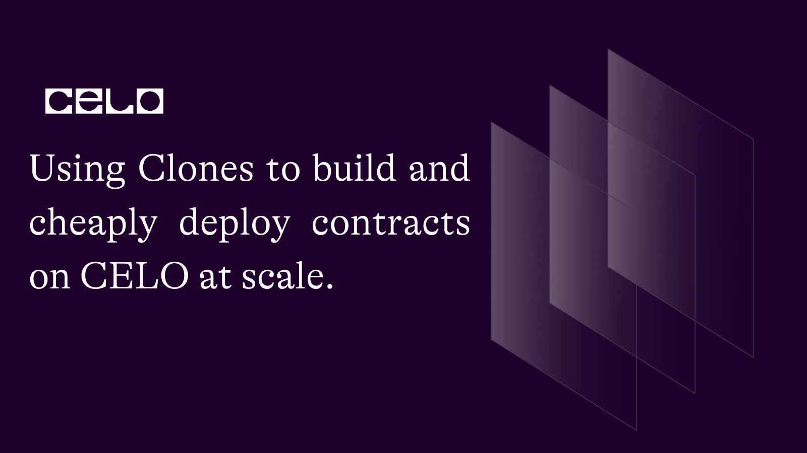
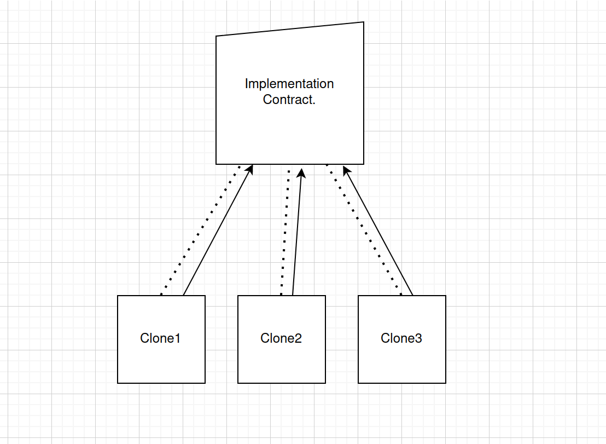
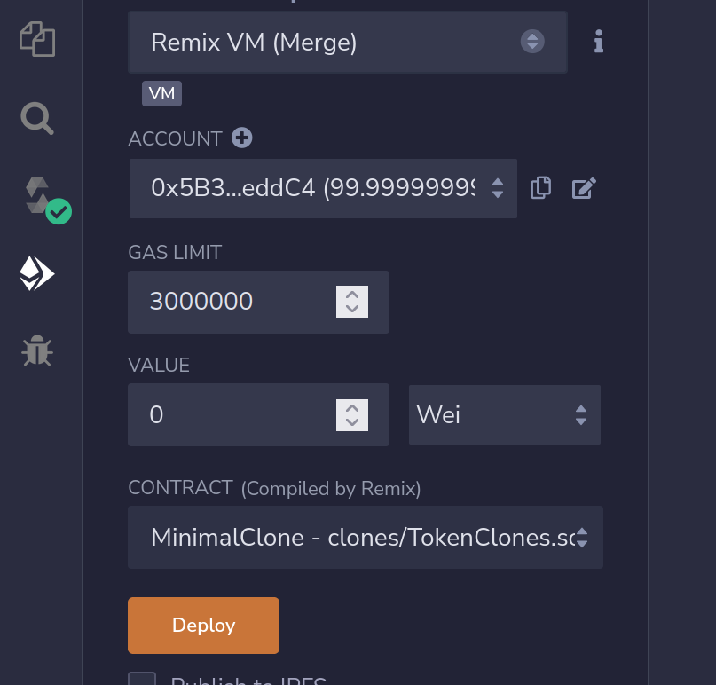
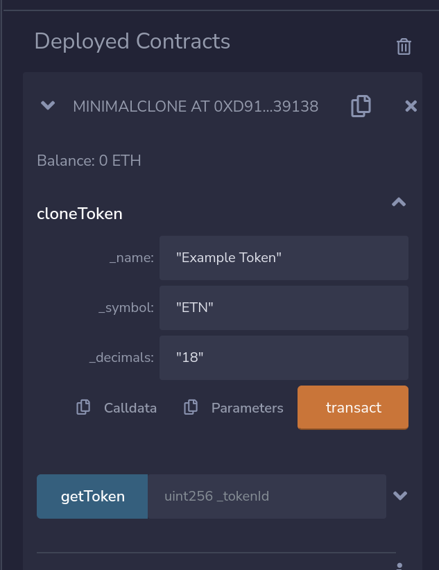
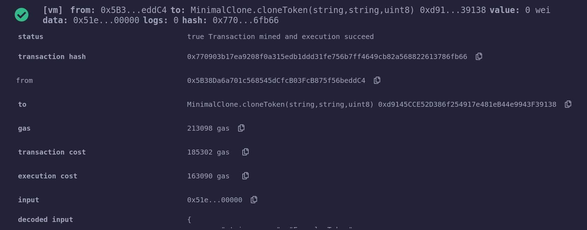
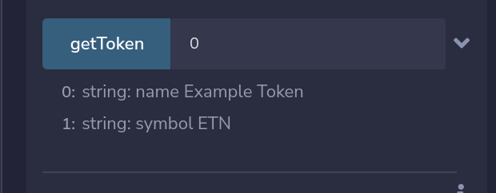
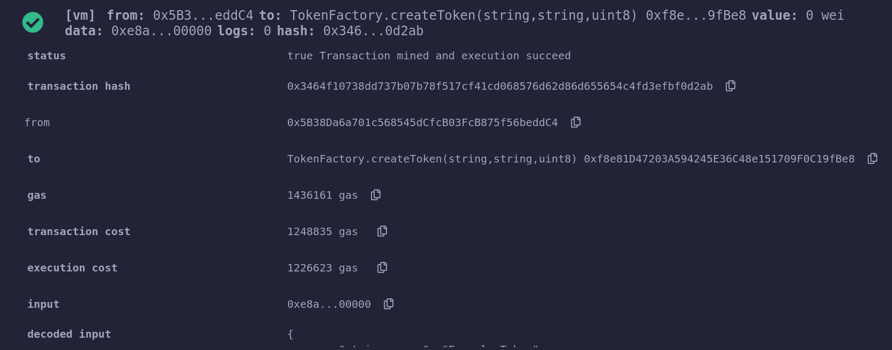

## Introduction​

The cost of deploying smart contracts on the blockchain is mostly proportional to the size of the runtime bytecode that ends up being stored on the blockchain, this is detailed in the Ethereum Yellow Paper, and is true for all EVM compatible blockchains, for which CELO is no exception.  
In this article, I present a novel approach for deploying contracts on-chain with minimal runtime bytecode, hence reducing the cost of your deployment significantly.  
To further drive the point home, I'll compare the gas cost of this approach with the commonly used Factory approach, so we can verify the result for ourselves. Remember: Don’t trust, verify!

## Prerequisites​

In order to fully grasp the lessons from this tutorial, you should posses:

- A good understanding of solidity and how libraries work.
- Be able to navigate remix IDE.

## The Clones Factory

1. The Clones Factory is also referred to in certain contexts as Minimal proxy. The Clones approach to deploying smart contracts works as such:  
   First, an implementation contract is defined, and stripped off the constructor, and then deployed to an address. The primary responsibility of this implementation contract is to define the bytecode that would include the logic to be used by the clones. This is possible by means of delegatecall, more on that later.

1. The clones contracts are then deployed with the address of the implementation contract above in their bytecode. The address of the implementation contract is needed as calls to the clones would be delegated to the implementation contracts which as we said earlier defines (or implements) all the logic needed by the clones. By crafting the bytecode of the clones with the address of the implementation and minimal instruction set that essentially prepares and executes the delegate call, the bytecode clones are reduced drastically, hence making them cheap to deploy.

## Graphical Illustration on clones



Two things to take cognizance of from the diagram above are:

1. The dotted lines indicate that is linked to an implementation contract, by specifying the address of the implementation contracts in its bytecode.
1. The arrow lines indicate that calls to the clones are delegated to this implementation.
   Note: There can be as many clones as possible, there’s no limit here.

## Code Walkthrough

We will be making use of the Remix IDE for this session, so simply open remix in a separate tab and create a new directory, you can name it anything you like, but i have called mine `clones` for this tutorial.  
Next we’d leverage the modern ERC20 contract from this [maple repository](https://github.com/maple-labs/erc20/blob/main/contracts/ERC20.sol). Simply create a file in your newly created folder in remix, you can name it ERC20.sol anc copy over the code from the contract at this [gist file](https://gist.github.com/nuel-ikwuoma/36f8eef7dfc9aecc21a2bf4fd4ff1d50) which I’ve slightly modified for this tutorial. You can rename the contract to `MyToken` and change the import on Line 4 to point to an absolute URL as shown below.

```solidity
import "https://github.com/maple-labs/erc20/blob/main/contracts/interfaces/IERC20.sol";
```

This URL points to the interface which our contracts extends from, so all should be good from here.
At this point our token contracts should be ERC20 compatible and have a constructor that looks like so:

```solidity
constructor(string memory name_, string memory symbol_, uint8 decimals_) {
       name     = name_;
       symbol   = symbol_;
       decimals = decimals_;
   }
```

The constructor part of a contract is the most important construct to consider when adjusting a contract to be clones or minimal proxy compatible.  
Now, since the clones would delegate calls to the implementation, which is our MyToken contract, It means we cannot have a constructor in this contract, as it would be called only once on deployment and that's it.  
However the clones maintain separate states from each other, and would need a way to initialize their own state when deployed.  
To achieve this, we would change this constructor into an initialization function that would be called on deploying the clones, hence initializing their state appropriately.

```solidity
function initialize(string memory name_, string memory symbol_, uint8 decimals_) external {
       name     = name_;
       symbol   = symbol_;
       decimals = decimals_;
   }
```

Here we have changed our constructor to the function `initialize`, the logic remains the same.  
Now we would proceed to define our clones factory contract, by creating a new file, i called mine TokenClone.sol, and populate the contents as so:

```solidity
// SPDX-License-Identifier: GPL-3.0
pragma solidity ^0.8.14;


import "https://github.com/OpenZeppelin/openzeppelin-contracts/blob/master/contracts/proxy/Clones.sol";


import "./ERC20.sol";


contract MinimalClone {
   using Clones for address;


   MyToken implementation;

   address[] myTokens;


   constructor() {
       implementation = new MyToken();
   }


   function cloneToken(string memory _name, string memory _symbol, uint8 _decimals) external {
       address myToken = address(implementation).clone();
       MyToken(myToken).initialize(_name, _symbol, _decimals);
       myTokens.push(myToken);
   }


   function getToken(uint256 _tokenId) external view returns(string memory name, string memory symbol) {
       name = MyToken(myTokens[_tokenId]).name();
       symbol = MyToken(myTokens[_tokenId]).symbol();
   }
}
```

In this file we leverage the [openzeppelin clones library](https://github.com/OpenZeppelin/openzeppelin-contracts/blob/master/contracts/proxy/Clones.sol), which as you may have guessed would be used for creating and deploying the clones. I would refer to the clones as token clones moving forward, because we are essentially cloning multiple instances of our MyToken contract, however each are independent, just as though they were created by a factory.  
Now we use the imported clones library on the solidity address type by using this line of code:

```solidity
using Clones for address;
```

This essentially tells our compiler to attach functions defined in that library to the address type,hence these functions can be called as methods on the address type.
Next up, in the constructor, we simply deploy the MyToken contract, which is the implementation contract, and store this deployment to our contract state as `implementation`  
Then we define the function cloneToken that takes three arguments which would be used to initialize each deployed clone. In this function we simply create a clone by calling the clone method on the address of the implementation, and then we call the initialize function to initialize this clone, and that's it.  
We save each deployed clone to our contract state, so we can retrieve their information later.  
Now all that's left is to compile the contract using Ctrl/Cmd + S shortcut. Then we hit the deploy button as shown.



Now under the deployed contract section, we can call the function to deploy our token clones as shown:



Let's have a peek at the gas cost here:



We can see that the transaction costs about 185K gas to deploy a token clone contract, this is pretty impressive. In the upcoming section below, we would compare this gas cost to a basic factory pattern, standby.  
Then we verify that our token was indeed deployed by calling the ‘getToken’ function with `_tokenId` argument of 0. The result is shown:



We can play around this contract calling `cloneToken` multiple times with different arguments and then call `getToken` to verify that the token clones indeed have separate states.

## Gas Cost Comparison of Clones vs Factory approach

Now, to the meat of this article, which is the point that clones deployment are much cheaper that using factories, I created a Factory contract which i called TokenFactory.sol, this contract have been slightly adjusted to match the one used in this awesome celosage article that introduces the factory pattern, as a result we would have to re-adjusted the MyToken contract to its initial form which uses the constructor, since basic factory deployment relies on constructors. The Factory contract looks as so:

```solidity
// SPDX-License-Identifier: GPL-3.0
pragma solidity ^0.8.14;


import "./ERC20.sol";


contract TokenFactory {
   MyToken[] public tokens;


   function createToken(string memory _name, string memory _symbol, uint8 _decimals) external {
       tokens.push(new MyToken(_name, _symbol, _decimals));
   }


   function getToken(uint256 _tokenId) external view returns(string memory name, string memory symbol) {
       name = tokens[_tokenId].name();
       symbol = tokens[_tokenId].symbol();
   }
}
```

Now we would deploy and call the function `createToken` and compare the gas cost.



We see that this costs an astronomical amount of gas, putting the transaction cost at 1.2 million gas. Now that's a lot of gas!, and the minimal clones approach is about seven times cheaper on every deployment. The gas saving scales pretty well for multiple token deployment.

| Minimal Clones   | Basic Factory           |
| :--------------- | :---------------------- |
| 185k gas approx. | 1.2 million gas approx. |

## Use Cases

Clones can be used in also any context where the Factory pattern is needed, like for example:

1. Deploying exchange token pairs on a decentralized exchange
1. Creating custom ERC20 or ERC721 tokens for a multitude of users on demand

And the list goes on. However, an advantage of this approach is that we can reduce the gas cost significantly, hence making it cheaper for people to use and interact with our application.

## Optimization

Eagle eyed readers might have notice that the MyToken contract that we deployed in the constructor of the MinimalClone contract could have been skipped altogether, hence we can simply point our token clone to an already deployed implementation on-chain if one exists, further saving gas cost for the MinimalClone contract deployment itself.

## Conclusion

If multiple copies of the same contract need to be deployed at scale, the clones or minimal proxy approach is the way to go, used in applications, it effectively reduces the gas cost when interacting with such applications.

## About the author

[Nuel](https://twitter.com/nuel_ikwuoma) is a web and blockchain engineer, with passion for building Decentralized applications, and writing highly optimized smart contracts.

## Resources

- [EIP 1167 - Minimal Proxy](https://eips.ethereum.org/EIPS/eip-1167)
- [contract deployment with factory pattern](https://docs.celo.org/blog/tutorials/how-to-build-and-deploy-factory-contracts-on-celo#factory-contract-use-cases)
- [Maple-labs Modern ERC20](https://github.com/maple-labs/erc20/blob/main/contracts/ERC20.sol)
- [Source Code](https://github.com/nuel-ikwuoma/minimal-proxies)
