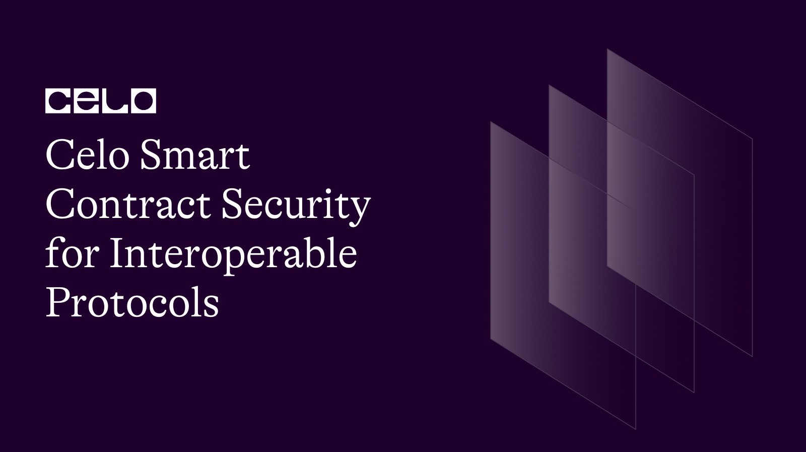

## Introduction

Celo is a mobile-first blockchain platform that enables decentralized applications to be built with ease. One of the key features of Celo is its interoperability with other blockchain networks. Interoperability allows for seamless communication between different blockchains, which is essential for creating a decentralized ecosystem.

In this tutorial, we will provide an in-depth guide on implementing security measures in Celo smart contracts for interoperable protocols. We will discuss secure coding practices, leveraging the OpenZeppelin library, and performing security audits while putting a stronger emphasis on interoperability.

You can find the code from this tutorial [Here](https://github.com/4undRaiser/Advance-Celo-Smart-Contract-Security-Pathway/tree/main/Bridge_Contract_Security)

## Prerequisites

To follow this tutorial, you will need the following:

- Basic understanding of Solidity and smart contracts
- A Development Environment Like Remix.
- Access to the OpenZeppelin library.
- The celo Extension Wallet.

## Interoperability

Interoperability enables different blockchain networks to communicate and exchange information with each other, providing the foundation for a truly decentralized ecosystem. It is achieved through the use of standardized protocols and technologies that enable cross-chain communication.

For Celo, interoperability is achieved through the use of bridging technologies such as the Celo-Ethereum bridge, which allows for the transfer of assets between the Celo and Ethereum networks. This bridge enables Celo smart contracts to interact with Ethereum smart contracts and vice versa.

## Secure Coding Practices for Interoperable Protocols

Secure coding practices are essential for creating secure Celo smart contracts for interoperable protocols. Here are some best practices to keep in mind:

1. Use standard protocols: When creating interoperable Celo smart contracts, it is essential to use standard protocols such as ERC20 and ERC721 to ensure compatibility with other blockchain networks.

2. Use standard messaging formats: When communicating with other blockchain networks, it is important to use standard messaging formats such as JSON-RPC or RESTful APIs to ensure compatibility.

3. Use standard identifiers: Use standard identifiers such as Ethereum addresses and contract ABIs when interacting with other blockchain networks to ensure that the correct contract is being accessed.

4. Handle multiple chain environments: Interoperability requires the ability to handle multiple blockchain environments. Ensure that your Celo smart contracts can handle multiple chain environments, including different consensus algorithms and transaction formats.

## Leveraging the OpenZeppelin Library for Interoperable Protocols

OpenZeppelin is a library of secure smart contracts for Ethereum-based blockchain networks, including Celo. It provides a set of tested and audited contracts that can be used to build secure applications. Here are some contracts from the OpenZeppelin library that can be leveraged in Celo smart contracts for interoperable protocols:

1. ERC20: The ERC20 contract is a standard for fungible tokens on the Ethereum network and can be adapted for use on other blockchain networks, including Celo.

2. ERC721: The ERC721 contract is a standard for non-fungible tokens on the Ethereum network and can also be adapted for use on other blockchain networks.

3. Bridging contracts: Bridging contracts are smart contracts that facilitate the transfer of assets between different blockchain networks. These contracts can be used to create interoperable protocols that enable the transfer of assets between Celo and other blockchain networks.

## Performing Security Audits for Interoperable Protocols

Performing security audits is essential for ensuring that your Celo smart contracts for interoperable protocols are secure. Audits can be performed by third-party security firms or by using automated security tools such as Mythril or Slither. Here are some tips for performing security audits for interoperable protocols:

1. Test for compatibility: Ensure that your Celo smart contract is compatible with the standard protocols and messaging formats used by other blockchain networks.

2. Review the code: Review the code for logic errors, race conditions, and other vulnerabilities that may arise when interacting with other blockchain networks.

3. Test for interoperability: Test your Celo smart contract to ensure that it functions correctly when interacting with other blockchain networks.

## Celo-Polygon Bridge with Security Measures

The Celo-Polygon bridge is a smart contract system that enables the transfer of assets between the Celo and Polygon (formerly Matic) networks.

```solidity
// SPDX-License-Identifier: MIT
pragma solidity ^0.8.0;

import "@openzeppelin/contracts/token/ERC20/IERC20.sol";
import "@openzeppelin/contracts/access/Ownable.sol";

contract CELO_POLYGON_Bridge is Ownable {
    IERC20 public celo;
    address public celoAddress;
    mapping (bytes32 => bool) public usedNonces;
    mapping (address => uint256) public lockedTokens;
    uint256 public lockTime;
    uint256 public unlockTime;
    address[] public signers;
    mapping (address => bool) public authorized;

    event Locked(address indexed sender, uint256 indexed amount, bytes32 indexed nonce, uint256 lockTime);
    event Unlocked(address indexed recipient, uint256 indexed amount, uint256 unlockTime);

    constructor(address _celoAddress, uint256 _lockTime, uint256 _unlockTime, address[] memory _signers) {
        celo = IERC20(_celoAddress);
        celoAddress = _celoAddress;
        lockTime = _lockTime;
        unlockTime = _unlockTime;
        signers = _signers;

        for (uint256 i = 0; i < signers.length; i++) {
            authorized[signers[i]] = true;
        }
    }

    function lock(uint256 amount, bytes32 nonce) public {
        require(amount > 0, "Amount must be greater than 0");
        require(!usedNonces[nonce], "Nonce has already been used");

        bool success = celo.transferFrom(msg.sender, address(this), amount);
        require(success, "Transfer failed");

        usedNonces[nonce] = true;
        lockedTokens[msg.sender] += amount;
        emit Locked(msg.sender, amount, nonce, block.timestamp + lockTime);
    }

   function unlock(address recipient, uint256 amount, bytes memory signature, bytes32 nonce) public {
    require(amount > 0, "Amount must be greater than 0");

    bytes32 message = keccak256(abi.encodePacked(recipient, amount, nonce, usedNonces[nonce]));
    bytes32 hash = keccak256(abi.encodePacked("\x19Ethereum Signed Message:\n32", message));
    address signer = recover(hash, signature);

    require(authorized[signer], "Invalid signature");
    require(block.timestamp <= unlockTime, "Unlocking period has ended");
    require(!usedNonces[nonce], "Nonce has already been used");

    usedNonces[nonce] = true;
    bool success = celo.transfer(recipient, amount);
    require(success, "Transfer failed");

    emit Unlocked(recipient, amount, block.timestamp + unlockTime);
}

    function claimLockedTokens() public {
        require(block.timestamp >= lockedTokens[msg.sender], "Tokens are not yet unlocked");

        uint256 amount = lockedTokens[msg.sender];
        lockedTokens[msg.sender] = 0;

        bool success = celo.transfer(msg.sender, amount);
        require(success, "Transfer failed");
    }

    function recover(bytes32 hash, bytes memory signature) internal pure returns (address) {
        bytes32 r;
        bytes32 s;
        uint8 v;

        if (signature.length != 65) {
            return address(0);
        }

        assembly {
            r := mload(add(signature, 32))
            s := mload(add(signature, 64))
            v := byte(0, mload(add(signature, 96)))
        }

        if (v < 27) {
            v += 27;
        }

        if (v != 27 && v != 28) {
            return address(0);
        } else {
            return ecrecover
(hash, v, r, s);
        }
    }
}
```

In this example, we have created a simple bridge contract that enables the transfer of CELO tokens from the Celo network to the Polygon network. The `lock` function locks CELO tokens on the Celo network, while the `unlock` function unlocks them on the Polygon network.

We also implemented time-based Locking and Unlocking. This involves adding a time limit to the locking and unlocking process, so that tokens can only be locked or unlocked within a certain time frame.

The `lockTime` and `unlockTime` variables specify the time periods for locking and unlocking tokens, respectively.

This can help prevent attacks such as front-running and re-entrancy attacks, which can occur if an attacker tries to exploit the time lag between locking and unlocking tokens.

To add more security measures to the bridge, We added multi-signature authorization. This involves requiring multiple signatures from different parties in order to unlock tokens.

This can help prevent attacks such as theft or loss of private keys, as well as insider attacks where a single party may have too much control over the unlocking process.

## Deployment

To deploy our smart contract successfully, we need the celo extention wallet which can be downloaded from [here](https://chrome.google.com/webstore/detail/celoextensionwallet/kkilomkmpmkbdnfelcpgckmpcaemjcdh?hl=en)

Next, we need to fund our newly created wallet which can done using the celo alfojares faucet [Here](https://celo.org/developers/faucet)

Now, click on the plugin logo at the bottom left corner and search for celo plugin.

Install the plugin and click on the celo logo which will show in the side tab after the plugin is installed.

Next connect your celo wallet, select the contract you want to deploy and finally click on deploy to deploy your contract.

## Conclusion

Creating secure Celo smart contracts for interoperable protocols is essential for building a decentralized ecosystem that spans multiple blockchain networks. Secure coding practices, leveraging the OpenZeppelin library, and performing security audits are all important aspects of creating secure contracts for interoperable protocols. By following these best practices and tips, you can create Celo smart contracts that are secure and interoperable with other blockchain networks, enabling the creation of a decentralized ecosystem.

## Next Steps

I hope you learned a lot from this tutorial. Here are some relevant links that would aid your learning further.

- [Celo Docs](https://docs.celo.org/)
- [Solidity Docs](https://docs.soliditylang.org/en/v0.8.17/)

## About the author

I'm Jonathan Iheme, A full stack block-chain Developer from Nigeria.

[linkedIn](https://www.linkedin.com/in/jonathan-iheme-31a63718b/)
[Twitter](https://twitter.com/iheme_jonathan)
