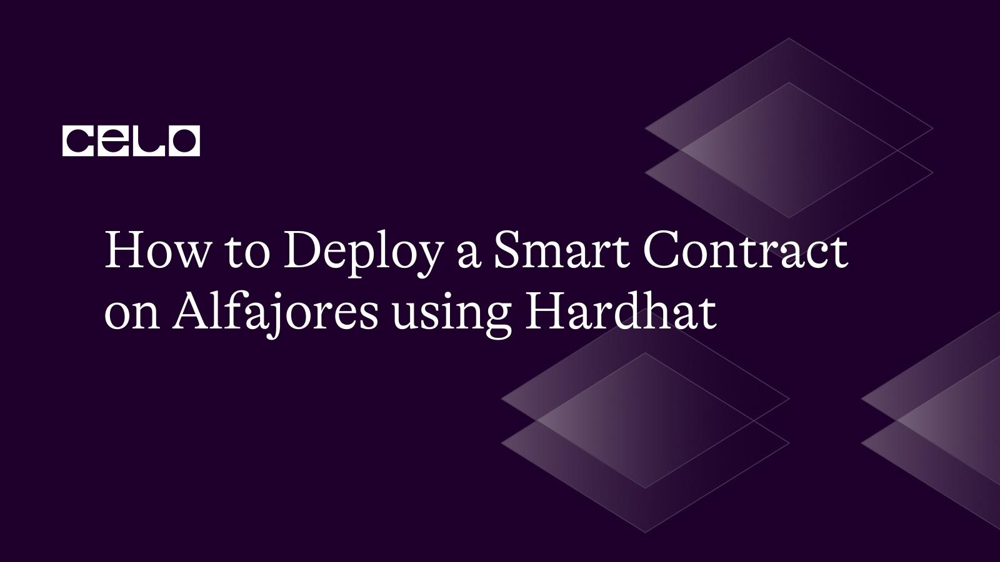

import YouTube from '@components/YouTube';

## Introduction

In this video, we will walk through the process of deploying a smart contract on the Celo Alfajores testnet using Hardhat. The tutorial includes setting up environment variables, installing and configuring Hardhat, claiming testnet funds from the Celo faucet, and deploying a sample contract. Whether you're a beginner or a seasoned developer, this tutorial is a great resource for anyone looking to deploy smart contracts on the Celo network using Hardhat. Don't miss out on this informative and easy-to-follow guide!

## Prerequisites

1. Basic Knowledge of Javascript
2. Familiarity with Solidity Smart Contracts

## Video

<YouTube videoId="PDjg3lFEPxs"/>

[Video URL](https://www.youtube.com/watch?v=PDjg3lFEPxs)

## Resources

1. [Github Code Repository](https://github.com/iamoracle/celo-alfajores-hardhat)
2. [Celo Alfajores](https://faucet.celo.org)
3. [Valora](https://valoraapp.com)
4. [CeloScan Alfajores Explorer](https://alfajores.celoscan.io)
5. [Hardhat tutorial](https://docs.celo.org/developer/deploy/hardhat)

## Conclusion

This tutorial is a great resource for anyone looking to deploy smart contracts on the Celo network using Hardhat.

## Author

[Oyeniyi Abiola Peace](https://twitter.com/_iamoracle) is a seasoned software and blockchain developer. With a degree in Telecommunication Science from the University of Ilorin and over five years of experience in JavaScript, Python, PHP, and Solidity, he is no stranger to the tech industry. Peace currently works as the CTO at DFMLab and is a Community Moderator at Celo Blockchain. When he's not coding or teaching, he loves to read and spend time with family and friends.
