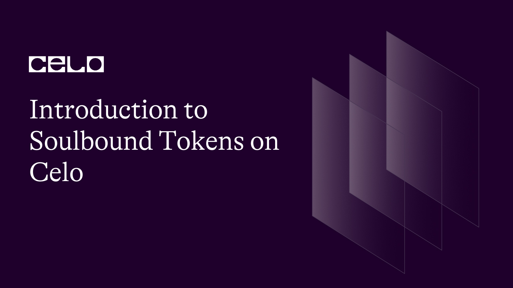

## Introduction

As the world transitions towards a decentralized and trustless economy, trust and reputation become even more critical in establishing credibility and fostering growth. Enter Soulbound Tokens (SBTs), **non-transferable** NFTs that represent a user's on-chain and off-chain credentials, activities, and affiliations in a web3 economy.

Unlike traditional tokens that are transferable, SBTs are non-transferable, meaning they cannot be exchanged or sold. Instead, they serve as a digital identity that is unique to the user, establishing their provenance and reputation on-chain. SBTs enable composable and scalable trust networks, allowing users to authenticate themselves and establish relationships with other participants in the ecosystem.

One of the key advantages of SBTs is their ability to represent both on-chain and off-chain credentials. This includes information such as academic qualifications, work experience, and social affiliations, among others. By encoding this information on the blockchain, SBTs provide a verifiable and tamper-proof record that can be accessed and verified by anyone on the network.

SBTs can also be used to establish reputation in a web3 economy. This is critical in a trustless system where participants may not know each other personally. Reputation is established through a user's activities and interactions on the network, and SBTs provide a way to capture and quantify these interactions. For example, a user who contributes to a community project may receive an SBT that reflects their contribution. This, in turn, can be used to establish their reputation and increase their credibility within the network.

The **use cases** for SBTs are numerous, ranging from identity management to access control and even governance. For example, SBTs can be used to grant access to exclusive content or services within a web3 platform. Similarly, they can be used to vote or participate in decision-making processes within a decentralized autonomous organization (DAO).

While Soulbound Tokens (SBTs) offer several advantages in a web3 economy, there are also some potential disadvantages to consider. Here are some of the drawbacks of SBTs:

- Lack of Transferability: SBTs are non-transferable, meaning that they cannot be sold or exchanged. While this is an advantage in terms of establishing a unique digital identity and reputation, it also limits the ability to monetize one's SBTs or trade them with others in the network.

- Centralized Issuance: SBTs are typically issued by a centralized authority, such as a platform or organization. This raises concerns around trust and control, as the issuer has the power to grant or revoke SBTs based on their own criteria. This could lead to centralization and exclusion of certain individuals or groups from the network.

- Potential for Exploitation: The quantification of activities and interactions on the network could lead to a "gamification" of reputation, where users may be incentivized to engage in certain activities solely for the purpose of earning SBTs and increasing their reputation. This could lead to a distortion of the true value of contributions and undermine the integrity of the network.

- Security Risks: SBTs are stored on the blockchain, which is vulnerable to hacks and attacks. If a user's SBTs are compromised, their digital identity and reputation could be at risk, potentially causing irreparable damage to their standing in the network.

- Lack of Interoperability: SBTs are unique to the platform or organization that issued them, which limits their interoperability with other networks or platforms. This could limit the potential for cross-platform collaboration and reduce the overall value of SBTs in a web3 economy.

## Code

To create a Soulbound Token using the ERC-721 contract shown above, you can follow these steps:

1.  Open the Solidity compiler, such as Remix or Hardhat, and create a new file named "SoulBoundToken.sol."
2.  Copy and paste the code above into the new file.
3.  Add any additional functions or variables that you may require for your specific use case. For example, you may want to add functions for setting metadata or accessing specific attributes of the token.
4.  Compile the contract to check for any errors or warnings.
5.  Deploy the contract to the Celo blockchain network
6.  Call the "safeMint" function to mint a new Soulbound Token. This function takes an address parameter that specifies the recipient of the token.
7.  The newly minted token will now be Soulbound, meaning that it cannot be transferred or traded. It can only be burned by the owner of the token.
8.  To burn the token, call the "burn" function and provide the token ID as a parameter. This will permanently destroy the token and remove it from the blockchain.

Overall, creating a Soulbound Token is relatively straightforward and can be achieved using the ERC-721 contract with a transfer override to ensure that the token is non-transferable. With this contract, you can establish a unique digital identity and reputation that cannot be bought, sold, or traded, providing a level of trust and authenticity in a web3 economy.

```solidity
// SPDX-License-Identifier: MIT
pragma solidity ^0.8.17;

import "@openzeppelin/contracts/token/ERC721/ERC721.sol";
import "@openzeppelin/contracts/utils/Counters.sol";
import "@openzeppelin/contracts/access/Ownable.sol";

contract Soulbound is ERC721, Ownable {
    using Counters for Counters.Counter;

    Counters.Counter private _tokenIdCounter;

    constructor() ERC721("Soulbound", "SBT") {}

    function safeMint(address to) public onlyOwner {
        uint256 tokenId = _tokenIdCounter.current();
        _tokenIdCounter.increment();
        _safeMint(to, tokenId);
    }

    function burn(uint256 tokenId) external {
        require(ownerOf(tokenId) == msg.sender, "Only the owner can burn it.");
        _burn(tokenId);
    }


    function _beforeTokenTransfer(address from, address to, uint256 tokenId, uint256 batchSize) pure internal override(ERC721) {
        require(from == address(0) || to == address(0), "The token can not be transfered or sold");
    }

    function _burn(uint256 tokenId) internal override(ERC721) {
        super._burn(tokenId);
    }
}
```

The code provided above is a Solidity smart contract that creates a Soulbound Token using the ERC-721 standard. The Soulbound Token is non-transferable, meaning it cannot be sold, traded, or transferred to other users once it has been minted. This ensures that the token retains its unique identity and reputation, which is important for use cases where trust and authenticity are critical.

Let's break down the code and understand how it works.

First, the contract imports three OpenZeppelin libraries: ERC721, Counters, and Ownable. The ERC721 library provides the implementation of the ERC-721 standard, which is used for creating non-fungible tokens (NFTs). The Counters library provides a convenient way to generate unique IDs for new tokens. The Ownable library provides a modifier that restricts access to certain functions to the contract owner.

The contract initializes a counter for generating new token IDs in the constructor. It also sets the name and symbol of the token using the ERC721 constructor.

The "safeMint" function allows the contract owner to mint new tokens and assign them to a specific address. It generates a new token ID using the Counters library, increments the counter, and then mints the new token using the \_safeMint function provided by the ERC721 library.

The "burn" function allows the owner of a token to destroy it permanently. It checks if the caller of the function is the owner of the token, and then calls the \_burn function provided by the ERC721 library to destroy the token.

The "\_burn" function overrides the implementation provided by the ERC721 library to ensure that the token is permanently destroyed when burned.

Finally, the "\_beforeTokenTransfer" function overrides the implementation provided by the ERC721 library to ensure that the token cannot be transferred or sold. It checks if either the "from" or "to" address is the zero address, which indicates either a new token is being minted or an existing token is being burned.

Overall, the Soulbound Token contract provides a straightforward way to create non-transferable tokens that can be used to establish trust and reputation on the blockchain.

You can see the full code [here](https://github.com/guizostudios/soulbound)

## Conclusion

In conclusion, SBTs represent a new paradigm in digital identity and reputation management in a web3 economy. By providing a verifiable and tamper-proof record of a user's credentials, activities, and affiliations, SBTs enable composable and scalable trust networks that can establish provenance and reputation on-chain. As the web3 economy continues to evolve, SBTs will undoubtedly play a critical role in shaping its growth and success.

While SBTs offer several advantages in establishing digital identity and reputation in a web3 economy, there are also some potential drawbacks that need to be considered. It will be important to carefully balance the benefits and risks of SBTs and address these challenges to ensure their continued adoption and success in the future

## Additional readings

[Introducing Prosperity Passport - The First Soulbound Token-Powered Web3 Identity Solution for Celo Blockchain](https://docs.celo.org/blog/tutorials/introducing-prosperity-passport-the-first-soulbound-token-powered-web3-identity-solution-for-celo-blockchain)

## About Author

I am a serial entrepreneur, founder of Guizo Studios and always available to help the Celo ecosystem.

[LinkedIn](https://www.linkedin.com/in/ewertonlopes/)
