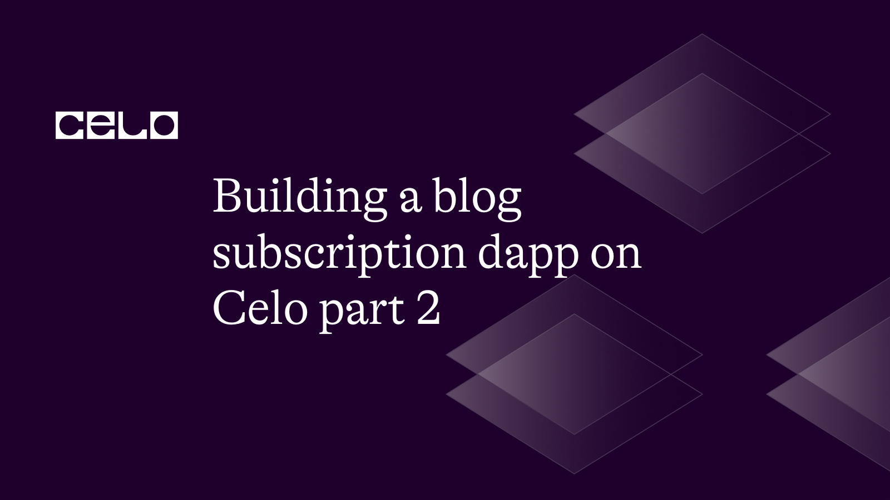
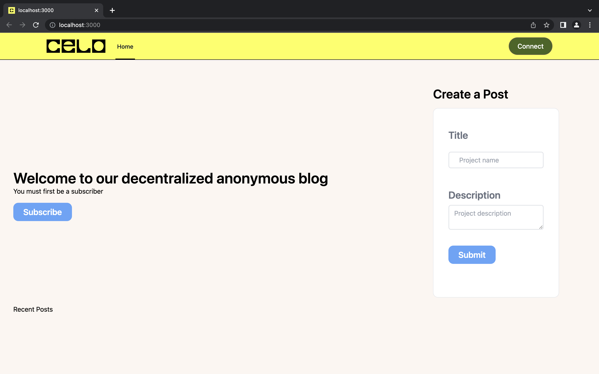
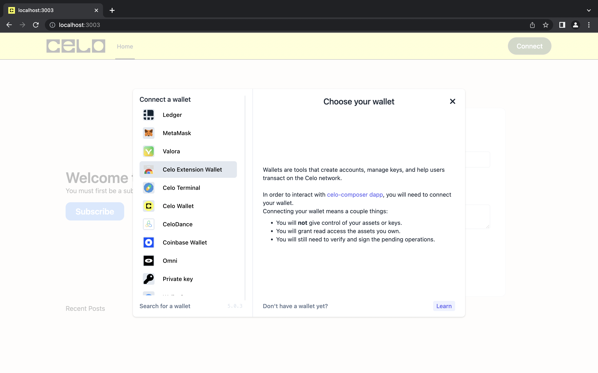
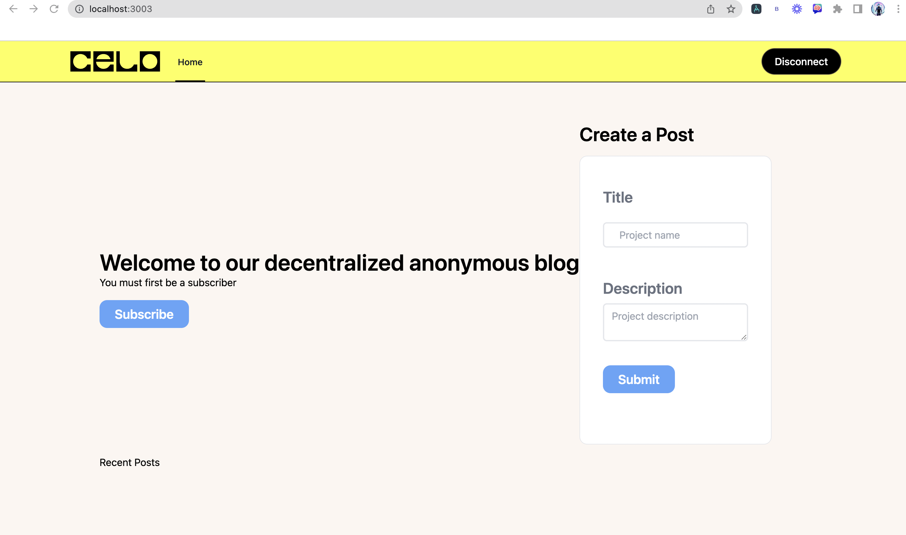

## Introduction

In the first section of the tutorial, we learned how to use the Ethereum blockchain to build a decentralized blogging platform where users can create, read, like, and subscribe to blog posts in a secure and transparent manner. We've seen how to use Solidity to define and implement the data structures and functions required for the smart contract to function.

So in this second section, we are going to learn how to build the front-end for our blog.
This is what the endpoint should look like.







## Prerequisite

- Solidity
- Smart contracts
- Blockchain
- Web development

## Requirements

- [Celo Composer](https://github.com/celo-org/celo-composer)
- [NodeJS](https://nodejs.org/en/download)
- [Celo Extension Wallet](https://chrome.google.com/webstore/detail/celoextensionwallet/kkilomkmpmkbdnfelcpgckmpcaemjcdh?hl=en)

## Front-end

- Click on this [repo](https://github.com/maxzysparks/blog-max) from your Github
- Clone the repo and open the project.
- Install `yarn` or `npm` for all dependencies.

## App.tsx

Open your `app.tsx` file, delete everything there, and paste this code.

```typescript
import "../styles/globals.css";
import type { AppProps } from "next/app";
import { CeloProvider, Alfajores } from "@celo/react-celo";
import "@celo/react-celo/lib/styles.css";
import Layout from "../components/Layout";
function App({ Component, pageProps }: AppProps) {
  return (
    <CeloProvider
      dapp={{
        name: "celo-composer dapp",
        description: "My awesome celo-composer description",
        url: "https://example.com",
        icon: "https://example.com/favicon.ico",
      }}
      defaultNetwork={Alfajores.name}
      connectModal={{
        providersOptions: { searchable: true },
      }}
    >
      <Layout>
        <Component {...pageProps} />
      </Layout>
    </CeloProvider>
  );
}
export default App;
```

The goal of this code is to provide a foundation for a decentralized application (dapp) to interact with the Celo blockchain network by utilizing the CeloProvider and Alfajores objects from the "@celo/react-celo" library.

The code is organized as a functional component that receives two props of type AppProps: Component and pageProps. The Component prop specifies the specific page that will be rendered, while the pageProps prop specifies any additional props that may be passed to that page.

A CeloProvider component wraps around the Layout component and the Component prop within the function. The CeloProvider component connects to the Celo network by specifying the default network (in this case, Alfajores) and configuring the dapp information, which includes the dapp's name, description, URL, and icon.

Furthermore, the CeloProvider component includes a connectModal property that enables users to connect to the Celo network via various providers that can be found via a search bar.

The Layout component is a custom component that can be used to create a unified layout for all dapp pages. The same layout will be applied to all pages by wrapping the Component prop in the Layout component.

In a nutshell, this code serves as a foundation for developing a decentralized application that can interact with the Celo blockchain network via the CeloProvider and Alfajores objects from the "@celo/react-celo" library. In addition, the code configures a default network, dapp information, and a connectModal to allow users to connect to the network. Finally, the code contains a Layout component that can be used to create a common layout for all of the dapp's pages.

## Index.tsx

Open your `index.tsx` file, delete everything there, and paste this code.

```typescript
import { useCelo } from "@celo/react-celo";
import { title } from "process";
import { useEffect, useState, useCallback } from "react";
const blog = require("../../hardhat/deployments/alfajores/DecentralizedBlog.json");
export const PostCard = ({
  title,
  description,
  likes,
  author,
  handleClick,
}: any) => {
  if (title === "") {
    return;
  }
  return (
    <div className="bg-white  shadow-lg rounded-lg overflow-hidden m-2   transition ease-in-out hover:-translate-y-1 duration-300">
      <div className="pr-24 ">
        <div className="my-3 p-2">
          <div className="my-1 text-lg text-gray-600 ">Title</div>
          <div className="text-3xl text-gray-600 font-semibold">{title}</div>
        </div>
        <div className="my-3 p-2 font-medium text-gray-600 text-xl">
          <div className="my-1 text-lg text-gray-600 ">Description</div>
          <div className="text-3xl text-gray-600 font-semibold">
            {description}
          </div>
        </div>
        <div className="my-3 p-2 font-medium text-gray-600 text-xl">
          <div className="my-1 text-lg text-gray-600 overflow-y-scroll">
            Author
          </div>
          <div className="text-3xl text-gray-600 font-semibold">{author}</div>
        </div>
        <div className="my-3 p-2 font-medium text-gray-600 text-xl">
          <div className="my-1 text-lg text-gray-600 ">likes</div>
          <div className="text-3xl text-gray-600 font-semibold">
            {likes} likes
          </div>
        </div>
        <button
          onClick={handleClick}
          className="my-6 bg-blue-400 py-3 px-6 rounded-xl ml-4 hover:bg-rose-600 "
        >
          Like
        </button>
      </div>
    </div>
  );
};
export default function Home() {
  const { connect, address, kit, getConnectedKit } = useCelo();
  const [subscribed, setSubscribed] = useState(false);
  const [name, setName] = useState("");
  const [description, setDescription] = useState("");
  const [posts, setPosts] = useState<any>([]);
  const numPosts = 6;
  const contract = new kit.connection.web3.eth.Contract(blog.abi, blog.address);
  const handleSubmit = async (event: { preventDefault: () => void }) => {
    event.preventDefault();
    if (!address) {
      return;
    }
    if (!name || !description) {
      return;
    }
    if (!contract) {
      return;
    }
    const tx = await contract.methods
      .createPost(name, description)
      .send({ from: address });
    console.log(tx);
  };
  useEffect(() => {
    async function fetchPosts() {
      const data2: any[] = [];
      if (!address) {
        return;
      }
      if (subscribed) {
        return alert("You must be a subscriber to post");
      }
      const totalPostNum = await contract.methods.totalPosts().call();
      console.log("Total posts:", totalPostNum);
      for (let i = 0; i <= totalPostNum; i++) {
        await contract.methods
          .getPost(i)
          .call()
          .then((res: any) => {
            data2.push(res);
          });
        // const { title, zcontent, likes } = post;
        // data2.push(post);
        setPosts(data2);
        console.log("Posts:", posts);
      }
    }
    fetchPosts();
  }, []);
  const postSubscribe = async () => {
    if (!address) {
      return;
    }
    const tx = await contract.methods
      .subscribe()
      .send({ from: address, gas: 1000000 });
    console.log(tx);
    setSubscribed(true);
  };
  const postLike = async (id: number) => {
    if (!address) {
      return;
    }
    const tx = await contract.methods.likePost(id).send({ from: address });
    console.log(tx);
  };
  return (
    <div className="flex flex-1 flex-col min-h-screen">
      <div className="flex flex-row justify-between items-center ">
        <div>
          <div className="text-4xl font-semibold">
            Welcome to our decentralized anonymous blog
          </div>
          <div>You must first be a subscriber</div>
          <button
            onClick={postSubscribe}
            className="mt-4 bg-blue-400 py-2 px-6 text-white text-xl font-semibold rounded-xl"
          >
            Subscribe
          </button>
        </div>
        <div className="mr-16">
          <div className="text-3xl font-semibold">Create a Post</div>
          <div className="my-4 border bg-white px-3 py-12 rounded-xl">
            <form onSubmit={handleSubmit} className="px-6 pb-8">
              <div className="mt-0 mb-6">
                <label
                  className="block text-gray-500 font-semibold mb-6 text-2xl"
                  htmlFor="name"
                >
                  Title
                </label>
                <input
                  className="border-2 rounded-md w-full py-2 px-6 text-gray-600 leading-tight focus:outline-none focus:shadow-outline mb-6"
                  id="name"
                  type="text"
                  placeholder="Project name"
                  value={name}
                  onChange={(e) => setName(e.target.value)}
                />
              </div>
              <div className="mb-4">
                <label
                  className="block text-gray-500 font-semibold mb-2 text-2xl"
                  htmlFor="description"
                >
                  Description
                </label>
                <textarea
                  className="border-2 rounded-md w-full py-2 px-3 text-gray-700 leading-tight focus:outline-none focus:shadow-outline"
                  id="description"
                  placeholder="Project description"
                  value={description}
                  onChange={(e) => setDescription(e.target.value)}
                />
              </div>
              <button
                onClick={handleSubmit}
                className="mt-4 bg-blue-400 py-2 px-6 text-white text-xl font-semibold rounded-xl"
                type="submit"
              >
                Submit
              </button>
            </form>
          </div>
        </div>
      </div>
      <div className="flex flex-col">
        <div>Recent Posts</div>
        <div className="flex flex-row overflow-x-scroll">
          {posts.map((post: any) => (
            <PostCard
              key={post.id}
              title={post.title}
              description={post.content}
              author={post.author}
              likes={post.likes}
              handleClick={() => postLike(post.id)}
            />
          ))}
        </div>
      </div>
    </div>
  );
}
```

This is a React component that implements a Celo blockchain-based decentralized anonymous blog. To interact with the Celo blockchain, the component makes use of the @celo/react-celo library.

The PostCard component displays a single blog post with its title, description, author, and number of likes. The PostCard component also includes a "Like" button that allows users to endorse a post.

The main component that renders the blog is the Home component. It enables the user to create a new blog post, subscribe to the blog, and view previously published blog posts.

When the user submits the form, the handleSubmit function in the Home component creates a new post. The function verifies that the user is connected to the Celo network, that a title and description for the post have been entered, and that the user has a contract object that can interact with the Celo blockchain.

When the Home component is mounted, it also has a useEffect hook that retrieves all existing posts from the Celo blockchain. The function iterates over the total number of posts and calls the smart contract's getPost function to retrieve the data for each post. Each post's data is added to the posts array, which is displayed on the UI.

The Home component also includes a postSubscribe function, which allows the user to subscribe to the blog by calling the smart contract's subscribe function.

Finally, the Home component includes a postLike function that allows the user to like a post by invoking the smart contract's likePost function. The function accepts an id argument containing the id of the post to like.

After adding your private keys to the `.env` file, use this command to run the app: `npm run react-app:dev`

### Conclusion

Finally, this tutorial has provided a thorough explanation of how to create a decentralized blogging platform using Ethereum blockchain technology. We began by learning how to use Solidity to define and implement the data structures and functions needed for the smart contract to function, and then progressed to building the front-end for our blog with Celo Composer, NodeJS, and Celo Extension Wallet.

The front-end code provided in this tutorial can be used to build a decentralized application that interacts with the Celo blockchain network using the CeloProvider and Alfajores objects from the "@celo/react-celo" library.
Furthermore, the tutorial demonstrated how to set up a default network, dapp information, and a connectModal to enable users to connect to the network. Finally, the tutorial includes code for a Layout component that can be used to create a unified layout for all of the dapp's pages.

By following this tutorial, readers should be able to create their own decentralized blogging platform that allows users to create, read, like, and subscribe to blog posts in a secure and transparent environment.

### Next Steps

- [Celo docs](https://docs.celo.org/)
- [Solidity](https://docs.soliditylang.org/en/v0.8.17/)
- [Code Repo](https://github.com/maxzysparks/blog-max)

### About the author

**Maxwell Onyeka** is a results-driven manager as well as a marketing and technical writing expert. I've spent the last five years honing my skills in building paid and organic marketing funnels for SaaS companies. Furthermore, I am a skilled Web 3 technical writer, allowing me to create compelling content that drives business growth. [LinkedIn](https://www.linkedin.com/in/maxwell-onyeka-3b4b1118b/) [Github](https://github.com/maxzysparks)
