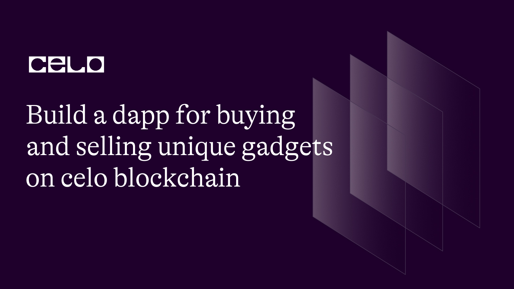

## INTRODUCTION

Decentralized applications (dapps) are becoming increasingly popular, and the blockchain industry is growing rapidly. One area that could benefit from blockchain technology is the buying and selling of unique gadgets. With blockchain, we can create a transparent, secure, and immutable system that allows for trustless transactions.

The Celo blockchain is a mobile-first blockchain platform that aims to make financial systems accessible to anyone with a mobile phone. It is designed to be user-friendly, fast, and affordable, making it a suitable platform for dapps.

Our dapp will be designed to enable the buying and selling of unique gadgets on the Celo blockchain. Each gadget will have a unique identifier, and its ownership will be recorded on the blockchain, ensuring that each gadget is unique and verifiable. The dapp will also have a rating system for sellers, ensuring that buyers can make informed decisions when purchasing gadgets.

The dapp will use Celo's stablecoin, cUSD, as the payment method for all transactions, ensuring that the value of the transactions remains stable. Additionally, the use of smart contracts will automate the buying and selling process, ensuring that transactions are secure and transparent.

Overall, this dapp has the potential to revolutionize the way we buy and sell unique gadgets. By utilizing blockchain technology, we can create a secure, transparent, and user-friendly system that benefits both buyers and sellers.

[Live demo](https://jovial-licorice-e696fc.netlify.app/) of what we will be building.

## PREREQUESITES

In order to make the most of these tutorials, it is suggested that you have a basic comprehension of the following technologies:

- solidity programming language

- Smart contract technology

- Basic concepts of web development

- Blockchain technology and its principles

- React JavaScript library.

## REQUIREMENTS

- Solidity programming language

- React JavaScript library

- Bootstrap framework

- NodeJS version 12.0.1 or higher installed

- Celo Extension Wallet

- Remix IDE for writing and testing smart contracts.

Shall we begin creating a smart contract using Remix IDE?

The full code:

```solidity
// SPDX-License-Identifier: MIT

pragma solidity >=0.7.0 <0.9.0;

interface IERC20Token {
    function transfer(address, uint256) external returns (bool);

    function approve(address, uint256) external returns (bool);

    function transferFrom(
        address,
        address,
        uint256
    ) external returns (bool);

    function totalSupply() external view returns (uint256);

    function balanceOf(address) external view returns (uint256);

    function allowance(address, address) external view returns (uint256);

    event Transfer(address indexed from, address indexed to, uint256 value);
    event Approval(
        address indexed owner,
        address indexed spender,
        uint256 value
    );
}

contract Gadgets {
    uint private glassLength = 0;
    address private cUsdTokenAddress =
      0x874069Fa1Eb16D44d622F2e0Ca25eeA172369bC1;

    event likeGadgetEvent(address indexed userAddress, uint256 index);
    event dislikeGadgetEvent(address indexed userAddress, uint256 index);
    event deleteGadgetEvent(uint256 glassId);
    event buyGadgetEvent(
        address indexed seller,
        address indexed buyer,
        uint256 index
    );
    event addGadgetEvent(address indexed owner, uint256 gadgetId);

    struct Glass {
        address payable owner;
        string image;
        string name;
        string description;
        uint price;
        uint likesCount;
    }
    mapping(uint => Glass) internal glasses;
    mapping(uint256 => mapping(address => bool)) likes; // glasses liked by all users

    /// @dev  function to use to add glasses
    function addGlass(
        string calldata _image,
        string calldata _name,
        string calldata _description,
        uint _price
    ) external {
        require(bytes(_image).length > 0, "Empty image");
        require(bytes(_name).length > 0, "Empty name");
        require(bytes(_description).length > 0, "Empty description");
        require(_price > 0, "Price needs to be at least one wei");
        uint _likesCount = 0;
        glasses[glassLength] = Glass(
            payable(msg.sender),
            _image,
            _name,
            _description,
            _price,
            _likesCount
        );

        emit addGadgetEvent(msg.sender, glassLength);
        glassLength++;
    }

    /// @return glass details with key @index from glass mapping
    function getGlass(uint _index)
        public
        view
        returns (
            address payable,
            string memory,
            string memory,
            string memory,
            uint,
            uint
        )
    {
        return (
            glasses[_index].owner,
            glasses[_index].image,
            glasses[_index].name,
            glasses[_index].description,
            glasses[_index].price,
            glasses[_index].likesCount
        );
    }

    /// @dev delete glass with key @_index from books mapping
    function removeGlass(uint _index) external {
        require(msg.sender == glasses[_index].owner, "Only owner can delete ");
        glasses[_index] = glasses[glassLength - 1];
        delete glasses[glassLength - 1];
        glassLength--;

        emit deleteGadgetEvent(_index);
    }

    /**
     * @dev allow users to buy a glass from the platform
     */
    function buyGlass(uint _index) public payable {
        Glass storage currentGlass = glasses[_index];
        require(
            currentGlass.owner != msg.sender,
            "You can't buy your own glass"
        );
        require(
            IERC20Token(cUsdTokenAddress).transferFrom(
                msg.sender,
                glasses[_index].owner,
                glasses[_index].price
            ),
            "Transfer failed."
        );

        address seller = glasses[_index].owner;

        glasses[_index].owner = payable(msg.sender);

        emit buyGadgetEvent(seller, msg.sender, _index);
    }

    /**
     * @dev allow users to like or unlike a glass
     * @notice this function is used to like or dislike
     */
    function Like(uint _index) public {
        bool hasLiked = likes[_index][msg.sender];

        if (hasLiked) {
            likes[_index][msg.sender] = false;
            glasses[_index].likesCount--;
            emit dislikeGadgetEvent(msg.sender, _index);
        } else {
            likes[_index][msg.sender] = true;
            glasses[_index].likesCount++;
            emit likeGadgetEvent(msg.sender, _index);
        }
    }

    function getGlassesLength() public view returns (uint) {
        return (glassLength);
    }
}
```

## Code Analysis

```solidity
// SPDX-License-Identifier: MIT

pragma solidity >=0.7.0 <0.9.0;
```

This code contains two directives that are important for us. The first one specifies the open-source license that the code is released under, which ensures that anyone can use and modify the code as long as they include the original license. The second directive defines the range of Solidity versions that the code is compatible with. By using these directives, we can make sure that the code is licensed correctly and can be compiled using the intended version of Solidity.

Next, we add our ERC20 token interface.

```solidity
interface IERC20Token {
    function transfer(address, uint256) external returns (bool);

    function approve(address, uint256) external returns (bool);

    function transferFrom(
        address,
        address,
        uint256
    ) external returns (bool);

    function totalSupply() external view returns (uint256);

    function balanceOf(address) external view returns (uint256);

    function allowance(address, address) external view returns (uint256);

    event Transfer(address indexed from, address indexed to, uint256 value);
    event Approval(
        address indexed owner,
        address indexed spender,
        uint256 value
    );
}
```

This code defines the necessary functions and events for a Celo ERC20 token contract. ERC20 is a standard protocol used for creating tokens on the Celo blockchain, and this code specifies how users can interact with the smart contract. The functions allow for the transfer of tokens, authorization for other addresses to spend tokens, and the retrieval of information about the token contract, such as the total supply and token balances. The events trigger notifications when a token transfer or approval occurs on the Celo blockchain, providing external applications with real-time updates.

Next, we begin by naming our contract and also creating our struct.

```solidity
contract Gadgets {
    uint private glassLength = 0;
    address private cUsdTokenAddress =
      0x874069Fa1Eb16D44d622F2e0Ca25eeA172369bC1;

    event likeGadgetEvent(address indexed userAddress, uint256 index);
    event dislikeGadgetEvent(address indexed userAddress, uint256 index);
    event deleteGadgetEvent(uint256 glassId);
    event buyGadgetEvent(
        address indexed seller,
        address indexed buyer,
        uint256 index
    );
    event addGadgetEvent(address indexed owner, uint256 gadgetId);

    struct Glass {
        address payable owner;
        string image;
        string name;
        string description;
        uint price;
        uint likesCount;
    }
```

This is a smart contract called "Gadgets" that manages a collection of Glass objects. We can add new gadgets to the collection, delete a gadget, buy a gadget, and like or dislike a gadget. Each gadget has properties such as an owner address, an image, a name, a description, a price, and a count of likes. When certain actions are taken, events are triggered, such as the "likeGadgetEvent" and "dislikeGadgetEvent" events. The contract also stores the address of a contract that implements the cUSD token. Overall, this contract shows how to manage a collection of objects and perform various actions on them using a smart contract.

Next, we add out mapping.

```solidity
 mapping(uint => Glass) internal glasses;
 mapping(uint256 => mapping(address => bool)) likes; // glasses liked by all users
```

In our contract, we have defined two mappings. The first one, called glasses, maps an unsigned integer to a data structure called Glass. This allows us to retrieve the corresponding Glass data structure for any given unsigned integer.

The second mapping, called likes, is a bit more complex. We use a nested mapping structure to keep track of which users have liked which glasses. The outer mapping maps a glass ID to an inner mapping, which maps user addresses to a boolean value indicating whether or not they have liked the corresponding glass.

By using these mappings, we can efficiently keep track of which glasses have been liked by which users in our contract.

To enhance the functionality of our smart contract, we have decided to introduce new functions. The first function that we plan to incorporate is called addGadget.

```solidity
function addGadget(
        string calldata _image,
        string calldata _name,
        string calldata _description,
        uint _price
    ) external {
        require(bytes(_image).length > 0, "Empty image");
        require(bytes(_name).length > 0, "Empty name");
        require(bytes(_description).length > 0, "Empty description");
        require(_price > 0, "Price needs to be at least one wei");
        uint _likesCount = 0;
        glasses[glassLength] = Glass(
            payable(msg.sender),
            _image,
            _name,
            _description,
            _price,
            _likesCount
        );

        emit addGadgetEvent(msg.sender, glassLength);
        glassLength++;
    }
```

In this function, we are creating a new `gadget` object and adding it to our collection of gadgets. To create this new gadget object, we require four pieces of information: the image, name, description, and price. We also set the initial number of likes for this glass to zero.

Before adding the new glass to our collection, we perform several checks to make sure that all the required information has been provided. Specifically, we check that the image, name, and description are not empty, and that the price is greater than zero.

Once we have performed these checks, we create a new glass object with the provided information and add it to our collection of glasses. We also emit an event to notify any interested parties that a new glass has been added.

Overall, this function allows us to add new gadgets to our collection, ensuring that all required information has been provided and notifying interested parties of any new additions.

Next, we create the `getGadget` function.

```solidity
function getGadget(uint _index)
        public
        view
        returns (
            address payable,
            string memory,
            string memory,
            string memory,
            uint,
            uint
        )
    {
        return (
            glasses[_index].owner,
            glasses[_index].image,
            glasses[_index].name,
            glasses[_index].description,
            glasses[_index].price,
            glasses[_index].likesCount
        );
    }

```

In this session, we have a function called getGadget. This function allows anyone to retrieve information about a gadget by passing in an index number. We define the function as public and view, which means that anyone can call it and it doesn't modify any data.

When we call the getGadget function and provide an index number, it will return several pieces of information about the gadget located at that index. This information includes the address of the gadget owner, an associated image, the gadget's name, a description, the price, and the number of likes that the gadget has received.

The function returns all of this information in a specific order, separated by commas. So, when we call this function and provide an index number, we will receive all of this information about the gadget located at that index.

```solidity
function removeGadget(uint _index) external {
        require(msg.sender == glasses[_index].owner, "Only owner can delete ");
        glasses[_index] = glasses[glassLength - 1];
        delete glasses[glassLength - 1];
        glassLength--;

        emit deleteGadgetEvent(_index);
    }
```

In this session, we have a function called `removeGadget` which allows the owner of a gadget to delete it from the system by passing in an index number.

When someone calls the removeGlass function, we first check to make sure that the person calling the function is the owner of the gadget they want to delete. If the condition is not met, the function stops executing and returns an error message saying `Only owner can delete`.

Assuming the person calling the function is the owner of the gadget, we proceed to remove the gadget from the system. We do this by copying the last gadget in the system to the location of the gadget being deleted, and then deleting the last gadget. After that, we decrement the length of the gadget array by 1 to reflect the removal of the gadget.

Once we have successfully removed the gadget from the system, we emit a `deleteGadgetEvent` event to let other parts of the system know that a gadget has been deleted.

Next we add the `buyGadget` function

```solidity
 function buyGlass(uint _index) public payable {
        Glass storage currentGlass = glasses[_index];
        require(
            currentGlass.owner != msg.sender,
            "You can't buy your own glass"
        );
        require(
            IERC20Token(cUsdTokenAddress).transferFrom(
                msg.sender,
                glasses[_index].owner,
                glasses[_index].price
            ),
            "Transfer failed."
        );

        address seller = glasses[_index].owner;

        glasses[_index].owner = payable(msg.sender);

        emit buyGadgetEvent(seller, msg.sender, _index);
    }
```

This code snippets defines a function called buyGadget, which allows a user to purchase a gadget from the system by passing in an index number and paying the price of the gadget in cUSD (a type of cryptocurrency).

When someone calls the `buyGadget` function, it first creates a reference to the gadget being purchased using the Glass storage currentGlass = glasses[_index] statement.

Next, the function checks to make sure that the person calling the function is not the owner of the gadget. If the condition is not met, the function stops executing and returns an error message saying "You can't buy your own gadget".

Assuming the person calling the function is not the owner of the gadget, the function then attempts to transfer the price of the gadget in cUSD from the buyer to the owner of the gadget using the `IERC20Token(cUsdTokenAddress)`.transferFrom statement. If the transfer is successful, the function updates the owner of the gadget to be the buyer, and emits a buyGadgetEvent event to let other parts of the system know that a gadget has been purchased.

Finally, for the smart contract we add the `Like` and the `getGadgetLength` function.

```solidity
 function Like(uint _index) public {
        bool hasLiked = likes[_index][msg.sender];

        if (hasLiked) {
            likes[_index][msg.sender] = false;
            glasses[_index].likesCount--;
            emit dislikeGadgetEvent(msg.sender, _index);
        } else {
            likes[_index][msg.sender] = true;
            glasses[_index].likesCount++;
            emit likeGadgetEvent(msg.sender, _index);
        }
    }

    function getGadgetsLength() public view returns (uint) {
        return (glassLength);
    }
}
```

The first function, called `Like`, allows a user to like or dislike a gadget by passing in an `index` number. When someone calls the Like function, we first check to see if the user has already liked the gadget by checking the likes mapping for the user and gadget index combination. If the user has already liked the gadget, we remove the like by setting the mapping to `false`, decrement the gadget's like count, and emit a `dislikeGadgetEvent` to let other parts of the system know that a like has been removed.

If the user has not already liked the gadget, we add the like by setting the mapping to true, increment the gadget's like count, and emit a likeGadgetEvent to let other parts of the system know that a like has been added.

The second function, called `getGadgetsLength`, simply returns the length of the glasses array. We use this function to allow other parts of the system to know how many gadgets are currently in the system.

## CONTRACT DEPLOYMENT

In order to ensure a successful deployment of our smart contract, it is crucial that we download the Celo extension wallet from the provided link. [Celo Extension wallet](https://chrome.google.com/webstore/detail/celoextensionwallet/kkilomkmpmkbdnfelcpgckmpcaemjcdh?hl=en). Once done, the next step is to fund the wallet that we have created, [Celo faucet](https://faucet.celo.org/). Accessing the Celo Alfojares faucet via the given link is a way to achieve this.

Now that we have our wallet funded, we can move forward with deploying the smart contract using the Celo plugin that is available in Remix.

## FRONT END

- To obtain a copy of the repository on your computer, you can clone it using Git. To do so, open up a terminal and use the `git clone command`, followed by the repository URL. [Click here to clone this project repository](https://github.com/Ikanji201/GadgetHub).

- To open the project in Visual Studio Code, go to the project directory and open it using Visual Studio Code. You can achieve this by entering the command `code .` in the terminal.

- To install the required dependencies, navigate to the project directory in the terminal and run the command `npm install`. This will download and install all the dependencies listed in the `package.json` file.

Once the dependencies have been installed, you can run the application by executing the command npm start in the terminal. This will start the development server and automatically open the application in your default web browser.

After following these steps, you should be able to modify the code and observe the changes in your web browser.

## App.js

The code in its entirety should appear similar to this.

```solidity
import "./App.css";
import "bootstrap/dist/css/bootstrap.min.css";
import Navbar from "./components/Navbar";
import { useState, useEffect } from "react";

import Web3 from "web3";
import { newKitFromWeb3 } from "@celo/contractkit";
import BigNumber from "bignumber.js";
import IERC from "./contract/IERC.abi.json";
import Gadget from "./contract/Gadget.abi.json";
import CreateGadget from "./components/CreateGadget";
import Gadgets from "./components/Gadgets";

const ERC20_DECIMALS = 18;

const contractAddress = "0xCF39553D91107745328F47e51d926392dB2D2f7d";
const cUSDContractAddress = "0x874069Fa1Eb16D44d622F2e0Ca25eeA172369bC1";

function App() {
	const [contract, setcontract] = useState(null);
	const [address, setAddress] = useState(null);
	const [kit, setKit] = useState(null);
	const [cUSDBalance, setcUSDBalance] = useState(0);
	const [gadgets, setGadgets] = useState([]);

	const connectToWallet = async () => {
		if (window.celo) {
			try {
				await window.celo.enable();
				const web3 = new Web3(window.celo);
				let kit = newKitFromWeb3(web3);

				const accounts = await kit.web3.eth.getAccounts();
				const user_address = accounts[0];

				kit.defaultAccount = user_address;

				await setAddress(user_address);
				await setKit(kit);
			} catch (error) {
				console.log(error);
			}
		} else {
			console.log("Error Occurred");
		}
	};

	useEffect(() => {
		connectToWallet();
	}, []);

	useEffect(() => {
		if (kit && address) {
			getBalance();
		}
	}, [kit, address]);

	useEffect(() => {
		if (contract) {
			getGadget();
		}
	}, [contract]);

	const getBalance = async () => {
		try {
			const balance = await kit.getTotalBalance(address);
			const USDBalance = balance.cUSD
				.shiftedBy(-ERC20_DECIMALS)
				.toFixed(2);
			const contract = new kit.web3.eth.Contract(Gadget, contractAddress);
			setcontract(contract);
			setcUSDBalance(USDBalance);
		} catch (error) {
			console.log(error);
		}
	};

	const getGadget = async () => {
		const glassLength = await contract.methods.getGlassesLength().call();
		const _gadgett = [];
		for (let index = 0; index < glassLength; index++) {
			let _gadgets = new Promise(async (resolve, reject) => {
				let gadget = await contract.methods.getGlass(index).call();
				resolve({
					index: index,
					owner: gadget[0],
					image: gadget[1],
					name: gadget[2],
					description: gadget[3],
					price: gadget[4],
					like: gadget[5],
				});
			});
			_gadgett.push(_gadgets);
		}
		const _gadgets = await Promise.all(_gadgett);
		setGadgets(_gadgets);
	};

	const AddGadget = async (_image, _name, _description, price) => {
		const _price = new BigNumber(price)
			.shiftedBy(ERC20_DECIMALS)
			.toString();
		try {
			await contract.methods
				.addGlass(_image, _name, _description, _price)
				.send({ from: address });
			getGadget();
		} catch (error) {
			console.log(error);
		}
	};

	const buyGadget = async (_index) => {
		try {
			const cUSDContract = new kit.web3.eth.Contract(
				IERC,
				cUSDContractAddress
			);

			await cUSDContract.methods
				.approve(contractAddress, gadgets[_index].price)
				.send({ from: address });
			await contract.methods.buyGlass(_index).send({ from: address });
			getGadget();
			getBalance();
		} catch (error) {
			console.log(error);
		}
	};

	const RemoveGadget = async (_index) => {
		try {
			await contract.methods.removeGlass(_index).send({ from: address });
			getGadget();
			getBalance();
		} catch (error) {
			alert(error);
		}
	};

	const Like = async (_index) => {
		try {
			await contract.methods.Like(_index).send({ from: address });
			getGadget();
			getBalance();
		} catch (error) {
			alert.log(error);
		}
	};
	return (
		<>
			{address && kit ? (
				<div>
					<Navbar balance={cUSDBalance} />

					<Gadgets
						gadgets={gadgets}
						buyGadget={buyGadget}
						RemoveGadget={RemoveGadget}
						Like={Like}
						address={address}
					/>
					<CreateGadget AddGadget={AddGadget} />
				</div>
			) : (
				""
			)}
		</>
	);
}

export default App;
```

To begin, we must analyze the App.js file by scrutinizing the components and libraries that must be imported.

```js
import "./App.css";
import "bootstrap/dist/css/bootstrap.min.css";
import Navbar from "./components/Navbar";
import { useState, useEffect } from "react";

import Web3 from "web3";
import { newKitFromWeb3 } from "@celo/contractkit";
import BigNumber from "bignumber.js";
import IERC from "./contract/IERC.abi.json";
import Gadget from "./contract/Gadget.abi.json";
import CreateGadget from "./components/CreateGadget";
import Gadgets from "./components/Gadgets";

const ERC20_DECIMALS = 18;

const contractAddress = "0xCF39553D91107745328F47e51d926392dB2D2f7d";
const cUSDContractAddress = "0x874069Fa1Eb16D44d622F2e0Ca25eeA172369bC1";
```

In this code, we are importing various libraries and components that we will be using in our React application.

We are importing the `App.css` file, which contains some CSS styles that we will use to style our application.

We are also importing the `Bootstrap CSS` file for some additional styling.

Next, we are importing the `useState` and `useEffect` hooks from the react library. These hooks will allow us to manage state and perform side effects in our React components.

We are also importing the `Web3 library`, which is a library for interacting with Ethereum and Celo blockchains. We will use this library to connect to the Celo blockchain.

We are importing the `newKitFromWeb3` function from the `@celo/contractkit` library, which we will use to create a new contract kit for interacting with smart contracts on the Celo blockchain.

We are importing the `BigNumber` library, which is a library for working with large numbers in JavaScript.

We are importing the `ABI files` for our smart contracts, which we will use to interact with them.

Finally, we are defining two constants: `contractAddress`, which is the address of our `Gadget smart contract`, and `cUSDContractAddress`, which is the address of the Celo Dollars (cUSD) token contract on the Celo blockchain.

```js
function App() {
	const [contract, setcontract] = useState(null);
	const [address, setAddress] = useState(null);
	const [kit, setKit] = useState(null);
	const [cUSDBalance, setcUSDBalance] = useState(0);
	const [gadgets, setGadgets] = useState([]);

	const connectToWallet = async () => {
		if (window.celo) {
			try {
				await window.celo.enable();
				const web3 = new Web3(window.celo);
				let kit = newKitFromWeb3(web3);

				const accounts = await kit.web3.eth.getAccounts();
				const user_address = accounts[0];

				kit.defaultAccount = user_address;

				await setAddress(user_address);
				await setKit(kit);
			} catch (error) {
				console.log(error);
			}
		} else {
			console.log("Error Occurred");
		}
	};

```

In this session, we define a React function component named App. The component contains several states, including contract, address, kit, cUSDBalance, and gadgets. We also define an asynchronous function named `connectToWallet`.

The connectToWallet function is used to connect to the user's wallet using the Celo extension. It checks if the Celo extension is installed, and if it is, it enables it and initializes a web3 object. This object is then used to create a new kit object using the newKitFromWeb3 method.

Next, the function gets the user's account address and sets it as the default account for the `kit` object. The address and kit states are then updated with the user's address and kit object, respectively. If there is an error connecting to the wallet, it is logged to the console.

```js
useEffect(() => {
  connectToWallet();
}, []);

useEffect(() => {
  if (kit && address) {
    getBalance();
  }
}, [kit, address]);

useEffect(() => {
  if (contract) {
    getGadget();
  }
}, [contract]);
```

In this session, we are using React's `useEffect` hook to perform certain actions after a component has been rendered.

The first useEffect hook is used to connect to the wallet by calling the `connectToWallet()` function. It is only called once when the component mounts, as indicated by the empty array [] passed as the second argument.

The second useEffect hook is used to get the cUSD balance of the connected wallet by calling the getBalance() function. It is called whenever the kit and address state variables change.

The third useEffect hook is used to get the list of gadgets by calling the `getGadget()` function. It is called whenever the contract state variable changes.

```js
const getBalance = async () => {
  try {
    const balance = await kit.getTotalBalance(address);
    const USDBalance = balance.cUSD.shiftedBy(-ERC20_DECIMALS).toFixed(2);
    const contract = new kit.web3.eth.Contract(Gadget, contractAddress);
    setcontract(contract);
    setcUSDBalance(USDBalance);
  } catch (error) {
    console.log(error);
  }
};
```

The `getBalance` function is used to retrieve the cUSD balance of the connected wallet address. It uses the kit object and the address state variable to get the balance of the connected wallet. The balance is then converted to a human-readable format by shifting the decimal places and fixing the number of decimal places. Finally, a new contract object is created using the `kit.web3.eth.Contract` function and the Gadget `contract ABI`, and the contract and cUSDBalance state variables are updated with their respective values.

```js
const getGadget = async () => {
  const glassLength = await contract.methods.getGlassesLength().call();
  const _gadgett = [];
  for (let index = 0; index < glassLength; index++) {
    let _gadgets = new Promise(async (resolve, reject) => {
      let gadget = await contract.methods.getGlass(index).call();
      resolve({
        index: index,
        owner: gadget[0],
        image: gadget[1],
        name: gadget[2],
        description: gadget[3],
        price: gadget[4],
        like: gadget[5],
      });
    });
    _gadgett.push(_gadgets);
  }
  const _gadgets = await Promise.all(_gadgett);
  setGadgets(_gadgets);
};
```

The `getGadget()` function facilitates the retrieval of all stored gadgets within the contract and then updates the application state with the gadgets retrieved.

```js
const AddGadget = async (_image, _name, _description, price) => {
  const _price = new BigNumber(price).shiftedBy(ERC20_DECIMALS).toString();
  try {
    await contract.methods
      .addGlass(_image, _name, _description, _price)
      .send({ from: address });
    getGadget();
  } catch (error) {
    console.log(error);
  }
};

const buyGadget = async (_index) => {
  try {
    const cUSDContract = new kit.web3.eth.Contract(IERC, cUSDContractAddress);

    await cUSDContract.methods
      .approve(contractAddress, gadgets[_index].price)
      .send({ from: address });
    await contract.methods.buyGlass(_index).send({ from: address });
    getGadget();
    getBalance();
  } catch (error) {
    console.log(error);
  }
};

const RemoveGadget = async (_index) => {
  try {
    await contract.methods.removeGlass(_index).send({ from: address });
    getGadget();
    getBalance();
  } catch (error) {
    alert(error);
  }
};

const Like = async (_index) => {
  try {
    await contract.methods.Like(_index).send({ from: address });
    getGadget();
    getBalance();
  } catch (error) {
    alert.log(error);
  }
};
```

Next, we'll move on to implementing the `addGadget()`, `buyGadget()`, `removeGadget()`, and `likeGadeget()` functions, which allow users to interact with the smart contract.

```js
return (
		<>
			{address && kit ? (
				<div>
					<Navbar balance={cUSDBalance} />

					<Gadgets
						gadgets={gadgets}
						buyGadget={buyGadget}
						RemoveGadget={RemoveGadget}
						Like={Like}
						address={address}
					/>
					<CreateGadget AddGadget={AddGadget} />
				</div>
			) : (
				""
			)}
		</>
	);
}

export default App;
```

Lastly, we render the App component and return the Gadget components with the required props.

## NEXT STEP

I hope you found this tutorial informative and learned a lot from it. If you would like to further your education on this topic, here are some useful links that you can explore:

[The official Celo documentation](https://docs.celo.org/)

[Solidity By Example, a website with code examples for learning Solidity](https://solidity-by-example.org/)

[OpenZeppelin Contracts, a library of secure, tested smart contract code](https://www.openzeppelin.com/contracts/)

[Solidity documentation for version 0.8.17](https://docs.soliditylang.org/en/v0.8.17/)

I hope these resources prove to be useful to you!

# About the author

I'm David Ikanji, a web3 developer residing in Nigeria, and I have a strong passion for working with blockchain technology.
