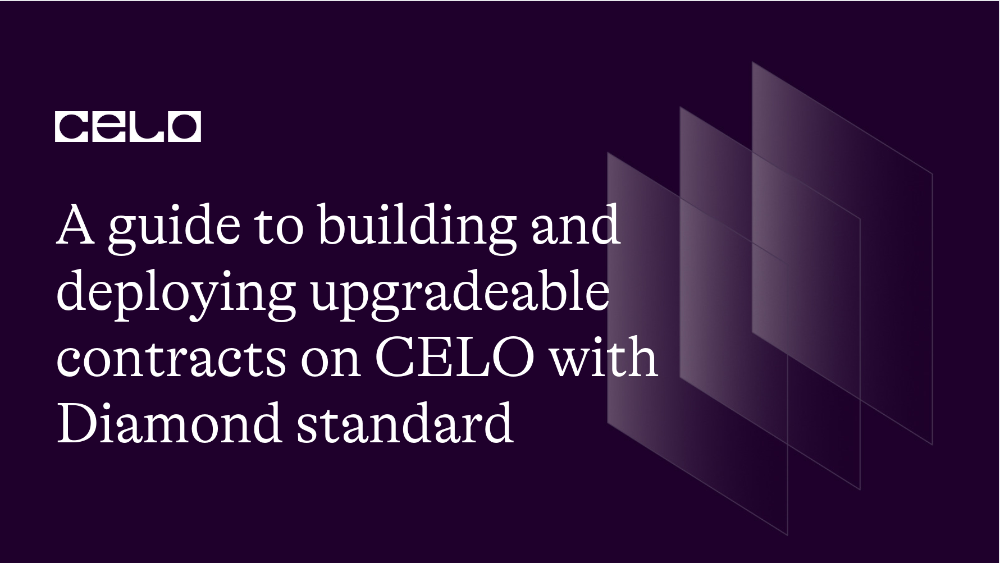
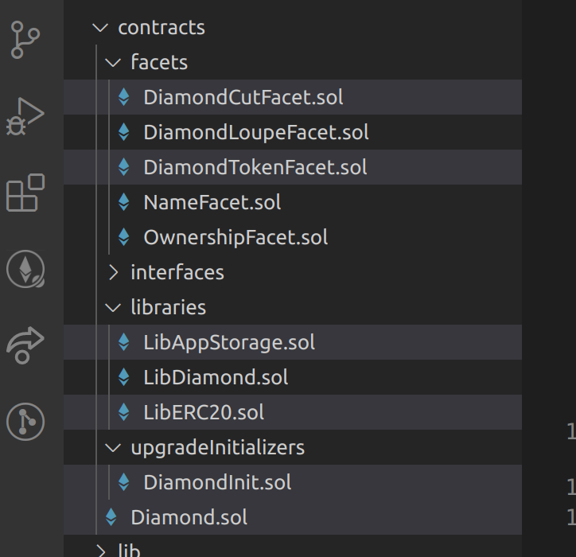
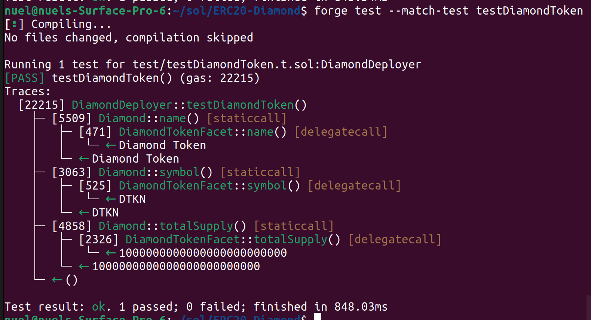
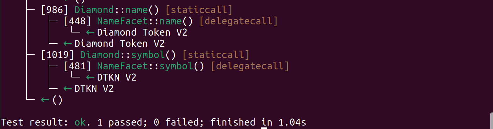
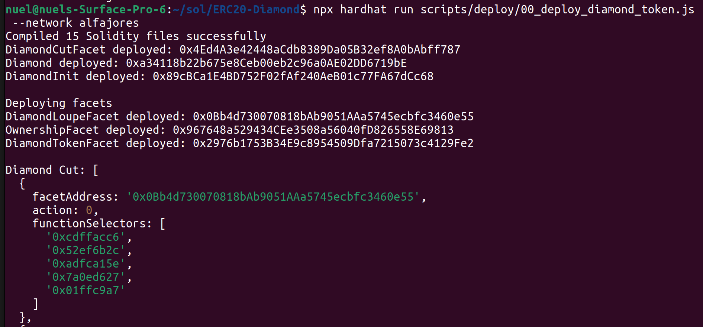
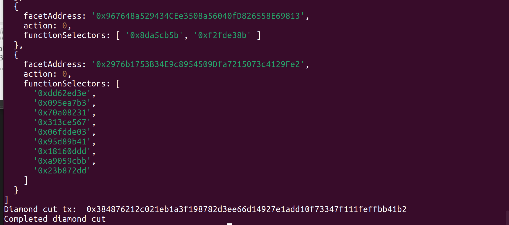
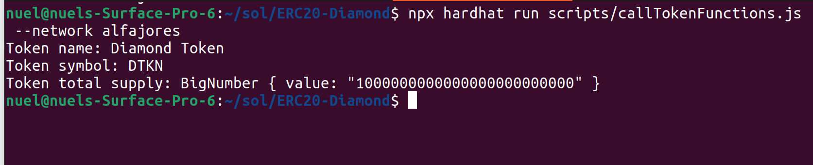
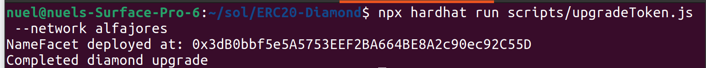
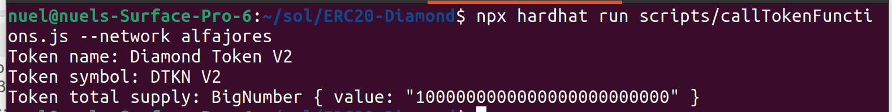

## A guide to building and deploying upgradeable contracts on CELO with Diamond standard

The Diamond Standard was articulated in [EIP2535](https://eips.ethereum.org/EIPS/eip-2535) and clearly defines a pathway for deploying multi facet smart-contracts that are modular, extensible and upgrade-able.

## Introduction

In this tutorial, I introduce the diamond standard for writing modular and upgradeable smart contracts, and give a brief walkthrough of how to build an upgrade-able ERC20 token compatible contract, deploy to CELO, and perform an upgrade to the contract on-chain.

## Prerequisites​

This tutorial is quite advanced and assumes a good understanding of the solidity language, and the ERC-20 standard and some familiarities with javascript language.
You should also be comfortable with using a Terminal application.

## Requirements​

The following toolings should be pre-installed for the code walkthrough:

- Make sure to have NodeJS >=12.0.1+ installed and optionally yarn.
- You need to install [foundry](https://book.getfoundry.sh/getting-started/installation).

## Getting Started

I would like to introduce some key terminologies we might encounter often in this tutorial.

1. Upgrade-able smart contracts: These are contracts generally split into proxy contracts(which house the state of the contract) and implementation contracts(which defines the logic of the contract). These contracts are often upgraded by adding new state to the system or deploying new implementation contracts.
2. Diamond Standard: This is a standard for writing upgrade-able and modular contracts, as defined by the [EIP2535](https://eips.ethereum.org/EIPS/eip-2535). Upgrade-able contracts conforming to this specification, comprises a Diamond(which is a proxy contract holding the data of the system), and facets(which are contracts that define the implementation logic).
   It is worth knowing that the Diamond performs calls to these facets using the low-level EVM delegatecall.

## Setup

For this code demo, we are going to be using this [template](https://github.com/Timidan/Foundry-Hardhat-Diamonds), which is purpose built for Diamond contracts and it also has some nice helpers for tests and deployment. Another useful feature of this template is the built in mix for Foundry and Hardhat support in the same codebase.
To get started with the template, simple follow the instructions on the readme, so you would have to run the following command in your preferred terminal of choice.

```bash
> git clone https://github.com/Timidan/Foundry-Hardhat-Diamonds ERC20-Diamond
> yarn
> forge update
```

> Do not type the **>** in your terminal, I've used it to represent your prompt symbol, which could vary depending on which Terminal program you use.

Optionally, you might have to run this command for the ds-test library from dapphub, if you encounter an error during testing.

```bash
> forge install dapphub/ds-test
```

Now you should have a `ERC20-Diamond` directory created in your CD into this directory, change to this directly and open it in your preferred editor.

## Code Walkthrough



As you already know by now, this template ships with a pre-built implementation of the Diamond standard, from which we can build on. I would list some of the files that are important for this walkthrough.

- DiamondCutFacet: This contracts houses the logic to perform upgrades on the Diamond.
- DiamondTokenFacet: As you might have guessed from the name, this is the contract where we would define our ERC20 token implementation logic.
- LibAppStorage: This would initialize and define the storage structure necessary for the ERC20 implementation.
- LibERC20: This library would house helper logic related to ERC20 operations, that would be called from the DiamondTokenFacet above.
- DiamondInit: This is where any necessary initialization procedure would be performed when deploying the Diamond.
- Diamond: This is the main proxy contract, that enshrines all the data of our contract system, and delegates calls to our implementation facets.

With that out of the way, proceed to writing our ERC20 token implementation, that is very much upgradeable, Yayy!!!

## Code Implementation

We proceed with the implementation, in a series of steps, gradually building out our ERC20 token contract to conform to the [EIP20](https://eips.ethereum.org/EIPS/eip-20) token standard.

First we define `LibAppStorage.sol` in the libraries folder, which would hold our storage struct, using the AppStorage pattern of Diamonds, this struct would hold the necessary data that are related to an ERC20 token implementation. A nice feature of using the AppStorage pattern is that it allows state to be shared easily between facets. You can read more about this pattern [here](https://dev.to/mudgen/appstorage-pattern-for-state-variables-in-solidity-3lki).

```solidity
// SPDX-License-Identifier: MIT
pragma solidity ^0.8.0;

struct TokenStorage {
   uint256 initialized;
   uint256 totalSupply;
   mapping(address => uint256) balances;
   mapping(address => mapping(address => uint256)) allowances;
}

library LibAppStorage {
   function tokenStorage() internal pure returns(TokenStorage storage ts) {
       assembly {
           ts.slot := 0
       }
   }
}
```

We then proceed to define the library `LibERC20.sol` which would host the methods for `approve` and `transfer` logic, performing the necessary state changes on the `TokenStorage` struct previously defined in `LibAppStorage.sol` library.

```solidity
// SPDX-License-Identifier: MIT
pragma solidity ^0.8.0;

import {TokenStorage} from "./LibAppStorage.sol";

library LibERC20 {
   error InvalidAddress();
   error InsufficientBalance();

   event Transfer(address indexed _from, address indexed _to, uint256 _value);
   event Approval(address indexed _owner, address indexed _spender, uint256 _value);

   function transfer(TokenStorage storage ts, address _from, address _to, uint256 _value) internal {
       if(_from == address(0)) revert InvalidAddress();
       if(_to == address(0)) revert InvalidAddress();
       if(ts.balances[_from] < _value) revert InsufficientBalance();

       unchecked {
           ts.balances[_from] -= _value;
           ts.balances[_to] += _value;
       }

       emit Transfer(_from, _to, _value);
   }


   function approve(TokenStorage storage ts, address _owner, address _spender, uint256 _value) internal {
       if(_owner == address(0)) revert InvalidAddress();
       if(_spender == address(0)) revert InvalidAddress();

       ts.allowances[_owner][_spender] += _value;

       emit Approval(_owner, _spender, _value);
   }
}
```

Moving on, we now implement the main facet that would conform with the EIP20 token standard, defining all the necessary functionalities required for this standard, we choose the name this facet as `DiamondTokenFacet.sol`. Below is the implementation:

```solidity
// SPDX-License-Identifier: MIT
pragma solidity ^0.8.0;

import {TokenStorage} from "../libraries/LibAppStorage.sol";
import {LibERC20} from "../libraries/LibERC20.sol";

import "../interfaces/IERC20.sol";

error InsufficientAllowance();
contract DiamondTokenFacet is IERC20 {
   TokenStorage s;

   /// @notice returns the name of the token.
   function name() external pure override returns(string memory) {
       return "Diamond Token";
   }

   /// @notice returns the symbol of the token.
   function symbol() external pure override returns(string memory) {
       return "DTKN";
   }

   /// @notice returns the token decimals.
   function decimals() external pure override returns(uint8) {
       return 18;
   }

   /// @notice returns the token total supply.
   function totalSupply() external view override returns(uint256) {
       return s.totalSupply;
   }

   /// @notice returns the balance of an address.
   function balanceOf(address _owner) external view override returns (uint256 balance) {
       balance = s.balances[_owner];
   }

   /// @notice transfers `_value` token from `caller` to `_to`.
   function transfer(address _to, uint256 _value) external override returns (bool success) {
       LibERC20.transfer(s, msg.sender, _to, _value);
       success = true;
   }

   /// @notice transfers `_value` tokens, from `_from` to `_to`.
   /// @dev   `caller` must be initially approved.
   function transferFrom(address _from, address _to, uint256 _value) external override returns (bool success) {

       uint256 _allowance = s.allowances[_from][msg.sender];
       if(_allowance < _value) revert InsufficientAllowance();

       LibERC20.transfer(s, _from, _to, _value);
       unchecked {
           s.allowances[_from][msg.sender] -= _value;
       }

       success = true;
   }

   /// @notice approves `_spender` for `_value` tokens, owned by caller.
   function approve(address _spender, uint256 _value) external override returns (bool success) {
       LibERC20.approve(s, msg.sender, _spender, _value);
       success = true;
   }

   /// @notice gets the allowance for spender `_spender` by the owner `_owner`
   function allowance(address _owner, address _spender) external override view returns (uint256 remaining) {
       remaining = s.allowances[_owner][_spender];
   }
}
```

Most of the functions defined here should be familiar to you, if you’ve encountered an ERC20 token implementation before in the wild, or build one yourself. However, we can see how this facet utilizes the functions in the library `LibERC20` and the `TokenStorage` struct. It's important to note that the `TokenStorage` struct must be the first storage slot, for facets using this storage pattern, this was agreed from the `LibAppStorage` implementation, and failure to do so might lead to storage clashes. Other than that, we are good to go.

All that is left for this initial version which we would call v1 moving forward, is the initialization logic for the token. We would like to do some initialization when deploying the token, like setting the total supply, so the question is how do we achieve that? Thankfully the `DimondInit.sol` contract was built into the standard specifically for this, so we proceed to this file which lives inside the `upgradeInitializers` folder and add some customizations to the `init` function, shown as:
First we import the `tokenStorage` struct, which would be stored in the first slot, since we are using the AppStorage pattern.

```solidity
import {LibDiamond} from "../libraries/LibDiamond.sol";
import {TokenStorage} from "../libraries/LibAppStorage.sol";
import { IDiamondLoupe } from "../interfaces/IDiamondLoupe.sol";
import { IDiamondCut } from "../interfaces/IDiamondCut.sol";
import { IERC173 } from "../interfaces/IERC173.sol";
import { IERC165 } from "../interfaces/IERC165.sol";
```

Next, we define a custom error on L22 that is to guard multiple initialization calls, then we add the logic for our initialization starting from L38.

```solidity
error AlreadyInitialized();


contract DiamondInit {
   TokenStorage s;

   // You can add parameters to this function in order to pass in
   // data to set your own state variables
   function init() external {
       // adding ERC165 data
       LibDiamond.DiamondStorage storage ds = LibDiamond.diamondStorage();
       ds.supportedInterfaces[type(IERC165).interfaceId] = true;
       ds.supportedInterfaces[type(IDiamondCut).interfaceId] = true;
       ds.supportedInterfaces[type(IDiamondLoupe).interfaceId] = true;
       ds.supportedInterfaces[type(IERC173).interfaceId] = true;


       // initialize the token contract
       if(s.initialized == 1) revert AlreadyInitialized();
       s.totalSupply = 1_000_000e18;
       s.initialized = 1;
   }
}
```

Now that we have all that is necessary for the v1 of our contract, We can proceed to write some tests for it.

We’ll rename the default file in the test directory to `testDiamondToken` and write the tests as so:
First we add our imports for the `DiamondTokenFacet` and `DiamondInit` facet.

```solidity
import "../contracts/facets/OwnershipFacet.sol";
import "../contracts/facets/DiamondTokenFacet.sol";
import "../contracts/upgradeInitializers/DiamondInit.sol";
import "../contracts/Diamond.sol";


import "forge-std/Test.sol";
```

Next we add the definition for both `DiamondTokenFacet` and `DiamondInit` contracts.

```solidity
contract DiamondDeployer is Test, IDiamondCut {
   //contract types of facets to be deployed
   Diamond diamond;
   DiamondCutFacet dCutFacet;
   DiamondLoupeFacet dLoupe;
   OwnershipFacet ownerF;
   DiamondTokenFacet tokenF;
   DiamondInit dInit;
```

Now we define the `setUp` function, which would initialize and deploy all the facets and contracts denied previously, including the Diamond. Inside this setUp, we also define the facetCut that we add all our `DiamondTokenFacet` where the logic of our ERC20 Token implementation lives.
Eagle eyed readers might have noticed the use of the `generateSelectors` internal function, this serves to compute the bytes4 selector ID of functions defined in the contracts passed to it as argument.

```solidity
function setUp() public {
       //deploy facets
       dCutFacet = new DiamondCutFacet();
       diamond = new Diamond(address(this), address(dCutFacet));
       dLoupe = new DiamondLoupeFacet();
       ownerF = new OwnershipFacet();
       tokenF = new DiamondTokenFacet();
       dInit = new DiamondInit();

       //upgrade diamond with facets

       //build cut struct
       FacetCut[] memory cut = new FacetCut[](4);

       cut[0] = (
           FacetCut({
               facetAddress: address(dLoupe),
               action: FacetCutAction.Add,
               functionSelectors: generateSelectors("DiamondLoupeFacet")
           })
       );

       cut[1] = (
           FacetCut({
               facetAddress: address(ownerF),
               action: FacetCutAction.Add,
               functionSelectors: generateSelectors("OwnershipFacet")
           })
       );

       cut[2] = (
           FacetCut({
               facetAddress: address(tokenF),
               action: FacetCutAction.Add,
               functionSelectors: generateSelectors("DiamondTokenFacet")
           })
       );

       cut[3] = (
           FacetCut({
               facetAddress: address(dInit),
               action: FacetCutAction.Add,
               functionSelectors: generateSelectors("DiamondInit")
           })
       );

       //upgrade diamond
       IDiamondCut(address(diamond)).diamondCut(cut, address(0x0), "");

       //Initialization
       DiamondInit(address(diamond)).init();
   }
```

With all set up out of the way, we now write the test that concerns our ERC20 token implementation, shown below:

```solidity
function testDiamondToken() public {
       string memory name = DiamondTokenFacet(address(diamond)).name();
       string memory symbol = DiamondTokenFacet(address(diamond)).symbol();
       uint256 totalSupply = DiamondTokenFacet(address(diamond)).totalSupply();


       assertEq(name, "Diamond Token");
       assertEq(symbol, "DTKN");
       assertEq(totalSupply, 1_000_000e18);
   }


   // multiple initialization should fail
   function testMultipleInitialize() public {
       vm.expectRevert(AlreadyInitialized.selector);
       DiamondInit(address(diamond)).init();
   }
```

So here, we simply initialize the `DiamondTokenFacet`, with the address of our Diamond, then we call the functions `name`, `symbol` and `totalSupply` on it, then asserting that we get the expected result.
We run the test from our terminal with the command.

```bash
> forge test --match-test testDiamondToken
```

Sample test output below shows that our test passes, Yayy!!!



This is a huge achievement, we’ve just built an Upgrade-able smart contract using the Diamond standard and verify that it indeed works as expected.
But this guide won’t be complete if we don’t upgrade these contracts and show that it indeed works.
So how do we upgrade the contract?
First we must define the upgrade we intend to accomplish, which for this guide, would be to say change the name and symbol for our contract.

> Fun fact: The CELO Token was initially deployed under the name `Celo Gold`, since the re-branding of the platform the name “Celo” has been generally adopted for this native token contract. However, calling the contract on chain still returns the old name `Celo Gold`.

So our goal here would be to upgrade the name and symbol for our contract to become “Diamond Token V2” and “DTKN V2” respectively.

We will take the following steps:  
First, we define the `NameFacet` in the facet directory, which would contain the logic for this upgrade, as so.

```solidity
// SPDX-License-Identifier: MIT
pragma solidity ^0.8.0;


contract NameFacet {
   function name() external pure returns(string memory) {
       return "Diamond Token V2";
   }


   function symbol() external pure returns(string memory) {
       return "DTKN V2";
   }
}
```

Next we head to our test file, to write and test an upgrade logic as so.
Importing the facet contract file.

```solidity
import "../contracts/facets/NameFacet.sol"
```

Then declaring this facet in the deployer contract, see L25.

```solidity
contract DiamondDeployer is Test, IDiamondCut {
   //contract types of facets to be deployed
   Diamond diamond;
   DiamondCutFacet dCutFacet;
   DiamondLoupeFacet dLoupe;
   OwnershipFacet ownerF;
   DiamondTokenFacet tokenF;
   DiamondInit dInit;


   // NameFacet used for upgrade.
   NameFacet nameF;
```

```solidity
function testNameFacetUpgrade() public {
       address _diamond = address(diamond);
       nameF = new NameFacet();


       FacetCut[] memory cut = new FacetCut[](1);
       cut[0] = (
           FacetCut({
               facetAddress: address(nameF),
               action: FacetCutAction.Replace,
               functionSelectors: generateSelectors("NameFacet")
           })
       );
       // replace function selectors
       IDiamondCut(_diamond).diamondCut(cut, address(0), "");
       string memory name = DiamondTokenFacet(_diamond).name();
       string memory symbol = DiamondTokenFacet(_diamond).symbol();


       assertEq(name, "Diamond Token V2");
       assertEq(symbol, "DTKN V2");
   }
```

We define the `testNameFacetUpgrade` function, in which initialize the `NameFacet`, define a FacetCut, using the `Replace` action L105, then we cut(or upgrade the diamond) and call the functions `name` and `symbol`.  
We run the test using the command shown below.

```bash
> forge test --match-test testNameFacetUpgrade
```

We see from the test output shown below, that the test passes with our expected results, Awesome.



We successfully tested that the upgrade does indeed work, this is superb.

All that is left now is deploying the diamond to CELO blockchain, we would use the Alfajores testnet for this, but similar configuration works for mainnet as well.

We first write our deployment logic in the file `00_deploy_diamond_token.js`, this file lives in the deploy directory which itself lives in the scripts directory. The file is shown thus:

```solidity
const hre = require('hardhat')
const fs = require('fs')
const path = require('path')
const { getSelectors, FacetCutAction } = require('../libraries/diamond.js')
const { ethers } = require('hardhat')


async function deployDiamond() {
 const accounts = await ethers.getSigners()
 const contractOwner = accounts[0]


 // deploy DiamondCutFacet
 const DiamondCutFacet = await ethers.getContractFactory('DiamondCutFacet')
 const diamondCutFacet = await DiamondCutFacet.deploy()
 await diamondCutFacet.deployed()
 console.log('DiamondCutFacet deployed:', diamondCutFacet.address)


 // deploy Diamond
 const Diamond = await ethers.getContractFactory('Diamond')
 const diamond = await Diamond.deploy(
   contractOwner.address,
   diamondCutFacet.address,
 )
 await diamond.deployed()
 const diamondAddress = diamond.address
 console.log('Diamond deployed:', diamondAddress)
 const file = path.join(__dirname, '../deploymentAddresses.json' )
 const addresses = JSON.parse(fs.readFileSync(file))
 fs.writeFileSync(file, JSON.stringify({...addresses, [hre.network.name]: diamondAddress }))

 const DiamondInit = await ethers.getContractFactory('DiamondInit')
 const diamondInit = await DiamondInit.deploy()
 await diamondInit.deployed()
 console.log('DiamondInit deployed:', diamondInit.address)


 // deploy facets
 console.log('')
 console.log('Deploying facets')
 const FacetNames = ['DiamondLoupeFacet', 'OwnershipFacet', 'DiamondTokenFacet']
 const cut = []
 for (const FacetName of FacetNames) {
   const Facet = await ethers.getContractFactory(FacetName)
   const facet = await Facet.deploy()
   await facet.deployed()
   console.log(`${FacetName} deployed: ${facet.address}`)
   cut.push({
     facetAddress: facet.address,
     action: FacetCutAction.Add,
     functionSelectors: getSelectors(facet),
   })
 }


 // upgrade diamond with facets
 console.log('')
 console.log('Diamond Cut:', cut)
 const diamondCut = await ethers.getContractAt('IDiamondCut', diamondAddress)
 let tx
 let receipt
 // call to init function
 let functionCall = diamondInit.interface.encodeFunctionData('init')
 tx = await diamondCut.diamondCut(cut, diamondInit.address, functionCall)
 console.log('Diamond cut tx: ', tx.hash)
 receipt = await tx.wait()
 if (!receipt.status) {
   throw Error(`Diamond upgrade failed: ${tx.hash}`)
 }
 console.log('Completed diamond cut')
 return diamondAddress
}


// We recommend this pattern to be able to use async/await everywhere
// and properly handle errors.
if (require.main === module) {
 deployDiamond()
   .then(() => process.exit(0))
   .catch((error) => {
     console.error(error)
     process.exit(1)
   })
}

exports.deployDiamond = deployDiamond
```

Now can update our hardhat config file in the root directory as so:

```solidity
require("@nomiclabs/hardhat-waffle");
require('dotenv').config({path: '.env'});
require('hardhat-deploy');

// Prints the Celo accounts associated with the mnemonic in .env
task("accounts", "Prints the list of accounts", async (taskArgs, hre) => {
 const accounts = await hre.ethers.getSigners();


 for (const account of accounts) {
   console.log(account.address);
 }
});


/**
* @type import('hardhat/config').HardhatUserConfig
*/
require('@nomiclabs/hardhat-ethers')
module.exports = {
 defaultNetwork: "alfajores",
 networks: {
   hardhat: {
   },
   localhost: {
       url: "http://127.0.0.1:8545"
   },
   alfajores: {
     url: "https://alfajores-forno.celo-testnet.org",
     accounts: {
       mnemonic: process.env.MNEMONIC,
       path: "m/44'/52752'/0'/0"
     },
     chainId: 44787
   },
   celo: {
     url: "https://forno.celo.org",
     accounts: {
       mnemonic: process.env.MNEMONIC,
       path: "m/44'/52752'/0'/0"
     },
     chainId: 42220
   },
 },
 solidity: '0.8.4',
}
```

This file has the configuration for both Alfajore and CELO mainnet deployment.  
But before we proceed to deploy we need to create a `.env` file in the root directory of our project and add the MNEMONIC key value pair to it, the value should be the mnemonic phrase of our wallet.  
PLEASE NOTE: Make sure to add this `.env` file to the `.gitignore` file, which is also in the root directory, this would prevent our seed phrase from being exposed when pushing to github.  
I have also created the file `deploymentAddresses.json` in the _scripts_ directory, to keep track of our current deployment addresses on different networks. This is not the most efficient way to keep track of deployment address and you might want to refer to the [hardhat-deploy](https://github.com/wighawag/hardhat-deploy/) library for a production tailored project, which also has support for Diamond deployment, but we'd make do for this demo.  
You might also need to install the `dotenv` package from npm with this command:

```bash
yarn add dotenv
```

Now we can proceed to deploy to Alfajores testnet, using the following command in our terminal.

```bash
> npx hardhat run scripts/deploy/00_deploy_diamond_token.js --network alfajores
```




We can see that the deployment transaction was successful, and the Diamond was deployed at the address - **0xa34118b22b675e8Ceb00eb2c96a0AE02DD6719bE**. This address would be updated in the `deploymentAddresses.json` file, so we can easily reference it later.  
So now, we can call our deployed Diamond Token contract on chain, with the help of the `callTokenFunctions.js` file shown here:

```solidity
const fs = require('fs')
const path = require('path')


async function main() {
   const network = hre.network.name
   const file = path.join(__dirname, 'deploymentAddresses.json')
   const diamondAddress = JSON.parse(fs.readFileSync(file))[network]

   const token = await hre.ethers.getContractAt("DiamondTokenFacet", diamondAddress);

   const name = await token.name();
   const symbol = await token.symbol();
   const totalSupply = await token.totalSupply();

   console.log("Token name:", name);
   console.log("Token symbol:", symbol);
   console.log("Token total supply:", totalSupply);
}

main()
   .then(() => process.exit(0))
   .catch((error) => {
       console.error(error);
       process.exit(1);
   });
```

Once again we head to our terminal and run the command shown:

```bash
> npx hardhat run scripts/callTokenFunctions.js --network alfajores
```



Yay, we see that our contract is now truly on-chain with the correct name and symbol.

Now let's attempt to upgrade this contract to a new name and symbol. We would do this by using the `upgradeToken.js` script from the script directory shown:

```solidity
const fs = require('fs')
const path = require('path')
const { getSelectors, FacetCutAction } = require("./libraries/diamond")
const { ethers } = require('hardhat')


async function upgradeToken() {
   const zeroAddress = ethers.constants.AddressZero
   const accounts = await ethers.getSigners()
   const contractOwner = accounts[0]

   const network = hre.network.name
   const file = path.join(__dirname, 'deploymentAddresses.json')
   const diamondAddress = JSON.parse(fs.readFileSync(file))[network]
   const diamondCutFacet = await ethers.getContractAt('DiamondCutFacet', diamondAddress)
   diamondCutFacet.connect(contractOwner)

   const facetName = 'NameFacet'
   const NameFacet = await ethers.getContractFactory(facetName)
   const nameFacet = await NameFacet.deploy()
   await nameFacet.deployed()

   console.log(`${facetName} deployed at: ${nameFacet.address}`)

   const cut = [{
       facetAddress: nameFacet.address,
       action: FacetCutAction.Replace,
       functionSelectors: getSelectors(nameFacet),
   }]

   let tx = await diamondCutFacet.diamondCut(cut, zeroAddress, [])
   let receipt = await tx.wait()
   if (!receipt.status) {
       throw Error(`Diamond upgrade failed: ${tx.hash}`)
     }
   console.log('Completed diamond upgrade')
}


if (require.main === module) {
   upgradeToken()
     .then(() => process.exit(0))
     .catch((error) => {
       console.error(error)
       process.exit(1)
     })
 }
  exports.upgradeToken = upgradeToken
```

This script initializes and deploys the `NameFacet` facet and cuts(a.ka upgrades) the diamond with the functions in this facet.  
We run this upgrade script in our terminal with the command:

```bash
> npx hardhat run scripts/upgradeToken.js --network alfajores
```



We see the facet deploy was completed and the upgrade was successful, yayy!!!  
Now we can confirm this, by calling functions on the Diamond Token contract re-rusing our `callTokenFunctions.js` script. Once again we run this from our terminal as shown:



## Conclusion

Congratulations on making it to the end of this article, you are now a Diamond Engineer, yes. This should give you a solid foundation using the Diamond standard on your next project.

## Next Steps​

You can make improvements to this project by adding more facets for example, a facet for mint and burn logic, a facet for batch transfers and approval, or any other facets you can think of. It's really fun to extend Diamonds contracts.  
Also, find the code repository [HERE](https://github.com/nuel-ikwuoma/ERC20-Diamond).

## About the Author​

[Nuel](https://twitter.com/nuel_ikwuoma) is a web and blockchain engineer, with passion for building Decentralized applications, and writing well optimized smart contracts.

## References​

- [EIP-2535](https://eips.ethereum.org/EIPS/eip-2535)
- [Diamond Substack](https://eip2535diamonds.substack.com/)
