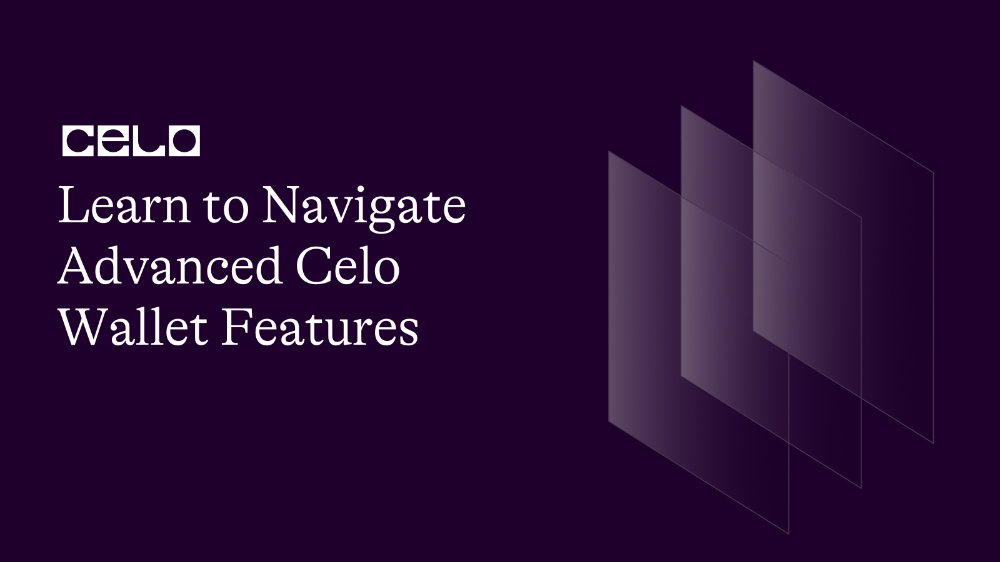

## Introduction

Celo is a mobile-first blockchain platform that has a goal to simplify access to global financial services. With its focus on mainstream adoption, Celo provides a user-friendly and accessible experience for people worldwide.

In this tutorial, we will explore the advanced features of the [Celo wallet](https://celowallet.app/), showing you how to navigate the platform with ease and take advantage of its full range of capabilities.

## Prerequisites

Before starting this tutorial, it is recommended to have a basic understanding of the Celo platform and its functionalities. You should also have a Celo wallet set up and ready to use.

To follow this tutorial, you should have some basic knowledge of how to use a Celo wallet and how to execute transactions on the Celo network. If you are new to Celo, we recommend checking out the official [Celo wallet guide](https://docs.celo.org/wallet) before proceeding.

You will also need to have a Celo wallet set up and funded with CELO and cUSD. If you don't have a wallet yet, you can create one easily on the Celo web wallet or using the Valora mobile app.

## Requirements

There are no specific requirements for this tutorial.

There are no specific technology requirements for this tutorial, but you should have access to a computer and a stable internet connection.

To follow this tutorial, you will need to have the following:

- A Celo wallet with some funds
- Access to a web browser (preferably Google Chrome or Firefox)
- Basic knowledge of how to use a wallet to send and receive funds

You will also need to have a Celo wallet with **CELO** and **cUSD** balances, as mentioned in the prerequisites section.

In addition, we will be using the [Celo Terminal](https://celoterminal.com/) tool in this tutorial to interact with the Celo network. You can install Celo Terminal by following the instructions in the official Celo documentation.

### Getting Started

In this tutorial, we will cover the following advanced Celo wallet features:

1. Sending and receiving transactions
2. Managing multiple accounts
3. Exploring the Celo network and its tools

### Getting Started with Advanced Celo Wallet Features

[CeloWalletInterface](./images/1.png)

(image source: [Techcrunch](https://techcrunch.com/2020/03/11/celo-alliance-for-prosperity/amp/))

Now that you have all the necessary prerequisites in place, let's dive into some of the advanced features that the Celo wallet has to offer.

### 1. Exporting and Importing a Wallet

One of the most powerful features of the Celo wallet is the ability to export and import your wallet. This allows you to move your wallet between devices or back up your keys securely.

To export your wallet:

1. Open your Celo wallet and click on the three vertical dots in the top-right corner of the screen.
2. Select "Export Wallet" from the dropdown menu.
3. Enter your wallet password to confirm the export.
4. Save the exported file in a secure location, such as an encrypted USB drive or a password-protected folder.

To import your wallet:

1. Open your Celo wallet on the device you want to import your wallet into.
2. Click on the three vertical dots in the top-right corner of the screen.
3. Select "Import Wallet" from the dropdown menu.
4. Choose the exported file and enter your password to import your wallet.

### 2. Sending and Receiving Transactions

The Celo wallet allows you to send and receive transactions in a variety of currencies, including CELO, cUSD, and cEUR. To send a transaction, follow these steps:

1. Open your Celo wallet and navigate to the "Send" tab.
2. Enter the recipient's address and the amount you wish to send.
3. Select the currency you want to use for the transaction.
4. Review the transaction details and click "Send" to complete the transaction.

To receive a transaction, simply provide your Celo wallet address to the sender. They can then send the funds directly to your wallet.

### 3. Managing Multiple Accounts

The Celo wallet also allows you to manage multiple accounts, giving you greater flexibility and control over your funds. To create a new account, follow these steps:

1. Open your Celo wallet and navigate to the "Accounts" tab.
2. Click the "+" button to create a new account.
3. Choose a name for your account and select the currency you wish to use.
4. Review the details and click "Create Account" to complete the process.

You can switch between accounts at any time by selecting the desired account from the "Accounts" tab.

### 4. Using Multi-Signature Wallets

[Multisigfeature](./images/2.png)

(image credit: [Medium](https://medium.com/the-capital/how-can-a-multisig-wallet-secure-your-transactions-482d3ac22ffe))

Another powerful feature of the Celo wallet is the ability to create and use multi-signature wallets. A multi-signature wallet requires multiple parties to sign a transaction before it can be executed, making it an excellent tool for organizations or teams.

Here's how to create a multi-signature wallet:

1. Open your Celo wallet and click on the three vertical dots in the top-right corner of the screen.
2. Select "Create Multi-Sig Wallet" from the dropdown menu.
3. Choose the number of required signatures for the wallet.
4. Enter the addresses of the other parties who will be signing transactions for this wallet.
5. Confirm the creation of the multi-signature wallet.

To use a multi-signature wallet, simply sign transactions as you would normally, but make sure that the required number of signatures are present before submitting the transaction.

### 5. Connecting to External DApps

This is yet another grand feature of the Celo wallet. The Celo wallet can also be used to connect to external decentralized applications (DApps) on the Celo network.

Here's how to do it:

1. Open your Celo wallet and click on the three vertical dots in the top-right corner of the screen.
2. Select "Connect to External DApps" from the dropdown menu.
3. Choose the DApp you want to connect to from the list of available options.
4. Follow the instructions provided by the DApp to connect your wallet and begin using the application.

### 6. Exploring the Celo Network and its Tools

Celo provides a range of tools and resources to help you explore the platform and its capabilities. Here are some useful resources to check out:

1. The Celo Explorer: This is a comprehensive tool that allows you to explore the Celo network, view transactions and blocks, and track network activity in real time.
2. Celo Terminal: This is a command-line interface that provides access to a range of Celo network tools, including the ability to send transactions and interact with smart contracts.
3. The Celo Forum: This is a community-driven forum where you can connect with other Celo users, ask questions, and share knowledge and experiences.

With these resources, you can gain a deeper understanding of the Celo network and its capabilities, allowing you to take full advantage of everything it has to offer.

## Conclusion

In this tutorial, we have explored some of the advanced features of the Celo wallet, including sending and receiving transactions, having multiple signatures, managing multiple accounts, and exploring the Celo network and its tools. By mastering these features, you can navigate the platform with ease and take full advantage of its advanced features.

## Next Steps

To continue learning about Celo Wallet and how Celo cryptography/blockchain works, consider exploring some of the following resources:

1. [Celo's official documentation](https://docs.celo.org/): This comprehensive resource provides detailed information on the Celo platform, its capabilities, and its tools.
2. [Celo's GitHub repository](https://github.com/celo-org): This is the official repository for Celo's codebase, where you can explore the platform's source code and contribute to its development.
3. [Celo's Discord channel](https://discord.gg/celo): This is a great place to get help, share ideas, and connect with other members of the Celo community. Whether you're a beginner or an experienced user, you'll find a wealth of information and support on Celo's Discord channel.

## About the Author:

Imole Peter L.

A web3 enthusiast, content writer for web3 brands, visual artist, and seasoned author (Pen name: [Sasani Eldis](https://www.amazon.com/Imole-Latona/e/B088F4KF7H)). Connect with me on [LinkedIn](https://www.linkedin.com/in/imole-peter-latona)

## References:

1. Celo Documentation. (n.d.). Celo Wallet. Retrieved from [https://docs.celo.org/celo-wallet](https://docs.celo.org/celo-wallet)
2. Celo Documentation. (n.d.). Getting Started with Celo Wallet. Retrieved from [https://docs.celo.org/celo-wallet/getting-started](https://docs.celo.org/celo-wallet/getting-started)
3. Celo Documentation. (n.d.). Celo Wallet FAQ. Retrieved from [https://docs.celo.org/celo-wallet/faq](https://docs.celo.org/celo-wallet/faq)
4. Celo Discord channel. (n.d.). Retrieved from [https://discord.gg/6yWMkgM](https://discord.gg/6yWMkgM)
5. Kaur, H. (2021, March 30). How to use Celo Wallet: A Beginner's Guide. CryptoTicker. Retrieved from [https://cryptoticker.io/en/celo-wallet-guide/](https://cryptoticker.io/en/celo-wallet-guide/) 
