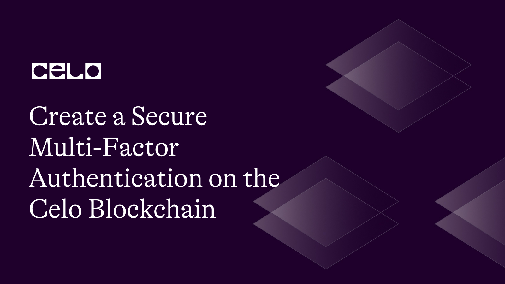

## Introduction

In this tutorial, we will demonstrate how to use Solidity to and JavaScript to establish a Multi-Factor authentication on the Celo Blockchain. Celo is a Blockchain platform designed to build a more open, transparent and inclusive financial system with no need for conventional intermediaries like banks or payment processors. 

We will walk you through every step of its creation, testing, debugging, and deployment so as to reduce the risk of theft or fraud. 

## Prerequisites​

To begin, you should have a fundamental understanding of the following before you can create a safe multi-signature wallet on the Celo Blockchain.

- Solidity programming language: You should be familiar with Solidity, which is the programming language used to write smart contracts on the Ethereum and Celo blockchains.

- A basic understanding of the Javascript programming language.

- Celo Blockchain: You should have an understanding of the Celo Blockchain and its ecosystem, including how to set up a Celo node and interact with the network using Truffle.

- Familiarity with hashing algorithms and their usage in securing user passwords.

- Understanding of MFA concepts and various authentication mechanisms such as OTP, hardware tokens, biometric authentication, and email or SMS-based authentication.

- Truffle: You should be familiar with Truffle, a development environment set up for writing and testing Solidity smart contracts.

## Requirements​

The following technologies and frameworks are going to be needed to create a secure Multi-signature wallet Contract on the Celo Blockchain. 

- Visual Studio Code: Visual Studio Code is a popular code editor that supports a variety of programming languages and frameworks. It has many extensions available for Solidity and blockchain development, making it a popular choice for developing smart contracts on the Celo Blockchain.

- Node.js: Node.js is a JavaScript runtime that used to execute Javascript code outside of a web browser.  Make sure to have NodeJS 12.0.1+ installed.

- Remix: Remix is a web-based Integrated Development Environment (IDE) for Solidity smart contracts. It allows you to write, compile, and deploy Solidity smart contracts directly from your web browser.
 
- Truffle: Truffle is a development framework for Ethereum and Celo smart contracts. It provides a suite of tools for developing, testing, and deploying smart contracts, as well as a built-in testing framework.

## Steps to Creating a Multi-Factor Authentication on the Celo​ Blockchain

### 1. Setting up a Development Environment Locally
A development environment is a repository that houses software, resources and web materials that are used to develop and build a computer program or software. Our first step is going to be setting up a local development environment. 

You can set up your local development environment with the steps below: 
- Step 1: Install Node.js on your machine locally 
- Step 2: Open Visual studio code, create a folder which will be housing our repository, in this case we’ll call it multiFactorAuthentication after which we would create another folder inside of it and name it contracts, then create another folder called migrations. 
- Step 3: Create a file and name it MultiFactorAuth.sol in the contracts folder, then create a file in the migrations folder called 2_deploy_contract.js 

 The development environment is now set, we can now go forward to Define our user data.
 
### 2. Define the User Data and Authentication Mechanisms
You can define the user Data and authentication mechanisms by including the data fields for each user account that store the following information: 

- Username
- Password hash
- Salt (for password hashing)
- Public key (for hardware token authentication) 
- Email address (for email-based OTP authentication)
- Phone number (for SMS-based OTP authentication)
- Biometric data (if using biometric authentication)
- one-time passwords (OTP), 
- hardware tokens, 
- biometric authentication, and 
- email or SMS-based authentication.

### 3. Write the Smart Contract
  
In our MultiFactorAuth.sol we’re going to be writing the Solidity smart contract that will implement the Multi-Factor authentication system comes next after the user data and authentication processes have been defined. An illustration of a smart contract is shown below:

```MultiFactorAuth.sol
contract MultiFactorAuth {
    struct User {
        bytes32 username;
        bytes32 passwordHash;
        bytes32 salt;
        bytes32 publicKey;
        bytes32 email;
        bytes32 phoneNumber;
        bytes32 biometricData;
        bytes32 name;
        uint256 dateOfBirth;
        bytes32 streetAddress;
        bytes32 city;
        bytes32 state;
        bytes32 country;
        uint256 zipCode;
}
    mapping(address => User) private users;

    function createUser(
    bytes32 _username,
    bytes32 _passwordHash,
    bytes32 _salt,
    bytes32 _publicKey,
    bytes32 _email,
    bytes32 _phoneNumber,
    bytes32 _biometricData,
    bytes32 _name,
    uint256 _dateOfBirth,
    bytes32 _streetAddress,
    bytes32 _city,
    bytes32 _state,
    bytes32 _country,
    uint256 _zipCode
) public {
    require(users[msg.sender].username == 0x0, "User already exists");

    users[msg.sender] = User(
        _username,
        _passwordHash,
        _salt,
        _publicKey,
        _email,
        _phoneNumber,
        _biometricData,
        _name,
        _dateOfBirth,
        _streetAddress,
        _city,
        _state,
        _country,
        _zipCode
    );
}

function updateUser(
    bytes32 _username,
    bytes32 _passwordHash,
    bytes32 _salt,
    bytes32 _publicKey,
    bytes32 _email,
    bytes32 _phoneNumber,
    bytes32 _biometricData,
    bytes32 _name,
    uint256 _dateOfBirth,
    bytes32 _streetAddress,
    bytes32 _city,
    bytes32 _state,
    bytes32 _country,
    uint256 _zipCode
) public {
    require(users[msg.sender].username != 0x0, "User does not exist");

    users[msg.sender] = User(
        _username,
        _passwordHash,
        _salt,
        _publicKey,
        _email,
        _phoneNumber,
        _biometricData,
        _name,
        _dateOfBirth,
        _streetAddress,
        _city,
        _state,
        _country,
        _zipCode
    );
}
    function authenticate(uint256 _otp, bytes32 _token, bytes32 _biometricData) public view returns (bool) {
        // Verify that the user has an email or phone number on file
        require(users[msg.sender].email != 0x0 || users[msg.sender].phoneNumber != 0x0, "User has no email or phone number on file");

        // Verify that the user has a public key on file
        require(users[msg.sender].publicKey != 0x0, "User has no public key on file");

        // Verify that the user has biometric data on file
        require(users[msg.sender].biometricData != 0x0, "User has no biometric data on file");

        // Verify the OTP
        uint256 expectedOTP = generateOTP(users[msg.sender].salt);
        require(_otp == expectedOTP, "Invalid OTP");

        // Verify the hardware token
        bytes32 expectedToken = generateHardwareToken(users[msg.sender].publicKey);
        require(_token == expectedToken, "Invalid hardware token");

        // Verify the biometric data
        bytes32 expectedBiometricData = generateBiometricData(users[msg.sender].salt, users[msg.sender].biometricData);
        require(_biometricData == expectedBiometricData, "Invalid biometric data");

        // All factors are valid, so return true
        return true;
    }

    function generateOTP(bytes32 _salt) private view returns (uint256) {
        // Generate a random number using the salt and current block timestamp
        uint256 randomNumber = uint256(keccak256(abi.encodePacked(_salt, block.timestamp)));

        // Take the last six digits of the random number as the OTP
        return randomNumber % 1000000;
    }

    function generateHardwareToken(bytes32 _publicKey) private view returns (bytes32) {
        // Generate a hash of the public key and current block timestamp
        bytes32 hash = keccak256(abi.encodePacked(_publicKey, block.timestamp));
    
        // Take the first 32 bytes of the hash as the hardware token
return bytes32(bytes20(hash));
}

```

### 4. Test and Debug the Smart Contract

In order to make sure the smart contract works as planned, you should test and debug it after writing it. Using Truffle and Remix, follow these steps to test and debug the smart contract: 

- Step 1: Install Truffle

To install Truffle, open a terminal window  and move into the folder by running the following command: 

```
cd multiFactorAuthentication
npm install -g truffle
```

- Step 2: Create a New Truffle Project
Next, create a new Truffle project by running the following commands:

```
mkdir my-project
cd my-project
truffle init
```

This will create a new Truffle project with a basic directory structure.

- Step 3: Copy the Smart Contract
Copy the smart contract that you wrote earlier into the contracts directory of your Truffle project.

- Step 4: Compile the Smart Contract
To compile the smart contract, run the following command:

```
truffle compile
```

This will compile the smart contract and generate the ABI and bytecode.

- Step 5: Write Tests

Next, write tests for the smart contract. Create a new file called multi_factor_auth.js in the test directory of your Truffle project, and add the following code:

```js

const MultiFactorAuth = artifacts.require("MultiFactorAuth");

contract("MultiFactorAuth", accounts => {
  it("should create a new user", async () => {
    const mfa = await MultiFactorAuth.deployed();
    const username = "testuser";
    const passwordHash = "testpassword";
    const salt = "testsalt";
    const publicKey = "testpublickey";
    const email = "testuser@example.com";
    const phoneNumber = "123-456-7890";
    const biometricData = "testbiometricdata";
    const name = "Test User";
    const dateOfBirth = 1234567890;
    const streetAddress = "123 Test St";
    const city = "Testville";
    const state = "Test State";
    const country = "Test Country";
    const zipCode = "12345";

    await mfa.createUser(
      web3.utils.fromAscii(username),
      web3.utils.fromAscii(passwordHash),
      web3.utils.fromAscii(salt),
      web3.utils.fromAscii(publicKey),
      web3.utils.fromAscii(email),
      web3.utils.fromAscii(phoneNumber),
      web3.utils.fromAscii(biometricData),
      web3.utils.fromAscii(name),
      dateOfBirth,
      web3.utils.fromAscii(streetAddress),
      web3.utils.fromAscii(city),
      web3.utils.fromAscii(state),
      web3.utils.fromAscii(country),
      zipCode
    );

    const user = await mfa.users(accounts[0]);
    assert.equal(web3.utils.toAscii(user.username).replace(/\u0000/g, ""), username);
  });
});
```

This test will deploy the smart contract, create a new user, and then verify that the user was created successfully.

- Step 6: Run Tests

To run the tests, run the following command in the terminal:

truffle test

This will run the tests and output the results to the console.

- Step 7: Debug with Remix

If you encounter any errors while testing, you can use Remix to debug the smart contract. To do this, open Remix in your web browser and navigate to the "Solidity" tab. Then, select smart contract and click the "Compile" button.

## 5. Deploy the Smart Contract 
Here is an example of how you could deploy the smart contract 

- Step 1: Open Visual Studio Code and create a new folder for your project.

- Step 2: In the terminal, navigate to the new folder and initialize a new Node.js project by running the following command:

```
 npm init -y
```

- Step 3: Install the following dependencies by running these commands:

```
 npm install --save-dev @celo/contractkit
 npm install --save-dev @truffle/hdwallet-provider
```


- Step 4: Compile the Solidity smart contract by running the following command in the terminal:

```
npx hardhat compile
```

Step 5: In the terminal, start a new instance of Remix by running the following command:

```
npx remixd -s <project_folder> --remix-ide https://remix.ethereum.org
```

This will create a secure tunnel between your local project folder and the Remix IDE running in your web browser.

- Step 6: In your web browser, navigate to https://remix.ethereum.org and click the "Connect to Localhost" button. Select "Web3 Provider" from the dropdown menu and enter the following URL: http://localhost:8545

Click "Connect".

- Step 7: In Remix, click the "Solidity Compiler" tab and make sure that "0.8.0" is selected as the compiler version. Click "Compile MultiFactorAuth.sol" to compile the smart contract.

- Step 8: In Remix, click the "Deploy & Run Transactions" tab. Select "Injected Web3" from the dropdown menu and make sure that the account you want to deploy from is selected in the next dropdown menu.

- Step 9: Under "Contract", select "MultiFactorAuth'' from the dropdown menu. Click "Deploy". This will deploy the smart contract to the Celo blockchain.

- Step 10: Once the smart contract has been deployed, you can interact with it by clicking the "Contract" dropdown menu in Remix and selecting "MultiFactorAuth". This will allow you to call the functions defined in the smart contract.

Congratulations, you have successfully deployed a multi-factor authentication smart contract on the Celo blockchain using Solidity and the tools and technologies mentioned in your requirements!

## Common Errors Encountered and How to Fix them

- Error 1: Node.js installation error

If you encounter an error while installing Node.js, it may be because of an issue with the internet connection or the version of the operating system.

Solution:
To fix this error, ensure that your internet connection is stable and retry the installation. Alternatively, try installing an older version of Node.js that is compatible with your operating system. You can find older versions of Node.js on the official Node.js website.

- Error 2: Remix installation error

If you encounter an error while installing Remix, it may be because of a conflict with your firewall settings or anti-virus software.

Solution:
To fix this error, disable your firewall temporarily or add an exception for Remix. Alternatively, try installing Remix on a different computer or network.

Error 3: Truffle installation error

If you encounter an error while installing Truffle, it may be because of an issue with the installation directory or the version of Node.js.

Solution:
To fix this error, ensure that you have the latest version of Node.js installed and try reinstalling Truffle. Alternatively, try installing Truffle in a different directory or on a different computer.

Code illustration on the terminal:

```
 //Node.js installation
sudo apt install nodejs
node --version

//Remix installation
npm install -g remix-ide

//Truffle installation
npm install -g truffle
```


## Conclusion​

This tutorial has taught us how to create a Multi-Factor Authentication on the Celo Blockchain using Javascript and Solidity. Setting up a local development environment was the first step in establishing the user authentication process. Next, the smart contract was written, tested, and debugged before being deployed using remix and truffle.  possible errors that were made and fixed during creation. 

## Next Steps​

We can now explore more advanced features and functionalities of smart contracts, such as automation, modification, smart contracts, maintenance for security checks, and identity preservation on the Blockchain, because we have developed and deployed a multi-factor authentication on the Celo Blockchain. Take care!!

## About the Author​

Michael Diagbare is a Software Engineer with expertise in Web, Blockchain development and content creation, certified by Cisco and MongoDB university. He is passionate about building software, problem solving and helping programmers deal with complicated tasks and challenges.
Connect with me on [LinkedIn](https://www.linkedin.com/in/diagbare-michael/)

## References​

- [Learn how to install nodejs](https://nodejs.dev/en/learn/how-to-install-nodejs/)
- [How to install remix os on pc](https://appuals.com/how-to-install-remix-os-on-pc/)
- [Truffle guides](https://trufflesuite.com/guides/how-to-install-truffle-and-testrpc-on-windows-for-blockchain-development/)
- [smart contracts compiling](https://ethereum.org/en/developers/docs/smart-contracts/compiling/)

