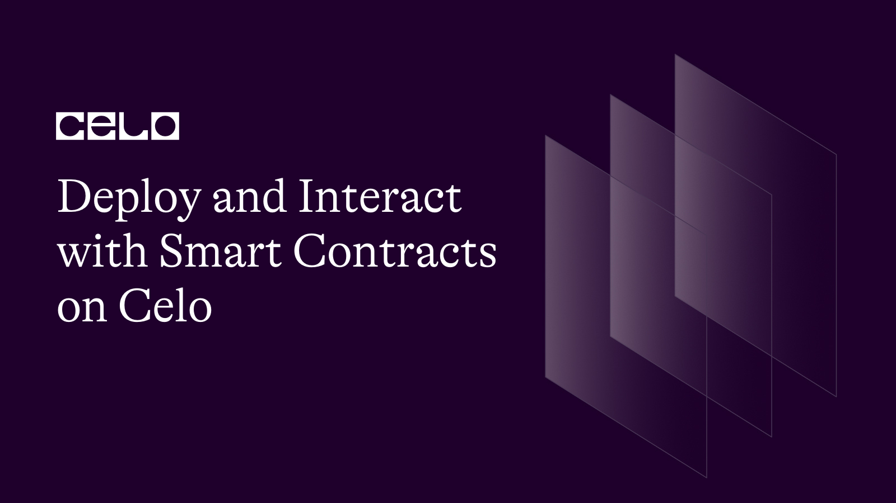

## Deploy and Interact with Smart Contracts on the Celo Blockchain

In this tutorial, you’ll learn how to deploy and interact with smart contracts on the Celo blockchain.

---

## Introduction:

The Celo Blockchain is a platform designed specifically for Ethereum. The platform hosts a set of Solidity programs for implementing smart contracts. You may already be aware that smart contracts are self-executing programs that carry out a contract's terms on your behalf. The open-source platform Celo Blockchain enables users to build decentralized applications and smart contracts. You will discover how to deploy and work with smart contracts on the Celo blockchain in this guide.

## Prerequisites:

You need to have a fundamental knowledge of the Celo network and blockchain technology to follow this course. Solidity is a programming language that is used to create smart contracts on the Ethereum and Celo networks, therefore you should be familiar with that as well. Also, you need to set up a local development environment, have access to the [Celo Command Line Interface (CLI)](https://docs.celo.org/cli), and have a Celo account.

## Requirements:

The following tools are what you need to work with to deploy and operate smart contracts on the Celo blockchain:

1. Celo CLI
2. A text editor (e.g., Visual Studio Code)
3. Node.js
4. npm (Node Package Manager)
5. Ganache CLI (for local development)
6. Solidity compiler (e.g., solc)

### Steps to Deploying and Interacting with Smart Contracts on Celo Blockchain

1. Setting up a Local Development Environment

A development environment is an environment in which all resources and tools used to develop a program or software product are available. The first step to deploying is an attempt to create a development environment with a set of processes and tools used to develop [smart contracts](https://www.coinbase.com/learn/crypto-basics/what-is-a-smart-contract).

You can set up your local development environment by following these steps:

Step 1: Install Node.js and npm on your machine.

Step 2: Install the Celo CLI by running the following command in a terminal.

npm install -g @celo/cli

Step 3: Install the Ganache CLI by running the following command in your terminal.

npm install -g ganache- cli

Step 4. Install the Solidity compiler by running the following command in Terminal:

npm install -g solc

2. Writing a Smart Contract

You can write a smart contract by following these steps:

Step 1: Open your text editor and create a new file.

Step 2: Write the code for your smart contract in Solidity.

For example, you could write a simple smart contract that stores a string:

```solidity
pragma solidity ^0.8.0;
contract MyContract {
  string public myString;
  function setMyString(string memory _myString) public {
      myString = _myString;
  }
}
```

Step 3: Save the file with a .sol extension (e.g., MyContract.sol).

3. Compiling the Smart Contract

After creating file extensions for operation purposes e.g saving strings, compile the smart contract by following these steps:

Step 1: Open your terminal and navigate to the smart contract file's directory.

Step 2: Run the following command to compile the smart contract:

```solidity
solc MyContract.sol --bin --abi --optimize -o ./build
```

This command compiles the smart contract and generates two files:

- MyContract.bin, and
- MyContract.abi.

The .bin file contains the bytecode of the compiled smart contract, and the .abi file contains the Application Binary Interface (ABI) that describes how to interact with the smart contract.

4. Deploying the Smart Contract

You can [deploy the smart contract on the Celo blockchain](https://docs.celo.org/community/release-process/smart-contracts) following these steps:

Step 1: Start the Ganache CLI by running the following command in your terminal:

ganache-cli

Step 2: Open a new terminal window and navigate to the smart contract file's directory.

Step 3: Run the following command to deploy the smart contract:

```bash
  celocli contract deploy MyContract.bin MyContract.abi --from <YOUR-CELO-ADDRESS>
```

Replace &lt;YOUR-CELO-ADDRESS> with your Celo address.

Step 4: The celocli command will return the contract address of the deployed smart contract.

Step 5: Copy the contract address for use in the next step.

5. Interacting with the Smart Contract

After deploying the created smart contract, the next step is to interact with the smart contract. Take these steps:

Step 1: Open a new file in your text editor.

Step 2: Write the code to interact with the smart contract.

For example, you could write a script that sets the value of the string in the smart contract:

```js
const Web3 = require("web3");
const contractABI = require("./MyContract.abi.json");
const web3 = new Web3("<YOUR-CELO-RPC-ENDPOINT>");
const myContract = new web3.eth.Contract(
  contractABI,
  "<YOUR-CONTRACT-ADDRESS>"
);
myContract.methods
  .setMyString("Hello, World!")
  .send({
    from: "<YOUR-CELO-ADDRESS>",
    gas: 500000,
  })
  .then((receipt) => {
    console.log(receipt);
  });
```

Replace &lt;YOUR-CELO-RPC-ENDPOINT>, &lt;YOUR-CONTRACT-ADDRESS>, and &lt;YOUR-CELO-ADDRESS> with your Celo RPC endpoint, contract address, and Celo address, respectively.

Step 3: Save the file with a .js extension (e.g., interact.js).

Step 4: Run the nodejs script by running the following command in your terminal:

```bash
 node interact.js
```

This will set the value of the string in the smart contract to "Hello, World!".

### Common Errors Encountered and How to Fix them

Here are some common errors you might encounter while following this tutorial, along with their corrections:

1. Error: "Cannot find module 'web3'"

This error occurs when the web3 module is not installed in your project. To fix it, run the following command in your terminal:

```bash
npm install web3
```

2. Error: "TypeError: Cannot read property 'options' of undefined"

This error occurs when the contract object is not properly instantiated. To resolve this issue, ensure that the contract address and ABI are correct and that the web3 object is properly initialized.

3. Error: "Error: Invalid JSON RPC response: undefined"

This error occurs when the RPC endpoint is invalid or not responding. To resolve this issue, ensure that the RPC endpoint is correct and the Celo node is functioning properly.

4. Error: "Error: Transaction has been reverted by the EVM"

To resolve this issue, check the error message returned by the transaction and change the smart contract code as needed or increase the gas limit.

5. Error: "Error: Private key does not match any account"

This error occurs when the private key used to sign the transaction does not match the account on the Celo network. To resolve this issue, please ensure that your private key and address are correct and that your account has been properly credited.

6. Error: "Error: Returned values aren't valid, did it run Out of Gas?"

This error occurs when a smart contract function runs out of gas before completing execution.

To solve this problem, either increase the gas limit for the transaction or optimize the smart contract code to reduce gas consumption.

These are the common errors you may encounter while following this guide. If a different error occurs, see the error message for details and determine the cause of the problem. You can also do a quick online search to find solutions to other common mistakes.

## Conclusion:

This tutorial taught us how to deploy and interact with smart contracts on the Celo blockchain. We started by setting up a local development environment, and proceeded to write a simple smart contract in Solidity, compiled and deployed the smart contract using the Celo CLI, and finally interacted with the smart contract using a Node.js script.

## Next Steps:

Now that you have deployed and interacted with a simple smart contract on the Celo blockchain, you can explore more advanced features and functionalities of smart contracts, such as; event logging, function modifiers, and inheritance. You can also explore other tools and frameworks for building decentralized applications on the Celo network, such as Truffle and Hardhat. Enjoy coding!

## About the Author:

Imole Peter L.

A web3 enthusiast, content writer for web3 brands, visual artist, and a seasoned author (Pen name: [Sasani Eldis](https://www.amazon.com/Imole-Latona/e/B088F4KF7H))

Connect with me on [LinkedIn](https://www.linkedin.com/in/imole-peter-latona)

## References:

1. [https://www.coinbase.com/learn/crypto-basics/what-is-a-smart-contract](https://www.coinbase.com/learn/crypto-basics/what-is-a-smart-contract)
2. [https://docs.celo.org/cli](https://docs.celo.org/cli)
3. [https://docs.celo.org/community/release-process/smart-contracts](https://docs.celo.org/community/release-process/smart-contracts)
