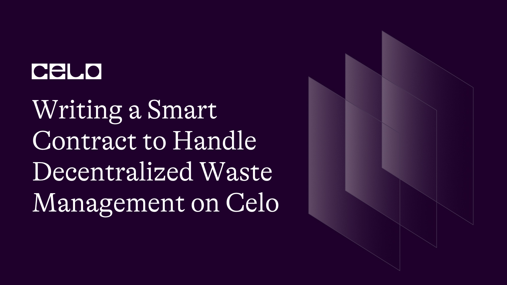

## Introduction

In this tutorial, we will create a Solidity smart contract for a decentralized waste management system. It is designed to help manage the collection, transportation, and recycling of waste in a decentralized manner. This contract uses the ERC20 token standard and utilizes OpenZeppelin's SafeERC20 and Ownable libraries

Here's the github repo of our code. [source code](https://github.com/richiemikke/celo-waste-management-contract)

## Prerequisites

To follow this tutorial, you will need the following:

- Basic knowledge of Solidity programming language.
- A Development Environment Like Remix.
- The celo Extension Wallet.

## SmartContract

Let's begin writing our smart contract in Remix IDE

The completed code Should look like this.

```solidity
// SPDX-License-Identifier: MIT
pragma solidity ^0.8.0;

import "@openzeppelin/contracts/token/ERC20/IERC20.sol";
import "@openzeppelin/contracts/token/ERC20/utils/SafeERC20.sol";
import "@openzeppelin/contracts/access/Ownable.sol";

contract DecentralizedWasteManagement is Ownable {
    using SafeERC20 for IERC20;

    IERC20 public celoToken;

    struct Waste {
        uint256 id;
        uint256 amount;
        address producer;
        address transporter;
        address recycler;
        bool isCollected;
        bool isTransported;
        bool isRecycled;
    }

    uint256 private wasteCounter;
    mapping(uint256 => Waste) public wastes;

    uint256 public wasteCollectionFee;
    uint256 public wasteTransportationFee;
    uint256 public wasteRecyclingFee;

    event WasteCollected(uint256 indexed wasteId, address indexed wasteProducer, uint256 amount);
    event WasteTransported(uint256 indexed wasteId, address indexed transporter, uint256 amount);
    event WasteRecycled(uint256 indexed wasteId, address indexed recycler, uint256 amount);

    constructor(
        address _celoTokenAddress,
        uint256 _wasteCollectionFee,
        uint256 _wasteTransportationFee,
        uint256 _wasteRecyclingFee
    ) {
        celoToken = IERC20(_celoTokenAddress);
        wasteCollectionFee = _wasteCollectionFee;
        wasteTransportationFee = _wasteTransportationFee;
        wasteRecyclingFee = _wasteRecyclingFee;
        wasteCounter = 0;
    }

    function setFees(
        uint256 _wasteCollectionFee,
        uint256 _wasteTransportationFee,
        uint256 _wasteRecyclingFee
    ) external onlyOwner {
        wasteCollectionFee = _wasteCollectionFee;
        wasteTransportationFee = _wasteTransportationFee;
        wasteRecyclingFee = _wasteRecyclingFee;
    }

    function collectWaste(address wasteProducer, uint256 amount) external {
        require(amount > 0, "Waste amount should be greater than 0");
        celoToken.safeTransferFrom(wasteProducer, address(this), wasteCollectionFee);

        wasteCounter++;
        wastes[wasteCounter] = Waste(
            wasteCounter,
            amount,
            wasteProducer,
            address(0),
            address(0),
            true,
            false,
            false
        );

        emit WasteCollected(wasteCounter, wasteProducer, amount);
    }

    function transportWaste(uint256 wasteId, address transporter) external {
        Waste storage waste = wastes[wasteId];
        require(waste.isCollected, "Waste has not been collected yet");
        require(!waste.isTransported, "Waste has already been transported");
        celoToken.safeTransferFrom(transporter, address(this), wasteTransportationFee);
        waste.transporter = transporter;
        waste.isTransported = true;
        emit WasteTransported(wasteId, transporter, waste.amount);
    }

    function recycleWaste(uint256 wasteId, address recycler) external {
        Waste storage waste = wastes[wasteId];
        require(waste.isTransported, "Waste has not been transported yet");
        require(!waste.isRecycled, "Waste has already been recycled");
        celoToken.safeTransferFrom(recycler, address(this), wasteRecyclingFee);
        waste.recycler = recycler;
        waste.isRecycled = true;
emit WasteRecycled(wasteId, recycler, waste.amount);
}

function withdrawFees(address to) external onlyOwner {
    uint256 balance = celoToken.balanceOf(address(this));
    celoToken.safeTransfer(to, balance);
}
}
```

## Contract Breakdown

**Dependencies and Imports**

We starts by specifying the license, Solidity version, and importing the required contracts from the OpenZeppelin library. OpenZeppelin is a popular library for smart contract development that provides safe and reusable implementations of common contract functionality.

```solidity
 // SPDX-License-Identifier: MIT
pragma solidity ^0.8.0;

import "@openzeppelin/contracts/token/ERC20/IERC20.sol";
import "@openzeppelin/contracts/token/ERC20/utils/SafeERC20.sol";
import "@openzeppelin/contracts/access/Ownable.sol";
```

**Decentralized Waste Management Contract**

The main contract, `DecentralizedWasteManagement`, inherits from Ownable contract provided by OpenZeppelin. This gives the contract owner special permissions, such as setting fees and withdrawing collected fees.

```solidity
contract DecentralizedWasteManagement is Ownable {
    using SafeERC20 for IERC20;
```

**State Variables and Structs**

Several state variables and a struct are defined to store information about the waste and fees:

- `celoToken`: The address of the CELO token, which is used for fee payments.
- `wasteCounter`: A counter to keep track of the total number of waste entries.
- `wastes`: A mapping that associates a waste ID with its corresponding `Waste` struct.
- `wasteCollectionFee`, `wasteTransportationFee`, `wasteRecyclingFee`: The fees for waste collection, transportation, and recycling, respectively.

The `Waste` struct is defined with fields for the waste's ID, amount, producer, transporter, recycler, and status (collected, transported, recycled).

```solidity
     IERC20 public celoToken;

    struct Waste {
        uint256 id;
        uint256 amount;
        address producer;
        address transporter;
        address recycler;
        bool isCollected;
        bool isTransported;
        bool isRecycled;
    }

    uint256 private wasteCounter;
    mapping(uint256 => Waste) public wastes;

    uint256 public wasteCollectionFee;
    uint256 public wasteTransportationFee;
    uint256 public wasteRecyclingFee;
```

**Events**

Three events are defined to emit waste-related information: `WasteCollected`, `WasteTransported`, and `WasteRecycled`.

```solidity
    event WasteCollected(uint256 indexed wasteId, address indexed wasteProducer, uint256 amount);
    event WasteTransported(uint256 indexed wasteId, address indexed transporter, uint256 amount);
    event WasteRecycled(uint256 indexed wasteId, address indexed recycler, uint256 amount);
```

**Constructor**

The constructor takes four arguments: the address of the CELO token and the initial fees for waste collection, transportation, and recycling. It initializes the state variables and sets the waste counter to 0.

```solidity
    constructor(
        address _celoTokenAddress,
        uint256 _wasteCollectionFee,
        uint256 _wasteTransportationFee,
        uint256 _wasteRecyclingFee
    ) {
        celoToken = IERC20(_celoTokenAddress);
        wasteCollectionFee = _wasteCollectionFee;
        wasteTransportationFee = _wasteTransportationFee;
        wasteRecyclingFee = _wasteRecyclingFee;
        wasteCounter = 0;
    }
```

**setFees Function**

The `setFees` function allows the contract owner to update the waste collection, transportation, and recycling fees. This function can only be called by the contract owner, as indicated by the `onlyOwner` modifier.

```solidity
       function setFees(
        uint256 _wasteCollectionFee,
        uint256 _wasteTransportationFee,
        uint256 _wasteRecyclingFee
    ) external onlyOwner {
        wasteCollectionFee = _wasteCollectionFee;
        wasteTransportationFee = _wasteTransportationFee;
        wasteRecyclingFee = _wasteRecyclingFee;
    }
```

**collectWaste Function**

The `collectWaste` function allows a user to request waste collection. It takes two arguments: the waste producer's address and the waste amount. The function ensures that the waste amount is greater than 0 and transfers the waste collection fee from the waste producer's account to the contract's account. Then, it increments the waste counter and creates a new `Waste` struct with the provided information.

```solidity
    function collectWaste(address wasteProducer, uint256 amount) external {
        require(amount > 0, "Waste amount should be greater than 0");
        celoToken.safeTransferFrom(wasteProducer, address(this), wasteCollectionFee);

        wasteCounter++;
        wastes[wasteCounter] = Waste(
            wasteCounter,
            amount,
            wasteProducer,
            address(0),
            address(0),
            true,
            false,
            false
        );

        emit WasteCollected(wasteCounter, wasteProducer, amount);
    }
```

**transportWaste Function**

The `transportWaste` function allows a user to transport waste. It takes two arguments: the waste ID and the transporter's address. The function checks if the waste has been collected and not yet transported. If the conditions are met, it transfers the waste transportation fee from the transporter's account to the contract's account and updates the `Waste` struct with the transporter's information.

```solidity
    function transportWaste(uint256 wasteId, address transporter) external {
        Waste storage waste = wastes[wasteId];
        require(waste.isCollected, "Waste has not been collected yet");
        require(!waste.isTransported, "Waste has already been transported");
        celoToken.safeTransferFrom(transporter, address(this), wasteTransportationFee);
        waste.transporter = transporter;
        waste.isTransported = true;
        emit WasteTransported(wasteId, transporter, waste.amount);
    }
```

**recycleWaste Function**

The `recycleWaste` function allows a user to recycle waste. It takes two arguments: the waste ID and the recycler's address. The function checks if the waste has been transported and not yet recycled. If the conditions are met, it transfers the waste recycling fee from the recycler's account to the contract's account and updates the `Waste` struct with the recycler's information.

```solidity
     function recycleWaste(uint256 wasteId, address recycler) external {
        Waste storage waste = wastes[wasteId];
        require(waste.isTransported, "Waste has not been transported yet");
        require(!waste.isRecycled, "Waste has already been recycled");
        celoToken.safeTransferFrom(recycler, address(this), wasteRecyclingFee);
        waste.recycler = recycler;
        waste.isRecycled = true;
        emit WasteRecycled(wasteId, recycler, waste.amount);
    }
```

**withdrawFees Function**

The `withdrawFees` function allows the contract owner to withdraw the collected fees. It takes one argument: the address to send the fees to. The function retrieves the current balance of the contract and transfers the entire amount to the specified address. This function can only be called by the contract owner, as indicated by the `onlyOwner` modifier.

```solidity
    function withdrawFees(address to) external onlyOwner {
        uint256 balance = celoToken.balanceOf(address(this));
        celoToken.safeTransfer(to, balance);
    }
}
```

## Deployment

**Install the Celo Plugin**

First, you'll need to install the Celo Plugin for Remix. To do this, open Remix and click on the `Plugin Manager` icon on the left-hand side. Search for `Celo` and click the `Install` button next to the Celo Plugin. Once the installation is complete, you'll see a new `Celo` tab appear in the sidebar.

**Connect to the Celo Alfajores Testnet**

To deploy our smart contract successfully, we need the celo extention wallet which can be downloaded from [here](https://chrome.google.com/webstore/detail/celoextensionwallet/kkilomkmpmkbdnfelcpgckmpcaemjcdh?hl=en)

Next, we need to fund our newly created wallet which can done using the celo alfojares faucet [Here](https://celo.org/developers/faucet)

Next, you'll need to connect Remix to the Celo Testnet. Click on the `Celo` tab in the sidebar and then click on the `Connect to Network` button.

**Compile Contract**

Open the `DecentralizedWasteManagement.sol` file in Remix and click on the `Solidity Compiler` tab in the sidebar. Click the `Compile DecentralizedWasteManagement.sol` button to compile the contract.

**Deploy the Contract**

Click on the `Deploy & Run Transactions` tab in the sidebar. In the `Contract` dropdown menu, select `DecentralizedWasteManagement`.

**Interact with the Contract**

Once the contract is deployed, you can interact with it using the functions in the `Deployed Contracts` section of the `Deploy & Run Transactions` tab. You'll need to connect to the contract using the `At Address` button and entering the contract address. From there, you can call the various functions of the contract, such as staking, unstaking, withdrawing rewards, and transferring ownership.

That's it! With these steps, you should be able to deploy the `DecentralizedWasteManagement` smart contract to the Celo Testnet using Remix and the Celo Plugin.

## Conclusion

In this tutorial, we have explained a Solidity contract for a decentralized waste management system. The contract utilizes an ERC20 token (CELO) to handle payments for waste collection, transportation, and recycling services. The main features of the contract include:

- Collecting, transporting, and recycling waste.
- Setting and updating fees for waste-related services.
- Emitting events for waste-related actions.
- Withdrawing collected fees by the contract owner.

This contract can serve as a foundation for a decentralized waste management system on a blockchain network, with potential modifications and improvements depending on the specific requirements of the system.

## Learn More

I hope you learned a lot from this tutorial. Here are some relevant links that would aid your learning further.

- [Celo Docs](https://docs.celo.org/)
- [Solidity Docs](https://docs.soliditylang.org/en/v0.8.17/)

## About the author

Hello, I'am Richard Michael, a fullstack web3 developer.
