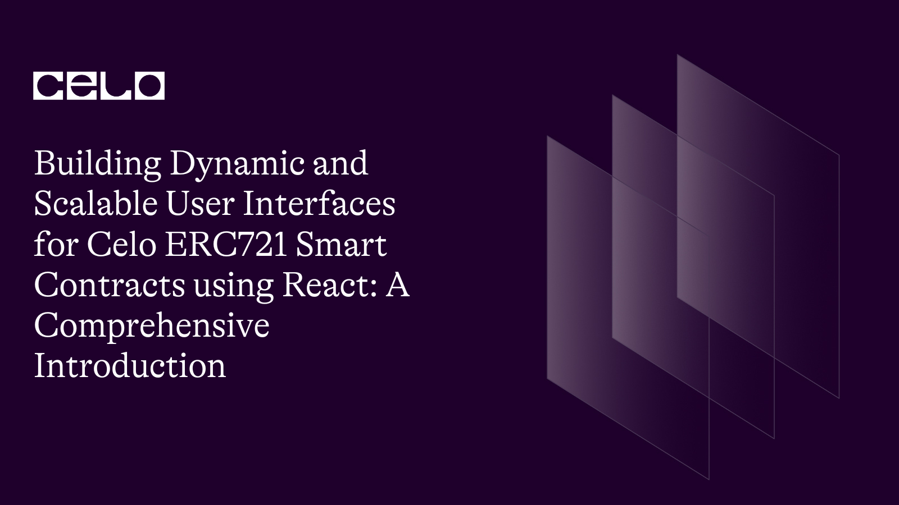

## Introduction

Welcome to another tutorial by yours truly😉, This tutorial is part of a bigger NFT series and the aim of this is to help one become an expert in building NFT marketplaces as we know, NFTs are the future.
In this tutorial, we would be going through how to integrate your ERC721 smart contract with react.
This is in conjunction with a bigger project and I have explained some other parts of the project in more detail.

This tutorial would provide you with the tools you need to setup your react project and also walk you through writing some react implementation code.

## Prerequisites

- Prior knowledge of javascript
- Familiarity with the command line
- Basic understanding of blockchain concepts
- Have some knowledge of solidity and its concepts
- Have a basic understanding of **[React](https://react.org)**. Knowledge of JSX, props, state, and hooks.

## Requirements
- **[NodeJS](https://nodejs.org/en/download)** from V12.or higher
- A code editor or text editor. **[VSCode](https://code.visualstudio.com/download)** is recommended
- A terminal. **[Git Bash](https://git-scm.com/downloads)** is recommended
- An Internet Browser and a good internet connection

## Why Use React?

When it comes to implementing smart contracts on the Celo blockchain, React can be used to build a user interface that interacts with the smart contracts. Here are some reasons why you might choose to use React for this task:

1. React makes it easy to build complex user interfaces: React's component-based architecture makes it easy to create reusable UI elements that can be combined to build complex user interfaces. This can be particularly useful when building a user interface for interacting with smart contracts, as there may be many different actions and data inputs required.

2. React is fast and efficient: React is designed to be fast and efficient, which can be important when building a user interface that interacts with smart contracts on the blockchain. By using React, you can ensure that your UI remains responsive and performs well, even when dealing with large amounts of data.

3. React has a large and active community: React has a large and active community of developers who contribute to the library and share their knowledge and experience. This can be particularly useful when building a user interface for interacting with smart contracts, as there may be complex issues or challenges that arise during development.

4. React integrates well with other libraries and tools: React can be used alongside other libraries and tools, such as Redux for state management, React Router for routing, and Web3.js for interacting with the blockchain. This can make it easier to build a comprehensive solution for interacting with smart contracts on the Celo blockchain.

## Getting Started

React is a popular JavaScript library used for building user interfaces. It is widely used in web development due to its ability to create reusable UI components and its fast rendering capabilities. In this article, we will provide a detailed guide on how to install React using relevant terminal code.
As I have always done in these series, I would point out the smart contract we are implementing for those new to this tutorial!

### MyNFT.sol

```solidity
// SPDX-License-Identifier: MIT
pragma solidity ^0.8.0;

import "@openzeppelin/contracts/token/ERC721/ERC721.sol";
import "@openzeppelin/contracts/token/ERC721/extensions/ERC721Enumerable.sol";
import "@openzeppelin/contracts/token/ERC721/extensions/ERC721URIStorage.sol";
import "@openzeppelin/contracts/access/Ownable.sol";
import "@openzeppelin/contracts/utils/Counters.sol";

contract MyNFT is ERC721, Ownable, ERC721Enumerable, ERC721URIStorage {
    using Counters for Counters.Counter;

    Counters.Counter private _tokenIdCounter;
    address contractAddress;

    constructor(address marketplace) ERC721("Dripto Ponks", "DPT") {
        contractAddress = marketplace;
    }

    uint256 _tokenId = 0;

    function mint(string memory uri) external returns (uint256) {
        _tokenId++;
        _mint(msg.sender, _tokenId);
        _setTokenURI(_tokenId, uri);
        setApprovalForAll(contractAddress, true);
        return _tokenId;
    }

    function resaleApproval(uint256 tokenId) public {
        require(
            ownerOf(tokenId) == msg.sender,
            "You must own this NFT in order to resell it"
        );
        setApprovalForAll(contractAddress, true);
        return;
    }

    function getTokenId() external view returns (uint256) {
        return _tokenId;
    }

    // The following functions are overrides required by Solidity.

    function _beforeTokenTransfer(
        address from,
        address to,
        uint256 tokenId
    ) internal override(ERC721, ERC721Enumerable) {
        super._beforeTokenTransfer(from, to, tokenId);
    }

    function _burn(uint256 tokenId)
        internal
        override(ERC721, ERC721URIStorage)
    {
        super._burn(tokenId);
    }

    function tokenURI(uint256 tokenId)
        public
        view
        override(ERC721, ERC721URIStorage)
        returns (string memory)
    {
        return super.tokenURI(tokenId);
    }

    function supportsInterface(bytes4 interfaceId)
        public
        view
        override(ERC721, ERC721Enumerable)
        returns (bool)
    {
        return super.supportsInterface(interfaceId);
    }
}
```

### MyNFTMarket.sol

```solidity
// SPDX-License-Identifier: MIT
pragma solidity ^0.8.0;

import "@openzeppelin/contracts/token/ERC721/IERC721.sol";

contract MyNftMarket {
	struct Listing {
		address payable seller;
        address payable owner;
		address token;
		uint tokenId;
		uint price;
        bool sold;
	}

	uint private _listingId = 0;
	mapping(uint => Listing) private _listings;

	function listToken(address token, uint tokenId, uint price) external {
		IERC721(token).transferFrom(msg.sender, address(this), tokenId);

		Listing memory listing = Listing(
			payable(msg.sender),
            payable(address(this)),
			token,
			tokenId,
			price,
            false
		);
		_listings[_listingId] = listing;
		_listingId++;

	}

	function getListing(uint listingId) public view returns (Listing memory) {
		return _listings[listingId];
	}

    function getListingLength()public view returns (uint){
        return _listingId;
    }

	function buyToken(uint listingId) public payable {
		Listing storage listing = _listings[listingId];

		require(msg.value == listing.price, "Insufficient payment");

		IERC721(listing.token).transferFrom(listing.owner, msg.sender, listing.tokenId);
		payable(listing.seller).transfer(msg.value);

        listing.sold = true;
        listing.price = listing.price * 2;
        listing.owner = payable(msg.sender);
		listing.seller = payable(msg.sender);

	}
}
```

### Step 1: Install Node.js and npm

Before installing React, you need to install Node.js and npm on your machine. Node.js is a JavaScript runtime that allows you to run JavaScript on the server-side, and npm is a package manager for Node.js. You can download the latest version of Node.js and npm from the official website (https://nodejs.org/en/).

### Step 2: Create a new React project

Once Node.js and npm are installed, you can create a new React project using the create-react-app package. This package provides a simple and easy way to create a new React project with all the necessary dependencies pre-configured.

To create a new React project, open your terminal and enter the following command:

```
npx create-react-app my-app
```

This will create a new React project called `my-app` in your current directory. The `npx` command is used to execute the `create-react-app` package without installing it globally.

### Step 3: Start the development server

After creating the new React project, navigate into the project directory using the following command:

```
cd my-app
```

Once you are in the project directory, you can start the development server using the following command:

```
npm start
```

This will start the development server and open your React app in a new browser window. Any changes you make to your code will automatically update the app in the browser.

Now that you are familiar with how installing react works. You would be using a base repository to ensure that we are on the same page.

Repo: (https://github.com/dahnny/dripto-ponks)

Ensure you clone the repo, run

```bash
npm install
```
This would install all the packages available in the `package.json` file, after all the packages are installed 

Then run:

```bash
npm start
```
From my past tutorials, I have explained some portion of these files, I would be going through the following files in this tutorial.


### Index.js

```js
import React from "react";
import ReactDOM from "react-dom";
import {
  ContractKitProvider,
  Alfajores,
  NetworkNames,
} from "@celo-tools/use-contractkit";
import App from "./App";
import reportWebVitals from "./reportWebVitals";
import "bootstrap-icons/font/bootstrap-icons.css";
import "bootstrap/dist/css/bootstrap.min.css";
import "@celo-tools/use-contractkit/lib/styles.css";
import "react-toastify/dist/ReactToastify.min.css";

ReactDOM.render(
  <React.StrictMode>
    <ContractKitProvider
      networks={[Alfajores]}
      network={{
        name: NetworkNames.Alfajores,
        rpcUrl: "https://alfajores-forno.celo-testnet.org",
        graphQl: "https://alfajores-blockscout.celo-testnet.org/graphiql",
        explorer: "https://alfajores-blockscout.celo-testnet.org",
        chainId: 44787,
      }}
      dapp={{
        name: "Dripto Ponks",
        description: "A React Boilerplate for Celo Dapps",
      }}
    >
      <App />
    </ContractKitProvider>
  </React.StrictMode>,
  document.getElementById("root")
);

// If you want to start measuring performance in your app, pass a function
// to log results (for example: reportWebVitals(console.log))
// or send to an analytics endpoint. Learn more: https://bit.ly/CRA-vitals
reportWebVitals();
```
This file's "job" is to connect our react app to the celo blockchain

You would import a bunch of useful libraries like React itself, ReactDOM, and others. It also imports some styling libraries to make the website look nice.

The main part of the code is the `ReactDOM.render()` function. This function takes the main component of the website (called `App` in this case) and puts it inside a special `ContractKitProvider` component. The `ContractKitProvider` component sets up a connection to the Celo blockchain network and provides some useful information to the app.

The `ReactDOM.render()` function puts the entire app into an HTML element with an ID of "root" on the webpage.

There's also a small function called `reportWebVitals()` that can be used to measure the performance of the website.

### App.js

```js
import React from "react";
import { Container, Nav } from "react-bootstrap";
import { useContractKit } from "@celo-tools/use-contractkit";
import { Notification } from "./components/ui/Notifications";
import Wallet from "./components/Wallet";
import Cover from "./components/minter/Cover";
import Nfts from "./components/minter/nfts";
import { useEffect } from "react";
import { useBalance, useMinterContract, useMarketContract } from "./hooks";
import "./App.css";


const App = function AppWrapper() {
  const { address, destroy, connect } = useContractKit();
  const { balance, getBalance } = useBalance();
  const minterContract = useMinterContract();
  const marketContract = useMarketContract()

  return (
    <>
      <Notification />
      {address ? (
        <Container fluid="md">
          <Nav className="justify-content-end pt-3 pb-5">
            <Nav.Item>
              <Wallet
                address={address}
                amount={balance.CELO}
                symbol="CELO"
                destroy={destroy}
              />
            </Nav.Item>
          </Nav>
          <main>
            <Nfts
              name="Dripto Ponks"
              updateBalance={getBalance}
              minterContract={minterContract}
              marketContract = {marketContract}
            />
          </main>
        </Container>
      ) : (
        <Cover name="Dripto Ponks" coverImg={"https://cdn.vox-cdn.com/thumbor/NdyRZRTw9ml6vb_JgxQlhbjNqFE=/1400x1400/filters:format(jpeg)/cdn.vox-cdn.com/uploads/chorus_asset/file/22506332/cryptopunks_9_punks_larva_labs_nfts_at_christies_new_rvs_0409.jpg"} connect={connect} />
      )}
    </>
  );
};

export default App;
```
This file defines the main component of a web app that displays a user's wallet balance and crypto collectibles if the user is connected to the Celo blockchain network. If the user is not connected, it displays a cover image and a button to connect to the network.

It imports several useful libraries like `React Bootstrap`, `useContractKit`, and several components like `Notification`, `Wallet`, `Cover`, and `Nfts`. It also imports several hooks like `useBalance`, `useMinterContract`, and `useMarketContract`.

The `App` component has several variables declared using these imported hooks and libraries. It checks whether there is an `address` in the `useContractKit()` function. If the address exists, it displays the user's wallet balance, as well as the `Nfts` component that allows users to create and trade crypto collectibles. 

If there's no address, then it displays the `Cover` component which shows a cover image and a button to connect the user's wallet using the `connect` function.

### utils/minter.js
We have covered some functions in our past tutorial, we would cover the rest in this one.

```js
export const getNfts = async (minterContract, marketContract) => {
  try {
    const nfts = [];
    const nftsLength = await marketContract.methods.getListingLength().call();
    for (let i = 0; i < Number(nftsLength); i++) {
      const nft = new Promise(async (resolve) => {
        const listing = await marketContract.methods.getListing(i).call();
        const res = await minterContract.methods
          .tokenURI(listing.tokenId)
          .call();
        const meta = await fetchNftMeta(res);
        const owner = await fetchNftOwner(minterContract, listing.tokenId);
        resolve({
          index: i,
          contractOwner: owner,
          owner: listing.owner,
          seller: listing.seller,
          price: listing.price,
          sold: listing.sold,
          token: listing.token,
          tokenId: listing.tokenId,
          name: meta.data.name,
          image: meta.data.image,
          description: meta.data.description,
          attributes: meta.data.attributes,
        });
      });
      nfts.push(nft);
    }
    return Promise.all(nfts);
  } catch (e) {
    console.log({ e });
  }
};

```
This  function fetches all the NFTs (non-fungible tokens) available on a marketplace by calling methods on the minter and market contracts. 

It does this by first getting the length of the listings array, then looping through each listing and creating a Promise for each one. 
Inside the Promise, it retrieves the URI of the token and uses it to fetch metadata for the token. It also gets the owner of the token and other relevant data from the listing. 

It then returns an array of all the Promises, which are resolved using `Promise.all()` to return an array of all the NFTs with their associated metadata. If there are any errors during this process, they are logged to the console.

Next, we would need to get some information about the NFTs

```js
export const fetchNftOwner = async (minterContract, index) => {
  try {
    return await minterContract.methods.ownerOf(index).call();
  } catch (e) {
    console.log({ e });
  }
};

export const fetchNftContractOwner = async (minterContract) => {
  try {
    let owner = await minterContract.methods.owner().call();
    return owner;
  } catch (e) {
    console.log({ e });
  }
};
```
The first function is called `fetchNftOwner` and it takes in two parameters - `minterContract` and `index`. It tries to fetch the owner of a specific NFT using the `ownerOf` method provided by the `minterContract`. If successful, it returns the owner's address.

The second function is called `fetchNftContractOwner` and it takes in only one parameter - `minterContract`. It tries to fetch the owner of the contract that created the NFT using the `owner` method provided by the `minterContract`. If successful, it returns the contract owner's address. 

Both of these functions use the `try-catch` block to handle any errors that might occur during the process of fetching NFT ownership information. If an error occurs, it is logged to the console using the `console.log` method.

Following this, we would define the `buyNft` function that allows a user to buy an NFT (non-fungible token) from a marketplace.

```js
export const buyNft = async (
  minterContract,
  marketContract,
  performActions,
  index,
  tokenId
) => {
  try {
    await performActions(async (kit) => {
      try {
        console.log(marketContract, index);
        const { defaultAccount } = kit;
        const listing = await marketContract.methods.getListing(index).call();
        await marketContract.methods
          .buyToken(index)
          .send({ from: defaultAccount, value: listing.price });
        await minterContract.methods.resaleApproval(tokenId).send({from: defaultAccount})
      } catch (error) {
        console.log({ error });
      }
    });
  } catch (error) {
    console.log(error);
  }
};
```
The function takes in several parameters: `minterContract` and `marketContract` are both smart contracts that are used to mint and sell the NFTs respectively, `performActions` is a function that is used to execute a set of actions, `index` is the index of the listing in the marketplace, and `tokenId` is the unique identifier of the NFT being bought.

Inside the function, it uses the `performActions` function to perform a set of actions. If the actions are successful, it gets the user's default account using `kit.defaultAccount`, gets the listing at the given index using `marketContract.methods.getListing(index).call()`, and then sends a transaction to buy the NFT using `marketContract.methods.buyToken(index).send({ from: defaultAccount, value: listing.price })`. 

After the purchase is made, it approves the resale of the NFT using `minterContract.methods.resaleApproval(tokenId).send({from: defaultAccount})`. If there are any errors during the process, they are logged to the console using `console.log()`.

### nfts/index.js

We start of with the `getAssets` function. which is a React hook that retrieves NFTs from a smart contract. The hook is using the `useCallback` method to avoid unnecessary re-renders.

```js
  const getAssets = useCallback(async () => {
    try {
      setLoading(true);
      const allNfts = await getNfts(minterContract, marketContract);
      if (!allNfts) return;
      setNfts(allNfts);
    } catch (error) {
      console.log({ error });
    } finally {
      setLoading(false);
    }
  }, [marketContract, minterContract]);
```
Inside the function, it sets the loading state to `true`, calls the `getNfts` function with the `minterContract` and `marketContract` parameters, and assigns the result to the `allNfts` variable. If there are no NFTs, it returns early. Otherwise, it sets the `nfts` state to the `allNfts` value. 

If there are any errors, it logs the error to the console. Finally, it sets the `loading` state to `false`. The `marketContract` and `minterContract` variables are dependencies of this hook, which means that the function will re-run whenever any of these variables change.

Next, we create a function `addNft` that adds a new NFT to the marketplace. 

```js

  const addNft = async (data) => {
    try {
      setLoading(true);
      await createNft(minterContract, marketContract, performActions, data);
      toast(<NotificationSuccess text="Updating NFT list...." />);
      getAssets();
    } catch (error) {
      console.log({ error });
      toast(<NotificationError text="Failed to create an NFT." />);
    } finally {
      setLoading(false);
    }
  };
```
It first sets the loading state to true, then calls another function called `createNft` with several arguments including the `minterContract`, `marketContract`, `performActions`, and `data`. After creating the new NFT, it displays a success notification and calls `getAssets` to update the list of NFTs. If there is an error, it displays an error notification. Finally, it sets the loading state to false.

Up next, we would define a function that buys an NFT (non-fungible token) and updates the list of NFTs. 

```js
  const buyToken = async (index, tokenId) => {
    try {
      setLoading(true);
      await buyNft(
        minterContract,
        marketContract,
        performActions,
        index,
        tokenId
      );
      toast(<NotificationSuccess text="Updating NFT list...." />);
      getAssets();
    } catch (error) {
      console.log({ error });
      toast(<NotificationError text="Failed to create an NFT." />);
    } finally {
      setLoading(false);
    }
  };
```
It takes in several parameters such as the `minterContract` and `marketContract`, `performActions`, `index`, and `tokenId`. When executed, the function sets the loading state to true, buys the NFT using the `buyNft` function, and then displays a success notification. 

After that, it updates the list of NFTs using the getAssets function. If there is an error, it logs the error and displays an error notification. 

It then sets the loading state back to false.

You then define  a function called `fetchContractOwner` that uses the `useCallback` hook. 

```js
  const fetchContractOwner = useCallback(async (minterContract) => {
    // get the address that deployed the NFT contract
    const _address = await fetchNftContractOwner(minterContract);
    setNftOwner(_address);
  }, []);
```
When called, it fetches the address of the owner of the NFT contract by calling the `fetchNftContractOwner` function and then sets the NFT owner state using the `setNftOwner` function. The `useCallback` hook is used to memoize the function and optimize performance.

You would then use the `useEffect` hook to run some code when the component is mounted or updated with changes to the `minterContract`, `address`, `getAssets`, and `fetchContractOwner` variables. 

```js
  useEffect(() => {
    try {
      if (address && minterContract) {
        getAssets();
        fetchContractOwner(minterContract);
      }
    } catch (error) {
      console.log({ error });
    }
  }, [minterContract, address, getAssets, fetchContractOwner]);
```
It checks if `address` and `minterContract` exist, and if so, it calls the `getAssets` and `fetchContractOwner` functions to retrieve information about the NFTs and the owner of the NFT contract. Any errors are logged to the console.

If the address is valid, display the components.

```js
  if (address) {
    return (
      <>
        {!loading ? (
          <>
            <div className="d-flex justify-content-between align-items-center mb-4">
              <h1 className="fs-4 fw-bold mb-0">{name}</h1>
              {nftOwner === address ? (
                <AddNfts save={addNft} address={address} />
              ) : null}
            </div>
            <Row xs={1} sm={2} lg={3} className="g-3  mb-5 g-xl-4 g-xxl-5">
              {nfts.map((_nft) => (
                <Nft
                  key={_nft.index}
                  buyNft={() => buyToken(_nft.index, _nft.tokenId)}
                  nft={{
                    ..._nft,
                  }}
                />
              ))}
            </Row>
          </>
        ) : (
          <Loader />
        )}
      </>
    );
  }
```
## Conclusion

Congratulations! With the knowledge you have gained from the above explanations, you are now equipped to implement your smart contract with React. By using the provided code snippets and understanding their functionality, you can create a user interface to interact with your smart contract and perform various actions such as buying and adding NFTs.

## Next Steps

This tutorial is to serve as an explanatory guide to implementing react with your smart contract. There are some files that were not explained as they require a basic understanding of React to implement. But you could see the full project [here](https://github.com/dahnny/dripto-ponks)

## About the Author

Daniel Ogbuti is a web3 developer with a passion for teaching as well as learning. I would love to connect on Twitter @daniel_ogbuti and linkedin: Daniel Ogbuti

See you soon!
