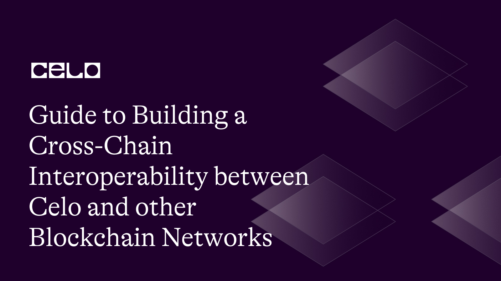

# Introduction​

In this Tutorial you will learn how to create smart contracts that allow Celo and other blockchains to communicate with one another. Cross-chain interoperability is the capacity of several blockchain networks to converse and share data with one another.
We will take it step by step, from laying out the interactions of the different blockchains, to developing the smart contract, deploying and connecting it to other blockchains.

# Prerequisites​

To begin, you should have a fundamental understanding of the following before you can build a cross-chain interoperability between Celo and other Blockchain Networks

- Solidity, which is the programming language used to write smart contracts on the Ethereum and Celo blockchains.
- understanding of the Javascript programming language.
- understanding and workings of smart contract development
- knowledge of web 3

# Requirements​

The following tool and technologies will be required to build a Cross-chain Interoperability between Celo and other Blockchain Networks.

- Solidity, 
- Web3.js, 
- Smart contract development, 
- Cross-chain communication protocols
- Ethereum Virtual Machine (EVM) compatibility.

# Steps and processes for Building a Cross-chain Interoperability between Celo and other Blockchain Networks

## Step 1: Set up a Development Environment

We must set up a development environment before we can start constructing cross-chain interoperability between Celo and other blockchains. Installing Node.js, Solidity, and Web3.js is required. Visual Studio Code will be employed in this.

## Step 2: Understand cross-chain interoperability

To build cross-chain interoperability, you need to understand how different blockchains interact with each other. There are several ways to achieve this, including through atomic swaps, cross-chain bridges, and relays. In this tutorial, we will focus on using cross-chain bridges.

When it comes to blockchain interoperability, cross-chain bridges play a crucial role in enabling communication and interaction between different blockchains. Cross-chain bridges act as connecting links that facilitate the transfer of assets and data across blockchains. In this section, we will explore how blockchains interact with each other, with a specific focus on cross-chain bridges.

Cross-chain Communication:
Blockchains are designed as independent networks with their own consensus mechanisms, protocols, and data structures. However, for seamless interoperability, it is necessary to establish communication channels between these blockchains. Cross-chain bridges provide the means to achieve this communication.

Asset Transfers:
One key aspect of blockchain interaction is the transfer of assets from one blockchain to another. Cross-chain bridges facilitate the movement of assets between blockchains by employing various mechanisms such as asset locking and unlocking.

Asset Locking: When an asset from Blockchain A needs to be transferred to Blockchain B, it is locked on Blockchain A. This ensures that the asset is securely held and cannot be spent while the transfer is in progress.

Asset Unlocking: 
Once the asset is locked on Blockchain A, a corresponding representation or token is minted on Blockchain B. This allows the asset to be utilized within Blockchain B while ensuring the original asset's integrity on Blockchain A.

Bridge Contracts:
Cross-chain bridges typically involve the deployment of bridge contracts on both the source and target blockchains. These bridge contracts handle the validation, verification, and execution of cross-chain transactions.

Source Bridge Contract: 
The source bridge contract resides on the blockchain where the original asset is locked. It verifies the locking of assets and triggers the cross-chain transfer process.

Target Bridge Contract: 
The target bridge contract exists on the destination blockchain. It verifies the minting of tokens representing the locked assets and handles the unlocking process.

Oracles:
Oracles act as intermediaries between blockchains and provide external data and information to facilitate cross-chain communication. Oracles are responsible for gathering and validating data from external sources and feeding it into the bridge contracts for cross-chain transactions.

Data Validation: 
Oracles ensure the accuracy and reliability of external data used in cross-chain transactions. This helps prevent fraudulent or incorrect data from impacting the transaction process.

Consensus Mechanisms: 
Oracles may utilize consensus mechanisms to validate data consistency and ensure agreement among multiple independent sources.

Trust and Security Considerations:
Interacting with different blockchains introduces trust and security challenges. To address these concerns, cross-chain bridges often employ mechanisms such as multi-signature approvals, decentralized governance models, and audits to ensure the integrity and security of cross-chain transactions.

Multi-signature Approvals: 
Cross-chain transactions may require multiple signatures from trusted parties to enhance security and mitigate the risk of unauthorized transfers.

Decentralized Governance: 
Many cross-chain bridge projects incorporate decentralized governance models where stakeholders collectively make decisions regarding bridge operations and upgrades.

Audits: 
Regular security audits help identify vulnerabilities and ensure the robustness of the cross-chain bridge infrastructure.

By leveraging cross-chain bridges, blockchains can overcome their individual silos and establish interoperability, enabling the seamless transfer of assets, data, and functionalities across different blockchain networks.

## Step 3: Develop the smart contract
The first step in developing cross-chain interoperability is to create a smart contract. 
This smart contract will act as the bridge between Celo and other blockchains. The smart contract should be written in Solidity, which is the programming language used to develop smart contracts on the Ethereum network.

Write a Solidity smart contract that can interact with the chosen cross-chain communication protocol. The smart contract should include functions to send and receive messages or data between Celo and other blockchains

Here is an example of a simple smart contract that allows Celo and Ethereum to communicate with each other:

```.sol

interface IERC20 {
    function balanceOf(address account) external view returns (uint256);
    function transfer(address recipient, uint256 amount) external returns (bool);
}

contract TokenBridge {
    IERC20 public celoToken;
    address public ethereumRecipient;
    
    constructor(IERC20 _celoToken, address _ethereumRecipient) {
        celoToken = _celoToken;
        ethereumRecipient = _ethereumRecipient;
    }
    
    function transfer(uint256 _amount) external {
        require(celoToken.balanceOf(msg.sender) >= _amount, "Insufficient balance");
        celoToken.transfer(ethereumRecipient, _amount);
    }
}
``` 

In this contract, we define an interface for the ERC20 token standard and declare two variables celoToken and ethereumRecipient that will hold the addresses of the token on the Celo network and the recipient on the Ethereum network, respectively. The constructor takes in these two addresses and stores them in the variables. The transfer function is the main function of the contract, which will be called by a user to transfer tokens from Celo to Ethereum.

## Step 4: Deploy the smart contract on Celo

Once you have developed the smart contract, the next step is to deploy it on the Celo network. You can do this using Remix, which is a web-based IDE for Solidity. You will need to connect Remix to your Celo wallet using the Celo Extension Wallet. 

Here's a more practical step-by-step guide on deploying a smart contract on the Celo network using Remix and the Celo Extension Wallet:

Step 1: Install the Celo Extension Wallet

Install the Celo Extension Wallet browser extension on your preferred web browser (Chrome or Firefox).
Visit the respective browser's extension store (Chrome Web Store or Firefox Add-ons) and search for "Celo Extension Wallet."
Click on "Add to Chrome" or "Add to Firefox" to install the extension.

Step 2: Open Remix IDE and connect to Celo Extension Wallet

Open the Remix IDE in your browser by visiting the Remix website (https://remix.ethereum.org).
On the Remix IDE, click on the "Deploy & Run Transactions" tab located on the left sidebar.
Under the "Environment" dropdown, select "Injected Web3" as the environment.
Remix will automatically detect the Celo Extension Wallet and connect to it.
Step 3: Write and compile your smart contract

Write or import your smart contract code into the Remix IDE. For example, you can use the smart contract code provided earlier:

```TokenBridge.sol

interface IERC20 {
    function balanceOf(address account) external view returns (uint256);
    function transfer(address recipient, uint256 amount) external returns (bool);
}

contract TokenBridge {
    IERC20 public celoToken;
    address public ethereumRecipient;
    
    constructor(IERC20 _celoToken, address _ethereumRecipient) {
        celoToken = _celoToken;
        ethereumRecipient = _ethereumRecipient;
    }
    
    function transfer(uint256 _amount) external {
        require(celoToken.balanceOf(msg.sender) >= _amount, "Insufficient balance");
        celoToken.transfer(ethereumRecipient, _amount);
    }
}
```

Click on the "Solidity Compiler" tab in Remix.
Make sure the correct compiler version is selected.
Click on the "Compile" button to compile your contract. Ensure there are no compilation errors.

Step 4: Deploy the smart contract

On the "Deploy & Run Transactions" tab, select your contract from the dropdown menu under "Contract" if multiple contracts are compiled.
Set any required constructor parameters in the provided fields, if your contract has any. For example, you can set the celoToken and ethereumRecipient values.
Click on the "Deploy" button to initiate the deployment process.
Remix will display a transaction confirmation dialog.
Confirm the transaction details, including gas fees, in the Celo Extension Wallet pop-up.
After confirming the transaction, wait for the deployment process to complete.
Once the contract is deployed, Remix will display the deployed contract's address.
Step 5: Interact with the deployed smart contract

In the Remix IDE, you can now access the deployed contract's functions and variables.
Expand the deployed contract in the "Deployed Contracts" section on the "Deploy & Run Transactions" tab.
Interact with the contract by calling its functions or accessing its variables. For example, you can call the transfer function to transfer tokens.
You can provide function parameters and click on the respective function to execute it on the Celo network.
That's it! You have successfully deployed your smart contract on the Celo network using Remix and the Celo Extension Wallet. You can now interact with the deployed contract through the Remix IDE.

## Step 5: Connect to other blockchains

The final step in building cross-chain interoperability is to connect to other blockchains. In this tutorial, we will connect to the Ethereum network. You will need to create a new instance of Web3.js and connect it to the Ethereum network using Infura or any other Ethereum node. (how to create a new instance of Web3.js and connect it to the Ethereum network using Infura)

Here is an example of how to connect to the Ethereum network using Web3.js:

```ethereum.js

const Web3 = require('web3');

const web3 = new Web3('https://mainnet.infura.io/v3/YOUR-PROJECT-ID');
```

Once you have connected to the Ethereum network, you can call the transfer function on the smart contract from the Ethereum network to transfer tokens from Celo to Ethereum.

Efficiency:

Cross-chain interoperability is an essential feature for decentralized applications, as it enables users to transact across multiple blockchains.
The efficiency of the smart contract will depend on the complexity of the contract and the number of transactions being processed.

## Common Errors Encountered and How to Fix them

Error 1: Compilation Errors 

When writing and compiling the smart contract, you may encounter syntax errors, undeclared variables, or issues with the selected compiler version. It's important to review the error messages provided by the Solidity compiler in Remix and fix any compilation errors.

Solution:
To resolve compilation errors, carefully review the error messages provided by the Solidity compiler in Remix. Check for syntax errors, undeclared variables, or issues with the selected compiler version. Make the necessary corrections based on the error messages and ensure that the contract code is written correctly.

Error 2: Contract Deployment Failure 

Deploying the smart contract on the Celo network can fail due to various reasons, such as insufficient gas, incorrect contract parameters, or issues with the network connection. It's important to double-check the contract parameters, ensure sufficient gas is provided, and verify the network connection settings.

Solution:
Double-check the contract parameters and ensure they are correct.
Verify that you have provided sufficient gas for the deployment. Adjust the gas limit if needed.
Check your network connection settings and ensure you are connected to the correct network.
If you encounter issues with the Celo network specifically, consult the Celo documentation or community forums for troubleshooting steps.

Error 3: Runtime Errors: 

Runtime errors can occur when executing functions in the smart contract. For example, if a function requires a certain condition to be met (e.g., a sufficient balance), failing to meet that condition will result in a runtime error. It's important to handle such errors with appropriate error messages and revert the transaction if necessary.

Solution:
When encountering runtime errors, it's important to handle them gracefully and revert the transaction if necessary. You can use require statements to validate input parameters and conditions before executing the contract's logic. Provide informative error messages to users to indicate the reason for the failure. Thoroughly test your smart contract functions to ensure they handle different scenarios and edge cases without encountering runtime errors.

Error 4: Token Compatibility Issues: 

When transferring tokens between different blockchains, compatibility issues can arise. Not all tokens are designed to work seamlessly across multiple blockchains, and they may require additional considerations or adaptations. It's important to ensure that the token you're working with is compatible with both the source and target blockchains.

Solution:
If you encounter token compatibility issues when transferring tokens between blockchains, consider the following solutions:

Verify that the token you're working with is designed to be compatible with both the source and target blockchains.
Check if the token has existing cross-chain bridge solutions or tools available. These solutions can provide compatibility features or conversion mechanisms to facilitate token transfers.
If the token lacks built-in compatibility, you may need to explore other options or consider implementing custom mechanisms to enable cross-chain transfers.

Error 5: Network Connectivity Issues: 

Connectivity issues can occur when interacting with external networks, such as the Ethereum network through Infura. These issues can include network congestion, timeouts, or unresponsive nodes. It's important to have proper error handling and retry mechanisms in place to handle such connectivity issues.

Solution:
Check your internet connection and ensure you have a stable and reliable connection.
If using Infura or any other third-party node provider, verify the correct API endpoint and check for any known issues or maintenance periods.
Consider using alternative node providers or running your own Ethereum node to have more control over the network connectivity.
Implement error handling and retry mechanisms in your code to handle temporary network disruptions gracefully.

Error 6: Security Vulnerabilities: 

Building cross-chain interoperability introduces security challenges. Smart contracts are susceptible to various vulnerabilities, such as reentrancy attacks, front-running, or unauthorized access. It's crucial to follow security best practices, conduct thorough testing, and potentially seek external audits to identify and mitigate security vulnerabilities.

Solution:
To address security vulnerabilities, follow these solutions:

Follow best practices for smart contract development, such as avoiding unchecked external calls, utilizing safe math libraries, and implementing proper access controls.
Conduct thorough security testing, including code reviews and audits, to identify vulnerabilities and address them before deploying the contract.
Stay updated on the latest security practices and vulnerabilities in the blockchain ecosystem. Engage with the community and participate in security discussions to learn from others and share knowledge.
Lack of Documentation or Community Support: When dealing with limited documentation or community support, consider the following actions:

Thoroughly research the chosen cross-chain bridge or interoperability solution. Look for any available documentation, guides, or tutorials that can help you navigate through the implementation process.
Engage with the community by participating in developer forums, chat groups, or online communities specific to the chosen solution. Ask questions and seek assistance from experienced developers who have worked on similar projects.
Consider reaching out to the developers or maintainers of the cross-chain bridge or interoperability solution directly for additional support or clarification on specific issues you encounter.

# Conclusion​

This tutorial has taught us how to Build a Cross-chain Interoperability between Celo and other Blockchain Networks. First step was setting up a development environment, next was explaining cross-chain bridges, then developing the smart contract, deploying the smart contract and connecting to other blockchains.  possible errors that were made and fixed during creation. 

# Next Steps​

We now have a solid understanding of the cross-chain interoperability and it's importance and usage, we can now explore and delve into it's efficiency and reliability by the blockchain, thank you.

# About the Author​
Michael Diagbare is a Software Engineer with expertise in Web, Blockchain development and content creation, certified by Cisco and MongoDB university. He is passionate about building software, problem solving and helping programmers deal with complicated tasks and challenges.

Connect with me on [LinkedIn](https://www.linkedin.com/in/diagbare-michael/)

# References​

- [Explaining cross chain bridges](https://consensys.net/blog/blockchain-explained/cross-chain-bridges/)
- [Blockchain interoperability](https://medium.com/wanchain-foundation/blockchain-interoperability-relays-75111bcafa2c)
- [Guide to the solidity Language](https://docs.soliditylang.org/)
- [Fungible tokens on the Ethereum blockchain](https://eips.ethereum.org/EIPS/eip-20)
- [Extension wallet documentation](https://docs.celo.org/wallet/extension-wallet)
