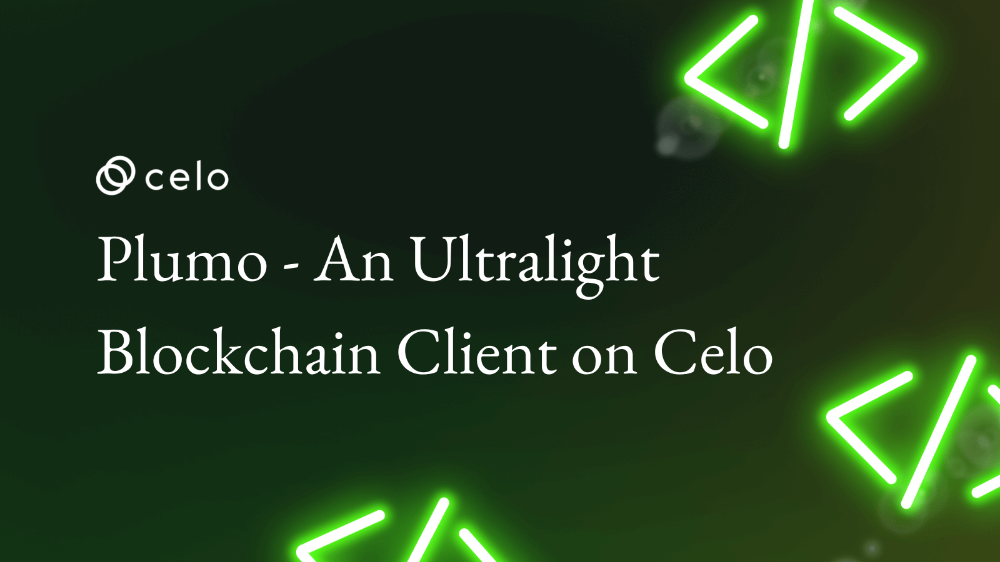
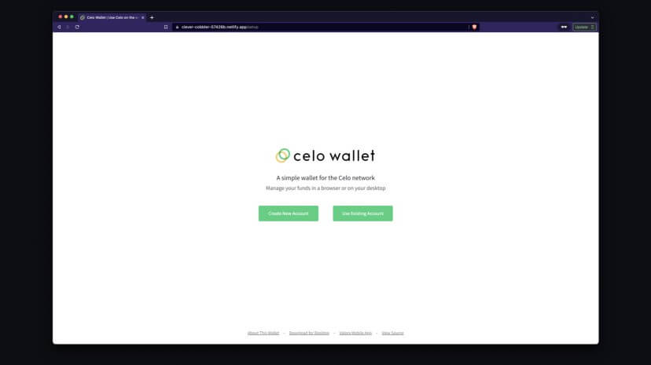
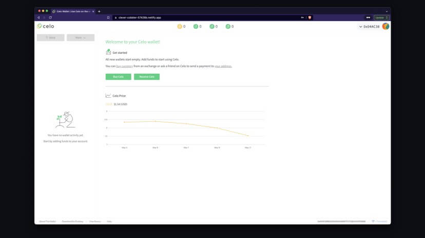
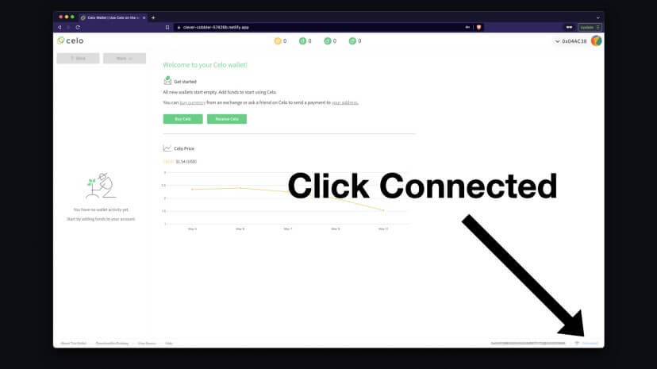
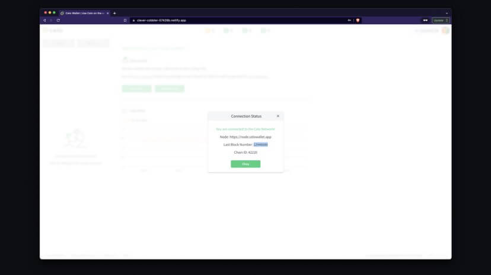
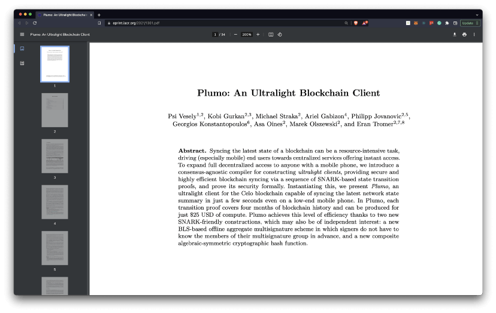
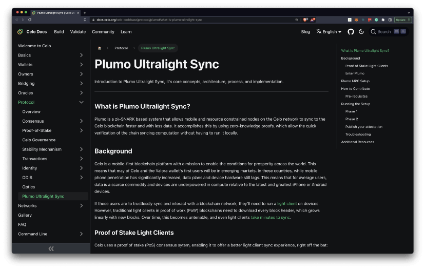

import YouTube from '@components/YouTube';

# Plumo - An Ultralight Blockchain Client on Celo

_How the Celo light client became 1.7 million times lighter than Ethereum._

## Hello Developers 🌱

Welcome to today’s post, where we’ll break down a blockchain topic into bite-sized pieces to help you learn and apply your new skills in the real world.

Today’s topic is _Plumo: An Ultralight Blockchain Client on Celo._

**Here’s a list of what we’ll cover 🗒**

- ✅ Introduction to Plumo
- ✅ Why is Plumo important?
- ✅ A Simple Plumo Demonstration
- ✅ Additional Plumo Resources

By the end of this post, you’ll have a basic introduction to Plumo, tried a demo showcasing Plumo’s functionality, and have resources to help you learn more about Celo’s ultralight blockchain client.

Let’s go! 🚀

## ✅ Introduction to Plumo

Celo has announced the arrival of Plumo, Celo’s advanced ZK-snark-based light client protocol. Plumo, meaning feather in Esperanto, lives up to its name as an incredibly light client for the Celo blockchain.

Previously, Celo’s previous light client protocol was around 17,000 times lighter than Ethereum’s light client protocol. With Plumo, Celo is now 1.7 million times lighter.

_With Plumo, Celo is now 1.7 million times lighter than Ethereum!_

Anyone can now generate Plumo snark proofs that let dApps sync with the chain in a fully trustless manner. cLabs is hosting the first server that’s generating these proofs daily but anyone can run one of these.

Celo has also announced the launch of a WASM based library that lets web apps verify Plumo proofs, sync with the chain, and then verify state that’s happening as it’s fetched from full nodes on the network.

This means that for the first time in the crypto industry, applications will be able to connect to the P2P network, connect to the chain in a fully trustless manner, sync near instantly and verify state that they can request from any full node. All this is possible without having to have any trust assumptions, with those full nodes.

## ✅ Why is Plumo important?

Syncing the latest state of a blockchain can be a resource-intensive task, driving users towards centralized services offering easier access. To expand decentralized services to anyone with a mobile phone, Celo created a consensus-agnostic compiler for constructing ultralight clients. This provides secure and highly efficient blockchain syncing via a sequence of SNARK-based state transition proofs with formally proven security.

_Plumo allows Celo nodes sync to the Celo blockchain faster with less data._

Devices can sync the latest network state summary in just a few seconds even on a low-end mobile phone. Using Plumo, each transition proof covers four months of blockchain history and can be produced for just \$25.

## ✅ A Simple Plumo Demonstration

You can see Plumo in action [here](https://clever-cobbler-57426b.netlify.app/) using the Celo Wallet.

### Create New Account

Once on the site, either Create New Account or Use Existing Account if you would like to use your Celo account. Follow the instructions provided to get your account details, set your password, and login to your wallet.

## Your Celo Wallet

Once logged in, you’ll be able to view your account details.

Do you notice anything amazing? 🤔

Not yet?

Select the button that says Connected on the bottom right of your screen.

This will show you the Connection Status. Take note of the Last Block Number and close this window. Here it is **12946675**.

Wait a few seconds… 🦗🦗🦗

Now select the Connected button again!

You should see that the Last Block Number is showing a newer block than it was before. In the image above the block is **12946680**…an entire 5 blocks have synced since last checked.

What you’re seeing is one of many possible examples of Plumo in action. It’s live syncing Celo network data to your device in real-time using an ultralight client. This could happen on a computer, a tablet, a phone, and even a cheap phone with low bandwidth-and before Plumo it could never happen so fast.

## ✅ Additional Plumo Resources

A large amount of research, development, and innovation has gone into creating this light client, and there are many resources you can explore to learn more. Here are a few to help you get started.

### Plumo Whitepaper

This whitepaper describes the design of Plumo as a method to develop scalable interoperable blockchains using ultra light validation systems.

:::tip

Learn more: [Plumo Whitepaper](https://eprint.iacr.org/2021/1361.pdf)

:::

### Plumo Documentation

Introduction to Plumo Ultralight Sync, its core concepts, architecture, process, and implementation.

:::tip

Learn more: [Plumo Documentation](https://docs.celo.org/celo-codebase/protocol/plumo#what-is-plumo-ultralight-sync)

:::

### Celo Tech Talks Plumo

In this Celo Tech Talk, Michael Straka, Cryptography Engineering Partner will introduce you to the Plumo Protocol.

<YouTube videoId="8KlysQOaowU"/>

:::tip

Watch more: [Kobi Gurkan on Plumo](https://www.youtube.com/watch?v=2e0XpWgFKLg) & Kobi Gurkan on [Optimistic SNARK](https://www.youtube.com/watch?v=LKbDNc-LrA4) setups for Plumo

:::

### Additional Resources

- [The Plumo Ceremony](https://medium.com/celoorg/the-plumo-ceremony-ac7649e9c8d8)
- [Plumo Celo Improvement Proposal](https://github.com/celo-org/celo-proposals/pull/41)

## Congratulations 🎉

That wraps up today’s topic on _Plumo: An Ultralight Blockchain Client on Celo_. You can review each of the items we covered below and check that you’re ready to apply these new skills.

**Here’s a quick review of what we covered 🤔**

- ✅ Introduction to Plumo
- ✅ Why is Plumo important?
- ✅ A Simple Plumo Demonstration
- ✅ Additional Plumo Resources

At this point, you’ve read a basic introduction to Plumo, tried a demo showcasing Plumo’s functionality, and have resources to help you access more details about Celo’s ultralight blockchain client.

GN! 👋
