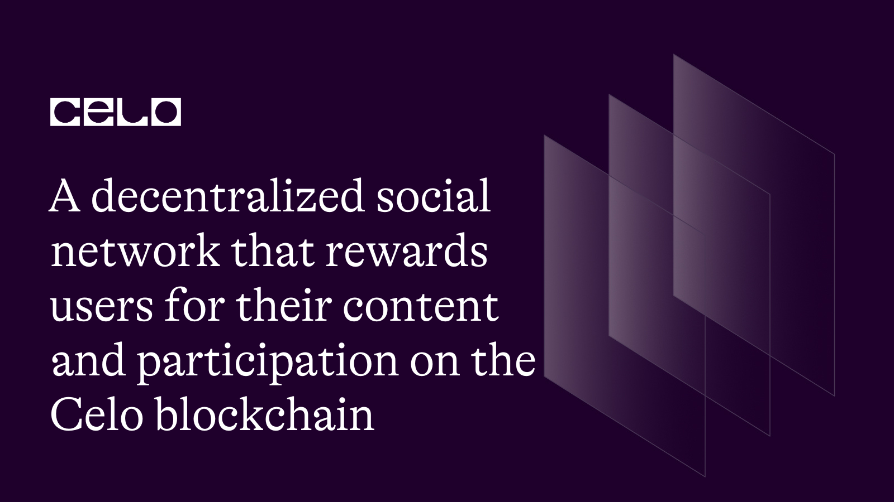

## INTRODUCTION

This project is a decentralized social network built on the Celo blockchain. It allows users to create and share posts with a reward system based on the number of likes received. The platform uses smart contracts to ensure transparency and security. Users can like posts created by others, earning them rewards in the form of CELO tokens. The tutorial will guide users on how to interact with the contract, create posts, like posts, and retrieve information about posts.

## REQUIREMENT

To follow this tutorial, you will require:

- A code editor or text editor such as Remix.

- An internet browser and a stable internet connection.

## PREREQUISITE

To successfully complete this tutorial, it is recommended that you have:

- Familiarity with Javascript programming language.

- A basic understanding of Blockchain technology and its functioning.

- Basic knowledge of the Solidity programming language used for smart contract development on the blockchain.

 We will begin by using the Remix IDE to write our smart contract. Let's get started!

The complete code:

 ```solidity
 // SPDX-License-Identifier: MIT

pragma solidity >=0.7.0 <0.9.0;
import "@openzeppelin/contracts/utils/math/SafeMath.sol";


interface IERC20Token {
    function transfer(address, uint256) external returns (bool);

    function approve(address, uint256) external returns (bool);

    function transferFrom(
        address,
        address,
        uint256
    ) external returns (bool);

    function totalSupply() external view returns (uint256);

    function balanceOf(address) external view returns (uint256);

    function allowance(address, address) external view returns (uint256);

    event Transfer(address indexed from, address indexed to, uint256 value);
    event Approval(
        address indexed owner,
        address indexed spender,
        uint256 value
    );
}

contract DecentralizedSocialNetwork {
    using SafeMath for uint256;

    struct Post {
        address payable owner;
        string content;
        uint256 likes;
        uint256 rewards;
    }

    uint256 internal postCount = 0;
    address internal cUsdTokenAddress = 0x874069Fa1Eb16D44d622F2e0Ca25eeA172369bC1;
    uint256 internal rewardPerLike = 1e18; // 1 CELO

    mapping(uint256 => Post) internal posts;

    function createPost(string memory _content) public {
        Post storage newPost = posts[postCount];
        newPost.owner = payable(msg.sender);
        newPost.content = _content;
        newPost.likes = 0;
        newPost.rewards = 0;

        postCount++;
    }

    function getPost(uint256 _postId) public view returns (
        address payable,
        string memory,
        uint256,
        uint256
    ) {
        require(_postId < postCount, "Invalid post ID");

        Post memory post = posts[_postId];
        return (
            post.owner,
            post.content,
            post.likes,
            post.rewards
        );
    }

    function likePost(uint256 _postId) public {
        require(_postId < postCount, "Invalid post ID");

        Post storage post = posts[_postId];
        require(post.owner != msg.sender, "You cannot like your own post");

        post.likes = post.likes.add(1);
        post.rewards = post.rewards.add(rewardPerLike);

        IERC20Token(cUsdTokenAddress).transferFrom(
            msg.sender,
            post.owner,
            rewardPerLike
        );
    }

    function getPostCount() public view returns (uint256) {
        return postCount;
    }
}

 ```

 ```solidity
  // SPDX-License-Identifier: MIT

pragma solidity >=0.7.0 <0.9.0;
import "@openzeppelin/contracts/utils/math/SafeMath.sol";
 ```

To begin, we start by specifying the license for the code using the MIT license, which grants permission for various use cases.

Next, we use the `pragma` statement to specify the version of Solidity that the code is compatible with. This ensures that the code is compiled using the correct Solidity version, avoiding any potential compatibility issues.

We then import the SafeMath library from the `OpenZeppelin` contract library. The SafeMath library provides secure arithmetic operations to prevent common vulnerabilities like overflow and underflow in our contract. By using SafeMath, we can perform mathematical operations safely and avoid potential security risks.

```solidity
interface IERC20Token {
    function transfer(address, uint256) external returns (bool);

    function approve(address, uint256) external returns (bool);

    function transferFrom(
        address,
        address,
        uint256
    ) external returns (bool);

    function totalSupply() external view returns (uint256);

    function balanceOf(address) external view returns (uint256);

    function allowance(address, address) external view returns (uint256);

    event Transfer(address indexed from, address indexed to, uint256 value);
    event Approval(
        address indexed owner,
        address indexed spender,
        uint256 value
    );
}

```

In this session, we have an interface called `IERC20Token` that we can use as a blueprint for implementing `ERC-20` token contracts. The interface defines a set of functions and events that allow us to interact with ERC-20 tokens.

By implementing this interface in our own contract, we ensure that our contract is compatible with other contracts and systems that interact with ERC-20 tokens. We can use the defined functions, such as `transfer`, `approve`, and `balanceOf`, to perform token `transfers`, `approvals`, and `balance` inquiries.

The events defined in the interface, such as `Transfer` and `Approval`, allow us to emit events when token transfers or approvals occur. This enables other contracts and external systems to track and react to these events.

Using the IERC20Token interface, we can create contracts that seamlessly interact with ERC-20 tokens, making our contracts more interoperable and compatible with the wider Ethereum ecosystem.

```solidity
contract DecentralizedSocialNetwork {
    using SafeMath for uint256;

    struct Post {
        address payable owner;
        string content;
        uint256 likes;
        uint256 rewards;
    }

    uint256 internal postCount = 0;
    address internal cUsdTokenAddress = 0x874069Fa1Eb16D44d622F2e0Ca25eeA172369bC1;
    uint256 internal rewardPerLike = 1e18; // 1 CELO

    mapping(uint256 => Post) internal posts;
```

In this session, we will create a contract called DecentralizedSocialNetwork. This contract represents a decentralized social network on the Celo blockchain, which we aim to build.

Within the contract, we have defined a `struct` called `Post`. This struct represents the structure of each post in our social network. Each post consists of properties such as `owner`, `content`, `likes`, and `rewards`.

To keep track of the posts, we have an internal variable called `postCount`. This variable helps us count the number of posts that have been created so far. Additionally, we store the address of the CELO-based token used for rewards in the `cUsdTokenAddress` variable. The `rewardPerLike` variable determines the amount of reward given for each like, represented in CELO tokens.

To store and access posts, we use a `mapping` called posts. This mapping allows us to associate a post `ID` with its corresponding Post struct.

To add more functionality to our smart contract, we will be implementing various functions.

```solidity
function createPost(string memory _content) public {
        Post storage newPost = posts[postCount];
        newPost.owner = payable(msg.sender);
        newPost.content = _content;
        newPost.likes = 0;
        newPost.rewards = 0;

        postCount++;
    }
```

To allow users to create posts in our decentralized social network, we need to implement the `createPost` function.

The `createPost` function takes a parameter `_content`, which represents the content of the post that the user wants to create.

Inside the function, we create a new Post instance and store it in the posts mapping using the `postCount` as the key. We set the properties of the new post, including the owner `(set as the address of the sender)`, the content, likes (initially set to 0), and rewards `(initially set to 0)`.

After setting the properties, we `increment` the `postCount` variable to keep track of the number of posts created.

By implementing this function, users can create posts in our decentralized social network by providing the content of the post they want to share.

```solidity
 function getPost(uint256 _postId) public view returns (
        address payable,
        string memory,
        uint256,
        uint256
    ) {
        require(_postId < postCount, "Invalid post ID");

        Post memory post = posts[_postId];
        return (
            post.owner,
            post.content,
            post.likes,
            post.rewards
        );
    }
```

To enable users to retrieve information about a specific post, we implement the `getPost` function.

The `getPost` function takes a parameter `_postId`, which represents the `ID` of the post we want to retrieve.

Inside the function, we first validate that the provided `_postId` is valid by checking if it is less than the postCount variable. If the validation fails, it throws an error message.

If the `_postId` is valid, we retrieve the corresponding post from the posts mapping using the `_postId` as the key. We store the post in memory using the Post struct type.

Finally, we return the properties of the post, including the owner address `(as a payable address)`, the content of the post, the number of likes, and the accumulated rewards.

By implementing this function, users can view the details of a specific post by providing its ID.

```solidity
 function likePost(uint256 _postId) public {
        require(_postId < postCount, "Invalid post ID");

        Post storage post = posts[_postId];
        require(post.owner != msg.sender, "You cannot like your own post");

        post.likes = post.likes.add(1);
        post.rewards = post.rewards.add(rewardPerLike);

        IERC20Token(cUsdTokenAddress).transferFrom(
            msg.sender,
            post.owner,
            rewardPerLike
        );
    }
```

To allow users to like posts and earn rewards, we implement the `likePost` function.

The `likePost` function takes a parameter `_postId`, representing the `ID` of the post that the user wants to like.

Inside the function, we first validate that the provided `_postId` is valid by checking if it is less than the postCount variable. If the validation fails, it throws an error message.

Next, we retrieve the post from the posts mapping using the `_postId` as the key. We use the storage keyword to ensure that we are modifying the actual post in storage.

We also check that the `sender` of the like is not the `owner` of the post. If the validation fails, it throws an error message.

If the validations pass, we `increment` the likes count of the post by `1` and increase the rewards of the post by the `rewardPerLike` value.

Finally, we use the `transferFrom` function of the `IERC20Token` interface to transfer the reward tokens `(rewardPerLike)` from the sender `(msg.sender)` to the owner of the post (post.owner).

By implementing this function, users can like posts, which increases the likes count and rewards the post owner with the specified reward amount.

```solidity
function getPostCount() public view returns (uint256) {
        return postCount;
    }
}
```

To provide users with information about the total number of posts in our decentralized social network, we implement the `getPostCount` function.

The `getPostCount` function does not require any parameters. It simply returns the value of the `postCount` variable, which keeps track of the number of posts created.

By implementing this function, users can easily retrieve the total count of posts in our social network. This information can be useful for displaying statistics or providing an overview of the network's activity.

## CONTRACT DEPLOYMENT

To deploy the contract, we would need:

- [CeloExtensionWallet]((https://chrome.google.com/webstore/detail/celoextensionwallet/kkilomkmpmkbdnfelcpgckmpcaemjcdh?hl=en))

- [ Celo Faucet](https://celo.org/developers/faucet) 

- Celo Remix Plugin

Download the Celo Extension Wallet from the Google chrome store using the link above. After doing that, create a wallet, store your key phrase in a very safe place to avoid permanently losing your funds.

After downloading and creating your wallet, you will need to fund it using the Celo Faucet. Copy the address to your wallet, click the link to the faucet above and the paste the address into the text field and confirm.

Next up, To deploy this contract on the Celo blockchain using Remix, you can follow these steps:

- Open Remix and create a new Solidity file.
  
- Copy and paste the code for the ShoeAuction contract into the new file.
  
- Make sure the Solidity compiler is set to version 0.8.7 or later.
  
- Select the "Solidity Compiler" tab in Remix and compile the contract by clicking the "Compile ShoeAuction.sol" button.
  
- Select the "Deploy & Run Transactions" tab in Remix.
  
- Select the Celo network from the dropdown menu at the top right corner of the screen.
  
- Connect your wallet to Remix by clicking on the "Connect to wallet" button and following the prompts.
  
- In the "Deploy & Run Transactions" section, select `SocialNetwork` from the `Contract` dropdown menu.
  
- Click the `Deploy` button.
  
- Confirm the transaction in your wallet.
  
- Wait for the transaction to be confirmed on the Celo blockchain.
  
- Once the transaction is confirmed, the ShoeAuction contract will be deployed on the Celo blockchain and you can interact with it using Remix.

## CONCLUSION

In this tutorial, we have built a decentralized social network on the Celo blockchain using Solidity. We covered the creation of posts, retrieving post information, liking posts, distributing rewards, and getting the total post count. By leveraging smart contracts and the transparency of blockchain technology, we created a secure environment for users to interact and share content. This tutorial provides a foundation for building decentralized applications and empowers you to explore the possibilities of blockchain technology.

