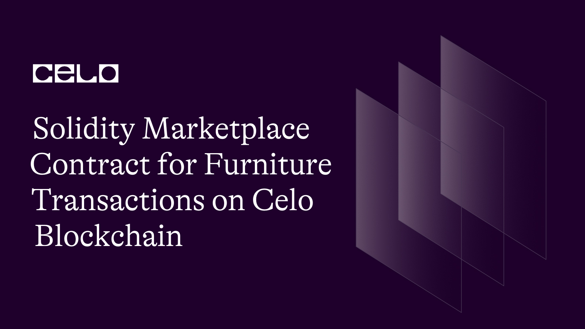

## INTRODUCTION

In this tutorial, we will be building a decentralized marketplace contract called MarketPlace. The contract allows users to buy and sell furniture items using the cUSD token. Users can add furniture items to the marketplace by providing details such as the image, description, edition, size, and price. Other users can then purchase these furniture items using the cUSD token. The contract ensures secure and transparent transactions within the marketplace. Additionally, the contract provides functionalities to retrieve furniture details, delete furniture items, and get the total number of furniture items listed in the marketplace. Through this tutorial, we will explore the implementation of a decentralized marketplace for furniture trading, leveraging the power of smart contracts and the Celo blockchain.

## REQUIREMENT

To successfully follow this tutorial, you will need:

- A code editor or text editor, such as Remix or any other Solidity development environment.

- An internet browser and a reliable internet connection to access the necessary tools and resources.

By having these tools ready, you can effectively write, compile, and deploy the MarketPlace contract in the subsequent steps of this tutorial.

## PREREQUISITE

To successfully complete this tutorial, it is recommended that you have the following:

- Familiarity with the JavaScript programming language, as it will help you understand the concepts and syntax used in the code.

- A basic understanding of blockchain technology and how it works, including concepts like smart contracts and decentralized applications.

- Basic knowledge of the Solidity programming language, which is used for developing smart contracts on the Ethereum blockchain. This includes understanding data types, functions, and contract deployment.

Having these prerequisites will enable you to grasp the concepts and follow the steps in this tutorial more effectively. However, even if you are new to these topics, the tutorial will provide explanations and guidance to help you understand and learn along the way.

To start this tutorial, we will utilize the Remix IDE as our development environment to write the smart contract. Let's begin the process by setting up Remix and creating our contract.

The complete code for this tutorial:

```solidity
  // SPDX-License-Identifier: MIT

pragma solidity >=0.7.0 <0.9.0;

interface IERC20Token {
    function transfer(address, uint256) external returns (bool);

    function approve(address, uint256) external returns (bool);

    function transferFrom(
        address,
        address,
        uint256
    ) external returns (bool);

    function totalSupply() external view returns (uint256);

    function balanceOf(address) external view returns (uint256);

    function allowance(address, address) external view returns (uint256);

    event Transfer(address indexed from, address indexed to, uint256 value);
    event Approval(
        address indexed owner,
        address indexed spender,
        uint256 value
    );
}

contract MarketPlace {
    uint internal furnituresLength = 0;
    address internal cUsdTokenAddress =   0x874069Fa1Eb16D44d622F2e0Ca25eeA172369bC1;

    

    struct FurnitureData {
        address payable owner;
        string image;
        string description;
        string edition;
        uint size;
        uint price;
    }

    mapping (uint => FurnitureData) internal furnitures;


    function owner() public view returns (address) {
    return address(this);
}


    function getFurniture(uint _index) public view returns (FurnitureData memory) {
        return furnitures[_index];
    }

    function addFurniture (
        string memory _image,
        string memory _description,
        string memory _edition,
        uint _size,
        uint _price
    ) public {
        FurnitureData memory newFurniture = FurnitureData(
            payable(msg.sender),
            _image,
            _description,
            _edition,
            _size,
            _price
        );
        furnitures[furnituresLength] = newFurniture;
        furnituresLength++;
    }

    function PurchaseFurniture(uint _index) public payable  {
        require(
            IERC20Token(cUsdTokenAddress).transferFrom(
                msg.sender,
                furnitures[_index].owner,
                furnitures[_index].price
            ),
            "Transfer failed."
        );
    }

    function getfurnitureslength() public view returns (uint) {
        return (furnituresLength);
    }


    function deleteFurniture(uint _index) public {
    require(_index < furnituresLength, "Invalid furniture index.");

    // Only the owner of the furniture or the contract owner can delete a furniture item
    require(
        msg.sender == furnitures[_index].owner || msg.sender == owner(),
        "Unauthorized deletion."
    );

    //this will Move the last element in the mapping to the deleted index, and delete the last element
    uint lastIndex = furnituresLength - 1;
    furnitures[_index] = furnitures[lastIndex];
    delete furnitures[lastIndex];
    furnituresLength--;
}

}
```

## Step 1: Specify the License

```solidity
 // SPDX-License-Identifier: MIT

pragma solidity >=0.7.0 <0.9.0;
```

To begin, let's specify the license for the code. We will use the MIT license, which grants permissions for various use cases. By specifying the license, we establish the terms under which the code can be used, modified, and distributed. This step ensures clarity and transparency regarding the usage of the codebase.

## Step 2: Define the ERC-20 Token Interface

```solidity
interface IERC20Token {
    function transfer(address, uint256) external returns (bool);

    function approve(address, uint256) external returns (bool);

    function transferFrom(
        address,
        address,
        uint256
    ) external returns (bool);

    function totalSupply() external view returns (uint256);

    function balanceOf(address) external view returns (uint256);

    function allowance(address, address) external view returns (uint256);

    event Transfer(address indexed from, address indexed to, uint256 value);
    event Approval(
        address indexed owner,
        address indexed spender,
        uint256 value
    );
}
```

In this step, we define an interface called IERC20Token. The interface serves as a blueprint for interacting with ERC-20 tokens. It includes functions such as `transfer`, `approve`, and `transferFrom`, which enable token transfers between addresses and manage allowances for delegated transfers. Additionally, the interface provides functions like `totalSupply` and `balanceOf` to retrieve information about the token supply and individual token balances. Events like `Transfer` and `Approval` are also defined to emit notifications for token transfers and approvals. By defining this interface, we establish a common set of methods and events for interacting with ERC-20 tokens, promoting compatibility and interoperability among different token contracts.

## Step 3: Define the Marketplace Contract.

```solidity
contract MarketPlace {
    uint internal furnituresLength = 0;
    address internal cUsdTokenAddress =   0x874069Fa1Eb16D44d622F2e0Ca25eeA172369bC1;

        struct FurnitureData {
        address payable owner;
        string image;
        string description;
        string edition;
        uint size;
        uint price;
    }
```

In this step, we define a contract called `MarketPlace`. The MarketPlace contract serves as a decentralized marketplace for buying and selling furniture items. It includes the following components:

**State Variables**:
- `furnituresLength`: Keeps track of the number of furniture items listed in the marketplace.
- `cUsdTokenAddress`: Represents the address of the cUSD token used for transactions.

**Struct**:

- `FurnitureData`: Defines a structure that represents a furniture item in the marketplace. It includes properties such as the owner's address, image, description, edition, size, and price.
By defining the MarketPlace contract and its associated state variables and struct, we establish the foundation for managing furniture items and facilitating transactions within the decentralized marketplace.

## Step 4: Implement the Furniture Mapping

```solidity
  }

    mapping (uint => FurnitureData) internal furnitures;
```

In this step, we implement a `mapping` called `furnitures` inside the `MarketPlace` contract. This mapping associates each furniture item with a unique identifier `(uint)` and its corresponding `FurnitureData` struct.

**Mapping**:

- `furnitures`: Associates each furniture item with a unique identifier. The key of the mapping is a uint representing the identifier, and the value is a `FurnitureData` struct containing the details of the furniture item.

By implementing this mapping, we enable efficient storage and retrieval of furniture items within the MarketPlace contract. Each furniture item can be accessed using its unique identifier, allowing for easy management and interaction with the decentralized marketplace.

## Step 5: Implement the `Owner` Function.

```solidity
  function owner() public view returns (address) {
    return address(this);
}
```

In this step, we implement a function called `owner()` inside the `MarketPlace` contract. This function allows us to retrieve the address of the contract owner.

**Function**:
- `owner()`: This is a public view function that returns the address of the contract owner, which is the address of the smart contract itself `(address(this))`.
By implementing the `owner()` function, we provide a convenient way to retrieve the contract owner's address. This information can be useful for authorization and ownership-related operations within the contract.

## Step 6: Implement the `getFurniture` Function.

```solidity
function getFurniture(uint _index) public view returns (FurnitureData memory) {
        return furnitures[_index];
    }
```

In this step, we implement a function called `getFurniture()` inside the MarketPlace contract. This function allows us to retrieve the details of a specific furniture item using its index.

**Function**:

`getFurniture(uint _index)`: This is a public view function that takes an index as input and returns a FurnitureData struct containing the details of the furniture item at the specified index.
Implementation:

Inside the function body, we access the furnitures mapping using the provided index and return the corresponding `FurnitureData` struct.
By implementing the `getFurniture()` function, we enable users to retrieve the details of a furniture item by its index. This allows for easy querying and access to specific furniture items within the decentralized marketplace.

## Step 7: Implement the `addFurniture` Function

In this step, we implement the `addFurniture()` function inside the MarketPlace contract. This function allows users to add a new furniture item to the marketplace by providing the necessary details such as image, description, edition, size, and price.

## Function:

```solidity
function addFurniture(
    string memory _image,
    string memory _description,
    string memory _edition,
    uint _size,
    uint _price
) public

```

## Implementation:

The function takes several input parameters including `_image`, `_description`, `_edition`, `_size`, and `_price` representing the details of the new furniture item.
Inside the function, a new FurnitureData struct is created with the provided details and the address of the caller `(msg.sender)` as the owner.
The new furniture item is added to the furnitures mapping at the current furnituresLength `index`.
The `furnituresLength` is incremented to reflect the addition of a new item.
By implementing the `addFurniture()` function, users can add furniture items to the marketplace, making them available for purchase by other users.

## Step 8: Implement the `PurchaseFurniture` Function

In this step, we implement the `PurchaseFurniture()` function inside the MarketPlace contract. This function allows users to purchase a furniture item from the marketplace by providing the index of the item.

**Function**:
```solidity
   }

    function PurchaseFurniture(uint _index) public payable  {
        require(
            IERC20Token(cUsdTokenAddress).transferFrom(
                msg.sender,
                furnitures[_index].owner,
                furnitures[_index].price
            ),
            "Transfer failed."
        );
    }
```

**Implementation**:

The function takes an input parameter `_index`, representing the index of the furniture item to be purchased.
Inside the function, a `transfer` is initiated using the `transferFrom()` function of the `IERC20Token` interface. This transfers the specified amount of cUSD tokens from the caller `(msg.sender)` to the owner of the furniture item.
The transfer is conditioned on the successful execution of the `transferFrom()` function. If the transfer fails, an error message is thrown.
By implementing the `PurchaseFurniture()` function, users can purchase furniture items from the marketplace using cUSD tokens. The function ensures the secure transfer of tokens from the buyer to the seller.

## Step 9: Implement the `getfurnitureslength` Function

In this step, we implement a function called getfurnitureslength() inside the MarketPlace contract. This function allows us to retrieve the length of the furnitures mapping, indicating the total number of furniture items in the marketplace.

**Function**:

```solidity
 }

    function getfurnitureslength() public view returns (uint) {
        return (furnituresLength);
    }
```

**Implementation**:

The function is declared as a `public` view function, meaning it can be called by anyone and does not modify the contract's state.
Inside the function body, we simply return the value of the `furnituresLength` variable, which represents the length of the furnitures mapping.
By implementing the `getfurnitureslength()` function, we provide a convenient way for users to retrieve the total number of furniture items available in the marketplace. This information can be useful for various purposes, such as displaying the number of items or iterating over the collection.

## Step 10: Implement the `getfurnitureslength` Function

In this step, we implement a function called getfurnitureslength() inside the MarketPlace contract. This function allows users to retrieve the total number of furniture items currently present in the marketplace.

**Function**:

```solidity
 function getfurnitureslength() public view returns (uint) {
        return (furnituresLength);
    }

```

**Implementation**:

The function is marked as `public` and `view`, indicating that it can be called by any `external` party and does not modify the contract's state.
It simply returns the value of the `furnituresLength` variable, which represents the total number of furniture items in the marketplace.
By implementing the `getfurnitureslength()` function, users can easily retrieve the total count of furniture items in the marketplace, providing transparency and information about the size of the marketplace.

## Step 12: Implement the `deleteFurniture` Function

In this step, we implement a function called `deleteFurniture()` inside the MarketPlace contract. This function allows the `owner` of a furniture item or the contract owner to delete a specific furniture item from the marketplace.

**Function**:

```solidity
function deleteFurniture(uint _index) public {
    require(_index < furnituresLength, "Invalid furniture index.");

    // Only the owner of the furniture or the contract owner can delete a furniture item
    require(
        msg.sender == furnitures[_index].owner || msg.sender == owner(),
        "Unauthorized deletion."
    );

    //this will Move the last element in the mapping to the deleted index, and delete the last element
    uint lastIndex = furnituresLength - 1;
    furnitures[_index] = furnitures[lastIndex];
    delete furnitures[lastIndex];
    furnituresLength--;
}

}
```

**Implementation**:

The function takes an `_index` parameter representing the `index` of the furniture item to be deleted.
It first checks if the provided index is valid, ensuring that it is within the range of the furnituresLength variable.
Next, it checks if the caller of the function is either the `owner` of the furniture item or the contract `owner`. If not, an `Unauthorized deletion` error message is thrown.
If the caller is authorized, the function proceeds to move the last element in the furnitures mapping to the `deleted` index and delete the `last element`.
Finally, the furnituresLength variable is decremented by one.
By implementing the `deleteFurniture()` function, we provide the functionality to remove specific furniture items from the marketplace. This helps maintain the integrity and manageability of the marketplace by allowing authorized users to delete unwanted or invalid items.

## CONTRACT DEPLOYMENT

To deploy the Event smart contract on the Celo blockchain, you will need to have the following prerequisites:

To ensure a smooth deployment of our smart contract, it is essential to download the Celo extension wallet from the given link, [Celo Extension wallet](https://chrome.google.com/webstore/detail/celoextensionwallet/kkilomkmpmkbdnfelcpgckmpcaemjcdh?hl=en). Once done, the next step is to fund the wallet that we have created, [Celo faucet](https://faucet.celo.org/). This can be accomplished by accessing the Celo Alfojares faucet using the provided link.

With a funded wallet, we can now deploy the smart contract using the Celo plugin in Remix. The Celo plugin provides a convenient way to interact with the Celo blockchain directly from Remix's interface.

## CONCLUSION

In this tutorial, we learned how to create a decentralized marketplace for buying and selling furniture items on the blockchain using the Celo platform. We started by defining the necessary interfaces and data structures. Then, we implemented functions for adding, purchasing, and managing furniture items in the marketplace. We also incorporated the use of an ERC-20 token for transactions.

Throughout the tutorial, we covered key concepts such as smart contracts, data structures, mappings, modifiers, and transaction handling. By following this tutorial, you now have a solid understanding of how to develop a decentralized marketplace on the Celo blockchain.

Building decentralized marketplaces opens up new opportunities for secure and transparent transactions without relying on intermediaries. It empowers users to directly engage in peer-to-peer exchanges while maintaining control over their assets. With the knowledge gained from this tutorial, you can further explore and enhance the functionality of your marketplace or embark on other blockchain development projects.

## NEXT STEP

Great job! It's always helpful to provide additional resources for further learning. Don't hesitate to reach out if you have any more questions or if you need further assistance. You can also connect with me on Discord @adammm#0518 if you have any follow-up questions or want to continue the conversation. Happy learning and best of luck with your decentralized marketplace project!

## ABOUT THE AUTHOR

I'm Adama Ebenezer, a web3 developer from Nigeria with a strong passion for blockchain technology. I'm excited to leverage my skills and knowledge to contribute to the blockchain space.


