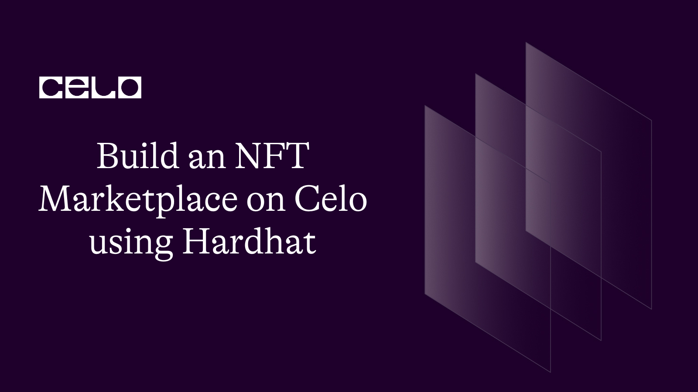

## Introduction

Non-Fungible Tokens (NFTs) have revolutionized the way we view and own digital assets. They have become an increasingly popular means of buying and selling digital art, collectibles, and other unique items. In this article, we will explore how to build an NFT marketplace on the Celo blockchain using Hardhat, a popular Ethereum development environment. By the end of this article, you should have a good understanding of how to set up an NFT marketplace on Celo and how to deploy it to the blockchain.

## Prerequisites

In this tutorial, we're going to build an NFT Marketplace from scratch on the Celo blockchain so no prior knowledge is needed.

## Requirements

We'll need Metamask in this tutorial, install it from [HERE](https://metamask.io/).

As at the time you're reading this tutorial, you should have the latest NodeJS 12.0.1+ version installed. Install it from [HERE](https://nodejs.org/en)

You'll also need an Integrated Development Environment(IDE) like VScode installed on your machine.

On your VScode IDE, install Solidity extension from [HERE](https://marketplace.visualstudio.com/items?itemName=NomicFoundation.hardhat-solidity)

## Getting Started

Building an NFT marketplace on Celo blockchain using Hardhat involves several steps. Here's a step-by-step guide on how to do it:

### Step 1: Set up your development environment

To get started, you need to set up your VScode IDE. You'll need Node.js and npm installed on your machine. Once you have those installed, you can install Hardhat on your VScode IDE terminal using npm:

```bash
npm install --save-dev hardhat
```

### Step 2: Create a new Hardhat project

Once you have Hardhat installed, you can create a new project by running:

```bash
npx hardhat
```

This will create a new project with some sample contracts and tests.

### Step 3: Configure the Celo network

You need to configure Hardhat to connect to the Celo network. To do this, add the following code to your hardhat.config.js file:

```javascript
require("@celo/hardhat-plugin");

const { privateKey } = require("./secrets.json");

module.exports = {
  networks: {
    alfajores: {
      url: "https://alfajores-forno.celo-testnet.org",

      accounts: [privateKey],
    },

    mainnet: {
      url: "https://forno.celo.org",

      accounts: [privateKey],
    },
  },

  solidity: {
    version: "0.8.0",

    settings: {
      optimizer: {
        enabled: true,

        runs: 200,
      },
    },
  },
};
```

This code sets up the two Celo networks that you'll be using (Alfajores and Mainnet) and configures Hardhat to connect to them. You'll also need to create a secrets.json file that contains your private key for signing transactions on the network.

### Step 4: Write your NFT contract

Now you can write your NFT contract. Here's an example:

```solidity

//SPDX-License-Identifier: MIT

pragma solidity ^0.8.0;

import "@openzeppelin/contracts/token/ERC721/ERC721.sol";

import "@openzeppelin/contracts/utils/Counters.sol";

contract MyNFT is ERC721 {

  using Counters for Counters.Counter;

  Counters.Counter private _tokenIds;

  constructor() ERC721("MyNFT", "NFT") {}

  function mintNFT(address recipient, string memory tokenURI)

    public

    returns (uint256)

  {

    _tokenIds.increment();

    uint256 newItemId = _tokenIds.current();

    _mint(recipient, newItemId);

    _setTokenURI(newItemId, tokenURI);

    return newItemId;

  }

}
```

This contract inherits from the ERC721 contract from OpenZeppelin and adds a mintNFT function that allows you to mint a new NFT with a given token URI.

### Step 5: Write your marketplace contract

Next, you'll need to write your marketplace contract in a Marketplace.sol file. Here's an example:

```solidity

//SPDX-License-Identifier: MIT

pragma solidity ^0.8.0;

import "@openzeppelin/contracts/token/ERC721/IERC721.sol";
import "@openzeppelin/contracts/token/ERC721/utils/ERC721Holder.sol";
import "@openzeppelin/contracts/utils/Counters.sol";

contract MyMarketplace is ERC721Holder {
    using Counters for Counters.Counter;
    Counters.Counter private _listingIds;

    struct Listing {
        uint256 id;
        address seller;
        address nftContract;
        uint256 tokenId;
        uint256 price;
        bool active;
    }

    mapping(uint256 => Listing) private _listings;

    event ListingCreated(uint256 id, address seller, address nftContract, uint256 tokenId, uint256 price);
    event ListingCancelled(uint256 id);
    event ListingSold(uint256 id, address buyer, uint256 price);

    function createListing(address _nftContract, uint256 _tokenId, uint256 _price) external {
        require(_price > 0, "Price must be greater than zero");
        IERC721(_nftContract).safeTransferFrom(msg.sender, address(this), _tokenId);
        _listingIds.increment();
        uint256 listingId = _listingIds.current();
        _listings[listingId] = Listing(listingId, msg.sender, _nftContract, _tokenId, _price, true);
        emit ListingCreated(listingId, msg.sender, _nftContract, _tokenId, _price);
    }

    function cancelListing(uint256 _listingId) external {
        require(_listings[_listingId].seller == msg.sender, "Only seller can cancel the listing");
        require(_listings[_listingId].active == true, "Listing already cancelled or sold");
        IERC721(_listings[_listingId].nftContract).safeTransferFrom(address(this), msg.sender, _listings[_listingId].tokenId);
        _listings[_listingId].active = false;
        emit ListingCancelled(_listingId);
    }

    function buyListing(uint256 _listingId) external payable {
        require(_listings[_listingId].active == true, "Listing is not active");
        require(msg.value == _listings[_listingId].price, "Sent value is not correct");
        _listings[_listingId].active = false;
        IERC721(_listings[_listingId].nftContract).safeTransferFrom(address(this), msg.sender, _listings[_listingId].tokenId);
        payable(_listings[_listingId].seller).transfer(msg.value);
        emit ListingSold(_listingId, msg.sender, msg.value);
    }

    function getListing(uint256 _listingId) external view returns (Listing memory) {
        return _listings[_listingId];
    }

    function getActiveListings() external view returns (Listing[] memory) {
        uint256 activeListingCount = 0;
        for (uint256 i = 1; i <= _listingIds.current(); i++) {
            if (_listings[i].active == true) {
                activeListingCount++;
            }
        }
        Listing[] memory activeListings = new Listing[](activeListingCount);
        uint256 index = 0;
        for (uint256 i = 1; i <= _listingIds.current(); i++) {
            if (_listings[i].active == true) {
                activeListings[index] = _listings[i];
                index++;
            }
        }
        return activeListings;
    }
}
```

## Conclusion

In conclusion, building an NFT Marketplace on Celo using Hardhat is an exciting opportunity for developers and entrepreneurs to tap into the growing NFT market. With Celo's fast and low-cost blockchain infrastructure, developers can easily create NFT marketplaces that offer seamless trading experiences to users.

The integration of Hardhat makes the development process more streamlined and efficient, enabling developers to focus on building innovative features for their marketplaces.

Congratulations on building a marketplace on the Celo blockchain using Hardhat!!!

## Next Steps

Now that you've successfully built your NFT marketplace, you can build more exciting project! Follow our tutorial page for more intriguing projects that can be built on the Celo blockchain using hardhat [CeloSage Tutorials](https://docs.celo.org/tutorials?tags=hardhat).

## About the Author

Joshua Obafemi

I'm a Web3 fullstack developer and technical writer. You can connect with me on [GitHub](https://github.com/jorshimayor), [Twitter](https://twitter.com/jorshimayor), [Linkedin](https://www.linkedin.com/in/joshua-obafemi-ba2014199/).

## References

- [Source Code](https://github.com/jorshimayor/Build-an-NFT-Marketplace-on-Celo-using-Hardhat)
