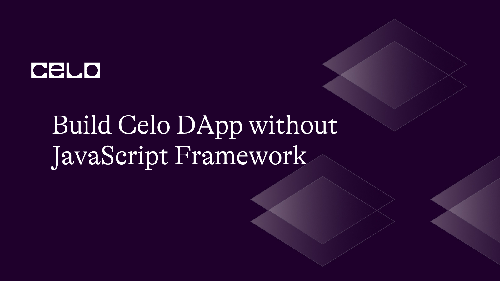
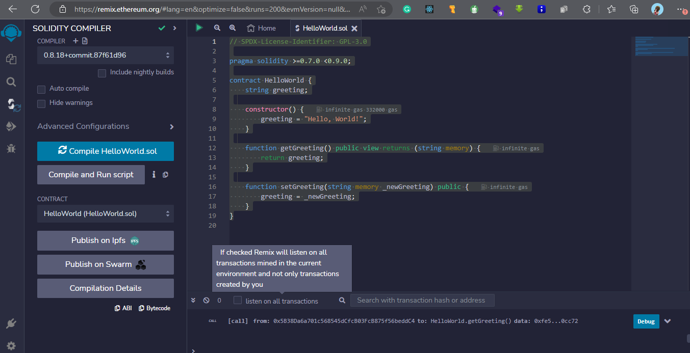
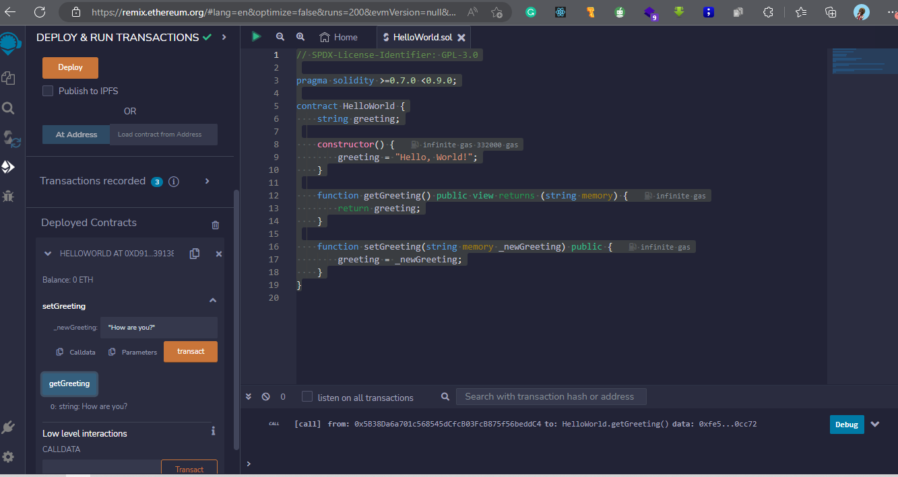
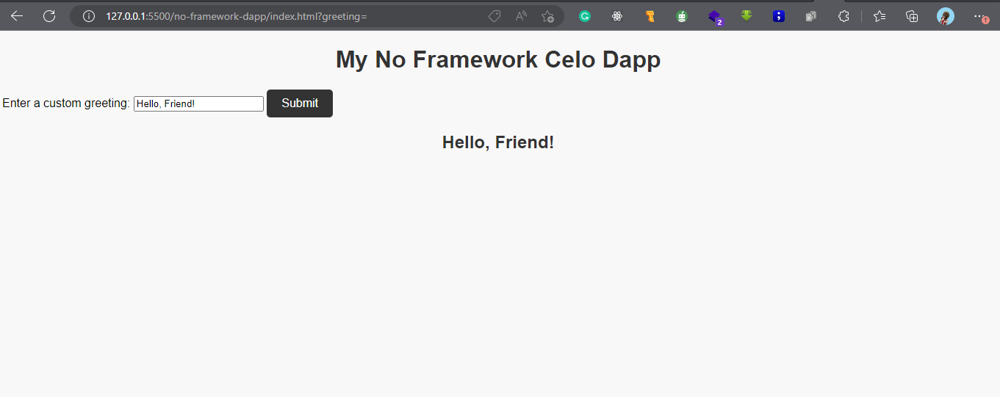

## Introduction

A quick way to get into Web3 is to learn the JavaScript framework and start interacting with smart contracts to build DApps, DAOs, and other use cases. But getting started in Web2 requires the knowledge of HTML, CSS, and JavaScript. What if we can empower every student who has these three skills to build needed blockchain tools and be able to solve problems in Web3? This will fast-track their interest in the web and motivate them to learn, which is why I am writing this to teach the reader how to use the three basics of web development to build a Celo DApp, Celo is a popular blockchain network that helps developers get started quickly in blockchain and web3 development. In this article, we will explore different ways of making this possible without a JavaScript framework.

## Prerequisites

- HTML, CSS and Basic JavaScript
- Install Node on their device
- Basic Solidity skills

## Setting up your development environment

To develop anything, we need an enabling environment. To make this easy as software development we will create text editors and IDE to enable the development journey easy and successful for us.

## Required Installation

- NodeJS: It is a JavaScript runtime that provides easy to run JavaScript environment on a local computer.
- npm: This is a package manager for NodeJS that allows you to install and manage packages (also known as libraries) for your project.

### NodeJS and npm Installation

- Step 1: Visit NodeJS official website and download the version that's appropriate for your operating system: https://nodejs.org/en/download/

- Step 2: Follow the installation instructions by following the wizard for NodeJS.

- Step 3: Once the installation is completed, open the terminal (or command prompt) window and type the following command to install npm:

```bash
    npm install npm@latest -g
```

- Step 4: Let's confirm the installation by confirming the version as shown below. This should output the version of npm that you installed.

```bash
    npm -v
```

The above step is the high levels tasks to keep us running on the JavaScript environment. We need to remind ourselves that our focus is to get the work done without the help of a framework that will be making some low-level setups as indicated below.

- Step 5: Create a directory with the name of your project

```bash
mkdir project-name
```

For this work, we will name it `<no-framework-dapp>` to make it more fun

- Step 6: Navigate into the new folder created and initialise the node project.

```bash
cd no-framework-dapp
npm init -y
```

The above will first move into our created project directory then create the `package.json` file to enable us to install the necessary packages and again filled out the responses provided during initialization

I want to call the above setup stages to get us running. It's time to make the real work up.

## Let's code

- Step 1: Create a file in the project directory with the name `index.js` with the following starter code. For our front end to work, as expected, it is important to note that it will be running a server. I use VS Code live server and all servers can work correctly.

- Step 2: We need a contract to interact with, for that we will be creating a solidity contract using the Remix Project IDE. I have a step-by-step guide on how to achieve this in my previous work for celo sage content. Check it out to follow along here.

Smart contracts are self-executing programs that run on the Celo blockchain. They're written in Solidity programming language. Below is an example of a solidity code.

```solidity
// SPDX-License-Identifier: GPL-3.0

pragma solidity >=0.7.0 <0.9.0;

contract HelloWorld {
    string greeting;

    constructor() {
        greeting = "Hello, World!";
    }

    function getGreeting() public view returns (string memory) {
        return greeting;
    }

    function setGreeting(string memory _newGreeting) public {
        greeting = _newGreeting;
    }
}
```

In the above, we are defining a smart contract with the name `HelloWorld`. The contract provides users access to now call the `setGreeting` function and passes a custom greeting message as an argument. It is important to note that our contract can be as big as possible we just choose to make it simple in the article to ease its understanding.



- Step 3: At this point, you can use the Remix project IDE for compiling contracts. On your, Remix IDE navigate to the `contracts` folder and create the file `HelloWorld.sol` then copy and paste the above code into the file created and press the green button at the top to compile the code. Copy and paste the ABI from the compile tab. Switch the deploy tab and play around with just built contract.



- Step 4: Deploy the contracts
  The smart contract has successfully compiled, it is time to deploy it to the Celo network. To do this, you will need to use the `ContractKit` class from the Celo SDK. Replace everything in the `index.js` with the following.

```js
const contractAddress = "0xd9145CCE52D386f254917e481eB44e9943F39138";
const contractABI = [
  {
    inputs: [
      {
        internalType: "string",
        name: "_newGreeting",
        type: "string",
      },
    ],
    name: "setGreeting",
    outputs: [],
    stateMutability: "nonpayable",
    type: "function",
  },
  {
    inputs: [],
    stateMutability: "nonpayable",
    type: "constructor",
  },
  {
    inputs: [],
    name: "getGreeting",
    outputs: [
      {
        internalType: "string",
        name: "",
        type: "string",
      },
    ],
    stateMutability: "view",
    type: "function",
  },
];

const web3 = new Web3(window.celo);
const contract = new web3.eth.Contract(contractABI, contractAddress);

const greetingForm = document.getElementById("greeting-form");
const greetingInput = document.getElementById("greeting-input");
const result = document.getElementById("result");

greetingForm.addEventListener("submit", async (event) => {
  event.preventDefault();
  const newGreeting = greetingInput.value;
  console.log(newGreeting);
  try {
    const accounts = await web3.eth.getAccounts();
    const result = await contract.methods
      .setGreeting(newGreeting)
      .send({ from: accounts[0] });
    result.innerText = `Greeting set to ${result}!`;
  } catch (error) {
    console.error(error);
    result.innerText = "Error setting greeting.";
  }
});
```

## Code Explanation

This code is a JavaScript program that interacts with a smart contract deployed on the Celo blockchain. The program uses the Web3.js library(with the help of a link to the CDN included in our index.html, you see it in the next step) to communicate with the blockchain.

## What does the code do?

The program defines a constant variable named contractAddress, which contains the address of the smart contract on the Celo blockchain.

The program also defines a constant variable named contractABI, which contains the Application Binary Interface (ABI) of the smart contract. The ABI is a specification of the functions and data types used in the smart contract.

The program creates a new instance of the Web3.js library and initializes it with the Celo provider.

The program creates a new instance of the smart contract using the contract ABI and address.

The program selects the HTML elements with the IDs `greeting-form`, `greeting-input`, and `result` and assigns them to JavaScript variables.

The program adds an event listener to the greeting form that listens for a submitted event. When the event occurs, the program prevents the default form submission behaviour, gets the new greeting value from the greeting input element, and sends a transaction to the smart contract to set the new greeting value.

If the transaction is successful, the program updates the result element with a success message. If there is an error, the program updates the result element with an error message.

In summary, this program is a simple front-end application that allows users to update the greeting value of a smart contract on the Celo blockchain.

- Step 6: Let's create an interface for our DApp
  We will need to include an internal CSS and a script file `index.js` that we can use to style and add functionality to our DApp.

```html
<!DOCTYPE html>
<html>
  <head>
    <meta charset="UTF-8" />
    <title>Celo Dapp</title>
    <style>
      /* Internal css goes here */
    </style>
    <script src="https://cdnjs.cloudflare.com/ajax/libs/web3/1.9.0/web3.min.js"></script>
  </head>
  <body>
    <h1>My No Framework Celo Dapp</h1>
    <div class="container">
      <form id="greeting-form">
        <label for="greeting-input">Enter a custom greeting:</label>
        <input type="text" id="greeting-input" name="greeting" />
        <button type="submit" id="submit-button">Submit</button>
      </form>
      <h2 id="result"></h2>
    </div>
    <script type="module" src="index.js"></script>
  </body>
</html>
```

- Step 6: Styling your DApp

Finally, you'll want to add some styling to your DApp to make it look nice. You can use CSS to style your HTML elements. In this article, we will be running an internal css added at the head of our HTML to avoid creating multiple files for our project.

Here's an example of how to add some basic styling to your DApp:

```css
body {
  background-color: #f8f8f8;
  font-family: sans-serif;
}

h1 {
  color: #333;
  text-align: center;
}

button {
  background-color: #333;
  color: #fff;
  border: none;
  border-radius: 5px;
  padding: 10px 20px;
  font-size: 16px;
  cursor: pointer;
}
```

In this example, we're setting the background colour of the body element to #f8f8f8, and setting the font family to sans-serif. We're also styling the h1 element by setting the colour to #333 and centring the text.
We're styling the button element by setting the background colour to #333, the text colour to #fff, and removing the border. We're also adding some padding, setting the font size to 16px, and adding a cursor pointer to indicate that the button is clickable.

### What we just built!

Congratulations, we just built a DApp without JavaScript framework that interact with our smart contract built and deploy on remix project IDE. GitHub [repository here](https://github.com/Taiwrash/no-js-framework-celo-dapp).



## Conclusion

That's it! With these ten steps, you should now be able to build a basic Celo DApp using vanilla JavaScript. Of course, this is just a starting point, and there's much more you can do to enhance your DApp and make it more user-friendly. But hopefully, this guide has given you a solid foundation to build upon.

## About the Author

Hey, I am Rasheed Mudasiru. A software developer who is passionate about community, open source and developer relations: I write about DevOps, automation, deployments and cloud computing.
