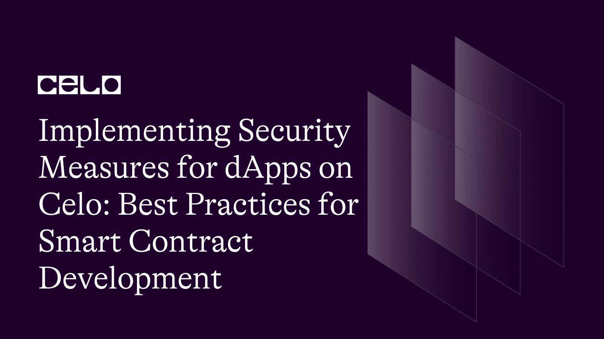

## Introduction

Decentralized applications (DApps) are becoming increasingly popular as they provide a transparent and decentralized way to interact with the blockchain. Celo, a mobile-first blockchain platform, allows developers to build and deploy DApps on its network. However, as with any technology, security is a major concern for DApps on Celo. In this article, we will discuss the best practices for implementing security measures for DApps on Celo.

## Prerequisites

In this article, a solid understanding of solidity and javascript is required.

## Requirements

Make sure to have Solidity extension and an Integrated Development Environment(IDE) like VScode installed.

## Ways of Implementing Security Measures on Celo

We'll briefly talk about several security measures then show a pratical example in the section.

### Use the latest version of Celo

Using the latest version of Celo is important as it includes the latest security features and bug fixes. Celo has a strong focus on security and the team is constantly updating the platform to ensure its security.

### Use Celo's native token for gas fees

Celo's native token, CELO, can be used to pay for gas fees on the Celo network. Using CELO instead of other tokens can help minimize the risk of attacks that target other tokens.

### Use secure smart contract development practices

The first step in implementing security measures for DApps on Celo is to use secure smart contract development practices. This includes practices such as writing clean and simple code, using the latest version of Solidity, testing the code thoroughly, and conducting third-party audits.

### Implement access control

Access control is an important security measure that should be implemented for DApps on Celo. This includes ensuring that only authorized users have access to the DApp and its functions. One way to implement access control is to use a permissioned blockchain, where only authorized nodes can access the network.

### Use secure authentication methods

Authentication is an important aspect of DApp security, as it ensures that only authorized users can access the DApp. Celo provides various authentication methods, including phone number authentication, which allows users to sign transactions and interact with DApps using their phone numbers. However, it is important to ensure that these authentication methods are secure and cannot be easily bypassed.

### Implement role-based access control

Role-based access control (RBAC) is another security measure that should be implemented for DApps on Celo. RBAC allows the DApp to grant access to different users based on their roles. For example, an admin role can have access to all the functions of the DApp, while a regular user role can only have access to specific functions.

### Use encryption

Encryption is an important security measure that should be implemented for DApps on Celo. Encryption ensures that sensitive data, such as private keys and user data, is protected and cannot be accessed by unauthorized users. Encryption should be used for all data that is transmitted over the network, as well as for data that is stored on the blockchain.

### Implement error handling

Error handling is an important security measure that should be implemented for DApps on Celo. Error handling ensures that the DApp is resilient to errors and can recover from them quickly. This includes handling invalid inputs, unexpected behavior, and other errors that may occur during the execution of the DApp.

### Implement monitoring and logging

Monitoring and logging are important security measures that should be implemented for DApps on Celo. Monitoring ensures that the DApp is functioning as expected and can alert the development team if any issues arise. Logging ensures that all actions taken by the DApp are recorded and can be used to identify any issues or malicious activity.

## Use multi-factor authentication

Multi-factor authentication (MFA) is an important security measure that should be implemented for DApps on Celo. MFA requires users to provide two or more forms of authentication before accessing the DApp. This includes something the user knows, such as a password, and something the user has, such as a phone or hardware wallet.

### Implement a bug bounty program

A bug bounty program is an important security measure that should be implemented for DApps on Celo. A bug bounty program incentivizes security researchers to find and report any security vulnerabilities in the DApp. This allows the development team to identify and fix any vulnerabilities before they can be exploited.

### Use audited and secure smart contract libraries

Avoid reinventing the wheel and instead use widely adopted, audited and secure smart contract libraries when building your DApp. This can help minimize the risk of security vulnerabilities in your code.

## Implement access control and permission management

Proper access control and permission management is crucial for securing your DApp. Ensure that only authorized parties can execute certain functions or access certain data.

### Implement input validation

Input validation is a critical component of DApp security. Always validate input data to prevent common attacks like SQL injection and cross-site scripting (XSS).

### Use safe math functions

Smart contracts are susceptible to integer overflow and underflow attacks. Use safe math functions to avoid these types of attacks.

Secure smart contract development is crucial to ensure the safety and reliability of decentralized applications running on blockchain platforms. Here's an example code that demonstrates some best practices for secure smart contract development in Solidity:
and also you can refer to [source-code](https://github.com/Joel-web3/Implementing-security-measures-on-celo)

```solidity

//SPDX-License-Identifier: MIT

pragma solidity ^0.8.0;

contract MyContract {

    address private owner;

    uint256 private value;

    constructor(uint256 _value) {

        owner = msg.sender;

        value = _value;

    }

    modifier onlyOwner() {

        require(msg.sender == owner, "Only the owner can perform this action.");

        _;

    }

    function setValue(uint256 _value) public onlyOwner {

        value = _value;

    }

    function getValue() public view returns (uint256) {

        return value;

    }

    function withdraw() public onlyOwner {

        uint256 balance = address(this).balance;

        payable(owner).transfer(balance);

    }

    fallback() external payable {

        revert("Invalid function call.");

    }

    receive() external payable {

        revert("Invalid function call.");

    }

}
```

This contract includes several security features:

The owner variable is marked as private to prevent unauthorized access to it.

The onlyOwner modifier is used to restrict access to certain functions to only the contract owner.

The setValue function is marked as public but can only be called by the contract owner due to the onlyOwner modifier.

The withdraw function allows the contract owner to withdraw any funds held in the contract.

The fallback and receive functions are implemented to prevent any unexpected or unauthorized transfers to the contract.

Note that this code is just an example and may not cover all possible security vulnerabilities. Solidity developers should always carefully review their code for potential issues and follow best practices for secure smart contract development.

To implement secure key management on the Celo blockchain, we can use the `@celo/wallet-base` library provided by the Celo team. This library provides a set of tools to securely manage private keys and interact with the Celo blockchain.

Here's an example code snippet that demonstrates how to use this library to securely manage private keys on the Celo blockchain:

```javascript
const { MnemonicUtils } = require("@celo/wallet-base");

// Generate a new mnemonic phrase

const mnemonic = MnemonicUtils.generateMnemonic();

// Derive a private key from the mnemonic phrase

const privateKey = MnemonicUtils.mnemonicToSeedSync(mnemonic).slice(0, 32);

// Create a new wallet instance using the private key

const wallet = new Wallet(privateKey);

// Use the wallet to sign a transaction

const tx = await wallet.sendTransaction({
  to: "&lt;recipient-address>",

  value: "1000000000000000000",
});

console.log(`Transaction sent: ${tx.hash}`);
```

In the above code, we first generate a new mnemonic phrase using the MnemonicUtils.generateMnemonic() function. This mnemonic phrase can be used to derive a private key, which is done using the MnemonicUtils.mnemonicToSeedSync() function.

Once we have the private key, we can create a new wallet instance using the Wallet class provided by the @celo/wallet-base library. This wallet instance can be used to sign transactions, as shown in the example code.

Note that this code is just an example, and there are many different ways to implement secure key management on the Celo blockchain. It's important to carefully consider the security implications of any key management system you implement, and to use best practices to keep your private keys safe.

## Conclusion

In conclusion, implementing robust security measures for dapps on the Celo blockchain is crucial to ensure the safety and trust of the platform's users. By adopting best practices such as smart contract auditing, access control, encryption, and multi-factor authentication, developers can reduce the risk of cyber attacks and protect sensitive user data.

## Next Steps

Now that you've learnt how implement strong security measures on decentralized applications on the Celo blockchain, you can go on and learn more on our [site](https://docs.celo.org/tutorials)

## About the Author

Joel Obafemi

A marketer, copywriter, and collab manager for web3 brands. You can connect with me on [LinkedIn](https://www.linkedin.com/in/joel-obafemi-a7179b19a/).
