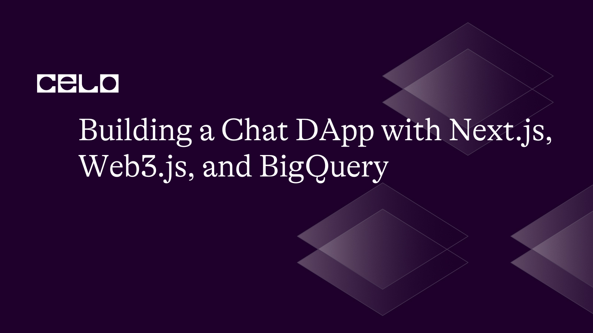
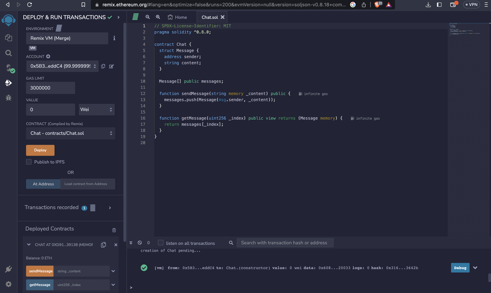

## Introduction

In this tutorial, we explored how to build a decentralized chat DApp using Next.js, web3.js, and BigQuery. We started by setting up a Celo network and deploying a smart contract for the chat functionality. Then, we used web3.js to connect to the Celo network and interact with the smart contract. Next, we integrated Pub/Sub to push chat events to BigQuery for analysis. Finally, we demonstrated how to query the chat data in BigQuery to find the most active users and the most messages sent. Here is a step-by-step guide on how to build a chat DApp using Next.js and Web3.js on the Celo network, and set up a BigQuery system to analyze the chat data:

This tutorial serves as a guide for developers interested in building decentralized chat applications using the Celo network and leveraging the power of Google Cloud's BigQuery for data analysis. The provided sample codes can be adjusted and customized to meet specific use cases and requirements.

## Prerequisite

- GCP account
- Celo wallet
- Node.js
- Knowledge of JavaScript
- Basic knowledge of SQL
- Simple BigQuery knowledge
- Basic Knowledge of Solidity

## What is BigQuery and its application to blockchain?

`BigQuery` is a powerful tool for analyzing large datasets, and it can be applied to blockchain and web3 data to gain insights into the behaviour of blockchain networks and their users. One application of BigQuery on the blockchain is to analyse the transactional data of a particular blockchain network. By querying the blockchain data stored in BigQuery, it is possible to identify the most active wallets, the most popular smart contracts, and the most common transaction types. This can provide valuable insights into the behaviour of users on the network and help identify trends and patterns.

In addition, BigQuery can also be used to analyze web3 data, such as data from decentralized applications (dApps) or other web3 platforms. By querying this data, it is possible to identify the most popular dApps, the most active users, and the most common interactions between users and the dApps. This can help developers and other stakeholders understand how users engage with the dApps and identify opportunities for improvement.

Moreover, BigQuery can also be used to analyze the performance of smart contracts, such as gas usage and execution time. This can help developers optimize their smart contracts to improve performance and reduce costs. But, on an introductory level, we will be applying the concept of BigQuery to the chat DApp.

## Let’s build the chat DApp with BigQuery, Nextjs, and WebJS.

Yes, it is possible to build a BigQuery system to query a chat DApp built with Next.js and Web3.js on the Celo network. We would need to set up a data pipeline that captures the chat data, transforms it into a structured format, and loads it into BigQuery. This could be done using a tool like Google Cloud Dataflow or Apache Beam. Our focus in this article is on cloud dataflow.

Once the chat data is in BigQuery, we will write queries to analyze the data and extract insights. For example, we could write a query to identify the most active users based on the number of messages sent or the users with the most replies or reactions. We could also use BigQuery's visualization tools to create charts and graphs to visualize the data, but we will focus on the active users in this article. These are the possibilities for using BigQuery.

To get started, we would need to set up a Next.js app with Web3.js to build the chat DApp and then integrate it with a backend data pipeline that streams the chat data to BigQuery. We would also need to set up the appropriate BigQuery tables and schema to store the data in a structured format that can be easily queried and analyzed.

## Building smart contracts

Before we go far, let’s talk about the backbone and the backend of a dApp. This is called a "smart contract," and it is popularly built using the Solidity programming language, which is what we will be using in this article. The smart contract should have functions to send and receive messages, and it should store the messages in a data structure such as an array. In this article, I will be falling back on my favourite tool, the Remix Project. Copy and paste the below code into the Remix online IDE editor, press Run, then compile and finally deploy. This will generate both the contract ABI and the right contract address.

```solidity
pragma solidity ^0.8.0;

contract Chat {
  struct Message {
    address sender;
    string content;
  }

  Message[] public messages;

  function sendMessage(string memory _content) public {
    messages.push(Message(msg.sender, _content));
  }

  function getMessage(uint256 _index) public view returns (Message memory) {
    return messages[_index];
  }
}
```



After successful deployment to Celo network, copy the ABI into a file called chatContractAbi.json. If the file does not exist before. Create it and continue.


## Setting up the NextJS project

To set up a new project, it is important to think about accessibility and file structures. One key note is to ensure all our files and folders are in the same location. To ensure this, let’s create a central folder to control it.

```bash
mkdir bq-celo-chat-dapp
cd bq-celo-chat-dapp
npx create-next-app .
```

## Installing necessary dependencies

```bash
npm install web3
npm install @google-cloud/pubsub
npm install @google-cloud/bigquery
```

`Web3.js`: can be used to connect to your Celo network by creating a new instance of the Web3 class and passing in the URL of your Celo network
`Pub/sub`: This will be installed as a package that can create a new Pub/Sub client and publish a message to the topic.
`Bigquery`: Package that is used to query the table

The next step is to create a Chat component that allows users to send and receive messages. Here is an example of what the Chat component might look like. Create a file with the name Chat.js in the components folder

```javascript
import { useState } from 'react';
import Web3 from 'web3';
import { PubSub } from '@google-cloud/pubsub';

const web3 = new Web3('https://your-celo-network-url');
const contractAbi = require('./contractAbi.json');
const contractAddress = '0x123456789abcdef...';
const contract = new web3.eth.Contract(contractAbi, contractAddress);
const pubsub = new PubSub();
const topicName = 'chat-messages';

function Chat() {
  const [content, setContent] = useState('');
  const handleSend = async () => {
    await contract.methods.sendMessage(content).send({ from: 'your-celo-wallet-address' });
    await pubsub.topic(topicName).publish(Buffer.from(JSON.stringify({ sender: 'your-celo-wallet-address', content })));
    setContent('');
  };

  return (
    <div>
      <ul>
        {messages.map((message, index) => (
          <li key={index}>
            <strong>{message.sender}:</strong> {message.content}
          </li>
        ))}
      </ul>
      <input type="text" value={content} onChange={(e) => setContent(e.target.value)} />
      <button onClick={handleSend}>Send</button>
    </div>
  );
}
export default Chat;
```
In this example, the Chat component uses the useState hook to manage the content state. When the user clicks the "Send" button, the handleSend function is called, which executes the sendMessage function on the smart contract and publishes a message to the Pub/Sub topic.

### Creating an index JS

```javascript
import Chat from '../components/Chat';
export default function Home() {
  return (
    <div>
      <h1>Decentralized Chat DApp</h1>
      <Chat />
    </div>
  );
}
```

## Setting up the Backend Data Pipeline

As mentioned earlier now, we will be using cloud dataflow and it is time to set the dataflow up here.

```javascript
import { PubSub } from '@google-cloud/pubsub';
// Imports the Google Cloud client library
const {PubSub} = require('@google-cloud/pubsub');

async function quickstart(
  projectId = 'your-project-id', // Your Google Cloud Platform project ID
  topicNameOrId = 'my-topic', // Name for the new topic to create
  subscriptionName = 'my-sub' // Name for the new subscription to create
) {

const pubsub = new PubSub();
const topicName = 'chat-messages';
const data = {
  sender: 'your-celo-wallet-address',
  content: 'Hello, world!'
};
const dataBuffer = Buffer.from(JSON.stringify(data));
pubsub.topic(topicName).publish(dataBuffer);
}
```

## Query the chat data in BigQuery

```sql
import { BigQuery } from '@google-cloud/bigquery';
const bigquery = new BigQuery();
const query = `SELECT sender, COUNT(*) AS count FROM chat_messages GROUP BY sender ORDER BY count DESC LIMIT 10`;
const [rows] = await bigquery.query(query);
console.log(rows);
```

In this example, the query selects the sender column from the `chat_messages` table and counts the number of messages sent by each sender. The results are grouped by the sender, ordered by message count in descending order, and limited to the top 10 senders.

## Conclusion

Congratulations! You have now learned how to build a fully functional decentralized chat DApp using Next.js, web3.js, and BigQuery. By leveraging the power of the Celo network and Google Cloud. [Repository here](https://github.com/Taiwrash/bq-dapp)

BigQuery is a powerful tool for analyzing blockchain and Web3 data and can provide valuable insights into the behavior of blockchain networks and their users. By leveraging BigQuery, developers and other stakeholders can better understand blockchain and Web3 data and use this knowledge to improve their applications and services. Overall, building a BigQuery system to analyze chat data from a DApp on the Celo network can provide valuable insights into user behavior and engagement and can help developers optimize their applications to improve user experience and engagement.

## About the Author

Hey, I am Rasheed Mudasiru. A software developer who is passionate about community, open source and developer relations: I write about DevOps, automation, deployments and cloud computing.
