# How to quickly build an NFT collection on Celo

_How to deploy a smart contract to Celo testnet, mainnet, or a local network using Hardhat._

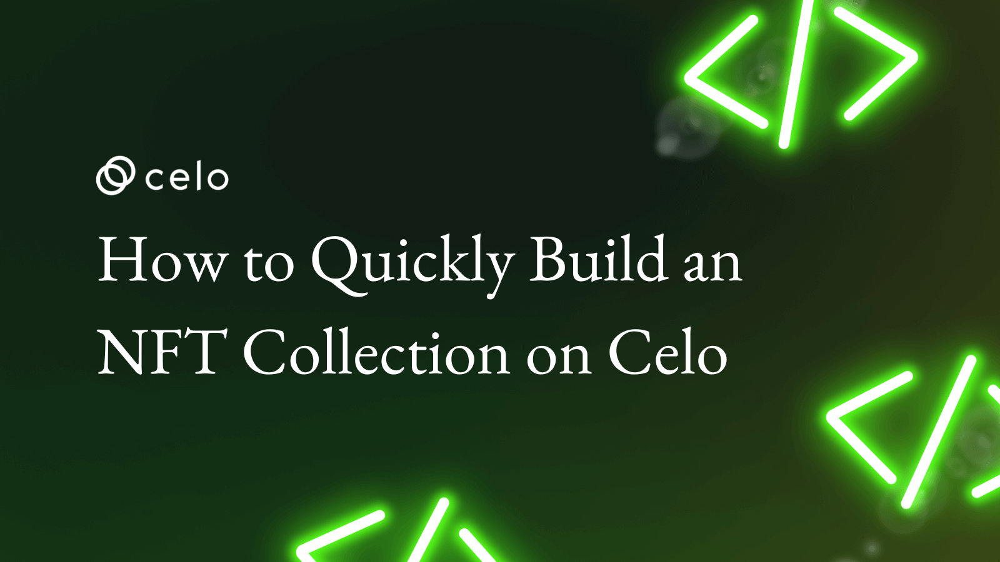

## Hello Developers 🌱

Welcome to today’s post, where we’ll break down a blockchain topic into bite-sized pieces to help you learn and apply your new skills in the real world.

Today’s topic is How to quickly build an NFT collection on Celo.

**Here’s a list of what we’ll cover 🗒**

- ✅ **Step 1:** Connect to MetaMask
- ✅ **Step 2:** Upload your NFT with Pinata
- ✅ **Step 3:** Create your Smart Contract (low-code)
- ✅ **Step 4:** Deploy your Smart Contract
- ✅ **Step 5:** Mint your NFT

By the end of this post, you’ll have an NFT collection built using MetaMask, Celo, Pinata, IPFS, OpenZeppelin, and Remix. These tools allow you to create, deploy, and manage NFTs quickly without writing any code.

Let’s go! 🚀

## Before getting started

This post uses a variety of tools to help you quickly deploy your NFT on Celo. While the post allows you to follow along with no background in these tools, it may help to review some of the links below.

- [Celo](https://celo.org/)
- [MetaMask](https://metamask.io/)
- [Pinata](https://www.pinata.cloud/)
- [IPFS](https://ipfs.io/)
- [OpenZeppelin](https://www.openzeppelin.com/)
- [Remix](https://remix-project.org/)

## ✅ Step 1: Connect to MetaMask

MetaMask allows you to connect to the Celo blockchain from your browser. To get started, install the [Metamask](https://metamask.io/) browser extension.

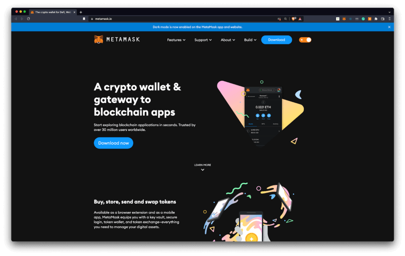

- Add Alfajores Testnet to MetaMask using the manual setup option here
- Add CELO to your test account using the [Alfajores Testnet Faucet](https://faucet.celo.org)

:::tip

Learn more: Check out [3 Simple Steps to Connect your MetaMask Wallet To Celo](https://medium.com/celodevelopers/3-simple-steps-to-connect-your-metamask-wallet-to-celo-732d4a139587) for more details.

:::

## ✅ Step 2: Upload your NFT ​with Pinata

[Pinata](https://www.pinata.cloud/) allows you to easily upload files to [IPFS](https://ipfs.io/) to use as your NFT.

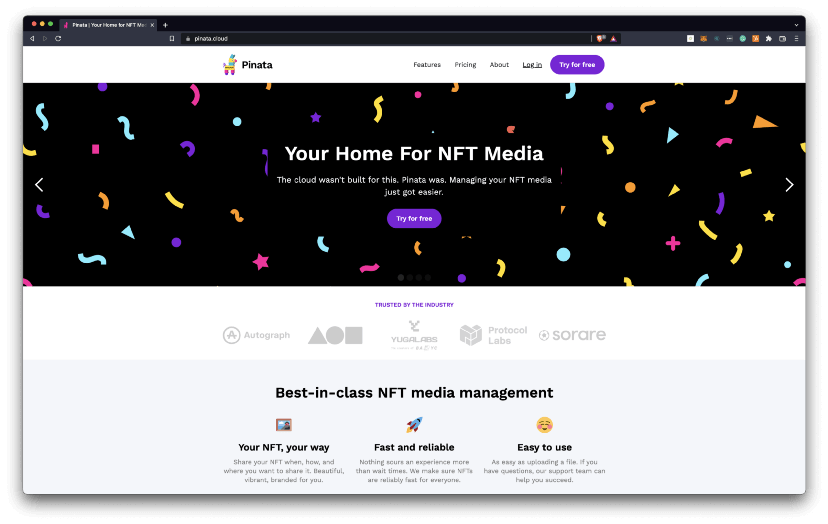

To get started, go to [Pinata](https://app.pinata.cloud/) and log in or sign up for an account.

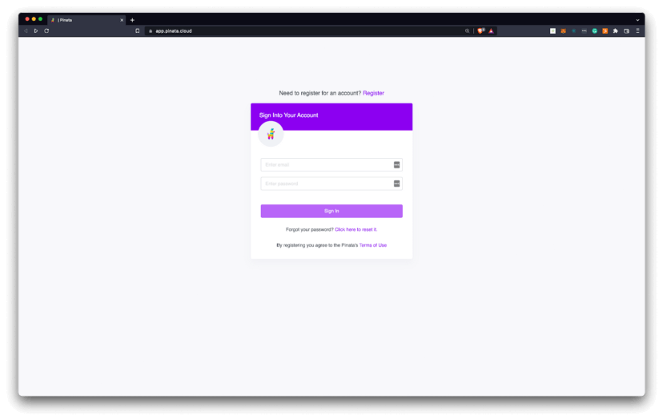

Once logged in, select the **+ Upload** button


Choose the files you would like to upload and complete the upload process.

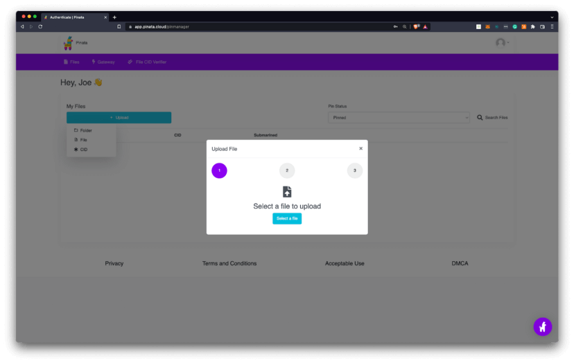

You should now see the name and content identifier (CID) hash for each file.

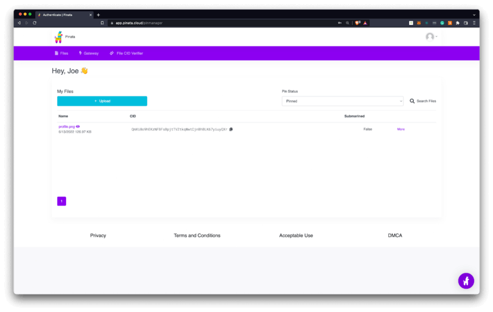

You’ll now prepare the token metadata. The example uses a folder named prosper factory metadata. View the contents of the folder [here](https://gateway.pinata.cloud/ipfs/QmdmA3gwGukA8QDPH7Ypq1WAoVfX82nx7SaXFvh1T7UmvZ).

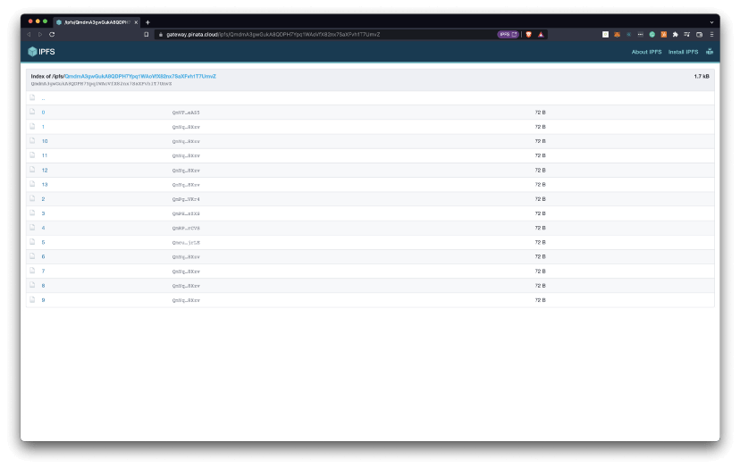

Select any file to view the NFT metadata from within a browser that supports IPFS (example: Brave Browser) to see the unique image reference.

```
{
"image": "ipfs://QmVKCcW7c5aUs3GzW92atgFUz7N6rox7EzeibEbyJ6jBMi"
}
```

Next, create a folder containing metadata for each NFT you’d like to create. Upload a folder containing all of the token metadata to Pinata. This will make your NFT data publicly available.

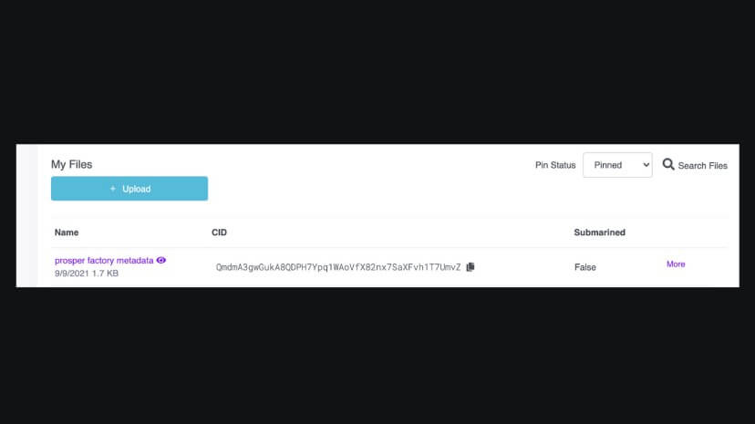

This example uses a folder name prosper factory metadata. You can view the contents of the folder [here](https://gateway.pinata.cloud/ipfs/QmdmA3gwGukA8QDPH7Ypq1WAoVfX82nx7SaXFvh1T7UmvZ). The folder contains 14 files, numbered 0–13. The names of these files are important. These file names correspond to the token ID of each NFT that will be created by the contract. Make sure that there are no extensions (.txt, .json, .jpeg, .png) on your files.

## ✅ Step 3: Create your Smart Contract (low-code)​

Now that your NFT image is on IPFS, you’ll create and deploy a smart contract. In this post, you’ll use OpenZeppelin, a well known smart contract library to create your smart contract without writing any code.

- Start by navigating to the [OpenZeppelin Contracts Wizard](https://docs.openzeppelin.com/contracts/4.x/wizard)

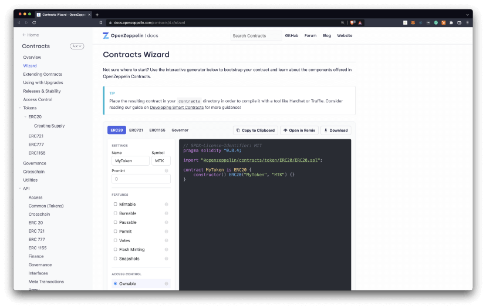

Select ERC721 as your token choice and learn more about ERC721 [here](https://docs.openzeppelin.com/contracts/4.x/erc721).

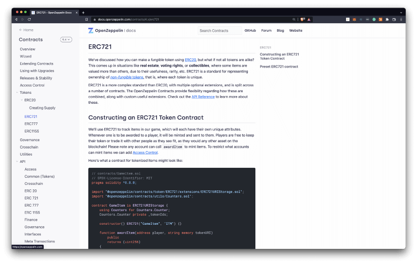

- Enter your token information (name, symbol).
- Enter the Content Identifier (CID) from Pinata as the Base URI

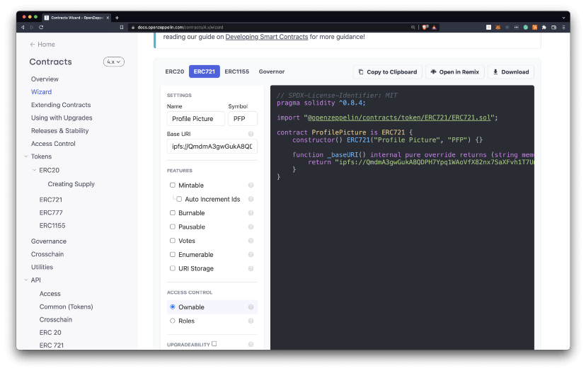

- Select **Mintable** and **Auto increment ids**. This gives each NFT a unique identifier that increments as new NFTs are minted.
- Select **Ownable**. This restricts minting to the owner of the contract. The owner is the address you used to deploy your smart contract.

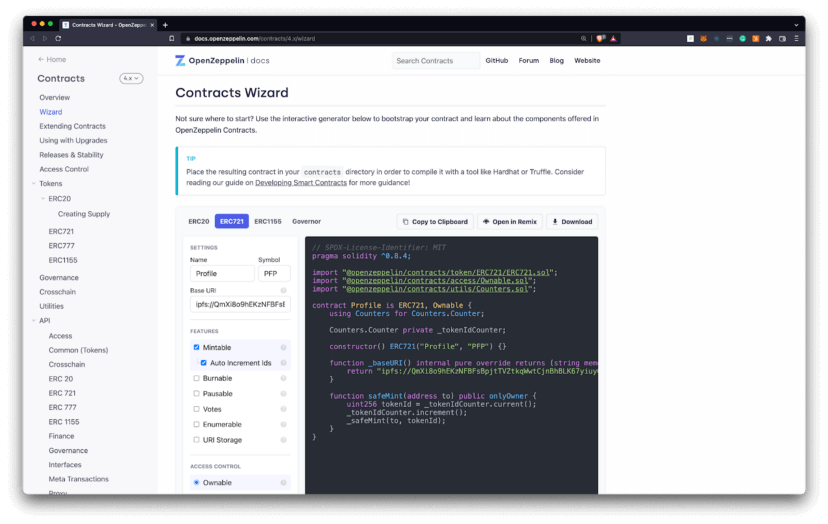

## ✅ ​Step 4: Deploy your Smart Contract

[Remix](https://remix-project.org/) is an online tool that allows you to develop, deploy, and manage smart contracts on Celo. Now that your contract is complete, you’ll use Remix to interact with your smart contract.

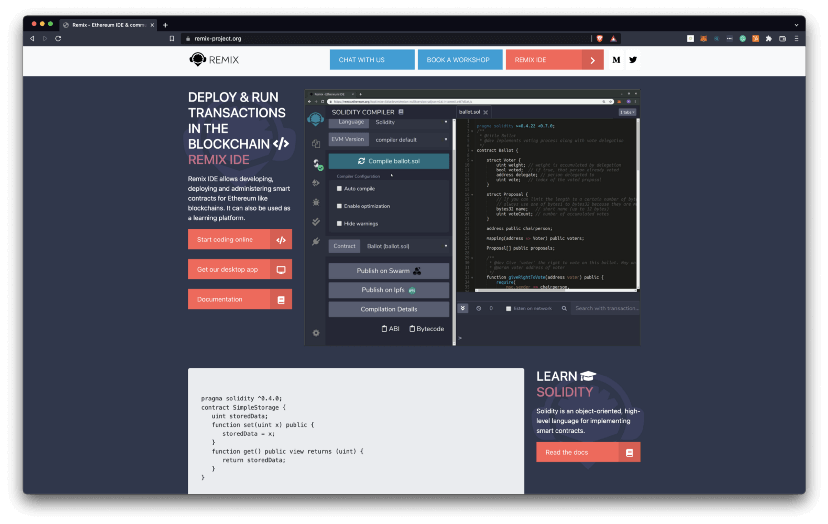

- From the OpenZeppelin Wizard, click **Open in Remix**.
- Remix will open with your OpenZeppelin contract available.
- Click the blue button labeled Compile Contract.

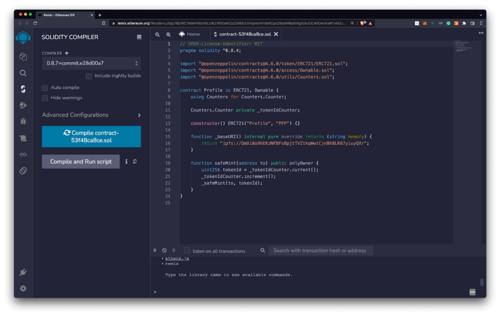

After compiling the contract, click the Ethereum logo on the left panel to open the Deploy & Run transactions tab.

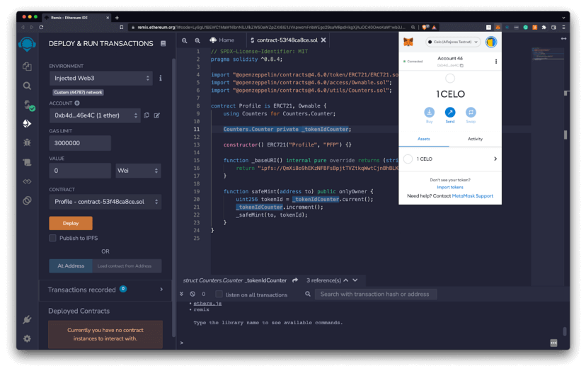

- In the **Environment** dropdown, select Injected Web3 to connect Remix to MetaMask.
- Check that MetaMask is connected to the correct network (example: Alfajores Testnet). This network will appear as **Custom (44787)**.

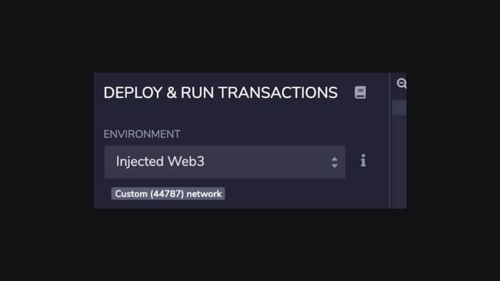

Select the contract you would like to deploy (example: ProsperityFactory).

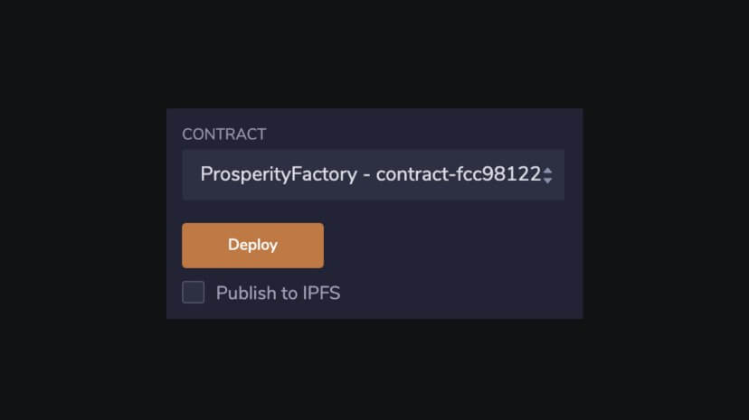

- Click **Deploy** and confirm the transaction from MetaMask.
- View your deployed contract from the dropdown on the bottom left corner of Remix.

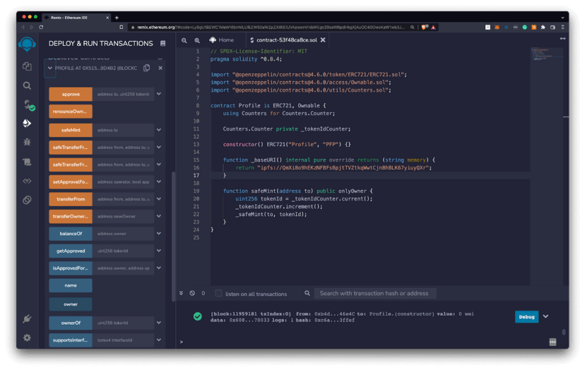

Expand the dropdown to see each of your contract’s functions.

:::tip

Learn more: Read [6 Steps to Quickly Build Smart Contracts on Celo with Remix](https://medium.com/celodevelopers/6-steps-to-quickly-build-smart-contracts-on-celo-with-remix-a0d1f0a33ef3) to learn more.

:::

## ✅ Step 5: Mint your NFT

You’re finally ready to mint your NFT!

- Call the safeMint function using your wallet address as the input.
- Confirm the transaction in MetaMask to mint your first NFT.

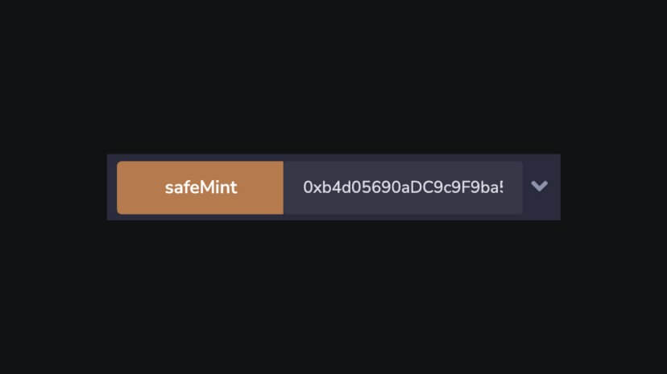

You can verify that the token was minted by calling the tokenURI function with the expected token ID. Calling the contract with tokenURI = 0 will return the NFTs IPFS reference

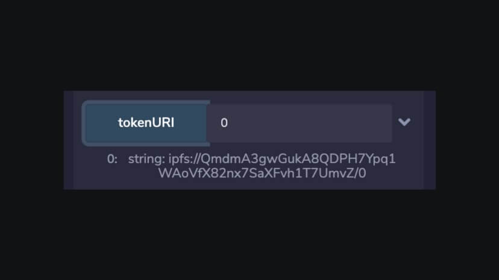

This IPFS reference will show the token metadata for that NFT.

### Example Image

```
{
"image": "ipfs://QmVKCcW7c5aUs3GzW92atgFUz7N6rox7EzeibEbyJ6jBMi"
}
```

Navigate to the IPFS reference to view the image for the token.

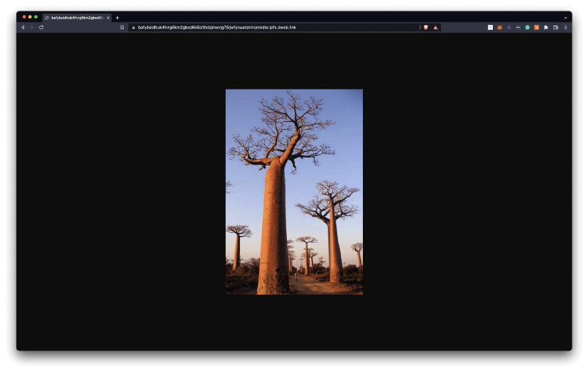

## Congratulations 🎉

That wraps up today’s topic on how to quickly build an NFT collection on Celo. You can review each of the items we covered below and check that you’re ready to apply these new skills.

**Here’s a quick review of what we covered 🤔**

- ✅ **Step 1:** Connect to MetaMask
- ✅ **Step 2:** Upload your NFT with Pinata
- ✅ **Step 3:** Create your Smart Contract (low-code)
- ✅ **Step 4:** Deploy your Smart Contract
- ✅ **Step 5:** Mint your NFT

Hopefully, you now have an NFT collection built using MetaMask, Celo, Pinata, IPFS, OpenZeppelin, and Remix. Use can now use these tools whenever you’d like to create, deploy, and manage NFTs quickly without writing any code.

GN! 👋
