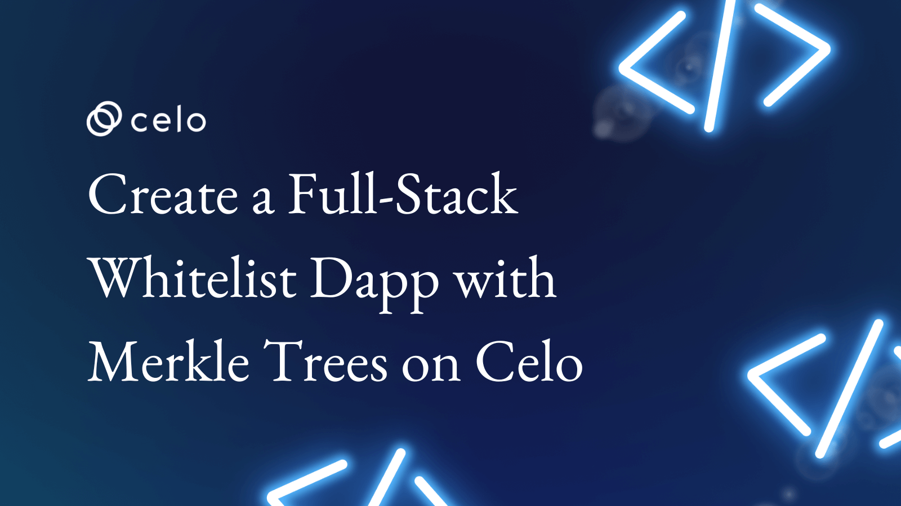
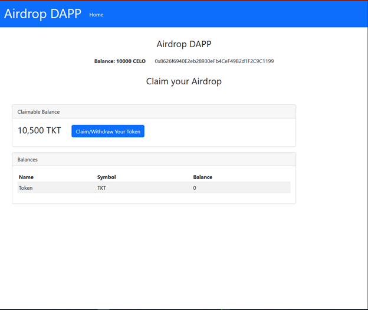
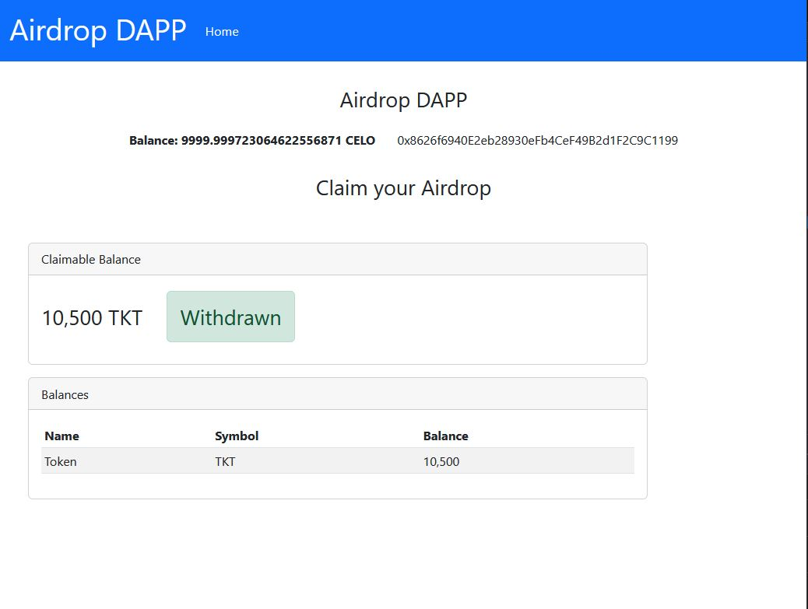

## Introduction

Welcome to our tutorial on building a Full-Stack Whitelist Dapp with Merkle Trees on Celo!

In this tutorial, we will show you how to use Merkle trees, a powerful data structure hierarchy, to efficiently verify if a particular data is part of a dataset.

We will demonstrate how to use Merkle trees for whitelisting participants in an NFT sale, airdrop, or staking program, and how this can help you save on transaction gas.

This tutorial will cover the use of Solidity, JS/TS, and Angular to build a complete Full-Stack Dapp. Whether you are a seasoned Dapp developer or new to the world of blockchain, this tutorial will provide valuable insights and guidance

### How the dApp works

Merkle Trees have found numerous real world use in whitelisting participants in NFT sales, Airdrops, staking programs etc. In this tutorial we will use an airdrop to demonstrate how this is done, but the concepts you learn can be translated into building whitelists for NFT mints, staking programs, presales etc.

Our dApp will allow a selected list of users to claim from a pool of tokens to be airdropped from our contract. Users will be able to see how much Tokens they will get in the airdrop and if they are eligible, claim and get those tokens sent to their wallet.

Our list of eligible airdrop participants will not be stored directly in a mapping or array on our smart contract, instead we will construct a Merkle Tree out of this list and store the root hash in our smart contract. We will generate a proof on our client side and pass to our smart contract for validation for each participant. This helps us to save the cost of gas tremendously

You can see a sample of what we will be building here.



## Prerequisites

This tutorial assumes that you are familiar with solidity, understand how smart contracts work and know how to deploy smart contracts to a network using any of your favorite web3 tooling (Hardhat, Truffle, etc). Celo is an Ethereum Virtual Machine (EVM) compatible chain, so all the languages and workflows you learned while building for any EVM chain apply to Celo also.

This tutorial is written for an Angular frontend but you should be able to follow along using any other frontend js framework e.g. React, Vue etc.

You will need the following installed on your PC

-   Solidity

-   Hardhat

-   Node Js

-   Typescript

-   Angular CLI

### What are Merkle Trees?

 A Merkle tree is a tree in which every \"leaf\" (node) is labeled with the cryptographic hash of a data block, and every node that is not a leaf (called a branch, inner node, or inode) is labeled with the cryptographic hash of the labels of its child nodes. A hash tree allows efficient and secure verification of the contents of a large data structure. A hash tree is a generalization of a hash list and a hash chain.
 


The Merkle tree is a type of binary tree in which the hashes of the transactional data on the bottom row are called **leaf nodes** the intermediate hashes are called **branches** and the hash at the top is called the **root**.

Merkle trees are made by hashing pairs of nodes repeatedly until only one hash remains; this hash is known as the Merkle Root or the Root Hash.

They\'re built from the bottom, using hashes of your original data.

Each non-leaf node is a hash of its previous hash, and every leaf node is a hash of data.

**Example**

Now, lets look at an example in JS/TS.

For this example, lets say we want to airdrop a token (Tkt) of a particular amount to a shortlisted list of wallets.

This shortlist could have been gotten from a list of contest winners or from people who interacted with your dApp before now or even from a telegram airdrop bot. The important thing is that we now have a list of wallet addresses along with the amount of tokens due to them.

We can use this list to construct a Merkle Tree Root hash, the root hash will be passed to our smart contract and will be used to validate if a wallet owner is allowed to claim from our airdrop in future.

This same principle will apply if you are trying to also restrict an NFT mint to a whitelist.

We will assume for this example, that you are going to have a list of addresses to keep things short.

We will use the MerkleTree Js Library to construct our Merkle tree, and use the keccak256 library to hash our data.

To Derive the Leaf Nodes, let's create an array that contains our whitelisted addresses along with the amount of tokens due to each address.

```js
const leafNodes = [
    {"address": "0x4ABda0097D7545dE58608F7E36e0C1cac68b4943", "balance": 400},
    {"address":"0x00000005Fa950023724931D2EcbA50bE1688abFf","balance":11500},
    {"address":"0x70997970c51812dc3a010c7d01b50e0d17dc79c8","balance":7500},
    {"address":"0x3c44cdddb6a900fa2b585dd299e03d12fa4293bc","balance":11000},
    {"address":"0x0000000a8dEA75E8f8000BF18C22948c7EAb3b9D","balance":8500},
    {"address":"0x8626f6940e2eb28930efb4cef49b2d1f2c9c1199","balance":10500}
]
const arr = leafNodes.map((i,ix) => {
      const packed = ethers.utils.solidityPack(["address","uint256"], [ i.address, toWei(i.balance)])
      return keccak256(packed);
 });
```

Once we have our leafNodes array, we can then use the MerkeTree Js library to do all the hard work of hashing and generating our Merkle root for us.

```js
// Generate merkleTree from leafNodes
  const merkleTree = new MerkleTree(arr, keccak256, { sortPairs: true });
  // Get root hash from merkle tree\
  const rootHash = merkleTree.getRoot();
```

We now have our root hash which we can then pass in to our **Airdropper** contract when deploying it.

## Setup Our Project 

To bootstrap our airdrop Angular dApp, we will be using **Celo Composer**.

**Celo Composer** is a set of tools and starter templates that makes it easy for you to start your Celo-based web3 projects.

You can check out Celo Composer [https://github.com/celo-org/celo-composer/tree/main/packages/angular-app](https://github.com/celo-org/celo-composer/tree/main/packages/angular-app).

To start our Angular App Project, we will use the Celo Composer CLI; the CLI makes it easy for us to select the options that we want when bootstrapping our dApp. Run this on your terminal

```bash
npx @celo/celo-composer create
```

-   Choose Angular when asked for the framework

-   Choose hardhat (Only Hardhat is available at the time of writing this tutorial)

-   Skip subgraph, we won't use it in this tutorial.

Your Project will now be created; you can check to make sure it has the following folders

-   packages/hardhat - Your Hardhat Folder - Where you can keep your Contracts

-   packages/angular-app - Your Angular project

## Setup the Smart Contract

-   Open your Hardhat project folder (packages/hardhat)

-   Copy the *.envexample* to a new file called *.env*. This is where the private key you use to deploy your contracts will be saved.

-   Fill in the private key with your Celo wallet private key. You might want to get some Alfajores (Testnet) coins from the Celo Faucet

-   Open your Contracts folder (packages/hardhat/contracts)

-   Add a new contract in the folder called **AirDropper.sol**

```js

// SPDX-License-Identifier: MIT

pragma solidity ^0.8.8;
 

import "@openzeppelin/contracts/utils/cryptography/MerkleProof.sol";
import "@openzeppelin/contracts/token/ERC20/ERC20.sol";
import "hardhat/console.sol";
import "@openzeppelin/contracts/token/ERC20/utils/SafeERC20.sol";
import "@openzeppelin/contracts/access/Ownable.sol";
import "@openzeppelin/contracts/security/ReentrancyGuard.sol";
  

contract AirDropper is Ownable, ReentrancyGuard {  

    using SafeERC20 for IERC20;  

    bytes32 public immutable root;

    address tokenAddress ;

    mapping(address => bool) claimed;  

    constructor(bytes32 _root, address token) {
        root = _root;
        tokenAddress=token;
    }  

    function hasClaimed() external view returns (bool) {
        return _hasClaimed(msg.sender);
    }

	function _hasClaimed(address user) private view  returns (bool) {
        return claimed[user];
    }

    function claim(bytes32[] calldata _proof, uint amount) external nonReentrant {

        address claimer = msg.sender;
        require(!claimed[claimer], "Already claimed air drop");
        claimed[claimer] = true;
        bytes32 _leaf = keccak256(abi.encodePacked(claimer, amount));
        require(
            MerkleProof.verify(_proof, root, _leaf),
            "Incorrect merkle proof"
        );
        require( IERC20(tokenAddress).balanceOf(address(this)) > amount, 'AIRDROP CLAIM: No token to release by airdropper');
        IERC20(tokenAddress).safeTransfer(claimer, amount);
    }
}

```

The Airdropper contract is instantiated with two arguments

-   **rootHash**: The generated root hash of the Merkle Tree constructed with the airdrop distribution table

-   **tokenAddress**: The address of the Erc20 token that will be distributed. You will need to transfer the right amount of tokens to the Airdropper contract before your distribution starts.

The **Airdropper** Contract verifies our Airdrop participants and allows them to Claim from the pool of tokens we want to give out to them. It has one main public function **Claim**

The Claim function accepts two arguments

**\_proof**: a bytes32 array containing the proof of the merkle

**amount**: the amount a participant is entitled to

We use the openzeppelin MerkleProof class to verify the proofs submitted in the claim function. If the proof submitted was valid, and the user has not claimed from the airdrop before , we will send the users the right amount of the Erc20 token from the contract.

The **Airdropper** contract stores a list of everyone who has claimed successfully to the `claimed` mapping, and checks it on each claim to avoid double claims

Your Angular dApp Frontend will be interacting with the **Airdropper** contract.

### Deploy Your Smart contract

Your hardhat project was set up with the hardhat-deploy plugin which makes deployments very easy.

To deploy, go to the deploy folder, open the 00-deploy.js file, and you will see an example deployment function for the existing Greeter contract.

Copy the 00-deploy.js file and paste it to a new file called `01-deploy-Airdropper.js`.

Your hardhat-deploy plugin deploys your contracts serially using the naming of the file. So, when you run the deploy command, it will run the `00-deploy` file first, then run the `01-deploy-airdropper.js` file next.

Now open the `01-deploy-AirDropper.js` file.

Update the code to deploy the **AirDropper** Contract.

Your code should look like this

```js
const { ethers } = require("hardhat");

const { MerkleTree } = require('merkletreejs');

const keccak256 = require('keccak256');

const toWei = (num) => ethers.utils.parseEther(num.toString())

const fromWei = (num) => ethers.utils.formatEther(num)

const tokenAddress = 'tokenAddress';

const leafNodes = [

{"address": "0x4ABda0097D7545dE58608F7E36e0C1cac68b4943", "balance": 400},

{"address": "0x00000005Fa950023724931D2EcbA50bE1688abFf", "balance":11500},

{"address":"0x70997970c51812dc3a010c7d01b50e0d17dc79c8","balance":7500},

{"address":"0x3c44cdddb6a900fa2b585dd299e03d12fa4293bc","balance":11000},

{"address":"0x0000000a8dEA75E8f8000BF18C22948c7EAb3b9D","balance":8500},

{"address":"0x8626f6940e2eb28930efb4cef49b2d1f2c9c1199","balance":10500}

]

const tokenAirdropSum = leafNodes.map(m=>m.balance).reduce( (previousValue, currentValue) => previousValue + currentValue, 0);

const arr = leafNodes.map((i,ix) => {
	const packed = ethers.utils.solidityPack(["address", "uint256"], [ i.address, toWei(i.balance)])	
	return keccak256(packed);
});

// Generate merkleTree from leafNodes

const merkleTree = new MerkleTree(leafNodes, keccak256, { sortPairs: true });

// Get root hash from merkle tree

const rootHash = merkleTree.getRoot()

module.exports = async ({ getNamedAccounts, deployments }) => {

	const { deploy } = deployments;
	
	const { deployer } = await getNamedAccounts();
	
	await deploy("AirDropper", {
	
		from: deployer,
		
		args: [rootHash, tokenAddress],
		
		log: true,
	
	});

};

module.exports.tags = ["AirDropper"];
```


*\* Remember to transfer enough tokens to the airdrop contract before the day your airdrop starts.*

Deploy the Contracts by running the following commands on any terminal (make sure you are in the packages/hardhat directory)

```bash
npx hardhat deploy --network alfajores
```

If all is well, you should see a message from hardhat with the transaction hash of your Contract deployment and the address of your new Contract

You can now view your contract on the CELO explorer (Alfajores) using the address.

Now that we have deployed our contract let's build the dApp.

Before we go on, Our dApp will be running in the browser, so you will need a wallet to test within the browser. If you have not yet installed Metamask, this will be a good point to do that.

Also, once you have Metamask installed, ensure you add the CELO Networks - Mainnet and Alfajores ( TestNet ) - to it. If you are unsure how to go about this, You can use this tutorial ( [[https://developers.celo.org/3-simple-steps-to-connect-your-metamask-wallet-to-celo-732d4a139587]{.underline}](https://developers.celo.org/3-simple-steps-to-connect-your-metamask-wallet-to-celo-732d4a139587) ) as a guide.

## Setup the dApp Frontend

Switch to the angular project in your terminal

```bash
cd packages/angular-app
```

Now install the needed packages

```bash
npm i
```

Once the packages install, let's run the code to see how it looks first with the base Celo composer code


Click on the connect button, and you will see how it works for now.

You can now connect to a crypto wallet, and the response from your connection is also displayed back to you.

Open the packages\\angular-app\\src\\app\\services\\contract\\web3.services.ts file

Most of your interactions with the blockchain are going to be happening through the web3Service class.

Change the web3service code a little to make it easier to use with type checking.

*If you will like some explanation about how the web3service class works, you can go through our Angular Web3 basics tutorial [here]( https://docs.celo.org/blog/tutorials/build-a-frontend-dapp-for-celo-network-in-angular)* 

Replace the content with this

```js
import {Inject, Injectable} from '@angular/core';
import { WEB3 } from '../../core/web3';
import { Subject } from 'rxjs';
import Web3 from 'web3';
import Web3Modal from "web3modal";
import WalletConnectProvider from "@walletconnect/web3-provider";
import { provider } from 'web3-core';

@Injectable({
  providedIn: 'root'
})
export class Web3Service {
  public accountsObservable = new Subject<string[]>();
  web3Modal;
  web3js:  Web3| undefined;
  provider: provider | undefined;
  accounts: string[] | undefined;
  balance: string | undefined;

  constructor(@Inject(WEB3) private web3: Web3) {
    const providerOptions = {
      walletconnect: {
        package: WalletConnectProvider, // required
        options: {
          infuraId: 'env', // required change this with your own infura id
          description: 'Scan the qr code and sign in',
          qrcodeModalOptions: {
            mobileLinks: [
              'rainbow',
              'metamask',
              'argent',
              'trust',
              'imtoken',
              'pillar'
            ]
          }
        }
      },
      injected: {
        display: {
          logo: 'https://upload.wikimedia.org/wikipedia/commons/3/36/MetaMask_Fox.svg',
          name: 'metamask',
          description: "Connect with the provider in your Browser"
        },
        package: null
      },
    };

    this.web3Modal = new Web3Modal({
      network: "mainnet", // optional change this with the net you want to use like rinkeby etc
      cacheProvider: true, // optional
      providerOptions, // required
      theme: {
        background: "rgb(39, 49, 56)",
        main: "rgb(199, 199, 199)",
        secondary: "rgb(136, 136, 136)",
        border: "rgba(195, 195, 195, 0.14)",
        hover: "rgb(16, 26, 32)"
      }
    });
  }


  async connectAccount() {
    this.provider = await this.web3Modal.connect(); // set provider
    if (this.provider) {
      this.web3js = new Web3(this.provider);
    } // create web3 instance
    this.accounts = await this.web3js!.eth.getAccounts();
    return this.accounts;
  }

  async accountInfo(account: string){
    const initialvalue = await this.web3js!.eth.getBalance(account);
    this.balance = this.web3js!.utils.fromWei(initialvalue , 'ether');
    return this.balance;
  }

}


```

Reload your page, If all goes well, you should still be able to see your connected wallet address on the page.

### Add Bootstrap UI Framework

We will use Bootstrap's CSS framework for our DAPP UI

Tailwind is installed, so I will disable it, and add **bootstrap** instead. So go to styles.css and remove all the stylings there.

Now, Go to [[https://getbootstrap.com/docs/5.2/getting-started/introduction/]{.underline}](https://getbootstrap.com/docs/5.2/getting-started/introduction/) and copy the bootstrap css files and scripts and add it to the head and body section in your index.html(/src/index.html)

Change the code in our app-component to support bootstrap and add support for routing by adding a Router Outlet.

```html
<nav class="navbar navbar-expand-sm navbar-dark bg-primary">
  <div class="container-fluid">
    <a class="navbar-brand" href="#">
      <h1>Airdrop DAPP</h1>
    </a>
    <button class="navbar-toggler" type="button" data-bs-toggle="collapse" data-bs-target="#navbarSupportedContent" aria-controls="navbarSupportedContent" aria-expanded="false" aria-label="Toggle navigation">
      <span class="navbar-toggler-icon"></span>
    </button>
    <div class="collapse navbar-collapse" id="navbarSupportedContent">
      <ul class="navbar-nav me-auto mb-2 mb-lg-0">
        <li class="nav-item">
          <a class="nav-link active" aria-current="page" href="/">Home</a>
        </li>
        
        
        
      </ul>
      
    </div>
  </div>
</nav>
<div class="container-fluid py-3">
  <div class="row my-3">
    <div class="col d-flex justify-content-center">
      <h3>Airdrop DAPP</h3>
	   		
    </div>
  </div>
  <div class="row my-3">
    <div class="col d-flex justify-content-center">
      <div *ngIf="accounts "> <b class="me-4">Balance: {{balance}} CELO </b> {{accounts[0]}}</div>
      <button *ngIf="!accounts " class="btn btn-primary py-2 px-4 rounded" (click)="Connect()" >
          Connect your wallet
      </button>
	  </div>
  </div>

  <div class="row">
    <div class="col my-3 ">
      <router-outlet></router-outlet>
    </div>
  </div>
</div>

```

We have updated the AppComponent to include support for connecting your wallet and displaying the connected wallet info as needed.

Modify the app.module file (src/app/app.module.ts) to support routing.

```js
import { NgModule } from '@angular/core';
import { BrowserModule } from '@angular/platform-browser';
import { BrowserAnimationsModule } from '@angular/platform-browser/animations';
import { AppComponent } from './app.component';
import { RouterModule, Routes } from '@angular/router'
import { FormsModule, ReactiveFormsModule } from '@angular/forms';
import { HomeComponent } from './home/home.component';
import { HttpClientModule } from  '@angular/common/http';

const routes: Routes = [];


@NgModule({
  declarations: [
    AppComponent,
    HomeComponent
    
  ],
  imports: [
    BrowserModule,
    BrowserAnimationsModule,
    RouterModule.forRoot(routes),
    ReactiveFormsModule,
    HttpClientModule

  ],
  providers: [],
  bootstrap: [AppComponent]
})
export class AppModule { }

```

Install the following npm packages, Merkletreejs and keccak256.

```bash
npm i merkletreejs keccak256
```

Let's add a new Home Component and setup a route for it. We can do this from the Angular-cli, so run this on your terminal (from the root angular folder path)

```bash
ng g c home
```

Before we start modifying our Home Component, lets explain what we will be doing.

We have our **Airdropper** smart contract setup already, with the root hash from our Merkle tree stored on-chain.

We need a way for our dApp to get the Merkle proof for the current user/wallet and submit this to the smart contract for verification and distribution. It needs access to the Merkle tree to do this.

Since we need the Merkle tree to generate the proof on the client side, we have two options

1.  Store the Leaf nodes (distribution table) on the client side, possibly in a json file , that the client can access to recreate the whole Merkle tree, and then generate the Merkle proof for our user.
   
    The advantage this option has is that you don't need a separate server side API deployment just to manage this process.
    
    This has a disadvantage - anyone can access the whole file and see all the details, and there might be some security concerns around that too.

2.  Generate the Merkle Tree on the server side, and expose endpoints for getting individual Merkle proofs via API calls. i.e the dApp can call the server side to generate the Merkle proof for any user, without having to see the whole distribution table.
   
    The obvious advantage here is that the Merkle tree details are hidden from the client.
    
    The disadvantage here is that it introduces a slight complexity in your design as you now need to maintain a separate server side API just for this purpose. But in a production environment, this is probably the best option.

To avoid any complexity, we will be going with the 1st option - saving our distribution table (the leaf nodes) in a json file accessible to our dApp. 

So create a file named `rewards.json` and save it in the assets (`/src/assets`) folder. The content of this file will be your airdrop Distribution table for the airdrop, it should contain the same data you used in generating the Merkle tree root hash you passed to the Airdroppersmart contract on deployment.

Rewards.json (`/src/assets/rewards.json`)

```js
const leafNodes = [
    {"address": "0x4ABda0097D7545dE58608F7E36e0C1cac68b4943", "balance": 400},
    {"address":"0x00000005Fa950023724931D2EcbA50bE1688abFf","balance":11500},
    {"address":"0x70997970c51812dc3a010c7d01b50e0d17dc79c8","balance":7500},
    {"address":"0x3c44cdddb6a900fa2b585dd299e03d12fa4293bc","balance":11000},
    {"address":"0x0000000a8dEA75E8f8000BF18C22948c7EAb3b9D","balance":8500},
    {"address":"0x8626f6940e2eb28930efb4cef49b2d1f2c9c1199","balance":10500}
]
```

Now go to the *packages/hardhat/artifacts/contracts/AirDropper.sol/AirDropper* file.

Copy the ABI section of the json file and paste it into a new file, name it **AirDropper.json** and save it to the assets (`/src/assets`) folder. Copy only the Array, not the whole field.

Now Open the Home view (`/src/app/home/home.html`) and update it to

```html
<div class="row">
    <div class="col d-flex justify-content-center align-items-center">
        <h3 class="d-flex align-content-center align-items-center text-center">Claim your Airdrop</h3>
    </div>
</div>

<div class="container-fluid " *ngIf="account">
    <div class="row">
      
      <main role="main" class="col-md-9 ml-sm-auto col-lg-10 px-4">
        
        <div class="row mt-5 mb-3 ">
          <div class="col">
            <div class="card card-primary">
              <div class="card-header">
                Claimable Balance
              </div>
              <div class="card-body">                    
                <h3 class="card-title">                    
                  {{claimableBalance| number :'1.0-6'}} TKT 
                  <button *ngIf="!hasClaimed" (click)="claim()" class="btn btn-primary mx-4 my-1">Claim/Withdraw Your Token</button>

                  <span *ngIf="hasClaimed" class="alert alert-success mx-4 my-1 alert-sm d-inline-block">Withdrawn</span>

                </h3>
              </div>
            </div>
          </div>
        </div>

        
        <div class="row mb-5">
          <div class="col">
            <div class="card card-info">
              <div class="card-header">
                Balances
              </div>
              <div class="card-body">
                <div class="table-responsive">
                  <table class="table table-striped table-sm">
                    <thead>
                      <tr>
                        <th>Name</th>
                        <th>Symbol</th>
                        <th>Balance</th>
                      </tr>
                    </thead>
                    <tbody>
                      <tr >
                        <td>Token</td>
                        <td>TKT</td>
                        <td>{{tokenBalance | number :'1.0-6'}}</td>
                      </tr>
                    </tbody>
                  </table>
                </div>
              </div>
            </div>
          </div>

        </div>
        

      </main>
    </div>
</div>
```

On loading, the view displays the claimable balance of the user and displays a Claim/withdraw button if the user has not yet claimed a reward from our airdrop.

Now add a route for your home page (update the routes array in your app.module)

```js
const routes: Routes = [
	{ path: 'home', component: HomeComponent },
	{ path: '', redirectTo: '/home', pathMatch: 'full' }
]
```

Open your HomeComponent Code ([home.component.ts](http://home.component.ts))

```js
import { Component, OnInit } from '@angular/core';
import { Router } from '@angular/router';
import { Web3Service } from '../services/contract/web3.service';
import {ethers} from 'ethers';
const { MerkleTree } = require('merkletreejs');
const keccak256 = require('keccak256');

const AirdropperABI = require('../../assets/AirDropper.json');
const ERC20ABI = require('../../assets/ERC20.json');
const REWARDS = require('../../assets/rewards.json');

const tokenAddress= '0x5FbDB2315678afecb367f032d93F642f64180aa3';
const airdropperContractAddress = '0xe7f1725E7734CE288F8367e1Bb143E90bb3F0512';

@Component({
  selector: 'app-home',
  templateUrl: './home.component.html',
  styleUrls: ['./home.component.css']
})
export class HomeComponent implements OnInit {
  hasClaimed=false;
  public address: string = ""; 
  
  account: any;
  airdropperContract: undefined|any;
  claimableBalance: number = 0;
  tokenBalance: number = 0;
  merkleTree: any;
  
  constructor(private web3Service:Web3Service, private router:Router) { 
    // this.tokens = tokens as Token[];

  }

  ngOnInit(): void {
    setTimeout(async ()=>{
      
      //Wire Merkle tree
      const leafNodes = REWARDS.map((i,ix) => { 
        const packed = this.web3Service.web3js.utils.encodePacked(
          {value: i.address, type: 'address'},
          {value: this.toWei(i.balance).toString(), type: 'uint256'}
        ); 
        // return keccak256(i, toWei(ix));
        return keccak256(packed);        
      })
      
      // Generate merkleTree from leafNodes
      this.merkleTree = new MerkleTree(leafNodes, keccak256, { sortPairs: true });
      // Get root hash from merkle tree
      const rootHash = this.merkleTree.getRoot();
      // console.log('rootHash: ', rootHash);

      this.airdropperContract = new this.web3Service.web3js!.eth.Contract(AirdropperABI,airdropperContractAddress);  

      if(this.web3Service.accounts){
        this.account = this.web3Service.accounts[0];
        this.hasClaimed = await this.airdropperContract.methods.hasClaimed().call({from: this.account});
        // reload
        this.loadBalances();
      }

      

    }, 3500)
  }


  public async getClaimableBalance(): Promise<number> {
    const address = this.account;
    const reward = REWARDS.filter(f=>f.address.toLowerCase()==address.toLowerCase());  
    if(reward && reward.length >0){
      return reward[0].balance;
    }  
    return 0;
  }

  public async getTokenBalance(tokenAddress: string){
    const tokenContract = new this.web3Service.web3js!.eth.Contract(ERC20ABI,tokenAddress) ;    
    const balance = await tokenContract.methods.balanceOf(this.account).call();

    return +this.web3Service.web3js!.utils.fromWei(balance , 'ether')
  }

  async claim(){
    const result = await this._claim();
    if(result=='succeeded'){
      alert('Your Tokens has been Claimed');
    }else{
      alert('FAIL! Withdrawal failed.');
    }
    this.hasClaimed = await  this.airdropperContract.methods.hasClaimed().call({from: this.account});
    // reload
    this.loadBalances();
  }

  async loadBalances(){
    // reload
    this.claimableBalance = await this.getClaimableBalance();      
    this.tokenBalance = await this.getTokenBalance(tokenAddress);
  }

  async _claim() {
    
    const contract = this.airdropperContract;  
    try{
      const claimable = await this.getClaimableBalance();
      const packed = this.web3Service.web3js.utils.encodePacked(
        {value: this.account, type: 'address'},
        {value: this.toWei(claimable).toString(), type: 'uint256'}
      );
      const proof = this.merkleTree.getHexProof(keccak256(packed));

      await contract.methods.claim(proof, this.toWei(claimable)).send({from: this.account});
      return 'succeeded' ;
    }catch(err){
      return 'failed';
    }    
  }


  toWei(amount: any){
    return this.web3Service.web3js!.utils.toWei(amount.toString() , 'ether');
  }

}

```

Let's explain what we have done so far.

The first few lines contain our imports and a few variables we will need.

Change the **airdropperContractAddress** and **tokenAddress** values to your deployed contract addresses.

In our **ngOnInit** method, we reconstruct our Merkle tree, and save its instance in the merkleTree variable.

We store the users connected wallet, and check if this user has already claimed our airdrops token. If the user has claimed the tokens, he/she wont be allowed to claim again. We also query the blockchain to get the users current Token balance.

We check our rewards airdrop distribution table(rewards.json) to get the amount of tokens the user can claim, this is displayed to the user in the view.

The actual Claim process is implemented in the \_claim function

```js

  async _claim() {   
    const contract = this.airdropperContract; 
    try{
      const claimable = await this.getClaimableBalance();
      const packed = this.web3Service.web3js.utils.encodePacked(
        {value: this.account, type: 'address'},
        {value: this.toWei(claimable).toString(), type: 'uint256'}
      );
      const proof = this.merkleTree.getHexProof(keccak256(packed));
      await contract.methods.claim(proof, this.toWei(claimable)).send({from: this.account});
      return 'succeeded' ;
    }catch(err){
      return 'failed';
    }    
  }
  
```

To claim, we generate a Merkle proof , using the users wallet address and their claimable balance, we send this to the contract , and if valid, the user is sent their tokens.

Now try to compile your Angular DAPP, see if its running fine. You can visit the following [repo](https://github.com/layinka/celo-whitelist-merkle) to compare codes.

Switch wallets between participants and try to make a claim.

Did it display the right claimable balance? Was your claim successful?

Here is a screenshot of our dApp after a user has withdrawn his claim.



## Conclusion

Congratulations, you have now learned how to build a real-world dApp using Angular. You have seen how to connect with a blockchain wallet, interact with Smart Contracts, and read and write to the blockchain.

## Next Steps

We used a Merkle tree to verify the participants of an airdrop and validate their due rewards. You can also use this to validate a whitelist for an NFT mint, or even a whitelist for a token sale.
As an exercise implement the merkle tree for a NFT Mint whitelist, share your repo in the comments.

Let me know in the comments if you have any questions

## About the Author

I am a full-stack blockchain developer who is fascinated with DeFi, NFTs, and FinTech.

## References

-   Celo Composer [https://github.com/celo-org/celo-composer](https://github.com/celo-org/celo-composer)
-   Angular [https://angular.io](https://angular.io)
-   Web 3 Js [https://web3js.readthedocs.io/en/v1.8.1/web3-eth-contract.html](https://web3js.readthedocs.io/en/v1.8.1/web3-eth-contract.html)
-   Web3Modal: [https://gitlab.com/minds/web3modal-angular](https://gitlab.com/minds/web3modal-angular)
-   [https://developers.celo.org/3-simple-steps-to-connect-your-metamask-wallet-to-celo-732d4a139587](https://developers.celo.org/3-simple-steps-to-connect-your-metamask-wallet-to-celo-732d4a139587)
- [https://en.wikipedia.org/wiki/Merkle_tree](https://en.wikipedia.org/wiki/Merkle_tree)
- [https://www.simplilearn.com/tutorials/blockchain-tutorial/merkle-tree-in-blockchain](https://www.simplilearn.com/tutorials/blockchain-tutorial/merkle-tree-in-blockchain)
- [https://medium.com/@ItsCuzzo/using-merkle-trees-for-nft-whitelists-523b58ada3f9](https://medium.com/@ItsCuzzo/using-merkle-trees-for-nft-whitelists-523b58ada3f9)