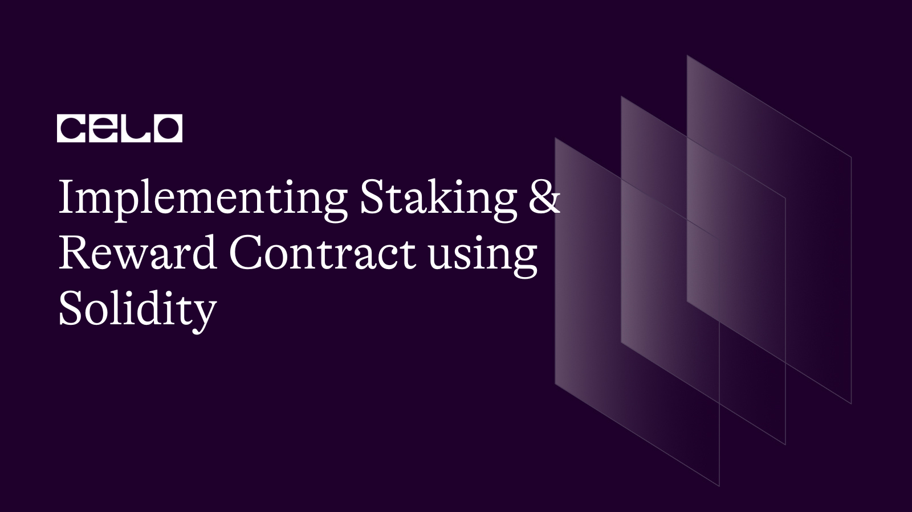

## Introduction

Staking and reward contracts are popular mechanisms for incentivizing participation in the activities of a blockchain network. Users can use these contracts to lock up their tokens as collateral to earn rewards. This article will look at using the Solidity programming language to create a staking and reward contract.

## Prerequisites

Before we begin, understanding what staking and reward contract entails, in general, is required to grasp this article fully. Below is a page you can visit before digesting this article:

[What is Staking?](https://chain.link/education-hub/what-is-staking-crypto)

# Implementing Steps

- **Define Data Structures**

Begin by defining the data structures and variables required for staking, such as the staker's address, staked amount, and staked time.

- **Staking Function**

Write a token staking function. Users should be able to stake a certain number of tokens using this function.

- **Unstaking Function**

Write a function that will unstake tokens. After a specified lock-up period, the function should allow users to withdraw their staked tokens.

- **Reward Calculation**

Calculate rewards based on the amount staked, the duration of staking, and the reward rate.

- **Claiming Reward**

Create a function that allocates, distributes, and allows stakeholders to claim their rewards..

- **Security Precautions**

To ensure the stability and security of the contract, implement security measures such as access control and error handling.

**Additional notes in the Possible Improvements section.**

- **Case Studies**

Create test cases to validate the contract's implementation and to look for bugs and vulnerabilities.

Depending on your specific requirements and use case, you may need to add or modify some of these steps.

# Data Structures and Variables

To keep track of total stake, timestamp, and reward earned, we must define the following data structures and variables:

- **Staker Information:** This struct data type is used to store information about each staker, such as their total stake, timestamp, and reward earned.

```solidity
   struct StakerData {
    uint256 totalStaked;
    uint256 lastStakedTimestamp;
    uint256 reward;
}
```

- **Stakers Mapping:** Thi mapping data type is used to store information about all stakers, with the address of the staker serving as the key.

```solidity
mapping(address => StakerData) public stakers;
```

- **Reward Rate:** This variable stores the rate stakers will receive rewards.

```solidity
    uint256 public rewardRate;
```

## Functions for Staking and Unstaking Tokens

- **Staking Function:** A function that allows users to stake a certain number of tokens and update the stakers mapping with the new information.

```solidity
function stake(uint256 amount) public {
    require(amount > 0, "Amount must be greater than 0");
    token.transferFrom(msg.sender, address(this), amount);

    // Update staker's data
    StakerData storage staker = stakers[msg.sender];
    staker.reward = staker.reward.add(calculateReward(msg.sender));
    staker.totalStaked = staker.totalStaked.add(amount);
    staker.lastStakedTimestamp = block.timestamp;
}
```

- **Unstaking Function:** This function allows stakers to unstake their token and update the staking information in the stakers mapping, and transfer any unstaked tokens to the staker's account..

```solidity
function unstake(uint256 amount) public {
    StakerData storage staker = stakers[msg.sender];
    require(staker.totalStaked >= amount, "Not enough staked tokens");

    // Update staker's data
    staker.reward = staker.reward.add(calculateReward(msg.sender));
    staker.totalStaked = staker.totalStaked.sub(amount);
    staker.lastStakedTimestamp = block.timestamp;

    token.transfer(msg.sender, amount);
}
```

## Functions for Calculating and Distributing Rewards

- **Reward Calculation Function:** A function for calculating rewards based on the staked amount, staking duration, and reward rate.

```solidity
function claimReward() public {
    StakerData storage staker = stakers[msg.sender];
    uint256 reward = staker.reward.add(calculateReward(msg.sender));
    require(reward > 0, "No reward to claim");

    staker.reward = 0;
    staker.lastStakedTimestamp = block.timestamp;

    token.transfer(msg.sender, reward);
}
```

- **Reward Distribution Function:** A function that distributes rewards to stakeholders. This function should be called regularly (e.g., daily/weekly/monthly), and use the reward calculation function to calculate the rewards for each stakeholder.

## Calculating and Distributing Reward

- **Calculating Rewards:** We can use a reward calculation function that takes a staker's address as an argument and returns the rewards earned to calculate each staker. The following formula is used in the calculation:

```
rewards = stakedAmount * rewardRate * elapsedTime;
```

Where `stakedAmount` is the number of tokens staked by the staker, `rewardRate` is the rate of distribution of rewards, `stakingDuration` is the amount of time that has passed since the tokens were staked, and `1 ether` is used to convert the elapsed time to seconds.

```solidity
function calculateReward(address user) public view returns (uint256) {
    StakerData storage staker = stakers[user];
    uint256 stakingDuration = block.timestamp.sub(staker.lastStakedTimestamp);
    return staker.totalStaked.mul(rewardRate).mul(stakingDuration).div(100);
}
```

## Claiming Rewards:

We will write a `claimReward` function that uses the reward calculation function to calculate the reward for a staker and distribute the reward. The function will then send the rewards to the address of the stakeholder.

```solidity
function claimReward() public {
    StakerData storage staker = stakers[msg.sender];
    uint256 reward = staker.reward.add(calculateReward(msg.sender));
    require(reward > 0, "No reward to claim");

    staker.reward = 0;
    staker.lastStakedTimestamp = block.timestamp;

    token.transfer(msg.sender, reward);
}
```

## Complete Staking Code in Solidity

```solidity
// SPDX-License-Identifier: MIT

pragma solidity ^0.8.0;

import "@openzeppelin/contracts/token/ERC20/IERC20.sol";
import "@openzeppelin/contracts/utils/math/SafeMath.sol";

contract Staking {

    using SafeMath for uint256;

    IERC20 public token;
    uint256 public rewardRate;

    // Struct to store user's staking data
    struct StakerData {
        uint256 totalStaked;
        uint256 lastStakedTimestamp;
        uint256 reward;
    }

    mapping(address => StakerData) public stakers;

    constructor(IERC20 _token, uint256 _rewardRate) {
        token = _token;
        rewardRate = _rewardRate;
    }

    function calculateReward(address user) public view returns (uint256) {
        StakerData storage staker = stakers[user];
        uint256 stakingDuration = block.timestamp.sub(staker.lastStakedTimestamp);
        return staker.totalStaked.mul(rewardRate).mul(stakingDuration).div(100);
    }

    function stake(uint256 amount) public {
        require(amount > 0, "Amount must be greater than 0");
        token.transferFrom(msg.sender, address(this), amount);

        // Update staker's data
        StakerData storage staker = stakers[msg.sender];
        staker.reward = staker.reward.add(calculateReward(msg.sender));
        staker.totalStaked = staker.totalStaked.add(amount);
        staker.lastStakedTimestamp = block.timestamp;
    }

    function unstake(uint256 amount) public {
        StakerData storage staker = stakers[msg.sender];
        require(staker.totalStaked >= amount, "Not enough staked tokens");

        // Update staker's data
        staker.reward = staker.reward.add(calculateReward(msg.sender));
        staker.totalStaked = staker.totalStaked.sub(amount);
        staker.lastStakedTimestamp = block.timestamp;

        token.transfer(msg.sender, amount);
    }

    function claimReward() public {
        StakerData storage staker = stakers[msg.sender];
        uint256 reward = staker.reward.add(calculateReward(msg.sender));
        require(reward > 0, "No reward to claim");

        staker.reward = 0;
        staker.lastStakedTimestamp = block.timestamp;

        token.transfer(msg.sender, reward);
    }

}
```

Github Repo: [https://github.com/iamoracle/celo-staking-contract](https://github.com/iamoracle/celo-staking-contract).

## How to deploy and test

You can find the complete repository on [https://github.com/iamoracle/staking-contract](Github).

## Possible Improvements

Contract not fit for production.
You need to transfer the reward to the deployed contract. Else, users will not be able to claim the reward.
You might be unable to unstake if other users have unstaked, e.g., they have used your funds as a reward while the reward pool is empty.
No start and stop mechanism.

## Conclusion

Staking and reward contracts can incentivize users to hold and lock up tokens on the blockchain. To ensure the success of your project, it is crucial to thoroughly test and deploy your contract while also considering potential improvements for production use.

## Next Step

The next step is to test, deploy, and document your contract.

## Author

[https://twitter.com/_iamoracle](Oyeniyi Abiola Peace) is a seasoned software and blockchain developer with a strong background in the technology industry, having graduated from the University of Ilorin with a degree in Telecommunication Science. He has over five years of programming experience in JavaScript, Python, PHP, and Solidity. Peace works as the CTO at DFMLab and a Community Moderator at Celo Blockchain. Peace enjoys reading and spending quality time with his family and friends when he is not immersed in coding or sharing his expertise with others, demonstrating his well-roundedness and passion for continuous learning and growth.

## References

- [Implementing Staking in Solidity](https://medium.com/hackernoon/implementing-staking-in-solidity-1687302a82cf)

- [How to Implement Staking in Solidity](https://hackernoon.com/implementing-staking-in-solidity-1687302a82cf)

- [How to Write a Smart Contract for Staking Token](https://betterprogramming.pub/how-to-write-a-smart-contract-for-stake-the-token-a46fdb9221b6)

- [https://m.youtube.com/watch?v=OJ-IRzCYSXI](Staking Rewards | Solidity 0.8)