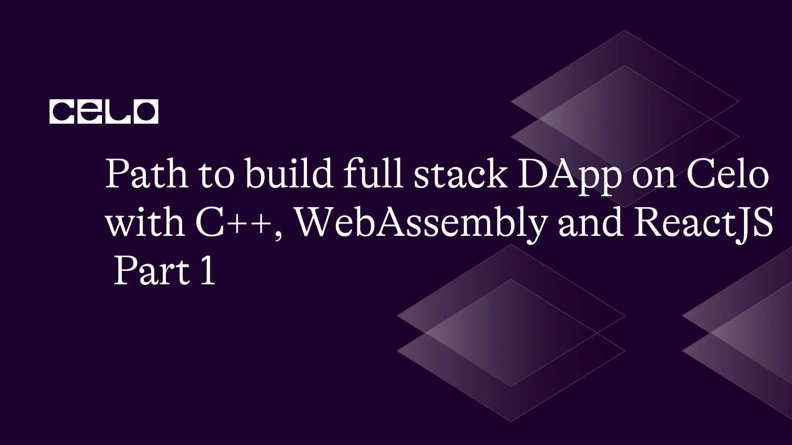

## Introduction

Building a full-stack DApp on Celo using C++ and WebAssembly involves several steps. First, you need to set up the `Celo SDK`, which provides JavaScript libraries for interacting with the Celo blockchain. Next, you'll need to write a smart contract in C++ and compile it to WebAssembly using the `eosio.cdt` compiler. After that, you can deploy the smart contract to the Celo network using the ContractKit instance and a Web3 provider. Finally, you can build the frontend of your DApp using React and interact with the smart contract using the Celo SDK. These are the focus of the series and it promises to be exciting and full of learning low-level stuff along the way.

In this first part of the series, we will learn how to write, build, compile, and deploy a smart contract with C++ as opposed to the traditional solidity we all know. We will learn how to create a C++ program to store and retrieve messages.

## Prerequisites

Basic knowledge of JavaScript, React, C++, and smart contract development.
1. a local development environment with Node.js and C++ installed.
1. a Celo account with testnet or mainnet funds.
1. eosio.cdt compiler

## Setting up the project

```bash
mkdir webassembly-dapp
cd webassembly-dapp
mkdir contracts
cd contracts
```

The above script creates a folder to organise all the requirements for the project. including codes and other assets. In the future, we will create a `react app`  and the `celo/contractkit` will be installed in this same folder. For now, let’s create a folder for the contract inside this folder to create our C++ smart contract.

## Write a smart contract in C++

Create a new file called `Message.cpp` in the `contracts` folder in your project directory. Write a C++ class that defines the logic of your smart contract. For example, let’s create a simple contract that allows users to store and retrieve a message.

```cpp
#include <eosio/eosio.hpp>
```

This line of code tells the computer to include a special library called `eosio/eosio.hpp`. This specific library provides functions and features for working with `EOSIO`, which is a blockchain platform.

```cpp
class [[eosio::contract]] my_contract : public eosio::contract {
public:
   using eosio::contract::contract;
```
In the above code, we are creating a special thing called a `contract.`A contract is like a set of rules and actions that we write for the blockchain. We give our contract a name, "my_contract." Our contract is based on another contract called `eosio::contract`, which already has some useful things we can use.

```cpp
[[eosio::action]]
void setmessage(std::string message) {
   require_auth(get_self());

   message_table messages(get_self(), get_first_receiver().value);
   auto iterator = messages.find(get_self().value);

   if (iterator == messages .end()) {
     messages.emplace(get_self(), [&](auto& row) {
        row.key = get_self();
        row.message = message;
     });
  } else {
     messages.modify(iterator, get_self(), [&](auto& row) {
        row.message = message;
     });
  }
}
```

This code defines a function called `setmessage`. It's like a special action that our contract can perform. When we call this function, we can give it a message as input. The function first checks if the person calling the function is authorized. It's like checking if you have permission to do something. Then, it creates or modifies a table called "messages" to store the message. If the message doesn't exist in the table, it adds a new entry with the message. If the message already exists, it updates the existing entry with the new message.

```cpp
[[eosio::action]]
std::string getmessage() {
   message_table messages(get_self(), get_first_receiver().value);
   auto iterator = messages.find(get_self().value);
   if (iterator == messages.end()) {
      return "No message found.";
   } else {
      return iterator->message;
   }
}
```

This part of the code defines another function called `getmessage`. When we call this function, it retrieves the message stored in the table. It looks for the message in the table called `messages` and checks if it exists. If the message is not found, it returns the text "No message found." If the message is found, it returns the actual message that was stored.

```cpp
private:
   struct [[eosio::table]] message_row {
      uint64_t key;
      std::string message;
      uint64_t primary_key() const { return key; }
   };
   typedef eosio::multi_index<eosio::name("messages"), message_row> message_table;
};

EOSIO_DISPATCH(my_contract, (setmessage)(getmessage));
```
 In this final part, we define a structure called `message_row` that represents each entry in the "messages" table. It has two pieces of information: a key and a message. The key helps identify each entry, and the message holds the actual message content. We also create a table type called "message_table" using EOSIO's multi_index, which allows us to store and manage multiple entries. Finally, we use the `EOSIO_DISPATCH` macro to link our contract and its actions to the EOSIO system. It tells the system that our contract has the `setmessage` and `getmessage` actions that can be called.

In totality, this code represents a contract called "my_contract" that can be deployed on the EOSIO blockchain. It has actions to set and retrieve messages stored in a table called "messages." The `setmessage` action allows adding or updating a message, while the `getmessage` action retrieves the stored message. It's like having a special program on the blockchain that can store and fetch messages.


## Summary

### The final code will look like this followed by a brief of what they do together

```cpp
#include <eosio/eosio.hpp>

class [[eosio::contract]] my_contract : public eosio::contract {
public:
   using eosio::contract::contract;

   [[eosio::action]]
   void setmessage(std::string message) {
      require_auth(get_self());

      message_table messages(get_self(), get_first_receiver().value);
      auto iterator = messages.find(get_self().value);

      if (iterator == messages.end()) {
        messages.emplace(get_self(), [&](auto& row) {
           row.key = get_self();
           row.message = message;
        });
     } else {
        messages.modify(iterator, get_self(), [&](auto& row) {
           row.message = message;
        });
     }
  }

  [[eosio::action]]
  std::string getmessage() {
     message_table messages(get_self(), get_first_receiver().value);
     auto iterator = messages.find(get_self().value);
     if (iterator == messages.end()) {
        return "No message found.";
     } else {
        return iterator->message;
     }
  }
private:
struct [[eosio::table]] message_row {
uint64_t key;
std::string message;
     uint64_t primary_key() const { return key; }
  };
  typedef eosio::multi_index<eosio::name("messages"), message_row> message_table;
};

EOSIO_DISPATCH(my_contract, (setmessage)(getmessage));
```

This contract includes two actions: `setmessage`, which allows the contract owner to set the message, and `getmessage`, which allows anyone to retrieve the message.

### Brief Description of the complete code

The `my_contract` class is declared, which inherits from eosio::contract provided by the EOSIO C++ library.

The `using eosio::contract::contract;` line brings the base class constructor into the current class.

The setmessage action is defined using the `[[eosio::action]]` attribute. This action allows the contract owner to set the message. The `require_auth(get_self())` line ensures that only the contract itself can call this action.

The message_table is a multi-index table that stores messages. The messages table is scoped to the contract itself `(get_self())` and the receiver of the action `(get_first_receiver().value)`.

In the `setmessage` action, the code checks if a message with the contract's key exists in the messages table using `messages.find(get_self().value)`. If no message is found, a new entry is added to the table using `messages.emplace`. Otherwise, the existing message is modified using `messages.modify`.

The `getmessage` action retrieves the message from the messages table. It checks if a message with the contract's key exists and returns the message if one is found. Otherwise, it returns the string "No message found."

The `message_row` struct represents a row in the messages table. It has a key of type `uint64_t` and a message of type `std::string`. The `primary_key` function returns the primary key for the table.

The `EOSIO_DISPATCH` macro generates the dispatch logic required for the contract. It exposes the `setmessage` and `getmessage` actions to be called from outside the contract.

By fixing the bug, we replaced `row.key = get_self(); with row.key = get_self().value;` to assign the key correctly. This ensures that the contract's account name is used as the key in the messages table.

## What is EOSIO?

EOSIO is a blockchain protocol and development platform designed for creating decentralized applications (DApps). It offers features like Delegated Proof of Stake (DPoS) for fast transactions and scalability. EOSIO supports parallel execution of smart contracts and introduces a resource management system for fair resource distribution. Developers benefit from a wide range of tools for smart contract development and testing. EOSIO also incorporates a governance model that allows token holders to participate in decision-making. This platform has been used in various domains like DeFi, gaming, social media, and supply chain management. Its focus on scalability, performance, and developer-friendly features has made it a popular choice among blockchain developers.

## Procedure to install eosio for the contract deployment

1. Install the eosio.cdt compiler by following the instructions in the official [documentation](https://github.com/EOSIO/eosio.cdt#binary-releases).

4. Compile the smart contract to WebAssembly by running the following command in your terminal:

```bash
eosio-cpp my-contract.cpp -o my-contract.wasm
```

## Deploy the smart contract to the Celo network

1. Sign up for a Celo wallet if you haven't already done so.
2. Fund your wallet with testnet or mainnet funds.
3. Use the `ContractKit` instance and a Web3 provider to deploy the smart contract to the Celo

This is the focus of the next part, we will see how we can deploy this on the frontend with ReactJS and how to fully make the smart contract run on the Celo testnet and mainnet. So look forward to that by following this [repository](https://github.com/Taiwrash/webassembly-x-web3) for the full article.

## Conclusion

C++ is a powerful programming language known for its efficiency and performance. When combined with WebAssembly (Wasm), it becomes a great choice for developing decentralized applications (DApps) on blockchain platforms like EOSIO. Using C++ and WebAssembly, developers can write smart contracts with complex logic and advanced features. By compiling C++ code into WebAssembly bytecode, it can be executed by web browsers and deployed on blockchain platforms. This enables interaction with contracts using JavaScript or TypeScript-based frontends. With C++ and WebAssembly, developers have control over the development process, leveraging the performance benefits of C++ while utilizing the capabilities of WebAssembly and blockchain platforms. This empowers the creation of efficient and sophisticated DApps that can cater to diverse industry requirements.

Overall, C++ with WebAssembly provides a compelling pathway for developing full-stack DApps, offering the power of a widely adopted programming language combined with the advantages of WebAssembly's portability and blockchain platforms' decentralized capabilities.

## About the Author

Hey, I am Rasheed Mudasiru. A software developer who is passionate about community, open source and developer relations: I write about DevOps, automation, deployments and cloud computing.


